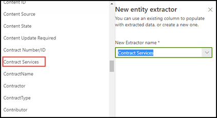

# 在建立擷取器時運用字詞庫分類法Leverage term store taxonomy when creating an extractor

 

> [!VIDEO https://www.microsoft.com/videoplayer/embed/RE4GpJJ]  

 

當您使用 SharePoint Syntex 中的文件瞭解模型來建立擷取器時，可以利用[字詞庫](https://docs.microsoft.com/sharepoint/managed-metadata)中的全域字詞組來顯示所選取資料的首選字詞。When you create an extractor in your document understanding model using SharePoint Syntex, you can take advantage of global term sets in the [term store](https://docs.microsoft.com/sharepoint/managed-metadata) to display preferred terms for data that you extract.  

舉例來說，您的模型識別並分類上傳至文件庫的所有 **[合約]** 文件。As an example, your model identifies and classifies all **Contract** documents that are uploaded to the document library.  此外，模型也會從每個合約擷取 **[合約服務]** 值，並將它顯示在文件庫檢視的欄中。Additionally, the model also extracts a **Contract Service** value from each contract, and will display it in a column in your library view. 在合於中的各種合約服務值中，貴公司已不再使用並重新命名了數個舊值。Among the various Contract Services values in the contracts, there are several older values that your company no longer uses and have been renamed. 例如，所有提及 *「設計」*、*「圖形」* 或 *「地形」* 契约服務的條款現在都應該稱為 *「創造性」*。For example, all references to the terms *Design*, *Graphics*, or *Topography* contract services should now be called *Creative*. 每當您的模型從合約文件中選取過期的字詞時，您希望它在庫檢視中顯示目前字詞 「創造性」。Whenever your model extracts one of the outdated terms from a contract document, you want it to display the current term - Creative - in your library view. 在下列範例中，在訓練模型時我們看到其中一個範例檔包含過期的字詞 *「設計」*。In the example below, while training the model we see that one sample document contains the outdated term of *Design*.

    

## 在您的擷取器中使用受管理的中繼資料欄Use a Managed metadata column in your extractor

在 SharePoint 系統管理中心的 [受管理的中繼資料] 服務 (MMS) 字詞庫中設定字詞組。Term sets are configured in the Managed Metadata services (MMS) term store in the SharePoint admin center. 在下列範例中，*[合約服務]* [字詞組](https://docs.microsoft.com/sharepoint/managed-metadata#term-set) 設定為包含數個字詞，包括 *「創造性」*。In the example below, the *Contract Services* [term set](https://docs.microsoft.com/sharepoint/managed-metadata#term-set) is configured to include several terms, including *Creative*.  它的詳細資料表明這個字詞有三個同義字（*「設計」*、*「圖形」* 和 *「地形」*），這些同義詞應該被翻譯成 *「創造性」*。The details for it show that the term has three synonyms (*Design*, *Graphics*, and *Topography*) and the synonyms should be translated to *Creative*. 

    

您可能會想要在字詞組中使用同義字的原因有很多。There could be many reasons why you might want to use a synonym in your term set. 例如，可能存在過期字詞、重新命名的字詞或組織部門之間在命名方面的差异。For example, there could be outdated terms, renamed terms, or variations between your organizations departments on naming.

若要使受管理的中繼資料欄位可供您在模型中建立擷取器時使用，您需要[將其添加為受管理的中繼資料網站欄](https://support.microsoft.com/office/8fad9e35-a618-4400-b3c7-46f02785d27f)。To make the managed metadata field available to select when you create your extractor in your model, you need to [add it as a managed-metadata site column](https://support.microsoft.com/office/8fad9e35-a618-4400-b3c7-46f02785d27f). 新增網站欄後，您可以在建立模型擷取器時進行選取。After you add the site column, you can select it when you create the extractor for your model.

    

將模型套用至文件庫後，當文件上載到庫時，當擷取器找到任何同義字值（*「設計」*、*「圖形」* 和 *「地形」*）時，*創意服務* 欄將顯示首選字詞（*「創造性」*）。After applying your model to the document library, when documents are uploaded to library, the *Creative Services* column will display the preferred term (*Creative*) when the extractor finds any of the synonym values (*Design*, *Graphics*, and *Topography*).

    

## 另請參閱See Also
[受管理的中繼資料簡介Introduction to Managed Metadata](https://docs.microsoft.com/sharepoint/managed-metadata#terms)

[建立擷取器Create an extractor](create-an-extractor.md)

[建立受管理的中繼資料欄Create a managed metadata column](https://support.microsoft.com/office/create-a-managed-metadata-column-8fad9e35-a618-4400-b3c7-46f02785d27f?redirectSourcePath=%252farticle%252fc2a06717-8105-4aea-890d-3082853ab7b7&ui=en-US&rs=en-US&ad=US)

