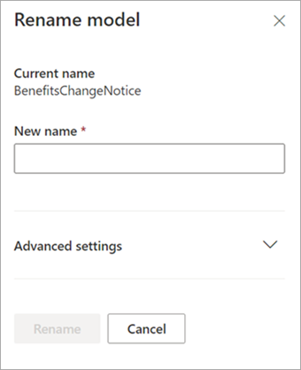

# 在 Microsoft SharePoint Syntex 中重新命名模型Rename a model in Microsoft SharePoint Syntex

有時，您可能會想要重新命名文件瞭解模型。At some point, you might want to rename a document understanding model. 常見的範例是，當您建立模型的初始草稿時，您可能沒有針對最終名稱給予太多想法 (例如，您可能將其命名為 「AlexWilburModel1」)。A common example is when you create an initial draft of a model, you might not have given a lot of thought as to the final name (for example, you might have named it “AlexWilburModel1”). 當您快要完成模型並加以使用時，您發現「合約續約」是更適當的名稱，而您想要加以重新命名。As you come closer to finalizing the model and putting it to use, you realize that a more proper name would be “Contract Renewals,” and you want to rename it.  

另一個範例是當貴組織決定以不同名稱指稱某程序或檔案類型時。Another example is when your organization makes a decision to refer to a process or document type by a different name. 例如，在您建立模型並準備好加以套用之後，貴組織可能會強制規定所有「合約」現在正式稱為「協議」。For example, after you create your model and are ready to apply it, your organization might mandate that all “Contracts” will now formally be referred to as “Agreements.” 如有需要，您可以選擇將模型從「合約續約」重新命名為「協議續約」。If needed, you can choose to rename your model from “Contract Renewals” to “Agreement Renewals.”

> [!IMPORTANT]
> 只有在文件瞭解模型尚未套用至文件庫時，才能重新命名。You can only rename a document understanding model if it has not been applied to a document library. 

重新命名模型也會將與模型相關聯的[內容類型](/sharepoint/governance/content-type-and-workflow-planning#content-type-overview)重新命名。Renaming a model also renames the [content type](/sharepoint/governance/content-type-and-workflow-planning#content-type-overview) that is associated with the model.

## 重新命名模型Rename a model

請遵循下列步驟重新命名文件瞭解模型。Follow these steps to rename a document understanding model.

1. 從內容中心選取 **[模型]** 查看您的模型清單。From the content center, select **Models** to see your models list.

2. 在 **[模型]** 頁面上，選取您想要重新命名的模型。On the **Models** page, select the model you want to rename.

3. 使用功能區或 **[顯示動作]** 按鈕 (在模型名稱旁邊)，選取 **[重新命名]**。By using either the ribbon or the **Show actions** button (next to the model name), select **Rename**.  

    ![模型頁面的螢幕擷取畫面，其顯示選取的模型，且醒目提示 [重新命名] 選項。](../media/content-understanding/select-model-rename-both.png)  

4. 在 **[重新命名模型]** 面板：On the **Rename model** panel:

   a.a. 在 **[新名稱]** 下，輸入要重新命名之模型的新名稱。Under **New name**, enter the new name of the model that you want to rename. 

      

   b.b. (選用) 在 **[進階設定]** 下，選取您是否要相關聯現有的[內容類型](/sharepoint/governance/content-type-and-workflow-planning#content-type-overview)。(Optional) Under **Advanced settings**, select whether you want to associate an existing [content type](/sharepoint/governance/content-type-and-workflow-planning#content-type-overview). 如果您選擇 **[使用現有的內容類型]**，模型將會重新命名，以符合選取的內容類型。If you choose **Use an existing content type**, the model will be renamed to match the selected content type.

5. 選取 **[重新命名]**。Select **Rename**.

## 另請參閱See Also
[建立分類器Create a classifier](create-a-classifier.md)

[建立擷取器Create an extractor](create-an-extractor.md)

[重新命名擷取器Rename an extractor](rename-an-extractor.md)

[文件瞭解概觀Document Understanding overview](document-understanding-overview.md)

[說明類型Explanation types](explanation-types-overview.md)

[套用模型Apply a model](apply-a-model.md) 
