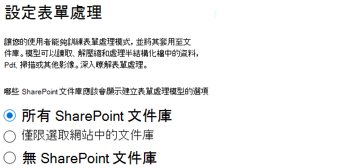
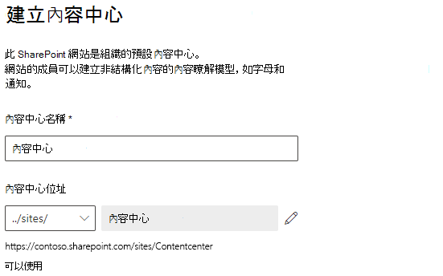
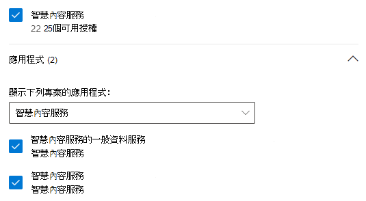

# 設定 SharePoint Syntex

系統管理員可以使用 Microsoft 365 系統管理中心來設定 [Microsoft SharePoint Syntex](index.md)。 

開始之前，請先考慮下列事項：

- 其中哪些 SharePoint 網站您將會啟用表單處理？ 所有網站、部分或選取的網站嗎？
- 您的預設內容中心名稱為何？

您可以在 Microsoft 365 系統管理中心初次設定之後變更您的設定。

設定之前，請務必針對您環境中的設定和設定內容理解的最佳方式進行規劃。 例如，您需要做出下列決定：

- 您想要啟用表單處理的 SharePoint 網站 - 所有網站、部分或選取的網站
- 內容中心的名稱和系統管理員

## 需求 

> [!NOTE]
> 您必須具備全域系統管理員或 SharePoint 系統管理員權限才能存取 Microsoft 365 系統管理中心，並設定 SharePoint Syntex。

如果您是系統管理員，您也可以在設定之後隨時變更所選的設定，以及在 Microsoft 365 系統管理中心中的所有內容瞭解管理設定。

## 若要設定 SharePoint Syntex

1. 在 [Microsoft 365 系統管理中心] 中，選取 **[設定]**，然後查看 **[檔案和內容]** 區段。

2. 在 **[檔案和內容]** 區段中，選取 **[自動化內容瞭解]**。 

3. 在 **[自動化內容瞭解]** 頁面上，按一下 **[開始使用]** 逐步執行設定流程。 

    > [!div class="mx-imgBorder"]
    >  

4. 在 **[設定表單處理]** 頁面上，您可以選擇是否要讓使用者能夠在特定 SharePoint 文件庫中建立表單處理模型。 您可以在 [文件庫] 功能區中使用功能表選項，在啟用此功能的 SharePoint 文件庫中 **[建立表單處理模型]**。
 
     針對 **哪個 SharePoint 文件庫應顯示建立表單處理模型的選項**，您可以選取： 
      - **所有 SharePoint 文件庫**，讓貴組織中的所有 SharePoint 文件庫皆可使用。 
      - **僅限選取 SharePoint 網站中的文件庫**，然後選取您要讓其可供使用的網站，或上傳最多 50 個網站的清單。 
      - **不使用 SharePoint 文件庫**，如果您不想讓任何網站都能使用 SharePoint 文件庫 (您可以在設定後變更)。

   > [!div class="mx-imgBorder"]
   > 

   > [!Note]
   > 當網站被包含之後移除網站，並不會影響該網站中文件庫套用的現有模型，或將文件理解模型套用至文件庫的功能。 
    
5. 在 **[建立內容中心]** 頁面上，您可以建立 SharePoint 內容中心網站，讓使用者建立及管理文件理解模型。

    1. 在 **[網站名稱]** 中，輸入您要給予內容中心網站的名稱。
    
    1. **[網站位址]** 會根據您為網站名稱所選取的內容，顯示網站的 URL。 如果您想要變更，請按一下 **[編輯]**。

       > [!div class="mx-imgBorder"]
       >  

       選取 **[下一步]**。

6. 在 **[檢閱並完成]** 頁面上，您可以查看您選取的設定，並選擇進行變更。 如果您對您的選擇感到滿意，請選取 **[啟用]**。

7. 在 [確認] 頁面上，按一下 **[完成]**。

8. 您將會回到 **[自動化內容瞭解]** 頁面。 在此頁面上，您可以選取 **[管理]**，以對設定進行任何變更。 

## 指派授權

一旦您設定 SharePoint Syntex 之後，您必須為將使用任何 SharePoint Syntex 功能的使用者指派授權。

若要指派授權：

1. 在 Microsoft 365 系統管理中心中，在 **[使用者]** 底下，按一下 **[作用中使用者]**。

2. 選取您要授權的使用者，然後按一下 **[管理產品授權]**。

3. 選取 **[指派更多]**。

4. 選取 **[SharePoint Server]**。 在 **[應用程式]** 下，確定選取 **[Common Data Service for SharePoint Syntex]**、**[SharePoint Syntex]** 和 **[SharePoint Syntex - SPO 類型]**。

    > [!div class="mx-imgBorder"]
    > 

5. 按一下 **[儲存變更]**。

## AI Builder 點數

如果貴組織中的 SharePoint Syntex 有 300 個或更多 SharePoint Syntex 授權，您將會獲一百萬的 AI Builder 點數。 如果您的授權少於 300 個，您必須購買 AI Builder 點數，才能使用表單處理。

您可以使用 [AI Builder  計算機](https://powerapps.microsoft.com/ai-builder-calculator)，來估計最適合您的 AI Builder 容量。

請移至 [Power Platform 系統管理中心](https://admin.powerplatform.microsoft.com/resources/capacity)查看您的點數和使用狀況。

## 另請參閱

[表單處理模型概觀](https://docs.microsoft.com/ai-builder/form-processing-model-overview)

[逐步執行：如何建立文件理解模型 (影片)](https://www.youtube.com/watch?v=DymSHObD-bg)
