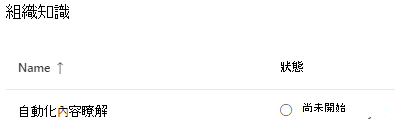

# 設定內容瞭解 (預覽) Set up content understanding (Preview)

> [!Note] 
> 本文內容適用于 Project Cortex 私人預覽。The content in this article is for Project Cortex Private Preview. [進一步瞭解專案 Cortex](https://aka.ms/projectcortex)。[Find out more about Project Cortex](https://aka.ms/projectcortex).

系統管理員可以使用 Microsoft 365 系統管理中心來設定和設定內容瞭解。Admins can use the Microsoft 365 admin center to set up and configure content understanding. 

設定之前，請務必規劃如何在環境中設定和設定內容瞭解的最佳方式。Prior to setup, make sure to plan for the best way to set up and configure content understanding in your environment. 例如，您將需要考慮下列事項：For example, you will need to make considerations about the following:
- 您將在哪些 SharePoint 網站上啟用表單處理？Which SharePoint sites will you enable form processing? 所有的網站、部分或選取的網站？All of them, some, or select sites?
- 內容中心的名稱，以及主要網站管理員的名稱。Name of your content center, and who is the primary site admin?

系統管理員也可以在安裝程式完成之後，透過 Microsoft 365 系統管理中心的內容瞭解管理設定，對選取的設定進行變更。An admin can also make changes to your selected settings anytime after setup through the content understanding management settings in the Microsoft 365 admin center.

## 需求Requirements 
您必須具有全域管理員或 SharePoint 系統管理員許可權，才能存取 Microsoft 365 系統管理中心和設定內容瞭解。You must have Global Admin or SharePoint admin permissions to be able to access the Microsoft 365 admin center and set up content understanding.

## 設定內容瞭解To set up content understanding

1. 在 Microsoft 365 系統管理中心中，選取 [**安裝**]，然後查看 [**組織知識**] 區段。In the Microsoft 365 admin center, select **Setup**, and then view the **Organizational knowledge** section.
2. 在 [**組織知識**] 區段中，選取 [**自動瞭解內容**]。In the **Organizational knowledge** section, select **Automate content understanding**. 

     

3. 在 [**自動化內容瞭解**] 頁面上，按一下 [**快速入門**] 以逐步引導您完成安裝程式。On the **Automate content understanding** page, click **Get started** to walk you through the setup process. 

     

4. 在 [**設定表單處理**] 頁面上，您可以選擇是否要讓使用者能夠使用 AI 建立器在特定 SharePoint 文件庫中建立表單處理模型。On the **Configure Form Processing** page, you can choose if you want to let users be able to use AI Builder to create form processing models in specific SharePoint document libraries. [文件庫] 功能區中會提供功能表選項，以在啟用該模型的 SharePoint 文件庫中**建立表單處理模型**。A menu option will be available in the document library ribbon to **Create a form processing model** in SharePoint document libraries in which it is enabled.
 
     **若要 SharePoint 文件庫應該顯示以建立表單處理模型的選項**，您可以選取：For **Which SharePoint libraries should show option to create a form processing model**, you can select: 
    - **所有 SharePoint 文件庫**，使其可供您租使用者中的所有 SharePoint 庫使用。**All SharePoint libraries** to make it available to all SharePoint libraries in your tenant. 
    - **僅限選取的網站中**的文件庫，然後選取您要讓其可供使用的網站。**Only libraries in selected sites**, and then select the sites in which you want to make it available. 
    - 如果您目前不想讓任何網站使用**SharePoint 程式庫** (您可以在 setup) 之後變更此設定。**No SharePoint libraries** if you currently don't want to make it available to any sites (you can change this after setup).
 

   

 

   > [!Note]
   > 在 SharePoint 文件庫上啟用此設定不會影響已套用至文件庫的現有模型，也不會影響將檔理解模型套用至文件庫的功能。Enabling this setting on a SharePoint document library does not affect existing models applied to the library or the ability to apply document understanding models to a library. 

    
5. 在 [**建立內容中心**] 頁面上，您可以建立 SharePoint 內容中心網站，您的使用者可以在該網站上建立及管理檔理解模型。On the **Create Content Center** page, you can create a SharePoint content center site on which your users can create and manage document understanding models.  
    a.a. 在 [**網站名稱**] 中，輸入您要提供給內容中心網站的名稱。For **Site name**, type the name you want to give your content center site. 
    b.b. **網站位址**會根據您為網站名稱所選取的內容，顯示網站的 URL。The **Site address** will show the URL for your site, based on what you selected for the site name. 

    > [!Note] 
    > 您可以選擇任何支援的語言，請注意，僅能為英文建立內容瞭解模型。While you can select any supported language, note that content understanding models can only be created for English. 

       

    選取 [下一步]\*\*\*\*。Select **Next**.
6. 在 [**完成與複查]** 頁面上，您可以查看選取的設定，並選擇進行變更。On the **Finish and review** page, you can look at your selected setting and choose to make changes. 如果您對選擇滿意，請選取 [**啟動**]。If you are satisfied with your selections, select **Activate**.

7. 隨即會顯示 [**內容瞭解**已啟動] 頁面，確認系統已新增您的表單處理喜好設定，以及建立內容中心網站。The **Content understanding activated** page will display, confirming that the system has added your form processing preferences and creating the Content Center site. 選取 **[完成]**。Select **Done**.

8. 您將會傳回 [**自動化內容瞭解**] 頁面。You'll be returned to your **Automate content understanding** page. 您可以從這個頁面，選取 [**管理**]，對您的設定設定進行任何變更。From this page, you can select **Manage** to make any changes to your configuration settings. 

## 另請參閱See also

  

