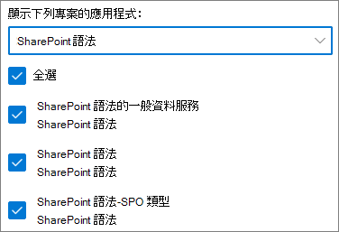

# 設定 SharePoint Syntex

系統管理員可以使用 Microsoft 365 系統管理中心來設定 [Microsoft SharePoint Syntex](index.md)。 

開始之前，請先考慮下列事項：

- Which SharePoint sites will you enable form processing? All of them, some, or select sites?
- 您的預設內容中心名稱為何？

您可以在 Microsoft 365 系統管理中心初次設定之後變更您的設定。

Prior to setup, make sure to plan for the best way to set up and configure content understanding in your environment. For example, you need to make considerations about the following names of:

- 您想要啟用表單處理的 SharePoint 網站 - 所有網站、部分或選取的網站
- 您的內容中心和主要網站系統管理員的名稱

## 需求 

> [!NOTE]
> 您必須具備全域系統管理員或 SharePoint 系統管理員權限才能存取 Microsoft 365 系統管理中心，並設定內容瞭解。

如果您是系統管理員，您也可以在設定之後隨時變更所選的設定，以及在 Microsoft 365 系統管理中心中的所有內容瞭解管理設定。

## 若要設定 SharePoint Syntex

1. 在 [Microsoft 365 系統管理中心] 中，選取 **[設定]**，然後查看 **[檔案和內容]** 區段。

2. 在 **[檔案和內容]** 區段中，選取 **[自動化內容瞭解]**。 

3. 在 **[自動化內容瞭解]** 頁面上，按一下 **[開始使用]** 逐步執行設定流程。 

    > [!div class="mx-imgBorder"]
    >  

4. On the **Configure Form Processing** page, you can choose if you want to let users be able to create form processing models in specific SharePoint document libraries. A menu option will be available in the document library ribbon to **Create a form processing model** in SharePoint document libraries in which it is enabled.
 
     針對 **哪個 SharePoint 文件庫應顯示建立表單處理模型的選項**，您可以選取： 
      - **所有 SharePoint 文件庫**，讓組織中的所有 SharePoint 文件庫皆可使用。 
      - **僅限選取網站中的文件庫**，然後選取您要讓其可供使用的網站，或上傳最多 50 個網站的清單。 
      - **不使用 SharePoint 文件庫**，如果您不想讓任何網站都能使用 SharePoint 文件庫 (您可以在設定後變更)。

   > [!div class="mx-imgBorder"]
   > 

   > [!Note]
   > 當網站被包含之後移除網站，並不會影響該網站中文件庫套用的現有模型，或將文件理解模型套用至文件庫的功能。 
    
5. 在 **[建立內容中心]** 頁面上，您可以建立 SharePoint 內容中心網站，讓使用者建立及管理文件理解模型。

    1. 在 **[網站名稱]** 中，輸入您要給予內容中心網站的名稱。
    
    1. The **Site address** will show the URL for your site, based on what you selected for the site name. If you want to change it, click **Edit**.

       > [!div class="mx-imgBorder"]
       >  

       選取 **[下一步]**。

6. On the **Review and finish** page, you can look at your selected setting and choose to make changes. If you are satisfied with your selections, select **Activate**.

7. 在 [確認] 頁面上，按一下 **[完成]**。

8. You'll be returned to your **Automate content understanding** page. From this page, you can select **Manage** to make any changes to your configuration settings. 

## 指派授權

一旦您設定 SharePoint Syntex 之後，您必須為將使用任何 SharePoint Syntex 功能的使用者指派授權。

若要指派授權：

1. 在 Microsoft 365 系統管理中心中，在 **[使用者]** 底下，按一下 **[作用中使用者]**。

2. 選取您要授權的使用者，然後按一下 **[管理產品授權]**。

3. 選取 **[指派更多]**。

4. Select **SharePoint Syntex**. Under **Apps**, make sure **Common Data Service for SharePoint Syntex**, **SharePoint Syntex**, and **SharePoint Syntex - SPO type** are all selected.

    > [!div class="mx-imgBorder"]
    > 

5. 按一下 **[儲存變更]**。

## AI Builder 點數

If you have 300 or more SharePoint Syntex licenses for SharePoint Syntex in your organization, you will be allocated one million AI Builder credits. If you have fewer than 300 licenses, you must purchase AI Builder credits in order to use forms processing.

您可以使用 [AI Builder  計算機](https://powerapps.microsoft.com/ai-builder-calculator)，來估計最適合您的 AI Builder 容量。

請移至 [Power Platform 系統管理中心](https://admin.powerplatform.microsoft.com/resources/capacity)查看您的點數和使用狀況。

## 另請參閱

[表單處理模型概觀](https://docs.microsoft.com/ai-builder/form-processing-model-overview)

[逐步執行：如何建立文件理解模型 (影片)](https://www.youtube.com/watch?v=DymSHObD-bg)

