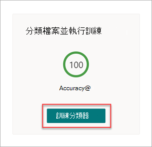
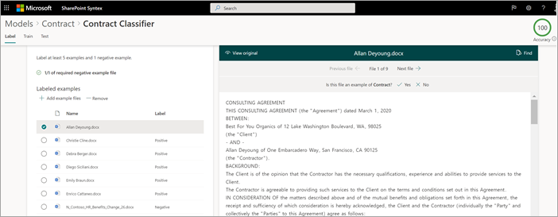
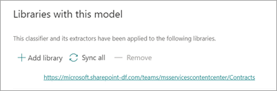

# 步驟 1.Step 1. 使用 SharePoint Syntex 來識別合約檔案及提取資料Use SharePoint Syntex to identify contract files and extract data

您的組織需要從您接收的許多檔案中識別和分類所有合約檔的方法。Your organization needs a way to identify and classify all contract documents from the many files you receive. 您也想能夠在每個識別 (的合約檔案中快速查看數個重要元素，例如， *客戶*、 *合同工* 和 *費用金額*) 。You also want to be able to quickly view several key elements in each of the contract files identified (for example, *Client*, *Contractor*, and *Fee amount*). 若要這麼做，您可以使用[SharePoint Syntex](index.md)建立檔理解模型，並將其套用至文件庫。You can do this by using [SharePoint Syntex](index.md) to create a document understanding model and applying it to a document library.

## 處理常式概述Overview of the process

檔[瞭解](document-understanding-overview.md)使用智慧 (AI) 模型，以自動化檔案的分類和資訊提取。[Document understanding](document-understanding-overview.md) uses artificial intelligence (AI) models to automate classification of files and extraction of information. 檔理解模型在從非結構化檔或半結構化檔中解壓縮資訊時也是最佳的方式，而您所需的資訊不會包含在表格或表單中（如合約）。Document understanding models are also optimal in extracting information from unstructured and semi-structured documents where the information you need isn't contained in tables or forms, such as contracts.

1. 首先，您必須尋找至少五個範例檔案，您可以用來 "訓練" 模型，以搜尋您嘗試識別 (合約) 之內容類型的特定特性。First, you need to find at least five example files that you can use to "train" the model to search for characteristics that are specific to the content type you're trying to identify (a contract). 

2. 使用 SharePoint Syntex，建立新的檔理解模型。Using SharePoint Syntex, create a new document understanding model. 您必須先 [建立分類符](create-a-classifier.md)，才能使用您的範例檔案。Using your example files, you need to [create a classifier](create-a-classifier.md). 訓練分類器與範例檔案，您可以教它搜尋您在公司合同中所看到的特定特性。By training the classifier with your example files, you teach it to search for characteristics that are specific to what you would see in your company's contracts. 例如， [建立一個 "釋義"](create-a-classifier.md#create-an-explanation) ，搜尋您的合約中的特定字串，例如 *服務合約*、 *合約條款* 和 *補償*。For example, [create an "explanation"](create-a-classifier.md#create-an-explanation) that searches for specific strings that are in your contracts, such as *Service Agreement*, *Terms of Agreement*, and *Compensation*. 您甚至可以訓練說明，以在檔的特定區段中尋找這些字串，或位於其他字串旁邊。You can even train your explanation to look for these strings in specific sections of the document, or located next to other strings. 當您認為您已使用所需的資訊訓練您的分類程式時，您可以在範例檔案的範例集合上測試模型，以查看其效率。When you think you have trained your classifier with the information it needs, you can test your model on a sample set of example files to see how efficient it is. 測試完成之後，您可以視需要選擇變更您的說明，使其更有效率。After testing, if needed you can choose to make changes to your explanations to make them more efficient. 

3. 在您的模型中，您可以 [建立解壓縮程式](create-an-extractor.md) ，以從每個合約提取特定的資料片段。In your model, you can [create an extractor](create-an-extractor.md) to pull out specific pieces of data from each contract. 例如，對於每個合約，您最關心的資訊是用戶端是誰、合同工的名稱，以及總成本。For example, for each contract, the information you're most concerned about is who the client is, the name of the contractor, and the total cost.

4. 成功建立模型之後，請[將其套用至 SharePoint 文件庫](apply-a-model.md)。After you successfully create your model, [apply it to a SharePoint document library](apply-a-model.md). 當您將檔上傳至文件庫時，您的檔理解模型會執行，並會識別和分類所有符合您在模型中定義的合約內容類型的檔案。As you upload documents to the document library, your document understanding model will run and will identify and classify all files that match the contracts content type you defined in your model. 分類為合約的所有檔案都會顯示在自訂文件庫視圖中。All files that are classified as contracts will display in a custom library view. 檔案也會顯示您在解壓縮程式中所定義之每個合約的值。The files will also display the values from each contract that you defined in your extractor.

   

5. 如果您有合約的保留需求，也可以使用您的模型來套用 [保留標籤](apply-a-retention-label-to-a-model.md) ，以防止在指定的時間內刪除您的合約。If you have retention requirements for your contracts, you can also use your model to [apply a retention label](apply-a-retention-label-to-a-model.md) that will prevent your contracts from being deleted for a specified period of time.

## 建立及訓練模型的步驟Steps to create and train your model

> [!NOTE]
> 針對這些步驟，您可以使用「 [合約管理解決方案資產](https://github.com/pnp/syntex-samples/tree/main/scenario%20assets/Contracts%20Management)」存放庫中的範例檔案。For these steps, you can use the example files in the [Contracts Management Solution Assets repository](https://github.com/pnp/syntex-samples/tree/main/scenario%20assets/Contracts%20Management). 此存放庫中的範例同時包含檔理解模型檔案，以及用來訓練模型的檔案。The examples in this repository contain both the document understanding model files and the files used to train the model.

### 建立合同模型Create a Contract model

第一步是建立合約模型。The first step is to create your Contract model.

1. 從 [內容中心] 選取 **[新增]**，然後選取 **[建立模型]**。From the content center, select **New**, and then **Create a model**.

2. 在 [ **新增檔瞭解模型** ] 窗格的 [ **名稱** ] 欄位中，輸入模型的名稱。On the **New document understanding model** pane, in the **Name** field, type the name of the model. 針對此合約管理解決方案，您可以命名模型 *合約*。For this contract management solution, you can name the model *Contract*.

4. 選擇 **[建立]**。Choose **Create**. 這會為模型建立首頁。This creates a home page for the model. 

    

### 訓練模型對檔案類型進行分類Train your model to classify a type of file

#### 新增模型的範例檔案Add example files for your model

您必須新增至少五個做為合約檔的範例檔案，以及一個不是合約檔的範例檔案 (例如，「工作說明」) 。You need to add at least five example files that are contract documents, and one example file that's not a contract document (for example, a statement of work). 

1. 在 [**模型 > 合同**] 頁面的 [**主要動作**  >  **新增範例** 檔案] 底下，選取 [**新增** 檔案]。On the **Models > Contract** page, under **Key actions** > **Add example files**, select **Add files**.

   ![會反白顯示 [新增範例檔案] 選項的 [合約] 頁面的螢幕擷取畫面。](../media/content-understanding/key-actions-add-example-files.png)

2. 在 [ **選取模型的範例** 檔案] 頁面上，開啟 [合約] 資料夾，選取您要使用的檔案，然後選取 [ **新增**]。On the **Select example files for your model** page, open the Contract folder, select files you want to use, and then select **Add**. 如果您沒有範例檔案，請選取 [ **Upload** ] 加以新增。If you don't have example files there, select **Upload** to add them.

#### 將檔案標示為正值或負數範例Label the files as positive or negative examples

1. 在 [**模型 > 合同**] 頁面的 [**主要動作**  >  **分類檔案並執行訓練**] 底下，選取 [**訓練分類器**]。On the **Models > Contract** page, under **Key actions** > **Classify files and run training**, select **Train classifier**.

   

2. 在 [ **模型 > 合約 > 合約分類器** ] 頁面上，于第一個範例檔案上方的檢視器中，您會看到文字詢問該檔案是否為您建立的合約模型範例。On the **Models > Contract > Contract classifier** page, in the viewer on the top of the first example file, you'll see text asking if the file is an example of the Contract model you created. 如果是正面範例，請選取 **[是]**。If it is a positive example, select **Yes**. 如果是負面範例，請選取 **[否]**。If it is a negative example, select **No**.

3. 從左側的 [已 **標記的範例** ] 清單中，選取您要做為範例的其他檔案，然後將它們標示。From the **Labeled examples** list on the left, select other files that you want to use as examples, and label them. 

     

#### 新增至少一個說明來訓練分類器Add at least one explanation to train the classifier 

1. 在 [ **模型 > 合約 > 合約分類器** ] 頁面上，選取 [ **訓練** ] 索引標籤。On the **Models > Contract > Contract classifier** page, select the **Train** tab.

2. 在 [ **訓練有素** 的檔案] 區段中，您將會看到您先前標示的範例檔案清單。In the **Trained files** section, you'll see a list of the example files that you previously labeled. 從清單中選取其中一個正檔，以在檢視器中顯示該檔案。Select one of the positive files from the list to display it in the viewer.

3. 在 [ **說明** ] 區段中，選取 [ **新增** ]，然後選取 [ **空白**]。In the **Explanations** section, select **New** and then **Blank**.

4. 在 **[建立說明]** 頁面：On the **Create an explanation** page:

    a.a. 在 [ **名稱** ] 欄位中，輸入 (的說明名稱，例如 &quot;合約" ) 。In the **Name** field, type the name of the explanation (such as "Agreement").

    b.b. 在 [ **釋義 type** ] 欄位中，選取 [ **片語] 清單**，因為您新增文字字串。In the **Explanation type** field, select **Phrase list**, because you add a text string.

    c.c. 在 [ **片語] 清單** 框中，輸入字串 (例如 "合約" ) 。In the **Phrase list** box, type the string (such as "AGREEMENT"). 若字串必須區分大小寫，您可以選取 [區分 **大小寫** ]。You can select **Case sensitive** if the string needs to be case-sensitive.

    d.d. 選取 [ **儲存並訓練**]。Select **Save and train**.

    ![[建立說明] 面板的螢幕擷取畫面。](../media/content-understanding/contract-classifier-create-explanation.png) 

#### 測試您的模型Test your model

您可以在之前未見到的範例檔案上測試您的合約模型。You can test your Contract model on example files it hasn’t seen before. 這是選用的，但是它可能是一個有用的最佳作法。This is optional, but it can be a useful best practice.

1. 在 [ **模型 > 合約 > 合約分類器** ] 頁面上，選取 [ **測試** ] 索引標籤。這會在未標記的範例檔案上執行模型。On the **Models > Contract > Contract classifier** page, select the **Test** tab. This runs the model on your unlabeled example files.

2. 在 [ **測試** 檔案] 清單中，會顯示您的範例檔案，並顯示模型是否預測為正值或負數。In the **Test Files** list, your example files display and shows if the model predicted them to be positive or negative. 使用這項資訊可協助您判斷分類器識別文件的效能。Use this information to help determine the effectiveness of your classifier in identifying your documents.

     

3. 完成後，請選取 [結束 **訓練**]。When done, select **Exit Training**.

### 建立及訓練解壓縮程式Create and train an extractor

1. 在 [**模型 > 合同**] 頁面的 [**主要動作**  >  **建立及訓練擷取器**] 底下，選取 [**建立解壓縮** 程式]。On the **Models > Contract** page, under **Key actions** > **Create and train extractors**, select **Create extractor**.

   ![會反白顯示 [建立及訓練擷取器] 選項的 [合約] 頁面的螢幕擷取畫面。](../media/content-understanding/key-actions-create-extractors.png)

2. 在 [ **新增實體解壓縮** 程式] 面板的 [ **新名稱** ] 欄位中，輸入解壓縮程式的名稱。On the **New entity extractor** panel, in the **New name** field, type the name of your extractor. 例如，如果您想要從每個合約析取用戶端的名稱，請將其命名為 [ *用戶端* ]。For example, name it *Client* if you want to extract the name of the client from each contract.

3. 完成後，請選取 [ **建立**]。When you're done, select **Create**.

#### 標籤您要解壓縮的實體Label the entity you want to extract

當您建立解壓縮程式時，會開啟 [解壓縮程式] 頁面。When you create the extractor, the extractor page opens. 您會在這裡看到範例檔案清單，而清單上的第一個檔案會顯示在檢視器中。Here you see a list of your sample files, with the first file on the list displayed in the viewer.

![標為 [範例] 頁面之用戶端提取程式的螢幕擷取畫面。](../media/content-understanding/client-extractor-labeled-examples.png) 

若要為實體加上標籤：To label the entity:

1. 從檢視器中，選取您要從檔案中擷取的資料。From the viewer, select the data that you want to extract from the files. 例如，如果您想要解壓縮 *用戶端*，請在這個範例中，反白顯示第一個檔案 (中的用戶端值， *最適合 Organics*) ，然後選取 [ **儲存**]。For example, if you want to extract the *Client*, you highlight the client value in the first file (in this example, *Best For You Organics*), and then select **Save**. 您會看到值顯示在 [標籤 **範例** ] 清單中的 [ **標籤** ] 欄下方。You'll see the value display from the file in the **Labeled examples** list, under the **Label** column.

2. 選取 **[下一檔]** 以自動儲存並開啟檢視器清單中的下一個檔案。Select **Next file** to autosave and open the next file in the list in the viewer. 或選取 [ **儲存**]，然後從 [標記的 **範例** ] 清單中選取另一個檔案。Or select **Save**, and then select another file from the **Labeled examples** list.

3. 在檢視器中重複步驟1和2，然後重複，直到您在所有檔案中儲存標籤為止。In the viewer, repeat steps 1 and 2, then repeat until you saved the label in all the files.

在您標示好檔之後，就會顯示通知橫幅，告知您移至訓練。After you've labeled the files, a notification banner displays informing you to move to training. 您可以選擇為更多檔加上標籤，或推進訓練。You can choose to label more documents or advance to training.

#### 新增說明Add an explanation

您可以建立說明，以提供有關實體格式本身和其範例檔案中可能具有的變化的提示。You can create an explanation that provides a hint about the entity format itself and variations it might have in the example files. 例如，日期值可以是許多不同的格式，例如：For example, a date value can be in many different formats, such as:

- 10/14/201910/14/2019
- 2019 年 10 月 14 日October 14, 2019
- 2019 年 10 月 14 日星期一Monday, October 14, 2019

若要協助識別 *合同的開始日期*，您可以建立一個模式說明。To help identify the *Contract Start Date*, you can create a pattern explanation.

1. 在 [ **說明** ] 區段中，選取 [ **新增** ]，然後選取 [ **空白**]。In the **Explanations** section, select **New** and then **Blank**.

2. 在 **[建立說明]** 頁面：On the **Create an explanation** page:

    a.a. 在 [ **名稱** ] 欄位中，輸入說明 (的名稱，例如 *Date*) 。In the **Name** field, type the name of the explanation (such as *Date*).

    b.b. 在 [ **說明類型** ] 欄位中，選取 [ **模式清單**]。In the **Explanation type** field, select **Pattern list**.

    c.c. 在 [ **值** ] 欄位中，提供日期變化顯示在範例檔案中。In the **Value** field, provide the date variation as they appear in the sample files. 例如，如果日期格式顯示為 0/00/0000，則輸入出現在文件中的所有變化，例如：For example, if you have date formats that appear as 0/00/0000, you enter any variations that appear in your documents, such as:

    - 0/0/00000/0/0000
    - 0/00/00000/00/0000
    - 00/0/000000/0/0000
    - 00/00/000000/00/0000

4. 選取 [ **儲存並訓練**]。Select **Save and train**.

#### 重新測試您的模型Test your model again

您可以在之前未見到的範例檔案上測試您的合約模型。You can test your Contract model on example files it hasn’t seen before. 這是選用的，但是它可能是一個有用的最佳作法。This is optional, but it can be a useful best practice.

1. 在 [ **模型 > 合約 > 合約分類器** ] 頁面上，選取 [ **測試** ] 索引標籤。這會在未標記的範例檔案上執行模型。On the **Models > Contract > Contract classifier** page, select the **Test** tab. This runs the model on your unlabeled example files.

2. 在 [ **測試** 檔案] 清單中，會顯示您的範例檔案，並顯示模型是否可以解壓縮您所需的資訊。In the **Test files** list, your example files display and shows if the model is able to extract the information you need. 使用這項資訊可協助您判斷分類器識別文件的效能。Use this information to help determine the effectiveness of your classifier in identifying your documents.

3. 完成後，請選取 [結束 **訓練**]。When done, select **Exit Training**.

### 將模型套用至文件庫Apply your model to a document library

將模型套用至 SharePoint 文件庫：To apply your model to a SharePoint document library:

1. 在 [**模型 > 合同**] 頁面的 [**主要動作**  >  **將模型套用至程式庫**] 下，選取 [套用 **模型**]。On the **Models > Contract** page, under **Key actions** > **Apply model to libraries**, select **Apply model**.

   ![顯示 [將模型套用至程式庫] 選項的 [協定] 頁面的螢幕擷取畫面。](../media/content-understanding/key-actions-apply-model.png)

2. 在 [**新增合約**] 面板上，選取包含您要套用模型之文件庫的 SharePoint 網站。On the **Add Contract** panel, select the SharePoint site that contains the document library that you want to apply the model to. 如果網站沒有顯示在清單中，請使用搜尋方塊尋找。If the site does not show in the list, use the search box to find it. 選取 \*\*\*\*[新增]。Select **Add**.

    > [!NOTE]
    > 您必須要有您將套用模型的文件庫的 *管理清單* 權限或 *編輯* 權限。You must have *Manage List* permissions or *Edit* rights to the document library you are applying the model to.

3. 選取網站後，請選取您要套用模型的文件庫。After you select the site, select the document library to which you want to apply the model.

4. 因為模型會與內容類型相關聯，當您將其套用至文件庫時，它會新增內容類型和其視圖，並以您已解壓縮顯示為欄的標籤。Because the model is associated to a content type, when you apply it to the library it will add the content type and its view with the labels you extracted showing as columns. 此視圖預設為文件庫的預設視圖，但是您可以選擇 [ **高級設定** ]，然後清除 [ **將這個新的視圖設定為預設** 值] 核取方塊，以選擇讓它不是預設的視圖。This view is the library's default view by default, but you can optionally choose to have it not be the default view by selecting **Advanced settings** and clearing the **Set this new view as default** check box.

5. 選取 **[新增]** 將模型套用到文件庫。Select **Add** to apply the model to the library.

6. 在 [**模型 > 合同**] 頁面上，在 [**此模型** 的文件庫] 區段中，您會看到所列 SharePoint 網站的 URL。On the **Models > Contract** page, in the **Libraries with this model** section, you'll see the URL to the SharePoint site listed.

    

將模型套用至文件庫之後，您可以開始將檔上傳至網站並查看結果。After you apply the model to the document library, you can begin uploading documents to the site and see the results.

## 下一步Next step

[步驟2。使用 Microsoft Teams 建立您的合約管理通道Step 2. Use Microsoft Teams to create your contract management channel](solution-manage-contracts-step2.md)