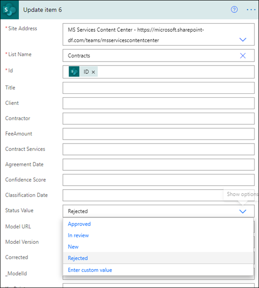

# <a name="step-3-use-power-automate-to-create-your-flow-to-process-your-contracts"></a><span data-ttu-id="463a7-104">步驟 3.</span><span class="sxs-lookup"><span data-stu-id="463a7-104">Step 3.</span></span> <span data-ttu-id="463a7-105">使用 Power Automate 建立流程以處理您的合約</span><span class="sxs-lookup"><span data-stu-id="463a7-105">Use Power Automate to create your flow to process your contracts</span></span>

<span data-ttu-id="463a7-106">您已建立您的合約管理通道，並已附加您的 SharePoint 文件庫。</span><span class="sxs-lookup"><span data-stu-id="463a7-106">You've created your Contract Management channel and have attached your SharePoint document library.</span></span> <span data-ttu-id="463a7-107">下一步是建立 Power Automate 流程，處理您的 SharePoint Syntex 模型所識別和分類的合約。</span><span class="sxs-lookup"><span data-stu-id="463a7-107">The next step is to create a Power Automate flow to process your contracts that your SharePoint Syntex model identifies and classifies.</span></span> <span data-ttu-id="463a7-108">您可以[在 SharePoint 文件庫中建立 Power Automate 流程，以](https://support.microsoft.com/office/create-a-flow-for-a-list-or-library-in-sharepoint-or-onedrive-a9c3e03b-0654-46af-a254-20252e580d01)執行此步驟。</span><span class="sxs-lookup"><span data-stu-id="463a7-108">You can do this step by [creating a Power Automate flow in your SharePoint document library](https://support.microsoft.com/office/create-a-flow-for-a-list-or-library-in-sharepoint-or-onedrive-a9c3e03b-0654-46af-a254-20252e580d01).</span></span>

<span data-ttu-id="463a7-109">針對您的合約管理解決方案，您想要建立 Power Automate 流程以執行下列動作：</span><span class="sxs-lookup"><span data-stu-id="463a7-109">For your contracts management solution, you want to create a Power Automate flow to do the following actions:</span></span>

-  <span data-ttu-id="463a7-110">在 SharePoint Syntex 模型分類合約後，請將合同狀態變更為 [**正在審查**]。</span><span class="sxs-lookup"><span data-stu-id="463a7-110">After a contract has been classified by your SharePoint Syntex model, change the contract status to **In review**.</span></span>
- <span data-ttu-id="463a7-111">然後，便會檢查合約，並以核准或拒絕。</span><span class="sxs-lookup"><span data-stu-id="463a7-111">The contract is then reviewed and is either approved or rejected.</span></span>
- <span data-ttu-id="463a7-112">針對核准的合約，合約資訊會發佈到標籤以進行付款處理。</span><span class="sxs-lookup"><span data-stu-id="463a7-112">For approved contracts, the contract information is posted to a tab for payment processing.</span></span>
- <span data-ttu-id="463a7-113">若為被拒絕的合約，會通知小組進行進一步的分析。</span><span class="sxs-lookup"><span data-stu-id="463a7-113">For rejected contracts, the team is notified for further analysis.</span></span> 

<span data-ttu-id="463a7-114">下圖顯示合約管理解決方案的 Power Automate 流程。</span><span class="sxs-lookup"><span data-stu-id="463a7-114">The following diagram shows the Power Automate flow for the contract management solution.</span></span>


## <a name="prepare-your-contract-for-review"></a><span data-ttu-id="463a7-116">準備您的合約以供審查</span><span class="sxs-lookup"><span data-stu-id="463a7-116">Prepare your contract for review</span></span>

<span data-ttu-id="463a7-117">當您 SharePoint Syntex 檔理解模型識別和分類合約時，Power Automate 流程會先將狀態變更為 [**評審**]。</span><span class="sxs-lookup"><span data-stu-id="463a7-117">When a contract is identified and classified by your SharePoint Syntex document understanding model, the Power Automate flow will first change the status to **In review**.</span></span>


<span data-ttu-id="463a7-119">取出檔案之後，請將狀態值變更為 [ **正在審查**]。</span><span class="sxs-lookup"><span data-stu-id="463a7-119">After checking out the file, change the status value to **In review**.</span></span>

![在 [檢查狀態]。](../media/content-understanding/in-review.png)

<span data-ttu-id="463a7-121">下一步是建立適應性卡片，表明該合約等候進行審閱，並將其發佈至合約管理通道。</span><span class="sxs-lookup"><span data-stu-id="463a7-121">The next step is to create an adaptive card stating that the contract is waiting for review and posting it to the Contract Management channel.</span></span>


<span data-ttu-id="463a7-124">下列程式碼是在 Power Automate 流程中用於此步驟的 JSON。</span><span class="sxs-lookup"><span data-stu-id="463a7-124">The following code is the JSON used for this step in the Power Automate flow.</span></span>

```JSON
{
"$schema": "http://adaptivecards.io/schemas/adaptive-card.json",
"type": "AdaptiveCard",
"version": "1.0",
"body": [
    {
    "type": "TextBlock",
    "text": "Contract approval request",
    "size": "large",
    "weight": "bolder",
     "wrap": true
    },
        {
            "type": "Container",
            "items": [
                {
                    "type": "FactSet",
                    "spacing": "Large",
                    "facts": [
                        {
                            "title": "Client",
                            "value": "@{triggerOutputs()?['body/Client']}"
                        },
                        {
                            "title": "Contractor",
                            "value": "@{triggerOutputs()?['body/Contractor']}"
                        },
                        {
                            "title": "Fee amount",
                            "value": "@{triggerOutputs()?['body/FeeAmount']}"
                        },
                        {
                            "title": "Date created",
                            "value": "@{triggerOutputs()?['body/Modified']} "
                        },
                        {
                            "title": "Link",
                            "value": "[@{triggerOutputs()?['body/{FilenameWithExtension}']}](@{triggerOutputs()?['body/{Link}']})"
                        }
                    ]
                }
            ]
         },
    {
    "type": "TextBlock",
    "text": "Comment:"
    },
        {
            "type": "Input.Text",
            "placeholder": "Enter comments",
            "id": "acComments"
        }
],
"actions": [
    {
    "type": "Action.Submit",
    "title": "Approve",
    "data": {
        "x": "Approve"
    }
    },
    {
    "type": "Action.Submit",
    "title": "Reject",
    "data": {
        "x": "Reject"
    }
    }
]
}
```


## <a name="conditional"></a><span data-ttu-id="463a7-125">條件</span><span class="sxs-lookup"><span data-stu-id="463a7-125">Conditional</span></span>

<span data-ttu-id="463a7-126">在您的流程中，您必須建立一個條件，讓您的合約會核准或拒絕。</span><span class="sxs-lookup"><span data-stu-id="463a7-126">In your flow, next you need to create a condition in which your contract will be either  approved or rejected.</span></span>


## <a name="if-the-contract-is-approved"></a><span data-ttu-id="463a7-128">如果已核准合約</span><span class="sxs-lookup"><span data-stu-id="463a7-128">If the contract is approved</span></span>

<span data-ttu-id="463a7-129">當合約已獲核准時，會發生下列情況：</span><span class="sxs-lookup"><span data-stu-id="463a7-129">When a contract has been approved, the following things occur:</span></span>

- <span data-ttu-id="463a7-130">在 [ **合約** ] 索引標籤上，合同卡片中的狀態會變更為 [ **已核准**]。</span><span class="sxs-lookup"><span data-stu-id="463a7-130">On the **Contracts** tab, the status in the contract card will change to **Approved**.</span></span>

   

- <span data-ttu-id="463a7-132">在您的流程中，狀態會變更為 [ **已核准**]。</span><span class="sxs-lookup"><span data-stu-id="463a7-132">In your flow, the status is changed to **Approved**.</span></span>

   

- <span data-ttu-id="463a7-134">在此方案中，合約資料將會新增至 [增加 **比率** ] 索引標籤，讓 payouts 可以管理。</span><span class="sxs-lookup"><span data-stu-id="463a7-134">In this solution, the contract data will be added to the **For Payout** tab so that the payouts can be managed.</span></span> <span data-ttu-id="463a7-135">此程式可延長以允許流程提交由協力廠商財務應用程式 (的合約，例如 Dynamics CRM) 。</span><span class="sxs-lookup"><span data-stu-id="463a7-135">This process can be extended to allow the flow to submit the contracts for payment by a third-party financial application (for example, Dynamics CRM).</span></span>

   

- <span data-ttu-id="463a7-137">在流程中，您會建立下列專案，以將核准的合約移至 [ **以付出比率** ] 索引標籤。</span><span class="sxs-lookup"><span data-stu-id="463a7-137">In the flow, you create the following item to move approved contracts to the **For Payout** tab.</span></span>

   

- <span data-ttu-id="463a7-139">表示已核准合約的適應性卡，會建立併發布到合約管理通道。</span><span class="sxs-lookup"><span data-stu-id="463a7-139">An adaptive card stating that the contract has been approved is created and posted to the Contract Management channel.</span></span>

   

   


   <span data-ttu-id="463a7-142">下列程式碼是在 Power Automate 流程中用於此步驟的 JSON。</span><span class="sxs-lookup"><span data-stu-id="463a7-142">The following code is the JSON used for this step in the Power Automate flow.</span></span>

```JSON
{ 
    "type": "AdaptiveCard",
    "body": [
        {
            "type": "Container",
            "style": "emphasis",
            "items": [
                {
                    "type": "ColumnSet",
                    "columns": [
                        {
                            "type": "Column",
                            "items": [
                                {
                                    "type": "TextBlock",
                                    "size": "Large",
                                    "weight": "Bolder",
                                    "text": "CONTRACT APPROVED"
                                }
                            ],
                            "width": "stretch"
                        }
                    ]
                }
            ],
            "bleed": true
        },
        {
            "type": "Container",
            "items": [
                {
                    "type": "FactSet",
                    "spacing": "Large",
                    "facts": [
                        {
                            "title": "Client",
                            "value": "@{triggerOutputs()?['body/Client']}"
                        },
                        {
                            "title": "Contractor",
                            "value": "@{triggerOutputs()?['body/Contractor']}"
                        },
                        {
                            "title": "Fee amount",
                            "value": "@{triggerOutputs()?['body/FeeAmount']}"
                        },
                        {
                            "title": "Approval by",
                            "value": "@{body('Post_an_Adaptive_Card_to_a_Teams_channel_and_wait_for_a_response')?['responder']['displayName']}"
                        },
                        {
                            "title": "Approved date",
                            "value": "@{body('Post_an_Adaptive_Card_to_a_Teams_channel_and_wait_for_a_response')?['responseTime']}"
                        },
                        {
                            "title": "Approval comment",
                            "value": "@{body('Post_an_Adaptive_Card_to_a_Teams_channel_and_wait_for_a_response')?['data']['acComments']}"
                        },
                        {
                            "title": " ",
                            "value": " "
                        },
                        {
                            "title": "Status",
                            "value": "Ready for payout"
                        }
                    ]
                }
            ]
        }
    ],
    "$schema": "http://adaptivecards.io/schemas/adaptive-card.json",
    "version": "1.2",
    "fallbackText": "This card requires Adaptive Cards v1.2 support to be rendered properly."
}
```

## <a name="if-the-contract-is-rejected"></a><span data-ttu-id="463a7-143">如果拒絕合約</span><span class="sxs-lookup"><span data-stu-id="463a7-143">If the contract is rejected</span></span>

<span data-ttu-id="463a7-144">當合約遭到拒絕時，會發生下列情況：</span><span class="sxs-lookup"><span data-stu-id="463a7-144">When a contract has been rejected, the following things occur:</span></span>

- <span data-ttu-id="463a7-145">在 [ **合約** ] 索引標籤上，合同卡片中的狀態會變更為 [ **拒絕**]。</span><span class="sxs-lookup"><span data-stu-id="463a7-145">On the **Contracts** tab, the status in the contract card will change to **Rejected**.</span></span>

   

- <span data-ttu-id="463a7-147">在您的流程中，您會取出合約檔，將狀態變更為 [已 **拒絕**]，然後再將檔案存回。</span><span class="sxs-lookup"><span data-stu-id="463a7-147">In your flow, you check out the contract file, change the status to **Rejected**, and then check the file back in.</span></span>

   

- <span data-ttu-id="463a7-149">在您的流程中，您會建立一個自我調整卡，表明已拒絕該合約。</span><span class="sxs-lookup"><span data-stu-id="463a7-149">In your flow, you create an adaptive card stating that the contract has been rejected.</span></span>

   

<span data-ttu-id="463a7-151">下列程式碼是在 Power Automate 流程中用於此步驟的 JSON。</span><span class="sxs-lookup"><span data-stu-id="463a7-151">The following code is the JSON used for this step in the Power Automate flow.</span></span>

```JSON
{ 
    "type": "AdaptiveCard",
    "body": [
        {
            "type": "Container",
            "style": "attention",
            "items": [
                {
                    "type": "ColumnSet",
                    "columns": [
                        {
                            "type": "Column",
                            "items": [
                                {
                                    "type": "TextBlock",
                                    "size": "Large",
                                    "weight": "Bolder",
                                    "text": "CONTRACT REJECTED"
                                }
                            ],
                            "width": "stretch"
                        }
                    ]
                }
            ],
            "bleed": true
        },
        {
            "type": "Container",
            "items": [
                {
                    "type": "FactSet",
                    "spacing": "Large",
                    "facts": [
                        {
                            "title": "Client",
                            "value": "@{triggerOutputs()?['body/Client']}"
                        },
                        {
                            "title": "Contractor",
                            "value": "@{triggerOutputs()?['body/Contractor']}"
                        },
                        {
                            "title": "Fee amount",
                            "value": "@{triggerOutputs()?['body/FeeAmount']}"
                        },
                        {
                            "title": "Rejected by",
                            "value": "@{body('Post_an_Adaptive_Card_to_a_Teams_channel_and_wait_for_a_response')?['responder']['displayName']}"
                        },
                        {
                            "title": "Rejected date",
                            "value": "@{body('Post_an_Adaptive_Card_to_a_Teams_channel_and_wait_for_a_response')?['responseTime']}"
                        },
                        {
                            "title": "Comment",
                            "value": "@{body('Post_an_Adaptive_Card_to_a_Teams_channel_and_wait_for_a_response')?['data']['acComments']}"
                        },
                        {
                            "title": " ",
                            "value": " "
                        },
                        {
                            "title": "Status",
                            "value": "Needs review"
                        }
                    ]
                }
            ]
        }
    ],
    "$schema": "http://adaptivecards.io/schemas/adaptive-card.json",
    "version": "1.2",
    "fallbackText": "This card requires Adaptive Cards v1.2 support to be rendered properly."
}
```

- <span data-ttu-id="463a7-152">該卡會在合約管理通道中公佈。</span><span class="sxs-lookup"><span data-stu-id="463a7-152">The card is posted in the Contract Management channel.</span></span>

   