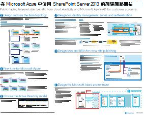

# 適用於 SharePoint、Exchange、商務用 Skype 和 Lync 的架構模型Architectural models for SharePoint, Exchange, Skype for Business, and Lync

這些 IT 海報描述適用於 SharePoint、Exchange、商務用 Skype 和 Lync 的結構模型和部署選項，並提供在 Microsoft Azure 內部署 SharePoint 的設計資訊。These IT posters describe the architectural models and deployment options for SharePoint, Exchange, Skype for Business, and Lync, and they provide design information for deploying SharePoint in Microsoft Azure.
  
透過 Microsoft 365，您可以雲端架構服務方式提供使用者所熟悉的共同作業和通訊服務。With Microsoft 365, you can provide the collaboration and communication services your users are familiar with as a cloud-based service. 除少許個別例子外，不管是維護內部部署或使用 Microsoft 365，使用者經驗皆會維持不變。With a few exceptions, the user experience remains the same whether you are maintaining an on-premises deployment or using Microsoft 365. 在放置工作負載時，這種整合式的使用者經驗會令使用者難以判斷放置的位置，並衍生問題如︰This unified user experience makes it less straightforward to decide where to place each workload and raises questions such as:
  
- 當為您的個別工作負載選擇平台時，您會如何判斷？How do you determine which platform option to choose for your individual workloads?
    
- 是否應該保留任何內部部署服務？Does it make sense to keep any service on-premises?
    
- 擁有適當混合式部署的案例是怎麼樣的？What is a scenario where a hybrid deployment is appropriate?
    
- Microsoft Azure 如何調整圖片？How does Microsoft Azure fit in the picture?
    
- 在 Azure 內 Office Sever 工作負載的支援組態為何？What are the supported configurations for Office Server workloads in Azure?
    
> [!TIP]
> 此頁面上的海報大多提供多種語言版本，包括中文、英文、法文、德文、義大利文、日文、韓文、葡萄牙文、俄文和西班牙文。若要下載以上其中一種語言的海報，請按一下該海報的 [更多語言] 連結。讓我們知道您的想法！Most of the posters on this page are available in multiple languages, including Chinese, English, French, German, Italian, Japanese, Korean, Portuguese, Russian, and Spanish. To download a poster in one of these languages, click the **More languages** link for that poster.
  
讓我們知道您的心得！請傳送電子郵件給我們：[cloudadopt@microsoft.com](mailto:cloudadopt@microsoft.com)。Let us know what you think! Send us email at [cloudadopt@microsoft.com](mailto:cloudadopt@microsoft.com). 
  
此頁面可讓您連結到下列的海報︰This page links you to the following posters:
  
- **架構模型海報**：您可以使用這些資源來判斷適用於 SharePoint 2016、和商務用 Skype 2015 的理想平台和組態。**Architectural models posters** You can use these resources to determine your ideal platform and configuration for SharePoint 2016 and Skype for Business 2015.
    
  - [Microsoft SharePoint 2016 架構模型Microsoft SharePoint 2016 Architectural Models](architectural-models-for-sharepoint-exchange-skype-for-business-and-lync.md#SP2016_ArchModel)
    
  - [SharePoint Server 2016 資料庫SharePoint Server 2016 Databases](architectural-models-for-sharepoint-exchange-skype-for-business-and-lync.md#SP2016_Databases)
    
  - [Microsoft 商務用 Skype 2015 架構模型Microsoft Skype for Business 2015 Architectural Models](architectural-models-for-sharepoint-exchange-skype-for-business-and-lync.md#SfB2015_ArchModel)
    
- **平台選項海報**：您可以使用這些資源來判斷適用於 SharePoint 2013、Exchange 2013 和 Lync 2013 的理想平台和組態。**Platform options posters** You can use these resources to determine your ideal platform and configuration for SharePoint 2013, Exchange 2013, and Lync 2013.
    
  - [SharePoint 2013 平台選項SharePoint 2013 Platform Options](architectural-models-for-sharepoint-exchange-skype-for-business-and-lync.md#SP2013_Options)
    
  - [Exchange 2013 平台選項Exchange 2013 Platform Options](architectural-models-for-sharepoint-exchange-skype-for-business-and-lync.md#Exch2013_options)
    
  - [Lync 2013 平台選項Lync 2013 Platform Options](architectural-models-for-sharepoint-exchange-skype-for-business-and-lync.md#Lync2013_Options)
    
- **Azure 解決方案海報內的 SharePoint Server 2013**：您可以使用這些 IT 海報，來判斷 Azure 的基礎結構服務中的 SharePoint Server 2013 工作負載的設計和組態。**SharePoint Server 2013 in Azure solutions posters** You can use these IT posters to determine the design and configuration for SharePoint Server 2013 workloads in Azure infrastructure services.
    
  - [在 Microsoft Azure 中使用 SharePoint Server 2013 的網際網路網站Internet sites in Microsoft Azure using SharePoint Server 2013](architectural-models-for-sharepoint-exchange-skype-for-business-and-lync.md#Azure_sharepoint2013)
    
  - [設計範例：Microsoft Azure 中的 SharePoint 2013 網際網路網站Design sample: Internet sites in Microsoft Azure for SharePoint 2013](architectural-models-for-sharepoint-exchange-skype-for-business-and-lync.md#DesignSampleInternetSites)
    
  - [對於 Microsoft Azure 的 SharePoint 災害復原SharePoint Disaster Recovery to Microsoft Azure](architectural-models-for-sharepoint-exchange-skype-for-business-and-lync.md#sharepoint_recovery_Azure)
    
## 架構模型海報Architectural models posters

這些新推出的 SharePoint 2016 和商務用 Skype 2015 IT 海報會以方便列印的格式，提供方法來比較不同的部署方法。每份海報會提供一份清單，內含所有可用的組態或平台，並提供每個選項的下列資訊︰These new IT posters for SharePoint 2016 and Skype for Business 2015 provide a way to compare the various deployment methods in an easy-to-print format. Each poster provides a list of all the configurations or platform options available and gives you the following information for each option:
  
- **概觀**：平台 (包括概念圖表) 的簡短摘要。**Overview** A brief summary of the platform, including a conceptual diagram.
    
- **適用**：適用在特定平台的常見案例。**Best for** Common scenarios that are ideally suited for the particular platform.
    
- **授權需求**：部署所需的授權。**License requirements** The licenses you need for deployment.
    
- **架構工作**：您身為架構設計人員須執行的決策。**Architecture tasks** The decisions you need to make as an architect.
    
- **IT 專業人員的工作或責任**：您的 IT 人員需要處理的日常工作。**IT Pro tasks or responsibilities** The daily responsibilities that your IT staff needs to plan for.
    

### Microsoft SharePoint 2016 架構模型Microsoft SharePoint 2016 Architectural Models

|**項目****Item**|**描述****Description**|
|:-----|:-----|
|[          ](https://www.microsoft.com/download/details.aspx?id=52650)[          ](https://www.microsoft.com/download/details.aspx?id=52650)   [PDF](https://download.microsoft.com/download/4/F/A/4FA0F94B-EE2F-41DB-A047-D9864FEF41E9/SharePoint2016ArchitecturalModels.pdf)  \| [Visio](https://download.microsoft.com/download/4/F/A/4FA0F94B-EE2F-41DB-A047-D9864FEF41E9/SharePoint2016ArchitecturalModels.vsdx)  \| [更多語言](https://www.microsoft.com/download/details.aspx?id=52650)[PDF](https://download.microsoft.com/download/4/F/A/4FA0F94B-EE2F-41DB-A047-D9864FEF41E9/SharePoint2016ArchitecturalModels.pdf)  \| [Visio](https://download.microsoft.com/download/4/F/A/4FA0F94B-EE2F-41DB-A047-D9864FEF41E9/SharePoint2016ArchitecturalModels.vsdx)  \| [More languages](https://www.microsoft.com/download/details.aspx?id=52650)   | 此 IT 海報描述商務決策者和解決方案架構設計人員需了解的 SharePoint Online、Microsoft Azure 和 SharePoint 內部部署組態。This IT poster describes the SharePoint Online, Microsoft Azure, and SharePoint on-premises configurations that business decision makers and solutions architects need to know about.    - **SharePoint Online (SaaS)**：透過軟體即服務 (SaaS) 訂閱模型取用 SharePoint。- **SharePoint Online (SaaS)** - Consume SharePoint through a Software as a Service (SaaS) subscription model.   - **SharePoint Hybrid**：按您自己的速度，將您的 SharePoint 網址和應用程式移至雲端。- **SharePoint Hybrid** - Move your SharePoint sites and apps to the cloud at your own pace.   - **SharePoint in Azure (IaaS)**：您可將內部部署環境延伸至 Microsoft Azure 並在該處部署 SharePoint 2016 伺服器 (高可用性/災害復原和開發測試環境中推薦使用)。- **SharePoint in Azure (IaaS)** - You extend your on-premises environment into Microsoft Azure and deploy SharePoint 2016 Servers there. (This is recommended for High Availability/Disaster Recovery and dev/test environments.)   - **SharePoint 內部部署**：您會在您維護的資料中心內計劃、部署、維護和自訂 SharePoint 環境。- **SharePoint On-premises** - You plan, deploy, maintain and customize your SharePoint environment in a datacenter that you maintain.   |
   

### SharePoint Server 2016 資料庫SharePoint Server 2016 Databases

|**項目****Item**|**描述****Description**|
|:-----|:-----|
|[          ](https://www.microsoft.com/download/details.aspx?id=55041)[          ](https://www.microsoft.com/download/details.aspx?id=55041)   [PDF](https://download.microsoft.com/download/D/5/D/D5DC1121-8BC5-4953-834F-1B5BB03EB691/DBrefguideSPS2016_tabloid.pdf)  \| [Visio](https://download.microsoft.com/download/D/5/D/D5DC1121-8BC5-4953-834F-1B5BB03EB691/DBrefguideSPS2016_tabloid.vsdx)  \| [更多語言](https://www.microsoft.com/download/details.aspx?id=55041)[PDF](https://download.microsoft.com/download/D/5/D/D5DC1121-8BC5-4953-834F-1B5BB03EB691/DBrefguideSPS2016_tabloid.pdf)  \| [Visio](https://download.microsoft.com/download/D/5/D/D5DC1121-8BC5-4953-834F-1B5BB03EB691/DBrefguideSPS2016_tabloid.vsdx)  \| [More languages](https://www.microsoft.com/download/details.aspx?id=55041)   | 此 IT 海報是適用於 SharePoint Server 2016 資料庫的快速參考指南。每個資料庫均會有以下詳細資料：This IT poster is a quick reference guide for SharePoint Server 2016 databases. Each database has the following details:    - 大小- Size   - 調整大小指導方針- Scaling guidance   - I/O 模式- I/O patterns   - 需求：- Requirements     第一頁具有 SharePoint 系統資料庫和有多個資料庫的服務應用程式。第二頁顯示有單一資料庫的所有服務應用程式。The first page has the SharePoint system databases and the service applications that have multiple databases. The second page shows all of the service applications that have single databases.     如需有關 SharePoint Server 2016 資料庫的詳細資訊，請參閱＜[SharePoint Server 2016 中的資料庫類型和描述](https://docs.microsoft.com/SharePoint/technical-reference/database-types-and-descriptions)＞。For more information about the SharePoint Server 2016 databases, see [Database types and descriptions in SharePoint Server 2016](https://docs.microsoft.com/SharePoint/technical-reference/database-types-and-descriptions)   |
   

### Microsoft 商務用 Skype 2015 架構模型Microsoft Skype for Business 2015 Architectural Models

|**項目****Item**|**描述****Description**|
|:-----|:-----|
|[          ](https://www.microsoft.com/download/details.aspx?id=55022)[          ](https://www.microsoft.com/download/details.aspx?id=55022)   [PDF](https://download.microsoft.com/download/7/7/4/7741262C-A60D-41F7-863B-99BF5964FBFE/Skype%20for%20Business%20Architectural%20Models.pdf)  \| [Visio](https://download.microsoft.com/download/7/7/4/7741262C-A60D-41F7-863B-99BF5964FBFE/Skype%20for%20Business%20Architectural%20Models.vsd)  \| [更多語言](https://www.microsoft.com/download/details.aspx?id=55022)[PDF](https://download.microsoft.com/download/7/7/4/7741262C-A60D-41F7-863B-99BF5964FBFE/Skype%20for%20Business%20Architectural%20Models.pdf)  \| [Visio](https://download.microsoft.com/download/7/7/4/7741262C-A60D-41F7-863B-99BF5964FBFE/Skype%20for%20Business%20Architectural%20Models.vsd)  \| [More languages](https://www.microsoft.com/download/details.aspx?id=55022)   |此海報描述企業決策者和解決方案架構設計人員需了解的商務用 Skype Online、內部部署、混合式、雲端 PBX 和 Exchange 與 SharePoint 組態的整合。This poster describes the Skype for Business Online, on-premises, hybrid, cloud PBX, and integration with Exchange and SharePoint configurations that business decision makers and solutions architects need to know about.    這是專為 IT 專業人員而設，以提高他們對不同基本架構模型的意識，並從中取用商務用 Skype Online 和商務用 Skype 內部部署。It is intended for the IT Pro audience to raise awareness of the different fundamental architectural models through which Skype for Business Online and Skype for Business on premises can be consumed.   從最適合貴組織需求與未來規劃的任何一種組態開始。您可以視需要考慮並使用其他組態。例如，您可能會想要考慮與 Exchange 和 SharePoint 整合，或考慮善加利用 Microsoft 的雲端 PBX 產品的解決方案。Start with whichever configuration best suits your organization's needs and future plans. Consider and use others as needed. For example, you might want to consider integration with Exchange and SharePoint or a solution that takes advantage of Microsoft's Cloud PBX offering.    |
   
## 平台選項海報Platform options posters

這些適用於 SharePoint 2013、Exchange 2013 和 Lync 2013 的 IT 海報，會以大型海報格式，來比較不同的部署方法，讓差異一目了然。每份海報會提供一份清單，內含所有可用的組態或平台，並提供每個選項的下列資訊︰These IT posters for SharePoint 2013, Exchange 2013, and Lync 2013 provide a way to compare the various deployment methods at a single glance in a large poster format. Each poster provides a list of all the configurations or platform options available and gives you the following information for each option:
  
- **概觀**：平台 (包括概念圖表) 的簡短摘要。**Overview** A brief summary of the platform, including a conceptual diagram.
    
- **適用**：適用在特定平台的常見案例。**Best for** Common scenarios that are ideally suited for the particular platform.
    
- **授權需求**：部署所需的授權。**License requirements** The licenses you need for deployment.
    
- **架構工作**：您身為架構設計人員須執行的決策。**Architecture tasks** The decisions you need to make as an architect.
    
- **IT 專業人員的工作或責任**：您的 IT 人員需要處理的日常工作。**IT Pro tasks or responsibilities** The daily responsibilities that your IT staff needs to plan for.
    

## SharePoint 2013 平台選項SharePoint 2013 Platform Options

****

|**項目****Item**|**描述****Description**|
|:-----|:-----|
|[          ](https://www.microsoft.com/download/details.aspx?id=40332)[          ](https://www.microsoft.com/download/details.aspx?id=40332)   [PDF](https://go.microsoft.com/fwlink/p/?LinkId=324594)  \| [Visio](https://go.microsoft.com/fwlink/p/?LinkId=324593)  \| [其他語言](https://www.microsoft.com/download/details.aspx?id=40332)[PDF](https://go.microsoft.com/fwlink/p/?LinkId=324594)  \| [Visio](https://go.microsoft.com/fwlink/p/?LinkId=324593)  \| [More languages](https://www.microsoft.com/download/details.aspx?id=40332)   |針對企業決策人 (BDM) 和架構設計人員，本模型顯示 SharePoint 2013 的平台選項、Microsoft 365 中的 SharePoint、與 Microsoft 365、Azure 的內部部署混合式，和僅限內部部署的部署。For business decision makers (BDMs) and architects, this model shows the platform options for SharePoint 2013, SharePoint in Microsoft 365, on-premises hybrid with Microsoft 365, Azure, and on-premises only deployments. 其中包含每個架構的概觀、建議、授權需求，以及每個平台的架構設計人員和 IT 專業人員工作清單。It includes an overview of each architecture, recommendations, license requirements, and lists of architect and IT Pro tasks for each platform. 許多 Azure 上的 SharePoint 解決方案都會醒目提示。Several SharePoint solutions on Azure are highlighted.   |
   

## Exchange 2013 平台選項Exchange 2013 Platform Options

****

|**項目****Item**|**描述****Description**|
|:-----|:-----|
|[          ](https://www.microsoft.com/download/details.aspx?id=42676)[          ](https://www.microsoft.com/download/details.aspx?id=42676)   [PDF](https://go.microsoft.com/fwlink/p/?LinkID=398740)  \| [Visio](https://go.microsoft.com/fwlink/p/?LinkID=398742)  \| [其他語言](https://www.microsoft.com/download/details.aspx?id=42676)[PDF](https://go.microsoft.com/fwlink/p/?LinkID=398740)  \| [Visio](https://go.microsoft.com/fwlink/p/?LinkID=398742)  \| [More languages](https://www.microsoft.com/download/details.aspx?id=42676)   |這種模型會描述 Exchange 2013 可用的平台選項，並適用於 BDM 和架構設計人員。For BDMs and architects, this model describes the available platform options for Exchange 2013. 客戶可以選擇使用 Microsoft 365 的 Exchange Online、混合式 Exchange、Exchange Server 內部部署和 Exchange 託管。Customers can choose from Exchange Online with Microsoft 365, Hybrid Exchange, Exchange Server on-premises and Hosted Exchange. 海報包含每個架構選項的詳細資訊，包括每個最理想情況下的授權需求以及 IT 專業人員的責任。The poster includes details of each architectural option, including the most ideal scenarios for each, the license requirements and IT Pro responsibilities.   |
   

## Lync 2013 平台選項Lync 2013 Platform Options

****

|**項目****Item**|**描述****Description**|
|:-----|:-----|
|[          ](https://www.microsoft.com/download/details.aspx?id=41677)[          ](https://www.microsoft.com/download/details.aspx?id=41677)   [PDF](https://go.microsoft.com/fwlink/p/?LinkID=391837)  \| [Visio](https://go.microsoft.com/fwlink/p/?LinkID=391839)  \| [其他語言](https://www.microsoft.com/download/details.aspx?id=41677)[PDF](https://go.microsoft.com/fwlink/p/?LinkID=391837)  \| [Visio](https://go.microsoft.com/fwlink/p/?LinkID=391839)  \| [More languages](https://www.microsoft.com/download/details.aspx?id=41677)   |對於 BDM 和架構設計人員，這種模型會描述 Exchange 2013 可用的平台選項。For BDMs and architects, this model describes the available platform options for Lync 2013. 客戶可以從 Microsoft 365 中的 Lync Online、混合式 Lync、內部部署 Lync Server 和 Lync 託管中選擇。Customers can choose from Lync Online with Microsoft 365, Hybrid Lync, Lync Server on-premises and Hosted Lync. IT 海報包含每個架構的選項，包括最理想的情況下，每一個授權需求以及 IT 專業人員的責任。The IT poster includes details of each architectural option, including the most ideal scenarios for each, the license requirements and IT Pro responsibilities.    |
   

## Azure 解決方案海報內的 SharePointSharePoint in Azure solutions posters

這些 IT 海報採用大型海報格式，顯示使用 SharePoint Server 2013 的以 Azure 為基礎的解決方案。These IT posters show Azure-based solutions using SharePoint Server 2013 in a large poster format.
  

### 在 Microsoft Azure 中使用 SharePoint Server 2013 的網際網路網站Internet sites in Microsoft Azure using SharePoint Server 2013

****

|**項目****Item**|**描述****Description**|
|:-----|:-----|
|[          ](https://www.microsoft.com/download/details.aspx?id=41992)[          ](https://www.microsoft.com/download/details.aspx?id=41992)   [PDF](https://go.microsoft.com/fwlink/p/?LinkId=392552)  \| [Visio](https://go.microsoft.com/fwlink/p/?LinkId=392551)  \| [更多語言](https://www.microsoft.com/download/details.aspx?id=41992)[PDF](https://go.microsoft.com/fwlink/p/?LinkId=392552)  \| [Visio](https://go.microsoft.com/fwlink/p/?LinkId=392551)  \| [More languages](https://www.microsoft.com/download/details.aspx?id=41992)   |此海報針對 Azure 中面向網際網路的網站，概述重要的設計活動和建議的架構選項。This poster outlines key design activities and recommended architecture choices for Internet-facing sites in Azure.     如需詳細資訊，請參閱下列文章：For more information, see the following articles:     - [在 Microsoft Azure 中使用 SharePoint Server 2013 的網際網路網站](internet-sites-in-microsoft-azure-using-sharepoint-server-2013.md)- [Internet Sites in Microsoft Azure using SharePoint Server 2013](internet-sites-in-microsoft-azure-using-sharepoint-server-2013.md)   - [Microsoft Azure SharePoint 2013 架構](microsoft-azure-architectures-for-sharepoint-2013.md)- [Microsoft Azure Architectures for SharePoint 2013](microsoft-azure-architectures-for-sharepoint-2013.md)   |
   

### 設計範例：Microsoft Azure 中的 SharePoint 2013 網際網路網站Design sample: Internet sites in Microsoft Azure for SharePoint 2013

****

|**項目****Item**|**描述****Description**|
|:-----|:-----|
|[          ](https://www.microsoft.com/download/details.aspx?id=41991)[          ](https://www.microsoft.com/download/details.aspx?id=41991)   [PDF](https://go.microsoft.com/fwlink/p/?LinkId=392549)  \| [Visio](https://go.microsoft.com/fwlink/p/?LinkId=392548)  \| [更多語言](https://www.microsoft.com/download/details.aspx?id=41991)[PDF](https://go.microsoft.com/fwlink/p/?LinkId=392549)  \| [Visio](https://go.microsoft.com/fwlink/p/?LinkId=392548)  \| [More languages](https://www.microsoft.com/download/details.aspx?id=41991)   |請以此設計範例為起點，在 Azure 中使用 SharePoint Server 2013 來設計面向網際網路的網站架構。Use this design sample as a starting point for your own architecture Internet-facing site in Azure using SharePoint Server 2013.    如需詳細資訊，請參閱下列文章：For more information, see the following articles:     - [在 Microsoft Azure 中使用 SharePoint Server 2013 的網際網路網站](internet-sites-in-microsoft-azure-using-sharepoint-server-2013.md)- [Internet Sites in Microsoft Azure using SharePoint Server 2013](internet-sites-in-microsoft-azure-using-sharepoint-server-2013.md)   - [Microsoft Azure SharePoint 2013 架構](microsoft-azure-architectures-for-sharepoint-2013.md)- [Microsoft Azure Architectures for SharePoint 2013](microsoft-azure-architectures-for-sharepoint-2013.md)   |
   

### 對於 Microsoft Azure 的 SharePoint 災害復原SharePoint Disaster Recovery to Microsoft Azure

****

|**項目****Item**|**描述****Description**|
|:-----|:-----|
|[          ](https://www.microsoft.com/download/details.aspx?id=41993)[          ](https://www.microsoft.com/download/details.aspx?id=41993)   [PDF](https://go.microsoft.com/fwlink/p/?LinkId=392555)  \| [Visio](https://go.microsoft.com/fwlink/p/?LinkId=392554)  \| [更多語言](https://www.microsoft.com/download/details.aspx?id=41993)[PDF](https://go.microsoft.com/fwlink/p/?LinkId=392555)  \| [Visio](https://go.microsoft.com/fwlink/p/?LinkId=392554)  \| [More languages](https://www.microsoft.com/download/details.aspx?id=41993)   |此 IT 海報說明 Azure 中的嚴重損壞修復環境的架構原則。This IT poster shows architecture principles for a disaster recovery environment in Azure.    如需詳細資訊，請參閱下列文章：For more information, see the following articles:     - [Microsoft Azure 中的 SharePoint Server 2013 災害復原](sharepoint-server-2013-disaster-recovery-in-microsoft-azure.md)- [SharePoint Server 2013 Disaster Recovery in Microsoft Azure](sharepoint-server-2013-disaster-recovery-in-microsoft-azure.md)   - [Microsoft Azure SharePoint 2013 架構](microsoft-azure-architectures-for-sharepoint-2013.md)- [Microsoft Azure Architectures for SharePoint 2013](microsoft-azure-architectures-for-sharepoint-2013.md)   |
   
## 另請參閱See Also

[Microsoft 365 解決方案與架構中心Microsoft 365 solution and architecture center](../solutions/solution-architecture-center.md)
  
[Microsoft cloud for enterprise 架構設計圖例Microsoft cloud for enterprise architects illustrations](../solutions/cloud-architecture-models.md)
  
[Microsoft 365 測試實驗室指南Microsoft 365 Test Lab Guides](m365-enterprise-test-lab-guides.md)
  
[混合式解決方案Hybrid solutions](hybrid-solutions.md)

