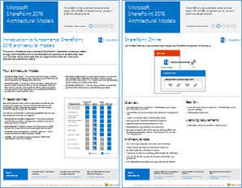
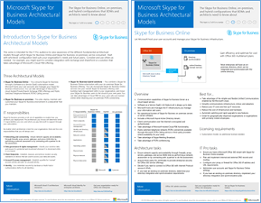

# 適用於 SharePoint、Exchange、商務用 Skype 和 Lync 的架構模型Architectural models for SharePoint, Exchange, Skype for Business, and Lync

本文中的 IT 海報說明 SharePoint、Exchange、商務用 Skype 和 Lync 的架構模型和部署選項。The IT posters in this article describe the architectural models and deployment options for SharePoint, Exchange, Skype for Business, and Lync. 它們也提供在 Microsoft Azure 中部署 SharePoint 的設計資訊。They also provide design information for deploying SharePoint in Microsoft Azure.
  
使用 Microsoft 365，您可以透過雲端提供熟悉的共同作業和通訊服務。By using Microsoft 365, you can provide familiar collaboration and communication services through the cloud. 使用一些例外狀況，不論您在維護內部部署還是使用 Microsoft 365，使用者經驗都會保持不變。With a few exceptions, the user experience remains the same whether you're maintaining an on-premises deployment or using Microsoft 365. 

這種統一的使用者體驗會使每個工作負載的位置變複雜。This unified user experience complicates the decision of where to place each workload. 此外，它也會引發一些問題：It also raises questions:
  
- 如何選擇個別工作負載的平臺？How do you choose a platform for individual workloads?
    
- 是否應該保留任何內部部署服務？Does it make sense to keep any service on-premises?
    
- 混合式部署適用的情況為何？In what scenario is a hybrid deployment appropriate?
    
- Azure 如何適應圖片？How does Azure fit into the picture?
    
- Azure 支援的 Office server 工作負載設定為何？What configurations of Office server workloads does Azure support?
    
> [!TIP]
> 本文中的大部分海報都有多種語言版本。Most posters in this article are available in multiple languages. 可用的語言包括中文、英文、法文、德文、義大利文、日文、韓文、葡萄牙文、俄文及西班牙文。Available languages include Chinese, English, French, German, Italian, Japanese, Korean, Portuguese, Russian, and Spanish. 若要下載下列其中一種語言的海報，請在海報縮圖圖像下，選取 [ **其他語言**]。To download a poster in one of these languages, under the poster thumbnail image, select **More languages**.
  
讓我們知道您的想法！Let us know what you think! 以 [cloudadopt@microsoft.com](mailto:cloudadopt@microsoft.com)傳送電子郵件。Send us email at [cloudadopt@microsoft.com](mailto:cloudadopt@microsoft.com). 
  
使用下列連結可取得所需的海報：Use the following links to get the posters you need:
  
- **架構模型**：使用這些資源來判斷 SharePoint 2016 和商務用 Skype 2015 的理想平臺和設定。**Architectural models**: Use these resources to determine your ideal platform and configuration for SharePoint 2016 and Skype for Business 2015.
    
  - [Microsoft SharePoint 2016 架構模型Microsoft SharePoint 2016 architectural models](architectural-models-for-sharepoint-exchange-skype-for-business-and-lync.md#SP2016_ArchModel)
    
  - [SharePoint Server 2016 資料庫SharePoint Server 2016 databases](architectural-models-for-sharepoint-exchange-skype-for-business-and-lync.md#SP2016_Databases)
    
  - [Microsoft 商務用 Skype 2015 架構模型Microsoft Skype for Business 2015 architectural models](architectural-models-for-sharepoint-exchange-skype-for-business-and-lync.md#SfB2015_ArchModel)
    
- **平臺**：使用這些資源來判斷適用于 SharePoint 2013、Exchange 2013 和 Lync 2013 的理想平臺和設定。**Platform**: Use these resources to determine your ideal platform and configuration for SharePoint 2013, Exchange 2013, and Lync 2013.
    
  - [SharePoint 2013 平臺選項SharePoint 2013 platform options](architectural-models-for-sharepoint-exchange-skype-for-business-and-lync.md#SP2013_Options)
    
  - [Exchange 2013 平臺選項Exchange 2013 platform options](architectural-models-for-sharepoint-exchange-skype-for-business-and-lync.md#Exch2013_options)
    
  - [Lync 2013 平臺選項Lync 2013 platform options](architectural-models-for-sharepoint-exchange-skype-for-business-and-lync.md#Lync2013_Options)
    
- **在 azure 中 SharePoint Server 2013**：使用這些 IT 海報，在 azure 基礎結構服務中設計及設定 SharePoint Server 2013 工作負載。**SharePoint Server 2013 in Azure**: Use these IT posters to design and configure SharePoint Server 2013 workloads in Azure infrastructure services.
    
  - [Azure 中使用 SharePoint Server 2013 的網際網路網站Internet sites in Azure using SharePoint Server 2013](architectural-models-for-sharepoint-exchange-skype-for-business-and-lync.md#Azure_sharepoint2013)
    
  - [設計範例： Azure 中用於 SharePoint 2013 的網際網路網站Design sample: Internet sites in Azure for SharePoint 2013](architectural-models-for-sharepoint-exchange-skype-for-business-and-lync.md#DesignSampleInternetSites)
    
  - [將嚴重損壞修復至 Azure SharePointSharePoint disaster recovery to Azure](architectural-models-for-sharepoint-exchange-skype-for-business-and-lync.md#sharepoint_recovery_Azure)
    
## 架構模型海報Architectural models posters

SharePoint 2016 和商務用 Skype 2015 的 IT 海報提供一種方法，可在輕鬆列印的格式中比較部署方法。The IT posters for SharePoint 2016 and Skype for Business 2015 provide a way to compare deployment methods in an easy-to-print format. 海報會列出所有設定或平臺選項。The posters list all configuration or platform options. 每個選項都提供下列資訊：They provide the following information for each option:
  
- **概覽**：平臺的簡短摘要，包括概念圖表。**Overview**: A brief summary of the platform, including a conceptual diagram.
    
- **最** 適合：適合平臺的常見案例。**Best for**: Common scenarios that are ideally suited for the platform.
    
- **授權需求**：部署所需的授權。**License requirements**: The licenses you need for deployment.
    
- **架構任務**：您需要做為架構師的決策。**Architecture tasks**: The decisions you need to make as an architect.
    
- **It 專業** 人員的工作或責任：您的 it 人員需要規劃的每日責任。**IT pro tasks or responsibilities**: The daily responsibilities that your IT staff needs to plan for.
    

### Microsoft SharePoint Server 2016 架構模型Microsoft SharePoint Server 2016 Architectural Models

|項目Item|描述Description|
|---|---|
|[          ](https://www.microsoft.com/download/details.aspx?id=52650)[          ](https://www.microsoft.com/download/details.aspx?id=52650)   [PDF](https://download.microsoft.com/download/4/F/A/4FA0F94B-EE2F-41DB-A047-D9864FEF41E9/SharePoint2016ArchitecturalModels.pdf)  \| [Visio](https://download.microsoft.com/download/4/F/A/4FA0F94B-EE2F-41DB-A047-D9864FEF41E9/SharePoint2016ArchitecturalModels.vsdx)  \| [更多語言](https://www.microsoft.com/download/details.aspx?id=52650)[PDF](https://download.microsoft.com/download/4/F/A/4FA0F94B-EE2F-41DB-A047-D9864FEF41E9/SharePoint2016ArchitecturalModels.pdf)  \| [Visio](https://download.microsoft.com/download/4/F/A/4FA0F94B-EE2F-41DB-A047-D9864FEF41E9/SharePoint2016ArchitecturalModels.vsdx)  \| [More languages](https://www.microsoft.com/download/details.aspx?id=52650)|這種 IT 海報描述 business 決策者和解決方案架構設計人員所需瞭解的 SharePoint 線上、Azure 及 SharePoint 內部部署設定。This IT poster describes the SharePoint Online, Azure, and SharePoint on-premises configurations that business decision makers and solutions architects need to know about.    - **SharePoint Online (SaaS)**：透過軟體作為服務 SharePoint (SaaS 訂閱模型。- **SharePoint Online (SaaS)**: Consume SharePoint through a software as a service (SaaS) subscription model.   - **SharePoint 混合**：以您自己的節奏將 SharePoint 的網站和應用程式移至雲端。- **SharePoint hybrid**: Move your SharePoint sites and apps to the cloud at your own pace.   - **Azure (中的 SharePoint IaaS)**：將內部部署環境擴充至 Azure，然後在此部署 SharePoint 2016 伺服器。- **SharePoint in Azure (IaaS)**: Extend your on-premises environment into Azure, and deploy SharePoint 2016 servers there.  (此模型是高可用性或嚴重損壞修復環境和開發/測試環境的建議。 ) (This model is recommended for high availability or disaster recovery environments and dev/test environments.)   - **SharePoint 內部部署**：在您維護的資料中心內計畫、部署、維護和自訂您的 SharePoint 環境。- **SharePoint on-premises**: Plan, deploy, maintain, and customize your SharePoint environment in a datacenter that you maintain.|
   

### SharePoint Server 2016 資料庫SharePoint Server 2016 Databases

|項目Item|描述Description|
|---|---|
|   [PDF](https://download.microsoft.com/download/D/5/D/D5DC1121-8BC5-4953-834F-1B5BB03EB691/DBrefguideSPS2016_tabloid.pdf)  \| [Visio](https://download.microsoft.com/download/D/5/D/D5DC1121-8BC5-4953-834F-1B5BB03EB691/DBrefguideSPS2016_tabloid.vsdx)  \| [更多語言](https://www.microsoft.com/download/details.aspx?id=55041)[PDF](https://download.microsoft.com/download/D/5/D/D5DC1121-8BC5-4953-834F-1B5BB03EB691/DBrefguideSPS2016_tabloid.pdf)  \| [Visio](https://download.microsoft.com/download/D/5/D/D5DC1121-8BC5-4953-834F-1B5BB03EB691/DBrefguideSPS2016_tabloid.vsdx)  \| [More languages](https://www.microsoft.com/download/details.aspx?id=55041)|這種 IT 海報是 SharePoint Server 2016 資料庫的快速參考。This IT poster is a quick reference for SharePoint Server 2016 databases. 您將會看到每個資料庫的詳細資料：You'll see details for each database:    - 大小- Size   - 調整大小指導方針- Scaling guidance   - I/O 模式- I/O patterns   - 需求：- Requirements     第一頁顯示 SharePoint 系統資料庫和具有多個資料庫的服務應用程式。The first page shows the SharePoint system databases and the service applications that have multiple databases. 第二頁會顯示所有只有單一資料庫的服務應用程式。The second page shows all of the service applications that have single databases.     如需詳細資訊，請參閱 [SharePoint Server 2016 中的資料庫類型和描述](/SharePoint/technical-reference/database-types-and-descriptions)。For more information, see [Database types and descriptions in SharePoint Server 2016](/SharePoint/technical-reference/database-types-and-descriptions).|
   

### Microsoft 商務用 Skype 2015 架構模型Microsoft Skype for Business 2015 Architectural Models

|項目Item|描述Description|
|---|---|
|   [PDF](https://download.microsoft.com/download/7/7/4/7741262C-A60D-41F7-863B-99BF5964FBFE/Skype%20for%20Business%20Architectural%20Models.pdf)  \| [Visio](https://download.microsoft.com/download/7/7/4/7741262C-A60D-41F7-863B-99BF5964FBFE/Skype%20for%20Business%20Architectural%20Models.vsd)  \| [更多語言](https://www.microsoft.com/download/details.aspx?id=55022)[PDF](https://download.microsoft.com/download/7/7/4/7741262C-A60D-41F7-863B-99BF5964FBFE/Skype%20for%20Business%20Architectural%20Models.pdf)  \| [Visio](https://download.microsoft.com/download/7/7/4/7741262C-A60D-41F7-863B-99BF5964FBFE/Skype%20for%20Business%20Architectural%20Models.vsd)  \| [More languages](https://www.microsoft.com/download/details.aspx?id=55022)|此海報描述商務用 Skype Online、內部部署、混合式和雲端私人分支 exchange (PBX) 。This poster describes Skype for Business Online, on-premises, hybrid, and cloud private branch exchange (PBX). 此外，它也會說明公司決策者和解決方案架構設計人員必須瞭解的 Exchange 和 SharePoint 設定的整合。It also describes integration with Exchange and SharePoint configurations that business decision makers and solutions architects need to know about.    海報適用于 IT 專業人員，其可讓商務用 Skype Online 和商務用 Skype 內部部署使用的基本架構模型的知名度。The poster is intended for IT pros to raise awareness of the fundamental architectural models through which Skype for Business Online and Skype for Business on-premises can be consumed.   請從最符合貴組織需求和方案的設定著手。Start with the configuration that best suits your organization's needs and plans. 視需要考慮和使用其他設定。Consider and use other configurations as needed. 例如，您可能要考慮整合 Exchange 和 SharePoint，或是利用 Microsoft cloud PBX 產品的解決方案。For example, you might want to consider integration with Exchange and SharePoint or a solution that takes advantage of the Microsoft cloud PBX offering.|
   
## 平台選項海報Platform options posters

SharePoint 2013、Exchange 2013 和 Lync 2013 的 IT 海報提供一種方法，讓您快速比較部署方法。The IT posters for SharePoint 2013, Exchange 2013, and Lync 2013 provide a way to compare the deployment methods at a glance. 每個海報都會列出所有設定或平臺選項。Each poster lists all of the configurations or platform options. 它會針對每個選項提供下列資訊：It provides the following information for each option:
  
- **概覽**：平臺的簡短摘要，包括概念圖表。**Overview**: A brief summary of the platform, including a conceptual diagram.
    
- **最** 適合：適合平臺的常見案例。**Best for**: Common scenarios that are ideally suited for the platform.
    
- **授權需求**：部署所需的授權。**License requirements**: The licenses you need for deployment.
    
- **架構任務**：您需要做為架構師的決策。**Architecture tasks**: The decisions you need to make as an architect.
    
- **It 專業** 人員的工作或責任：您的 it 人員需要規劃的每日責任。**IT pro tasks or responsibilities**: The daily responsibilities that your IT staff needs to plan for.
    

## SharePoint 2013 平台選項SharePoint 2013 Platform Options

|項目Item|描述Description|
|---|---|
|   [PDF](https://go.microsoft.com/fwlink/p/?LinkId=324594)  \| [Visio](https://go.microsoft.com/fwlink/p/?LinkId=324593)  \| [更多語言](https://www.microsoft.com/download/details.aspx?id=40332)[PDF](https://go.microsoft.com/fwlink/p/?LinkId=324594)  \| [Visio](https://go.microsoft.com/fwlink/p/?LinkId=324593)  \| [More languages](https://www.microsoft.com/download/details.aspx?id=40332)|若為商務決策者和架構師，此海報會顯示 SharePoint 2013 的平臺選項、在 Microsoft 365 中，SharePoint 內部部署與 Microsoft 365、Azure 及內部部署的部署混合。For business decision makers and architects, this poster shows the platform options for SharePoint 2013, SharePoint in Microsoft 365, on-premises hybrid with Microsoft 365, Azure, and on-premises-only deployments. 它包含每個架構、建議、授權需求的概述，以及每個平臺的架構設計人員和 IT 專業人員工作。It includes an overview of each architecture, recommendations, license requirements, and lists of architect and IT pro tasks for each platform. 海報著重于 Azure 上的數個 SharePoint 解決方案。The poster highlights several SharePoint solutions on Azure.|
   

## Exchange 2013 平台選項Exchange 2013 Platform Options

|項目Item|描述Description|
|---|---|
|[          ](https://www.microsoft.com/download/details.aspx?id=42676)[          ](https://www.microsoft.com/download/details.aspx?id=42676)   [PDF](https://go.microsoft.com/fwlink/p/?LinkID=398740)  \| [Visio](https://go.microsoft.com/fwlink/p/?LinkID=398742)  \| [更多語言](https://www.microsoft.com/download/details.aspx?id=42676)[PDF](https://go.microsoft.com/fwlink/p/?LinkID=398740)  \| [Visio](https://go.microsoft.com/fwlink/p/?LinkID=398742)  \| [More languages](https://www.microsoft.com/download/details.aspx?id=42676)|針對商務決策者和架構師，此海報說明 Exchange 2013 的平臺選項。For business decision makers and architects, this poster describes the platform options for Exchange 2013. 客戶可以選擇使用 Microsoft 365、混合式 Exchange、Exchange Server 內部部署和主控 Exchange 來進行 Exchange Online。Customers can choose from Exchange Online with Microsoft 365, hybrid Exchange, Exchange Server on-premises, and hosted Exchange. 海報詳述每個架構選項，包含每個架構的特別案例、授權需求和 IT 專業人員責任。The poster details each architectural option, including the ideal scenarios for each, the license requirements, and IT pro responsibilities.|
   

## Lync 2013 平台選項Lync 2013 Platform Options

|項目Item|描述Description|
|---|---|
|[          ](https://www.microsoft.com/download/details.aspx?id=41677)[          ](https://www.microsoft.com/download/details.aspx?id=41677)   [PDF](https://go.microsoft.com/fwlink/p/?LinkID=391837)  \| [Visio](https://go.microsoft.com/fwlink/p/?LinkID=391839)  \| [更多語言](https://www.microsoft.com/download/details.aspx?id=41677)[PDF](https://go.microsoft.com/fwlink/p/?LinkID=391837)  \| [Visio](https://go.microsoft.com/fwlink/p/?LinkID=391839)  \| [More languages](https://www.microsoft.com/download/details.aspx?id=41677)|針對商務決策者和架構師，此海報說明 Lync 2013 的平臺選項。For business decision makers and architects, this poster describes the platform options for Lync 2013. 客戶可以選擇使用 Microsoft 365、混合式 Lync、Lync Server 內部部署和主控 Lync 的 Lync Online。Customers can choose from Lync Online with Microsoft 365, hybrid Lync, Lync Server on-premises, and hosted Lync. IT 海報詳述每個架構選項，包括每個架構選項的理想案例、授權需求和 IT 專業人員責任。The IT poster details each architectural option, including the ideal scenarios for each, the license requirements, and IT pro responsibilities.|
   

## Azure 解決方案海報內的 SharePointSharePoint in Azure solutions posters

Azure 中 SharePoint 的 IT 海報顯示使用 SharePoint Server 2013 的 Azure 架構解決方案。The IT posters for SharePoint in Azure show Azure-based solutions that use SharePoint Server 2013.
  

### Microsoft Azure 中使用 SharePoint Server 2013 的網際網路網站Internet Sites in Microsoft Azure Using SharePoint Server 2013

|項目Item|描述Description|
|---|---|
|[          ](https://www.microsoft.com/download/details.aspx?id=41992)[          ](https://www.microsoft.com/download/details.aspx?id=41992)   [PDF](https://go.microsoft.com/fwlink/p/?LinkId=392552)  \| [Visio](https://go.microsoft.com/fwlink/p/?LinkId=392551)  \| [更多語言](https://www.microsoft.com/download/details.aspx?id=41992)[PDF](https://go.microsoft.com/fwlink/p/?LinkId=392552)  \| [Visio](https://go.microsoft.com/fwlink/p/?LinkId=392551)  \| [More languages](https://www.microsoft.com/download/details.aspx?id=41992)|此海報概括列出 Azure 中面向網際網路的網站的重要設計活動和建議架構。This poster outlines key design activities and recommended architecture for internet-facing sites in Azure.     如需詳細資訊，請參閱下列文章：For more information, see the following articles:     - [Azure 中使用 SharePoint Server 2013 的網際網路網站](internet-sites-in-microsoft-azure-using-sharepoint-server-2013.md)- [Internet sites in Azure using SharePoint Server 2013](internet-sites-in-microsoft-azure-using-sharepoint-server-2013.md)   - [SharePoint 2013 的 Azure 架構](microsoft-azure-architectures-for-sharepoint-2013.md)- [Azure architectures for SharePoint 2013](microsoft-azure-architectures-for-sharepoint-2013.md)|
   

### Azure 中用於 SharePoint 2013 的網際網路網站Internet sites in Azure for SharePoint 2013

|項目Item|描述Description|
|---|---|
|[          ](https://www.microsoft.com/download/details.aspx?id=41991)[          ](https://www.microsoft.com/download/details.aspx?id=41991)   [PDF](https://go.microsoft.com/fwlink/p/?LinkId=392549)  \| [Visio](https://go.microsoft.com/fwlink/p/?LinkId=392548)  \| [更多語言](https://www.microsoft.com/download/details.aspx?id=41991)[PDF](https://go.microsoft.com/fwlink/p/?LinkId=392549)  \| [Visio](https://go.microsoft.com/fwlink/p/?LinkId=392548)  \| [More languages](https://www.microsoft.com/download/details.aspx?id=41991)|使用此設計範例做為您在 Azure 中使用 SharePoint Server 2013 的網際網路對向網站架構的起點。Use this design sample as a starting point for your own architecture of an internet-facing site in Azure using SharePoint Server 2013.    如需詳細資訊，請參閱下列文章：For more information, see the following articles:     - [Azure 中使用 SharePoint Server 2013 的網際網路網站](internet-sites-in-microsoft-azure-using-sharepoint-server-2013.md)- [Internet sites in Azure using SharePoint Server 2013](internet-sites-in-microsoft-azure-using-sharepoint-server-2013.md)   - [SharePoint 2013 的 Azure 架構](microsoft-azure-architectures-for-sharepoint-2013.md)- [Azure architectures for SharePoint 2013](microsoft-azure-architectures-for-sharepoint-2013.md)|
   

### 對於 Microsoft Azure 的 SharePoint 災害復原SharePoint Disaster Recovery to Microsoft Azure

|項目Item|描述Description|
|---|---|
|[          ](https://www.microsoft.com/download/details.aspx?id=41993)[          ](https://www.microsoft.com/download/details.aspx?id=41993)   [PDF](https://go.microsoft.com/fwlink/p/?LinkId=392555)  \| [Visio](https://go.microsoft.com/fwlink/p/?LinkId=392554)  \| [更多語言](https://www.microsoft.com/download/details.aspx?id=41993)[PDF](https://go.microsoft.com/fwlink/p/?LinkId=392555)  \| [Visio](https://go.microsoft.com/fwlink/p/?LinkId=392554)  \| [More languages](https://www.microsoft.com/download/details.aspx?id=41993)|此 IT 海報說明 Azure 中的嚴重損壞修復環境的架構原則。This IT poster shows architecture principles for a disaster recovery environment in Azure.    如需詳細資訊，請參閱下列文章：For more information, see the following articles:     - [Azure 中的 SharePoint Server 2013 災難修復](sharepoint-server-2013-disaster-recovery-in-microsoft-azure.md)- [SharePoint Server 2013 disaster recovery in Azure](sharepoint-server-2013-disaster-recovery-in-microsoft-azure.md)   - [SharePoint 2013 的 Azure 架構](microsoft-azure-architectures-for-sharepoint-2013.md)- [Azure architectures for SharePoint 2013](microsoft-azure-architectures-for-sharepoint-2013.md)|
   
## 另請參閱See also

- [Microsoft 365 解決方案與架構中心Microsoft 365 solution and architecture center](../solutions/index.yml)
  
- [Microsoft 雲端架構模式Microsoft cloud architecture models](../solutions/cloud-architecture-models.md)
  
- [Microsoft 365 測試實驗室指南Microsoft 365 test lab guides](m365-enterprise-test-lab-guides.md)
  
- [混合式解決方案Hybrid solutions](hybrid-solutions.md)