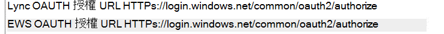

# <a name="how-to-configure-skype-for-business-on-premises-to-use-hybrid-modern-authentication"></a><span data-ttu-id="a59d1-103">如何設定商務用 Skype 內部部署以使用混合式新式驗證</span><span class="sxs-lookup"><span data-stu-id="a59d1-103">How to configure Skype for Business on-premises to use Hybrid Modern Authentication</span></span>

<span data-ttu-id="a59d1-104">*本文適用於 Microsoft 365 企業版和 Office 365 企業版。*</span><span class="sxs-lookup"><span data-stu-id="a59d1-104">*This article applies to both Microsoft 365 Enterprise and Office 365 Enterprise.*</span></span>

<span data-ttu-id="a59d1-105">新式驗證是一種可提供更安全的使用者驗證和授權的身分識別管理方法，可用於商務用 Skype server 內部部署和 Exchange 伺服器內部部署和分割網域商務用 Skype 混合式。</span><span class="sxs-lookup"><span data-stu-id="a59d1-105">Modern Authentication, is a method of identity management that offers more secure user authentication and authorization, is available for Skype for Business server on-premises and Exchange server on-premises, and split-domain Skype for Business hybrids.</span></span>

 <span data-ttu-id="a59d1-106">**重要事項** 您想要深入瞭解新式驗證 (MA) ，以及您想要在公司或組織中使用的原因為何？</span><span class="sxs-lookup"><span data-stu-id="a59d1-106">**Important** Would you like to know more about Modern Authentication (MA) and why you might prefer to use it in your company or organization?</span></span> <span data-ttu-id="a59d1-107">請查看 [這份檔](hybrid-modern-auth-overview.md) 中的概要。</span><span class="sxs-lookup"><span data-stu-id="a59d1-107">Check [this document](hybrid-modern-auth-overview.md) for an overview.</span></span> <span data-ttu-id="a59d1-108">如果您需要瞭解 MA 所支援的商務用 Skype 拓撲，請參閱此處所述！</span><span class="sxs-lookup"><span data-stu-id="a59d1-108">If you need to know what Skype for Business topologies are supported with MA, that's documented here!</span></span>

 <span data-ttu-id="a59d1-109">**開始之前**，我使用下列術語：</span><span class="sxs-lookup"><span data-stu-id="a59d1-109">**Before we begin**, I use these terms:</span></span>

- <span data-ttu-id="a59d1-110">新式驗證 (MA) </span><span class="sxs-lookup"><span data-stu-id="a59d1-110">Modern Authentication (MA)</span></span>

- <span data-ttu-id="a59d1-111">混合式新式驗證 (HMA) </span><span class="sxs-lookup"><span data-stu-id="a59d1-111">Hybrid Modern Authentication (HMA)</span></span>

- <span data-ttu-id="a59d1-112">Exchange 內部部署 (nm-exch-um-2nd) </span><span class="sxs-lookup"><span data-stu-id="a59d1-112">Exchange on-premises (EXCH)</span></span>

- <span data-ttu-id="a59d1-113">Exchange Online (EXO) </span><span class="sxs-lookup"><span data-stu-id="a59d1-113">Exchange Online (EXO)</span></span>

- <span data-ttu-id="a59d1-114">商務用 Skype 內部部署 (SFB) </span><span class="sxs-lookup"><span data-stu-id="a59d1-114">Skype for Business on-premises (SFB)</span></span>

- <span data-ttu-id="a59d1-115">商務用 Skype線上 (SFBO) </span><span class="sxs-lookup"><span data-stu-id="a59d1-115">Skype for Business Online (SFBO)</span></span>

<span data-ttu-id="a59d1-116">此外，如果本文中的圖形具有變暗或變暗的物件，表示以灰色顯示的元素 **不** 會包含在 MA 特有的設定中。</span><span class="sxs-lookup"><span data-stu-id="a59d1-116">Also, if a graphic in this article has an object that's grayed-out or dimmed that means the element shown in gray **isn't** included in MA-specific configuration.</span></span>

## <a name="read-the-summary"></a><span data-ttu-id="a59d1-117">閱讀摘要</span><span class="sxs-lookup"><span data-stu-id="a59d1-117">Read the summary</span></span>

<span data-ttu-id="a59d1-118">這項摘要會將程式分解成可能在執行期間遺失的步驟，而且很適合整個檢查清單以追蹤您在程式中的何處。</span><span class="sxs-lookup"><span data-stu-id="a59d1-118">This summary breaks down the process into steps that might otherwise get lost during the execution, and is good for an overall checklist to keep track of where you are in the process.</span></span>

1. <span data-ttu-id="a59d1-119">首先，請確定您符合所有必要條件。</span><span class="sxs-lookup"><span data-stu-id="a59d1-119">First, make sure you meet all the prerequisites.</span></span>

1. <span data-ttu-id="a59d1-120">由於許多 **必要條件** 對商務用 Skype 和 Exchange 都很常見，[請參閱預先要求之檢查清單的概述文章](hybrid-modern-auth-overview.md)。</span><span class="sxs-lookup"><span data-stu-id="a59d1-120">Since many **prerequisites** are common for both Skype for Business and Exchange, [see the overview article for your pre-req checklist](hybrid-modern-auth-overview.md).</span></span> <span data-ttu-id="a59d1-121">在您開始進行本文中的任何步驟之前，請  *先*  執行此動作。</span><span class="sxs-lookup"><span data-stu-id="a59d1-121">Do this  *before*  you begin any of the steps in this article.</span></span>

1. <span data-ttu-id="a59d1-122">收集檔案中所需的 HMA 特定資訊，或 OneNote。</span><span class="sxs-lookup"><span data-stu-id="a59d1-122">Collect the HMA-specific info you'll need in a file, or OneNote.</span></span>

1. <span data-ttu-id="a59d1-123">開啟 EXO (的新式驗證（如果尚未開啟) ）。</span><span class="sxs-lookup"><span data-stu-id="a59d1-123">Turn ON Modern Authentication for EXO (if it isn't already turned on).</span></span>

1. <span data-ttu-id="a59d1-124">開啟 SFBO (的新式驗證（如果尚未開啟) ）。</span><span class="sxs-lookup"><span data-stu-id="a59d1-124">Turn ON Modern Authentication for SFBO (if it isn't already turned on).</span></span>

1. <span data-ttu-id="a59d1-125">針對內部部署 Exchange 開啟混合式新式驗證。</span><span class="sxs-lookup"><span data-stu-id="a59d1-125">Turn ON Hybrid Modern Authentication for Exchange on-premises.</span></span>

1. <span data-ttu-id="a59d1-126">針對內部部署商務用 Skype 開啟混合式新式驗證。</span><span class="sxs-lookup"><span data-stu-id="a59d1-126">Turn ON Hybrid Modern Authentication for Skype for Business on-premises.</span></span>

<span data-ttu-id="a59d1-127">這些步驟會開啟 SFB、SFBO、NM-EXCH-UM-2ND 和 EXO 的 MA，也就是，所有可參與 HMA 設定的 SFB 及 SFBO (包括 NM-EXCH-UM-2ND/EXO) 上的相依性。</span><span class="sxs-lookup"><span data-stu-id="a59d1-127">These steps turn on MA for SFB, SFBO, EXCH, and EXO - that is, all the products that can participate in an HMA configuration of SFB and SFBO (including dependencies on EXCH/EXO).</span></span> <span data-ttu-id="a59d1-128">換句話說，如果您的使用者在混合式 (EXO + SFBO、EXO + SFB、NM-EXCH-UM-2ND + SFBO 或 NM-EXCH-UM-2ND + SFB) 中建立信箱，您的最終產品將如下所示：</span><span class="sxs-lookup"><span data-stu-id="a59d1-128">In other words, if your users are homed in/have mailboxes created in any part of the Hybrid (EXO + SFBO, EXO + SFB, EXCH + SFBO, or EXCH + SFB), your finished product will look like this:</span></span>


<span data-ttu-id="a59d1-130">如您所見，有四個不同的地方可開啟 MA！</span><span class="sxs-lookup"><span data-stu-id="a59d1-130">As you can see there are four different places to turn on MA!</span></span> <span data-ttu-id="a59d1-131">為了獲得最佳的使用者體驗，建議您在上述四個位置中開啟 MA。</span><span class="sxs-lookup"><span data-stu-id="a59d1-131">For the best user experience, we recommend you turn on MA in all four of these locations.</span></span> <span data-ttu-id="a59d1-132">[！注意] 如果您無法在這些位置中開啟 MA，請調整步驟，讓您只在環境所需的位置開啟 MA。</span><span class="sxs-lookup"><span data-stu-id="a59d1-132">If you can't turn MA on in all these locations, adjust the steps so that you turn on MA only in the locations that are necessary for your environment.</span></span>

<span data-ttu-id="a59d1-133">如需支援的拓撲，請參閱[適用于商務用 Skype](/skypeforbusiness/plan-your-deployment/modern-authentication/topologies-supported)的支援主題。</span><span class="sxs-lookup"><span data-stu-id="a59d1-133">See the [Supportability topic for Skype for Business with MA](/skypeforbusiness/plan-your-deployment/modern-authentication/topologies-supported) for supported topologies.</span></span>

 <span data-ttu-id="a59d1-134">**重要事項** 請仔細檢查您是否已符合所有必要條件，再開始之前。</span><span class="sxs-lookup"><span data-stu-id="a59d1-134">**Important** Double-check that you've met all the prerequisites before you begin.</span></span> <span data-ttu-id="a59d1-135">您會發現 [混合式新式驗證概述和必要條件](hybrid-modern-auth-overview.md)中的資訊。</span><span class="sxs-lookup"><span data-stu-id="a59d1-135">You'll find that information in [Hybrid modern authentication overview and prerequisites](hybrid-modern-auth-overview.md).</span></span>

## <a name="collect-all-hma-specific-info-youll-need"></a><span data-ttu-id="a59d1-136">收集您需要的所有 HMA 特有資訊</span><span class="sxs-lookup"><span data-stu-id="a59d1-136">Collect all HMA-specific info you'll need</span></span>

<span data-ttu-id="a59d1-137">當您已仔細檢查您是否符合使用新式驗證的 [必要條件](hybrid-modern-auth-overview.md) 時 (請參閱上述) 的附注，您應該建立檔案，以保留在前面步驟中設定 HMA 所需的資訊。</span><span class="sxs-lookup"><span data-stu-id="a59d1-137">After you've double-checked that you meet the [prerequisites](hybrid-modern-auth-overview.md) to use Modern Authentication (see the note above), you should create a file to hold the info you'll need for configuring HMA in the steps ahead.</span></span> <span data-ttu-id="a59d1-138">本文使用的範例：</span><span class="sxs-lookup"><span data-stu-id="a59d1-138">Examples used in this article:</span></span>

- <span data-ttu-id="a59d1-139">**SIP/SMTP 網域**</span><span class="sxs-lookup"><span data-stu-id="a59d1-139">**SIP/SMTP domain**</span></span>

  - <span data-ttu-id="a59d1-140">前。</span><span class="sxs-lookup"><span data-stu-id="a59d1-140">Ex.</span></span> <span data-ttu-id="a59d1-141">contoso.com (與 Office 365 同盟) </span><span class="sxs-lookup"><span data-stu-id="a59d1-141">contoso.com (is federated with Office 365)</span></span>

- <span data-ttu-id="a59d1-142">**租使用者識別碼**</span><span class="sxs-lookup"><span data-stu-id="a59d1-142">**Tenant ID**</span></span>

  - <span data-ttu-id="a59d1-143">contoso.onmicrosoft.com) 登入代表 Office 365 租使用者 (的 GUID。</span><span class="sxs-lookup"><span data-stu-id="a59d1-143">The GUID that represents your Office 365 tenant (at the login of contoso.onmicrosoft.com).</span></span>

- <span data-ttu-id="a59d1-144">**SFB 2015 CU5 Web 服務 URLs**</span><span class="sxs-lookup"><span data-stu-id="a59d1-144">**SFB 2015 CU5 Web Service URLs**</span></span>

<span data-ttu-id="a59d1-145">您將需要部署的所有 SfB 2015 集區的內部及外部 web 服務 URLs。</span><span class="sxs-lookup"><span data-stu-id="a59d1-145">you'll need internal and external web service URLs for all SfB 2015 pools deployed.</span></span> <span data-ttu-id="a59d1-146">若要取得這些，請從商務用 Skype 管理命令介面執行下列命令：</span><span class="sxs-lookup"><span data-stu-id="a59d1-146">To obtain these, run the following from Skype for Business Management Shell:</span></span>

```powershell
Get-CsService -WebServer | Select-Object PoolFqdn, InternalFqdn, ExternalFqdn | FL
```

- <span data-ttu-id="a59d1-147">前。</span><span class="sxs-lookup"><span data-stu-id="a59d1-147">Ex.</span></span> <span data-ttu-id="a59d1-148">內部： https://lyncwebint01.contoso.com</span><span class="sxs-lookup"><span data-stu-id="a59d1-148">Internal: https://lyncwebint01.contoso.com</span></span>

- <span data-ttu-id="a59d1-149">前。</span><span class="sxs-lookup"><span data-stu-id="a59d1-149">Ex.</span></span> <span data-ttu-id="a59d1-150">外部： https://lyncwebext01.contoso.com</span><span class="sxs-lookup"><span data-stu-id="a59d1-150">External: https://lyncwebext01.contoso.com</span></span>

<span data-ttu-id="a59d1-151">如果您是使用 Standard Edition 伺服器，則內部 URL 會是空白的。</span><span class="sxs-lookup"><span data-stu-id="a59d1-151">If you're using a Standard Edition server, the internal URL will be blank.</span></span> <span data-ttu-id="a59d1-152">在此情況下，請使用內部 URL 的集區 fqdn。</span><span class="sxs-lookup"><span data-stu-id="a59d1-152">In this case, use the pool fqdn for the internal URL.</span></span>

## <a name="turn-on-modern-authentication-for-exo"></a><span data-ttu-id="a59d1-153">開啟 EXO 的新式驗證</span><span class="sxs-lookup"><span data-stu-id="a59d1-153">Turn on Modern Authentication for EXO</span></span>

<span data-ttu-id="a59d1-154">遵循下列指示： [Exchange Online：如何針對新式驗證啟用租使用者。](https://social.technet.microsoft.com/wiki/contents/articles/32711.exchange-online-how-to-enable-your-tenant-for-modern-authentication.aspx)</span><span class="sxs-lookup"><span data-stu-id="a59d1-154">Follow the instructions here: [Exchange Online: How to enable your tenant for modern authentication.](https://social.technet.microsoft.com/wiki/contents/articles/32711.exchange-online-how-to-enable-your-tenant-for-modern-authentication.aspx)</span></span>

## <a name="turn-on-modern-authentication-for-sfbo"></a><span data-ttu-id="a59d1-155">開啟 SFBO 的新式驗證</span><span class="sxs-lookup"><span data-stu-id="a59d1-155">Turn on Modern Authentication for SFBO</span></span>

<span data-ttu-id="a59d1-156">請遵循下列指示：[商務用 Skype 線上：針對新式驗證啟用租使用者](https://social.technet.microsoft.com/wiki/contents/articles/34339.skype-for-business-online-enable-your-tenant-for-modern-authentication.aspx)。</span><span class="sxs-lookup"><span data-stu-id="a59d1-156">Follow the instructions here: [Skype for Business Online: Enable your tenant for modern authentication](https://social.technet.microsoft.com/wiki/contents/articles/34339.skype-for-business-online-enable-your-tenant-for-modern-authentication.aspx).</span></span>

## <a name="turn-on-hybrid-modern-authentication-for-exchange-on-premises"></a><span data-ttu-id="a59d1-157">在內部部署 Exchange 開啟混合式新式驗證</span><span class="sxs-lookup"><span data-stu-id="a59d1-157">Turn on Hybrid Modern Authentication for Exchange on-premises</span></span>

<span data-ttu-id="a59d1-158">遵循下列指示：[如何設定 Exchange Server 內部部署以使用混合式新式驗證](configure-exchange-server-for-hybrid-modern-authentication.md)。</span><span class="sxs-lookup"><span data-stu-id="a59d1-158">Follow the instructions here: [How to configure Exchange Server on-premises to use Hybrid Modern Authentication](configure-exchange-server-for-hybrid-modern-authentication.md).</span></span>

## <a name="turn-on-hybrid-modern-authentication-for-skype-for-business-on-premises"></a><span data-ttu-id="a59d1-159">在內部部署商務用 Skype 開啟混合式新式驗證</span><span class="sxs-lookup"><span data-stu-id="a59d1-159">Turn on Hybrid Modern Authentication for Skype for Business on-premises</span></span>

### <a name="add-on-premises-web-service-urls-as-spns-in-azure-active-directory"></a><span data-ttu-id="a59d1-160">在 Azure Active Directory 中將內部部署 web 服務 URLs 當做 Spn 新增</span><span class="sxs-lookup"><span data-stu-id="a59d1-160">Add on-premises web service URLs as SPNs in Azure Active Directory</span></span>

<span data-ttu-id="a59d1-161">現在，您必須執行命令，以新增) 為 SFBO 中的服務主體 (所收集的 URLs。</span><span class="sxs-lookup"><span data-stu-id="a59d1-161">Now you'll need to run commands to add the URLs (collected earlier) as Service Principals in SFBO.</span></span>

 <span data-ttu-id="a59d1-162">**記事** 服務主體名稱 (Spn) 識別 web 服務，並將它們與安全性主體 (例如帳戶名稱或群組) 等相關聯，這樣服務才能代表授權的使用者進行動作。</span><span class="sxs-lookup"><span data-stu-id="a59d1-162">**Note** Service principal names (SPNs) identify web services and associate them with a security principal (such as an account name or group) so that the service can act on the behalf of an authorized user.</span></span> <span data-ttu-id="a59d1-163">對伺服器進行驗證的用戶端會使用包含在 Spn 中的資訊。</span><span class="sxs-lookup"><span data-stu-id="a59d1-163">Clients authenticating to a server make use of information that's contained in SPNs.</span></span>

1. <span data-ttu-id="a59d1-164">首先，使用[這些指示](/powershell/azure/active-directory/overview)，連接至 Azure Active Directory (Azure AD) 。</span><span class="sxs-lookup"><span data-stu-id="a59d1-164">First, connect to Azure Active Directory (Azure AD) with [these instructions](/powershell/azure/active-directory/overview).</span></span>

2. <span data-ttu-id="a59d1-165">在內部部署中執行此命令，以取得 SFB web 服務 URLs 的清單。</span><span class="sxs-lookup"><span data-stu-id="a59d1-165">Run this command, on-premises, to get a list of SFB web service URLs.</span></span>

   <span data-ttu-id="a59d1-166">請注意，AppPrincipalId 會以開頭 `00000004` 。</span><span class="sxs-lookup"><span data-stu-id="a59d1-166">Note that the AppPrincipalId begins with `00000004`.</span></span> <span data-ttu-id="a59d1-167">這對應于線上商務用 Skype。</span><span class="sxs-lookup"><span data-stu-id="a59d1-167">This corresponds to Skype for Business Online.</span></span>

   <span data-ttu-id="a59d1-168">請記下 (和螢幕擷取畫面，以) 此命令的輸出，它會包含 SE 和 WS URL，但通常是由開頭的 spn 所組成 `00000004-0000-0ff1-ce00-000000000000/` 。</span><span class="sxs-lookup"><span data-stu-id="a59d1-168">Take note of (and screenshot for later comparison) the output of this command, which will include an SE and WS URL, but mostly consist of SPNs that begin with `00000004-0000-0ff1-ce00-000000000000/`.</span></span>

```powershell
Get-MsolServicePrincipal -AppPrincipalId 00000004-0000-0ff1-ce00-000000000000 | Select -ExpandProperty ServicePrincipalNames
```

3. <span data-ttu-id="a59d1-169">例如，如果內部 **或** 外部 SFB URLs 來自內部部署 (例如，則 https://lyncwebint01.contoso.com https://lyncwebext01.contoso.com) 需要將這些特定記錄新增至此清單。</span><span class="sxs-lookup"><span data-stu-id="a59d1-169">If the internal **or** external SFB URLs from on-premises are missing (for example, https://lyncwebint01.contoso.com and https://lyncwebext01.contoso.com) we will need to add those specific records to this list.</span></span>

    <span data-ttu-id="a59d1-170">請務必使用 Add 命令中的實際 URLs 取代下列  *範例 URLs* ！</span><span class="sxs-lookup"><span data-stu-id="a59d1-170">Be sure to replace  *the example URLs* below with your actual URLs in the Add commands!</span></span>

```powershell
$x= Get-MsolServicePrincipal -AppPrincipalId 00000004-0000-0ff1-ce00-000000000000
$x.ServicePrincipalnames.Add("https://lyncwebint01.contoso.com/")
$x.ServicePrincipalnames.Add("https://lyncwebext01.contoso.com/")
Set-MSOLServicePrincipal -AppPrincipalId 00000004-0000-0ff1-ce00-000000000000 -ServicePrincipalNames $x.ServicePrincipalNames
```

4. <span data-ttu-id="a59d1-171">再次執行步驟2上的 **new-msolserviceprincipal** 命令，然後查看輸出，以確認新增的記錄已新增。</span><span class="sxs-lookup"><span data-stu-id="a59d1-171">Verify your new records were added by running the **Get-MsolServicePrincipal** command from step 2 again, and looking through the output.</span></span> <span data-ttu-id="a59d1-172">將清單或螢幕擷取畫面與新的 Spn 清單進行比較。</span><span class="sxs-lookup"><span data-stu-id="a59d1-172">Compare the list or screenshot from before to the new list of SPNs.</span></span> <span data-ttu-id="a59d1-173">您也可以將新的記錄清單螢幕擷取畫面。</span><span class="sxs-lookup"><span data-stu-id="a59d1-173">You might also screenshot the new list for your records.</span></span> <span data-ttu-id="a59d1-174">如果您成功，您會在清單中看到兩個新的 URLs。</span><span class="sxs-lookup"><span data-stu-id="a59d1-174">If you were successful, you'll see the two new URLs in the list.</span></span> <span data-ttu-id="a59d1-175">接下來的範例，Spn 清單現在會包含特定的 URLs https://lyncwebint01.contoso.com 和 https://lyncwebext01.contoso.com/ 。</span><span class="sxs-lookup"><span data-stu-id="a59d1-175">Going by our example, the list of SPNs will now include the specific URLs https://lyncwebint01.contoso.com and https://lyncwebext01.contoso.com/.</span></span>

### <a name="create-the-evosts-auth-server-object"></a><span data-ttu-id="a59d1-176">建立 EvoSTS 驗證服務器物件</span><span class="sxs-lookup"><span data-stu-id="a59d1-176">Create the EvoSTS Auth Server Object</span></span>

<span data-ttu-id="a59d1-177">在商務用 Skype 管理命令介面中執行下列命令。</span><span class="sxs-lookup"><span data-stu-id="a59d1-177">Run the following command in the Skype for Business Management Shell.</span></span>

```powershell
New-CsOAuthServer -Identity evoSTS -MetadataURL https://login.windows.net/common/FederationMetadata/2007-06/FederationMetadata.xml -AcceptSecurityIdentifierInformation $true -Type AzureAD
```

### <a name="enable-hybrid-modern-authentication"></a><span data-ttu-id="a59d1-178">啟用混合式新式驗證</span><span class="sxs-lookup"><span data-stu-id="a59d1-178">Enable Hybrid Modern Authentication</span></span>

<span data-ttu-id="a59d1-179">這是實際開啟 MA 的步驟。</span><span class="sxs-lookup"><span data-stu-id="a59d1-179">This is the step that actually turns on MA.</span></span> <span data-ttu-id="a59d1-180">您可以事先執行上述所有步驟，而不需變更用戶端驗證流程。</span><span class="sxs-lookup"><span data-stu-id="a59d1-180">All the previous steps can be run ahead of time without changing the client authentication flow.</span></span> <span data-ttu-id="a59d1-181">當您準備好變更驗證流程時，請在商務用 Skype 管理命令介面中執行此命令。</span><span class="sxs-lookup"><span data-stu-id="a59d1-181">When you're ready to change the authentication flow, run this command in the Skype for Business Management Shell.</span></span>

```powershell
Set-CsOAuthConfiguration -ClientAuthorizationOAuthServerIdentity evoSTS
```

## <a name="verify"></a><span data-ttu-id="a59d1-182">驗證</span><span class="sxs-lookup"><span data-stu-id="a59d1-182">Verify</span></span>

<span data-ttu-id="a59d1-183">一旦您啟用 HMA，用戶端的下一個登入將會使用新的驗證流程。</span><span class="sxs-lookup"><span data-stu-id="a59d1-183">Once you enable HMA, a client's next login will use the new auth flow.</span></span> <span data-ttu-id="a59d1-184">請注意，只要開啟 HMA，就不會對任何用戶端觸發重新驗證。</span><span class="sxs-lookup"><span data-stu-id="a59d1-184">Note that just turning on HMA won't trigger a reauthentication for any client.</span></span> <span data-ttu-id="a59d1-185">用戶端會根據驗證權杖和/或憑證的存留時間來驗證。</span><span class="sxs-lookup"><span data-stu-id="a59d1-185">The clients reauthenticate based on the lifetime of the auth tokens and/or certs they have.</span></span>

<span data-ttu-id="a59d1-186">若要測試 HMA 在您啟用後是否正常運作，請登出 test SFB Windows 用戶端，並確定按一下「刪除我的認證」。</span><span class="sxs-lookup"><span data-stu-id="a59d1-186">To test that HMA is working after you've enabled it, sign out of a test SFB Windows client and be sure to click 'delete my credentials'.</span></span> <span data-ttu-id="a59d1-187">重新登入。</span><span class="sxs-lookup"><span data-stu-id="a59d1-187">Sign in again.</span></span> <span data-ttu-id="a59d1-188">用戶端現在應該使用新式驗證流程，而且您的登入現在會包含「工作或學校」帳戶的 **Office 365** 提示，在用戶端聯繫伺服器並登入之前看到。</span><span class="sxs-lookup"><span data-stu-id="a59d1-188">The client should now use the Modern Auth flow and your login will now include an **Office 365** prompt for a 'Work or school' account, seen right before the client contacts the server and logs you in.</span></span>

<span data-ttu-id="a59d1-189">您也應該檢查「設定資訊」，以取得「OAuth 授權」商務用 Skype 用戶端的「設定資訊」。</span><span class="sxs-lookup"><span data-stu-id="a59d1-189">You should also check the 'Configuration Information' for Skype for Business Clients for an 'OAuth Authority'.</span></span> <span data-ttu-id="a59d1-190">若要在用戶端電腦上執行這項作業，請在您以滑鼠右鍵按一下 Windows 通知列中的商務用 Skype 圖示時，按住 CTRL 鍵。</span><span class="sxs-lookup"><span data-stu-id="a59d1-190">To do this on your client computer, hold down the CTRL key at the same time you right-click the Skype for Business Icon in the Windows Notification tray.</span></span> <span data-ttu-id="a59d1-191">按一下出現的功能表中的 [設定 **資訊** ]。</span><span class="sxs-lookup"><span data-stu-id="a59d1-191">Click **Configuration Information** in the menu that appears.</span></span> <span data-ttu-id="a59d1-192">在桌面上會出現的「商務用 Skype 設定資訊」視窗中，尋找下列專案：</span><span class="sxs-lookup"><span data-stu-id="a59d1-192">In the 'Skype for Business Configuration Information' window that will appear on the desktop, look for the following:</span></span>



<span data-ttu-id="a59d1-194">您也應該同時按住 CTRL 鍵，以滑鼠右鍵按一下 Outlook 用戶端 (圖示，也就是在 [Windows 通知] 工作列) ，然後按一下 [線上狀態]。</span><span class="sxs-lookup"><span data-stu-id="a59d1-194">You should also hold down the CTRL key at the same time you right-click the icon for the Outlook client (also in the Windows Notifications tray) and click 'Connection Status'.</span></span> <span data-ttu-id="a59d1-195">根據「載體」的 AuthN 類型 \* （代表 OAuth 中使用的持有者權杖），尋找用戶端的 SMTP 位址。</span><span class="sxs-lookup"><span data-stu-id="a59d1-195">Look for the client's SMTP address against an AuthN type of 'Bearer\*', which represents the bearer token used in OAuth.</span></span>

## <a name="related-articles"></a><span data-ttu-id="a59d1-196">相關文章</span><span class="sxs-lookup"><span data-stu-id="a59d1-196">Related articles</span></span>

<span data-ttu-id="a59d1-197">[連結回新式驗證概述](hybrid-modern-auth-overview.md)。</span><span class="sxs-lookup"><span data-stu-id="a59d1-197">[Link back to the Modern Authentication overview](hybrid-modern-auth-overview.md).</span></span>

<span data-ttu-id="a59d1-198">您需要瞭解如何對您的商務用 Skype 用戶端使用新式驗證 (ADAL) 嗎？</span><span class="sxs-lookup"><span data-stu-id="a59d1-198">Do you need to know how to use Modern Authentication (ADAL) for your Skype for Business clients?</span></span> <span data-ttu-id="a59d1-199">我們已 [在這裡](./hybrid-modern-auth-overview.md)獲得步驟。</span><span class="sxs-lookup"><span data-stu-id="a59d1-199">We've got steps [here](./hybrid-modern-auth-overview.md).</span></span>