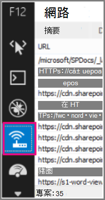

# <a name="content-delivery-networks-cdns"></a><span data-ttu-id="48299-103">內容傳遞網路（CDNs）</span><span class="sxs-lookup"><span data-stu-id="48299-103">Content Delivery Networks (CDNs)</span></span>

<span data-ttu-id="48299-104">*本文適用於 Microsoft 365 企業版和 Office 365 企業版。*</span><span class="sxs-lookup"><span data-stu-id="48299-104">*This article applies to both Microsoft 365 Enterprise and Office 365 Enterprise.*</span></span>

<span data-ttu-id="48299-105">cdn 有助於讓使用者快速且可靠地 Office 365。</span><span class="sxs-lookup"><span data-stu-id="48299-105">CDNs help keep Office 365 fast and reliable for end users.</span></span> <span data-ttu-id="48299-106">雲端服務（如 Office 365）使用 cdn 快取靜態資產以快取靜態資產，以加速下載速度，並降低感覺到的使用者延遲。</span><span class="sxs-lookup"><span data-stu-id="48299-106">Cloud services like Office 365 use CDNs to cache static assets closer to the browsers requesting them to speed up downloads and reduce perceived end user latency.</span></span> <span data-ttu-id="48299-107">本主題中的資訊可協助您瞭解內容傳遞網路 (Cdn) 以及 Office 365 的使用方式。</span><span class="sxs-lookup"><span data-stu-id="48299-107">The information in this topic will help you learn about Content Delivery Networks (CDNs) and how they are used by Office 365.</span></span>

## <a name="what-exactly-is-a-cdn"></a><span data-ttu-id="48299-108">CDN 的確切含義為何？</span><span class="sxs-lookup"><span data-stu-id="48299-108">What exactly is a CDN?</span></span>

<span data-ttu-id="48299-109">CDN 是以地理位置分散的網路組成，由高速骨幹絡所連接之資料中心內的 proxy 和檔案伺服器組成。</span><span class="sxs-lookup"><span data-stu-id="48299-109">A CDN is a geographically distributed network consisting of proxy and file servers in datacenters connected by high-speed backbone networks.</span></span> <span data-ttu-id="48299-110">Cdn 是用來減少網站或服務中一組指定檔案和物件的延遲和載入時間。</span><span class="sxs-lookup"><span data-stu-id="48299-110">CDNs are used to reduce latency and load times for a specified set of files and objects in a web site or service.</span></span> <span data-ttu-id="48299-111">CDN 可以有多個端點，以取得來自任何位置之傳入要求的最佳服務。</span><span class="sxs-lookup"><span data-stu-id="48299-111">A CDN may have many thousands of endpoints for optimal servicing of incoming requests from any location.</span></span>

<span data-ttu-id="48299-112">cdn 通常是用來為網站或服務（如 javascript 檔案、圖示及影像）提供更快速的一般內容下載，也可以提供使用者內容的私人存取權，例如 SharePoint 線上文件庫中的檔案、流式媒體檔及自訂程式碼。</span><span class="sxs-lookup"><span data-stu-id="48299-112">CDNs are commonly used to provide faster downloads of generic content for a web site or service such as javascript files, icons and images, and can also provide private access to user content such as files in SharePoint Online document libraries, streaming media files, and custom code.</span></span>

<span data-ttu-id="48299-113">Cdn 是大多數 enterprise 雲端服務所使用。</span><span class="sxs-lookup"><span data-stu-id="48299-113">CDNs are used by most enterprise cloud services.</span></span> <span data-ttu-id="48299-114">類似 Office 365 的雲端服務，有數百萬個客戶下載混合的專有 (內容，例如電子郵件) 和一般內容 (例如一次) 圖示。</span><span class="sxs-lookup"><span data-stu-id="48299-114">Cloud services like Office 365 have millions of customers downloading a mix of proprietary content (such as emails) and generic content (such as icons) at one time.</span></span> <span data-ttu-id="48299-115">更有效率的方式是讓每個人使用的影像（像是圖示）盡可能接近使用者的電腦。</span><span class="sxs-lookup"><span data-stu-id="48299-115">It's more efficient to put images everyone uses, like icons, as close to the user's computer as possible.</span></span> <span data-ttu-id="48299-116">在每個大都市區域中（或甚至是世界各地的每一個主要網際網路中樞）都可以建立此一般內容的 CDN 資料中心，所以這些 cdn 都是共用的。</span><span class="sxs-lookup"><span data-stu-id="48299-116">It isn't practical for every cloud service to build CDN datacenters that store this generic content in every metropolitan area, or even in every major Internet hub around the world, so some of these CDNs are shared.</span></span>

## <a name="how-do-cdns-make-services-work-faster"></a><span data-ttu-id="48299-117">Cdn 如何讓服務運作速度更快？</span><span class="sxs-lookup"><span data-stu-id="48299-117">How do CDNs make services work faster?</span></span>

<span data-ttu-id="48299-118">以網站影像和圖示重新下載等一般物件，可以佔用網路頻寬，可更好地用來下載重要的個人內容，例如電子郵件或檔。</span><span class="sxs-lookup"><span data-stu-id="48299-118">Downloading common objects like site images and icons over and over again can take up network bandwidth that can be better used for downloading important personal content, like email or documents.</span></span> <span data-ttu-id="48299-119">因為 Office 365 使用包含 cdn 的架構，所以可以從更接近用戶端電腦的伺服器下載圖示、腳本及其他一般內容，使下載速度更快。</span><span class="sxs-lookup"><span data-stu-id="48299-119">Because Office 365 uses an architecture that includes CDNs, the icons, scripts, and other generic content can be downloaded from servers closer to client computers, making the downloads faster.</span></span> <span data-ttu-id="48299-120">這表示更快速存取您的個人內容，該內容會安全地儲存在 Office 365 資料中心。</span><span class="sxs-lookup"><span data-stu-id="48299-120">This means faster access to your personal content, which is securely stored in Office 365 datacenters.</span></span>

<span data-ttu-id="48299-121">Cdn 協助您以數種方式改善雲端服務的效能：</span><span class="sxs-lookup"><span data-stu-id="48299-121">CDNs help to improve cloud service performance in several ways:</span></span>

- <span data-ttu-id="48299-122">Cdn 將網路和檔案下載無償的一部分從雲端服務中移出，以釋放雲端服務資源，以服務使用者內容和其他服務，方法是減少對靜態資產要求的服務。</span><span class="sxs-lookup"><span data-stu-id="48299-122">CDNs shift part of the network and file download burden away from the cloud service, freeing up cloud service resources for serving user content and other services by reducing the need to serve requests for static assets.</span></span>
- <span data-ttu-id="48299-123">Cdn 是專門構建的功能，可透過實施高效能網路和檔案伺服器，以及利用更新的網路通訊協定（例如 [HTTP/2](https://en.wikipedia.org/wiki/HTTP/2) ）來提供低延遲的檔案存取，並以極高的壓縮方式和要求多工。</span><span class="sxs-lookup"><span data-stu-id="48299-123">CDNs are purpose built to provide low-latency file access by implementing high performance networks and file servers, and by leveraging updated network protocols such as [HTTP/2](https://en.wikipedia.org/wiki/HTTP/2) with highly efficient compression and request multiplexing.</span></span>
- <span data-ttu-id="48299-124">CDN 網路使用許多全域分散式端點，讓內容可以盡可能接近使用者。</span><span class="sxs-lookup"><span data-stu-id="48299-124">CDN networks use many globally distributed endpoints to make content available as close as possible to users.</span></span>

## <a name="the-office-365-cdn"></a><span data-ttu-id="48299-125">Office 365 CDN</span><span class="sxs-lookup"><span data-stu-id="48299-125">The Office 365 CDN</span></span>

<span data-ttu-id="48299-126">內建的 Office 365 內容傳遞網路 (CDN) ，可讓 Office 365 的系統管理員為其組織的 SharePoint 線上頁面提供更好的效能，其方式是快取靜態資產，使其更接近于瀏覽器要求的位置，這有助於加速下載並減少延遲時間。</span><span class="sxs-lookup"><span data-stu-id="48299-126">The built-in Office 365 Content Delivery Network (CDN) allows Office 365 administrators to provide better performance for their organization's SharePoint Online pages by caching static assets closer to the browsers requesting them, which helps to speed up downloads and reduce latency.</span></span> <span data-ttu-id="48299-127">Office 365 CDN 使用[HTTP/2 通訊協定](https://en.wikipedia.org/wiki/HTTP/2)，以提升壓縮及下載速度。</span><span class="sxs-lookup"><span data-stu-id="48299-127">The Office 365 CDN uses the [HTTP/2 protocol](https://en.wikipedia.org/wiki/HTTP/2) for improved compression and download speeds.</span></span>

> [!NOTE]
> <span data-ttu-id="48299-128">Office 365 CDN 僅可用於 **實際** 執行 (全球) 雲端的承租人。</span><span class="sxs-lookup"><span data-stu-id="48299-128">The Office 365 CDN is only available to tenants in the **Production** (worldwide) cloud.</span></span> <span data-ttu-id="48299-129">美國政府、中國和德國雲彩中的承租人目前不支援 Office 365 CDN。</span><span class="sxs-lookup"><span data-stu-id="48299-129">Tenants in the US Government, China and Germany clouds do not currently support the Office 365 CDN.</span></span>

<span data-ttu-id="48299-130">Office 365 CDN 是由可讓您在多個位置或 _來源_ 主控靜態資產的多個 CDN 組成，並透過全球高速網路提供資產。</span><span class="sxs-lookup"><span data-stu-id="48299-130">The Office 365 CDN is composed of multiple CDNs that allow you to host static assets in multiple locations, or _origins_, and serve them from global high-speed networks.</span></span> <span data-ttu-id="48299-131">根據您要在 Office 365 CDN 中主控的內容類型而定，您可以新增 **公用** 來源、**私人** 來源或兩者。</span><span class="sxs-lookup"><span data-stu-id="48299-131">Depending on the kind of content you want to host in the Office 365 CDN, you can add **public** origins, **private** origins or both.</span></span>

<span data-ttu-id="48299-132"></span><span class="sxs-lookup"><span data-stu-id="48299-132"></span></span>

<span data-ttu-id="48299-133">Office 365 CDN 內 **公用** 來源中的內容可透過匿名方式存取，並且可供具有託管資產 URL 的任何人存取。</span><span class="sxs-lookup"><span data-stu-id="48299-133">Content in **public** origins within the Office 365 CDN is accessible anonymously, and can be accessed by anyone who has URLs to hosted assets.</span></span> <span data-ttu-id="48299-134">因為對公用來源中內容的存取是匿名的，您應該只使用公用來源來快取非敏感性的一般內容，例如 javascript 檔案、指令碼、圖示和影像。</span><span class="sxs-lookup"><span data-stu-id="48299-134">Because access to content in public origins is anonymous, you should only use them to cache non-sensitive generic content such as javascript files, scripts, icons and images.</span></span> <span data-ttu-id="48299-135">預設會使用 Office 365 CDN 來從公開來源下載一般資源資產，例如 Office 365 用戶端應用程式。</span><span class="sxs-lookup"><span data-stu-id="48299-135">The Office 365 CDN is used by default for downloading generic resource assets like the Office 365 client applications from a public origin.</span></span>

<span data-ttu-id="48299-136">Office 365 內的 **私人** 來源 CDN 提供使用者內容的私人存取，例如 SharePoint 線上文件庫、網站和專有圖像。</span><span class="sxs-lookup"><span data-stu-id="48299-136">**Private** origins within the Office 365 CDN provide private access to user content such as SharePoint Online document libraries, sites and proprietary images.</span></span> <span data-ttu-id="48299-137">對私人來源中內容的存取會使用動態產生的權杖來保護，使得它只能供具有原始文件庫或儲存位置權限的使用者存取。</span><span class="sxs-lookup"><span data-stu-id="48299-137">Access to content in private origins is secured with dynamically generated tokens so it can only be accessed by users with permissions to the original document library or storage location.</span></span> <span data-ttu-id="48299-138">Office 365 CDN 中的私人來源僅能用於 SharePoint Online 內容，並且您只能透過從您的 SharePoint Online 租用戶重新導向來存取資產。</span><span class="sxs-lookup"><span data-stu-id="48299-138">Private origins in the Office 365 CDN can only be used for SharePoint Online content, and you can only access assets through redirection from your SharePoint Online tenant.</span></span>

<span data-ttu-id="48299-139">Office 365 CDN 服務包含在 SharePoint Online 訂閱的一部分。</span><span class="sxs-lookup"><span data-stu-id="48299-139">The Office 365 CDN service is included as part of your SharePoint Online subscription.</span></span>

<span data-ttu-id="48299-140">如需如何使用 Office 365 CDN 的詳細資訊，請參閱[use the Office 365 content 傳遞網路搭配 SharePoint Online](use-microsoft-365-cdn-with-spo.md)。</span><span class="sxs-lookup"><span data-stu-id="48299-140">For more information about how to use the Office 365 CDN, see [Use the Office 365 content delivery network with SharePoint Online](use-microsoft-365-cdn-with-spo.md).</span></span>

<span data-ttu-id="48299-141">若要觀看一系列簡短的影片，提供使用 Office 365 CDN 的概念性和 HOWTO 資訊，請造訪[SharePoint 開發人員模式和做法 YouTube 通道](https://aka.ms/sppnp-videos)。</span><span class="sxs-lookup"><span data-stu-id="48299-141">To watch a series of short videos that provide conceptual and HOWTO information about using the Office 365 CDN, visit the [SharePoint Developer Patterns and Practices YouTube channel](https://aka.ms/sppnp-videos).</span></span>

## <a name="other-microsoft-cdns"></a><span data-ttu-id="48299-142">其他 Microsoft Cdn</span><span class="sxs-lookup"><span data-stu-id="48299-142">Other Microsoft CDNs</span></span>

<span data-ttu-id="48299-143">雖然不是 Office 365 CDN 的一部分，但您可以在 Office 365 承租人中使用這些 cdn，以存取 SharePoint 開發庫、自訂程式碼，以及超出 Office 365 CDN 範圍的其他目的。</span><span class="sxs-lookup"><span data-stu-id="48299-143">Although not a part of the Office 365 CDN, you can use these CDNs in your Office 365 tenant for access to SharePoint development libraries, custom code and other purposes that fall outside the scope of the Office 365 CDN.</span></span>

### <a name="azure-cdn"></a><span data-ttu-id="48299-144">Azure CDN</span><span class="sxs-lookup"><span data-stu-id="48299-144">Azure CDN</span></span>

>[!NOTE]
><span data-ttu-id="48299-145">從第 3 2020 季度開始，SharePoint 線上將開始在 Azure CDN 上快取影片，以支援改善的播放和可靠性。</span><span class="sxs-lookup"><span data-stu-id="48299-145">Beginning in Q3 2020, SharePoint Online will begin caching videos on the Azure CDN to support improved video playback and reliability.</span></span> <span data-ttu-id="48299-146">流行影片會從最接近使用者的 CDN 端點流向。</span><span class="sxs-lookup"><span data-stu-id="48299-146">Popular videos will be streamed from the CDN endpoint closest to the user.</span></span> <span data-ttu-id="48299-147">此資料仍會保留在 Microsoft 365 符合性界限內。</span><span class="sxs-lookup"><span data-stu-id="48299-147">This data will remain within the Microsoft 365 compliance boundary.</span></span> <span data-ttu-id="48299-148">這是所有承租人的免費服務，且不需要任何客戶行動可供設定。</span><span class="sxs-lookup"><span data-stu-id="48299-148">This is a free service for all tenants and it does not require any customer action to configure.</span></span>

<span data-ttu-id="48299-149">您可以使用 **Azure CDN** 來部署您自己的 CDN 實例以主控自訂網頁元件、文件庫及其他資源資產，這可讓您將存取按鍵套用至 CDN 儲存區，以及對 CDN 設定進行更好的控制。</span><span class="sxs-lookup"><span data-stu-id="48299-149">You can use the **Azure CDN** to deploy your own CDN instance for hosting custom web parts, libraries and other resource assets, which allows you to apply access keys to your CDN storage and exert greater control over your CDN configuration.</span></span> <span data-ttu-id="48299-150">使用 Azure CDN 不是免費的，需要 Azure 訂閱。</span><span class="sxs-lookup"><span data-stu-id="48299-150">Use of the Azure CDN is not free, and requires an Azure subscription.</span></span>

<span data-ttu-id="48299-151">如需如何設定 Azure CDN 實例的詳細資訊，請參閱[快速入門：整合 Azure 儲存體帳戶與 Azure CDN](/azure/cdn/cdn-create-a-storage-account-with-cdn)。</span><span class="sxs-lookup"><span data-stu-id="48299-151">For more information on how to configure an Azure CDN instance, see [Quickstart: Integrate an Azure storage account with Azure CDN](/azure/cdn/cdn-create-a-storage-account-with-cdn).</span></span>

<span data-ttu-id="48299-152">如需如何使用 Azure CDN 以主控 SharePoint 網頁元件的範例，請參閱[將 SharePoint 用戶端網頁元件部署到 Azure CDN](/sharepoint/dev/spfx/web-parts/get-started/deploy-web-part-to-cdn)。</span><span class="sxs-lookup"><span data-stu-id="48299-152">For an example of how the Azure CDN can be used to host SharePoint web parts, see [Deploy your SharePoint client-side web part to Azure CDN](/sharepoint/dev/spfx/web-parts/get-started/deploy-web-part-to-cdn).</span></span>

<span data-ttu-id="48299-153">如需 Azure CDN PowerShell 模組的相關資訊，請參閱[Manage Azure CDN with PowerShell](/azure/cdn/cdn-manage-powershell)。</span><span class="sxs-lookup"><span data-stu-id="48299-153">For information about the Azure CDN PowerShell module, see [Manage Azure CDN with PowerShell](/azure/cdn/cdn-manage-powershell).</span></span>

### <a name="microsoft-ajax-cdn"></a><span data-ttu-id="48299-154">Microsoft Ajax CDN</span><span class="sxs-lookup"><span data-stu-id="48299-154">Microsoft Ajax CDN</span></span>

<span data-ttu-id="48299-155">Microsoft 的 **Ajax CDN** 是一種唯讀 CDN，可提供許多流行的開發文件庫，包括 jQuery (和其所有其他文件庫) 、ASP.NET Ajax、啟動、Knockout.js 和其他。</span><span class="sxs-lookup"><span data-stu-id="48299-155">Microsoft's **Ajax CDN** is a read-only CDN that offers many popular development libraries including jQuery (and all of its other libraries), ASP.NET Ajax, Bootstrap, Knockout.js, and others.</span></span>
  
<span data-ttu-id="48299-156">若要在專案中包含這些腳本，只需將這些已公開可用之文件庫的參照取代為 CDN 位址，而不是將其包含在專案本身中。</span><span class="sxs-lookup"><span data-stu-id="48299-156">To include these scripts in your project, simply replace any references to these publicly available libraries with references to the CDN address instead of including it in your project itself.</span></span> <span data-ttu-id="48299-157">例如，使用下列程式碼連結到 jQuery：</span><span class="sxs-lookup"><span data-stu-id="48299-157">For example, use the following code to link to jQuery:</span></span>

``` html
<script src=https://ajax.aspnetcdn.com/ajax/jquery-2.1.1.js> </script>
```

<span data-ttu-id="48299-158">如需如何使用 microsoft ajax CDN 的詳細資訊，請參閱[Microsoft ajax CDN](/aspnet/ajax/cdn/overview)。</span><span class="sxs-lookup"><span data-stu-id="48299-158">For more information about how to use the Microsoft Ajax CDN, see [Microsoft Ajax CDN](/aspnet/ajax/cdn/overview).</span></span>

## <a name="how-does-office-365-use-content-from-a-cdn"></a><span data-ttu-id="48299-159">Office 365 如何使用 CDN 中的內容？</span><span class="sxs-lookup"><span data-stu-id="48299-159">How does Office 365 use content from a CDN?</span></span>

<span data-ttu-id="48299-160">不論您為 Office 365 租使用者所設定的 CDN 為何，基本資料檢索程式都是相同的。</span><span class="sxs-lookup"><span data-stu-id="48299-160">Regardless of what CDN you configure for your Office 365 tenant, the basic data retrieval process is the same.</span></span>

1. <span data-ttu-id="48299-161">您的用戶端 (瀏覽器或 Office 用戶端應用程式) 要求來自 Office 365 的資料。</span><span class="sxs-lookup"><span data-stu-id="48299-161">Your client (a browser or Office client application) requests data from Office 365.</span></span>

2. <span data-ttu-id="48299-162">Office 365 要麼直接將資料傳回給用戶端，或是如果資料屬於 CDN 所主控的一組內容，則會將用戶端重新導向至 CDN URL。</span><span class="sxs-lookup"><span data-stu-id="48299-162">Office 365 either returns the data directly to your client or, if the data is part of a set of content hosted by the CDN, redirects your client to the CDN URL.</span></span>

    <span data-ttu-id="48299-163">a.</span><span class="sxs-lookup"><span data-stu-id="48299-163">a.</span></span> <span data-ttu-id="48299-164">如果資料已經快取到 _公用_ 來源中，您的用戶端將直接從最接近的 CDN 位置下載資料至用戶端。</span><span class="sxs-lookup"><span data-stu-id="48299-164">If the data is already cached in a _public_ origin, your client downloads the data directly from the nearest CDN location to your client.</span></span>

    <span data-ttu-id="48299-165">b.</span><span class="sxs-lookup"><span data-stu-id="48299-165">b.</span></span> <span data-ttu-id="48299-166">如果資料已經快取到 _私人_ 來源中，CDN 服務便會檢查您 Office 365 使用者帳戶對於原始位置的許可權。</span><span class="sxs-lookup"><span data-stu-id="48299-166">If the data is already cached in a _private_ origin, the CDN service checks your Office 365 user account's permissions on the origin.</span></span> <span data-ttu-id="48299-167">如果您有許可權，SharePoint 線上會以動態方式產生自訂 url，該 URL 由 CDN 中的資產路徑和兩個存取權杖組成，並傳回用戶端的自訂 url。</span><span class="sxs-lookup"><span data-stu-id="48299-167">If you have permissions, SharePoint Online dynamically generates a custom URL composed of the path to the asset in the CDN and two access tokens, and returns the custom URL to your client.</span></span> <span data-ttu-id="48299-168">您的用戶端接著使用自訂 URL，直接從最接近的 CDN 位置將資料下載至用戶端。</span><span class="sxs-lookup"><span data-stu-id="48299-168">Your client then downloads the data directly from the nearest CDN location to your client using the custom URL.</span></span>

3. <span data-ttu-id="48299-169">如果資料未在 CDN 快取，CDN 節點要求 Office 365 中的資料，然後在用戶端下載資料後快取資料一段時間。</span><span class="sxs-lookup"><span data-stu-id="48299-169">If the data isn't cached at the CDN, the CDN node requests the data from Office 365 and then caches the data for a period of time after your client downloads the data.</span></span>

<span data-ttu-id="48299-170">CDN 會將最接近的資料中心輸出至使用者的瀏覽器，並使用重新導向從那裡下載所要求的資料。</span><span class="sxs-lookup"><span data-stu-id="48299-170">The CDN figures out the closest datacenter to the user's browser and, using redirection, downloads the requested data from there.</span></span> <span data-ttu-id="48299-171">CDN 重新導向是一種快速的，可節約使用者許多下載時間。</span><span class="sxs-lookup"><span data-stu-id="48299-171">CDN redirection is quick, and can save users a lot of download time.</span></span>

## <a name="how-should-i-set-up-my-network-so-that-cdns-work-best-with-office-365"></a><span data-ttu-id="48299-172">我應該如何設定網路，讓 Cdn Office 365 最適合使用？</span><span class="sxs-lookup"><span data-stu-id="48299-172">How should I set up my network so that CDNs work best with Office 365?</span></span>

<span data-ttu-id="48299-173">將網路上用戶端與 CDN 端點之間的延遲降至最低，是確保最佳效能的重要考慮。</span><span class="sxs-lookup"><span data-stu-id="48299-173">Minimizing latency between clients on your network and CDN endpoints is the key consideration for ensuring optimal performance.</span></span> <span data-ttu-id="48299-174">您可以使用[管理 Office 365 端點](managing-office-365-endpoints.md)中所述的最佳作法，以確保網路設定允許用戶端瀏覽器直接存取 CDN，而不是透過中央 proxy 路由傳送 CDN 流量，以避免引入不必要的延遲。</span><span class="sxs-lookup"><span data-stu-id="48299-174">You can use the best practices outlined in [Managing Office 365 endpoints](managing-office-365-endpoints.md) to ensure that your network configuration permits client browsers to access the CDN directly rather than routing CDN traffic through central proxies to avoid introducing unnecessary latency.</span></span>

<span data-ttu-id="48299-175">您也可以閱讀[Office 365 網路連線原則](./microsoft-365-network-connectivity-principles.md)，以瞭解優化 Office 365 網路效能的概念。</span><span class="sxs-lookup"><span data-stu-id="48299-175">You can also read [Office 365 Network Connectivity Principles](./microsoft-365-network-connectivity-principles.md) to understand the concepts behind optimizing Office 365 network performance.</span></span>

## <a name="is-there-a-list-of-all-the-cdns-that-office-365-uses"></a><span data-ttu-id="48299-176">是否有 Office 365 所使用之所有 cdn 的清單？</span><span class="sxs-lookup"><span data-stu-id="48299-176">Is there a list of all the CDNs that Office 365 uses?</span></span>

<span data-ttu-id="48299-177">Office 365 所使用的 cdn 一定會變更，而且在許多情況下，事件中所設定的多個 CDN 協力廠商無法使用。</span><span class="sxs-lookup"><span data-stu-id="48299-177">The CDNs in use by Office 365 are always subject to change and in many cases there are multiple CDN partners configured in the event one is unavailable.</span></span> <span data-ttu-id="48299-178">Office 365 所使用的主要 cdn 包括：</span><span class="sxs-lookup"><span data-stu-id="48299-178">The primary CDNs used by Office 365 are:</span></span>

|<span data-ttu-id="48299-179">CDN</span><span class="sxs-lookup"><span data-stu-id="48299-179">CDN</span></span>  |<span data-ttu-id="48299-180">Company</span><span class="sxs-lookup"><span data-stu-id="48299-180">Company</span></span>  |<span data-ttu-id="48299-181">Usage</span><span class="sxs-lookup"><span data-stu-id="48299-181">Usage</span></span>  |<span data-ttu-id="48299-182">連結</span><span class="sxs-lookup"><span data-stu-id="48299-182">Link</span></span>  |
|---------|---------|---------|---------|
|<span data-ttu-id="48299-183">Office 365 CDN</span><span class="sxs-lookup"><span data-stu-id="48299-183">Office 365 CDN</span></span>     |<span data-ttu-id="48299-184">Akamai</span><span class="sxs-lookup"><span data-stu-id="48299-184">Akamai</span></span>         |<span data-ttu-id="48299-185">公用來源中的一般資產，SharePoint 私人來源中的使用者內容</span><span class="sxs-lookup"><span data-stu-id="48299-185">Generic assets in public origins, SharePoint user content in private origins</span></span>         |[<span data-ttu-id="48299-186">在線上使用 Office 365 內容傳遞網路 SharePoint</span><span class="sxs-lookup"><span data-stu-id="48299-186">Use the Office 365 content delivery network with SharePoint Online</span></span>](use-microsoft-365-cdn-with-spo.md)         |
|<span data-ttu-id="48299-187">Azure CDN</span><span class="sxs-lookup"><span data-stu-id="48299-187">Azure CDN</span></span>     |<span data-ttu-id="48299-188">Microsoft</span><span class="sxs-lookup"><span data-stu-id="48299-188">Microsoft</span></span>         |<span data-ttu-id="48299-189">自訂程式碼、SharePoint 架構解決方案</span><span class="sxs-lookup"><span data-stu-id="48299-189">Custom code, SharePoint Framework solutions</span></span>         |[<span data-ttu-id="48299-190">Microsoft Azure CDN</span><span class="sxs-lookup"><span data-stu-id="48299-190">Microsoft Azure CDN</span></span>](https://azure.microsoft.com/documentation/services/cdn/)         |
|<span data-ttu-id="48299-191">Microsoft Ajax CDN (唯讀) </span><span class="sxs-lookup"><span data-stu-id="48299-191">Microsoft Ajax CDN (read only)</span></span>     |<span data-ttu-id="48299-192">Microsoft</span><span class="sxs-lookup"><span data-stu-id="48299-192">Microsoft</span></span>         |<span data-ttu-id="48299-193">適用于 Ajax、jQuery、ASP.NET、啟動、Knockout.js 等的常見文件庫。</span><span class="sxs-lookup"><span data-stu-id="48299-193">Common libraries for Ajax, jQuery, ASP.NET, Bootstrap, Knockout.js etc.</span></span>         |[<span data-ttu-id="48299-194">Microsoft Ajax CDN</span><span class="sxs-lookup"><span data-stu-id="48299-194">Microsoft Ajax CDN</span></span>](/aspnet/ajax/cdn/overview)         |

## <a name="what-performance-gains-does-a-cdn-provide"></a><span data-ttu-id="48299-195">CDN 提供什麼效能提升？</span><span class="sxs-lookup"><span data-stu-id="48299-195">What performance gains does a CDN provide?</span></span>

<span data-ttu-id="48299-196">在評估直接從 Office 365 下載之資料與從特定 CDN （例如，與您 CDN 租使用者相關的位置）與從特定（如您的位置相關的位置）時，會有許多因素，例如，CDN 所提供的頁面上的資產數量，以及網路延遲及頻寬的暫時性變更。</span><span class="sxs-lookup"><span data-stu-id="48299-196">There are many factors involved in measuring specific differences in performance between data downloaded directly from Office 365 and data downloaded from a specific CDN, such as your location relative to your tenant and to the nearest CDN endpoint, the number of assets on a page that are served by the CDN, and transient changes in network latency and bandwidth.</span></span> <span data-ttu-id="48299-197">不過，簡單的 A/B 測試可協助顯示特定檔案的下載時間差異。</span><span class="sxs-lookup"><span data-stu-id="48299-197">However, a simple A/B test can help to show the difference in download time for a specific file.</span></span>

<span data-ttu-id="48299-198">下列螢幕擷取畫面說明 Office 365 中的原生檔案位置與[Microsoft Ajax 內容傳遞網路](/aspnet/ajax/cdn/overview)所主控的相同檔案之間的下載速度差異。</span><span class="sxs-lookup"><span data-stu-id="48299-198">The following screen shots illustrate the difference in download speed between the native file location in Office 365 and the same file hosted on the [Microsoft Ajax Content Delivery Network](/aspnet/ajax/cdn/overview).</span></span> <span data-ttu-id="48299-199">這些螢幕擷取畫面位於 Internet Explorer 11 開發人員工具的 [ **網路** ] 索引標籤中。</span><span class="sxs-lookup"><span data-stu-id="48299-199">These screen shots are from the **Network** tab in the Internet Explorer 11 developer tools.</span></span> <span data-ttu-id="48299-200">這些螢幕擷取畫面顯示熱門文件庫 jQuery 上的延遲。</span><span class="sxs-lookup"><span data-stu-id="48299-200">These screen shots show the latency on the popular library jQuery.</span></span> <span data-ttu-id="48299-201">若要開啟此畫面，請在 Internet Explorer 中按 **F12** ，然後選取 [ **網路** ] 索引標籤，該索引標籤會以 Wi-Fi 圖示 symbolized。</span><span class="sxs-lookup"><span data-stu-id="48299-201">To bring up this screen, in Internet Explorer, press **F12** and select the **Network** tab which is symbolized with a Wi-Fi icon.</span></span>
  

  
<span data-ttu-id="48299-203">這個螢幕擷取畫面會顯示上傳至主版頁面圖庫的文件庫，位於 SharePoint 線上網站本身。</span><span class="sxs-lookup"><span data-stu-id="48299-203">This screen shot shows the library uploaded to the master page gallery on the SharePoint Online site itself.</span></span> <span data-ttu-id="48299-204">上傳文件庫所需的時間是1.51 秒。</span><span class="sxs-lookup"><span data-stu-id="48299-204">The time it took to upload the library is 1.51 seconds.</span></span>
  

  
<span data-ttu-id="48299-206">第二個螢幕擷取畫面會顯示由 Microsoft 的 CDN 所傳遞的相同檔案。</span><span class="sxs-lookup"><span data-stu-id="48299-206">The second screen shot shows the same file delivered by Microsoft's CDN.</span></span> <span data-ttu-id="48299-207">這段時間的延遲大約是496毫秒。</span><span class="sxs-lookup"><span data-stu-id="48299-207">This time the latency is around 496 milliseconds.</span></span> <span data-ttu-id="48299-208">這是一種大量改進，會顯示整秒的 shaved，以下載該物件的總時間。</span><span class="sxs-lookup"><span data-stu-id="48299-208">This is a large improvement and shows that a whole second is shaved off the total time to download the object.</span></span>
  


## <a name="is-my-data-safe"></a><span data-ttu-id="48299-210">資料是否安全？</span><span class="sxs-lookup"><span data-stu-id="48299-210">Is my data safe?</span></span>

<span data-ttu-id="48299-211">我們非常小心謹慎，以保護執行您公司的資料。</span><span class="sxs-lookup"><span data-stu-id="48299-211">We take great care to protect the data that runs your business.</span></span> <span data-ttu-id="48299-212">儲存在 Office 365 CDN 中的資料會在傳輸期間和靜止時加密，而存取 Office 365 SharePoint CDN 中的資料，都是以 Office 365 使用者權限和權杖授權來保護。</span><span class="sxs-lookup"><span data-stu-id="48299-212">Data stored in the Office 365 CDN is encrypted both in transit and at rest, and access to data in the Office 365 SharePoint CDN is secured by Office 365 user permissions and token authorization.</span></span> <span data-ttu-id="48299-213">Office 365 SharePoint CDN 中的資料要求必須從) 租使用者 (重新導向 Office 365，否則將不會產生授權權杖。</span><span class="sxs-lookup"><span data-stu-id="48299-213">Requests for data in the Office 365 SharePoint CDN must be referred (redirected) from your Office 365 tenant or an authorization token will not be generated.</span></span>

<span data-ttu-id="48299-214">為了確保您的資料仍然安全，我們建議您不要將使用者內容或其他敏感性資料儲存在公用 CDN。</span><span class="sxs-lookup"><span data-stu-id="48299-214">To ensure that your data remains secure, we recommend that you never store user content or other sensitive data in a public CDN.</span></span> <span data-ttu-id="48299-215">因為存取公用 CDN 中的資料是匿名的，所以 public cdn 只應該用來主控一般內容，例如 web 腳本檔案、圖示、圖像和其他非機密資產。</span><span class="sxs-lookup"><span data-stu-id="48299-215">Because access to data in a public CDN is anonymous, public CDNs should only be used to host generic content such as web script files, icons, images and other non-sensitive assets.</span></span>

> [!NOTE]
> <span data-ttu-id="48299-216">協力廠商 CDN 提供者可能具有與 Office 365 信任中心所述的承諾不同的隱私權和符合性標準。</span><span class="sxs-lookup"><span data-stu-id="48299-216">3rd party CDN providers may have privacy and compliance standards that differ from the commitments outlined by the Office 365 Trust Center.</span></span> <span data-ttu-id="48299-217">透過 CDN 服務快取的資料可能不符合 Microsoft 資料處理字詞 (DPT) ，而且可能位於 Office 365 信任中心規範界限外。</span><span class="sxs-lookup"><span data-stu-id="48299-217">Data cached through the CDN service may not conform to the Microsoft Data Processing Terms (DPT), and may be outside of the Office 365 Trust Center compliance boundaries.</span></span>

<span data-ttu-id="48299-218">如需 Office 365 CDN 提供者之隱私權和資料保護的詳細資訊，請造訪下列專案：</span><span class="sxs-lookup"><span data-stu-id="48299-218">For in-depth information about privacy and data protection for Office 365 CDN providers, visit the following:</span></span>  

- <span data-ttu-id="48299-219">深入瞭解[Microsoft 信任中心](https://www.microsoft.com/trustcenter)Office 365 隱私權和資料保護</span><span class="sxs-lookup"><span data-stu-id="48299-219">Learn more about Office 365 privacy and data protection at the [Microsoft Trust Center](https://www.microsoft.com/trustcenter)</span></span>
- <span data-ttu-id="48299-220">深入瞭解[Akamai 隱私權信任中心](https://www.akamai.com/us/en/about/compliance/data-protection-at-akamai.jsp)的 Akamai 隱私權和資料保護</span><span class="sxs-lookup"><span data-stu-id="48299-220">Learn more about Akamai’s privacy and data protection at the [Akamai Privacy Trust Center](https://www.akamai.com/us/en/about/compliance/data-protection-at-akamai.jsp)</span></span>
- <span data-ttu-id="48299-221">深入瞭解[Azure 信任中心](https://azure.microsoft.com/overview/trusted-cloud/)azure 隱私權和資料保護</span><span class="sxs-lookup"><span data-stu-id="48299-221">Learn more about Azure privacy and data protection at the [Azure Trust Center](https://azure.microsoft.com/overview/trusted-cloud/)</span></span>

## <a name="how-can-i-secure-my-network-with-all-these-3rd-party-services"></a><span data-ttu-id="48299-222">如何在所有的協力廠商服務中保護我的網路？</span><span class="sxs-lookup"><span data-stu-id="48299-222">How can I secure my network with all these 3rd party services?</span></span>

<span data-ttu-id="48299-223">利用一組廣泛的合作夥伴服務，可讓 Office 365 在使用 Office 365 時，擴充及滿足可用性需求，同時增強使用者體驗。</span><span class="sxs-lookup"><span data-stu-id="48299-223">Leveraging an extensive set of partner services allows Office 365 to scale and meet availability requirements as well as enhance the user experience when using Office 365.</span></span> <span data-ttu-id="48299-224">協力廠商服務 Office 365 利用憑證吊銷清單，包括憑證吊銷清單。例如 crl.microsoft.com 或 sa.symcb.com，以及 Cdn;例如 r3.res.outlook.com。</span><span class="sxs-lookup"><span data-stu-id="48299-224">The 3rd party services Office 365 leverages include both certificate revocation lists; such as crl.microsoft.com or sa.symcb.com, and CDNs; such as r3.res.outlook.com.</span></span> <span data-ttu-id="48299-225">Office 365 所產生的每個 CDN fqdn，都是 Office 365 的自訂 fqdn。</span><span class="sxs-lookup"><span data-stu-id="48299-225">Every CDN FQDN generated by Office 365 is a custom FQDN for Office 365.</span></span> <span data-ttu-id="48299-226">如果您是在 Office 365 要求傳送至 FQDN，您可以保證 CDN 提供者控制該位置的 fqdn 和基礎內容。</span><span class="sxs-lookup"><span data-stu-id="48299-226">If you're sent to a FQDN at the request of Office 365 you can be assured that the CDN provider controls the FQDN and the underlying content at that location.</span></span>
  
<span data-ttu-id="48299-227">若客戶想要將要求從協力廠商的要求隔離到 Microsoft 或 Office 365 資料中心，我們已撰寫[管理 Office 365 端點](https://support.office.com/article/99cab9d4-ef59-4207-9f2b-3728eb46bf9a)的指導方針。</span><span class="sxs-lookup"><span data-stu-id="48299-227">For customers that want to segregate requests destined for a Microsoft or Office 365 datacenter from requests that are destined for a 3rd party, we've written up guidance on [Managing Office 365 endpoints](https://support.office.com/article/99cab9d4-ef59-4207-9f2b-3728eb46bf9a).</span></span>

## <a name="is-there-a-list-of-all-the-fqdns-that-leverage-cdns"></a><span data-ttu-id="48299-228">是否有所有利用 Cdn 的 Fqdn 清單？</span><span class="sxs-lookup"><span data-stu-id="48299-228">Is there a list of all the FQDNs that leverage CDNs?</span></span>

<span data-ttu-id="48299-229">Fqdn 清單，以及如何利用 Cdn 隨時間而變更的方式。</span><span class="sxs-lookup"><span data-stu-id="48299-229">The list of FQDNs and how they leverage CDNs change over time.</span></span> <span data-ttu-id="48299-230">請參閱我們發佈的[Office 365 URLs 及 IP 位址範圍](./urls-and-ip-address-ranges.md)] 頁面，以取得利用 cdn 的最新 fqdn 的最新狀態。</span><span class="sxs-lookup"><span data-stu-id="48299-230">Refer to our published [Office 365 URLs and IP address ranges](./urls-and-ip-address-ranges.md) page to get up to date on the latest FQDNs that leverage CDNs.</span></span>

<span data-ttu-id="48299-231">您也可以使用[Office 365 IP 位址和 URL Web 服務](microsoft-365-ip-web-service.md)，要求目前的 Office 365 URLs 以及格式化為 CSV 或 JSON 的 IP 位址範圍。</span><span class="sxs-lookup"><span data-stu-id="48299-231">You can also use the [Office 365 IP Address and URL Web service](microsoft-365-ip-web-service.md) to request the current Office 365 URLs and IP address ranges formatted as CSV or JSON.</span></span>

## <a name="can-i-use-my-own-cdn-and-cache-content-on-my-local-network"></a><span data-ttu-id="48299-232">我是否可以在本機網路上使用自己的 CDN 及快取內容？</span><span class="sxs-lookup"><span data-stu-id="48299-232">Can I use my own CDN and cache content on my local network?</span></span>

<span data-ttu-id="48299-233">我們不斷尋找新的方法來支援客戶的需求，而且目前探索使用快取 proxy 解決方案和其他內部部署 CDN 解決方案。</span><span class="sxs-lookup"><span data-stu-id="48299-233">We're continually looking for new ways to support our customers needs and are currently exploring the use of caching proxy solutions and other on-premises CDN solutions.</span></span>

<span data-ttu-id="48299-234">雖然這不是 Office 365 CDN 的一部分，但您也可以使用 **Azure CDN** 來主控自訂網頁元件、文件庫及其他資源資產，這可讓您將存取按鍵套用到 CDN 儲存區，以及對您的 CDN 設定進行更大的控制。</span><span class="sxs-lookup"><span data-stu-id="48299-234">Although it is not a part of the Office 365 CDN, you can also use the **Azure CDN** for hosting custom web parts, libraries and other resource assets, which allows you to apply access keys to your CDN storage and exert greater control over your CDN configuration.</span></span> <span data-ttu-id="48299-235">使用 Azure CDN 不是免費的，需要 Azure 訂閱。</span><span class="sxs-lookup"><span data-stu-id="48299-235">Use of the Azure CDN is not free, and requires an Azure subscription.</span></span> <span data-ttu-id="48299-236">如需如何設定 Azure CDN 實例的詳細資訊，請參閱[快速入門：整合 Azure 儲存體帳戶與 Azure CDN](/azure/cdn/cdn-create-a-storage-account-with-cdn)。</span><span class="sxs-lookup"><span data-stu-id="48299-236">For more information on how to configure an Azure CDN instance, see [Quickstart: Integrate an Azure storage account with Azure CDN](/azure/cdn/cdn-create-a-storage-account-with-cdn).</span></span>

## <a name="im-using-azure-expressroute-for-office-365-does-that-change-things"></a><span data-ttu-id="48299-237">我正在使用 Azure ExpressRoute 進行 Office 365，是否會變更專案？</span><span class="sxs-lookup"><span data-stu-id="48299-237">I'm using Azure ExpressRoute for Office 365, does that change things?</span></span>

<span data-ttu-id="48299-238">[Office 365 的 Azure ExpressRoute](azure-expressroute.md)提供專用的連線，以 Office 365 從公用網際網路隔離的基礎結構。</span><span class="sxs-lookup"><span data-stu-id="48299-238">[Azure ExpressRoute for Office 365](azure-expressroute.md) provides a dedicated connection to Office 365 infrastructure that is segregated from the public internet.</span></span> <span data-ttu-id="48299-239">這表示用戶端仍需要透過非 ExpressRoute 連線進行連線，以連接至 Cdn，以及未明確包含 ExpressRoute 所支援之服務清單中的其他 Microsoft 基礎結構。</span><span class="sxs-lookup"><span data-stu-id="48299-239">This means that clients will still need to connect over non-ExpressRoute connections to connect to CDNs and other Microsoft infrastructure that is not explicitly included in the list of services supported by ExpressRoute.</span></span> <span data-ttu-id="48299-240">如需如何路由傳送特定流量的詳細資訊（例如目的地為 cdn 的要求），請參閱[Office 365 網路流量管理](routing-with-expressroute.md)。</span><span class="sxs-lookup"><span data-stu-id="48299-240">For more information about how to route specific traffic such as requests destined for CDNs, refer to [Office 365 network traffic management](routing-with-expressroute.md).</span></span>

## <a name="can-i-use-cdns-with-sharepoint-server-on-premises"></a><span data-ttu-id="48299-241">我可以搭配使用 cdn 與 SharePoint Server 內部部署嗎？</span><span class="sxs-lookup"><span data-stu-id="48299-241">Can I use CDNs with SharePoint Server on-premises?</span></span>

<span data-ttu-id="48299-242">使用 cdn 只會在 SharePoint Online 內容中有意義，而且應避免 SharePoint 伺服器。</span><span class="sxs-lookup"><span data-stu-id="48299-242">Using CDNs only makes sense in a SharePoint Online context and should be avoided with SharePoint Server.</span></span> <span data-ttu-id="48299-243">這是因為地理位置的所有優點都不會保留為 true，如果伺服器位於內部部署或同時關閉。</span><span class="sxs-lookup"><span data-stu-id="48299-243">This is because all of the advantages around geographic location do not hold true if the server is located on-premises or geographically close anyway.</span></span> <span data-ttu-id="48299-244">此外，如果網路連線到其所主控的伺服器上，則可以在沒有網際網路連線的情況下使用該網站，因此無法取得 CDN 檔案。</span><span class="sxs-lookup"><span data-stu-id="48299-244">Additionally, if there is a network connection to the servers where it's hosted, then the site may be used without an Internet connection and therefore cannot retrieve the CDN files.</span></span> <span data-ttu-id="48299-245">否則，您應該使用 CDN 若您的網站所需的文件庫和檔案有可用及穩定的功能。</span><span class="sxs-lookup"><span data-stu-id="48299-245">Otherwise, you should use a CDN if there is one available and stable for the library and files you need for your site.</span></span>
  
<span data-ttu-id="48299-246">您可以使用下列短連結返回這裡：[https://aka.ms/o365cdns]()</span><span class="sxs-lookup"><span data-stu-id="48299-246">Here's a short link you can use to come back: [https://aka.ms/o365cdns]()</span></span>
  
## <a name="see-also"></a><span data-ttu-id="48299-247">另請參閱</span><span class="sxs-lookup"><span data-stu-id="48299-247">See also</span></span>

[<span data-ttu-id="48299-248">Office 365 網路連線原則</span><span class="sxs-lookup"><span data-stu-id="48299-248">Office 365 Network Connectivity Principles</span></span>](./microsoft-365-network-connectivity-principles.md)

[<span data-ttu-id="48299-249">評估 Office 365 的網路連線能力</span><span class="sxs-lookup"><span data-stu-id="48299-249">Assessing Office 365 network connectivity</span></span>](assessing-network-connectivity.md)

[<span data-ttu-id="48299-250">管理 Office 365 端點</span><span class="sxs-lookup"><span data-stu-id="48299-250">Managing Office 365 endpoints</span></span>](managing-office-365-endpoints.md)

[<span data-ttu-id="48299-251">Office 365 URL 與 IP 位址範圍</span><span class="sxs-lookup"><span data-stu-id="48299-251">Office 365 URLs and IP address ranges</span></span>](./urls-and-ip-address-ranges.md)

[<span data-ttu-id="48299-252">在線上使用 Office 365 內容傳遞網路 SharePoint</span><span class="sxs-lookup"><span data-stu-id="48299-252">Use the Office 365 content delivery network with SharePoint Online</span></span>](use-microsoft-365-cdn-with-spo.md)

[<span data-ttu-id="48299-253">Microsoft 信任中心</span><span class="sxs-lookup"><span data-stu-id="48299-253">Microsoft Trust Center</span></span>](https://www.microsoft.com/trustcenter)

[<span data-ttu-id="48299-254">調整 Office 365 效能</span><span class="sxs-lookup"><span data-stu-id="48299-254">Tune Office 365 performance</span></span>](tune-microsoft-365-performance.md)