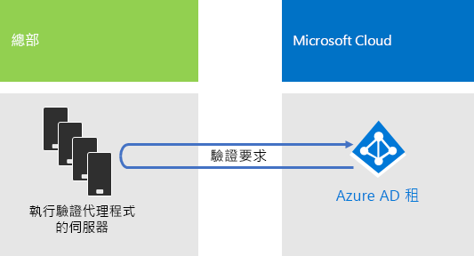

# Contoso Corporation 的身分識別

**摘要：** Contoso 如何利用識別即服務 (IDaaS)，為其員工提供雲端式驗證，為其合作夥伴和客戶提供同盟驗證。

Microsoft 在具有 Azure Active Directory (AD) 的雲端供應項目之間提供身分識別即服務 (IDaaS)。為了採用 Microsoft 365 企業版，Contoso 的 IDaaS 解決方案必須運用其內部部署的身分識別提供者，並且仍然包含使用其現有信任的第三方身分識別提供者的同盟驗證。

## Contoso 的 Windows Server AD 樹系

Contoso 在 contoso.com 上會使用單一 Windows Server Active Directory (AD) 樹系，以及七個分屬全球各地區的子網域。總部、地區中心辦公室和衛星辦公室包含用於本機驗證與授權的網域控制站。

圖 1 顯示 Contoso 樹系，具有包含區域中樞之不同世界各地的區域網域。

 
**圖 1：Contoso 的樹系和世界各地的網域**

Contoso 希望在 contoso.com 樹系中使用的帳戶和群組，以對其雲端式應用程式和工作負載進行驗證及授權。

## Contoso 的同盟驗證基礎結構

Contoso 允許︰

- 客戶使用自己的 Microsoft、Facebook 或 Google 郵件帳戶登入其公用網站。
- 廠商及合作夥伴使用自己的 LinkedIn、Salesforce 或 Google 郵件帳戶登入外部網路。

圖 2 顯示 Contoso DMZ，其中包含公用網站、合作夥伴外部網路，和一組 Active Directory 同盟服務 (AD FS) 伺服器。DMZ 會連線到網際網路，其中包含客戶、合作夥伴和網際網路服務。

**圖 2：Contoso 對於客戶和合作夥伴同盟驗證的支援**
 
DMZ 中的 AD FS 伺服器會驗證客戶的認證以存取公用網站，以及驗證合作夥伴的憑證以存取合作夥伴外部網路。

Contoso 決定要保留此基礎結構，並讓它專屬於客戶和合作夥伴驗證。Contoso 的身分識別工程師會調查此基礎結構到 Azure AD [B2B](https://docs.microsoft.com/azure/active-directory/b2b/hybrid-organizations) 與 [B2C](https://docs.microsoft.com/azure/active-directory-b2c/solution-articles) 解決方案的轉換。

## 混合式身分識別，具有雲端式驗證的通過驗證

Contoso 想要使用其內部部署 Windows Server AD 樹系來驗證 Microsoft 365 雲端資源。它決定使用具有密碼雜湊同步處理 (PHS) 的通過驗證 (PTA)。

### PTA 驗證

針對使用者認證的驗證，Contoso 使用 PTA。當 Contoso 使用者存取雲端式資源時，它傳送的認證會由 Azure AD 傳遞至 Contoso 總部資料中心中執行驗證代理程式的伺服器。其中一部驗證代理程式伺服器會代表 Azure AD 來驗證使用者認證。

圖 3 顯示 Contoso 總部中執行驗證代理程式的一組伺服器，這些伺服器會處理從 Azure AD 傳遞給它們的驗證要求。 

 
**圖 3：Contoso 的通過驗證基礎結構**

Contoso 選擇 PTA 來履行安全性需求，要求評估所有驗證嘗試以了解是否對內部部署 Windows Server AD 樹系進行使用者帳戶狀態、密碼原則及登入時數的立即變更。

### PHS

PHS 會同步處理內部部署 Windows Server AD 樹系與 Microsoft 365 企業版訂閱中的 Azure AD 租用戶，複製使用者和群組帳戶以及雜湊版本的使用者帳戶密碼。Contoso 決定使用 PHS，在 PTA 無法使用時，提供直接以 Azure AD 租用戶進行驗證的替代方法。

為了執行後續的目錄同步處理，Contoso 已在巴黎資料中心的伺服器上部署 Azure AD Connect 工具。圖 4 顯示執行 Azure AD Connect 的伺服器正在輪詢 Contoso Windows Server AD 樹系是否有變更，然後將這些變更與 Azure AD 租用戶進行同步處理。

 
**圖 4：Contoso 的 PHS 目錄同步處理基礎結構**

## 身分識別的條件式存取原則

Contoso 建立一組 Azure AD [條件式存取原則](identity-access-policies.md)，以確保當 Azure AD 判斷驗證要求有登入風險時，會強制執行多重要素驗證和密碼變更。

圖 5 顯示身分識別的條件式存取原則結果集合。

 
**圖 5：Contoso 的身分識別型條件式存取原則**

## 下一步

[了解](contoso-win10.md) Contoso 如何使用 System Center Configuration Manager 基礎結構，在整個組織部署及保持目前的 Windows 10 企業版。

## 另請參閱

[Microsoft 365 企業版的身分識別](identity-infrastructure.md)

[部署指南](deploy-microsoft-365-enterprise.md)

[測試實驗室指南](m365-enterprise-test-lab-guides.md)
