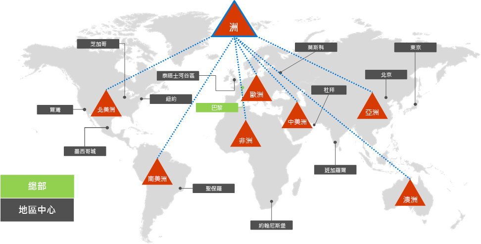
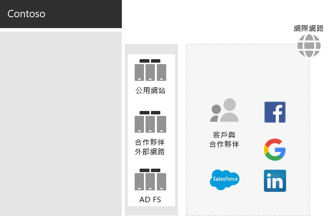
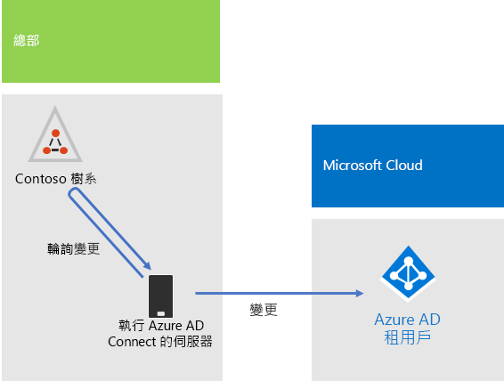
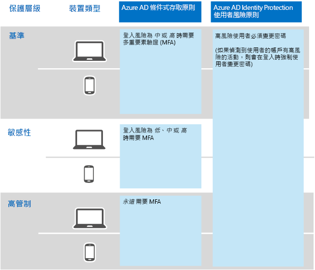

# Contoso Corporation 的身分識別

**摘要：** Contoso 如何利用識別即服務 (IDaaS)，為其員工提供雲端式驗證，為其合作夥伴和客戶提供同盟驗證。

Microsoft 在具有 Azure Active Directory (AD) 的雲端供應項目之間提供身分識別即服務 (IDaaS)。 為了採用 Microsoft 365 企業版，Contoso 的 IDaaS 解決方案必須運用其內部部署的身分識別提供者，並且仍然包含使用其現有信任的第三方身分識別提供者的同盟驗證。

## Contoso 的 Active Directory Domain Services 樹系

Contoso 在 contoso.com 上會使用單一 Active Directory Domain Services (AD DS) 樹系，以及七個分屬全球各地區的子網域。 總部、地區中心辦公室和衛星辦公室包含用於本機驗證與授權的網域控制站。

圖 1 顯示 Contoso 樹系，具有包含區域中樞之不同世界各地的區域網域。

 
**圖 1：Contoso 的樹系和世界各地的網域**

Contoso 希望在 contoso.com 樹系中使用帳戶和群組，以對其 Microsoft 365 工作負載和服務進行驗證及授權。

## Contoso 的同盟驗證基礎結構

Contoso 允許︰

- 客戶使用自己的 Microsoft、Facebook 或 Google 郵件帳戶登入其公用網站。
- 廠商及合作夥伴使用自己的 LinkedIn、Salesforce 或 Google 郵件帳戶登入外部網路。

圖 2 顯示 Contoso DMZ，其中包含公用網站、合作夥伴外部網路，和一組 Active Directory 同盟服務 (AD FS) 伺服器。DMZ 會連線到網際網路，其中包含客戶、合作夥伴和網際網路服務。

**圖 2：Contoso 對於客戶和合作夥伴同盟驗證的支援**
 
DMZ 中的 AD FS 伺服器可協助依其身分識別提供者來驗證客戶的認證以存取公用網站，以及驗證合作夥伴的認證以存取合作夥伴外部網路。

Contoso 決定要保留此基礎結構，並且讓它專門用於客戶和合作夥伴驗證。 Contoso 身分識別架構師正在調查此基礎結構轉換到 Azure AD [B2B](https://docs.microsoft.com/azure/active-directory/b2b/hybrid-organizations) 和 [B2C](https://docs.microsoft.com/azure/active-directory-b2c/solution-articles) 的解決方案。

## 用於雲端式驗證的混合式身分識別和密碼雜湊同步

Contoso 公司想要使用其內部部署 AD DS 樹系來對 Microsoft 365 雲端資源進行驗證。 其決定使用密碼雜湊同步 (PHS)。

PHS 會同步處理內部部署 AD DS 樹系與 Microsoft 365 企業版訂閱中的 Azure AD 租用戶，並複製使用者和群組帳戶以及雜湊版本的使用者帳戶密碼。 

為了執行後續的目錄同步處理，Contoso 已在巴黎資料中心的伺服器上部署 Azure AD Connect 工具。 圖 3 顯示執行 Azure AD Connect 的伺服器正在輪詢 Contoso AD 樹系是否有變更，然後將這些變更與 Azure AD 租用戶進行同步。

 
**圖 3：Contoso 的 PHS 目錄同步處理基礎結構**

## 身分識別和裝置存取的條件式存取原則

Contoso 已針對三個保護層級建立一組 Azure AD 和 Intune 的[條件式存取原則](identity-access-policies.md)：

- **基本**保護適用於所有使用者帳戶
- **機密**保護適用於高階領導人和主管人員
- **高管制**保護適用於財務、法務和研究部門中的特定使用者，他們需存取高管制的資料

圖 4 顯示身分識別及裝置條件式存取原則的結果集合。

 
**圖 4：Contoso 的身分識別及裝置條件式存取原則**

## 下一步

[了解](contoso-win10.md) Contoso 如何使用 System Center Configuration Manager 基礎結構，在整個組織部署及保持目前的 Windows 10 企業版。

## 另請參閱

[Microsoft 365 企業版的身分識別](identity-infrastructure.md)

[部署指南](deploy-microsoft-365-enterprise.md)

[測試實驗室指南](m365-enterprise-test-lab-guides.md)
