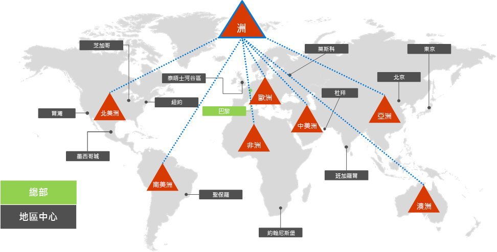
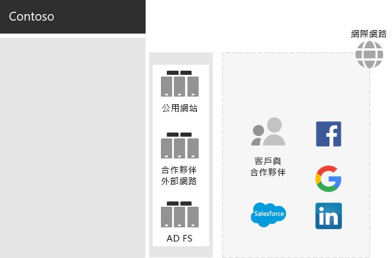
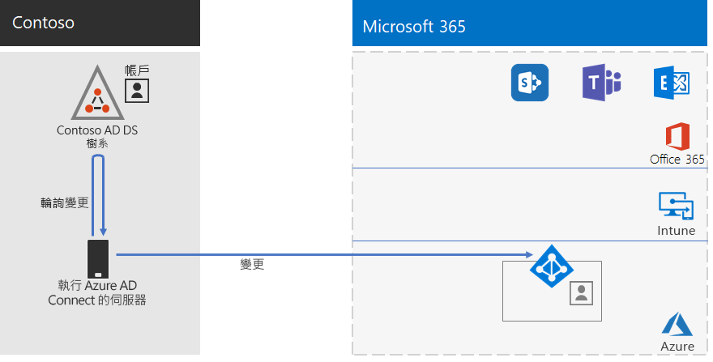
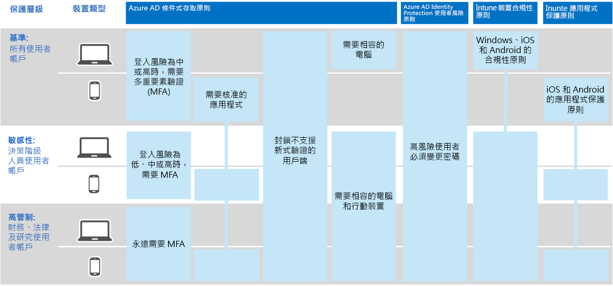

# Contoso Corporation 的身分識別

Microsoft 透過 Azure Active Directory (Azure AD) ，以服務 (IDaaS) 所有雲端產品。 若要採用 Microsoft 365 for enterprise，Contoso IDaaS 解決方案必須使用內部部署身分識別提供者，並將同盟驗證納入現有的受信任的協力廠商身分識別提供者。

## Contoso Active Directory 網域服務樹系

Contoso 會使用單一 Active Directory 網域服務，將 contoso com 的單一 Active Directory 網域 (服務) 樹系 \. 與7個子域搭配使用，一個用於世界各地區的一個。 總部、地區中心辦公室和衛星辦公室包含用於本機驗證與授權的網域控制站。

以下是 Contoso 樹系，具有地區性網域，包含區域中樞的不同部分。

 
contoso 決定使用 contoso com 樹系中的帳戶和群組 \. ，進行其 Microsoft 365 工作負載和服務的驗證和授權。

## Contoso 同盟驗證基礎結構

Contoso 允許︰

- 客戶可以使用其 Microsoft、Facebook 或 Google 郵件帳戶登入公司的公開網站。
- 廠商和協力廠商使用其 LinkedIn、Salesforce 或 Google 郵件帳戶登入公司的外部網路。

以下是包含公用網站、第三個外部網路，以及一組 Active Directory Federation Services (AD FS) 伺服器的 Contoso DMZ。 DMZ 會連線到包含客戶、合作夥伴和網際網路服務的網際網路。

 
在 DMZ 中的 AD FS 伺服器，可協助其身分識別提供者驗證客戶認證，以存取公用網站和夥伴驗證，以存取合作夥伴外部網路。

Contoso 決定保留這種基礎結構，並將其專用於客戶及夥伴驗證。 Contoso 身分識別架構師正在調查此基礎結構轉換到 Azure AD [B2B](/azure/active-directory/b2b/hybrid-organizations) 和 [B2C](/azure/active-directory-b2c/solution-articles) 的解決方案。

## 用於雲端式驗證的混合式身分識別和密碼雜湊同步

Contoso 想要使用內部部署 AD DS 樹系進行驗證，以 Microsoft 365 雲端資源。 它決定使用密碼雜湊同步處理 (PHS) 。

PHS 會同步處理內部部署 AD DS 樹系與其 Microsoft 365 for enterprise 訂閱的 Azure ad 租使用者，複製使用者和群組帳戶，以及散列版本的使用者帳戶密碼。

Contoso 在其巴黎 datacenter 中的伺服器上部署 Azure AD 連線工具，以進行目錄同步處理。

以下是執行 Azure AD 連線的伺服器輪詢 Contoso AD DS 樹系以進行變更，然後使用 Azure AD 租使用者同步這些變更。

 
## 身分識別和裝置存取的條件式存取原則

Contoso 已針對三個保護層級建立一組 Azure AD 和 Intune 的[條件式存取原則](../security/defender-365-security/identity-access-policies.md)：

- *基準* 保護適用于所有使用者帳戶。
- *機密* 保護適用于資深領導人和高層人員。
- 「*高管制* 防護」適用于財務、法律和研究部門中具有高管制資料存取權的特定使用者。

以下是 Contoso 身分識別和裝置條件式存取原則的結果集合。

 
## 下一步

瞭解 Contoso 如何使用它的 Microsoft Endpoint Configuration Manager 基礎結構，在整個組織中[部署及保持目前的 Windows 10 企業版](contoso-win10.md)。

## 另請參閱

[Microsoft 365 的身分識別藍圖](identity-roadmap-microsoft-365.md)

[Microsoft 365 企業版概觀](microsoft-365-overview.md)

[測試實驗室指南](m365-enterprise-test-lab-guides.md)