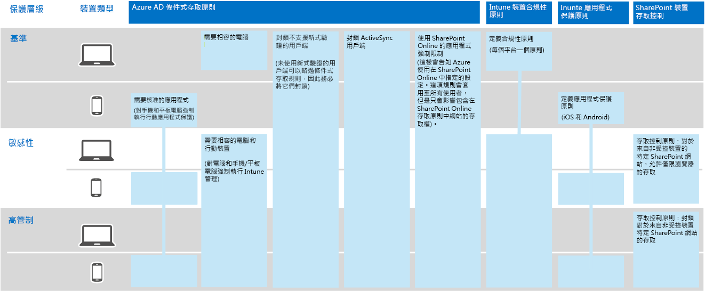
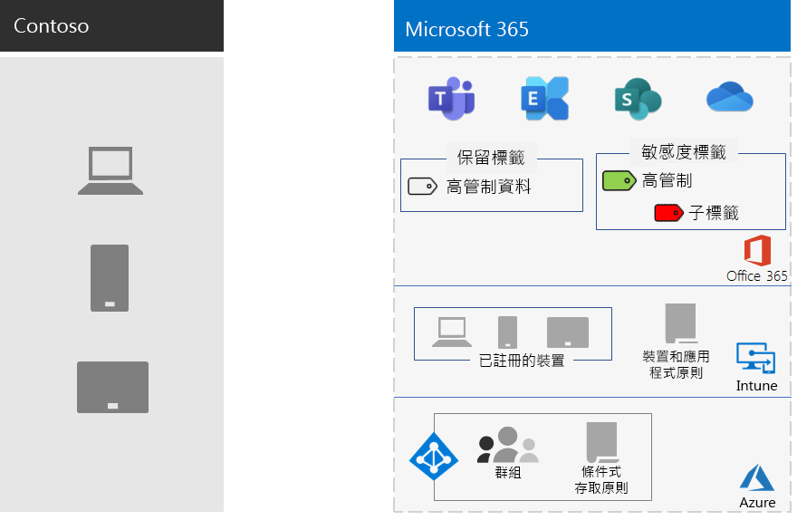

# Contoso Corporation 的資訊保護Information protection for the Contoso Corporation

Contoso 相當嚴正地看待其資訊安全性和保護。例如，智慧財產權的外洩或損毀，說明產品設計和專屬製造技術會讓他們處於競爭的劣勢當中。Contoso is serious about their information security and protection. For example, leakage or destruction of their intellectual property describing product designs and proprietary manufacturing techniques would place them at a competitive disadvantage.

在將機密和最有價值的資產移至雲端之前，他們要確定在 Microsoft 365 企業版的雲端式服務中，支援及實作他們的內部部署資訊分類和保護需求。Before moving their sensitive and most valuable digital assets to the cloud, they made sure that their on-premises information classification and protection requirements were supported and implemented in the cloud-based services of Microsoft 365 Enterprise.

## Contoso 的資料安全性分類Contoso's data security classification

Contoso 執行資料分析，並且決定下列層級。Contoso performed an analysis of their data and determined the following levels.

||||
|:-------|:-----|:-----|
| **第 1 級：基準****Level 1: Baseline** | **第 2 級：機密****Level 2: Sensitive** | **第 3 級：高管制****Level 3: Highly regulated** |
| 資料經過加密並且僅提供給已驗證的使用者。Data is encrypted and available only to authenticated users.     專為儲存在內部部署及雲端式儲存空間和工作負載 (例如 Office 365) 的所有資料而提供。資料會予以加密，並儲存於服務中，而且會在服務和用戶端裝置之間傳輸。Provided for all data stored on premises and in cloud-based storage and workloads, such as Office 365. Data is encrypted while it resides in the service and in transit between the service and client devices.    第 1 級的範例：一般業務通訊 (電子郵件) 和用於行政、銷售和支援員工的檔案之資料。Examples of Level 1 data are normal business communications (email) and files for administrative, sales, and support workers. | 第 1 級再加上增強式驗證及資料遺失保護。Level 1 plus strong authentication and data loss protection.     增強式驗證包括使用 SMS 驗證的 Azure 多重要素驗證 (MFA)。Strong authentication includes Azure Multi-Factor Authentication (MFA) with SMS validation. 資料遺失防護可確保機密或關鍵資訊不會洩漏到 Microsoft 雲端以外的地方。Data loss prevention ensures that sensitive or critical information does not travel outside the Microsoft cloud.    第 2 級的範例：財務和法務資訊以及新產品的研發資料。Examples of Level 2 data are financial and legal information and research and development data for new products. | 第 2 級再加上最高層級的加密、驗證及稽核。Level 2 plus the highest levels of encryption, authentication, and auditing.      對靜態資料和雲端資料的最高層級資料加密，遵循地區法規，結合 MFA 與智慧卡以及細微稽核與警示。The highest levels of encryption for data at rest and in the cloud, compliant with regional regulations, combined with MFA with smart cards and granular auditing and alerting.     第 3 級的範例：客戶與合作夥伴的個人身分識別資訊，以及產品的工程規格和專屬的製造技術。Examples of Level 3 data are customer and partner personally identifiable information, product engineering specifications, and proprietary manufacturing techniques.  |
||||

## Contoso 的資訊原則Contoso's information policies
下表列出 Contoso 的資訊原則。The following table lists Contoso's information policies.

|||||
|:-------|:-----|:-----|:-----|
|  | **存取****Access** | **資料保留****Data retention** | **資訊保護****Information protection** |
| 低商業價值 (第 1 級：基準)Low business value (Level 1: Baseline) | 允許所有人存取Allow access to all  | 6 個月6 months | 使用加密。Use encryption. |
| 中等商業價值 (第 2 級：敏感性)Medium business value (Level 2: Sensitive) | 允許 Contoso 員工、次承攬人和合作夥伴存取Allow access to Contoso employees, subcontractors, and partners     使用 MFA、傳輸層安全性 (TLS) 和行動裝置應用程式管理 (MAM)。Use MFA, Transport Layer Security (TLS), and Mobile Application Management (MAM). | 2 年2 years  | 使用雜湊值以確保資料完整。Use hash values for data integrity.  |
| 高商業價值 (第 3 級：高管制)High business value (Level 3: Highly regulated) | 允許高階主管以及工程部和製造部的主管存取。Allow access to executives and leads in engineering and manufacturing.     版權管理系統 (RMS)，只有受控網路裝置。Rights Management System (RMS) with managed network devices only.  | 7 年7 years  | 使用數位簽章以提供不可否認性。Use digital signatures for non-repudiation.  |
|||||

## Contoso 使用 Microsoft 365 企業版進行資訊保護的途徑Contoso’s path to information protection with Microsoft 365 Enterprise

Contoso 使用下列步驟，針對其資訊保護需求準備 Microsoft 365 企業版：Contoso used the following steps to prepare Microsoft 365 Enterprise for their information protection requirements:

1. 識別要保護的資訊Identified what information to protect

   Contoso 大量檢閱內部部署 SharePoint 網站和檔案共用上的現有數位資產，並且對每個項目進行分類。Contoso did an extensive review of their existing digital assets located on on-premises SharePoint sites and file shares and classified each one.

2. 判別各資料層級的存取權、保留期和資訊保護原則Determined access, retention, and information protection policies for data levels

   Contoso 根據資料層級決定原則需求，這些原則需求是用來在移至雲端時保護現有的數位資產。Based on the data levels, Contoso determined detailed policy requirements, which were used to protect existing digital assets as they were moved to the cloud.

3. 針對不同的資訊層級建立敏感度標籤及其設定Created sensitivity labels and their settings for the different levels of information

   Contoso 針對其資料層級建立了敏感度標籤，以及包括加密、權限和浮水印等高管制標籤。Contoso created sensitivity labels for their data levels, with their highly regulated label that includes encryption, permissions, and watermarks.

4. 針對機密和高管制資料建立受保護的 SharePoint 網站，具有鎖定存取的權限Created protected SharePoint sites for sensitive and highly regulated data with permissions that lock down access

   敏感性和高度管控網站都是透過額外權限限制設定為私人小組網站。Both sensitive and highly regulated sites were configured as private team sites with additional permissions restrictions. 此外，也以使用對應的保留標籤來設定敏感性和高管制 SharePoint 網站。Sensitive and highly regulated SharePoint sites were also configured with a corresponding retention label. 儲存在高管制 SharePoint 網站中的檔案受到高管制標籤的敏感度子標籤保護。Files stored in highly regulated SharePoint sites are protected with a sensitivity sublabel of the Highly Regulated label. 如需詳細資訊，請參閱[適用於高度管制資料的 SharePoint 網站](teams-sharepoint-online-sites-highly-regulated-data.md)案例。For more information, see the [SharePoint sites for highly regulated data](teams-sharepoint-online-sites-highly-regulated-data.md) scenario.

5.  從內部部署 SharePoint 網站和檔案共用將資料移至新的 SharePoint 網站Moved data from on-premises SharePoint sites and file shares to their new SharePoint sites

    遷移至新 SharePoint 網站的檔案，會繼承指派給網站的預設保留標籤。The files migrated to the new SharePoint sites inherited the default retention labels assigned to the site.

6.  訓練員工如何針對新文件使用敏感度標籤、如何在建立新 SharePoint 網站時與 Contoso IT 互動，以及一律將數位資產儲存在 SharePoint 網站上Trained employees on how to use sensitivity labels for new documents, how to interact with Contoso IT when creating new SharePoint sites, and to always store digital assets on SharePoint sites

    這個部分是雲端資訊保護轉換最困難的部分，Contoso IT 和管理階層必須改變組織員工總是在雲端標示及儲存其數位資產、抑制使用內部部署檔案共用，而從不使用第三方雲端儲存服務或 USB 磁碟機這樣的一個資訊儲存壞習慣。Considered the hardest part of the information protection transition for the cloud, Contoso IT and management needed to change the bad information storage habits of the organization’s employees to always label and store their digital assets in the cloud, refrain from using on-premises file shares, and never use third-party cloud storage services or USB drives.

## 資訊保護的條件式存取原則Conditional Access policies for information protection

搭配其身分識別和行動裝置管理基礎結構，以及作為推出 Exchange Online 和 SharePoint 的一部分，Contoso 設定下列條件式存取原則集合，並且將該集合套用至適當的群組：In conjunction with their identity and mobile device management infrastructure and as part of their rollout of Exchange Online and SharePoint, Contoso configured the following set of Conditional Access policies and applied them to the appropriate groups:

- [裝置原則的受控和非受控應用程式存取Managed and unmanaged application access on devices policies](identity-access-policies.md)
- [Exchange Online 存取原則Exchange Online access policies](secure-email-recommended-policies.md)
- [SharePoint 存取原則SharePoint access policies](sharepoint-file-access-policies.md)

以下是 Contoso 的資訊保護原則結果集合。Here is Contoso's resulting set of policies for information protection.

>[!Note]
>Contoso 也會為身分識別和登入設定額外的條件式存取原則。Contoso also configured additional Conditional Access policies for identity and sign-in. 請參閱 [Contoso Corporation 的身分識別](contoso-identity.md#conditional-access-policies-for-identity-and-device-access)。See [Identity for the Contoso Corporation](contoso-identity.md#conditional-access-policies-for-identity-and-device-access).
>

這些原則會確保：These policies ensure that:

- 允許使用應用程式，並由應用程式保護原則定義這些應用程式可以對組織資料執行哪些動作。Apps are allowed and the actions they can take with your organization data are defined by app protection policies.
- 電腦和行動裝置都必須符合規範。PCs and mobile devices must be compliant.
- Exchange Online 使用適用於 Exchange Online 的 Office 365 訊息加密。Exchange Online uses Office 365 message encryption for Exchange Online.
- SharePoint 使用應用程式強制限制。SharePoint uses app enforced restrictions.
- SharePoint 會針對僅限瀏覽器存取使用存取控制原則，並封鎖未受控裝置的存取。SharePoint uses access control policies for browser-only access and to block access for unmanaged devices.

## 將 Microsoft 365 企業版功能對應至 Contoso 的資料層級Mapping Microsoft 365 Enterprise features to Contoso's data levels

下表將 Contoso 資料層級與 Microsoft 365 企業版的資訊保護功能對應。The following table maps Contoso's data levels to information protection features in Microsoft 365 Enterprise.

|||||
|:-------|:-----|:-----|:-----|
| | **Office 365****Office 365** | **Windows 10 和 Office 365 專業增強版****Windows 10 and Office 365 ProPlus** | **EMS****EMS** |
| 第 1 級：基準Level 1: Baseline  | SharePoint 和 Exchange Online 條件式存取原則SharePoint and Exchange Online Conditional Access policies   SharePoint 網站的權限Permissions on SharePoint sites | 敏感度標籤Sensitivity labels   BitLockerBitLocker   Windows 資訊保護Windows Information Protection | 裝置條件式存取原則和行動裝置應用程式管理原則Device Conditional Access policies and Mobile Application Management policies |
| 第 2 級：敏感性Level 2: Sensitive | 第 1 級增強版：Level 1 plus:     敏感度標籤Sensitivity labels   SharePoint 網站上的 Office 365 保留標籤Office 365 retention labels on SharePoint sites   SharePoint 和 Exchange Online 的 Office 365 資料外洩防護Office 365 Data Loss Prevention for SharePoint and Exchange Online   隔離的 SharePoint 網站Isolated SharePoint sites  | 第 1 級增強版：Level 1 plus:     數位資產上的敏感度標籤Sensitivity labels on digital assets  | 第 1 級Level 1 |
| 第 3 級：高管制Level 3: Highly regulated | 第 2 級增強版：Level 2 plus:    針對營業秘密資訊的使用自己的金鑰 (BYOK) 加密和保護Bring Your Own Key (BYOK) encryption and protection for trade secret information   適用於與 Office 365 服務互動之企業營運應用程式的 Azure Key VaultAzure Key Vault for line of business applications that interact with Office 365 services | 第 2 級Level 2 | 第 1 級Level 1 |
|||||

以下是 Contoso 的資訊保護設定結果。Here is Contoso's resulting information protection configuration.

## 下一步Next step

[請參閱](contoso-security-summary.md) Contoso 如何針對身分識別與存取管理、威脅防護、資訊保護和安全性管理，使用 Microsoft 365 企業版的安全性功能。[See](contoso-security-summary.md) how Contoso has used the security features across Microsoft 365 Enterprise for identity and access management, threat protection, information protection, and security management.

## 另請參閱See also

[Microsoft 365 企業版的資訊保護Information protection for Microsoft 365 Enterprise](infoprotect-infrastructure.md)

[部署指南Deployment guide](deploy-microsoft-365-enterprise.md)

[測試實驗室指南Test lab guides](m365-enterprise-test-lab-guides.md)

