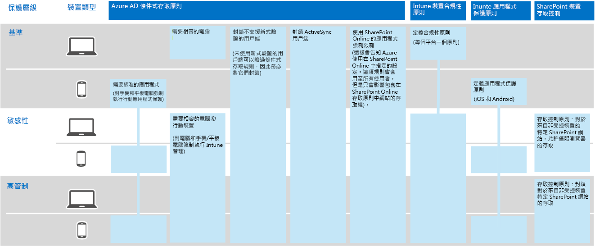
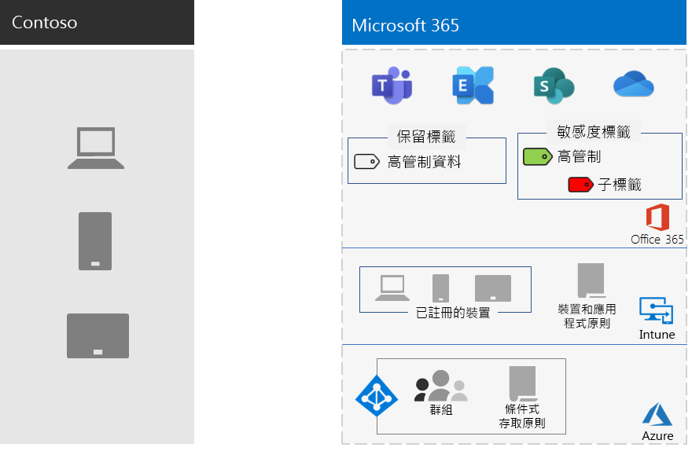

# Contoso Corporation 的資訊保護

Contoso 對其資訊安全性很重要。 對其產品設計和專有製造技術相關的智慧財產權的洩漏或破壞會帶來競爭的劣勢。

在將其機密數位資產移至雲端之前，Contoso 確定 Microsoft 365 for enterprise 的雲端架構服務是否支援其內部部署資訊分類及保護需求。

## Contoso 資料安全性分類

Contoso 執行其資料的分析，並確定下列分類層級。

| 第 1 級：基準 | 第 2 級：敏感性 | 第 3 級：高管制 |
|:-------|:-----|:-----|
| 資料經過加密並且僅提供給已驗證的使用者。    針對所有儲存在內部部署和雲端架構存放區和工作負載中的資料提供。 當資料位於服務中，且在服務和用戶端裝置之間傳輸時，會進行加密。   第 1 級的範例：一般業務通訊 (電子郵件) 和用於行政、銷售和支援員工的檔案之資料。 | 第 1 級再加上增強式驗證及資料遺失保護。    強驗證封裝含 Azure AD Multi-Factor 驗證 (MFA) 搭配 SMS 驗證。 資料遺失防護可確保敏感或重要資訊不會在 Microsoft 雲端外移動。  第 2 級的範例：財務和法務資訊以及新產品的研發資料。 | 第 2 級再加上最高層級的加密、驗證及稽核。  對靜態資料和雲端資料的最高層級資料加密，遵循地區法規，結合 MFA 與智慧卡以及細微稽核與警示。   第3級資料範例包括客戶及合作夥伴個人資訊、產品工程規格，以及專屬的製造技術。  |
||||

## Contoso 資訊原則
下表列出 Contoso 資訊原則。

| 值 | Access | 資料保留 | 資訊保護 |
|:-------|:-----|:-----|:-----|
| 低商業價值 (第 1 級：基準) | 允許存取所有。  | 6 個月 | 使用加密。 |
| 中等商業價值 (第 2 級：敏感性) | 允許存取 Contoso 員工、分包商和合作夥伴。    使用 MFA、傳輸層安全性 (TLS) 和行動裝置應用程式管理 (MAM)。 | 2 年  | 使用雜湊值以確保資料完整。  |
| 高商業價值 (第 3 級：高管制) | 允許高階主管以及工程部和製造部的主管存取。     版權管理系統 (RMS)，只有受控網路裝置。  | 7 年  | 使用數位簽章以提供不可否認性。  |
|||||

## Microsoft 365 for enterprise 的資訊保護的 Contoso 途徑

Contoso 遵循這些步驟，針對其資訊保護需求準備 Microsoft 365 for enterprise：

1. 識別要保護的資訊

   Contoso 對內部部署 SharePoint 網站和檔案共用上的現有數位資產進行大量的複查，並分類每個資產。

2. 決定資料層級的存取、保留和資訊保護原則

   Contoso 根據資料層級決定原則需求，這些原則需求是用來在移至雲端時保護現有的數位資產。

3. 為不同的資訊層級建立靈敏度標籤及其設定

   Contoso 針對其資料層級建立了敏感度標籤，以及包括加密、權限和浮水印等高管制標籤。

4.  將資料從內部部署 SharePoint 網站和檔案共用移至新的 SharePoint 網站

    遷移至新 SharePoint 網站的檔案，會繼承指派給網站的預設保留標籤。

5.  訓練員工如何對新檔使用敏感度標籤，如何在建立新的 SharePoint 網站時與 Contoso 一起互動，以及永遠在 SharePoint 網站上儲存數位資產

    變更不良工作者資訊儲存習慣通常會被視為雲端的資訊保護轉換最困難的部分。 Contoso IT 和管理工作需要讓員工一定要在雲端中標籤和儲存其數位資產、避免使用內部部署檔案共用，也不會使用協力廠商雲端儲存服務或 USB 磁片磁碟機。

## 資訊保護的條件式存取原則

在 Exchange Online 和 SharePoint 的部署過程中，Contoso 設定下列一組條件式存取原則，並將它們套用至適當的群組：

- [裝置原則的受控和非受控應用程式存取](../security/office-365-security/identity-access-policies.md)
- [Exchange Online 存取原則](../security/office-365-security/secure-email-recommended-policies.md)
- [SharePoint 存取原則](../security/office-365-security/sharepoint-file-access-policies.md)

以下是設定資訊保護的 Contoso 原則所產生的結果。

>[!Note]
>Contoso 也會為身分識別和登入設定額外的條件式存取原則。 請參閱 [Contoso Corporation 的身分識別](contoso-identity.md#conditional-access-policies-for-identity-and-device-access)。
>

這些原則會確保：

- 允許的應用程式，以及他們可對組織的資料採取的動作，是由應用程式保護原則定義。
- 電腦和行動裝置都必須符合規範。
- Exchange Online 使用 Office 365 郵件加密 (OME) 用於 Exchange Online。
- SharePoint 會使用應用程式強制性限制。
- SharePoint 會針對僅限瀏覽器存取使用存取控制原則，並封鎖未受控裝置的存取。

## 將 Microsoft 365 企業版功能對應至 Contoso 資料層級

下表將 Contoso 資料層級對應至 Microsoft 365 for enterprise 中的資訊保護功能。

| 層級 | Microsoft 365 雲端服務 | Windows 10 和 Microsoft 365 Apps 企業版 | 安全性與合規性 |
|:-------|:-----|:-----|:-----|
| 第 1 級：基準  | SharePoint 和 Exchange Online 條件式存取原則   SharePoint 網站的權限 | 敏感度標籤   BitLocker   Windows 資訊保護 | 裝置條件式存取原則和行動裝置應用程式管理原則 |
| 第 2 級：敏感性 | 第 1 級增強版：     敏感度標籤   SharePoint 網站上的 Microsoft 365 保留標籤   SharePoint 和 Exchange Online 的資料外洩防護   隔離的 SharePoint 網站  | 第 1 級增強版：     數位資產上的敏感度標籤  | 第 1 級 |
| 第 3 級：高管制 | 第 2 級增強版：    讓您自己的金鑰 (BYOK) 加密及保護貿易機密資訊   與 Microsoft 365 服務互動的企業營運應用程式的 Azure 金鑰 Vault | 第 2 級 | 第 1 級 |
|||||

以下是所產生的 Contoso 資訊保護設定。

## 下一步

瞭解 Contoso 如何針對身分識別與存取管理、威脅防護、資訊保護和安全性管理，使用 [跨 Microsoft 365 的安全性功能](contoso-security-summary.md) 。

## 另請參閱

[安全性藍圖](../security/office-365-security/security-roadmap.md)

[Microsoft 365 企業版概觀](microsoft-365-overview.md)

[測試實驗室指南](m365-enterprise-test-lab-guides.md)