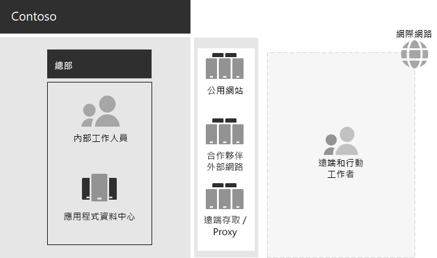

# Contoso 的 IT 基礎結構與業務需求

**摘要：** 了解 Contoso 內部部署 IT 基礎結構的基本結構，以及 Microsoft 365 企業版如何符合其業務需求。

Contoso 已進行基礎結構轉型作業，即將從內部部署的集中式 IT 基礎結構轉換至整合雲端的個人生產力工作負載和應用程式之融合雲端的 IT 基礎結構。

## Contoso 的現有 IT 基礎結構

Contoso 使用絕大部分屬於集中式的內部部署 IT 基礎結構，配合位於巴黎總部的應用程式資料中心。

圖 1 顯示總部辦公室與應用程式資料中心、DMZ 和網際網路。

**圖 1：Contoso 的現有 IT 基礎結構**
 
內部部署應用程式資料中心裝載： 

- 使用 SQL Server 與其他 Linux 資料庫的自訂企業營運應用程式。
- 一組舊版 SharePoint 伺服器。
- 用於檔案儲存的組織和小組層級伺服器。

此外，還有支援一組伺服器與一組類似應用程式的每個區域中樞辦公室。這些伺服器受區域 IT 部門的控制。

這些個別多地理區域資料中心之應用程式和資料的可搜尋性，一直是個挑戰。

在 Contoso 的總部 DMZ 中，不同的伺服器組合提供︰

- 為巴黎總部的員工提供連結至 Contoso 內部網路的 VPN 型遠端存取與 Web Proxy 處理。
- Contoso 客戶訂購產品、零件、耗材或服務的公用網站主機服務。
- 用於合作夥伴通訊和共同作業的 Contoso 合作夥伴外部網路主機服務。

## Contoso 的業務需求

Contoso 的業務需求分成五個主要類別。

生產力：

- 讓共同作業更輕鬆

  使用線上模型取代電子郵件和檔案共用型共同作業，該模型允許對文件即時變更、線上會議更簡單，以及擷取對話串。
- 改善遠端和行動工作者的生產力

  有許多員工是在家或在現場工作，透過有效率地存取雲端中的 Contoso 資料與資源，來取代有瓶頸的 VPN 解決方案。
- 增加創意和創新

  利用最新的視覺學習和想法開發方法，包括筆跡和 3D 視覺效果。

安全性：

- 身分識別和存取管理

  強制執行多重要素和其他形式的驗證，保護使用者和系統管理員帳戶認證。

- 威脅防護

  防範外部安全性威脅，包括電子郵件和作業系統型惡意程式碼。

- 資訊保護

  加密高價值數位資產並鎖定其存取權，例如客戶資料、設計規格和員工資訊。

- 安全性管理

  監視安全性狀態，以便偵測並即時回應威脅。

遠端和行動裝置存取與商務合作夥伴：

- 更好的遠端和行動工作者安全性

  制定攜帶您自己的裝置 (BYOD) 和公司擁有裝置管理措施，以確保安全的存取、正確的應用程式行為，以及公司資料保護。

- 減少員工的遠端存取基礎結構

  藉由將經常存取的資源移至雲端，減少維護和支援成本並且改善遠端存取解決方案的效能。

- 針對企業對企業 (B2B) 的交易提供更好的連線能力並降低額外負荷

  以使用同盟驗證的雲端式解決方案來取代過時且昂貴的合作夥伴外部網路。

合規性：

- 遵循地區性法規的需求

  成為並持續符合產業與區域的法規，包括資料儲存、加密、資料隱私權和個人資料法規，例如歐盟的一般資料保護規定 (GDPR)。

管理：

- 降低針對在電腦和裝置上執行之軟體進行管理的 IT 額外負荷

  自動安裝更新到整個組織的 Windows 作業系統和 Microsoft Office。

## 將 Contoso 的業務需求對應至 Microsoft 365 企業版

Contoso 的 IT 部門決定在部署之前，將下列業務需求對應至 Microsoft 365 企業版 E5 功能：

||||
|:-------|:-----|:-----|
| **類別** | **業務需求** | **Microsoft 365 企業版產品或功能** |
| 生產力 |  |  |
|  | 讓共同作業更輕鬆 | Teams、SharePoint Online、商務用 Skype Online |
|  | 改善遠端和行動工作者的生產力 | Office 365 工作負載和雲端式資料 |
|  | 增加創意和創新 | Windows Ink、Cortana at Work、PowerPoint |
| 安全性 |  |  |
|  | 身分識別和存取管理 | 具有多重要素驗證 (MFA) 與 Azure AD Privileged Identity Management (PIM) 的專用全域系統管理員帳戶   適用於所有使用者帳戶的 MFA   條件式存取   Windows Hello   Windows Credential Guard |
|  | 威脅防護 | 進階威脅分析   Windows Defender   進階威脅防護   Office 365 進階威脅防護   Office 365 威脅調查及回應   |
|  | 資訊保護 | Azure 資訊保護   Office 365 資料外洩防護 (DLP)   Windows 資訊保護   Microsoft Cloud App Security   Office 365 雲端 App 安全性 (CAS)   Microsoft Intune |
|  | 安全性管理 | Azure 資訊安全中心    Windows Defender 資訊安全中心 |
| 遠端和行動裝置存取與商務合作夥伴 |  |  |
|  | 更好的遠端和行動工作者安全性 | Microsoft Intune |
|  | 減少員工的遠端存取基礎結構 | Office 365 工作負載和雲端式資料 |
|  | 針對 B2B 的交易提供更好的連線能力並降低額外負荷 | 同盟驗證和雲端式資源 |
| 合規性 |  |  |
|  | 遵循地區性法規的需求 | Office 365 中的 GDPR 功能 |
| 管理 |  |  |
|  | 降低安裝用戶端更新的 IT 額外負荷 | 部署通道   Windows 10 就地升級和 Autopilot   Office 365 專業增強版 |
||||

## 後續步驟

[了解](contoso-networking.md) Contoso Corporation 內部部署網路，以及它如何針對整個組織 Microsoft 365 雲端式資源的存取和延遲最佳化。

## 另請參閱

[部署指南](deploy-microsoft-365-enterprise.md)

[測試實驗室指南](m365-enterprise-test-lab-guides.md)
