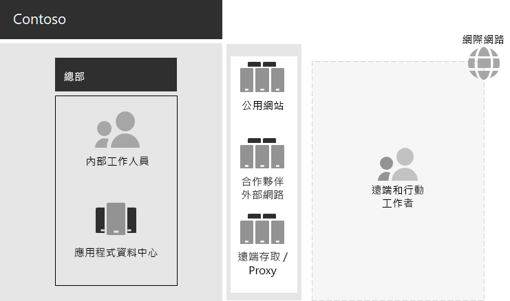

# Contoso IT 基礎結構和業務需求

Contoso 會從內部部署的集中式 IT 基礎結構轉換至包含雲端式個人生產力工作負載和應用程式的雲端包容安裝。

## 現有 Contoso IT 基礎結構

Contoso 使用絕大部分屬於集中式的內部部署 IT 基礎結構，配合位於巴黎總部的應用程式資料中心。

以下是具有應用程式資料中心、DMZ 和網際網路的總部辦公室。

內部部署應用程式資料中心裝載： 

- 使用 SQL Server 及其他 Linux 資料庫的自訂企業營運應用程式。
- 一組舊版 SharePoint 伺服器。
- 用於檔案儲存的組織和小組層級伺服器。

此外，每個區域中樞辦公室都支援一組有類似應用程式的伺服器。 這些伺服器都受到區域 IT 部門的控制。

這些個別多地理區域資料中心之應用程式和資料的可搜尋性，一直是個挑戰。

在 Contoso 總部 DMZ 中，不同的伺服器組提供：

- Contoso 公開網站的主機服務，可供客戶定購產品、元件、用品及服務。
- 用於合作夥伴通訊和共同作業的 Contoso 合作夥伴外部網路主機服務。
- 為巴黎總部的員工提供連結至 Contoso 內部網路的虛擬私人網路 (VPN) 型遠端存取與 Web Proxy 處理。

## Contoso 商務需求

Contoso 商務需求分為五個主要類別：

**生產力**

- 讓共同作業更輕鬆

  以線上模型取代電子郵件和檔案共用型共同作業，可讓您即時變更檔、更輕鬆的線上會議，以及已捕獲的交談執行緒。
- 改善遠端和行動工作者的生產力

  透過家裡或現場運作的許多員工，使用雲端的可存取權資料和資源，取代瓶頸的 VPN 解決方案。
- 增加創意和創新

  利用最新的視覺學習和想法開發方法，包括筆跡和 3D 視覺效果。

**安全性**

- 身分識別和存取管理

  強制執行多重要素和其他形式的驗證，並保護使用者和系統管理員帳號憑證。

- 威脅防護

  防範外部安全性威脅，包括電子郵件和作業系統型惡意程式碼。

- 資訊保護

  加密高價值數位資產並鎖定其存取權，例如客戶資料、設計與製造規格和員工資訊。

- 安全性管理

  監視安全狀況，並即時偵測威脅並加以回應。

**遠端和行動裝置存取與商務合作夥伴**

- 改進遠端和行動工作者的安全性

  實施會將您自己的裝置 (BYOD) 和公司所擁有的裝置管理，以確保安全的存取、正確的應用程式行為，以及公司資料保護。

- 減少員工的遠端存取基礎結構

  將經常存取的資源移至雲端，以降低維護和支援成本並改善遠端存取解決方案的效能。

- 為商務對 susiness (B2B) 交易提供更好的連線能力並降低額外負荷

  使用採用同盟驗證的雲端式解決方案，取代老化且昂貴的合作夥伴外部網路。

**合規性**

- 遵循地區性法規的需求

  確定針對資料儲存、加密、資料隱私權和個人資料法規（如一般資料保護法規）的行業和地區性法規，如歐盟的一般資料保護法規 (GDPR) 。

**管理**

- 降低在用戶端電腦和裝置上執行軟體的管理成本。

  自動將更新安裝至整個組織中的 Windows 作業系統和 Microsoft 365 應用程式。

## 將 Contoso 商務需求對應至 Microsoft 365 for enterprise

Contoso IT 部門決定在部署之前，下列業務需求對應至 Microsoft 365 E5 功能：

| 類別 | 商務需求 | 適用于企業產品或功能的 Microsoft 365 |
|:-------|:-----|:-----|
| 生產力 |  |  |
|  | 讓共同作業更輕鬆 | Microsoft Teams、SharePoint、OneDrive |
|  | 改善遠端和行動工作者的生產力 | Microsoft 365 工作負載和雲端式資料 |
|  | 增加創意和創新 | Windows Ink、Cortana at Work、PowerPoint |
| 安全性 |  |  |
|  | 身分識別和存取管理 | 具備 Azure Multi-Factor 驗證 (MFA) 和 Azure Active Directory 特權身分識別管理 (PIM) 的專屬全域管理員帳戶。   適用於所有使用者帳戶的 MFA   條件式存取   Windows Hello   Windows Credential Guard |
|  | 威脅防護 | 進階威脅分析   Windows Defender   進階威脅防護   Office 365 進階威脅防護   Microsoft 365 威脅調查和回應   |
|  | 資訊保護 | Azure 資訊保護   資料外洩防護 (DLP)   Windows 資訊保護 (WIP)   Microsoft Cloud App Security   Microsoft Intune |
|  | 安全性管理 | Azure 資訊安全中心    Windows Defender 資訊安全中心 |
| 遠端和行動裝置存取與商務合作夥伴 |  |  |
|  | 更好的遠端和行動工作者安全性 | Microsoft Intune |
|  | 減少員工的遠端存取基礎結構 | Microsoft 365 工作負載和雲端式資料 |
|  | 提高 B2B 交易的連線能力並降低負荷 | 同盟驗證和雲端式資源 |
| 合規性 |  |  |
|  | 遵循地區性法規的需求 | Microsoft 365 中的 GDPR 功能 |
| 管理 |  |  |
|  | 降低安裝用戶端更新的 IT 負荷 | Windows 10 企業版更新   Microsoft 365 Apps 企業版更新 |
||||

## 下一步

深入瞭解 Contoso Corporation [內部部署網路](contoso-networking.md) ，以及其如何針對 Microsoft 365 雲端架構資源進行存取和延遲優化。

## 請參閱

[Microsoft 365 企業版概觀](microsoft-365-overview.md)

[測試實驗室指南](m365-enterprise-test-lab-guides.md)
