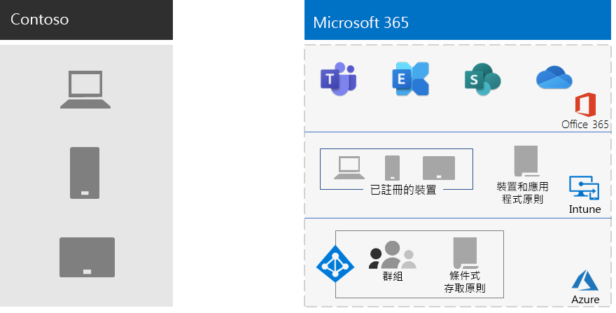

# Contoso 的行動裝置管理Mobile device management for Contoso

適用于 enterprise 的 Microsoft 365 包括 Intune 和一組支援行動裝置和應用程式管理及安全性的 Azure 服務。Microsoft 365 for enterprise includes Intune and a set of Azure services that support mobile device and application management and security.

Contoso 有許多啟用行動的員工。Contoso has many mobile-enabled employees. 有些地方的辦事處位於 Contoso 位置，有些則沒有辦事處。Some have offices in Contoso locations, and some have no offices. Contoso 需要一種方式來啟用員工生產力，但保留裝置、儲存在這些裝置上的 Contoso 資料，以及應用程式行為的安全性。Contoso needed a way to enable employee productivity but keep the devices, the Contoso data stored on those devices, and application behavior secure.

## 計劃Plan

Contoso 已針對企業版的 Microsoft 365 識別行動裝置管理的下列 Intune 使用案例：Contoso identified the following Intune use cases of mobile device management for Microsoft 365 for enterprise:

- 保護 Exchange Online 電子郵件和資料，讓行動裝置可以安全地存取。Protect Exchange Online email and data so it can be safely accessed by mobile devices.
- 為 Contoso 員工實施隨 (的隨) 計畫。Implement a bring-your-own-device (BYOD) program for Contoso employees.
- 發佈組織所擁有的電話，並將共用的平板電腦限制于 Contoso 員工。Issue organization-owned phones and limited-use shared tablets to Contoso employees.

Contoso 不使用 Intune 執行下列作業：Contoso doesn't use Intune to:

- 允許員工透過非管理的公用展臺安全地存取 Microsoft 365。Allow employees to securely access Microsoft 365 from an unmanaged public kiosk.
- 保護內部部署電子郵件和資料，讓行動裝置可以安全地存取它，因為沒有內部部署的 Microsoft Exchange 伺服器。Protect on-premises email and data so it can be safely accessed by mobile devices, because there are no on-premises Microsoft Exchange servers.

## 部署Deploy

這是 Contoso 設定行動裝置管理基礎架構的方式：This is how Contoso set up their mobile device management infrastructure:

- 將 Intune 設定為行動裝置管理 (MDM) 授權，並在 Azure 上使用 Intune 管理內容及管理裝置Set Intune as the Mobile Device Management (MDM) authority, and use Intune on Azure to administer content and manage the devices
- 針對註冊及 Intune 設定和裝置型條件式存取原則的裝置建立 Azure Active Directory (Azure AD) 群組Created Azure Active Directory (Azure AD) groups for devices for enrollment and Intune settings and device-based Conditional Access policies

  如需詳細資訊，請參閱 [Contoso 條件式存取原則](contoso-identity.md#conditional-access-policies-for-identity-and-device-access)。For more information, see [Contoso Conditional Access policies](contoso-identity.md#conditional-access-policies-for-identity-and-device-access).

- 已啟用 Apple 裝置平臺，以支援具有 Ipad、Imac、Iphone 及公司所有 Iphone 的員工。Enabled the Apple device platform to support employees with iPads, iMacs, and iPhones, and corporate-owned iPhones
- 建立 Contoso 特定的條款與條件原則，會在行動裝置安裝 Contoso 公司入口網站時出現Created Contoso-specific terms and conditions policies, which are seen during the installation of the Company Portal for Contoso on mobile devices
- 對於未註冊的裝置，請將一組行動應用程式管理 (MAM) 原則，以要求驗證存取 Microsoft 365 服務For devices that aren't enrolled, implemented a set of Mobile Application Management (MAM) policies to require authentication for access to Microsoft 365 services
- 建立 Intune 原則以強制執行：Created Intune policies that enforce:
  - 允許的應用程式。Allowed apps.
  - 裝置加密，以協助防止未經授權的存取。Device encryption to help prevent unauthorized access.
  - 六位數的 PIN 碼或密碼。A six-digit PIN or password.
  - 非使用中的超時期限。An inactivity-timeout period.
  - 防病毒和惡意程式碼保護，以及 Windows Defender Windows 10 裝置上的簽名更新。Antivirus and malware protection, and signature updates with Windows Defender on Windows 10 devices.
  - 在包含最新安全性更新的 Windows 10 裝置上自動更新。Automatic updates on Windows 10 devices that include the latest security updates.
  - 將憑證推入受管理的裝置。Pushing certificates to managed devices.
  - 清楚分隔商務和個人資料。使用者或系統管理員可以選擇性地從裝置清除公司資料，而不影響個人資料，例如圖片、個人電子郵件帳戶及個人檔案。A clear separation of business and personal data. Users or admins can selectively wipe corporate data from the device, while leaving personal data such as pictures, personal email accounts, and personal files untouched.

Contoso 註冊的電腦及公司所擁有的 smartphone 和平板電腦，方法是將其新增至適當的 Intune 裝置群組。Contoso enrolled deployed PCs and company-owned smartphones and tablets by adding them to the appropriate Intune device groups. 他們也建立了 BYOD 程式，讓員工註冊其個人裝置。They also established a BYOD program for employees to enroll their personal devices. 已註冊的裝置會收到 Intune 原則，這會產生受管理和安全裝置及其應用程式。Enrolled devices receive Intune policies, which results in managed and secured devices and their applications. 未註冊的裝置具有指定允許之應用程式的行動應用程式管理 (MAM) 原則。Devices that aren't enrolled have Mobile Application Management (MAM) policies that specify allowed applications.

以下是 Contoso mobile device management 部署架構。Here is the Contoso mobile device management deployment architecture.

## 下一步Next step

瞭解 Contoso 如何使用 Microsoft 365 for enterprise 的[資訊保護功能](contoso-info-protect.md)，在其整個組織中分類、識別及保護重要的數位資產。Learn how Contoso uses the [information protection capabilities](contoso-info-protect.md) of Microsoft 365 for enterprise to classify, identify, and protect crucial digital assets across its organization.

## 另請參閱See also

[Microsoft 365 的裝置管理Device management for Microsoft 365](device-management-roadmap-microsoft-365.md)

[Microsoft 365 企業版概觀Microsoft 365 for enterprise overview](microsoft-365-overview.md)

[測試實驗室指南Test lab guides](m365-enterprise-test-lab-guides.md)

