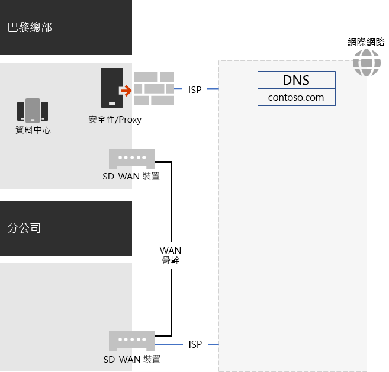
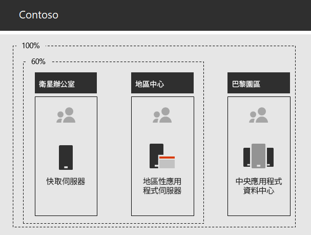

# Contoso Corporation 的網路Networking for the Contoso Corporation

為了採用雲端包容的基礎結構，Contoso 設計出網路流量與雲端服務的傳輸基礎。而非內部中樞輻射模型，其主要是針對下一個層級的 office 階層的網路連線和流量，將使用者位置對應至網際網路上最接近 Microsoft 365 網路位置的本機網際網路出口和本機連線。To adopt a cloud-inclusive infrastructure, Contoso devised a fundamental shift in how network traffic to cloud services travels. Instead of an internal hub-and-spoke model that focuses network connectivity and traffic for the next level of the office hierarchy, they mapped user locations to local internet egress and local connections to the closest Microsoft 365 network location on the internet.

## 網路基礎結構Networking infrastructure

以下是連結 Contoso 分公司的網路元素：These are the network elements that link Contoso offices across the globe:

- 多重通訊協定標籤切換 (MPLS) WAN 網路Multiprotocol Label Switching (MPLS) WAN network

  MPLS WAN 網路會將巴黎總部和地區性辦事處連接至分支和 hub 設定中的衛星辦公室。網路可讓使用者存取內部部署伺服器，這些伺服器是在巴黎總部中組成企業營運應用程式。它也會將所有一般網際網路流量路由傳送至巴黎 office，網路安全裝置會在其中清除要求。在每個辦公室內，路由器會將流量傳遞給有線主機或子網上的無線訪問點，使用私人 IP 位址空間。An MPLS WAN network connects the Paris headquarters to regional offices and regional offices to satellite offices in a spoke-and-hub configuration. The network enables users to access on-premises servers that make up line-of-business applications in the Paris headquarters. It also routes any generic internet traffic to the Paris office, where network security devices scrub the requests. Within each office, routers deliver traffic to wired hosts or wireless access points on subnets, which use the private IP address space.

- Microsoft 365 流量的本機直接網際網路存取Local direct internet access for Microsoft 365 traffic

  每個 office 都有一個軟體定義的 WAN (SD-WAN) 裝置，其具有一個或多個具有一或多個本機網際網路 ISP 網路電路的裝置，其透過 proxy 伺服器進行網際網路連線。這通常是指本機 ISP 的 WAN 連結，也提供公用 IP 位址和本機 DNS 伺服器。Each office has a software-defined WAN (SD-WAN) device that has one or more local internet ISP network circuits with its own internet connectivity through a proxy server. This is typically implemented as a WAN link to a local ISP that also provides public IP addresses and a local DNS server.

- 網際網路呈現方式Internet presence

  Contoso 擁有 contoso \. com 公用功能變數名稱。Contoso public 網站定購產品是巴黎校園中網際網路連線資料中心的一組伺服器。Contoso 在網際網路上使用 a/24 公用 IP 位址範圍。Contoso owns the contoso\.com public domain name. The Contoso public web site for ordering products is a set of servers in an internet-connected datacenter in the Paris campus. Contoso uses a /24 public IP address range on the internet.

圖1顯示 Contoso 網路基礎結構及其與網際網路的連線。Figure 1 shows the Contoso networking infrastructure and its connections to the internet.

 
**圖1： Contoso 網路****Figure 1: The Contoso network**

## 使用 SD-WAN 以取得與 Microsoft 的最佳化網路連線Use of SD-WAN for optimal network connectivity to Microsoft

Contoso 遵循 [Microsoft 365 網路連線原則](microsoft-365-network-connectivity-principles.md) (部分機器翻譯)，以便：Contoso followed [Microsoft 365 network connectivity principles](microsoft-365-network-connectivity-principles.md) to:

- 識別並區分 Microsoft 365 網路流量Identify and differentiate Microsoft 365 network traffic
- 在當地輸出網路連線Egress network connections locally
- 避免網路 hairpinAvoid network hairpins
- 略過重複的網路安全性裝置Bypass duplicate network security devices

Microsoft 365 的網路流量有三種類別： *Optimize*、 *Allow*及 *Default*。There are three categories of network traffic for Microsoft 365: *Optimize*, *Allow*, and *Default*. 優化及允許流量是在端點上加密及保護的受信任網路流量，且是 Microsoft 365 網路的目標。Optimize and Allow traffic is trusted network traffic that's encrypted and secured at the endpoints and is destined for the Microsoft 365 network.

Contoso 決定：Contoso decided to:

- 使用直接網際網路出局以優化和允許類別流量，以及將所有預設類別流量轉寄給巴黎型中央網際網路連線。Use direct internet egress for Optimize and Allow category traffic and to forward all Default category traffic to the Paris-based central internet connection.

- 在每個 office 上部署 SD-WAN 裝置，成為遵循這些原則並為 Microsoft 365 雲端式服務達成最佳網路效能的簡易方法。Deploy SD-WAN devices at each office as a simple way to follow these principles and achieve optimal network performance for Microsoft 365 cloud-based services.

  SD-WAN 裝置有一個給當地辦公室網路使用的 LAN 連接埠，和多個 WAN 連接埠。The SD-WAN devices have a LAN port for the local office network and multiple WAN ports. 一個 WAN 埠會連接到其 MPLS 網路。One WAN port connects to their MPLS network. 另一個連接至本機 ISP 電路。Another connects to a local ISP circuit. SD-WAN 裝置會透過 ISP 連結路由 [最佳化] 和 [允許] 類別的網路流量。The SD-WAN device routes Optimize and Allow category network traffic over the ISP link.

## Contoso 企業營運應用程式基礎結構The Contoso line-of-business app infrastructure

Contoso 為下列專案設計其企業營運應用程式和伺服器內部網路基礎結構：Contoso architected its line-of-business application and server intranet infrastructure for the following:

- 衛星辦公室使用當地快取伺服器以儲存經常存取的文件和內部網站。Satellite offices use local caching servers to store frequently accessed documents and internal web sites.
- 地區中樞針對地區和衛星辦公室使用地區應用程式伺服器，這些伺服器會與巴黎總部的伺服器同步處理。Regional hubs use regional application servers for the regional and satellite offices. These servers synchronize with servers in the Paris headquarters.
- 巴黎校園資料中心包含服務于整個組織的集中式應用程式伺服器。The Paris campus datacenters contain centralized application servers that serve the entire organization.

圖2顯示跨 Contoso 內部網路存取伺服器時所使用之網路流量百分比。Figure 2 shows the percentage of network traffic capacity used when accessing servers across the Contoso intranet.

 
**圖2：內部應用程式的 Contoso 基礎結構****Figure 2: The Contoso infrastructure for internal applications**

針對衛星或地區性 hub 分公司，衛星和地區性 hub office server 可以處理員工所需資源的60%。For the satellite or regional hub offices, 60 percent of the resources needed by employees can be served by satellite and regional hub office servers. 其他40% 的資源要求必須透過 WAN 連結移至巴黎校園。The additional 40 percent of resource requests must go over the WAN link to the Paris campus.

## 適用于企業的 Microsoft 365 的網路分析和準備工作Network analysis and preparation for Microsoft 365 for enterprise

Contoso 使用者成功採用 Microsoft 365 的企業服務，取決於對網際網路的高可用性和高性能連線，或直接與 Microsoft 雲端服務的連接。Successful adoption of Microsoft 365 for enterprise services by Contoso users depends on highly available and performant connectivity to the internet or directly to Microsoft cloud services. Contoso 採取下列步驟，為企業雲端服務方案及執行 Microsoft 365 的優化連線：Contoso took these steps to plan and implement optimized connectivity to Microsoft 365 for enterprise cloud services:

1. 建立公司 WAN 網狀圖以協助規劃Create a company WAN network diagram to aid with planning

   為了開始其網路規劃，Contoso 建立了一個圖表，顯示其辦公室位置、現有的網路連線能力、現有的網路周邊裝置，以及網路上所管理的服務類別。To start their network planning, Contoso created a diagram showing their office locations, existing network connectivity, existing network perimeter devices, and classes of service that are managed on the network. 在規劃及實施網路連線的後續步驟中，他們使用此圖表。They used this diagram for each subsequent step in the planning and implementation of networking connectivity.

2. 建立適用于商業網路連線的 Microsoft 365 方案Create a plan for Microsoft 365 for enterprise network connectivity

   Contoso 使用 [Microsoft 365 網路連接性原則](microsoft-365-network-connectivity-principles.md) 和範例參考網路架構，將 SD-WAN 識別為 Microsoft 365 連線的慣用拓撲。Contoso used the [Microsoft 365 network connectivity principles](microsoft-365-network-connectivity-principles.md) and sample reference network architectures to identify SD-WAN as their preferred topology for Microsoft 365 connectivity.

3. 在每個辦公室分析網際網路連線利用率與 MPLS-WAN 頻寬，並視需要增加頻寬Analyze internet-connection utilization and MPLS-WAN bandwidth at each office, and increase bandwidth as needed

   已分析每個 office 的目前使用狀況，並已增加電路，使預測的 Microsoft 365 雲端式流量可以運作，平均使用20% 的未用容量。Each office's current usage was analyzed, and circuits were increased so that predicted Microsoft 365 cloud-based traffic would operate with an average of 20-percent unused capacity.

4. 優化 Microsoft 網路服務的效能Optimize performance to Microsoft network services

   Contoso 已決定 Office 365、Intune 和 Azure 端點的集合，以及網際網路路徑中已設定的防火牆、安全性裝置及其他系統，以取得最佳效能。Contoso determined the set of Office 365, Intune, and Azure endpoints and configured firewalls, security devices, and other systems in the internet path for optimal performance. Office 365 的端點，可將類別流量設定為透過 ISP 電路進行路由傳送的 SD-WAN 裝置。Endpoints for Office 365 Optimize and Allow category traffic were configured into the SD-WAN devices for routing over the ISP circuit.

5. 設定內部 DNSConfigure internal DNS

   DNS 必須能夠運作，並且可以在本機針對 Microsoft 365 流量進行查閱。DNS is required to be functional and to be looked up locally for Microsoft 365 traffic.

6. 驗證網路端點及埠連線能力Validate network endpoint and port connectivity

   Contoso 執行 Microsoft network connectivity test 工具，以驗證 Microsoft 365 for enterprise 雲端服務的連線能力。Contoso ran Microsoft network connectivity test tools to validate connectivity for Microsoft 365 for enterprise cloud services.

7. 優化員工電腦的網路連線能力Optimize employee computers for network connectivity

   已檢查個別電腦，確定已安裝最新的作業系統更新，而且所有用戶端上的端點安全性監視皆為作用中狀態。Individual computers were checked to ensure that the latest operating system updates were installed and that endpoint security monitoring was active on all clients.

## 下一步Next step

深入瞭解 Contoso 如何 [利用雲端的內部部署 Active Directory 網域服務](contoso-identity.md) ，針對員工和客戶及業務合作夥伴的同盟驗證。Learn how Contoso is [leveraging its on-premises Active Directory Domain Services in the cloud](contoso-identity.md) for employees and federating authentication for customers and business partners.

## 請參閱See also

[Microsoft 365 的網路藍圖Networking roadmap for Microsoft 365](networking-roadmap-microsoft-365.md)

[Microsoft 365 企業版概觀Microsoft 365 for enterprise overview](microsoft-365-overview.md)

[測試實驗室指南Test lab guides](m365-enterprise-test-lab-guides.md)
