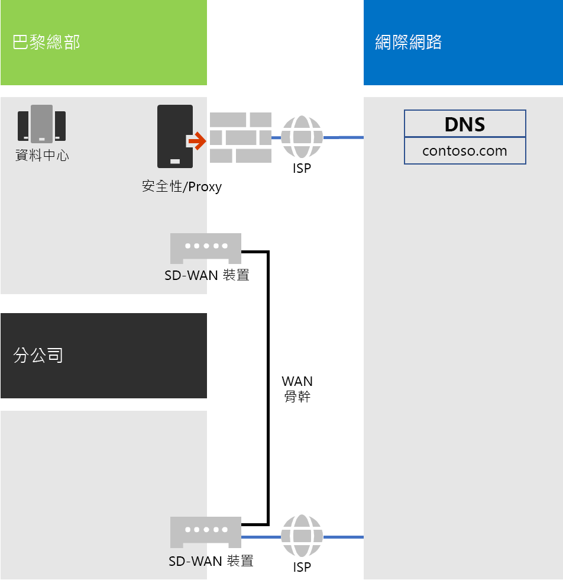
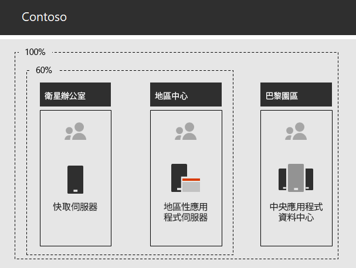

# Contoso Corporation 的網路

**摘要：** 了解 Contoso 網路基礎結構，以及如何使用其 SD-WAN 技術，以取得與 Microsoft 365 企業版雲端式服務的最佳化效能網路連線。

為了採用內含雲端的基礎結構，Contoso 的網路工程師了解網路流量到雲端式服務的基礎轉移。他們並非使用中樞與輪輻模型 (著重在總部的網路連線)，而是致力於將使用者位置對應至當地網際網路輸出，以及將當地連線對應至網際網路上的 Microsoft 網路位置。

## Contoso 的網路基礎結構

跨全球連結其辦公室的 Contoso 網路元素如下：

- MPLS WAN 網路

  MPLS WAN 會以輪輻和中樞組態，將巴黎總部連線到區域辦公室，以及將區域辦公室連線到衛星辦公室。這適用於讓使用者存取伺服器，這些伺服器組成巴黎辦公室中的企業營運應用程式。它也會將任何一般網際網路流量路由傳送到巴黎辦公室，在其中網路安全性裝置會清除要求。在每個辦公室內，路由器會將流量傳遞給子網路上的主機或無線存取點，子網路使用私人 IP 位址空間。

- Office 365 流量的當地直接網際網路存取

  每個辦公室都有 SD-WAN 裝置與一或多個當地網際網路 ISP 網路線路，透過 Proxy 伺服器具有自己的網際網路連線。這通常會實作為與當地 ISP 的 WAN 連結，同時提供 Proxy 伺服器的公用 IP 位址和當地 DNS 伺服器 IP 位址。

- 網際網路呈現方式

  Contoso 擁有 contoso.com 公用網域名稱。用來訂購產品的 Contoso 公用網站是位於巴黎園區網際網路連線資料中心的一組伺服器。Contoso 在網際網路上使用 /24 公用 IP 位址範圍。

圖 1 顯示 Contoso 的網路基礎結構及其與網際網路的連線。

 
**圖 1：Contoso 的網路**

## 使用 SD-WAN 以取得與 Microsoft 的最佳化網路連線

Contoso 遵循 [Office 365 網路連線原則](https://docs.microsoft.com/office365/enterprise/office-365-network-connectivity-principles) (機器翻譯)：

1. 識別並區分 Office 365 網路流量
2. 在當地輸出網路連線
3. 避免網路 hairpin
4. 略過重複的網路安全性裝置

有三種 Office 365 網路流量：最佳化、允許和預設。最佳化和允許流量是信任的流量，在端點經過加密且受到保護，目的地是 Microsoft 資料中心。

Contoso 決定針對最佳化和允許類別流量使用直接網際網路輸出，並且將所有預設類別流量轉送到巴黎中央網際網路連線。

他們決定要在每個辦公室的位置部署 SD_WAN 裝置，作為一個簡單的方法，來遵循這些原則並達成 Microsoft 365 雲端式服務的最佳化網路效能。

SD-WAN 裝置具有適用於當地辦公室網路的 LAN 連接埠和多個 WAN 連接埠。一個 WAN 連接埠連線至其 MPLS 網路，其他 WAN 連接埠連線至當地 ISP 線路。SD-WAN 裝置會將最佳化和允許類別網路流量路由傳送至 ISP 連結。

## Contoso 的企業營運應用程式基礎結構

Contoso 已針對以下地點架構其企業營運應用程式和伺服器基礎結構︰

- 衛星辦公室使用當地快取伺服器以儲存經常存取的文件和內部網站。
- 地區中樞針對地區和衛星辦公室使用地區應用程式伺服器，這些伺服器會與巴黎總部的伺服器同步處理。
- 巴黎園區的資料中樞包含服務整個組織的集中式應用程式伺服器。

圖 2 顯示在 Contoso 內部網路存取伺服器時的網路流量百分比。

 
**圖 2：Contoso 的內部應用程式基礎結構**

對於衛星或地區中樞辦公室的使用者來說，有 60% 員工所需要的資源均由衛星和地區中樞辦公室伺服器提供，而另外的 40% 資源要求則必須透過 WAN 連結至巴黎園區。

## Contoso 的網路分析和針對 Microsoft 365 企業版的網路準備

Contoso 的使用者對於 Microsoft 365 企業版服務採用的成功與否，取決於網際網路的高可用性和高效能的連線，或是否可直接與 Microsoft 雲端服務連線。Contoso 會採取這些步驟來規劃及實作對 Microsoft 365 企業版雲端服務的最佳化連線：

1. 建立公司 WAN 網路圖以協助規劃

   Contoso 藉由建立圖表 (顯示他們的位置、現有網路連線能力、其現有周邊網路裝置和網路上受管理的服務類別) 開始網路規劃。他們會針對網路連線規劃及實作的每個後續步驟，使用這個圖表。

2. 建立 Microsoft 365 企業版網路連線的計劃

   Contoso 使用 [Office 365 網路連線原則](https://docs.microsoft.com/office365/enterprise/office-365-network-connectivity-principles) (機器翻譯) 及提供參考網路架構，來決定 SD WAN 作為其 Office 365 連線的偏好拓撲。

3. 在每個辦公室分析網際網路連線使用率和 MPLS WAN 頻寬，並且視需要增加頻寬

   每個辦公室都會進行分析以取得目前使用量，並且會增加線路，讓預測的 Microsoft 365 雲端式流量可以運作，同時有平均 20% 的未使用容量。

4. 對 Microsoft 網路服務的最佳化效能

   Contoso 決定 Office 365、Intune 和 Azure 端點的集合，並且設定網際網路路徑中的防火牆、安全性裝置和其他系統，以取得最佳化效能。Office 365 最佳化和允許類別流量的端點會設定到 SD-WAN 裝置，這些裝置提供直接網際網路存取。

5. 設定內部 DNS

   DNS 必須能夠運作，並且可以在本機針對 Office 365 流量進行查閱。

6. 已驗證的網路端點和連接埠連線

   Contoso 會執行由 Microsoft 提供的網路連線測試工具，以驗證 Microsoft 365 企業版雲端服務的連線。

7. 針對網路連線來最佳化員工電腦

   個別電腦會經過檢查，以確定已安裝最新的作業系統更新，而且在所有用戶端上的端點安全性監視均在使用中。

## 下一步

[了解](contoso-identity.md) Contoso 如何針對員工在雲端中利用其內部部署身分識別提供者，針對客戶和商務合作夥伴利用同盟驗證。

## 另請參閱

[Microsoft 365 企業版的網路](networking-infrastructure.md)

[部署指南](deploy-microsoft-365-enterprise.md)

[測試實驗室指南](m365-enterprise-test-lab-guides.md)
