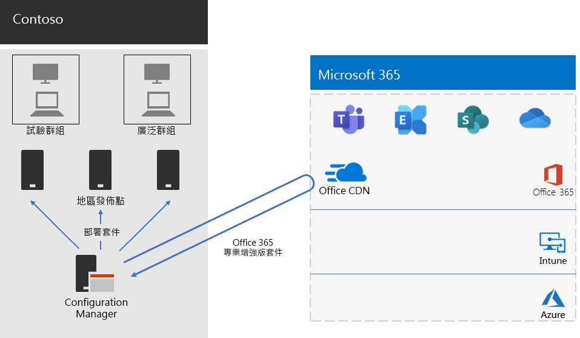

# Contoso 的 Office 365 專業增強版部署指南

Contoso 將其電腦升級至 Windows 10 企業版和 Office 365 專業增強版，讓協同合作更有效率、更佳的安全性，以及更現代化的桌面體驗。Contoso 在評估基礎架構和業務需求後，識別這些部署的關鍵需求：

- 所有電腦皆應執行 Office 365 專業增強版
- 部署應盡可能使用現有管理工具和基礎架構
- 部署必須支援使用者裝置的多種語言及現有基礎架構
- 電腦應在最低 IT 管理成本與對使用者影響最低的情況下，保持最新狀態及安全性

## 部署工具

Contoso 根據自身需求，選擇以 Configuration Manager (最新分支) 部署 Windows 10 Enterprise 和 Office 365 專業增強版。Configuration Manager 可針對大型環境進行調整並提供安裝、更新及設定的全面控制，其內建功能更讓您可輕鬆且有效率地部署及管理 Office，包括：

- 對等快取，可協助在部署至遠端位置裝置時限制網路流量
- Office 用戶端管理儀表板，讓您更輕鬆地部署 Office 和監控更新，並可讓系統管理員存取最新的部署和管理功能
- 智慧型語言套件部署，包括自動部署與作業系統相同的語言
- 完整支援並有簡單好用的方法，在部署期間從用戶端移除現有的 Office 版本

除了 Configuration Manager，Contoso 也使用「[整備工具組](https://docs.microsoft.com/deployoffice/use-the-readiness-toolkit-to-assess-application-compatibility-for-office-365-pro)」，此為 Microsoft 提供的免費工具，可用於評估 Office 巨集和增益集的相容性問題。

## 管理部署及更新

Office 365 專業增強版有新的發行模式：Office 即服務。此服務模式能讓您輕鬆掌握最新功能，但通常需要 IT 部門變更新版本的部署和測試方式。為了將相容性問題降至最低並確保電腦為最新狀態，Contoso 以兩個階段部署 Windows 和 Office： 

- 第一階段，他們將 Office 365 專業增強版部署到組織中具代表性的一小群裝置。此試驗群組用於測試應用程式、增益集和 Office 365 專業增強版的硬體
- Contoso 在四個月後解決應用程式、增益集與硬體試驗群組中的所有重大問題， 並將 Office 365 專業增強版部署至整個組織的裝置 (大型群組)。 

Contoso 不使用 Configuration Manager 來管理 Office 的更新，而是啟用雲端自動更新。雲端式更新可在降低管理成本的同時，確保裝置維持最新版本。 

Contoso 遵循相同的兩階段方式進行功能更新和部署 Office：在試驗群組中的裝置會比其他組織中的裝置 (大型群組) 早四個月收到功能更新。為了在 Office 中啟用此功能，Contoso 使用兩個建議的[更新通道](https://docs.microsoft.com/DeployOffice/overview-of-update-channels-for-office-365-proplus)： 

- 對試驗群組更新的半年通道 (已設定目標) 
- 對大型群組更新的半年通道。 

半年 (已設定目標) 通道比半年通道早四個月發行 Office 365 專業增強版，因此 Contoso 有時間驗證更新並無需管理。 

## 部署程序

為了完成 Office 部署，Contoso 實施了以下程序，包含 Microsoft 的最佳實務建議：

1. 在部署之前，他們會使用「整備工具組」測試的應用程式和 Office 增益集，評估其與 Office 365 專業增強版的相容性。
2. Contoso 啟用 Configuration Manager 的用戶端對等快取，協助在部署至遠端位置的用戶端裝置時限制網路流量。 
3. 他們在 Configuration Manager 中將兩個部署群組定義為裝置集合：試驗群組和大型群組。試驗群組包含整個組織中具代表性的一小群裝置，用來對 Windows 10 企業版和 Office 365 專業增強版的應用程式、增益集及硬體執行額外測試。 
4. 他們使用 Office 用戶端管理儀表板和 Office 365 安裝精靈建立 Ofiiice 部署套件，這兩種皆為 Configuration Manager 控制台的一部分。建立的 Office 365 專業增強版套件有兩個，一個用於試驗群組半年通道 (已設定目標)，另一個用於大型群組的半年通道。 
5. 每個 Office 套件皆包含英文、法文及德文語言套件。如果裝置需要的語言不在 Office 套件中，則會從 Office 內容傳遞網路 (CDN) 自動下載。
6. 他們先使用 Office 套件中的內建功能自動移除所有現有的 MSI 版本 Office，再安裝 Office 365 專業增強版。
7. 他們在 Configuration Manager 中將 Windows 和 Office 套件部署到內部網路中發佈點，然後執行 Configuration Manager 部署工作順序將試驗 Office 365 專業增強版套件部署到試驗群組。
8. Contoso 在試驗群組解決任何相容性問題後，即會執行工作順序將各種 Office 365 專業增強版套件部署到大型群組。

因為 Contoso 選擇從雲端自動更新裝置，因此不需要管理 Configuration Manager 中的程序。 其裝置會根據初始部署時所定義的更新通道，直接從雲端自動進行更新。 

這是 Contoso Office 365 專業增強版安裝和持續更新部署的基礎架構。

 
## 下一步

[深入了解](contoso-mdm.md) Contoso 如何在 Microsoft 365 企業版中使用 Microsoft Intune 來管理組織中的裝置與執行的應用程式。

## 另請參閱

[Microsoft 365 企業版的 Office 365 專業增強版](office365proplus-infrastructure.md)

[部署指南](deploy-microsoft-365-enterprise.md)

[測試實驗室指南](m365-enterprise-test-lab-guides.md)
