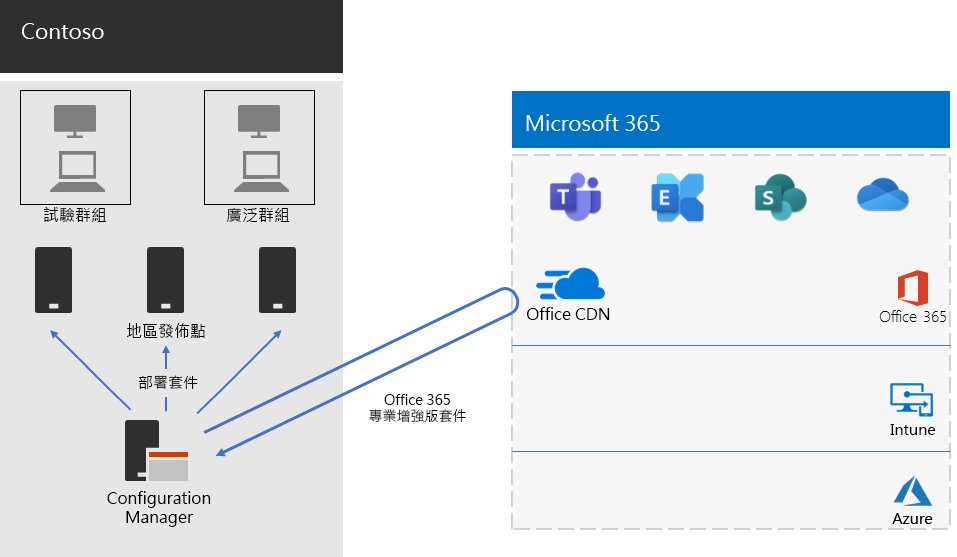

# 適用於 Contoso 的 Microsoft 365 Apps 企業版部署Microsoft 365 Apps for enterprise deployment for Contoso

Contoso upgraded their PCs to Windows 10 Enterprise and Microsoft 365 Apps for enterprise to enable more effective collaboration, better security, and a more modern desktop experience.Contoso upgraded their PCs to Windows 10 Enterprise and Microsoft 365 Apps for enterprise to enable more effective collaboration, better security, and a more modern desktop experience. After assessing their infrastructure and business needs, Contoso identified these key requirements for the deployment:After assessing their infrastructure and business needs, Contoso identified these key requirements for the deployment:

- 所有電腦都應該執行 Microsoft 365 Apps 企業版All PCs should run Microsoft 365 Apps for enterprise
- 部署應盡可能使用現有管理工具和基礎架構Deployment should use existing management tools and infrastructure when possible
- 部署必須支援使用者裝置的多種語言及現有基礎架構Deployment must support multiple languages and existing architectures on end-user devices
- 電腦應在最低 IT 管理成本與對使用者影響最低的情況下，保持最新狀態及安全性PCs should stay up-to-date and secure with minimal IT administrative costs and with minimal impact to end-users

## 部署工具Deployment tools

Based on their requirements, Contoso chose to deploy Windows 10 Enterprise and Microsoft 365 Apps for enterprise with Configuration Manager (Current Branch).Based on their requirements, Contoso chose to deploy Windows 10 Enterprise and Microsoft 365 Apps for enterprise with Configuration Manager (Current Branch). Configuration Manager scales for large environments and provides extensive control over installation, updates, and settings.Configuration Manager scales for large environments and provides extensive control over installation, updates, and settings. It also has built-in features to make it easier and more efficient to deploy and manage Office, including:It also has built-in features to make it easier and more efficient to deploy and manage Office, including:

- 對等快取，可協助在部署至遠端位置裝置時限制網路流量Peer cache, which can help with limited network capacity when deploying to devices in remote locations
- Office 用戶端管理儀表板，讓您更輕鬆地部署 Office 和監控更新，並可讓系統管理員存取最新的部署和管理功能The Office Client Management dashboard, which makes it easy to deploy Office and monitor updates and gives administrators access to the latest deployment and management features
- 智慧型語言套件部署，包括自動部署與作業系統相同的語言Intelligent language pack deployment, including automatically deploying the same language as the operating system
- 完整支援並有簡單好用的方法，在部署期間從用戶端移除現有的 Office 版本Fully supported and easy-to-use method of removing existing versions of Office from a client during deployment

除了 Configuration Manager，Contoso 也使用「[整備工具組](https://docs.microsoft.com/deployoffice/readiness-toolkit-application-compatibility-microsoft-365-apps)」，此為 Microsoft 提供的免費工具，可用於評估 Office 巨集和增益集的相容性問題。In addition to Configuration Manager, Contoso used the [Readiness Toolkit](https://docs.microsoft.com/deployoffice/readiness-toolkit-application-compatibility-microsoft-365-apps), a free tool from Microsoft, to assess compatibility issues with their Office macros and add-ins.

## 管理部署及更新Managing the deployment and updates

Microsoft 365 Apps for enterprise has a new release model: Office as a service.Microsoft 365 Apps for enterprise has a new release model: Office as a service. The service model makes it easy to stay up to date with new features, but often requires a change in approach for IT departments in how new releases are deployed and tested.The service model makes it easy to stay up to date with new features, but often requires a change in approach for IT departments in how new releases are deployed and tested. To minimize any compatibility issues and to ensure their computers stayed up to date, Contoso deployed Windows and Office in two stages:To minimize any compatibility issues and to ensure their computers stayed up to date, Contoso deployed Windows and Office in two stages: 

- For the first stage, they deployed Microsoft 365 Apps for enterprise to a small set of representative devices across the organization.For the first stage, they deployed Microsoft 365 Apps for enterprise to a small set of representative devices across the organization. This pilot group was used to test apps, add-ins, and hardware with Microsoft 365 Apps for enterpriseThis pilot group was used to test apps, add-ins, and hardware with Microsoft 365 Apps for enterprise
- Contoso 在四個月後解決應用程式、增益集與硬體試驗群組中的所有重大問題， 並將 Microsoft 365 Apps 企業版部署至整個組織的裝置 (大型群組)。Four months later, after addressing all critical issues with apps, add-ins, and hardware in the pilot group, Contoso deployed Microsoft 365 Apps for enterprise to the rest of the devices in the organization (the broad group). 

Instead of managing updates to Office with Configuration Manager, Contoso enabled automatic updates from the cloud.Instead of managing updates to Office with Configuration Manager, Contoso enabled automatic updates from the cloud. Cloud-based updates reduced their administrative overhead while ensuring the devices stayed up to date.Cloud-based updates reduced their administrative overhead while ensuring the devices stayed up to date. 

Contoso followed the same two-stage approach for feature updates that they used for deploying Office: devices in the pilot group received feature updates four months earlier than devices in the rest of the organization (the broad group).Contoso followed the same two-stage approach for feature updates that they used for deploying Office: devices in the pilot group received feature updates four months earlier than devices in the rest of the organization (the broad group). To enable this for Office, Contoso used two recommended [update channels](https://docs.microsoft.com/DeployOffice/overview-update-channels):To enable this for Office, Contoso used two recommended [update channels](https://docs.microsoft.com/DeployOffice/overview-update-channels): 

- 對試驗群組更新的半年通道(預覽)Semi-Annual Enterprise Channel (Preview) for updates to the pilot group 
- 對大型群組更新的半年企業通道。Semi-Annual Enterprise Channel for updates to the broad group. 

由於半年企業通道 (預覽) 比半年企業通道早四個月發行 Microsoft 365 Apps 企業版，因此 Contoso 有時間在無需管理更新下，進型驗證更新。Because the Semi-Annual Enterprise Channel (Preview) releases a version of Microsoft 365 Apps for enterprise four months earlier than the Semi-Annual Enterprise Channel, Contoso has time to validate the updates without having to manage them. 

## 部署程序Deployment process

為了完成 Office 部署，Contoso 實施了以下程序，包含 Microsoft 的最佳實務建議：To complete the deployment of Office, Contoso implemented the following process, which includes best practice recommendations from Microsoft:

1. 在部署之前，他們會使用「整備工具組」測試的應用程式和 Office 增益集，評估其與 Microsoft 365 Apps 企業版的相容性。Before deploying, they used the Readiness Toolkit to test their apps and Office add-ins to assess their compatibility with Microsoft 365 Apps for enterprise.
2. Contoso 啟用 Configuration Manager 的用戶端對等快取，協助在部署至遠端位置的用戶端裝置時限制網路流量。In Configuration Manager, Contoso enabled peer cache on their client devices, which helped with limited network capacity when deploying to client devices in remote locations. 
3. They defined two deployment groups as device collections in Configuration Manager: a pilot group and a broad group.They defined two deployment groups as device collections in Configuration Manager: a pilot group and a broad group. The pilot group, which included a small set of representative devices across the organization, was used to do additional testing of apps, add-ins, and hardware with Windows 10 Enterprise and Microsoft 365 Apps for enterprise.The pilot group, which included a small set of representative devices across the organization, was used to do additional testing of apps, add-ins, and hardware with Windows 10 Enterprise and Microsoft 365 Apps for enterprise. 
4. They created deployment packages for Office using the Office Client Management dashboard and the Office 365 Installer wizard, both of which are part of the Configuration Manager console.They created deployment packages for Office using the Office Client Management dashboard and the Office 365 Installer wizard, both of which are part of the Configuration Manager console. They built two Microsoft 365 Apps for enterprise packages, one for the pilot group on the Semi-Annual Enterprise Channel (Preview) and one for the broad group on the Semi-Annual Enterprise Channel.They built two Microsoft 365 Apps for enterprise packages, one for the pilot group on the Semi-Annual Enterprise Channel (Preview) and one for the broad group on the Semi-Annual Enterprise Channel. 
5. As part of each Office package, they included English, French, and German Language packs.As part of each Office package, they included English, French, and German Language packs. If a device required a language not included in the Office package, it was automatically downloaded from the Office Content Delivery Network (CDN).If a device required a language not included in the Office package, it was automatically downloaded from the Office Content Delivery Network (CDN).
6. 他們先使用 Office 套件中的內建功能自動移除所有現有的 MSI 版本 Office，再安裝 Microsoft 365 Apps 企業版。They used the built-in feature in the Office package to automatically remove all existing MSI versions of Office before installing Microsoft 365 Apps for enterprise.
7. 他們在 Configuration Manager 中將 Windows 和 Office 套件部署到內部網路中發佈點，然後執行 Configuration Manager 部署工作順序將試驗 Microsoft 365 Apps 企業版套件部署到試驗群組。In Configuration Manager, they deployed the Windows and Office packages to distribution points across their network, and then ran the Configuration Manager deployment task sequences to deploy the pilot Microsoft 365 Apps for enterprise package to the pilot group.
8. Contoso 在試驗群組解決任何相容性問題後，即會執行工作順序將各種 Microsoft 365 Apps 企業版套件部署到大型群組。After addressing any compatibility issues with the pilot group, Contoso ran the task sequences to deploy the broad Microsoft 365 Apps for enterprise package to the broad group.

因為 Contoso 選擇從雲端自動更新裝置，因此不需要管理 Configuration Manager 中的程序。Because Contoso chose to automatically update devices from the cloud, there was no need to manage the process in Configuration Manager. 其裝置會根據初始部署時所定義的更新通道，直接從雲端自動進行更新。Their devices are automatically updated directly from the cloud-based on the update channel that was defined as part of the initial deployment. 

這是 Contoso Microsoft 365 Apps 企業版安裝和持續更新部署的基礎架構。Here is Contoso’s Microsoft 365 Apps for enterprise installation and ongoing updates deployment architecture.

 
## 下一步Next step

[深入了解](contoso-mdm.md) Contoso 如何在 Microsoft 365 企業版中使用 Microsoft Intune 來管理組織中的裝置與執行的應用程式。[Learn](contoso-mdm.md) how Contoso is using Microsoft Intune in Microsoft 365 Enterprise to manage its devices and the apps that run on them across its organization.

## 請參閱See also

[適用於 Microsoft 365 企業版的 Microsoft 365 Apps 企業版Microsoft 365 Apps for enterprise for Microsoft 365 Enterprise](office365proplus-infrastructure.md)

[部署指南Deployment guide](deploy-microsoft-365-enterprise.md)

[測試實驗室指南Test lab guides](m365-enterprise-test-lab-guides.md)
