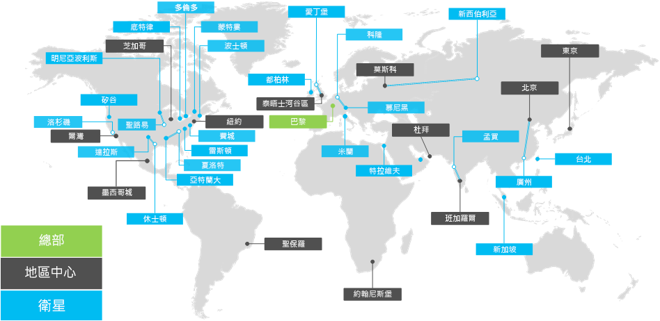

# Contoso 公司概觀Overview of the Contoso Corporation

Contoso 公司是一家跨國企業，總部設於法國巴黎。它是一家集製造、銷售與支援的集團，旗下商品超過 100,000 種。The Contoso Corporation is a multi-national business with headquarters in Paris, France. It is a conglomerate manufacturing, sales, and support organization with over 100,000 products.

## 世界各地的 ContosoContoso around the world

圖 1 顯示在巴黎的總部和其他跨洲的地區中心及衛星辦公室。Figure 1 shows the headquarters office in Paris and regional hub and satellite offices in various continents.

**圖 1：世界各地的 Contoso 辦公室****Figure 1: Contoso's offices around the world**
 
Contoso 辦公室皆依照下列三層式架構設計。Contoso's offices around the world follow a three-tier design.

- 總部Headquarters

  Contoso 公司總部是個位於巴黎郊區的大型園區，園區中有多座建築物做為行政、工程和生產設施之用。所有 Contoso 的資料中心及其網際網路呈現設施均位於巴黎總部。The Contoso Corporation headquarters is a large corporate campus on the outskirts of Paris with dozens of buildings for administrative, engineering, and manufacturing facilities. All of Contoso's datacenters and its Internet presence are housed in the Paris headquarters.

  總部共有 25,000 名員工。The headquarters has 25,000 workers.

- 地區中心Regional hubs

  地區中心辦公室主要服務全球特定區域 60% 的銷售和支援人員。每個地區中心均透過高頻寬 WAN 連結連線至巴黎總部。Regional hub offices serve a specific region of the world with 60% sales and support staff. Each regional hub is connected to the Paris headquarters with a high-bandwidth WAN link.

  每個地區中心平均有 2,000 名員工。Each regional hub has an average of 2,000 workers.

- 衛星辦公室Satellite offices

  衛星辦公室容納 80% 的銷售與支援人員，負責為主要城市或分區的 Contoso 客戶提供現場服務，每個衛星辦公室均透過高頻寬 WAN 連結連線至地區中心。Satellite offices contain 80% sales and support staff and provide an on-site presence for Contoso customers in key cities or sub-regions. Each satellite office is connected to a regional hub with a high-bandwidth WAN link.

  每個衛星辦公室平均有 250 名員工。Each satellite office has an average of 250 workers.

25% 的 Contoso 員工屬於行動工作者，當中又以地區中心和衛星辦公室的行動工作者人數佔較高的百分比。為行動工作者提供較完善的支援是 Contoso 的一項重要業務目標。 25% of Contoso's workforce is mobile-only, with a higher percentage of mobile-only workers in the regional hubs and satellite offices. Providing better support for mobile-only workers is an important business goal for Contoso.

## Microsoft 365 企業版的設計考量Design considerations for Microsoft 365 Enterprise

Contoso 的 IT 架構識別在部署 Microsoft 365 企業版時的以下設計需求和考量：Contoso's IT architects identified the following design requirements and considerations when deploying Microsoft 365 Enterprise: 

- 多個地理位置與其須遵守的當地法規及規範Multiple geographic locations with local regulations and compliance requirements
- 在總部辦公室的中央內部資料中心和地區應用程式伺服器中，裝載內部業務應用程式A central intranet datacenter in the headquarters office and regional application servers that host internal line of business applications
- 現有的 Microsoft Endpoint Configuration Manager 基礎架構An existing Microsoft Endpoint Configuration Manager infrastructure
- 混合的用戶端電腦裝置，包括 Windows、Mac 和 LinuxA mix of client computing devices, including Windows, Mac, and Linux
- 混合的個人及公司行動裝置，包括 iOS (iPhone 和 iPad)、Android 智慧型手機及平板電腦A mix of personal and company-owned mobile devices, including iOS (iPhone and iPad) and Android smart phones and tablets
- 為數眾多的遠端和行動工作者Many remote and mobile workers
- 為數眾多的事業夥伴Many business partners
- 數量龐大的客戶及個人識別資訊A large amount of customer and personally identifiable information
- 數量龐大的高價值產品設計規格智慧財產及製造交易秘密A large amount of high-value intellectual property in the form of design specifications for products and manufacturing trade secrets

## 下一步Next step

[深入了解](contoso-infra-needs.md) Contoso 公司的內部部署 IT 基礎架構，以及 Microsoft 365 企業版如何解決其業務需求。[Learn](contoso-infra-needs.md) about the Contoso Corporation’s on-premises IT infrastructure and how their business needs were addressed with Microsoft 365 Enterprise.

## 請參閱See also

[部署指南Deployment guide](deploy-microsoft-365-enterprise.md)

[測試實驗室指南Test lab guides](m365-enterprise-test-lab-guides.md)

