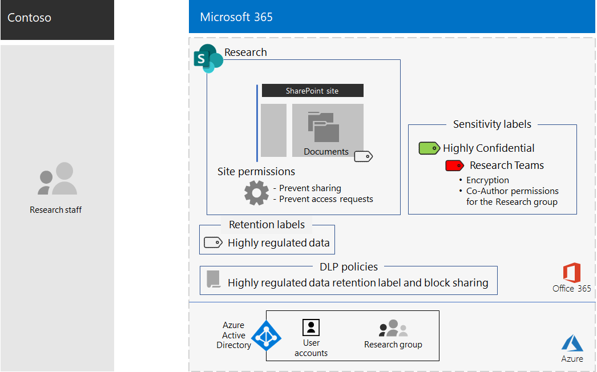
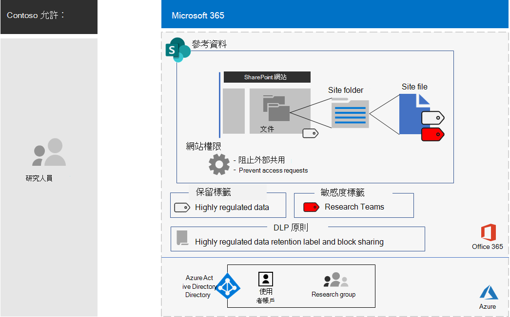

# Contoso Corporation 高度機密數位資產的 SharePoint 網站

Contoso 最有價值的資產是其智慧財產權，其形式為商業機密（如專有製造技術）和開發中產品的設計規格。 這些資產是以數位格式，最初儲存為 SharePoint Server 2016 網站上的檔案。 當 Contoso 部署 Microsoft 365 企業版時，他們想要將其內部部署數位資產轉變為雲端，以便在巴黎、莫斯科、紐約、北京和 Bangalore 中，跨研究小組輕鬆存取和更開啟的共同作業。 
  
不過，由於其敏感性，對這些檔案的存取權必須是：

- 限制于允許其存取的一組人員。 
- 使用資料遺失防護（DLP）原則加以保護，以防止使用者在網站外散佈。
- 以防止未授權使用者存取其內容的許可權進行加密及保護，即使這些使用者是在網站外發佈。

Contoso IT 部門的安全性和 SharePoint 管理員決定[針對高管制資料使用 SharePoint 網站](teams-sharepoint-online-sites-highly-regulated-data.md)。
  
Contoso 使用這些步驟來建立及保護其研究小組的 SharePoint 小組網站。

## 步驟1：建立私人 SharePoint 小組網站

為了保護 SharePoint 網站的存取權，Contoso IT 已設定[建議的 SharePoint 存取原則](sharepoint-file-access-policies.md)。

接下來，Contoso IT 管理員為位於巴黎、莫斯科、紐約、北京和 Bangalore 辦事處中的研究人員，編譯器中的使用者帳戶清單。 

接下來，Contoso IT 系統管理員建立一個名為「**調查**」的新私人小組網站，並新增其調查人員的所有使用者帳戶。

然後，他們為網站設定其他許可權設定，以防止研究人員共用網站的存取權，以及防止非工作人員要求存取網站。

## 步驟2：設定適用于限制性 DLP 原則的網站

首先，Contoso 系統管理員會將現有的**高度機密**保留標籤套用至「**資訊檢索**」網站的 Documents 資料夾。

接下來，他們建立名為「**調查**」的新 DLP 原則：

- 使用**高度機密**保留標籤。 
- 當使用者嘗試在 Contoso 以外的**調研**網站上共用數位資產時，封鎖使用者。

如需設定詳細資料，請參閱[使用保留標籤和 DLP 保護 SharePoint](https://docs.microsoft.com/office365/enterprise/protect-sharepoint-online-files-with-office-365-labels-and-dlp)檔案。

## 步驟3：建立網站的靈敏度 sublabel

Contoso admins 為**高度機密**標籤的「**調查小組**」建立了新的靈敏度 sublabel，其為下列專案：

- 需要加密。
- 允許用於**調查**Microsoft 365 群組的共同撰寫許可權
- 適用于**調查**Microsoft 365 群組

以下是高度機密資產之**研究**小組網站的結果設定。

「**調查**網站」資料夾中的檔案受到下列保護：

- 網站許可權，只允許存取「**調查**」 Microsoft 365 群組的成員。
- 「**調查**DLP」原則，其使用**高度機密**保留標籤和設定，以防止與外部使用者共用檔案。
- 「**研究小組**敏感度」 sublabel，其會在移動或複製到**資訊檢索**網站時，與檔案一起旅行的加密和許可權。

以下是以「調查**小組**敏感度 sublabel 指派」儲存在「**資訊檢索**」網站中的檔案範例。

## 步驟4：遷移內部部署 SharePoint 研究資料

Contoso admins 會將內部部署 SharePoint Server 2016 網站中的所有內部部署調查檔案，移至新「**調研**SharePoint」網站中的資料夾。

## 步驟5：訓練其研究員

Contoso 安全性人員會在必要的課程中訓練**調查**Microsoft 365 群組的成員：

- 如何存取新的**調研**網站及其現有的檔案。
- 如何在網站上建立新檔案，以及上傳儲存在本機的新檔案。
- 示範「**調查**DLP」原則如何封鎖外部共用檔案。
- 如何使用「**研究小組**敏感度」 sublabel 為檔案加上標籤。
- 示範「**調研組**」子標籤如何保護檔案，甚至是在該檔案從網站洩漏時。

最終結果是一種安全的環境，在此環境中，研究人員可以在包含調研資訊之檔案的安全環境中，于 Contoso 間共同作業。 

如果使用「**調查小組**」的調研檔 sublabel 出「**調查**網站」，它會加密，而且只能存取使用有效使用者帳號憑證的「**調查**Microsoft 365 群組」的成員。

## 下一步

[部署](deploy-microsoft-365-enterprise.md)您組織中的 Microsoft 365 企業版。

## 請參閱

[Microsoft 365 生產力資源庫](https://aka.ms/productivitylibrary)https://aka.ms/productivitylibrary)
