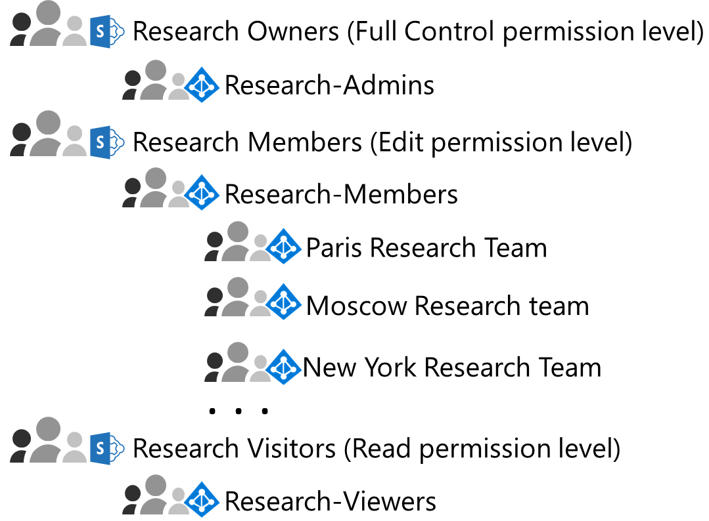

# Contoso Corporation 的高度機密數位資產的 SharePoint Online 網站

 **摘要：** Contoso 的實作方式進行其研究小組間的更輕鬆地共同作業的高度規範資料的 SharePoint Online 網站。
  
Contoso 的最有價值資產是其財產貿易機密資料，例如專屬製造流程技術的表單中與設計規格中開發的產品。這些資產相關數位格式、 原本儲存為 SharePoint Server 2016 網站上的檔案。當 Contoso 部署 Microsoft 365 企業版時，他們想要轉換至更輕鬆地存取與更多 open 共同作業雲端其內部部署數位資產的研究小組 Paris、 莫斯科、 紐約、 北京，以及班加羅爾中不同。 
  
不過，因為其機密性質，存取這些檔案必須：

- 受限制的人員，他們可以檢視或變更它們，只能由 SharePoint 系統管理員管理網站的進行中的權限組。 
- 保護與資料遺失防護 (DLP) 若要防止使用者散佈這些外部網站。
- 加密及使用受保護的存取控制清單來防止未經授權的使用者存取其內容，即使其分散外部網站。

安全性與 SharePoint 管理員可以在 Contoso 的 IT 部門決定要使用[的 SharePoint Online 網站高度規範資料](teams-sharepoint-online-sites-highly-regulated-data.md)。
  
Contoso 會使用下列步驟可建立及保護其的研究小組的 SharePoint Online 小組網站。

## 步驟 1： 檢閱並確認研究小組群組的成員

Contoso IT 系統管理員執行他們的研究小組的安全性群組的檢閱。他們移除未研究者或沒有不需要參照資產存取的人。 

他們也並建立這些新的安全性群組：

- **[參考資料系統管理員** SharePoint 管理員具有完全控制權的網站，包括能夠修改權限組。
- **[參考資料成員** 為全球各地的研究小組安全性群組組。
- **[參考資料檢視器** 管理使用者，例如高階主管的研究 （英文） 組織，可以在網站檢視資產中一組。

## 步驟 2： 建立隔離的 SharePoint Online 小組網站 

第一次建立新的小組網站的 Contoso SharePoint admins 名為 **[參考資料**。它們然後設定：

- 使用 [參考資料擁有者 SharePoint 群組中，有**Research-Admins**安全性群組的成員身分的完全控制 」 權限層級
- 要使用參考資料成員 SharePoint 群組中，有**Research 成員**」 安全性群組的成員身分的編輯權限層級
- 若要使用參考資料訪客 SharePoint 群組中，具有 [**參考資料檢視程式**安全性] 群組成員身分的讀取權限層級

以下是所產生的 SharePoint 權限層級、 SharePoint 群組和其成員。

接下來，其設定之網站的其他限制。

如設定的詳細資訊，請參閱 ＜ [Deploy 隔離的 SharePoint Online 小組網站](https://docs.microsoft.com/office365/enterprise/deploy-an-isolated-sharepoint-online-team-site)。

## 步驟 3： 設定嚴格的 Office 365 標籤 DLP 原則的網站

首先，Contoso admins **Research**網站套用**高度機密**的 Office 365 標籤。

接下來，建立新的 Office 365 DLP 原則名為 **[參考資料**的：

- 使用**高度機密**的 Office 365 標籤。 
- 會套用至**Research**網站。
- 防止使用者共用文件。

如設定的詳細資訊，請參閱 ＜[保護 SharePoint Online 與 Office 365 標籤和 DLP 的檔案](https://docs.microsoft.com/office365/enterprise/protect-sharepoint-online-files-with-office-365-labels-and-dlp)。

## 步驟 4： 建立網站的 Azure 資訊保護子標籤

建立新的 Azure 資訊保護子標籤的 Contoso admins 命名範圍的原則中的預設**高度機密**標籤的 **[參考資料**的：

- 需要加密。
- 允許完整存取**Research 成員**」 安全性群組的成員。
- 允許讀取權限**參考資料的檢視器**的 [安全性] 群組的成員。

接下來，他們部署 Azure 資訊保護用戶端裝置的研究小組成員。

如設定的詳細資訊，請參閱 ＜[保護 SharePoint Online Azure 資訊保護檔案](https://docs.microsoft.com/office365/enterprise/protect-sharepoint-online-files-with-azure-information-protection)。 

以下是所產生的高度機密資產**研究**網站組態。

## 步驟 5： 移轉內部部署 SharePoint 研究 （英文） 資料

Contoso admins 移動的所有內部研究內部部署 SharePoint Server 2016 網站中新**參考資料**的 SharePoint Online 站台的資料夾中的檔案。

## 步驟 6： 訓練使用者 

Contoso 安全性員工培訓逐步執行其透過強制課程的研究小組：

- 如何存取新的**研究**SharePoint Online 網站和其現有的檔案。
- 如何在網站上建立新檔案，以及上傳儲存在本機的新檔案。
- 示範如何 DLP 原則封鎖來自外部共用檔案。
- 使用 Azure 資訊保護用戶端標籤具有**Research**子標籤的 [參考資料檔案的方式。
- 即使它洩露從網站**Research**子標籤保護檔案的方式示範。

最終結果是安全的環境中研究者可以共同作業整個組織中的安全的環境。 

如果**Research**子標籤研究 （英文） 文件從 **[參考資料**網站洩露，最好是加密和只可以存取具有有效認證**Research 成員**及**參考資料的檢視器**的安全性群組的成員。

## 下一步

在貴組織中[部署](deploy-microsoft-365-enterprise.md) Microsoft 365 企業版。

