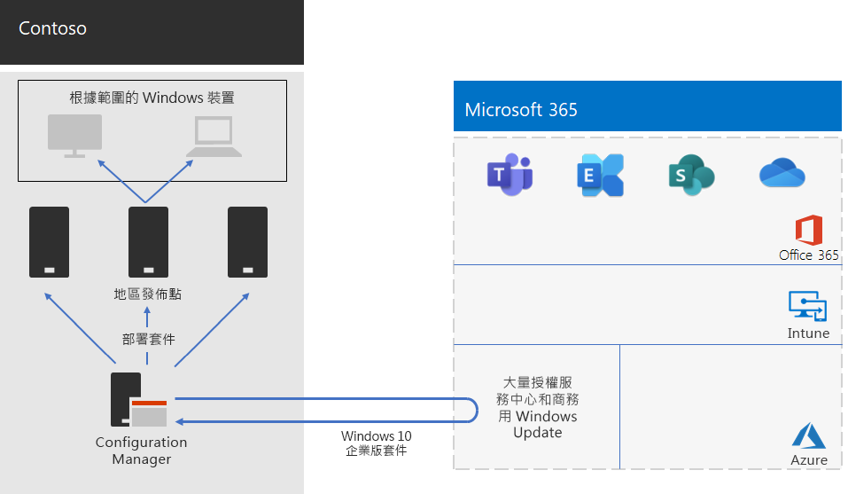

# Contoso 的 Windows 10 企業版部署Windows 10 Enterprise deployment for Contoso

在 Microsoft 365 for enterprise 的廣泛展示之前，Contoso 具有 Windows 相容的電腦和裝置，其混合了 Windows 7 (10% ) 、Windows 8.1 (65% ) 和 Windows 10 (25% ) 。Prior to the wide rollout of Microsoft 365 for enterprise, Contoso had Windows-compatible PCs and devices running a mixture of Windows 7 (10%), Windows 8.1 (65%), and Windows 10 (25%). Contoso 想要升級其電腦的 Windows 10 企業版利用高級安全性，並從自動部署更新，降低 IT 負荷。Contoso wanted to upgrade their PCs for Windows 10 Enterprise take advantage of advanced security and lowered IT overhead from automated deployments of updates. 

在評估基礎架構和業務需求後，Contoso 識別這些部署的關鍵需求：After assessing their infrastructure and business needs, Contoso identified these key requirements for the deployment:

- 執行 Windows 10 企業版的電腦和裝置越多越好As many PCs and devices as possible should run Windows 10 Enterprise
- 實施就地升級以利用現有的 Configuration Manager 基礎架構Rollout of the in-place upgrades leverages existing Configuration Manager infrastructure
- 控制要部署的 Windows 10 企業版版本及週期性的更新Control over which versions of Windows 10 Enterprise to deploy and updates are done through rings
- 電腦和裝置應在最低 IT 管理成本與對使用者影響最低的情況下，保持最新狀態PCs and devices should stay up to date with minimal IT administrative costs and with minimal impact to end-users

最新的定義是指符合 Contoso 業務需求的受支援 Windows 10 企業版，並非指所有 Windows 相容的電腦皆執行 Windows 10 企業版最新版本。Up to date is defined as the supported version of Windows 10 Enterprise that meets Contoso’s business needs, which can be different from having all Windows-compatible PCs running the latest version of Windows 10 Enterprise.

## 部署工具Deployment tools

在 Windows 10 企業版就地升級之前和期間，Contoso 使用以下 Windows Analytics 解決方案：Prior to and during in-place upgrades of Windows 10 Enterprise, Contoso used the following solutions of Windows Analytics:

- 升級整備狀況Upgrade Readiness  

  收集系統、應用程式及驅動程式資料以供分析，然後識別可能會阻擋升級的相容性問題與 Microsoft 已知問題的建議修正。Collects system, application, and driver data for analysis, and then identifies compatibility issues that can block an upgrade and suggested fixes the issues are known to Microsoft.

- 升級相容性Update Compliance  

  針對 Windows 更新顯示裝置的狀態，讓您能視需要確保這些裝置處於最新更新狀態。Shows you the state of your devices with respect to the Windows updates so that you can ensure that they are on the most current updates as appropriate.

- 裝置健全狀況Device Health  

  識別經常當機，因此可能需要重建或更換的裝置，以及導致裝置當機的裝置驅動程式，並建議能減少當機次數的驅動程式替代版本。Identifies devices that crash frequently, and therefore might need to be rebuilt or replaced and device drivers that are causing device crashes, with suggestions of alternative versions of those drivers that might reduce the number of crashes. 提供 Windows 資訊保護設定錯誤的通知，並傳送提示給使用者。Provides notification of Windows Information Protection misconfigurations that send prompts to end users.
 
Contoso 已擁有 Configuration Manager (最新分支) 基礎架構。Configuration Manager 可針對大型環境進行調整並提供安裝、更新及設定的全面控制，其內建功能更讓您可輕鬆且有效率地部署及管理 Windows 10 企業版。Contoso has an existing Configuration Manager (Current Branch) infrastructure. Configuration Manager scales for large environments and provides extensive control over installation, updates, and settings. It also has built-in features to make it easier and more efficient to deploy and manage Windows 10 Enterprise.

## 規劃程序Planning process

Contoso 使用 Windows Analytics 中的升級準備，判斷已安裝應用程式的集合，及其與 Windows 10 企業版的相容性。Contoso used the Upgrade Readiness in Windows Analytics to determine the set of installed apps and their compatibility with Windows 10 Enterprise.

## 部署程序Deployment process

為了完成 Windows 10 企業版的就地升級部署，Contoso 實施了以下程序，包含 Microsoft 的最佳實務建議：To complete the in-place upgrade deployment of Windows 10 Enterprise, Contoso implemented the following process, which includes best practice recommendations from Microsoft:

1. 為 Configuration Manager 啟用對等快取。Enabled peer cache for Configuration Manager.
2. 根據大量授權服務中心建立自訂 Windows 套件。Created customized Windows packages based on images from the Volume Licensing Service Center.
3. 使用 Configuration Manager 將 Windows 套件部署到跨網路的發佈點，並將其部署至三個驗證和部署過渡群組。Used Configuration Manager to deploy the Windows packages to distribution points across their network and deployed builds to the three validation and deployment staging groups.
4. 使用 Windows Analytics 的「裝置健全狀況」和「升級相容性」解決方案，對在三個驗證和部署執行週期中的電腦和裝置執行成功評估。Performed assessment of success for PCs and devices in the three validation and deployment staging rings using the Device Health and Update Compliance solutions of Windows Analytics.
5. 根據 Windows Analytics 資訊，Contoso 決定要部署至廣泛部署群組的 Windows 10 企業版版本。Based on the Windows Analytics information, Contoso determined the version of Windows 10 Enterprise to deploy to the broad deployment group.
6. 執行 Configuration Manager 部署工作順序，將選取的 Windows 套件部署到廣泛的部署群組。Ran the Configuration Manager deployment task sequences to deploy the selected Windows package to the broad deployment group.
7. 使用裝置健康情況和更新規範解決方案，在廣泛的部署群組中監控電腦和裝置，以解決問題。Monitored PCs and devices in the broad deployment group using the Device Health and Update Compliance solutions to address issues.

這是 Contoso 就地升級和持續更新部署的基礎架構。Here is Contoso’s in-place upgrade and ongoing updates deployment architecture.

此基礎架構的組成為：This infrastructure consists of:

- Configuration Manager，其：Configuration Manager, which:
  - 從 Microsoft 網路中的 Microsoft 大量授權取得取得 Windows 10 企業版套件的映像。Obtains images for Windows 10 Enterprise packages from the Microsoft Volume Licensing Center in the Microsoft Network.
  - 部署套件的管理中心點。Is the central administration point for deployment packages.
- 通常位於 Contoso 地區中心辦公室的地區發布點。Regional distribution points that are typically located in Contoso’s regional hub offices.
- 在不同位置上的 Windows 電腦和裝置，會根據群組成員資格，針對就地升級或持續更新接收及安裝部署套件。Windows PCs and devices in various locations that receive and install the deployment packages for the in-place upgrade or ongoing updates based on group membership.

## 後續步驟Next step

瞭解 Contoso 如何利用其 Configuration Manager 基礎結構，在其整個組織中 [部署及保留目前的 Microsoft 365 應用程式](contoso-o365pp.md) 。Learn how Contoso is leveraging its Configuration Manager infrastructure to [deploy and keep current Microsoft 365 Apps for enterprise](contoso-o365pp.md) across its organization. 

## 另請參閱See also

[Windows 10 企業版Windows 10 Enterprise](/windows/deployment/)

[Microsoft 365 企業版概觀Microsoft 365 for enterprise overview](microsoft-365-overview.md)

[測試實驗室指南Test lab guides](m365-enterprise-test-lab-guides.md)