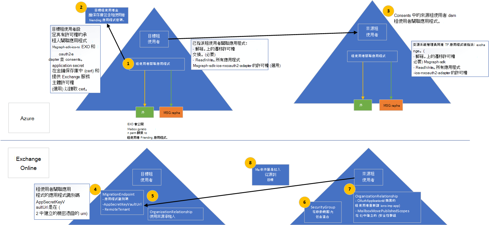

# <a name="cross-tenant-mailbox-migration-preview"></a><span data-ttu-id="eeb52-103">跨承租人信箱遷移 (預覽) </span><span class="sxs-lookup"><span data-stu-id="eeb52-103">Cross-tenant mailbox migration (preview)</span></span>

<span data-ttu-id="eeb52-104">先前，當 Exchange Online 租使用者將信箱移至同一 Exchange Online 服務中的其他租使用者時，他們必須將其完全下架至內部部署，然後再將其上架至新的租使用者。</span><span class="sxs-lookup"><span data-stu-id="eeb52-104">Previously, when an Exchange Online tenant needed to move mailboxes to another tenant in the same Exchange Online service, they would have to completely offboard them to on-premises and then onboard them to a new tenant.</span></span> <span data-ttu-id="eeb52-105">使用新的跨租使用者信箱遷移功能，來源和目標承租人中的租使用者管理員可以在租使用者內部部署系統中的基礎結構相依性之間移動信箱。</span><span class="sxs-lookup"><span data-stu-id="eeb52-105">With the new cross-tenant mailbox migration feature, tenant administrators in both source and target tenants can move mailboxes between the tenants with minimal infrastructure dependencies in their on-premises systems.</span></span> <span data-ttu-id="eeb52-106">這樣就不再需要離線和上架信箱。</span><span class="sxs-lookup"><span data-stu-id="eeb52-106">This removes the need to off-board and onboard mailboxes.</span></span>

<span data-ttu-id="eeb52-107">通常，在合併或 divestitures 期間，您必須能夠將使用者和內容移至新的承租人。</span><span class="sxs-lookup"><span data-stu-id="eeb52-107">Commonly, during mergers or divestitures, you need the ability to move users and content into a new tenant.</span></span> <span data-ttu-id="eeb52-108">當目標租使用者管理員執行移動時，它稱為「拉入移動」，類似于雲端上架遷移的內部部署。</span><span class="sxs-lookup"><span data-stu-id="eeb52-108">When the target tenant administrator executes the move, it’s called a Pull move, similar to on-premises to cloud onboarding migrations.</span></span>

<span data-ttu-id="eeb52-109">由於租使用者管理員可以在將使用者轉換至其新組織所需的較知名的工作流程中，跨承租人 Exchange 信箱移動完全由租使用者管理員所進行的自我服務。</span><span class="sxs-lookup"><span data-stu-id="eeb52-109">Cross-tenant Exchange mailbox moves are fully self-serviced by tenant administrators, using well known interfaces that can be scripted into the larger workflows needed to transition users to their new organization.</span></span> <span data-ttu-id="eeb52-110">系統管理員可以使用「 `New-MigrationBatch` 移動信箱」管理角色提供的指令程式，以執行跨承租人移動。</span><span class="sxs-lookup"><span data-stu-id="eeb52-110">Administrators can use the `New-MigrationBatch` cmdlet, available through the Move Mailboxes management role, to execute cross-tenant moves.</span></span> <span data-ttu-id="eeb52-111">移動程式會在信箱同步處理和完成期間包含租使用者授權檢查。</span><span class="sxs-lookup"><span data-stu-id="eeb52-111">The move process includes tenant authorization checks during mailbox synchronization and finalization.</span></span>

<span data-ttu-id="eeb52-112">遷移的使用者必須存在於 MailUsers 的目標租使用者 Exchange Online 系統中，並以特定屬性標示，以啟用跨承租人的移動。</span><span class="sxs-lookup"><span data-stu-id="eeb52-112">Users migrating must be present in the target tenant Exchange Online system as MailUsers, marked with specific attributes to enable the cross-tenant moves.</span></span> <span data-ttu-id="eeb52-113">系統會針對未在目標租使用者中正確設定的使用者，移動系統會失敗。</span><span class="sxs-lookup"><span data-stu-id="eeb52-113">The system will fail moves for users that are not properly set up in the target tenant.</span></span>

<span data-ttu-id="eeb52-114">移動完成後，來源系統信箱會轉換成 MailUser，而 Exchange) 中 ExternalEmailAddress 所顯示的 targetAddress (會以路由位址傳送至目的地租使用者。</span><span class="sxs-lookup"><span data-stu-id="eeb52-114">When the moves are complete, the source system mailbox is converted to MailUser and the targetAddress (shown as ExternalEmailAddress in Exchange) is stamped with the routing address to the destination tenant.</span></span> <span data-ttu-id="eeb52-115">此程式會將 MailUser 舊版租使用者保留在來源租使用者中，並允許一段同時存在和郵件路由的情況。</span><span class="sxs-lookup"><span data-stu-id="eeb52-115">This process leaves the legacy MailUser in the source tenant, and allows for a period of co-existence and mail routing.</span></span> <span data-ttu-id="eeb52-116">當商務程式允許時，來源租使用者可能會移除來源 MailUser 或將其轉換為郵件連絡人。</span><span class="sxs-lookup"><span data-stu-id="eeb52-116">When business processes allow, the source tenant may remove the source MailUser or convert them to a mail contact.</span></span>

<span data-ttu-id="eeb52-117">僅限混合或雲端中的承租人或兩者的任何組合，才支援跨承租人 Exchange 信箱遷移。</span><span class="sxs-lookup"><span data-stu-id="eeb52-117">Cross-tenant Exchange mailbox migrations are supported for tenants in hybrid or cloud only, or any combination of the two.</span></span>

<span data-ttu-id="eeb52-118">本文說明跨承租人信箱移動的程式，並提供如何準備內容移動的來源和目標承租人的指導方針。</span><span class="sxs-lookup"><span data-stu-id="eeb52-118">This article describes the process for cross-tenant mailbox moves and provides guidance on how to prepare source and target tenants for the content move.</span></span>

## <a name="preparing-source-and-target-tenants"></a><span data-ttu-id="eeb52-119">準備來源和目標承租人</span><span class="sxs-lookup"><span data-stu-id="eeb52-119">Preparing source and target tenants</span></span>

<span data-ttu-id="eeb52-120">跨承租人 Exchange 信箱遷移功能需要授權和範圍進行跨承租人遷移。</span><span class="sxs-lookup"><span data-stu-id="eeb52-120">The Cross-tenant Exchange mailbox migration feature requires authorization and scoping for cross-tenant migrations.</span></span> <span data-ttu-id="eeb52-121">租使用者使用 Azure Enterprise 應用程式與主要 Vault 儲存解決方案，現在，租使用者系統管理員可以管理 Exchange Online 信箱從一個承租人遷移至另一個租使用者的授權和範圍。</span><span class="sxs-lookup"><span data-stu-id="eeb52-121">Using the Azure Enterprise application and Key Vault storage solutions, tenant admins are now empowered to manage both authorization and scoping of Exchange Online mailbox migrations from one tenant to another.</span></span> <span data-ttu-id="eeb52-122">跨承租人信箱移動支援邀請與同意模型，以建立 Azure Active Directory (Azure AD) 應用程式，以供租使用者對間的驗證使用。</span><span class="sxs-lookup"><span data-stu-id="eeb52-122">Cross-tenant mailbox moves supports an invitation and consent model to establish an Azure Active Directory (Azure AD) application used for authentication between a tenant pair.</span></span> <span data-ttu-id="eeb52-123">也需要其他元件（例如，組織關聯性和遷移端點）。</span><span class="sxs-lookup"><span data-stu-id="eeb52-123">Additional components such as an organization relationship and a migration endpoint are also required.</span></span>

<span data-ttu-id="eeb52-124">本節不包含準備目標目錄中 MailUser 使用者物件所需的特定步驟，也不會包含用於提交遷移批次的範例命令。</span><span class="sxs-lookup"><span data-stu-id="eeb52-124">This section does not include the specific steps required to prepare the MailUser user objects in the target directory, nor does it include the sample command to submit a migration batch.</span></span> <span data-ttu-id="eeb52-125">請參閱 [準備目標使用者物件以供遷移](#prepare-target-user-objects-for-migration) 以取得此資訊。</span><span class="sxs-lookup"><span data-stu-id="eeb52-125">Please see [Prepare target user objects for migration](#prepare-target-user-objects-for-migration) for this information.</span></span>

## <a name="prerequisites"></a><span data-ttu-id="eeb52-126">必要條件</span><span class="sxs-lookup"><span data-stu-id="eeb52-126">Prerequisites</span></span>

<span data-ttu-id="eeb52-127">跨承租人信箱移動功能需要 [Azure Key Vault](/azure/key-vault/basic-concepts) 才能建立租使用者對特定的 Azure 應用程式，以安全地儲存和存取憑證/機密，以供從一個租使用者對另一個租使用者進行驗證及授權，並移除在承租人間共用憑證/機密的任何需求。</span><span class="sxs-lookup"><span data-stu-id="eeb52-127">The cross-tenant mailbox move feature requires [Azure Key Vault](/azure/key-vault/basic-concepts) to establish a tenant pair-specific Azure application to securely store and access the certificate/secret used to authenticate and authorize mailbox migration from one tenant to the other, removing any requirements to share certificates/secrets between tenants.</span></span>

<span data-ttu-id="eeb52-128">開始之前，請確定您具備執行部署腳本所需的許可權，才能設定 Azure Key Vault、移動信箱應用程式、EXO 遷移端點，以及 EXO 組織關聯性。</span><span class="sxs-lookup"><span data-stu-id="eeb52-128">Before starting, be sure you have the necessary permissions to run the deployment scripts in order to configure Azure Key Vault, Move Mailbox application, EXO Migration Endpoint, and the EXO Organization Relationship.</span></span> <span data-ttu-id="eeb52-129">通常，全域管理員具有執行所有設定步驟的許可權。</span><span class="sxs-lookup"><span data-stu-id="eeb52-129">Typically, Global Admin has permission to perform all configuration steps.</span></span>

<span data-ttu-id="eeb52-130">此外，在執行安裝程式之前，必須先在來源租使用者中啟用郵件功能的安全性群組。</span><span class="sxs-lookup"><span data-stu-id="eeb52-130">Additionally, mail-enabled security groups in the source tenant are required prior to running setup.</span></span> <span data-ttu-id="eeb52-131">這些群組是用來限定可從來源移動的信箱清單，或有時稱為「資源) 租使用者 (目標租使用者。</span><span class="sxs-lookup"><span data-stu-id="eeb52-131">These groups are used to scope the list of mailboxes that can move from source (or sometimes referred to as resource) tenant to the target tenant.</span></span> <span data-ttu-id="eeb52-132">這可讓來源租使用者管理員限制或限制需要移動的特定信箱集，以防非預期的使用者進行遷移。</span><span class="sxs-lookup"><span data-stu-id="eeb52-132">This allows the source tenant admin to restrict or scope the specific set of mailboxes that need to be moved, preventing unintended users from being migrated.</span></span> <span data-ttu-id="eeb52-133">不支援嵌套的群組。</span><span class="sxs-lookup"><span data-stu-id="eeb52-133">Nested groups are not supported.</span></span>

<span data-ttu-id="eeb52-134">您也需要與您要將信箱移至哪個夥伴公司 (進行通訊，) 取得其 Microsoft 365 租使用者識別碼。</span><span class="sxs-lookup"><span data-stu-id="eeb52-134">You will also need to communicate with your trusted partner company (with whom you will be moving mailboxes) to obtain their Microsoft 365 tenant ID.</span></span> <span data-ttu-id="eeb52-135">在 [組織關聯] 欄位中使用此租使用者識別碼 `DomainName` 。</span><span class="sxs-lookup"><span data-stu-id="eeb52-135">This tenant ID is used in the Organization Relationship `DomainName` field.</span></span>

<span data-ttu-id="eeb52-136">若要取得訂閱的租使用者識別碼，請登入 Microsoft 365 系統管理中心，然後移至 [https://aad.portal.azure.com/#blade/Microsoft_AAD_IAM/ActiveDirectoryMenuBlade/Properties](https://aad.portal.azure.com/#blade/Microsoft_AAD_IAM/ActiveDirectoryMenuBlade/Properties) 。</span><span class="sxs-lookup"><span data-stu-id="eeb52-136">To obtain the tenant ID of a subscription, sign-in to the Microsoft 365 admin center and go to [https://aad.portal.azure.com/#blade/Microsoft_AAD_IAM/ActiveDirectoryMenuBlade/Properties](https://aad.portal.azure.com/#blade/Microsoft_AAD_IAM/ActiveDirectoryMenuBlade/Properties).</span></span> <span data-ttu-id="eeb52-137">按一下 [租使用者識別碼] 屬性的複製圖示，將其複製到剪貼簿。</span><span class="sxs-lookup"><span data-stu-id="eeb52-137">Click the copy icon for the Tenant ID property to copy it to the clipboard.</span></span>

<span data-ttu-id="eeb52-138">以下是處理常式的運作方式。</span><span class="sxs-lookup"><span data-stu-id="eeb52-138">Here is how the process works.</span></span>

:::image type="content" source="../media/tenant-to-tenant-mailbox-move/prepare-tenants-flow.png" alt-text="信箱遷移的租使用者準備。":::

<span data-ttu-id="eeb52-140">[請參閱較大版本的此影像](https://github.com/MicrosoftDocs/microsoft-365-docs/raw/public/microsoft-365/media/tenant-to-tenant-mailbox-move/prepare-tenants-flow.png)。</span><span class="sxs-lookup"><span data-stu-id="eeb52-140">[See a larger version of this image](https://github.com/MicrosoftDocs/microsoft-365-docs/raw/public/microsoft-365/media/tenant-to-tenant-mailbox-move/prepare-tenants-flow.png).</span></span>

<!--
[](https://github.com/MicrosoftDocs/microsoft-365-docs/raw/public/microsoft-365/media/tenant-to-tenant-mailbox-move/prepare-tenants-flow.png)
-->

### <a name="prepare-tenants"></a><span data-ttu-id="eeb52-141">準備承租人</span><span class="sxs-lookup"><span data-stu-id="eeb52-141">Prepare tenants</span></span>

<span data-ttu-id="eeb52-142">在高層次上執行安裝程式腳本時，會進行下列設定動作。</span><span class="sxs-lookup"><span data-stu-id="eeb52-142">At a high level, the following configuration actions take place when executing the setup scripts.</span></span>

<span data-ttu-id="eeb52-143">準備目標租使用者：</span><span class="sxs-lookup"><span data-stu-id="eeb52-143">Prepare the target tenant:</span></span>

1. <span data-ttu-id="eeb52-144">若未提供現有的 Azure 資源群組，則會在 (SCRIPT) 中建立一個新的 Azure 資源群組。</span><span class="sxs-lookup"><span data-stu-id="eeb52-144">If an existing Azure Resource Group is not provided, a new one is created (SCRIPT).</span></span>
2. <span data-ttu-id="eeb52-145">若未提供現有的 Key Vault， (腳本) 中建立新的按鍵 Vault。</span><span class="sxs-lookup"><span data-stu-id="eeb52-145">If an existing Key Vault is not provided, a new one is created (SCRIPT).</span></span>
3. <span data-ttu-id="eeb52-146">Office 365 Exchange Online 信箱遷移應用程式 (腳本) 中建立新的訪問原則。</span><span class="sxs-lookup"><span data-stu-id="eeb52-146">A new Access Policy is created for the Office 365 Exchange Online Mailbox Migration application (SCRIPT).</span></span>
4. <span data-ttu-id="eeb52-147">如果指定) 將機密保存到遷移應用程式 (腳本) ，就會建立新的憑證 (或現有憑證。</span><span class="sxs-lookup"><span data-stu-id="eeb52-147">A new certificate is created (or existing one, if specified) to hold the secret to the Migration application (SCRIPT).</span></span>
5. <span data-ttu-id="eeb52-148"> (SCRIPT) 中建立新的 Azure AD 應用程式。</span><span class="sxs-lookup"><span data-stu-id="eeb52-148">A new Azure AD application is created (SCRIPT).</span></span>
6. <span data-ttu-id="eeb52-149">憑證/機密會上傳至遷移應用程式 (SCRIPT) 。</span><span class="sxs-lookup"><span data-stu-id="eeb52-149">The certificate/secret is uploaded to the migration application (SCRIPT).</span></span>
7. <span data-ttu-id="eeb52-150">信箱遷移許可權會指派給應用程式 (SCRIPT) 。</span><span class="sxs-lookup"><span data-stu-id="eeb52-150">Mailbox migration permissions are assigned to the application (SCRIPT).</span></span>
8. <span data-ttu-id="eeb52-151">部署腳本會暫停，直到 target admin consents 至自己的應用程式 (SCRIPT) 。</span><span class="sxs-lookup"><span data-stu-id="eeb52-151">The deployment script pauses until target admin consents to their own application (SCRIPT).</span></span>
9. <span data-ttu-id="eeb52-152">目標承租人系統管理員 consents 指定給應用程式 (手動) 的許可權。</span><span class="sxs-lookup"><span data-stu-id="eeb52-152">The target tenant admin consents to the permissions given to the application (MANUAL).</span></span>
10. <span data-ttu-id="eeb52-153">組織關聯建立到目標租使用者 (SCRIPT) 。</span><span class="sxs-lookup"><span data-stu-id="eeb52-153">An organization relationship is created to the target tenant (SCRIPT).</span></span>
11. <span data-ttu-id="eeb52-154">會建立遷移端點，將信箱拉入目標租使用者 (SCRIPT) 。</span><span class="sxs-lookup"><span data-stu-id="eeb52-154">A migration endpoint is created to pull mailboxes to the target tenant (SCRIPT).</span></span>

<span data-ttu-id="eeb52-155">準備來源租使用者：</span><span class="sxs-lookup"><span data-stu-id="eeb52-155">Prepare the source tenant:</span></span>

1. <span data-ttu-id="eeb52-156">來源租使用者管理員接受來自目標租使用者 (手動) 的信箱遷移應用程式邀請。</span><span class="sxs-lookup"><span data-stu-id="eeb52-156">The source tenant admin accepts consent to Mailbox Migration application invitation from the Target tenant (MANUAL).</span></span>
2. <span data-ttu-id="eeb52-157">來源租使用者系統管理員會在其承租人中建立擁有郵件功能的安全性群組，以包含允許遷移應用程式移動的信箱清單 (手動) 。</span><span class="sxs-lookup"><span data-stu-id="eeb52-157">The source tenant admin creates a mail-enabled security group in their tenant to contain the list of mailboxes allowed to be moved by the migration application (MANUAL).</span></span>
3. <span data-ttu-id="eeb52-158">組織關聯性建立于目標承租人，指定信箱遷移應用程式應該用於 OAuth 驗證，以接受 (腳本) 的移動要求。</span><span class="sxs-lookup"><span data-stu-id="eeb52-158">An organization relationship is created to the target tenant specifying the mailbox migration application should be used for OAuth verification to accept the move request (SCRIPT).</span></span>

#### <a name="step-by-step-instructions-for-the-target-tenant-admin"></a><span data-ttu-id="eeb52-159">目標承租人管理員的逐步指示</span><span class="sxs-lookup"><span data-stu-id="eeb52-159">Step-by-step instructions for the target tenant admin</span></span>

1. <span data-ttu-id="eeb52-160">從[GitHub 存放庫](https://github.com/microsoft/cross-tenant/releases/tag/Preview)下載目標租使用者安裝程式的 SetupCrossTenantRelationshipForTargetTenant.ps1 腳本。</span><span class="sxs-lookup"><span data-stu-id="eeb52-160">Download the SetupCrossTenantRelationshipForTargetTenant.ps1 script for the target tenant setup from the [GitHub repository](https://github.com/microsoft/cross-tenant/releases/tag/Preview).</span></span>
2. <span data-ttu-id="eeb52-161">將腳本 (SetupCrossTenantRelationshipForTargetTenant.ps1) 儲存至您要執行腳本的電腦。</span><span class="sxs-lookup"><span data-stu-id="eeb52-161">Save the script (SetupCrossTenantRelationshipForTargetTenant.ps1) to the computer from which you will be executing the script.</span></span>
3. <span data-ttu-id="eeb52-162">建立與 Exchange Online 目標租使用者的遠端 PowerShell 連接。</span><span class="sxs-lookup"><span data-stu-id="eeb52-162">Create a Remote PowerShell connection to the Exchange Online target tenant.</span></span> <span data-ttu-id="eeb52-163">此外，請務必具備執行部署腳本所需的許可權，才能設定 Azure 金鑰 Vault 儲存和憑證、移動信箱應用程式、EXO 遷移端點，以及 EXO 組織關聯性。</span><span class="sxs-lookup"><span data-stu-id="eeb52-163">Again, make sure you have the necessary permissions to run the deployment scripts in order to configure the Azure Key Vault storage and certificate, Move Mailbox application, EXO Migration Endpoint, and the EXO Organization Relationship.</span></span>
4. <span data-ttu-id="eeb52-164">將檔資料夾目錄變更為腳本位置，或確認腳本目前已儲存至遠端 PowerShell 會話中的目前位置。</span><span class="sxs-lookup"><span data-stu-id="eeb52-164">Change the file folder directory to the script location or verify the script is currently saved to the location currently in your Remote PowerShell session.</span></span>
5. <span data-ttu-id="eeb52-165">使用下列參數和值執行腳本。</span><span class="sxs-lookup"><span data-stu-id="eeb52-165">Run the script with the following parameters and values.</span></span>

   |<span data-ttu-id="eeb52-166">參數</span><span class="sxs-lookup"><span data-stu-id="eeb52-166">Parameter</span></span>|<span data-ttu-id="eeb52-167">值</span><span class="sxs-lookup"><span data-stu-id="eeb52-167">Value</span></span>|<span data-ttu-id="eeb52-168">必要或選用</span><span class="sxs-lookup"><span data-stu-id="eeb52-168">Required or Optional</span></span>
   |---|---|---|
   |<span data-ttu-id="eeb52-169">-TargetTenantDomain</span><span class="sxs-lookup"><span data-stu-id="eeb52-169">-TargetTenantDomain</span></span>|<span data-ttu-id="eeb52-170">目標租使用者網域，例如 fabrikam \. onmicrosoft.com。</span><span class="sxs-lookup"><span data-stu-id="eeb52-170">Target tenant domain, such as fabrikam\.onmicrosoft.com.</span></span>|<span data-ttu-id="eeb52-171">必要</span><span class="sxs-lookup"><span data-stu-id="eeb52-171">Required</span></span>|
   |<span data-ttu-id="eeb52-172">-ResourceTenantDomain</span><span class="sxs-lookup"><span data-stu-id="eeb52-172">-ResourceTenantDomain</span></span>|<span data-ttu-id="eeb52-173">來源租使用者網域，例如 contoso \. onmicrosoft.com。</span><span class="sxs-lookup"><span data-stu-id="eeb52-173">Source tenant domain, such as contoso\.onmicrosoft.com.</span></span>|<span data-ttu-id="eeb52-174">必要</span><span class="sxs-lookup"><span data-stu-id="eeb52-174">Required</span></span>|
   |<span data-ttu-id="eeb52-175">-ResourceTenantAdminEmail</span><span class="sxs-lookup"><span data-stu-id="eeb52-175">-ResourceTenantAdminEmail</span></span>|<span data-ttu-id="eeb52-176">來源承租人管理員的電子郵件地址。</span><span class="sxs-lookup"><span data-stu-id="eeb52-176">Source tenant admin’s email address.</span></span> <span data-ttu-id="eeb52-177">這是來源承租人系統管理員，會同意使用從目標系統管理員傳送的信箱遷移應用程式。這是將會收到該應用程式之電子郵件邀請的系統管理員。</span><span class="sxs-lookup"><span data-stu-id="eeb52-177">This is the source tenant admin who will be consenting to the use of the mailbox migration application sent from the target admin. This is the admin who will receive the email invite for the application.</span></span>|<span data-ttu-id="eeb52-178">必要</span><span class="sxs-lookup"><span data-stu-id="eeb52-178">Required</span></span>|
   |<span data-ttu-id="eeb52-179">-ResourceTenantId</span><span class="sxs-lookup"><span data-stu-id="eeb52-179">-ResourceTenantId</span></span>|<span data-ttu-id="eeb52-180">來源承租人組織識別碼 (GUID) 。</span><span class="sxs-lookup"><span data-stu-id="eeb52-180">Source tenant organization ID (GUID).</span></span>|<span data-ttu-id="eeb52-181">必要</span><span class="sxs-lookup"><span data-stu-id="eeb52-181">Required</span></span>|
   |<span data-ttu-id="eeb52-182">-SubscriptionId</span><span class="sxs-lookup"><span data-stu-id="eeb52-182">-SubscriptionId</span></span>|<span data-ttu-id="eeb52-183">用於建立資源的 Azure 訂閱。</span><span class="sxs-lookup"><span data-stu-id="eeb52-183">The Azure subscription to use for creating resources.</span></span>|<span data-ttu-id="eeb52-184">必要</span><span class="sxs-lookup"><span data-stu-id="eeb52-184">Required</span></span>|
   |<span data-ttu-id="eeb52-185">-ResourceGroup</span><span class="sxs-lookup"><span data-stu-id="eeb52-185">-ResourceGroup</span></span>|<span data-ttu-id="eeb52-186">包含或將要包含金鑰存放區之 Azure 資源組名稱。</span><span class="sxs-lookup"><span data-stu-id="eeb52-186">Azure resource group name that contains or will contain the Key Vault.</span></span>|<span data-ttu-id="eeb52-187">必要</span><span class="sxs-lookup"><span data-stu-id="eeb52-187">Required</span></span>|
   |<span data-ttu-id="eeb52-188">-KeyVaultName</span><span class="sxs-lookup"><span data-stu-id="eeb52-188">-KeyVaultName</span></span>|<span data-ttu-id="eeb52-189">Azure Key Vault 實例，用來儲存您的信箱遷移應用程式憑證/機密。</span><span class="sxs-lookup"><span data-stu-id="eeb52-189">Azure Key Vault instance that will store your mailbox migration application certificate/secret.</span></span>|<span data-ttu-id="eeb52-190">必要</span><span class="sxs-lookup"><span data-stu-id="eeb52-190">Required</span></span>|
   |<span data-ttu-id="eeb52-191">-CertificateName</span><span class="sxs-lookup"><span data-stu-id="eeb52-191">-CertificateName</span></span>|<span data-ttu-id="eeb52-192">在金鑰保管中產生或搜尋憑證時的憑證名稱。</span><span class="sxs-lookup"><span data-stu-id="eeb52-192">Certificate name when generating or searching for certificate in key vault.</span></span>|<span data-ttu-id="eeb52-193">必要</span><span class="sxs-lookup"><span data-stu-id="eeb52-193">Required</span></span>|
   |<span data-ttu-id="eeb52-194">-CertificateSubject</span><span class="sxs-lookup"><span data-stu-id="eeb52-194">-CertificateSubject</span></span>|<span data-ttu-id="eeb52-195">Azure 金鑰保存庫憑證主體名稱，例如 CN = contoso_fabrikam。</span><span class="sxs-lookup"><span data-stu-id="eeb52-195">Azure Key Vault certificate subject name, such as CN=contoso_fabrikam.</span></span>|<span data-ttu-id="eeb52-196">必要</span><span class="sxs-lookup"><span data-stu-id="eeb52-196">Required</span></span>|
   |<span data-ttu-id="eeb52-197">-AzureResourceLocation</span><span class="sxs-lookup"><span data-stu-id="eeb52-197">-AzureResourceLocation</span></span>|<span data-ttu-id="eeb52-198">Azure 資源群組和金鑰保存庫的位置。</span><span class="sxs-lookup"><span data-stu-id="eeb52-198">The location of the Azure resource group and key vault.</span></span>|<span data-ttu-id="eeb52-199">必要</span><span class="sxs-lookup"><span data-stu-id="eeb52-199">Required</span></span>|
   |<span data-ttu-id="eeb52-200">-ExistingApplicationId</span><span class="sxs-lookup"><span data-stu-id="eeb52-200">-ExistingApplicationId</span></span>|<span data-ttu-id="eeb52-201">若已建立郵件遷移應用程式，則使用該應用程式。</span><span class="sxs-lookup"><span data-stu-id="eeb52-201">Mail migration application to use if one was already created.</span></span>|<span data-ttu-id="eeb52-202">選用</span><span class="sxs-lookup"><span data-stu-id="eeb52-202">Optional</span></span>|
   |<span data-ttu-id="eeb52-203">-AzureAppPermissions</span><span class="sxs-lookup"><span data-stu-id="eeb52-203">-AzureAppPermissions</span></span>|<span data-ttu-id="eeb52-204">指定給信箱遷移應用程式所需的許可權，例如 Exchange 或 msgraph-sdk-ios-nxoauth2-adapter (Exchange 移動信箱，msgraph-sdk-ios-nxoauth2-adapter 使用此應用程式，將同意連結邀請傳送至資源租使用者) 。</span><span class="sxs-lookup"><span data-stu-id="eeb52-204">The permissions required to be given to the mailbox migration application, such as Exchange or MSGraph (Exchange for moving mailboxes, MSGraph for using this application to send a consent link invitation to resource tenant).</span></span>|<span data-ttu-id="eeb52-205">必要</span><span class="sxs-lookup"><span data-stu-id="eeb52-205">Required</span></span>|
   |<span data-ttu-id="eeb52-206">-UseAppAndCertGeneratedForSendingInvitation</span><span class="sxs-lookup"><span data-stu-id="eeb52-206">-UseAppAndCertGeneratedForSendingInvitation</span></span>|<span data-ttu-id="eeb52-207">使用為遷移所建立的應用程式來傳送對來源承租人系統管理員的「同意」連結邀請的參數。如果不存在，將會提示目標管理員的認證連線至 Azure 邀請管理員，並以目標系統管理員身分傳送邀請。</span><span class="sxs-lookup"><span data-stu-id="eeb52-207">Parameter for using the application created for migration to be used for sending consent link invitation to source tenant admin. If not present this will prompt for the target admin’s credentials to connect to Azure invitation manager and send the invitation as target admin.</span></span>|<span data-ttu-id="eeb52-208">選用</span><span class="sxs-lookup"><span data-stu-id="eeb52-208">Optional</span></span>|
   |<span data-ttu-id="eeb52-209">-KeyVaultAuditStorageAccountName</span><span class="sxs-lookup"><span data-stu-id="eeb52-209">-KeyVaultAuditStorageAccountName</span></span>|<span data-ttu-id="eeb52-210">儲存主要存放區之審核記錄的儲存體帳戶。</span><span class="sxs-lookup"><span data-stu-id="eeb52-210">The storage account where Key Vault’s audit logs would be stored.</span></span>|<span data-ttu-id="eeb52-211">選用</span><span class="sxs-lookup"><span data-stu-id="eeb52-211">Optional</span></span>|
   |<span data-ttu-id="eeb52-212">-KeyVaultAuditStorageResourceGroup</span><span class="sxs-lookup"><span data-stu-id="eeb52-212">-KeyVaultAuditStorageResourceGroup</span></span>|<span data-ttu-id="eeb52-213">包含儲存金鑰 Vault 審核記錄的儲存帳戶的資源群組。</span><span class="sxs-lookup"><span data-stu-id="eeb52-213">The resource group that contains the storage account for storing Key Vault audit logs.</span></span>|<span data-ttu-id="eeb52-214">選用</span><span class="sxs-lookup"><span data-stu-id="eeb52-214">Optional</span></span>|
   ||||

    > [!NOTE]
    > <span data-ttu-id="eeb52-215">在執行腳本之前，請確定您已安裝 Azure AD PowerShell 模組。</span><span class="sxs-lookup"><span data-stu-id="eeb52-215">Please ensure you have installed the Azure AD PowerShell module prior to running the scripts.</span></span> <span data-ttu-id="eeb52-216">如需安裝步驟，請參閱 [此處](/powershell/azure/install-az-ps) 。</span><span class="sxs-lookup"><span data-stu-id="eeb52-216">Please refer to [here](/powershell/azure/install-az-ps) for installation steps</span></span>

6. <span data-ttu-id="eeb52-217">腳本會暫停，並且要求您接受或同意在此程式期間建立的 Exchange 信箱遷移應用程式。</span><span class="sxs-lookup"><span data-stu-id="eeb52-217">The script will pause and ask you to accept or consent to the Exchange mailbox migration application that was created during this process.</span></span> <span data-ttu-id="eeb52-218">範例如下。</span><span class="sxs-lookup"><span data-stu-id="eeb52-218">Here is an example.</span></span>

    ```powershell
    PS C:\PowerShell\> # Note: the below User.Invite.All permission is optional, and will only be used to retrieve access token to send invitation email to source tenant
    PS C:\PowerShell\> .\SetupCrossTenantRelationshipForTargetTenant.ps1 -ResourceTenantDomain contoso.onmicrosoft.com -ResourceTenantAdminEmail admin@contoso.onmicrosoft.com -TargetTenantDomain fabrikam.onmicrosoft.com -ResourceTenantId ksagjid39-ede2-4d2c-98ae-874709325b00 -SubscriptionId e4ssd05d-a327-49ss-849a-sd0932439023 -ResourceGroup "Cross-TenantMoves" -KeyVaultName "Cross-TenantMovesVault" -CertificateName "Contoso-Fabrikam-cert" -CertificateSubject "CN=Contoso_Fabrikam" -AzureResourceLocation "Brazil Southeast" -AzureAppPermissions Exchange, MSGraph -UseAppAndCertGeneratedForSendingInvitation -KeyVaultAuditStorageAccountName "t2tstorageaccount" -KeyVaultAuditStorageResourceGroup "Demo"

    cmdlet Get-Credential at command pipeline position 1
    Supply values for the following parameters:
    Credential
    Setting up key vault in the fabrikam.onmicrosoft.com tenant

    Name                                     Account                                 SubscriptionName                        Environment                             TenantId
        ----                                     -------                                 ----------------                        -----------                             --------
    Pay-As-You-Go (ewe23423-a3327-34232-343... Admin@fabrikam... Pay-As-You-Go                           AzureCloud                              dsad938432-dd8e-s9034-bf9a-83984293n43
    Auditing setup successfully for Cross-TenantMovesVault
    Exchange application given access to KeyVault Cross-TenantMovesVault
    Application fabrikam_Friends_contoso_2520 created successfully in fabrikam.onmicrosoft.com tenant with following permissions. MSGraph - User.Invite.All. Exchange - Mailbox.Migration
    Admin consent URI for fabrikam.onmicrosoft.com tenant admin is -
    https://login.microsoftonline.com/fabrikam.onmicrosoft.com/adminconsent?client_id=6fea6ere-0dwe-404d-ad35-c71a15cers5c&redirect_uri=https://office.com
    Admin consent URI for contoso.onmicrosoft.com tenant admin is -
    https://login.microsoftonline.com/contoso.onmicrosoft.com/adminconsent?client_id=6fea6ssd-0753-404d-wer5-c71a154d675c&redirect_uri=https://office.com
    Application details to be registered in organization relationship: ApplicationId: [ 6fes8en4-sjo3-406d-ad35-sldkfjiew993 ]. KeyVault secret Id: [ https://cross-tenantmovesvault.vault.azure.net:443/certificates/Contoso-Fabrikam-cert/ksdfj843nt8476h84c288c5a3fb8ec5fdb08 ]. These values are available in variables $AppId and $CertificateId respectively
    Please consent to the application for fabrikam.onmicrosoft.com before sending invitation to admin@contoso.onmicrosoft.com:
    ```

7. <span data-ttu-id="eeb52-219">會在遠端 PowerShell 會話中顯示 URL。</span><span class="sxs-lookup"><span data-stu-id="eeb52-219">A URL will be displayed in the Remote PowerShell session.</span></span> <span data-ttu-id="eeb52-220">複製為您的租使用者同意所提供的連結，並將其貼到網頁瀏覽器中。</span><span class="sxs-lookup"><span data-stu-id="eeb52-220">Copy the link provided for your tenant consent and paste it into a Web browser.</span></span>

8. <span data-ttu-id="eeb52-221">使用您的全域系統管理員認證登入。</span><span class="sxs-lookup"><span data-stu-id="eeb52-221">Sign in with your Global Admin credentials.</span></span> <span data-ttu-id="eeb52-222">當顯示下列畫面時，請選取 [ **接受**]。</span><span class="sxs-lookup"><span data-stu-id="eeb52-222">When the following screen is presented, select **Accept**.</span></span>

    :::image type="content" source="../media/tenant-to-tenant-mailbox-move/permissions-requested-dialog.png" alt-text="[接受許可權] 對話方塊":::

9. <span data-ttu-id="eeb52-224">切換回遠端 PowerShell 會話，然後按 Enter 繼續。</span><span class="sxs-lookup"><span data-stu-id="eeb52-224">Switch back to the Remote PowerShell session and hit Enter to proceed.</span></span>

10. <span data-ttu-id="eeb52-225">腳本會設定其餘的安裝物件。</span><span class="sxs-lookup"><span data-stu-id="eeb52-225">The script will configure the remaining setup objects.</span></span> <span data-ttu-id="eeb52-226">範例如下。</span><span class="sxs-lookup"><span data-stu-id="eeb52-226">Here is an example.</span></span>

    ```powershell
    Successfully sent invitation to admin@contoso.onmicrosoft.com
    Setting up exchange components on target tenant: fabrikam.onmicrosoft.com
    MigrationEndpoint created in fabrikam.onmicrosoft.com for target contoso.onmicrosoft.com
    Exchange setup complete. Migration endpoint details are available in $MigrationEndpoint variable
    ```

<span data-ttu-id="eeb52-227">目標系統管理員設定現在已完成！</span><span class="sxs-lookup"><span data-stu-id="eeb52-227">The target admin setup is now complete!</span></span>

#### <a name="step-by-step-instructions-for-the-source-tenant-admin"></a><span data-ttu-id="eeb52-228">來源承租人管理員的逐步指示</span><span class="sxs-lookup"><span data-stu-id="eeb52-228">Step-by-step instructions for the source tenant admin</span></span>

1. <span data-ttu-id="eeb52-229">在設定期間，以目標系統管理員所指定的-ResourceTenantAdminEmail 登入您的信箱。</span><span class="sxs-lookup"><span data-stu-id="eeb52-229">Sign in to your mailbox as the -ResourceTenantAdminEmail specified by the target admin during their setup.</span></span> <span data-ttu-id="eeb52-230">尋找來自目標租使用者的電子郵件邀請，然後選取 [**入門**] 按鈕。</span><span class="sxs-lookup"><span data-stu-id="eeb52-230">Find the email invitation from the target tenant, and then select the **Get Started** button.</span></span>

    :::image type="content" source="../media/tenant-to-tenant-mailbox-move/invited-by-target-tenant.png" alt-text="[您已被邀請] 對話方塊":::

2. <span data-ttu-id="eeb52-232">選取 [ **接受** ] 以接受邀請。</span><span class="sxs-lookup"><span data-stu-id="eeb52-232">Select **Accept** to accept the invitation.</span></span>

    :::image type="content" source="../media/tenant-to-tenant-mailbox-move/permissions-requested-accept.png" alt-text="接受許可權的對話方塊":::

   > [!NOTE]
   > <span data-ttu-id="eeb52-234">如果您未收到這封電子郵件或找不到，則目標租使用者管理員會提供直接 URL，可供您用來接受邀請。</span><span class="sxs-lookup"><span data-stu-id="eeb52-234">If you do not get this email or cannot find it, the target tenant admin was provided a direct URL that can be given to you to accept the invitation.</span></span> <span data-ttu-id="eeb52-235">URL 應在目標租使用者 admin 的遠端 PowerShell 會話的成績單中。</span><span class="sxs-lookup"><span data-stu-id="eeb52-235">The URL should in the in the transcript of the target tenant admin's Remote PowerShell session.</span></span>

3. <span data-ttu-id="eeb52-236">在 [Microsoft 365 系統管理中心] 或 [遠端 PowerShell] 會話中，建立一或多個擁有郵件功能的安全性群組，以控制目標租使用者從來源租使用者提取 (移動) 所允許的信箱清單。</span><span class="sxs-lookup"><span data-stu-id="eeb52-236">In either the Microsoft 365 admin center or a Remote PowerShell session, create one or more mail-enabled security groups to control the list of mailboxes allowed by the target tenant to pull (move) from the source tenant to the target tenant.</span></span> <span data-ttu-id="eeb52-237">您不需要事先填入此群組，但必須至少提供一個群組，才能執行安裝步驟 (script) 。</span><span class="sxs-lookup"><span data-stu-id="eeb52-237">You do not need to populate this group in advance, but at least one group must be provided to run the setup steps (script).</span></span> <span data-ttu-id="eeb52-238">不支援嵌套群組。</span><span class="sxs-lookup"><span data-stu-id="eeb52-238">Nest groups are not supported.</span></span>

4. <span data-ttu-id="eeb52-239">從 GitHub 存放庫在以下位置下載來源承租人安裝程式的 SetupCrossTenantRelationshipForResourceTenant.ps1 腳本： [https://github.com/microsoft/cross-tenant/releases/tag/Preview](https://github.com/microsoft/cross-tenant/releases/tag/Preview) 。</span><span class="sxs-lookup"><span data-stu-id="eeb52-239">Download the SetupCrossTenantRelationshipForResourceTenant.ps1 script for the source tenant setup from the GitHub repository here: [https://github.com/microsoft/cross-tenant/releases/tag/Preview](https://github.com/microsoft/cross-tenant/releases/tag/Preview).</span></span>

5. <span data-ttu-id="eeb52-240">使用您的 Exchange 系統管理員許可權，建立與來源承租人的遠端 PowerShell 連線。</span><span class="sxs-lookup"><span data-stu-id="eeb52-240">Create a Remote PowerShell connection to the source tenant with your Exchange Administrator permissions.</span></span> <span data-ttu-id="eeb52-241">若要設定來源租使用者，則不需要全域系統管理員許可權，因為 Azure 應用程式的建立程式是由目標租使用者所組成。</span><span class="sxs-lookup"><span data-stu-id="eeb52-241">Global Admin permissions are not required to configure the source tenant, only the target tenant because of the Azure application creation process.</span></span>

6. <span data-ttu-id="eeb52-242">將目錄變更為腳本位置，或確認腳本目前已儲存至遠端 PowerShell 會話中的目前位置。</span><span class="sxs-lookup"><span data-stu-id="eeb52-242">Change directory to the script location or verify that the script is currently saved to the location currently in your Remote PowerShell session.</span></span>

7. <span data-ttu-id="eeb52-243">使用下列必要的參數和值，執行腳本。</span><span class="sxs-lookup"><span data-stu-id="eeb52-243">Run the script with the following required parameters and values.</span></span>

   |<span data-ttu-id="eeb52-244">參數</span><span class="sxs-lookup"><span data-stu-id="eeb52-244">Parameter</span></span>|<span data-ttu-id="eeb52-245">值</span><span class="sxs-lookup"><span data-stu-id="eeb52-245">Value</span></span>|
   |---|---|
   |<span data-ttu-id="eeb52-246">-SourceMailboxMovePublishedScopes</span><span class="sxs-lookup"><span data-stu-id="eeb52-246">-SourceMailboxMovePublishedScopes</span></span>|<span data-ttu-id="eeb52-247">來源租使用者為屬於遷移範圍內之身分識別/信箱所建立的已啟用郵件功能的安全性群組。</span><span class="sxs-lookup"><span data-stu-id="eeb52-247">Mail-enabled security group created by source tenant for the identities/mailboxes that are in scope for migration.</span></span>|
   |<span data-ttu-id="eeb52-248">-ResourceTenantDomain</span><span class="sxs-lookup"><span data-stu-id="eeb52-248">-ResourceTenantDomain</span></span>|<span data-ttu-id="eeb52-249">來源租使用者功能變數名稱，例如 contoso \. onmicrosoft.com。</span><span class="sxs-lookup"><span data-stu-id="eeb52-249">Source tenant domain name, such as contoso\.onmicrosoft.com.</span></span>|
   |<span data-ttu-id="eeb52-250">-ApplicationId</span><span class="sxs-lookup"><span data-stu-id="eeb52-250">-ApplicationId</span></span>|<span data-ttu-id="eeb52-251">用於遷移之應用程式的 Azure 應用程式識別碼 (GUID) 。</span><span class="sxs-lookup"><span data-stu-id="eeb52-251">Azure application ID (GUID) of the application used for migration.</span></span> <span data-ttu-id="eeb52-252">可透過 azure 入口網站取得的應用程式識別碼 (azure AD、Enterprise 應用程式、應用程式名稱、應用程式識別碼) 或包含在您的邀請電子郵件中。</span><span class="sxs-lookup"><span data-stu-id="eeb52-252">Application ID available via your Azure portal (Azure AD, Enterprise Applications, app name, application ID) or included in your invitation email.</span></span>|
   |<span data-ttu-id="eeb52-253">-TargetTenantDomain</span><span class="sxs-lookup"><span data-stu-id="eeb52-253">-TargetTenantDomain</span></span>|<span data-ttu-id="eeb52-254">目標租使用者功能變數名稱，例如 fabrikam \. onmicrosoft.com。</span><span class="sxs-lookup"><span data-stu-id="eeb52-254">Target tenant domain name, such as fabrikam\.onmicrosoft.com.</span></span>|
   |<span data-ttu-id="eeb52-255">-TargetTenantId</span><span class="sxs-lookup"><span data-stu-id="eeb52-255">-TargetTenantId</span></span>|<span data-ttu-id="eeb52-256">目標租使用者的租使用者識別碼。</span><span class="sxs-lookup"><span data-stu-id="eeb52-256">Tenant ID of the target tenant.</span></span> <span data-ttu-id="eeb52-257">例如，contoso onmicrosoft.com 租使用者的 Azure AD 租使用者識別碼 \. 。</span><span class="sxs-lookup"><span data-stu-id="eeb52-257">For example, the Azure AD tenant ID of contoso\.onmicrosoft.com tenant.</span></span>|
   |||

    <span data-ttu-id="eeb52-258">範例如下。</span><span class="sxs-lookup"><span data-stu-id="eeb52-258">Here is an example.</span></span>

    ```powershell
    SetupCrossTenantRelationshipForResourceTenant.ps1 -SourceMailboxMovePublishedScopes "MigScope","MyGroup" -ResourceTenantDomain contoso.onmicrosoft.com -TargetTenantDomain fabrikam.onmicrosoft.com -ApplicationId sdf5e87sa-0753-dd88-ad35-c71a15cs8e44c -TargetTenantId 4sdkfo933-3904-sd93-bf9a-sdi39402834
    Exchange setup complete.
    ```

<span data-ttu-id="eeb52-259">來源系統管理員設定現在已完成！</span><span class="sxs-lookup"><span data-stu-id="eeb52-259">The source admin setup is now complete!</span></span>

### <a name="verify-setup"></a><span data-ttu-id="eeb52-260">驗證安裝程式</span><span class="sxs-lookup"><span data-stu-id="eeb52-260">Verify setup</span></span>

<span data-ttu-id="eeb52-261">請確認已成功建立目標中的來源與目標承租人及遷移端點中的組織關聯性。</span><span class="sxs-lookup"><span data-stu-id="eeb52-261">Verify that the organization relationships in both source and target tenants and migration endpoint in the target were created successfully.</span></span>

#### <a name="target-tenant"></a><span data-ttu-id="eeb52-262">目標租使用者</span><span class="sxs-lookup"><span data-stu-id="eeb52-262">Target tenant</span></span>

##### <a name="organization-relationship"></a><span data-ttu-id="eeb52-263">組織關係</span><span class="sxs-lookup"><span data-stu-id="eeb52-263">Organization relationship</span></span>

<span data-ttu-id="eeb52-264">使用此命令，確認已建立及設定組織關聯性物件。</span><span class="sxs-lookup"><span data-stu-id="eeb52-264">Verify that the organization relationship object was created and configured with this command.</span></span>

```powershell
Get-OrganizationRelationship <source tenant organization name> | fl name, DomainNames, MailboxMoveEnabled, MailboxMoveCapability
```
<span data-ttu-id="eeb52-265">範例如下：</span><span class="sxs-lookup"><span data-stu-id="eeb52-265">Here is an example:</span></span>

```powershell
PS C:\PowerShell\> Get-OrganizationRelationship fabrikam_contoso_1178 | fl name, DomainNames, MailboxMoveEnabled, MailboxMoveCapability

Name                  : fabrikam_contoso_1123
DomainNames           : {sd0933me9f-9304-s903-s093-s093mfi903m4}
MailboxMoveEnabled    : True
MailboxMoveCapability : Inbound
```

##### <a name="migration-endpoint"></a><span data-ttu-id="eeb52-266">遷移端點</span><span class="sxs-lookup"><span data-stu-id="eeb52-266">Migration endpoint</span></span>

<span data-ttu-id="eeb52-267">使用此命令，確認已建立並設定遷移端點物件。</span><span class="sxs-lookup"><span data-stu-id="eeb52-267">Verify that the migration endpoint object was created and configured with this command.</span></span>

```powershell
Get-MigrationEndpoint "<fabrikam_contoso_1123> | fl Identity, RemoteTenant, ApplicationId, AppSecretKeyVaultUrl
```

<span data-ttu-id="eeb52-268">範例如下。</span><span class="sxs-lookup"><span data-stu-id="eeb52-268">Here is an example.</span></span>

```powershell
PS C:\PowerShell\> Get-MigrationEndpoint fabrikam_contoso_1123 | fl Identity, RemoteTenant, ApplicationId, AppSecretKeyVaultUrl


Identity             : fabrikam_contoso_1123
RemoteTenant         : contoso.onmicrosoft.com
ApplicationId        : s93mf93-das9-dq24-dq234-dada9033904m
AppSecretKeyVaultUrl : https://cross-tenantmyvaultformoves.vault.azure.net:443/certificates/Contoso-Fabrikam-cert/ae79348mx94384c288c5a3dfsioepw308
```

#### <a name="source-tenant"></a><span data-ttu-id="eeb52-269">來源租使用者</span><span class="sxs-lookup"><span data-stu-id="eeb52-269">Source tenant</span></span>

##### <a name="organization-relationship"></a><span data-ttu-id="eeb52-270">組織關係</span><span class="sxs-lookup"><span data-stu-id="eeb52-270">Organization relationship</span></span>

<span data-ttu-id="eeb52-271">使用此命令，確認已建立及設定組織關聯性物件。</span><span class="sxs-lookup"><span data-stu-id="eeb52-271">Verify that the organization relationship object was created and configured with this command.</span></span>

```powershell
Get-OrganizationRelationship | fl name, MailboxMoveEnabled, MailboxMoveCapability, MailboxMovePublishedScopes, OAuthApplicationId
```

<span data-ttu-id="eeb52-272">範例如下。</span><span class="sxs-lookup"><span data-stu-id="eeb52-272">Here is an example.</span></span>

```powershell
PS C:\PowerShell\> Get-OrganizationRelationship | fl name, MailboxMoveEnabled, MailboxMoveCapability, MailboxMovePublishedScopes, OAuthApplicationId


Name                       : fabrikam_contoso_001
MailboxMoveEnabled         : True
MailboxMoveCapability      : RemoteOutbound
MailboxMovePublishedScopes : {MigScope}
OAuthApplicationId         : sd9890342-3243-3242-fe3w2-fsdade93m0
```

#### <a name="verify-setup-script"></a><span data-ttu-id="eeb52-273">驗證安裝程式腳本</span><span class="sxs-lookup"><span data-stu-id="eeb52-273">Verify Setup Script</span></span>

<span data-ttu-id="eeb52-274">如果您在設定來源或目標承租人期間收到任何錯誤，您可以執行位於[GitHub 上](https://github.com/microsoft/cross-tenant/releases/tag/Preview)的 VerifySetup.ps1 腳本，並複查輸出。</span><span class="sxs-lookup"><span data-stu-id="eeb52-274">If you receive any errors during the configuration of the source or target tenants, you can run the VerifySetup.ps1 script located [on GitHub](https://github.com/microsoft/cross-tenant/releases/tag/Preview) and review the output.</span></span>

<span data-ttu-id="eeb52-275">以下是在目標租使用者上執行 VerifySetup.ps1 的範例：</span><span class="sxs-lookup"><span data-stu-id="eeb52-275">Here's an example of running VerifySetup.ps1 on the target tenant:</span></span>

```powershell
VerifySetup.ps1 -PartnerTenantId <SourceTenantId> -ApplicationId <AADApplicationId> -ApplicationKeyVaultUrl <appKeyVaultUrl> -PartnerTenantDomain <PartnerTenantDomain> -Verbose
```

<span data-ttu-id="eeb52-276">以下是來源承租人上 VerifySetup.ps1 的範例：</span><span class="sxs-lookup"><span data-stu-id="eeb52-276">Here's an example of VerifySetup.ps1 on the source tenant:</span></span>

```powershell
VerifySetup.ps1 -PartnerTenantId <TargetTenantId> -ApplicationId <AADApplicationId>
```

### <a name="move-mailboxes-back-to-the-original-source"></a><span data-ttu-id="eeb52-277">將信箱移回原始來源</span><span class="sxs-lookup"><span data-stu-id="eeb52-277">Move mailboxes back to the original source</span></span>

<span data-ttu-id="eeb52-278">若要將信箱移回原始來源租使用者，必須在新的來源和新的目標承租人中執行相同的一組步驟和腳本。</span><span class="sxs-lookup"><span data-stu-id="eeb52-278">If a mailbox move back to the original source tenant is required, the same set of steps and scripts will need to be run in both new source and new target tenants.</span></span> <span data-ttu-id="eeb52-279">將會更新或新增現有的組織關聯性物件，而不會重新建立。</span><span class="sxs-lookup"><span data-stu-id="eeb52-279">The existing Organization Relationship object will be updated or appended, not recreated.</span></span>

## <a name="prepare-target-user-objects-for-migration"></a><span data-ttu-id="eeb52-280">為遷移準備目標使用者物件</span><span class="sxs-lookup"><span data-stu-id="eeb52-280">Prepare target user objects for migration</span></span>

<span data-ttu-id="eeb52-281">遷移的使用者必須存在於目標租使用者中，並以特定屬性 Exchange Online 系統 () 標示，以啟用跨承租人的移動。</span><span class="sxs-lookup"><span data-stu-id="eeb52-281">Users migrating must be present in the target tenant and Exchange Online system (as MailUsers) marked with specific attributes to enable the cross-tenant moves.</span></span> <span data-ttu-id="eeb52-282">系統會針對未在目標租使用者中正確設定的使用者，移動系統會失敗。</span><span class="sxs-lookup"><span data-stu-id="eeb52-282">The system will fail moves for users that are not properly set up in the target tenant.</span></span> <span data-ttu-id="eeb52-283">下列各節將詳細說明目標租使用者的 MailUser 物件需求。</span><span class="sxs-lookup"><span data-stu-id="eeb52-283">The following section details the MailUser object requirements for the target tenant.</span></span>

### <a name="prerequisites"></a><span data-ttu-id="eeb52-284">必要條件</span><span class="sxs-lookup"><span data-stu-id="eeb52-284">Prerequisites</span></span>

<span data-ttu-id="eeb52-285">您必須確定在目標群組織中設定下列物件和屬性。</span><span class="sxs-lookup"><span data-stu-id="eeb52-285">You must ensure the following objects and attributes are set in the target organization.</span></span>

1. <span data-ttu-id="eeb52-286">對於從來源組織移動的任何信箱，您必須在目標群組織中布建 MailUser 物件：</span><span class="sxs-lookup"><span data-stu-id="eeb52-286">For any mailbox moving from a source organization, you must provision a MailUser object in the Target organization:</span></span>

   - <span data-ttu-id="eeb52-287">目標 MailUser 必須具有來自來源信箱的這些屬性，或是使用新的 User 物件進行指派：</span><span class="sxs-lookup"><span data-stu-id="eeb52-287">The Target MailUser must have these attributes from the source mailbox or assigned with the new User object:</span></span>
      - <span data-ttu-id="eeb52-288">ExchangeGUID (從源到目標) 的直接流程–信箱 GUID 必須相符。</span><span class="sxs-lookup"><span data-stu-id="eeb52-288">ExchangeGUID (direct flow from source to target) – The mailbox GUID must match.</span></span> <span data-ttu-id="eeb52-289">若目標物件不存在，移動程式將不會繼續進行。</span><span class="sxs-lookup"><span data-stu-id="eeb52-289">The move process will not proceed if this is not present on target object.</span></span>
      - <span data-ttu-id="eeb52-290">ArchiveGUID 從來源到目標)  (直接流程–封存 GUID 必須相符。</span><span class="sxs-lookup"><span data-stu-id="eeb52-290">ArchiveGUID (direct flow from source to target) – The archive GUID must match.</span></span> <span data-ttu-id="eeb52-291">若目標物件不存在，移動程式將不會繼續進行。</span><span class="sxs-lookup"><span data-stu-id="eeb52-291">The move process will not proceed if this is not present on the target object.</span></span> <span data-ttu-id="eeb52-292"> (只有當來源信箱啟用封存) 時，才需要此。</span><span class="sxs-lookup"><span data-stu-id="eeb52-292">(This is only required if the source mailbox is Archive enabled).</span></span>
      - <span data-ttu-id="eeb52-293">LegacyExchangeDN (流向 proxyAddress，"x500： <LegacyExchangeDN> " ) – LegacyExchangeDN 必須存在於目標 MailUser 為 x500： proxyAddress。</span><span class="sxs-lookup"><span data-stu-id="eeb52-293">LegacyExchangeDN (flow as proxyAddress, “x500:<LegacyExchangeDN>”) – The LegacyExchangeDN must be present on target MailUser as x500: proxyAddress.</span></span> <span data-ttu-id="eeb52-294">若目標物件不存在，移動程式將不會繼續進行。</span><span class="sxs-lookup"><span data-stu-id="eeb52-294">The move processes will not proceed if this is not present on the target object.</span></span>
      - <span data-ttu-id="eeb52-295">UserPrincipalName – UPN 會對應至使用者的新身分識別或目標公司 (例如，user@northwindtraders.onmicrosoft.com) 。</span><span class="sxs-lookup"><span data-stu-id="eeb52-295">UserPrincipalName – UPN will align to the user’s NEW identity or target company (for example, user@northwindtraders.onmicrosoft.com).</span></span>
      - <span data-ttu-id="eeb52-296">主要 SMTPAddress –主要 SMTP 位址會對應至使用者的新公司 (例如，user@northwind.com) 。</span><span class="sxs-lookup"><span data-stu-id="eeb52-296">Primary SMTPAddress – Primary SMTP address will align to the user’s NEW company (for example, user@northwind.com).</span></span>
      - <span data-ttu-id="eeb52-297">TargetAddress/ExternalEmailAddress – MailUser 會參考來源承租人中主控的使用者目前信箱 (例如 user@contoso.onmicrosoft.com) 。</span><span class="sxs-lookup"><span data-stu-id="eeb52-297">TargetAddress/ExternalEmailAddress – MailUser will reference the user’s current mailbox hosted in source tenant (for example user@contoso.onmicrosoft.com).</span></span> <span data-ttu-id="eeb52-298">指派此值時，請確認您具有/也指派 PrimarySMTPAddress，否則此值會設定 PrimarySMTPAddress 會造成移動失敗。</span><span class="sxs-lookup"><span data-stu-id="eeb52-298">When assigning this value, verify that you have/are also assigning PrimarySMTPAddress or this value will set the PrimarySMTPAddress which will cause move failures.</span></span>
      - <span data-ttu-id="eeb52-299">您無法從來源信箱將舊版 smtp proxy 位址新增至目標 MailUser。</span><span class="sxs-lookup"><span data-stu-id="eeb52-299">You cannot add legacy smtp proxy addresses from source mailbox to target MailUser.</span></span> <span data-ttu-id="eeb52-300">例如，您無法在 fabrikam.onmicrosoft.com 租使用者物件) 中的 MEU 上維護 contoso.com。</span><span class="sxs-lookup"><span data-stu-id="eeb52-300">For example, you cannot maintain contoso.com on the MEU in fabrikam.onmicrosoft.com tenant objects).</span></span> <span data-ttu-id="eeb52-301">網域只與一個 Azure AD 或 Exchange Online 租使用者相關聯。</span><span class="sxs-lookup"><span data-stu-id="eeb52-301">Domains are associated with one Azure AD or Exchange Online tenant only.</span></span>

     <span data-ttu-id="eeb52-302">範例 **目標** MailUser 物件：</span><span class="sxs-lookup"><span data-stu-id="eeb52-302">Example **target** MailUser object:</span></span>

     |<span data-ttu-id="eeb52-303">屬性</span><span class="sxs-lookup"><span data-stu-id="eeb52-303">Attribute</span></span>|<span data-ttu-id="eeb52-304">值</span><span class="sxs-lookup"><span data-stu-id="eeb52-304">Value</span></span>|
     |---|---|
     |<span data-ttu-id="eeb52-305">別名</span><span class="sxs-lookup"><span data-stu-id="eeb52-305">Alias</span></span>|<span data-ttu-id="eeb52-306">LaraN</span><span class="sxs-lookup"><span data-stu-id="eeb52-306">LaraN</span></span>|
     |<span data-ttu-id="eeb52-307">RecipientType</span><span class="sxs-lookup"><span data-stu-id="eeb52-307">RecipientType</span></span>|<span data-ttu-id="eeb52-308">MailUser</span><span class="sxs-lookup"><span data-stu-id="eeb52-308">MailUser</span></span>|
     |<span data-ttu-id="eeb52-309">RecipientTypeDetails</span><span class="sxs-lookup"><span data-stu-id="eeb52-309">RecipientTypeDetails</span></span>|<span data-ttu-id="eeb52-310">MailUser</span><span class="sxs-lookup"><span data-stu-id="eeb52-310">MailUser</span></span>|
     |<span data-ttu-id="eeb52-311">UserPrincipalName</span><span class="sxs-lookup"><span data-stu-id="eeb52-311">UserPrincipalName</span></span>|<span data-ttu-id="eeb52-312">LaraN@northwintraders.onmicrosoft.com</span><span class="sxs-lookup"><span data-stu-id="eeb52-312">LaraN@northwintraders.onmicrosoft.com</span></span>|
     |<span data-ttu-id="eeb52-313">PrimarySmtpAddress</span><span class="sxs-lookup"><span data-stu-id="eeb52-313">PrimarySmtpAddress</span></span>|<span data-ttu-id="eeb52-314">Lara.Newton@northwind.com</span><span class="sxs-lookup"><span data-stu-id="eeb52-314">Lara.Newton@northwind.com</span></span>|
     |<span data-ttu-id="eeb52-315">ExternalEmailAddress</span><span class="sxs-lookup"><span data-stu-id="eeb52-315">ExternalEmailAddress</span></span>|<span data-ttu-id="eeb52-316">SMTP:LaraN@contoso.onmicrosoft.com</span><span class="sxs-lookup"><span data-stu-id="eeb52-316">SMTP:LaraN@contoso.onmicrosoft.com</span></span>|
     |<span data-ttu-id="eeb52-317">ExchangeGuid</span><span class="sxs-lookup"><span data-stu-id="eeb52-317">ExchangeGuid</span></span>|<span data-ttu-id="eeb52-318">1ec059c7-8396-4d0b-af4e-d6bd4c12a8d8</span><span class="sxs-lookup"><span data-stu-id="eeb52-318">1ec059c7-8396-4d0b-af4e-d6bd4c12a8d8</span></span>|
     |<span data-ttu-id="eeb52-319">LegacyExchangeDN</span><span class="sxs-lookup"><span data-stu-id="eeb52-319">LegacyExchangeDN</span></span>|<span data-ttu-id="eeb52-320">/o = First Organization/ou=Exchange 系統管理群組</span><span class="sxs-lookup"><span data-stu-id="eeb52-320">/o=First Organization/ou=Exchange Administrative Group</span></span>|
     ||<span data-ttu-id="eeb52-321"> (FYDIBOHF23SPDLT) /cn = 收件者/cn = 74e5385fce4b46d19006876949855035Lara</span><span class="sxs-lookup"><span data-stu-id="eeb52-321">(FYDIBOHF23SPDLT)/cn=Recipients/cn=74e5385fce4b46d19006876949855035Lara</span></span>|
     |<span data-ttu-id="eeb52-322">EmailAddresses</span><span class="sxs-lookup"><span data-stu-id="eeb52-322">EmailAddresses</span></span>|<span data-ttu-id="eeb52-323">x500：/o = First Organization/ou=Exchange 系統管理群組 (FYDIBOHF23SPDLT) /cn = 收件者/cn = d11ec1a2cacd4f81858c8190</span><span class="sxs-lookup"><span data-stu-id="eeb52-323">x500:/o=First Organization/ou=Exchange Administrative Group (FYDIBOHF23SPDLT)/cn=Recipients/cn=d11ec1a2cacd4f81858c8190</span></span>|
     ||<span data-ttu-id="eeb52-324">7273f1f9-Lara</span><span class="sxs-lookup"><span data-stu-id="eeb52-324">7273f1f9-Lara</span></span>|
     ||<span data-ttu-id="eeb52-325">smtp:LaraN@northwindtraders.onmicrosoft.com</span><span class="sxs-lookup"><span data-stu-id="eeb52-325">smtp:LaraN@northwindtraders.onmicrosoft.com</span></span>|
     ||<span data-ttu-id="eeb52-326">SMTP:Lara.Newton@northwind.com</span><span class="sxs-lookup"><span data-stu-id="eeb52-326">SMTP:Lara.Newton@northwind.com</span></span>|
     |||

     <span data-ttu-id="eeb52-327">**來源** 信箱物件範例：</span><span class="sxs-lookup"><span data-stu-id="eeb52-327">Example **source** Mailbox object:</span></span>

     |<span data-ttu-id="eeb52-328">屬性</span><span class="sxs-lookup"><span data-stu-id="eeb52-328">Attribute</span></span>|<span data-ttu-id="eeb52-329">值</span><span class="sxs-lookup"><span data-stu-id="eeb52-329">Value</span></span>|
     |---|---|
     |<span data-ttu-id="eeb52-330">別名</span><span class="sxs-lookup"><span data-stu-id="eeb52-330">Alias</span></span>|<span data-ttu-id="eeb52-331">LaraN</span><span class="sxs-lookup"><span data-stu-id="eeb52-331">LaraN</span></span>|
     |<span data-ttu-id="eeb52-332">RecipientType</span><span class="sxs-lookup"><span data-stu-id="eeb52-332">RecipientType</span></span>|<span data-ttu-id="eeb52-333">UserMailbox</span><span class="sxs-lookup"><span data-stu-id="eeb52-333">UserMailbox</span></span>|
     |<span data-ttu-id="eeb52-334">RecipientTypeDetails</span><span class="sxs-lookup"><span data-stu-id="eeb52-334">RecipientTypeDetails</span></span>|<span data-ttu-id="eeb52-335">UserMailbox</span><span class="sxs-lookup"><span data-stu-id="eeb52-335">UserMailbox</span></span>|
     |<span data-ttu-id="eeb52-336">UserPrincipalName</span><span class="sxs-lookup"><span data-stu-id="eeb52-336">UserPrincipalName</span></span>|<span data-ttu-id="eeb52-337">LaraN@contoso.onmicrosoft.com</span><span class="sxs-lookup"><span data-stu-id="eeb52-337">LaraN@contoso.onmicrosoft.com</span></span>|
     |<span data-ttu-id="eeb52-338">PrimarySmtpAddress</span><span class="sxs-lookup"><span data-stu-id="eeb52-338">PrimarySmtpAddress</span></span>|<span data-ttu-id="eeb52-339">Lara.Newton@contoso.com</span><span class="sxs-lookup"><span data-stu-id="eeb52-339">Lara.Newton@contoso.com</span></span>|
     |<span data-ttu-id="eeb52-340">ExchangeGuid</span><span class="sxs-lookup"><span data-stu-id="eeb52-340">ExchangeGuid</span></span>|<span data-ttu-id="eeb52-341">1ec059c7-8396-4d0b-af4e-d6bd4c12a8d8</span><span class="sxs-lookup"><span data-stu-id="eeb52-341">1ec059c7-8396-4d0b-af4e-d6bd4c12a8d8</span></span>|
     |<span data-ttu-id="eeb52-342">LegacyExchangeDN</span><span class="sxs-lookup"><span data-stu-id="eeb52-342">LegacyExchangeDN</span></span>|<span data-ttu-id="eeb52-343">/o = First Organization/ou=Exchange 系統管理群組</span><span class="sxs-lookup"><span data-stu-id="eeb52-343">/o=First Organization/ou=Exchange Administrative Group</span></span>|
     ||<span data-ttu-id="eeb52-344"> (FYDIBOHF23SPDLT) /cn = 收件者/cn = d11ec1a2cacd4f81858c81907273f1f9Lara</span><span class="sxs-lookup"><span data-stu-id="eeb52-344">(FYDIBOHF23SPDLT)/cn=Recipients/cn=d11ec1a2cacd4f81858c81907273f1f9Lara</span></span>|
     |<span data-ttu-id="eeb52-345">EmailAddresses</span><span class="sxs-lookup"><span data-stu-id="eeb52-345">EmailAddresses</span></span>|<span data-ttu-id="eeb52-346">smtp:LaraN@contoso.onmicrosoft.com</span><span class="sxs-lookup"><span data-stu-id="eeb52-346">smtp:LaraN@contoso.onmicrosoft.com</span></span>
     ||<span data-ttu-id="eeb52-347">SMTP:Lara.Newton@contoso.com</span><span class="sxs-lookup"><span data-stu-id="eeb52-347">SMTP:Lara.Newton@contoso.com</span></span>|
     |||

   - <span data-ttu-id="eeb52-348">您也可以在 Exchange 混合寫回中包含其他屬性。</span><span class="sxs-lookup"><span data-stu-id="eeb52-348">Additional attributes may be included in Exchange hybrid write back already.</span></span> <span data-ttu-id="eeb52-349">如果不是，則應該包含這些使用者。</span><span class="sxs-lookup"><span data-stu-id="eeb52-349">If not, they should be included.</span></span>
   - <span data-ttu-id="eeb52-350">msExchBlockedSendersHash –從用戶端向內部部署 Active Directory 中寫入線上安全及封鎖的寄件者資料。</span><span class="sxs-lookup"><span data-stu-id="eeb52-350">msExchBlockedSendersHash – Writes back online safe and blocked sender data from clients to on-premises Active Directory.</span></span>
   - <span data-ttu-id="eeb52-351">msExchSafeRecipientsHash –從用戶端向內部部署 Active Directory 中寫入線上安全及封鎖的寄件者資料。</span><span class="sxs-lookup"><span data-stu-id="eeb52-351">msExchSafeRecipientsHash – Writes back online safe and blocked sender data from clients to on-premises Active Directory.</span></span>
   - <span data-ttu-id="eeb52-352">msExchSafeSendersHash –從用戶端向內部部署 Active Directory 中寫入線上安全及封鎖的寄件者資料。</span><span class="sxs-lookup"><span data-stu-id="eeb52-352">msExchSafeSendersHash – Writes back online safe and blocked sender data from clients to on-premises Active Directory.</span></span>

2. <span data-ttu-id="eeb52-353">如果來源信箱位於 LitigationHold，且來源信箱可復原的專案大小大於我們的資料庫預設值 (30 GB) 中，因為目標配額小於來源信箱大小，所以移動不會繼續進行。</span><span class="sxs-lookup"><span data-stu-id="eeb52-353">If the source mailbox is on LitigationHold and the source mailbox Recoverable Items size is greater than our database default (30 GB), moves will not proceed since the target quota is less than the source mailbox size.</span></span> <span data-ttu-id="eeb52-354">您可以更新 target MailUser 物件，將 ELC 信箱旗標從來源環境轉換到目標，這會觸發目標系統將 MailUser 的配額擴充為 100 GB，因此可讓使用者移至目標。</span><span class="sxs-lookup"><span data-stu-id="eeb52-354">You can update the target MailUser object to transition the ELC mailbox flags from the source environment to the target, which triggers the target system to expand the quota of the MailUser to 100 GB, thus allowing the move to the target.</span></span> <span data-ttu-id="eeb52-355">這些指示只適用于執行 Azure AD 連線的混合式身分識別，因為將 ELC 旗標的命令不會公開給租使用者系統管理員。</span><span class="sxs-lookup"><span data-stu-id="eeb52-355">These instructions will work only for hybrid identity running Azure AD Connect, as the commands to stamp the ELC flags are not exposed to tenant administrators.</span></span>

    > [!NOTE]
    > <span data-ttu-id="eeb52-356">範例–無擔保</span><span class="sxs-lookup"><span data-stu-id="eeb52-356">SAMPLE – AS IS, NO WARRANTY</span></span>
    >
    > <span data-ttu-id="eeb52-357">此腳本會假設同時連線到來源信箱 (以取得來源值) 以及目標內部部署 Active Directory (，以標記 Microsoft.rtc.management.adconnect.schema.aduser 物件) 。</span><span class="sxs-lookup"><span data-stu-id="eeb52-357">This script assumes a connection to both source mailbox (to get source values) and the target on-premises Active Directory (to stamp the ADUser object).</span></span> <span data-ttu-id="eeb52-358">如果來源已啟用訴訟或單一專案復原，請在目的地帳戶上加以設定。</span><span class="sxs-lookup"><span data-stu-id="eeb52-358">If source has litigation or single item recovery enabled, set this on the destination account.</span></span>  <span data-ttu-id="eeb52-359">這會將目的地帳戶的暫放大小增加為 100 GB。</span><span class="sxs-lookup"><span data-stu-id="eeb52-359">This will increase the dumpster size of destination account to 100 GB.</span></span>

    ```powershell
    $ELCValue = 0
    if ($source.LitigationHoldEnabled) {$ELCValue = $ELCValue + 8} if ($source.SingleItemRecoveryEnabled) {$ELCValue = $ELCValue + 16} if ($ELCValue -gt 0) {Set-ADUser -Server $domainController -Identity $destination.SamAccountName -Replace @{msExchELCMailboxFlags=$ELCValue}}
    ```

3. <span data-ttu-id="eeb52-360">非混合式目標租使用者可以在遷移之前，修改 MailUsers 的 [可復原的專案] 資料夾中的配額，方法是執行下列命令，以啟用 MailUser 物件的訴訟暫止，並將配額增加至 100 GB： `Set-MailUser -EnableLitigationHoldForMigration $TRUE` 。</span><span class="sxs-lookup"><span data-stu-id="eeb52-360">Non-hybrid target tenants can modify the quota on the Recoverable Items folder for the MailUsers prior to migration by running the following command to enable Litigation Hold on the MailUser object and increasing the quota to 100 GB: `Set-MailUser -EnableLitigationHoldForMigration $TRUE`.</span></span> <span data-ttu-id="eeb52-361">附注：這不適用於混合中的承租人。</span><span class="sxs-lookup"><span data-stu-id="eeb52-361">Note this will not work for tenants in hybrid.</span></span>

4. <span data-ttu-id="eeb52-362">目標群組織中的使用者必須具備適用于組織的適當 Exchange Online 訂閱的授權。</span><span class="sxs-lookup"><span data-stu-id="eeb52-362">Users in the target organization must be licensed with appropriate Exchange Online subscriptions applicable for the organization.</span></span> <span data-ttu-id="eeb52-363">您可以在信箱移動之前套用授權，但只有在使用 ExchangeGUID 和 proxy 位址正確設定目標 MailUser 之後。</span><span class="sxs-lookup"><span data-stu-id="eeb52-363">You may apply a license in advance of a mailbox move but ONLY once the target MailUser is properly set up with ExchangeGUID and proxy addresses.</span></span> <span data-ttu-id="eeb52-364">在套用 ExchangeGUID 之前套用授權，將會導致目標群組織中布建新的信箱。</span><span class="sxs-lookup"><span data-stu-id="eeb52-364">Applying a license before the ExchangeGUID is applied will result in a new mailbox provisioned in target organization.</span></span>

    > [!NOTE]
    > <span data-ttu-id="eeb52-365">當您在信箱或 MailUser 物件上套用授權時，會清理所有 SMTP 類型 proxyAddresses，以確保 Exchange EmailAddresses 陣列中只會包含已驗證的網域。</span><span class="sxs-lookup"><span data-stu-id="eeb52-365">When you apply a license on a Mailbox or MailUser object, all SMTP type proxyAddresses are scrubbed to ensure only verified domains are included in the Exchange EmailAddresses array.</span></span>

5. <span data-ttu-id="eeb52-366">您必須確定目標 MailUser 沒有與來源 ExchangeGuid 不符的先前 ExchangeGuid。</span><span class="sxs-lookup"><span data-stu-id="eeb52-366">You must ensure that the target MailUser has no previous ExchangeGuid that does not match the Source ExchangeGuid.</span></span> <span data-ttu-id="eeb52-367">這可能會發生于目標 MEU 之前 Exchange Online 及布建信箱的授權。</span><span class="sxs-lookup"><span data-stu-id="eeb52-367">This might occur if the target MEU was previously licensed for Exchange Online and provisioned a mailbox.</span></span> <span data-ttu-id="eeb52-368">若目標 MailUser 先前授權或具有與來源 ExchangeGuid 不符的 ExchangeGuid，您必須執行雲端 MEU 的清除。</span><span class="sxs-lookup"><span data-stu-id="eeb52-368">If the target MailUser was previously licensed for or had an ExchangeGuid that does not match the Source ExchangeGuid, you need to perform a cleanup of the cloud MEU.</span></span> <span data-ttu-id="eeb52-369">針對這些雲端 Meu，您可以執行 `Set-User <identity> -PermanentlyClearPreviousMailboxInfo` 。</span><span class="sxs-lookup"><span data-stu-id="eeb52-369">For these cloud MEUs, you can run `Set-User <identity> -PermanentlyClearPreviousMailboxInfo`.</span></span>

    > [!CAUTION]
    > <span data-ttu-id="eeb52-370">此程式不可逆。</span><span class="sxs-lookup"><span data-stu-id="eeb52-370">This process is irreversible.</span></span> <span data-ttu-id="eeb52-371">如果物件有 softDeleted 信箱，就無法在此點之後還原。</span><span class="sxs-lookup"><span data-stu-id="eeb52-371">If the object has a softDeleted mailbox, it cannot be restored after this point.</span></span> <span data-ttu-id="eeb52-372">不過，您可以將正確的 ExchangeGuid 與目標物件進行同步處理，MRS 會將來源信箱連線到新建立的目標信箱。</span><span class="sxs-lookup"><span data-stu-id="eeb52-372">Once cleared, however, you can sync the correct ExchangeGuid to the target object and MRS will connect the source mailbox to the newly created target mailbox.</span></span> <span data-ttu-id="eeb52-373"> (在新參數上參照 EHLO 博客。 ) </span><span class="sxs-lookup"><span data-stu-id="eeb52-373">(Reference EHLO blog on the new parameter.)</span></span>

    <span data-ttu-id="eeb52-374">尋找先前使用此命令的信箱的物件。</span><span class="sxs-lookup"><span data-stu-id="eeb52-374">Find objects that were previously mailboxes using this command.</span></span>

    ```powershell
    Get-User <identity> | select Name, *recipient* | ft -AutoSize
    ```

    <span data-ttu-id="eeb52-375">範例如下。</span><span class="sxs-lookup"><span data-stu-id="eeb52-375">Here is an example.</span></span>

    ```powershell
    PS demo> get-user John@northwindtraders.com |select name, *recipient*| ft -AutoSize

    Name       PreviousRecipientTypeDetails     RecipientType RecipientTypeDetails
    ----       ---------------------------- ------------- --------------------
    John       UserMailbox                  MailUser      MailUser
    ```

    <span data-ttu-id="eeb52-376">使用此命令清除虛刪除的信箱。</span><span class="sxs-lookup"><span data-stu-id="eeb52-376">Clear the soft-deleted mailbox using this command.</span></span>

    ```powershell
    Set-User <identity> -PermanentlyClearPreviousMailboxInfo
    ```

    <span data-ttu-id="eeb52-377">範例如下。</span><span class="sxs-lookup"><span data-stu-id="eeb52-377">Here is an example.</span></span>

    ```powershell
    PS demo> Set-User John@northwindtraders.com -PermanentlyClearPreviousMailboxInfo Confirm
    Are you sure you want to perform this action?
    Delete all existing information about user “John@northwindtraders.com"?. This operation will clear existing values from Previous home MDB and Previous Mailbox GUID of the user. After deletion, reconnecting to the previous mailbox that existed in the cloud will not be possible and any content it had will be unrecoverable PERMANENTLY.
    Do you want to continue?
    [Y] Yes  [A] Yes to All  [N] No  [L] No to All  [?] Help (default is "Y"): Y
    ```

## <a name="perform-mailbox-migrations"></a><span data-ttu-id="eeb52-378">執行信箱遷移</span><span class="sxs-lookup"><span data-stu-id="eeb52-378">Perform mailbox migrations</span></span>

<span data-ttu-id="eeb52-379">跨租使用者 Exchange 信箱遷移提交為從目標租使用者起始的遷移批次。</span><span class="sxs-lookup"><span data-stu-id="eeb52-379">Cross-tenant Exchange mailbox migrations are submitted as migration batches initiated from the target tenant.</span></span> <span data-ttu-id="eeb52-380">這類似于從 Exchange 內部部署遷移至 Microsoft 365 時，從內部部署轉移批次運作的方式。</span><span class="sxs-lookup"><span data-stu-id="eeb52-380">This is similar to the way that on-boarding migration batches work when migrating from Exchange on-premises to Microsoft 365.</span></span>

### <a name="create-migration-batches"></a><span data-ttu-id="eeb52-381">建立遷移批次</span><span class="sxs-lookup"><span data-stu-id="eeb52-381">Create Migration batches</span></span>

<span data-ttu-id="eeb52-382">以下是開始 off 移動的範例遷移批次 Cmdlet。</span><span class="sxs-lookup"><span data-stu-id="eeb52-382">Here is an example migration batch cmdlet for kicking off moves.</span></span>

```powershell
New-MigrationBatch -Name T2Tbatch-testforignitedemo -SourceEndpoint target_source_7977 -CSVData ([System.IO.File]::ReadAllBytes('users.csv')) -Autostart -TargetDeliveryDomain targetformoves.onmicrosoft.com -AutoComplete

Identity                   Status  Type               TotalCount
--------                   ------  ----               ----------
T2Tbatch-testforignitedemo Syncing ExchangeRemoteMove 1

```

> [!NOTE]
> <span data-ttu-id="eeb52-383">CSV 檔案中的電子郵件地址必須是目標租使用者中所指定的位址，而非來源承租人。</span><span class="sxs-lookup"><span data-stu-id="eeb52-383">The email address in the CSV file must be the one specified in the target tenant, not the source tenant.</span></span>

<span data-ttu-id="eeb52-384">選取 [跨租使用者] 選項時，也支援從新的 Exchange 系統管理中心進行遷移批次提交。</span><span class="sxs-lookup"><span data-stu-id="eeb52-384">Migration batch submission is also supported from the new Exchange Admin Center when selecting the cross-tenant option.</span></span>

#### <a name="update-on-premises-mailusers"></a><span data-ttu-id="eeb52-385">更新內部部署 MailUsers</span><span class="sxs-lookup"><span data-stu-id="eeb52-385">Update on-premises MailUsers</span></span>

<span data-ttu-id="eeb52-386">當信箱從來源移至目標之後，您應該確定內部部署郵件使用者（包括來源和目標）已更新為新的 targetAddress。</span><span class="sxs-lookup"><span data-stu-id="eeb52-386">Once the mailbox moves from source to target, you should ensure that the on-premises mail users, both Source and target, are updated with the new targetAddress.</span></span> <span data-ttu-id="eeb52-387">在此範例中，移動中使用的 targetDeliveryDomain 是 **contoso.onmicrosoft.com**。</span><span class="sxs-lookup"><span data-stu-id="eeb52-387">In the examples, the targetDeliveryDomain used in the move is **contoso.onmicrosoft.com**.</span></span> <span data-ttu-id="eeb52-388">使用此 targetAddress 更新郵件使用者。</span><span class="sxs-lookup"><span data-stu-id="eeb52-388">Update the mail users with this targetAddress.</span></span>

## <a name="frequently-asked-questions"></a><span data-ttu-id="eeb52-389">常見問題集</span><span class="sxs-lookup"><span data-stu-id="eeb52-389">Frequently asked questions</span></span>

<span data-ttu-id="eeb52-390">**在移動之後，我們是否需要更新來源內部部署的 RemoteMailboxes？**</span><span class="sxs-lookup"><span data-stu-id="eeb52-390">**Do we need to update RemoteMailboxes in source on-premises after the move?**</span></span>

<span data-ttu-id="eeb52-391">是的，您應該在來源租使用者信箱移至目標租使用者時，更新來源內部部署使用者的 targetAddress (RemoteRoutingAddress/ExternalEmailAddress) 。</span><span class="sxs-lookup"><span data-stu-id="eeb52-391">Yes, you should update the targetAddress (RemoteRoutingAddress/ExternalEmailAddress) of the source on-premises users when the source tenant mailbox moves to target tenant.</span></span>  <span data-ttu-id="eeb52-392">雖然郵件路由可以追蹤多個具有不同 targetAddresses 之郵件使用者的參考，但 Free/Busy 郵件使用者的查閱，都必須以信箱使用者的位置為目標。</span><span class="sxs-lookup"><span data-stu-id="eeb52-392">While mail routing can follow the referrals across multiple mail users with different targetAddresses, Free/Busy lookups for mail users MUST target the location of the mailbox user.</span></span> <span data-ttu-id="eeb52-393">Free/Busy 查閱將不會跟蹤多個重新導向。</span><span class="sxs-lookup"><span data-stu-id="eeb52-393">Free/Busy lookups will not chase multiple redirects.</span></span>

<span data-ttu-id="eeb52-394">**Teams 會議是否要遷移跨租使用者？**</span><span class="sxs-lookup"><span data-stu-id="eeb52-394">**Do Teams meetings migrate cross-tenant?**</span></span>

<span data-ttu-id="eeb52-395">會議會移動，但是當專案遷移跨承租人時，Teams 會議 URL 不會更新。</span><span class="sxs-lookup"><span data-stu-id="eeb52-395">The meetings will move however the Teams meeting URL does not update when items migrate cross-tenant.</span></span> <span data-ttu-id="eeb52-396">由於 URL 將會在目標租使用者中無效，因此您需要移除並重新建立 Teams 會議。</span><span class="sxs-lookup"><span data-stu-id="eeb52-396">Since the URL will be invalid in the target tenant you will need to remove and recreate the Teams meetings.</span></span>

<span data-ttu-id="eeb52-397">**Teams 聊天室資料夾內容是否要遷移跨租使用者？**</span><span class="sxs-lookup"><span data-stu-id="eeb52-397">**Does the Teams chat folder content migrate cross-tenant?**</span></span>

<span data-ttu-id="eeb52-398">否，Teams 聊天室資料夾內容不會遷移跨承租人。</span><span class="sxs-lookup"><span data-stu-id="eeb52-398">No, the Teams chat folder content does not migrate cross-tenant.</span></span>

<span data-ttu-id="eeb52-399">**如何看到跨承租人移動的移動，不是我的上架和離架移動？**</span><span class="sxs-lookup"><span data-stu-id="eeb52-399">**How can I see just moves that are cross-tenant moves, not my onboarding and off-boarding moves?**</span></span>

<span data-ttu-id="eeb52-400">使用 `-flags` 參數。</span><span class="sxs-lookup"><span data-stu-id="eeb52-400">Use the `-flags` parameter.</span></span> <span data-ttu-id="eeb52-401">範例如下。</span><span class="sxs-lookup"><span data-stu-id="eeb52-401">Here is an example.</span></span>

```powershell
Get-MoveRequest -Flags "CrossTenant"
```

<span data-ttu-id="eeb52-402">**您可以提供範例腳本，以用於複製測試中所用的屬性嗎？**</span><span class="sxs-lookup"><span data-stu-id="eeb52-402">**Can you provide example scripts for copying attributes used in testing?**</span></span>

> [!NOTE]
> <span data-ttu-id="eeb52-403">範例–無擔保</span><span class="sxs-lookup"><span data-stu-id="eeb52-403">SAMPLE – AS IS, NO WARRANTY</span></span><br/><span data-ttu-id="eeb52-404">此腳本會假設同時連線到來源信箱 (以取得來源值) 以及目標內部部署 Active Directory 網域服務 (，以標記 Microsoft.rtc.management.adconnect.schema.aduser 物件) 。</span><span class="sxs-lookup"><span data-stu-id="eeb52-404">This script assumes a connection to both source mailbox (to get source values) and the target on-premises Active Directory Domain Services (to stamp the ADUser object).</span></span> <span data-ttu-id="eeb52-405">如果來源已啟用訴訟或單一專案復原，請在目的地帳戶上加以設定。</span><span class="sxs-lookup"><span data-stu-id="eeb52-405">If source has litigation or single item recovery enabled, set this on the destination account.</span></span>  <span data-ttu-id="eeb52-406">這會將目的地帳戶的暫放大小增加為 100 GB。</span><span class="sxs-lookup"><span data-stu-id="eeb52-406">This will increase the dumpster size of destination account to 100 GB.</span></span>

```powershell
#Dumps out the test mailboxes from SourceTenant
#Note, the filter applied on Get-Mailbox is for an attribute set on CustomAttribute1 = "ProjectKermit"
#These are the ‘target’ users to be moved to the Northwind org tenant #################################################################
$outFileUsers = "$home\desktop\userstomigrate.txt"
$outFileUsersXML = "$home\desktop\userstomigrate.xml"
#output the test objects
Get-Mailbox -Filter "CustomAttribute1 -like 'ProjectKermit'" -ResultSize Unlimited | Select-Object -ExpandProperty Alias | Out-File $outFileUsers
$mailboxes = Get-Content $outFileUsers
$mailboxes | ForEach-Object {Get-Mailbox $_} | Select-Object PrimarySMTPAddress,Alias,SamAccountName,FirstName,LastName,DisplayName,Name,ExchangeGuid,ArchiveGuid,LegacyExchangeDn,EmailAddresses | Export-Clixml $outFileUsersXML

#################################################################
#Copy the file $outfile to the desktop of the target on-premises
#then run the below to create MEU in Target
#################################################################
$mailboxes = Import-Clixml $home\desktop\userstomigrate.xml

foreach ($m in $mailboxes) {
    $organization = "@contoso.onmicrosoft.com"
    $mosi = $m.Alias+$organization
    $Password = [System.Web.Security.Membership]::GeneratePassword(16,4) | ConvertTo-SecureString -AsPlainText -Force
    $x500 = "x500:" +$m.LegacyExchangeDn
    $tmpUser = New-MailUser -MicrosoftOnlineServicesID $mosi -PrimarySmtpAddress $mosi -ExternalEmailAddress $m.PrimarySmtpAddress -FirstName $m.FirstName -LastName $m.LastName -Name $m.Name -DisplayName $m.DisplayName -Alias $m.Alias -Password $Password
    $tmpUser | Set-MailUser -EmailAddresses @{add=$x500} -ExchangeGuid $m.ExchangeGuid -ArchiveGuid $m.ArchiveGuid -CustomAttribute1 "ProjectKermit"
    $tmpx500 = $m.EmailAddresses | ?{$_ -match "x500"}
    $tmpx500 | %{Set-MailUser $m.Alias -EmailAddresses @{add="$_"}}
    }

#################################################################
# On AADSync machine, run AADSync
#################################################################
Start-ADSyncSyncCycle

#AADSync and FWDSync will create the target MEUs in the Target tenant
```

<span data-ttu-id="eeb52-407">**如何在移動信箱之後存取第1天的 Outlook？**</span><span class="sxs-lookup"><span data-stu-id="eeb52-407">**How do we access Outlook on Day 1 after the use mailbox is moved?**</span></span>

<span data-ttu-id="eeb52-408">由於只有一個租使用者可以擁有網域，所以當信箱移動完成時，先前的主要 SMTPAddress 將不會與目標租使用者中的使用者產生關聯。僅限與新租使用者相關聯的網域。</span><span class="sxs-lookup"><span data-stu-id="eeb52-408">Since only one tenant can own a domain, the former primary SMTPAddress will not be associated to the user in the target tenant when the mailbox move completes; only those domains associated with the new tenant.</span></span> <span data-ttu-id="eeb52-409">Outlook 使用使用者新的 UPN 來驗證服務，且 Outlook 設定檔預期會尋找舊版主要 SMTPAddress，以符合目標系統中的信箱。</span><span class="sxs-lookup"><span data-stu-id="eeb52-409">Outlook uses the users new UPN to authenticate to the service and the Outlook profile expects to find the legacy primary SMTPAddress to match the mailbox in the target system.</span></span> <span data-ttu-id="eeb52-410">因為舊版位址不在目標系統中，所以 outlook 設定檔不會連線以尋找新移動的信箱。</span><span class="sxs-lookup"><span data-stu-id="eeb52-410">Since the legacy address is not in the target System the outlook profile will not connect to find the newly moved mailbox.</span></span>

<span data-ttu-id="eeb52-411">在此初始部署中，使用者將需要以其新的 UPN、主要 SMTP 位址和重新同步處理 OST 內容來重新建立其設定檔。</span><span class="sxs-lookup"><span data-stu-id="eeb52-411">For this initial deployment, users will need to rebuild their profile with their new UPN, primary SMTP address and re-sync OST content.</span></span>

> [!NOTE]
> <span data-ttu-id="eeb52-412">當您批次使用者完成時，會據以進行規劃。</span><span class="sxs-lookup"><span data-stu-id="eeb52-412">Plan accordingly as you batch your users for completion.</span></span> <span data-ttu-id="eeb52-413">當您建立 Outlook 用戶端設定檔，且後續 OST 和 OAB 檔案下載至用戶端時，您需要考慮網路使用方式和容量。</span><span class="sxs-lookup"><span data-stu-id="eeb52-413">You need to account for network utilization and capacity when Outlook client profiles are created and subsequent OST and OAB files are downloaded to clients.</span></span>

<span data-ttu-id="eeb52-414">**我需要成為成員的 Exchange RBAC 角色才能設定或完成跨租使用者移動？**</span><span class="sxs-lookup"><span data-stu-id="eeb52-414">**What Exchange RBAC roles do I need to be member of to set up or complete a cross-tenant move?**</span></span>

<span data-ttu-id="eeb52-415">根據在執行信箱移動時，假設委派的職責，會有一個角色矩陣。</span><span class="sxs-lookup"><span data-stu-id="eeb52-415">There a matrix of roles based on assumption of delegated duties when executing a mailbox move.</span></span> <span data-ttu-id="eeb52-416">目前需要兩個角色：</span><span class="sxs-lookup"><span data-stu-id="eeb52-416">Currently, two roles are required:</span></span>

- <span data-ttu-id="eeb52-417">第一個角色是針對執行將內容移入或移出承租人/組織界限的一次性設定工作。</span><span class="sxs-lookup"><span data-stu-id="eeb52-417">The first role is for a one-time setup task that establishes the authorization of moving content into or out of your tenant/organizational boundary.</span></span> <span data-ttu-id="eeb52-418">當您將資料移出組織控制項時，對所有公司而言是一個重要的考慮，我們會選擇為組織管理員 (OrgAdmin) 中的最高指派角色。</span><span class="sxs-lookup"><span data-stu-id="eeb52-418">As moving data out of your organizational control is a critical concern for all companies, we opted with the highest assigned role of Organization Administrator (OrgAdmin).</span></span> <span data-ttu-id="eeb52-419">此角色必須變更或設定定義遠端組織的-MailboxMoveCapability 的新 New-organizationrelationship。</span><span class="sxs-lookup"><span data-stu-id="eeb52-419">This role must alter or setup a new OrganizationRelationship that defines the -MailboxMoveCapability with the remote organization.</span></span> <span data-ttu-id="eeb52-420">只有 OrgAdmin 可以變更 MailboxMoveCapability 設定，而 OrganizationRelationhip 的其他屬性可由同盟共用系統管理員管理。</span><span class="sxs-lookup"><span data-stu-id="eeb52-420">Only the OrgAdmin can alter the MailboxMoveCapability setting, while other attributes on the OrganizationRelationhip can be managed by the Federated Sharing administrator.</span></span>

- <span data-ttu-id="eeb52-421">執行實際 move 命令的角色可委派給較低層級的功能。</span><span class="sxs-lookup"><span data-stu-id="eeb52-421">The role of executing the actual move commands can be delegated to a lower-level function.</span></span> <span data-ttu-id="eeb52-422">移動信箱的角色會指派使用參數將信箱移入或移出組織的功能 `-RemoteTenant` 。</span><span class="sxs-lookup"><span data-stu-id="eeb52-422">The role of Move Mailboxes is assigned the capability of moving mailboxes in or out of the organization by using the `-RemoteTenant` parameter.</span></span>

<span data-ttu-id="eeb52-423">**我們要如何瞄準已轉換的信箱 (上為 targetAddress (所選取的 SMTP 位址 TargetDeliveryDomain) MailUser 轉換) ？**</span><span class="sxs-lookup"><span data-stu-id="eeb52-423">**How do we target which SMTP address is selected for targetAddress (TargetDeliveryDomain) on the converted mailbox (to MailUser conversion)?**</span></span>

<span data-ttu-id="eeb52-424">Exchange 信箱會在轉換成 MailUser 時，使用 MRS 手工建立原始來源信箱上的 targetAddress，方式是比對目標物件上的電子郵件地址 (proxyAddress) 。</span><span class="sxs-lookup"><span data-stu-id="eeb52-424">Exchange mailbox moves using MRS craft the targetAddress on the original source mailbox when converting to a MailUser by matching an email address (proxyAddress) on the target object.</span></span> <span data-ttu-id="eeb52-425">程式會使用傳入移動命令中的-TargetDeliveryDomain 值，然後在目標端檢查該網域的相符 proxy。</span><span class="sxs-lookup"><span data-stu-id="eeb52-425">The process takes the -TargetDeliveryDomain value passed into the move command, then checks for a matching proxy for that domain on the target side.</span></span> <span data-ttu-id="eeb52-426">當我們找到相符的 proxyAddress 時，會使用對應的設定已轉換信箱上的 ExternalEmailAddress (targetAddress)  (現在 MailUser) 物件。</span><span class="sxs-lookup"><span data-stu-id="eeb52-426">When we find a match, the matching proxyAddress is used to set the ExternalEmailAddress (targetAddress) on the converted mailbox (now MailUser) object.</span></span>

<span data-ttu-id="eeb52-427">**信箱許可權如何轉換？**</span><span class="sxs-lookup"><span data-stu-id="eeb52-427">**How do mailbox permissions transition?**</span></span>

<span data-ttu-id="eeb52-428">信箱許可權包括「代理傳送者」和「信箱存取」：</span><span class="sxs-lookup"><span data-stu-id="eeb52-428">Mailbox permissions include Send on Behalf of and Mailbox Access:</span></span>

- <span data-ttu-id="eeb52-429">「代理傳送者」 (AD： publicDelegates) 儲存收件者的 DN，以存取使用者的信箱做為代理人。</span><span class="sxs-lookup"><span data-stu-id="eeb52-429">Send On Behalf Of (AD:publicDelegates) stores the DN of recipients with access to a user’s mailbox as a delegate.</span></span> <span data-ttu-id="eeb52-430">此值儲存在 Active Directory 中，而且目前不會移動做為信箱轉換的一部分。</span><span class="sxs-lookup"><span data-stu-id="eeb52-430">This value is stored in Active Directory and currently does not move as part of the mailbox transition.</span></span> <span data-ttu-id="eeb52-431">如果來源信箱已設定 publicDelegates，您必須在目標信箱上 restamp publicDelegates，只要在目標環境中執行 MEU 至信箱轉換，便會執行 `Set-Mailbox <principle> -GrantSendOnBehalfTo <delegate>` 。</span><span class="sxs-lookup"><span data-stu-id="eeb52-431">If the source mailbox has publicDelegates set, you will need to restamp the publicDelegates on the target Mailbox once the MEU to Mailbox conversion completes in the target environment by running `Set-Mailbox <principle> -GrantSendOnBehalfTo <delegate>`.</span></span>

- <span data-ttu-id="eeb52-432">當主體和代理人都移至目標系統時，信箱中儲存的信箱許可權會隨著信箱一起移動。</span><span class="sxs-lookup"><span data-stu-id="eeb52-432">Mailbox Permissions that are stored in the mailbox will move with the mailbox when both the principal and the delegate are moved to the target system.</span></span> <span data-ttu-id="eeb52-433">例如，使用者 TestUser_7 會被授與租使用者 SourceCompany.onmicrosoft.com 中的信箱 TestUser_8 FullAccess。</span><span class="sxs-lookup"><span data-stu-id="eeb52-433">For example, the user TestUser_7 is granted FullAccess to the mailbox TestUser_8 in the tenant SourceCompany.onmicrosoft.com.</span></span> <span data-ttu-id="eeb52-434">信箱移動完成 TargetCompany.onmicrosoft.com 後，就會在目標目錄中設定相同的許可權。</span><span class="sxs-lookup"><span data-stu-id="eeb52-434">After the mailbox move completes to TargetCompany.onmicrosoft.com, the same permissions are set up in the target directory.</span></span> <span data-ttu-id="eeb52-435">在來源與目標承租人中使用 *Get-MailboxPermission* TestUser_7 的範例如下所示。</span><span class="sxs-lookup"><span data-stu-id="eeb52-435">Examples using *Get-MailboxPermission* for TestUser_7 in both source and target tenants are shown below.</span></span> <span data-ttu-id="eeb52-436">Exchange Cmdlet 會據此加上首碼來源和目標。</span><span class="sxs-lookup"><span data-stu-id="eeb52-436">Exchange cmdlets are prefixed with source and target accordingly.</span></span>

<span data-ttu-id="eeb52-437">以下是移動之前信箱許可權的輸出範例。</span><span class="sxs-lookup"><span data-stu-id="eeb52-437">Here's an example of the output of the mailbox permission before a move.</span></span>

```powershell
PS C:\PowerShell\> Get-SourceMailboxPermission testuser_7 |ft -AutoSize User, AccessRights, IsInherited, Deny
User                                             AccessRights                                                            IsInherited Deny
----                                             ------------                                                            ----------- ----
NT AUTHORITY\SELF                                {FullAccess, ReadPermission}                                            False       False
TestUser_8@SourceCompany.onmicrosoft.com         {FullAccess}                                                            False       False....
```

<span data-ttu-id="eeb52-438">以下是移動後的信箱許可權輸出範例。</span><span class="sxs-lookup"><span data-stu-id="eeb52-438">Here's an example of the output of the mailbox permission after the move.</span></span>

```powershell
PS C:\PowerShell\> Get-TargetMailboxPermission testuser_7 | ft -AutoSize User, AccessRights, IsInherited, Deny
User                                             AccessRights                                                            IsInherited Deny
----                                             ------------                                                            ----------- ----
NT AUTHORITY\SELF                                {FullAccess, ReadPermission}                                            False       FalseTestUser_8@TargetCompany.onmicrosoft.com         {FullAccess}                                                            False       False
```

> [!NOTE]
> <span data-ttu-id="eeb52-439">不支援跨租使用者信箱和行事曆許可權。</span><span class="sxs-lookup"><span data-stu-id="eeb52-439">Cross-tenant mailbox and calendar permissions are NOT supported.</span></span> <span data-ttu-id="eeb52-440">您必須將主體和代理人組織成合併的移動批次，以便從來源租使用者同時從來源租使用者中轉換這些連線的信箱。</span><span class="sxs-lookup"><span data-stu-id="eeb52-440">You must organize principals and delegates into consolidated move batches so that these connected mailboxes are transitioned at the same time from the source tenant.</span></span>

<span data-ttu-id="eeb52-441">**哪些 X500 proxy 應該新增至目標 MailUser proxy 位址以啟用遷移？**</span><span class="sxs-lookup"><span data-stu-id="eeb52-441">**What X500 proxy should be added to the target MailUser proxy addresses to enable migration?**</span></span>

<span data-ttu-id="eeb52-442">跨承租人信箱遷移要求在目標 MailUser 物件上，將來源信箱物件的 LegacyExchangeDN 值加蓋為 x500 電子郵件地址。</span><span class="sxs-lookup"><span data-stu-id="eeb52-442">The cross-tenant mailbox migration requires that the LegacyExchangeDN value of the source mailbox object to be stamped as an x500 email address on the target MailUser object.</span></span>

<span data-ttu-id="eeb52-443">範例：</span><span class="sxs-lookup"><span data-stu-id="eeb52-443">Example:</span></span>

```powershell
LegacyExchangeDN value on source mailbox is:
/o=First Organization/ou=Exchange Administrative Group(FYDIBOHF23SPDLT)/cn=Recipients/cn=d11ec1a2cacd4f81858c81907273f1f9Lara

so the x500 email address to be added to target MailUser object would be:
x500:/o=First Organization/ou=Exchange Administrative Group (FYDIBOHF23SPDLT)/cn=Recipients/cn=d11ec1a2cacd4f81858c81907273f1f9-Lara
```

> [!NOTE]
> <span data-ttu-id="eeb52-444">除了此 X500 proxy 之外，您還需要將來源信箱中的所有 X500 proxy，複製到目標中的信箱。</span><span class="sxs-lookup"><span data-stu-id="eeb52-444">In addition to this X500 proxy, you will need to copy all X500 proxies from the mailbox in the source to the mailbox in the target.</span></span>

<span data-ttu-id="eeb52-445">**移動無法運作時，應從何處開始疑難排解？**</span><span class="sxs-lookup"><span data-stu-id="eeb52-445">**Where do I start troubleshooting if moves do not work?**</span></span>

<span data-ttu-id="eeb52-446">先執行位於[GitHub 上](https://github.com/microsoft/cross-tenant/releases/tag/Preview)的 VerifySetup.ps1 腳本，並複查輸出。</span><span class="sxs-lookup"><span data-stu-id="eeb52-446">Start by running the VerifySetup.ps1 script located [on GitHub](https://github.com/microsoft/cross-tenant/releases/tag/Preview) and review the output.</span></span>

<span data-ttu-id="eeb52-447">以下是在目標租使用者上執行 VerifySetup.ps1 的範例：</span><span class="sxs-lookup"><span data-stu-id="eeb52-447">Here's an example of running VerifySetup.ps1 on the target tenant:</span></span>

```powershell
VerifySetup.ps1 -PartnerTenantId <SourceTenantId> -ApplicationId <AADApplicationId> -ApplicationKeyVaultUrl <appKeyVaultUrl> -PartnerTenantDomain <PartnerTenantDomain> -Verbose
```

<span data-ttu-id="eeb52-448">以下是在來源租使用者上執行 VerifySetup.ps1 的 eExample：</span><span class="sxs-lookup"><span data-stu-id="eeb52-448">Here's an eExample of running VerifySetup.ps1 on the source tenant:</span></span>

```powershell
VerifySetup.ps1 -PartnerTenantId <TargetTenantId> -ApplicationId <AADApplicationId>
```

<span data-ttu-id="eeb52-449">**來源和目標租使用者是否可以使用相同功能變數名稱？**</span><span class="sxs-lookup"><span data-stu-id="eeb52-449">**Can the source and target tenant utilize the same domain name?**</span></span>

<span data-ttu-id="eeb52-450">否。</span><span class="sxs-lookup"><span data-stu-id="eeb52-450">No.</span></span> <span data-ttu-id="eeb52-451">來源和目標租使用者功能變數名稱必須是唯一的。</span><span class="sxs-lookup"><span data-stu-id="eeb52-451">The source and target tenant domain names must be unique.</span></span> <span data-ttu-id="eeb52-452">例如，contoso.com 的來源網域和 fourthcoffee.com 的目標網域。</span><span class="sxs-lookup"><span data-stu-id="eeb52-452">For example, a source domain of contoso.com and the target domain of fourthcoffee.com.</span></span>

<span data-ttu-id="eeb52-453">**共用信箱會移動而且仍然可以運作嗎？**</span><span class="sxs-lookup"><span data-stu-id="eeb52-453">**Will shared mailboxes move and still work?**</span></span>

<span data-ttu-id="eeb52-454">是的，不過我們只會保留這些文章中所述的存放區許可權：</span><span class="sxs-lookup"><span data-stu-id="eeb52-454">Yes, however we only keep the store permissions as described in these articles:</span></span>

- [<span data-ttu-id="eeb52-455">Microsoft 檔 |在 Exchange Online 中管理收件者的許可權</span><span class="sxs-lookup"><span data-stu-id="eeb52-455">Microsoft Docs | Manage permissions for recipients in Exchange Online</span></span>](/exchange/recipients-in-exchange-online/manage-permissions-for-recipients)

- [<span data-ttu-id="eeb52-456">Microsoft 支援 |如何在 Office 365 專屬中授與 Exchange 和 Outlook 信箱許可權</span><span class="sxs-lookup"><span data-stu-id="eeb52-456">Microsoft Support | How to grant Exchange and Outlook mailbox permissions in Office 365 dedicated</span></span>](https://support.microsoft.com/topic/how-to-grant-exchange-and-outlook-mailbox-permissions-in-office-365-dedicated-bac01b2c-08ff-2eac-e1c8-6dd01cf77287)

<span data-ttu-id="eeb52-457">**是否需要 Azure 金鑰 Vault，以及何時進行交易？**</span><span class="sxs-lookup"><span data-stu-id="eeb52-457">**Is Azure Key Vault required and when are transactions made?**</span></span>

<span data-ttu-id="eeb52-458">是的，若要使用金鑰保存庫來儲存憑證以授權遷移，必須有 Azure 訂閱。</span><span class="sxs-lookup"><span data-stu-id="eeb52-458">Yes, an Azure subscription is required to use Key Vault to store the certificate to authorize migration.</span></span> <span data-ttu-id="eeb52-459">與使用 username & 密碼驗證來源的上架遷移不同，跨租使用者信箱遷移使用 OAuth 和此憑證做為密碼。</span><span class="sxs-lookup"><span data-stu-id="eeb52-459">Unlike onboarding migrations which use username & password to authenticate to the source, cross-tenant mailbox migrations use OAuth and this certificate as the secret/credential.</span></span> <span data-ttu-id="eeb52-460">存取機碼 Vault 必須維護于所有的信箱遷移，只要一開始和一次結束遷移，而且在增量同步處理期間，每24小時就會發生一次。</span><span class="sxs-lookup"><span data-stu-id="eeb52-460">Access to the Key Vault must be maintained throughout all mailbox migrations as it is accessed once at the beginning and once end of migration, as well as once every 24 hours during incremental sync times.</span></span> <span data-ttu-id="eeb52-461">您可以在 [這裡](https://azure.microsoft.com/en-us/pricing/details/key-vault/)查看 AKV 成本的詳細資料。</span><span class="sxs-lookup"><span data-stu-id="eeb52-461">You can review AKV costing details [here](https://azure.microsoft.com/en-us/pricing/details/key-vault/).</span></span>

<span data-ttu-id="eeb52-462">**您是否有批次的建議？**</span><span class="sxs-lookup"><span data-stu-id="eeb52-462">**Do you have any recommendations for batches?**</span></span>

<span data-ttu-id="eeb52-463">每批次請勿超過2000個信箱。</span><span class="sxs-lookup"><span data-stu-id="eeb52-463">Do not exceed 2000 mailboxes per batch.</span></span> <span data-ttu-id="eeb52-464">強烈建議在削減之前的兩周內提交批次，因為同步處理時不會對使用者造成影響。如果您需要的信箱數量超過50000的指導方針，您可以在 crosstenantmigrationpreview@service.microsoft.com 中找到工程的意見反應通訊群組清單。</span><span class="sxs-lookup"><span data-stu-id="eeb52-464">We strongly recommend submitting batches two weeks prior to the cut-over date as there is no impact to the end users during sync. If you need guidance for mailboxes quantities over 50,000 you can reach out to the Engineering Feedback Distribution List at crosstenantmigrationpreview@service.microsoft.com.</span></span>

<span data-ttu-id="eeb52-465">**若要使用客戶金鑰進行服務加密，該怎麼辦？**</span><span class="sxs-lookup"><span data-stu-id="eeb52-465">**What if I use Service encryption with Customer Key?**</span></span>

<span data-ttu-id="eeb52-466">移動之前將會解密信箱。</span><span class="sxs-lookup"><span data-stu-id="eeb52-466">The mailbox will be decrypted prior to moving.</span></span> <span data-ttu-id="eeb52-467">若仍需要，請確定已在目標租使用者中設定客戶金鑰。</span><span class="sxs-lookup"><span data-stu-id="eeb52-467">Ensure Customer Key is configured in the target tenant if it is still required.</span></span> <span data-ttu-id="eeb52-468">如需詳細資訊，請參閱 [此處](../compliance/customer-key-overview.md) 。</span><span class="sxs-lookup"><span data-stu-id="eeb52-468">See [here](../compliance/customer-key-overview.md) for more information.</span></span>

<span data-ttu-id="eeb52-469">**預計的遷移時間為何？**</span><span class="sxs-lookup"><span data-stu-id="eeb52-469">**What is the estimated migration time?**</span></span>

<span data-ttu-id="eeb52-470">為了協助您規劃遷移， [此處](/exchange/mailbox-migration/office-365-migration-best-practices#estimated-migration-times) 所顯示的表格會顯示何時應大量進行大量信箱遷移或個別遷移的指導方針。</span><span class="sxs-lookup"><span data-stu-id="eeb52-470">To help you plan your migration, the table present [here](/exchange/mailbox-migration/office-365-migration-best-practices#estimated-migration-times) shows the guidelines about when to expect bulk mailbox migrations or individual migrations to complete.</span></span> <span data-ttu-id="eeb52-471">這些評估是以先前客戶遷移的資料分析為基礎。</span><span class="sxs-lookup"><span data-stu-id="eeb52-471">These estimates are based on a data analysis of previous customer migrations.</span></span> <span data-ttu-id="eeb52-472">因為每個環境都是唯一的，所以您的實際遷移速度可能會不同。</span><span class="sxs-lookup"><span data-stu-id="eeb52-472">Because every environment is unique, your exact migration velocity may vary.</span></span>

<span data-ttu-id="eeb52-473">請記住，這項功能目前正在預覽中，而且 SLA 和任何適用的服務層級不會在此功能的預覽狀態時，套用至任何效能或可用性問題。</span><span class="sxs-lookup"><span data-stu-id="eeb52-473">Do remember that this feature is currently in preview and the SLA and any applicable Service Levels do not apply to any performance or availability issues during the preview status of this feature.</span></span>

## <a name="known-issues"></a><span data-ttu-id="eeb52-474">已知問題</span><span class="sxs-lookup"><span data-stu-id="eeb52-474">Known issues</span></span>

- <span data-ttu-id="eeb52-475">**問題：無法遷移自動擴充的封存。**</span><span class="sxs-lookup"><span data-stu-id="eeb52-475">**Issue: Auto Expanded archives cannot be migrated.**</span></span> <span data-ttu-id="eeb52-476">跨承租人遷移功能支援特定使用者的主要信箱和封存信箱的遷移。</span><span class="sxs-lookup"><span data-stu-id="eeb52-476">The cross-tenant migration feature support migrations of the primary mailbox and archive mailbox for a specific user.</span></span> <span data-ttu-id="eeb52-477">如果來源中的使用者具有自動擴充的封存功能（表示有一個以上的封存信箱），該功能就無法遷移其他的封存，因此應該會失敗。</span><span class="sxs-lookup"><span data-stu-id="eeb52-477">If the user in the source however has an auto expanded archive – meaning more than one archive mailbox, the feature is unable to migrate the additional archives and should fail.</span></span>

- <span data-ttu-id="eeb52-478">**問題：具有非擁有的 smtp proxyAddress block MRS 的雲端 MailUsers 會移動背景。**</span><span class="sxs-lookup"><span data-stu-id="eeb52-478">**Issue: Cloud MailUsers with non-owned smtp proxyAddress block MRS moves background.**</span></span> <span data-ttu-id="eeb52-479">建立目標租使用者 MailUser 物件時，您必須確定所有 SMTP proxy 位址都屬於目標租使用者組織。</span><span class="sxs-lookup"><span data-stu-id="eeb52-479">When creating target tenant MailUser objects, you must ensure that all SMTP proxy addresses belong to the target tenant organization.</span></span> <span data-ttu-id="eeb52-480">如果 SMTP proxyAddress 存在於不屬於本機租使用者的目標郵件使用者上，則會禁止 MailUser 至信箱的轉換。</span><span class="sxs-lookup"><span data-stu-id="eeb52-480">If an SMTP proxyAddress exists on the target mail user that does not belong to the local tenant, the conversion of the MailUser to Mailbox is prevented.</span></span> <span data-ttu-id="eeb52-481">這是因為我們保證信箱物件只會從租使用者授權的網域傳送郵件，而該網域是租使用者) 所宣告的 (網域：</span><span class="sxs-lookup"><span data-stu-id="eeb52-481">This is due to our assurance that mailbox objects can only send mail from domains for which the tenant is authoritative (domains claimed by the tenant):</span></span>

  - <span data-ttu-id="eeb52-482">當您從使用 Azure AD 連線的內部部署同步處理使用者時，您可以使用 ExternalEmailAddress 指向信箱存在 (laran@contoso.onmicrosoft.com) 的來源承租人，在內部部署 MailUser 物件，並將 PrimarySMTPAddress 標記為位於目標租使用者 (Lara.Newton@northwind.com) 的網域。</span><span class="sxs-lookup"><span data-stu-id="eeb52-482">When you sync users from on-premises using Azure AD Connect, you provision on-premises MailUser objects with ExternalEmailAddress pointing to the source tenant where the mailbox exists (laran@contoso.onmicrosoft.com) and you stamp the PrimarySMTPAddress as a domain that resides in the target tenant (Lara.Newton@northwind.com).</span></span> <span data-ttu-id="eeb52-483">這些值會向外同步處理至租使用者，並已布建適當的郵件使用者，可供遷移。</span><span class="sxs-lookup"><span data-stu-id="eeb52-483">These values sync down to the tenant and an appropriate mail user is provisioned and ready for migration.</span></span> <span data-ttu-id="eeb52-484">這裡會顯示範例物件。</span><span class="sxs-lookup"><span data-stu-id="eeb52-484">An example object is shown here.</span></span>

    ```powershell
    target/AADSynced user] PS C> Get-MailUser laran | select ExternalEmailAddress, EmailAddresses
    ExternalEmailAddress               EmailAddresses
    --------------------               --------------
    SMTP:laran@contoso.onmicrosoft.com {SMTP:lara.newton@northwind.com}
    ```

   > [!NOTE]
   > <span data-ttu-id="eeb52-485">*Contoso.onmicrosoft.com* 位址 *不存在於* EmailAddresses/proxyAddresses 陣列中。</span><span class="sxs-lookup"><span data-stu-id="eeb52-485">The *contoso.onmicrosoft.com* address is *not* present in the EmailAddresses / proxyAddresses array.</span></span>

- <span data-ttu-id="eeb52-486">**問題：將「外部」主要 SMTP 位址的 MailUser 物件修改/重設為「內部」公司所宣告的網域**</span><span class="sxs-lookup"><span data-stu-id="eeb52-486">**Issue: MailUser objects with “external” primary SMTP addresses are modified / reset to “internal” company claimed domains**</span></span>

  <span data-ttu-id="eeb52-487">MailUser 物件是指向非本機信箱的指標。</span><span class="sxs-lookup"><span data-stu-id="eeb52-487">MailUser objects are pointers to non-local mailboxes.</span></span> <span data-ttu-id="eeb52-488">在跨租使用者信箱遷移的情況下，我們會使用 MailUser 物件，代表從目標群組織的觀點) 或目標信箱 (來源組織的觀點) 中的來源信箱 (。</span><span class="sxs-lookup"><span data-stu-id="eeb52-488">In the case for cross-tenant mailbox migrations, we use MailUser objects to represent either the source mailbox (from the target organization’s perspective) or target mailbox (from the source organization’s perspective).</span></span> <span data-ttu-id="eeb52-489">MailUsers 將會有 ExternalEmailAddress (targetAddress) ，指向實際信箱 (ProxyTest@fabrikam.onmicrosoft.com) 的 smtp 位址，以及代表目錄中信箱使用者顯示的 SMTP 位址的 primarySMTP 位址。</span><span class="sxs-lookup"><span data-stu-id="eeb52-489">The MailUsers will have an ExternalEmailAddress (targetAddress) that points to the smtp address of the actual mailbox (ProxyTest@fabrikam.onmicrosoft.com) and primarySMTP address that represents the displayed SMTP address of the mailbox user in the directory.</span></span> <span data-ttu-id="eeb52-490">有些組織會選擇將主要 SMTP 位址顯示為外部的 SMTP 位址，而不是本機租使用者所擁有/驗證的位址 (例如 fabrikam.com，而非 contoso.com) 。</span><span class="sxs-lookup"><span data-stu-id="eeb52-490">Some organizations choose to display the primary SMTP address as an external SMTP address, not as an address owned/verified by the local tenant (such as fabrikam.com rather than as contoso.com).</span></span>  <span data-ttu-id="eeb52-491">不過，Exchange 服務計畫物件套用至 MailUser 透過授權作業時，主要 SMTP 位址會修改成顯示為由 local 組織 (contoso.com) 所驗證的網域。</span><span class="sxs-lookup"><span data-stu-id="eeb52-491">However, once an Exchange service plan object is applied to the MailUser via licensing operations, the primary SMTP address is modified to show as a domain verified by the local organization (contoso.com).</span></span> <span data-ttu-id="eeb52-492">有兩個可能的原因：</span><span class="sxs-lookup"><span data-stu-id="eeb52-492">There are two potential reasons:</span></span>

  - <span data-ttu-id="eeb52-493">將任何 Exchange 服務計畫套用至 MailUser 時，Azure AD 程式都會開始強制執行 proxy 清理，以確保本機組織無法從其他租使用者傳送郵件、哄騙或郵件。</span><span class="sxs-lookup"><span data-stu-id="eeb52-493">When any Exchange service plan is applied to a MailUser, the Azure AD process starts to enforce proxy scrubbing to ensure that the local organization is not able to send mail out, spoof, or mail from another tenant.</span></span> <span data-ttu-id="eeb52-494">如果本機組織未驗證位址，將會移除具有這些服務方案之收件者物件上的任何 SMTP 位址。</span><span class="sxs-lookup"><span data-stu-id="eeb52-494">Any SMTP address on a recipient object with these service plans will be removed if the address is not verified by the local organization.</span></span> <span data-ttu-id="eeb52-495">就像範例中的情況，contoso.onmicrosoft.com 租使用者不會驗證 Fabikam.com 網域，因此清理會移除該 fabrikam.com 網域。</span><span class="sxs-lookup"><span data-stu-id="eeb52-495">As is the case in the example, the Fabikam.com domain is NOT verified by the contoso.onmicrosoft.com tenant, so the scrubbing removes that fabrikam.com domain.</span></span> <span data-ttu-id="eeb52-496">如果您想要在遷移或遷移之後的 MailUser 上保留這些外部網域，您必須在移動完成後或移動之前，變更遷移程式，以去除授權，以確保使用者已套用預期的外部品牌。</span><span class="sxs-lookup"><span data-stu-id="eeb52-496">If you wish to persist these external domain on MailUser, either before the migration or after migration, you need to alter your migration processes to strip licenses after the move completes or before the move to ensure that the users have the expected external branding applied.</span></span> <span data-ttu-id="eeb52-497">您必須確定信箱物件已正確授權，否則不會影響郵件服務。</span><span class="sxs-lookup"><span data-stu-id="eeb52-497">You will need to ensure that the mailbox object is properly licensed to not affect mail service.</span></span><br/><br/><span data-ttu-id="eeb52-498">若要在 Contoso.onmicrosoft.com 租使用者的 MailUser 中移除服務方案的範例腳本，如下所示。</span><span class="sxs-lookup"><span data-stu-id="eeb52-498">An example script to remove the service plans on a MailUser in the Contoso.onmicrosoft.com tenant is shown here.</span></span>

    ```powershell
    $LO = New-MsolLicenseOptions -AccountSkuId "contoso:ENTERPRISEPREMIUM" DisabledPlans
    "LOCKBOX_ENTERPRISE","EXCHANGE_S_ENTERPRISE","INFORMATION_BARRIERS","MIP_S_CLP2","
    MIP_S_CLP1","MYANALYTICS_P2","EXCHANGE_ANALYTICS","EQUIVIO_ANALYTICS","THREAT_INTE
    LLIGENCE","PAM_ENTERPRISE","PREMIUM_ENCRYPTION"
    Set-MsolUserLicense -UserPrincipalName proxytest@contoso.com LicenseOptions $lo
    ```

       <span data-ttu-id="eeb52-499">ServicePlans 所指派的結果集如下所示。</span><span class="sxs-lookup"><span data-stu-id="eeb52-499">Results in the set of ServicePlans assigned are shown here.</span></span>

    ```powershell
    (Get-MsolUser -UserPrincipalName proxytest@contoso.com).licenses |select
    -ExpandProperty servicestatus |sort ProvisioningStatus -Descending
    ServicePlan           ProvisioningStatus
    -----------           ------------------
    ATP_ENTERPRISE        PendingProvisioning
    MICROSOFT_SEARCH      PendingProvisioning
    INTUNE_O365           PendingActivation
    PAM_ENTERPRISE        Disabled
    EXCHANGE_ANALYTICS    Disabled
    EQUIVIO_ANALYTICS     Disabled
    THREAT_INTELLIGENCE   Disabled
    LOCKBOX_ENTERPRISE    Disabled
    PREMIUM_ENCRYPTION    Disabled
    EXCHANGE_S_ENTERPRISE Disabled
    INFORMATION_BARRIERS  Disabled
    MYANALYTICS_P2        Disabled
    MIP_S_CLP1            Disabled
    MIP_S_CLP2            Disabled
    ADALLOM_S_O365        PendingInput
    RMS_S_ENTERPRISE      Success
    YAMMER_ENTERPRISE     Success
    PROJECTWORKMANAGEMENT Success
    BI_AZURE_P2           Success
    WHITEBOARD_PLAN3      Success
    SHAREPOINTENTERPRISE  Success
    SHAREPOINTWAC         Success
    KAIZALA_STANDALONE    Success
    OFFICESUBSCRIPTION    Success
    MCOSTANDARD           Success
    Deskless              Success
    STREAM_O365_E5        Success
    FLOW_O365_P3          Success
    POWERAPPS_O365_P3     Success
    TEAMS1                Success
    MCOEV                 Success
    MCOMEETADV            Success
    BPOS_S_TODO_3         Success
    FORMS_PLAN_E5         Success
    SWAY                  Success
    ```

    <span data-ttu-id="eeb52-500">使用者的 PrimarySMTPAddress 不再被清理。</span><span class="sxs-lookup"><span data-stu-id="eeb52-500">The user’s PrimarySMTPAddress is no longer scrubbed.</span></span> <span data-ttu-id="eeb52-501">Fabrikam.com 網域不是由 contoso.onmicrosoft.com 租使用者所擁有，將會以目錄中顯示的主要 SMTP 位址來保存。</span><span class="sxs-lookup"><span data-stu-id="eeb52-501">The fabrikam.com domain is not owned by the contoso.onmicrosoft.com tenant and will persist as the primary SMTP address shown in the directory.</span></span>

    <span data-ttu-id="eeb52-502">範例如下。</span><span class="sxs-lookup"><span data-stu-id="eeb52-502">Here is an example.</span></span>

    ```powershell
    get-recipient proxytest | ft -a userprin*, primary*, external*
    PrimarySmtpAddress        ExternalDirectoryObjectId               ExternalEmailAddress
    ------------------        -------------------------               --------------------
    proxytest@fabrikam.com    e2513482-1d5b-4066-936a-cbc7f8f6f817    SMTP:proxytest@fabrikam.com
    ```

    - <span data-ttu-id="eeb52-503">當 msExchRemoteRecipientType 設定為 8 (DeprovisionMailbox) 時，針對遷移到目標租使用者的內部部署 MailUsers，Azure 中的 proxy 清理邏輯會移除 nonowned 網域，並將 primarySMTP 重設為擁有的網域。</span><span class="sxs-lookup"><span data-stu-id="eeb52-503">When msExchRemoteRecipientType is set to 8 (DeprovisionMailbox), for on-premises MailUsers that are migrated to the target tenant, the proxy scrubbing logic in Azure will remove nonowned domains and reset the primarySMTP to an owned domain.</span></span> <span data-ttu-id="eeb52-504">清除內部部署 MailUser 中的 [msExchRemoteRecipientType]，便不再套用 proxy 清理邏輯。</span><span class="sxs-lookup"><span data-stu-id="eeb52-504">By clearing msExchRemoteRecipientType in the on-premises MailUser, the proxy scrub logic no longer applies.</span></span>

      <span data-ttu-id="eeb52-505">以下是完整的一組可能的服務方案，包括 Exchange Online。</span><span class="sxs-lookup"><span data-stu-id="eeb52-505">Below is the full set of possible Service Plans that include Exchange Online.</span></span>

      |<span data-ttu-id="eeb52-506">名稱</span><span class="sxs-lookup"><span data-stu-id="eeb52-506">Name</span></span>|
      |---|
      |<span data-ttu-id="eeb52-507">Advanced eDiscovery 儲存體 (500gb) </span><span class="sxs-lookup"><span data-stu-id="eeb52-507">Advanced eDiscovery Storage (500GB)</span></span>|
      |<span data-ttu-id="eeb52-508">客戶加密箱</span><span class="sxs-lookup"><span data-stu-id="eeb52-508">Customer Lockbox</span></span>|
      |<span data-ttu-id="eeb52-509">資料外洩防護</span><span class="sxs-lookup"><span data-stu-id="eeb52-509">Data Loss Prevention</span></span>|
      |<span data-ttu-id="eeb52-510">Exchange Enterprise CAL 服務 (EOP、DLP) </span><span class="sxs-lookup"><span data-stu-id="eeb52-510">Exchange Enterprise CAL Services (EOP, DLP)</span></span>|
      |<span data-ttu-id="eeb52-511">Exchange要點</span><span class="sxs-lookup"><span data-stu-id="eeb52-511">Exchange Essentials</span></span>|
      |<span data-ttu-id="eeb52-512">Exchange基礎</span><span class="sxs-lookup"><span data-stu-id="eeb52-512">Exchange Foundation</span></span>|
      |<span data-ttu-id="eeb52-513">Exchange Online (P1) </span><span class="sxs-lookup"><span data-stu-id="eeb52-513">Exchange Online (P1)</span></span>|
      |<span data-ttu-id="eeb52-514">Exchange Online (計劃 1)</span><span class="sxs-lookup"><span data-stu-id="eeb52-514">Exchange Online (Plan 1)</span></span>|
      |<span data-ttu-id="eeb52-515">Exchange Online (計劃 2)</span><span class="sxs-lookup"><span data-stu-id="eeb52-515">Exchange Online (Plan 2)</span></span>|
      |<span data-ttu-id="eeb52-516">適用於 Exchange Online 的 Exchange Online 封存</span><span class="sxs-lookup"><span data-stu-id="eeb52-516">Exchange Online Archiving for Exchange Online</span></span>|
      |<span data-ttu-id="eeb52-517">Exchange Server 適用的 Exchange Online 封存</span><span class="sxs-lookup"><span data-stu-id="eeb52-517">Exchange Online Archiving for Exchange Server</span></span>|
      |<span data-ttu-id="eeb52-518">Exchange Online非使用中使用者附加元件</span><span class="sxs-lookup"><span data-stu-id="eeb52-518">Exchange Online Inactive User Add-on</span></span>|
      |<span data-ttu-id="eeb52-519">Exchange Online Kiosk</span><span class="sxs-lookup"><span data-stu-id="eeb52-519">Exchange Online Kiosk</span></span>|
      |<span data-ttu-id="eeb52-520">Exchange Online 多地理位置</span><span class="sxs-lookup"><span data-stu-id="eeb52-520">Exchange Online Multi-Geo</span></span>|
      |<span data-ttu-id="eeb52-521">Exchange Online Plan 1</span><span class="sxs-lookup"><span data-stu-id="eeb52-521">Exchange Online Plan 1</span></span>|
      |<span data-ttu-id="eeb52-522">Exchange Online POP</span><span class="sxs-lookup"><span data-stu-id="eeb52-522">Exchange Online POP</span></span>|
      |<span data-ttu-id="eeb52-523">Exchange Online Protection</span><span class="sxs-lookup"><span data-stu-id="eeb52-523">Exchange Online Protection</span></span>|
      |<span data-ttu-id="eeb52-524">資訊障礙</span><span class="sxs-lookup"><span data-stu-id="eeb52-524">Information Barriers</span></span>|
      |<span data-ttu-id="eeb52-525">Office 365 進階版的資訊保護</span><span class="sxs-lookup"><span data-stu-id="eeb52-525">Information Protection for Office 365 - Premium</span></span>|
      |<span data-ttu-id="eeb52-526">Office 365 標準的資訊保護</span><span class="sxs-lookup"><span data-stu-id="eeb52-526">Information Protection for Office 365 - Standard</span></span>|
      |<span data-ttu-id="eeb52-527">Insights MyAnalytics</span><span class="sxs-lookup"><span data-stu-id="eeb52-527">Insights by MyAnalytics</span></span>|
      |<span data-ttu-id="eeb52-528">Microsoft 365高級審計</span><span class="sxs-lookup"><span data-stu-id="eeb52-528">Microsoft 365 Advanced Auditing</span></span>|
      |<span data-ttu-id="eeb52-529">Microsoft Bookings</span><span class="sxs-lookup"><span data-stu-id="eeb52-529">Microsoft Bookings</span></span>|
      |<span data-ttu-id="eeb52-530">Microsoft 商務中心</span><span class="sxs-lookup"><span data-stu-id="eeb52-530">Microsoft Business Center</span></span>|
      |<span data-ttu-id="eeb52-531">Microsoft MyAnalytics (完整) </span><span class="sxs-lookup"><span data-stu-id="eeb52-531">Microsoft MyAnalytics (Full)</span></span>|
      |<span data-ttu-id="eeb52-532">Office 365 進階電子文件探索</span><span class="sxs-lookup"><span data-stu-id="eeb52-532">Office 365 Advanced eDiscovery</span></span>|
      |<span data-ttu-id="eeb52-533">Office 365 的 Microsoft Defender (方案 1) </span><span class="sxs-lookup"><span data-stu-id="eeb52-533">Microsoft Defender for Office 365 (Plan 1)</span></span>|
      |<span data-ttu-id="eeb52-534">Office 365 的 Microsoft Defender (方案 2) </span><span class="sxs-lookup"><span data-stu-id="eeb52-534">Microsoft Defender for Office 365 (Plan 2)</span></span>|
      |<span data-ttu-id="eeb52-535">Office 365特殊許可權存取管理</span><span class="sxs-lookup"><span data-stu-id="eeb52-535">Office 365 Privileged Access Management</span></span>|
      |<span data-ttu-id="eeb52-536">進階版Office 365 中的加密</span><span class="sxs-lookup"><span data-stu-id="eeb52-536">Premium Encryption in Office 365</span></span>|
      ||
