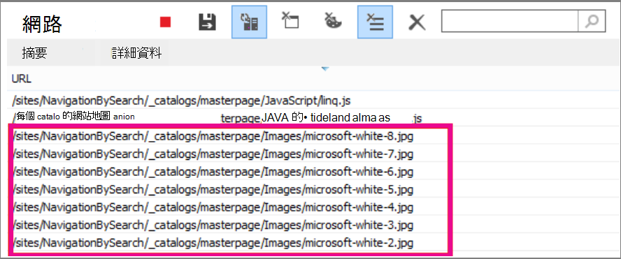

# <a name="delay-loading-images-and-javascript-in-sharepoint-online"></a>延遲載入 SharePoint Online 中的影像和 JavaScript

本文說明如何使用 JavaScript 延後載入影像，以及等候載入非必要的 JavaScript，直到載入頁面後，才能縮短 SharePoint 線上頁面的載入時間。
  
影像會對 SharePoint 線上的頁面載入速度產生負面影響。 根據預設，在載入 HTML 頁面時，大多數新式的 Internet 瀏覽器都會預先取得映射。 這可能會導致頁面在螢幕上看不到，直到使用者向裡滾時，才會在螢幕上顯示。 影像可以封鎖瀏覽器載入頁面的可見部分。 若要解決此問題，您可以使用 JavaScript 先略過載入影像。 此外，載入非必要的 JavaScript 也可以減慢 SharePoint 頁面上的下載時間。 本主題說明一些方法，可讓您在線上 SharePoint 中使用 JavaScript 來改善頁面載入時間。
  
## <a name="improve-page-load-times-by-delaying-image-loading-in-sharepoint-online-pages-by-using-javascript"></a>在 SharePoint 線上頁面上使用 JavaScript 延遲圖像載入，以提升頁面載入時間

您可以使用 JavaScript 以避免網頁瀏覽器預先提取圖像。 這會加快整體檔渲染的速度。 若要這麼做，您必須從標籤中移除 src 屬性的值 \ ，並將它取代為數據屬性中的檔案路徑，例如： data-src。 例如：
  
```html

```

使用此方法時，瀏覽器不會立即下載圖像。 如果此圖像已存在於視區中，JavaScript 會告訴瀏覽器從資料屬性中取得 URL，並將其插入 src 屬性值。 影像只會在使用者滾動時載入，而且會進入 view。
  
若要進行上述所有動作，您必須使用 JavaScript。
  
在文字檔中，定義 **isElementInViewport ( # B1 ** 函數，以檢查元素是否位於使用者可以看見的瀏覽器部分。
  
```javascript
function isElementInViewport(el) {
  if (!el)
    return false;
  var rect = el.getBoundingClientRect();
  return (
    rect.top >= 0 &amp;&amp;
    rect.left >= 0 &amp;&amp;
    rect.bottom <= (window.innerHeight || document.documentElement.clientHeight) &amp;&amp;
    rect.right <= (window.innerWidth || document.documentElement.clientWidth)
  );
}
```

接下來，在**loadItemsInView ( # B3**函數中使用**IsElementInViewport ( # B1** 。 **LoadItemsInView ( # B1**函數會載入具有資料 src 屬性值的所有影像（如果它們位於使用者可以看見的瀏覽器部分中）。 將下列函數新增至文字檔：
  
```javascript
function loadItemsInView() {
  //Select elements by the row id.
  $("#row [data-src]").each(function () {
      var isVisible = isElementInViewport(this);
      if (isVisible) {
          if ($(this).attr("src") == undefined) {
              $(this).attr("src", $(this).data("src"));
          }
      }
  });
}
```

最後，從 ** ( loadItemsInView ** 中 ( # B1 開始呼叫。 onscroll 如下列範例所示的 **# B3 ** 。 這可確保視區中的任何影像都會在使用者需要時載入，但不會在之前載入。 將下列專案新增至文字檔：
  
```javascript
//Example of calling loadItemsInView() from within window.onscroll()
$(window).on("scroll", function () {
    loadItemsInView();
});

```

針對 SharePoint 線上，您必須在 #s4 工作區標籤上的 scroll 事件中附加下列功能 \<div\> 。 這是因為會覆寫視窗事件，以確保功能區保持附加在頁面頂端。
  
```javascript
//Keep the ribbon at the top of the page
$('#s4-workspace').on("scroll", function () {
    loadItemsInView();
});
```

將文字檔儲存為副檔名為 .js 的 JavaScript 檔，例如 delayLoadImages.js。
  
delayLoadImages.js 寫入完畢後，您可以在 SharePoint 線上中將檔案的內容新增至主版頁面。 若要這麼做，您可以將腳本連結新增至主版頁面的頁首。 在主版頁面中，JavaScript 會套用至所有使用該主版頁面版面配置的 SharePoint Online 網站中的所有頁面。 或者，如果您只想在網站的一個頁面上使用此程式，請使用 [腳本編輯器網頁元件] 將 JavaScript 嵌入頁面中。 如需詳細資訊，請參閱以下主題：
  
- [操作方法：將主版頁面套用至 SharePoint 2013 的網站](https://go.microsoft.com/fwlink/p/?LinkId=525627)

- [操作方法：在 SharePoint 2013 中建立頁面配置](https://go.microsoft.com/fwlink/p/?LinkId=525628)

### <a name="example-referencing-the-javascript-delayloadimagesjs-file-from-a-master-page-in-sharepoint-online"></a>範例：從 SharePoint Online 中的主版頁面參考 JavaScript delayLoadImages.js 檔案
  
為了讓這種方式運作，您也需要在主版頁面中參照 jQuery。 在下列範例中，您可以在初始頁面載入時看到只載入一個影像，但是頁面上有其他數個。
  

  
下列螢幕擷取畫面顯示在其滾到 view 之後所下載的其餘影像。
  

  
延遲使用 JavaScript 的圖像載入可能是提升效能的有效技巧;不過，如果此技術是在公用網站上套用，則搜尋引擎無法編目影像，其方式與編目定期格式的圖像的方式相同。 這可能會影響搜尋引擎上的排名，因為頁面上的中繼資料在載入時並未真正存在。 搜尋引擎編目唯讀取 HTML，因此不會在頁面上看到影像做為內容。 圖像是用來在搜尋結果中排名頁面的因素之一。 若要解決此問題，一種方法是使用圖像的簡介文字。
  
## <a name="github-code-sample-injecting-javascript-to-improve-performance"></a>GitHub 程式碼範例：注入 JavaScript 以提升效能

在 GitHub 上所提供的 [JavaScript 注入](https://go.microsoft.com/fwlink/p/?LinkId=524759) 上，請勿錯過文章和程式碼範例。
  
## <a name="see-also"></a>請參閱

[Office 2013 和 Microsoft 365 應用程式中支援的瀏覽器](https://support.office.com/article/57342811-0dc4-4316-b773-20082ced8a82)
  
[操作方法：將主版頁面套用至 SharePoint 2013 的網站](https://go.microsoft.com/fwlink/p/?LinkId=525627)
  
[操作方法：在 SharePoint 2013 中建立頁面配置](https://go.microsoft.com/fwlink/p/?LinkId=525628)
