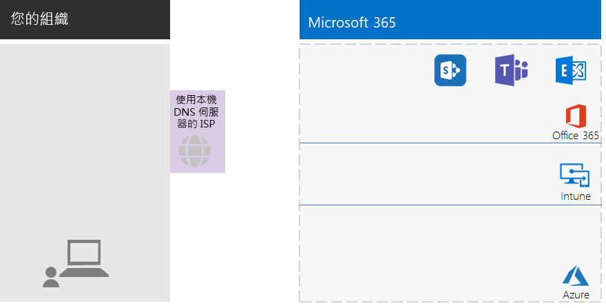
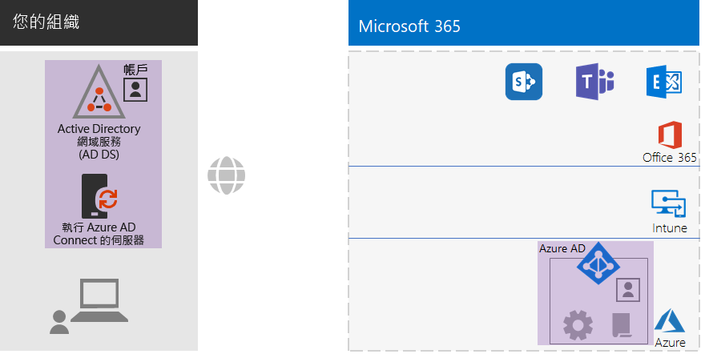
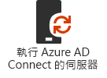
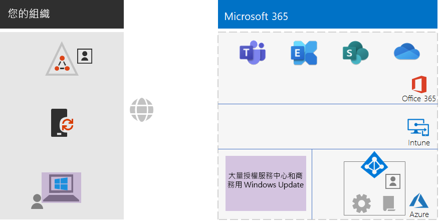
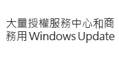
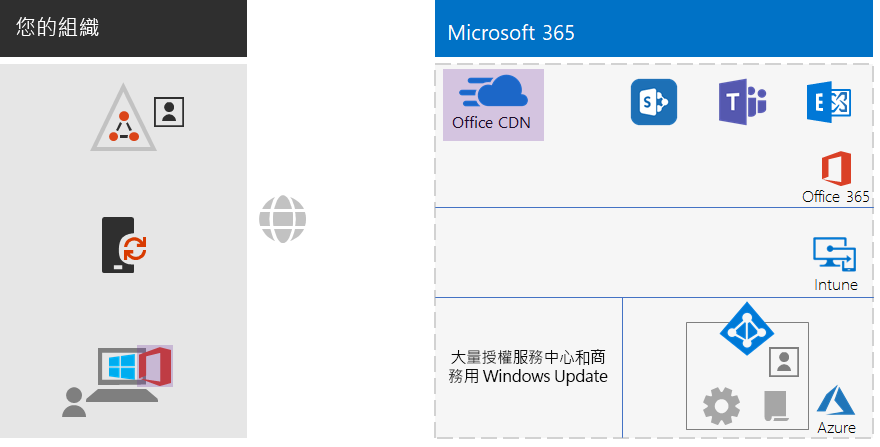
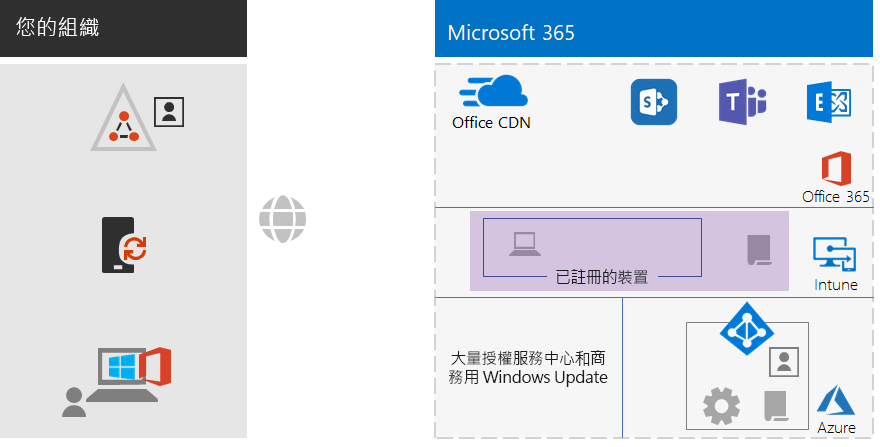
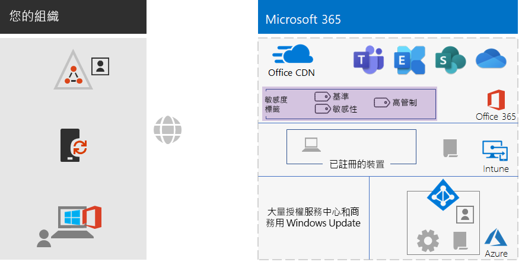
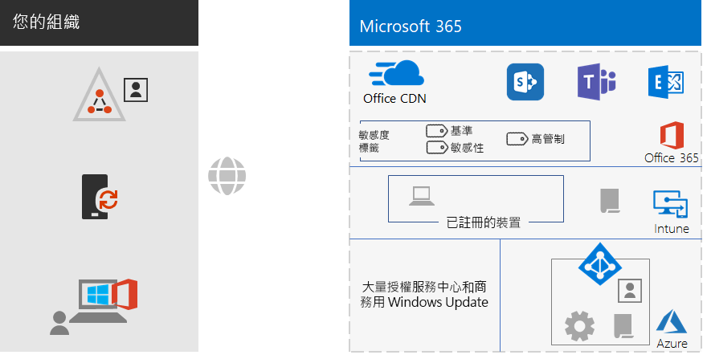

# 適用於非企業的 Microsoft 365 企業版底層基礎結構

非企業組織也可以部署 Microsoft 365 企業版，體驗經過整合而安全的基礎結構協助團隊合作並盡情發揮創意的商業價值。 非企業型態的組織通常有：

- 少量的內部部署 IT 基礎結構，例如電子郵件、檔案伺服器和 Active Directory Domain Services (AD DS) 網域，或者完全沒有。
- 少量的 IT 人員，其中大部分都是 IT 通才，而不是特定技術或工作負載 (例如網路或電子郵件) 的專家。

對於非企業型態的較小型組織，Microsoft 提供 [Microsoft 365 商務版](https://www.microsoft.com/microsoft-365/business)。 不過，有一些原因您可能需要 Microsoft 365 企業版，例如：

- 您的組織需要或即將需要 300 個以上的 Microsoft 365 授權，這也是 Microsoft 365 商務版的最大授權數目。
- 您的組織需要 Microsoft 365 商務版無法提供的進階生產力、語音、安全性和分析功能。

本文將逐步引導您以簡化的方式部署適用於非企業的 Microsoft 365 企業版底層基礎結構。

## 首先設定您的訂閱

您必須為您的訂閱設定網域名稱系統 (DNS) 網域。 如果您已經有 Office 365 訂閱，這應該已經完成。 如果沒有，請依照[新增網域至 Office 365](https://docs.microsoft.com/office365/admin/setup/add-domain?view=o365-worldwide) 中的指示。

接下來，您需要為 Microsoft 365 設定額外的安全性。 請依照[設定增強的安全性](https://docs.microsoft.com/office365/securitycompliance/tenant-wide-setup-for-increased-security)中的指示。

## 第 1 階段：網路

非企業組織在每間辦公室通常要有當地的網際網路連線，而且不要使用 proxy 伺服器、防火牆或封包檢查裝置。 每間辦公室的網際網路服務提供者 (ISP) 都要有當地的 DNS 伺服器，讓流量能夠導向到最接近您辦公室和內部部署使用者的 Microsoft 365 雲端伺服器。

因此，您只需要向您的 ISP 確認每間辦公室的連線：

- 使用當地的 DNS 伺服器。
- 當使用者開始使用更多 Microsoft 365 雲端服務時，能夠配合目前及未來的需求。

### 您目前的設定

以下是將第 1 階段項目醒目提示的視覺摘要。 **您的組織**可以有多間辦公室，每一間都能夠透過當地的網際網路連線，連線到使用當地 DNS 伺服器的 ISP。 透過 ISP，每間辦公室的使用者都可以連線到最接近的 Microsoft 網路位置，並且取得 Microsoft 365 訂閱的資源。

## 第 2 階段：身分識別

組織的每位員工都必須能夠登入，條件是在您的 Microsoft 365 企業版訂閱的 Azure Active Directory (Azure AD) 租用戶中必須要有使用者帳戶。 然後使用群組來包含使用者帳戶和其他群組來進行通訊，或取得授權資源 (例如 SharePoint Online 網站或小組) 的存取權。 

### 系統管理員帳戶

透過非常強的密碼與多重要素驗證 (MFA)，保護您的全域系統管理員使用者帳戶。 如需詳細資訊，請參閱[保護全域系統管理員帳戶](identity-designate-protect-admin-accounts.md#protect-global-administrator-accounts)。

如果您的組織需要高安全性而且擁有 Microsoft 365 企業版 E5，請使用 Azure AD Privileged Identity Management 啟用系統管理員即時存取。 如需詳細資訊，請參閱[設定隨選全域系統管理員](identity-designate-protect-admin-accounts.md#set-up-on-demand-global-administrators)。

### 群組的建議

如果您有內部部署 AD DS 網域，請在 Microsoft 365 企業版中繼續使用這些群組，如同 Azure AD 中的群組。

如果您沒有內部部署 AD DS 網域，請使用這些安全性層級在 Azure AD 中建立安全性群組。

| 安全性層級 | 描述 | 範例 |
|:-------|:-----|:-----|
| 基準 | 這是保護資料，以及保護存取資料的身分識別和裝置的最低和預設標準。    這通常是由大部分使用者管理的大部分組織資料。 | 第一線員工 (例如銷售、行銷、客戶服務、管理和製造) 的群組。 |
| 敏感性 | 這可以額外保護必須以超過基準層級保護的資料子集。 這些群組包含的使用者可以使用和建立特定部門的敏感性資料，以及並非每個人都能取得的專案敏感性資料。 | 正在開發新產品的產品團隊或行銷團隊 |
| 高管制 | 這是保護的最高層級，適用於高度機密、被視為是智慧財產或商業機密的少量資料，或必須遵守安全性規範的資料。 |  研究、法律和財務團隊。    儲存或使用客戶或合作夥伴資料的團隊。 |

### 混合式身分識別

如果您有內部部署 AD DS 網域，請在伺服器上使用密碼雜湊同步處理 (PHS) 設定 Azure AD Connect。 如需詳細資訊，請參閱[同步處理身分識別](identity-azure-ad-connect.md)。

### 條件式存取原則的使用者存取更安全

Azure AD 會評估使用者登入的條件，而且可以使用條件式存取原則來授與或拒絕存取，然後強制實行完成登入必須採取的進一步動作。 例如，如果 Azure AD 判斷登入是在中高風險的情況下發生，就可以要求使用者執行 MFA 才能完成登入。

您要將條件式存取原則套用到使用者帳戶或群組。 若要更容易指派條件式存取原則，請在組織中建立這些 Azure AD 安全性群組：

- BASELINE

  包含能夠存取基準資料的使用者的群組或使用者帳戶。

- SENSITIVE

  包含能夠存取敏感性資料的使用者的群組或使用者帳戶。

- HIGHLY-REGULATED

  包含能夠存取高管制資料的使用者的群組或使用者帳戶。

- COND-ACCESS-EXCLUDE

  這是一個空白群組，您可以用來暫時將某位使用者排除在條件式存取原則之外。

以下是要啟用或建立的 Azure AD 條件式存取原則清單。

| Azure AD 條件式存取原則 | 要套用的群組 |
|:------|:-----|
| 基準原則：管理員需要進行 MFA | 此原則會套用到管理員角色，因此不需要指定群組。 只需要啟用此原則。 必須建立並啟用所有後續的原則。 |
| 封鎖不支援新式驗證的用戶端 | 在原則設定中選取 [所有使用者]。 |
| 登入風險為中或高時需要 MFA (需要 Microsoft 365 企業版 E5) | BASELINE |
| 登入風險為低、中或高時需要 MFA (需要 Microsoft 365 企業版 E5) | SENSITIVE |
| 永遠需要 MFA | HIGHLY-REGULATED |
| 在 iOS 和 Android 裝置上必須是核准的應用程式 | BASELINE、SENSITIVE、HIGHLY-REGULATED |
| 需要相容的電腦 | BASELINE |
| 需要相容的電腦，以及 iOS 和 Android 裝置 | SENSITIVE、HIGHLY-REGULATED |
|||

以下是要建立和啟用的 Azure AD Identity Protection (需要 Microsoft 365 企業版 E5) 使用者風險原則。

| Azure AD Identity Protection 使用者風險原則 | 要套用的群組 |
|:------|:-----|
| 高風險使用者必須變更密碼 | 在原則設定中選取 [所有使用者]。 |
|||

如需指示，請參閱[一般身分識別與裝置存取原則](identity-access-policies.md)。

### 更容易管理的群組

以下是一些讓您能夠更輕鬆組成群組和管理授權的功能。

| 功能 | 用途 |
|:------|:-----|
| 自助式群組管理 | 允許由群組擁有者而不是 IT 人員管理 Azure AD 群組。 如需詳細資訊，請參閱[自助式群組管理](identity-self-service-group-management.md#allow-users-to-create-and-manage-their-own-groups)。 |
| 動態群組成員資格 | 根據使用者帳戶屬性 (例如部門或國家/地區) 來設定自動新增或移除 Azure AD 群組的使用者帳戶。 如需詳細資訊，請參閱[動態群組成員資格](identity-self-service-group-management.md#set-up-dynamic-group-membership)。 |
| 群組型授權 | 使用群組成員資格，可自動指派或取消指派授權給使用者帳戶。 如需詳細資訊，請參閱[群組型授權](identity-self-service-group-management.md#set-up-automatic-licensing)。 |
|  |  |

如果您使用群組型授權，請建立一個名為 LICENSED 的群組來包含已指派 Microsoft 365 企業版授權的使用者帳戶名稱。

### 監視使用者存取

如果您有 Microsoft 365 企業版 E5，就可以使用 Azure AD Identity Protection 來監視和分析使用者登入是否有認證洩露的問題。 如需詳細資訊，請參閱[防護認證洩露](identity-multi-factor-authentication.md#protect-against-credential-compromise)。

### 您目前的設定

以下是混合式身分識別在身分識別階段的視覺摘要 (將新項目醒目提示)。

 
新的和醒目提示的身分識別項目包括：
 
|||
|:------:|:-----|
|  | 有使用者帳戶和群組的內部部署 AD DS 網域。 |
|  | 執行 Azure AD Connect 的 Windows 伺服器。 |
|  | Azure AD 中已同步處理的 AD DS 帳戶和群組。 |
|  | 用於驗證、保護全域帳戶，以及更容易管理群組和授權的 Azure AD 設定。 |
|  | Azure AD 條件式存取原則。 |
|||

## 第 3 階段：Windows 10 企業版

若要確保您的 Windows 10 企業版裝置已整合到 Microsoft 365 的身分識別和安全性基礎結構，您的選項有：

- 僅雲端 (您沒有內部部署 AD DS 網域)

  將每個 Windows 10 企業版裝置加入訂閱的 Azure AD 租用戶。

  如需詳細資訊，請參閱[將您的工作裝置加入組織的網路](https://docs.microsoft.com/zh-TW/azure/active-directory/user-help/user-help-join-device-on-network)。

- 混合式 (您有內部部署 AD DS 網域)

  針對每個已加入 AD DS 網域的現有 Windows 10 企業版裝置，將它們加入 Azure AD 租用戶。 如需指示，請參閱[如何設定已加入混合式 Azure Active Directory 的裝置](https://go.microsoft.com/fwlink/p/?linkid=872870)。

  針對每個新的 Windows 10 企業版裝置，將它們加入您的 AD DS 網域，然後將它們加入 Azure AD 租用戶。

  針對每個 Windows 10 企業版裝置，註冊它們來進行行動裝置管理。 如需指示，請參閱[透過 Intune 使用群組原則來註冊 Windows 10 裝置](https://go.microsoft.com/fwlink/p/?linkid=872871)。

一旦安裝並加入，每個 Windows 10 企業版裝置都會自動安裝來自 Windows Update for Business 雲端服務的更新。 在非企業組織中通常不需要設定基礎結構，就能散發和安裝更新。

### 您目前的設定

以下是 Windows 10 企業版階段的視覺摘要 (將新項目醒目提示)。

 
新的和醒目提示的 Windows 10 企業版項目包括：

|||
|:------:|:-----|
|  | 在 Windows 裝置 (以內部部署膝上型電腦為例) 上安裝的 Windows 10 企業版。 |
|  | 大量授權服務中心 (提供 Windows 10 企業版新安裝的映像)，和 Windows Update for Business 服務 (提供最新的更新)。 |
|||

## 第4 階段：Office 365 專業增強版

Microsoft 365 企業版包含 Microsoft Office 的訂閱版本 Office 365 專業增強版。 Office 365 專業增強版與 Office 2016 或 Office 2019 一樣，直接安裝在用戶端裝置上。 不過 Office 365 專業增強版會定期收到新功能。 如需詳細資訊，請參閱[關於企業中的 Office 365 專業增強版](https://docs.microsoft.com/deployoffice/about-office-365-proplus-in-the-enterprise)。

如果是非企業組織，請在裝置上手動安裝 Office 365 專業增強版。 準備新裝置時，或者使用者在上線時都可以進行。

無論是哪一種情況，系統管理員或使用者都要在 https://portal.office.com 登入 Office 365 入口網站。 在 [Microsoft Office 首頁]**** 索引標籤上，按一下 [安裝 Office]****，然後逐步完成安裝程序。

安裝 Office 365 專業增強版的每部電腦，每個月都會下載功能更新。 在非企業組織中通常不需要設定基礎結構，就能散發 Office 365 專業增強版更新。 

### 您目前的設定

以下是 Office 365 專業增強版階段的視覺摘要 (將新項目醒目提示)。

 
新的和醒目提示的 Office 365 專業增強版項目包括：
 
|||
|:------:|:-----|
|  | 在裝置 (以內部部署膝上型電腦為例) 上安裝的 Office 365 專業增強版。 |
|  | Office 365 專業增強版的 Office 內容傳遞網路 (CDN)，讓裝置存取 Office 365 專業增強版更新。 |
|||

## 第 5 階段：行動裝置管理

Microsoft 365 企業版包括 Microsoft Intune，可管理行動裝置。 使用 Intune 可以管理 iOS、Android、macOS 和 Windows 等裝置，保護組織資源 (包括資料) 的存取。 Intune 與 Azure AD 的使用者、群組和電腦帳戶整合。

Intune 提供兩種類型的行動裝置管理：

- 行動裝置管理 (MDM) - 如果裝置已在 Intune 中註冊。 註冊之後，這些裝置就是受管理的裝置，可以接收組織所使用的原則、規則和設定。 這類裝置通常是您的組織所擁有，然後分發給您的員工。

- 擁有自己個人裝置的使用者可能不希望註冊裝置，或以您的原則和設定由 Intune 管理。 不過，您仍然必須保護組織的資源和資料。 在本案例中，您可以使用行動應用程式管理 (MAM) 保護應用程式。 這類裝置就是所謂的「攜帶您的裝置」(BYOD)，而且通常是您的員工所擁有。 

Intune 原則可以強制執行裝置合規性和應用程式保護。 以下是要建立的 Intune 原則清單。

| Intune 原則 | 要套用的群組 |
|:------|:-----|
| Windows 的裝置合規性原則 | BASELINE、SENSITIVE、HIGHLY-REGULATED |
| iOS 的裝置合規性原則 | SENSITIVE、HIGHLY-REGULATED |
| macOS 的裝置合規性 | SENSITIVE、HIGHLY-REGULATED |
| Android 和 Android Enterprise 的裝置合規性原則 | SENSITIVE、HIGHLY-REGULATED |
| iOS 的應用程式保護原則 | BASELINE、SENSITIVE、HIGHLY-REGULATED |
| macOS 的應用程式保護原則 | BASELINE、SENSITIVE、HIGHLY-REGULATED |
| Android 和 Android Enterprise 的應用程式保護原則 | BASELINE、SENSITIVE、HIGHLY-REGULATED |
|||
    
如需指示，請參閱[一般身分識別與裝置存取原則](identity-access-policies.md)。

### 您目前的設定

以下是行動裝置管理階段的視覺摘要 (將新項目醒目提示)。

 
新的和醒目提示的行動裝置管理項目包括：

|||
|:------:|:-----|
|  | 已在 Intune 中註冊的裝置，以執行 Windows 10 企業版的內部部署膝上型電腦為例。 |
|  | 用於裝置合規性和應用程式保護的 Intune 原則。 |
|||

## 第 6 階段：資訊保護

Microsoft 365 企業版有許多資訊保護功能，可讓您套用不同的控管、安全性和保護層級，以不同的方式處理資料的類別。 

例如，大多數員工之間的一般通信與他們處理的文件需要某種基準層級的保護。 財務記錄、客戶資料和智慧財產則需要較高層級的保護。

資訊保護策略的第一步是判斷保護的層級。 許多組織會使用條件式存取原則已經在使用的這些層級：

- 基準

  範例包括一般業務通訊 (電子郵件)，以及管理、銷售和客戶服務員工的檔案。

- 敏感性

  範例包括財務和法務資訊，以及新產品或新服務的研發資料。

- 高管制

  範例包括客戶和合作夥伴的個人識別資訊，以及組織的智慧財產。

根據這些資料安全性層級，下一步就要找出並實作：

- 自訂敏感性資訊類型

  Microsoft 365 提供各式各樣的敏感性資訊類型，例如健康情況服務與信用卡號碼。 如果您在 Microsoft 365 提供的清單中找不到需要的類型，可以自行建立。

- 保留標籤

  為了符合組織的原則和地區的法規，您可能必須指定應該將特定類型的文件或具有特定內容的文件保留多久。 您可以使用保留標籤，針對電子郵件和文件實作這個設定。

- 敏感度標籤

  您可以使用命名的敏感度標籤來標示電子郵件或文件，以便套用其他安全性層級。 範例包括浮水印、加密和權限，指定誰可以存取電子郵件或文件，以及這些人可以執行的動作。

如需詳細資訊，請參閱 [Microsoft 365 分類類型](infoprotect-configure-classification.md#microsoft-365-classification-types)。

如果您使用權限的敏感度標籤，可能需要建立額外的 Azure AD 安全性群組來定義誰可以對電子郵件和文件執行什麼動作。 

例如，您需要建立 RESEARCH 敏感度標籤來保護研究團隊的電子郵件和文件。 您決定某些研究人員必須能夠變更以 RESEARCH 敏感度標籤標示的文件，其他非研究人員的員工則只能檢視以 RESEARCH 敏感度標籤標示的文件。 這表示您必須建立和管理兩個額外的群組：

- RESEARCH-ALL
- RESEARCH-VIEW

這些群組和權限會變成 RESEARCH 敏感度標籤設定的一部分。

對於以群組型權限設定的敏感度標籤，您必須管理這些群組的成員資格。

### 您目前的設定

以下是資訊保護階段的視覺摘要 (將新項目醒目提示)。

 
新的和醒目提示的資訊保護項目包括：
 
|||
|:------:|:-----|
|  | 使用者可以套用至文件的三個安全性層級的敏感度標籤。 |
|||

不會顯示保留標籤和自訂資訊類型。

## 登入

您可以透過這個基礎結構，使用這些程序將 Microsoft 365 企業版的員工登入。

### 新的 Windows 10 企業版裝置

提供員工新的 Windows 10 企業版裝置之前：

- 對於僅雲端身分識別

  將裝置加入 Microsoft 365 企業版訂閱的 Azure AD 租用戶。

- 對於混合式身分識別

  將裝置加入您的 AD DS、將裝置加入您的 Azure AD 租用戶，然後在 Intune 中註冊裝置。

### 有 AD DS 使用者帳戶的現有員工

如果使用混合式身分識別，首次登入組織時，請將 AD DS 使用者帳戶新增至這些 Azure AD 群組：

- LICENSED
- 屬於 BASELINE、SENSITIVE 和 HIGHLY-REGULATED Azure AD 群組之成員的適當 AD DS 或 Azure AD 安全性群組
- 敏感度標籤群組 (如有需要)

現有的員工應該已經新增至適當的群組、部門及地區 AD DS 群組。

### 有僅雲端使用者帳戶的新進員工

如果使用僅雲端身分識別，首次登入組織時，請將新的使用者帳戶新增至這些群組：

- LICENSED
- 屬於 BASELINE、SENSITIVE 和 HIGHLY-REGULATED Azure AD 群組之成員的適當 Azure AD 安全性群組
- 工作群組、部門和地區群組
- 敏感度標籤群組 (如有需要)

### 首次登入 Microsoft 365

對於有 AD DS 使用者帳戶、第一次登入 Microsoft 365 的新進員工或現有員工，請指導他們：

1. 使用他們的使用者帳戶認證登入裝置。
2. 使用瀏覽器，登入 Office 365 入口網站 https://portal.office.com。
3. 從 [Office 365 首頁]**** 索引標籤，按一下 [安裝 Office]****，在裝置上安裝 Office 365 專業增強版。

## 最終結果

以下是為您的非企業組織設定 Microsoft 365 企業版底層基礎結構的結果。

### 基礎結構結果

組建和設定 Microsoft 365 企業版基礎結構之後，您應該會有：

- 每間辦公室都有當地的網際網路連線，並且由使用當地 DNS 伺服器的 ISP 提供足夠的頻寬。
- 對於混合式身分識別，在伺服器上執行的 Azure AD Connect 會與您的 Azure AD 租用戶同步處理您的內部部署 AD DS 網域。
- 下列群組：
  - LICENSED
  - COND-ACCESS-EXCLUDE
  - 也同樣屬於 BASELINE、SENSITIVE 和 HIGHLY-REGULATED Azure AD 群組之成員的適當 AD DS 或 Azure AD 安全性群組 
  - 工作群組、部門和地區群組
  - 敏感度標籤群組 (如有需要)
- 使用 BASELINE、SENSITIVE、HIGHLY-REGULATED 和 COND-ACCESS-EXCLUDE Azure AD 群組的 Azure AD 登入條件式存取原則。
- Intune 應用程式和裝置合規性原則。
- 自訂敏感性資訊類型 (如有需要)。
- 保留標籤 (如有需要)。
- 敏感度標籤 (如有需要)。

以下是組織使用混合式身分識別時的基礎結構視覺摘要，其中包含您的 AD DS 網域、Azure AD Connect 伺服器，以及已同步處理的 AD DS 使用者和群組。

 
以下是組織使用僅雲端身分識別時的基礎結構視覺摘要。
 

### 員工結果

每位員工登入之後應該會有：

- 從員工裝置到所在地區的 Microsoft 365 雲端服務，具有效能良好的內部部署網路路徑。
- 具有下列群組成員資格的使用帳戶：
   - LICENSED
   - 適當的 AD DS 或 Azure AD 安全性群組，也同樣屬於條件式存取原則的 BASELINE、SENSITIVE 和 HIGHLY-REGULATED Azure AD 群組的成員 
   - 適當的工作群組、部門和地區群組
   - 敏感度標籤群組 (如有需要)
- 具備下列條件的 Windows 10 企業版裝置：
   - 已加入 Azure AD 租用戶 (僅雲端) 或同時加入 Azure AD 租用戶與 AD DS 網域 (混合式)。
   - 使用最新的 Windows 10 企業版產品改良功能和安全性增強功能自動更新本身。
   - 已安裝 Office 365 專業增強版，它會使用最新的 Office 產品改良功能和安全性增強功能自動更新本身。
   - 已在 Intune 中註冊，而且遵守 Intune 裝置合規性原則和應用程式保護原則。

## 後續步驟

部署您的[工作負載和案例](deploy-workloads.md)，善加利用底層基礎結構的功能與設定。
