# 適用於非企業的 Microsoft 365 企業版底層基礎結構Microsoft 365 for enterprise foundation infrastructure for non-enterprises

非企業組織也可以部署 Microsoft 365 企業版，體驗經過整合而安全的基礎結構協助團隊合作並盡情發揮創意的商業價值。Non-enterprise organizations can also deploy Microsoft 365 for enterprise and realize the business value of an integrated and secure infrastructure that enables teamwork and unlocks creativity. 非企業型態的組織通常有：A non-enterprise typically has:

- 少量的內部部署 IT 基礎結構，例如電子郵件、檔案伺服器和 Active Directory Domain Services (AD DS) 網域，或者完全沒有。A small amount of on-premises IT infrastructure, such as email and file servers and an Active Directory Domain Services (AD DS) domain, or none at all.
- 少量的 IT 人員，其中大部分都是 IT 通才，而不是特定技術或工作負載 (例如網路或電子郵件) 的專家。A small IT staff, most of whom are IT generalists, rather than specialists in a specific technology or workload such as networking or email.

對於非企業型態的較小型組織，Microsoft 提供 [Microsoft 365 商務版](https://www.microsoft.com/microsoft-365/business)。For smaller, non-enterprise organizations, Microsoft offers [Microsoft 365 for business](https://www.microsoft.com/microsoft-365/business). 不過，有一些原因您可能需要 Microsoft 365 企業版，例如：However, there are reasons why you might need Microsoft 365 for enterprise, such as:

- 您的組織需要或即將需要 300 個以上的 Microsoft 365 授權，這也是 Microsoft 365 商務版的最大授權數目。Your organization needs more or will need more than 300 Microsoft 365 licenses, which is the maximum for Microsoft 365 for business.
- 您的組織需要 Microsoft 365 商務版無法提供的進階生產力、語音、安全性和分析功能。Your organization needs the advanced productivity, voice, security, and analytics capabilities that are not available with Microsoft 365 for business.

本文將逐步引導您以簡化的方式部署適用於非企業的 Microsoft 365 企業版底層基礎結構。This article steps you through a simplified deployment of the foundation infrastructure of Microsoft 365 for enterprise suitable for your non-enterprise.

## 首先設定您的訂閱First, set up your subscription

您必須為您的訂閱設定網域名稱系統 (DNS) 網域。You must set up the Domain Name System (DNS) domains for your subscription. 如果您已經有 Microsoft 365 訂閱，這應該已經完成。If you already have a Microsoft 365 subscription, this should have been done. 如果沒有，請依照[新增網域至 Office 365](https://docs.microsoft.com/office365/admin/setup/add-domain?view=o365-worldwide) 中的指示。If not, follow the instructions in [Add a domain to Office 365](https://docs.microsoft.com/office365/admin/setup/add-domain?view=o365-worldwide).

接下來，您需要為 Microsoft 365 設定額外的安全性。Next, you need to configure additional security for Microsoft 365. 請依照[設定增強的安全性](https://docs.microsoft.com/office365/securitycompliance/tenant-wide-setup-for-increased-security)中的指示。Follow the instructions in [Configure increased security](https://docs.microsoft.com/office365/securitycompliance/tenant-wide-setup-for-increased-security).

## 第 1 階段：網路Phase 1: Networking

非企業組織一般會在每個辦公室有區域網際網路連線，並且不使用 Proxy 伺服器、防火牆或封包檢查裝置。Non-enterprise organizations typically have local Internet connections in each office and do not use proxy servers, firewalls, or packet inspection devices. 為每個辦公室提供服務的網際網路服務提供者 (ISP) 都會有當地的 DNS 伺服器，使得流量能夠導向到最接近您辦公室和其內部部署使用者的 Microsoft 365 網路位置。The Internet service provider (ISP) serving each office has a regionally local DNS server so that traffic is directed to the Microsoft 365 network location that is closest to your offices and their on-premises users. 如需詳細資訊，請參閱[設定每個辦公室的當地網際網路連線](networking-dns-resolution-same-location.md)。For more information, see [Configure local Internet connections for each office](networking-dns-resolution-same-location.md).

因此，您只需要向您的 ISP 確認每個辦公室位置的連線：Therefore, you only need to verify with your ISP that the connection at each of your office locations:

- 使用當地的 DNS 伺服器。Uses a regionally local DNS server.
- 當使用者開始使用更多 Microsoft 365 雲端服務時，能夠配合目前及未來的需求。Is adequate for current and future needs as your users begin using more Microsoft 365 cloud services.

如果您使用 Proxy 伺服器、防火牆或封包檢查裝置，請參閱[設定流量旁路](networking-configure-proxies-firewalls.md)，了解如何最佳化 Microsoft 365 服務的效能。If you do use proxy servers, firewalls, or packet inspection devices, see [Configure traffic bypass](networking-configure-proxies-firewalls.md) for information on how to optimize performance to Microsoft 365 services.

### 您目前的設定Your configuration so far

以下是將第 1 階段項目醒目提示的視覺摘要。Here is a visual summary with the Phase 1 element highlighted. **您的組織**可以是多個辦公室，每個都有與使用地區的區域 DNS 伺服器的 ISP 的區域網際網路連線。**Your organization** can be multiple offices, each of which has a local Internet connection with an ISP that uses a regionally local DNS server. 透過 ISP，每個辦公室的使用者都可以連線到最接近的 Microsoft 365 網路位置，並且取得 Microsoft 365 訂閱的資源。Through the ISP, users in each office can reach the nearest Microsoft 365 network location and the resources of your Microsoft 365 subscription.

## 階段 2：身分識別Phase 2: Identity

組織的每位員工都必須能夠登入，條件是在您的 Microsoft 365 企業版訂閱的 Azure Active Directory (Azure AD) 租用戶中必須要有使用者帳戶。Each employee of your organization must be able to sign in, which requires a user account in the Azure Active Directory (Azure AD) tenant of your Microsoft 365 for enterprise subscription. 然後使用群組來包含使用者帳戶和其他群組來進行通訊，或取得授權資源 (例如 SharePoint Online 網站或小組) 的存取權。Groups are then used to contain user accounts and other groups to communicate or gain access to permissioned resources, such as a SharePoint Online site or a team. 

### 系統管理員帳戶Administrator accounts

透過強式密碼與多重要素驗證 (MFA)，保護您的全域系統管理員使用者帳戶。Protect your global administrator user accounts by requiring strong passwords and multi-factor authentication (MFA). 如需詳細資訊，請參閱[保護全域系統管理員帳戶](identity-create-protect-global-admins.md#protect-global-administrator-accounts)。See [Protect global administrator accounts](identity-create-protect-global-admins.md#protect-global-administrator-accounts) for more information.

如果您的組織需要高安全性而且擁有 Microsoft 365 E5，請使用 Azure AD Privileged Identity Management 啟用系統管理員即時存取。If your organization requires high security and you have Microsoft 365 E5, use Azure AD Privileged Identity Management to enable just-in-time administrator access. 如需詳細資訊，請參閱[設定隨選全域系統管理員](identity-create-protect-global-admins.md#identity-pim)。See [Set up on-demand global administrators](identity-create-protect-global-admins.md#identity-pim) for more information.

### 群組的建議Recommendations for groups

如果您有內部部署 AD DS 網域，請在 Microsoft 365 企業版中繼續使用這些群組，如同 Azure AD 中的群組。If you have an on-premises AD DS domain, continue to use those groups in Microsoft 365 for enterprise as groups in Azure AD.

如果您沒有內部部署 AD DS 網域，請使用這些安全性層級在 Azure AD 中建立安全性群組。If you don't have an on-premises AD DS domain, create security groups in Azure AD using these levels of security.

| 安全性層級Security level | 描述Description | 範例Examples |
|:-------|:-----|:-----|
| 基準Baseline | 這是保護資料，以及保護存取資料的身分識別和裝置的最低和預設標準。This is a minimum and default  standard for protecting data and the identities and devices that access your data.    這通常是由大部分使用者管理的大多數組織資料。This is typically most of your organization's data managed by most of your users. | 第一線員工 (例如銷售、行銷、客戶服務、管理和製造) 的群組。Groups for first line workers, such as sales, marketing, support, administration, and manufacturing. |
| 敏感性Sensitive | 這可以額外保護必須以超過基準層級保護的資料子集。This is additional protection for a subset of your data that must be protected beyond the baseline level. 這些群組包含的使用者可以使用和建立特定部門的敏感性資料，以及並非每個人都能取得的專案敏感性資料。These groups contain users that use and create sensitive data that is specific to departments and projects that are not meant to be available to everyone. | 正在開發新產品的產品團隊或行銷團隊Product or marketing teams that are developing future products |
| 高管制Highly regulated | 這是最高層級的保護，一般適用於高度機密、被視為智慧財產或商業機密的少量資料，或是必須遵守安全性規範的資料。This is the highest level of protection for a typically small amount of data that is highly classified, considered intellectual property or trade secrets, or data that must adhere to security regulations. |  研究、法律及財務團隊，或儲存或使用客戶或合作夥伴資料的團隊。Research, legal, and financial teams, or teams storing or using customer or partner data. |
||||

### 混合式身分識別Hybrid identity

如果您有內部部署 AD DS 網域，您需要與您的 Microsoft 365 企業版訂閱的 Azure AD 租用戶同步處理您的網域的這組使用者帳戶、群組和連絡人。If you have an on-premises AD DS domain, you need to synchronize the set of user accounts, groups, and contacts of your domain with the Azure AD tenant of your Microsoft 365 for enterprise subscription. 如果是非企業組織，請在具有密碼雜湊同步處理 (PHS) 的伺服器上設定 Azure AD Connect。For your non-enterprise, you configure Azure AD Connect on a server with password hash synchronization (PHS). 如需詳細資訊，請參閱[同步處理身分識別](identity-add-user-accounts.md#synchronize-identities-for-hybrid-identity)。See [Synchronize identities](identity-add-user-accounts.md#synchronize-identities-for-hybrid-identity) for more information.

### 條件式存取原則的使用者存取更安全More secure user access with Conditional Access policies

Azure AD 會評估使用者登入的條件，而且可以使用條件式存取原則來授與或拒絕存取，然後強制實行完成登入必須採取的進一步動作。Azure AD evaluates the conditions of user sign-ins and can use Conditional Access policies to grant or deny access and impose further actions that must be taken to complete the sign-in. 例如，如果 Azure AD 判斷登入是在中高風險的情況下發生，就可以要求使用者執行 MFA 才能完成登入。For example, if Azure AD determines that the sign-in is happening under medium or high-risk conditions, it can require the user to perform MFA to complete the sign-in.

您要將條件式存取原則套用到使用者帳戶或群組。You apply Conditional Access policies to user accounts or groups. 若要更容易指派條件式存取原則，請在組織中建立這些 Azure AD 安全性群組：To facilitate an easier assignment of Conditional Access policies, create these Azure AD security groups in your organization:

- BASELINEBASELINE

  包含能夠存取基準資料的使用者的群組或使用者帳戶。Contains the groups or user accounts for users with access to baseline data.

- SENSITIVESENSITIVE

  包含能夠存取敏感性資料的使用者的群組或使用者帳戶。Contains the groups or user accounts for users with access to sensitive data.

- HIGHLY-REGULATEDHIGHLY-REGULATED

  包含能夠存取高管制資料的使用者的群組或使用者帳戶。Contains the groups or user accounts for users with access to highly regulated data.

- COND-ACCESS-EXCLUDECOND-ACCESS-EXCLUDE

  這是一個空白群組，您可以用來暫時將某位使用者排除在條件式存取原則之外。An empty group that you can use to temporarily exclude a user from Conditional Access policies.

以下是要啟用或建立的 Azure AD 條件式存取原則清單。Here is the list of Azure AD Conditional Access policies to enable or create.

| Azure AD 條件式存取原則Azure AD Conditional Access policy | 要套用的群組Groups to which it applies |
|:------|:-----|
| 基準原則：管理員需要進行 MFABaseline policy: Require MFA for admins | 此原則會套用到管理員角色，因此不需要指定群組。This policy applies to admin roles, so no groups need to be specified. 只需要啟用此原則。This policy just needs to be enabled. 必須建立並啟用所有後續的原則。All subsequent policies need to be created and enabled. |
| 封鎖不支援新式驗證的用戶端Block clients that don't support modern authentication | 在原則設定中選取 [所有使用者]。Select "All users" in the policy settings. |
| 登入風險為中或高時需要 MFA (需要 Microsoft 365 E5)Require MFA when sign-in risk is medium or high (requires Microsoft 365 E5) | BASELINEBASELINE |
| 登入風險為低、中或高時需要 MFA (需要 Microsoft 365 E5)Require MFA when sign-in risk is low, medium, or high (requires Microsoft 365 E5) | SENSITIVESENSITIVE |
| 永遠需要 MFAAlways require MFA | HIGHLY-REGULATEDHIGHLY-REGULATED |
| 在 iOS 和 Android 裝置上必須是核准的應用程式Require approved apps on iOS and Android devices | BASELINE、SENSITIVE、HIGHLY-REGULATEDBASELINE, SENSITIVE, HIGHLY-REGULATED |
| 需要相容的電腦Require compliant PCs | BASELINEBASELINE |
| 需要相容的電腦，以及 iOS 和 Android 裝置Require compliant PCs and iOS and Android devices | SENSITIVE、HIGHLY-REGULATEDSENSITIVE, HIGHLY-REGULATED |
|||

以下是要建立和啟用的 Azure AD Identity Protection (需要 Microsoft 365 E5) 使用者風險原則。Here is the Azure AD Identity Protection (requires Microsoft 365 E5) user risk policy to create and enable.

| Azure AD Identity Protection 使用者風險原則Azure AD Identity Protection user risk policy | 要套用的群組Groups to which it applies |
|:------|:-----|
| 高風險使用者必須變更密碼High risk users must change passwords | 在原則設定中選取 [所有使用者]。Select "All users" in the policy settings. |
|||

如需指示，請參閱[一般身分識別與裝置存取原則](identity-access-policies.md)。See [Common identity and device access policies](identity-access-policies.md) for the instructions.

### 更容易管理的群組Groups for easier management

以下是一些讓您能夠更輕鬆組成群組和管理授權的功能。Here are some features that can make group and licensing management easier for you.

| 功能Feature | 用途Use |
|:------|:-----|
| 自助式群組管理Self-service group management | 允許由群組擁有者而不是 IT 人員管理 Azure AD 群組。Allow management of Azure AD groups by group owners instead of IT staff. 如需詳細資訊，請參閱[自助式群組管理](identity-use-group-management.md#allow-users-to-create-and-manage-their-own-groups)。See [Self-service group management](identity-use-group-management.md#allow-users-to-create-and-manage-their-own-groups) for more information. |
| 動態群組成員資格Dynamic group membership | 根據使用者帳戶屬性 (例如部門或國家/地區) 來設定自動新增或移除 Azure AD 群組的使用者帳戶。Configure automatic addition or removal of user accounts from Azure AD groups based on user account attributes, such as Department or Country. 如需詳細資訊，請參閱[動態群組成員資格](identity-use-group-management.md#set-up-dynamic-group-membership)。See [Dynamic group membership](identity-use-group-management.md#set-up-dynamic-group-membership) for more information. |
| 群組型授權Group-based licensing | 使用群組成員資格，可自動指派或取消指派授權給使用者帳戶。Use group membership to automatically assign or unassign licenses to user accounts. 如需詳細資訊，請參閱[群組型授權](identity-use-group-management.md#set-up-automatic-licensing)。See [Group-based licensing](identity-use-group-management.md#set-up-automatic-licensing) for more information. |
|  |  |

如果您使用群組型授權，請建立一個名為 LICENSED 的群組來包含已指派 Microsoft 365 企業版授權的使用者帳戶名稱。If you are using group-based licensing, create a group named LICENSED to contain user account names that are assigned a Microsoft 365 for enterprise license.

### 監視使用者存取Monitor user access

如果您有 Microsoft 365 E5，就可以使用 Azure AD Identity Protection 來監視和分析使用者登入是否有認證洩露的問題。If you have Microsoft 365 E5, you can use Azure AD Identity Protection to monitor and analyze user sign-ins for credential compromise. 如需詳細資訊，請參閱[防護認證洩露](identity-secure-user-sign-ins.md#protect-against-credential-compromise)。See [Protect against credential compromise](identity-secure-user-sign-ins.md#protect-against-credential-compromise) for more information.

### 您目前的設定Your configuration so far

以下是混合式身分識別在身分識別階段的視覺摘要，其中現有元素和新元素已加上醒目提示。Here is a visual summary of the Identity phase for hybrid identity, with existing and new elements highlighted.

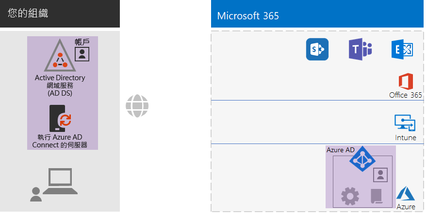
 
全新和醒目提示的混合式身分識別元素包括：The new and highlighted hybrid identity elements include:
 
|||
|:------:|:-----|
| 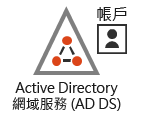 | 具有使用者帳戶和群組的內部部署 AD DS 網域。An on-premises AD DS domain with user accounts and groups. |
| 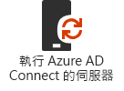 | 執行 Azure AD Connect 的 Windows 伺服器。A Windows-based server running Azure AD Connect. |
|  | Azure AD 中已同步處理的 AD DS 使用者帳戶和群組。The synchronized set of AD DS user accounts and groups in Azure AD. |
|  | 用於驗證、保護全域帳戶，以及更容易管理群組和授權的 Azure AD 設定。Azure AD settings for authentication, securing global accounts, and making it easier to manage groups and licenses. |
|  | Azure AD 條件式存取原則。Azure AD Conditional Access policies. |
|||

以下是僅雲端身分識別在身分識別階段的視覺摘要，其中的新元素已加上醒目提示。Here is a visual summary of the Identity phase for cloud-only identity, with the new elements highlighted.

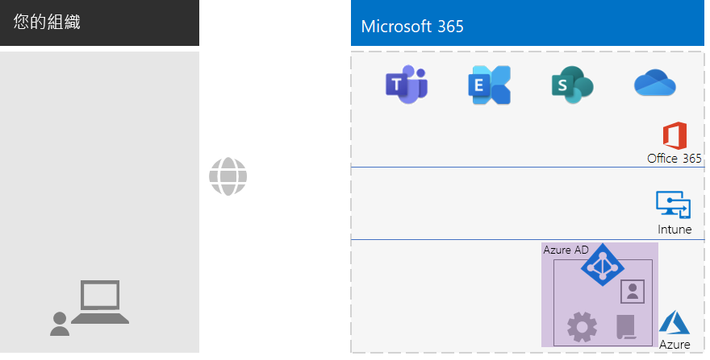
 
全新和醒目提示的僅雲端身分識別元素包括：The new and highlighted cloud-only identity elements include:
 
|||
|:------:|:-----|
|  | Azure AD 中的使用者帳戶和群組。The user accounts and groups in Azure AD. |
|  | 用於驗證、保護全域帳戶，以及更容易管理群組和授權的 Azure AD 設定。Azure AD settings for authentication, securing global accounts, and making it easier to manage groups and licenses. |
|  | Azure AD 條件式存取原則。Azure AD Conditional Access policies. |
|||

## 階段 3：Windows 10 企業版Phase 3: Windows 10 Enterprise

若要確保您的 Windows 10 企業版裝置已整合到 Microsoft 365 企業版的身分識別和安全性基礎結構，您的選項有：To ensure that your Windows 10 Enterprise devices are integrated into the identity and security infrastructure of Microsoft 365 for enterprise, here are your options:

- 混合式 (您有內部部署 AD DS 網域)Hybrid (you have an on-premises AD DS domain)

  針對每個已加入 AD DS 網域的現有 Windows 10 企業版裝置，將它們加入 Azure AD 租用戶。For each existing Windows 10 Enterprise device already joined to your AD DS domain, join them to the Azure AD tenant. 如需指示，請參閱[如何設定已加入混合式 Azure Active Directory 的裝置](https://go.microsoft.com/fwlink/p/?linkid=872870)。See [How to configure hybrid Azure Active Directory joined devices](https://go.microsoft.com/fwlink/p/?linkid=872870) for the instructions.

  針對每個新的 Windows 10 企業版裝置，將它們加入您的 AD DS 網域，然後將它們加入 Azure AD 租用戶。For each new Windows 10 Enterprise device, join them to your AD DS domain, and then join them to the Azure AD tenant.

  針對每個 Windows 10 企業版裝置，註冊它們來進行行動裝置管理。For each Windows 10 Enterprise device, enroll them for mobile device management. 如需指示，請參閱[使用群組原則透過 Intune 註冊 Windows 10 裝置](https://go.microsoft.com/fwlink/p/?linkid=872871)。See [Enroll a Windows 10 device with Intune by using a Group Policy](https://go.microsoft.com/fwlink/p/?linkid=872871) for the instructions.

- 僅雲端 (您沒有內部部署 AD DS 網域)Cloud-only (you do not have an on-premises AD DS domain)

  將每個 Windows 10 企業版裝置加入訂閱的 Azure AD 租用戶。Join each Windows 10 Enterprise device to the Azure AD tenant of your subscription.

  如需詳細資訊，請參閱[將您的工作裝置加入組織的網路](https://docs.microsoft.com/azure/active-directory/user-help/user-help-join-device-on-network)。See [Join your work device to your organization's network](https://docs.microsoft.com/azure/active-directory/user-help/user-help-join-device-on-network) for more information.

一旦安裝並加入，每個 Windows 10 企業版裝置都會自動安裝來自商務用 Windows Update 雲端服務的更新。Once installed and joined, each Windows 10 Enterprise device automatically installs updates from the Windows Update for Business cloud service. 在非企業組織中通常不需要設定基礎結構，就能散發和安裝 Windows 10 更新。There is typically no need in a non-enterprise organization to set up an infrastructure to distribute and install Windows 10 updates.

### 您目前的設定Your configuration so far

以下是 Windows 10 企業版階段的視覺摘要 (將新項目醒目提示)。Here is a visual summary of the Windows 10 Enterprise phase with the new elements highlighted.

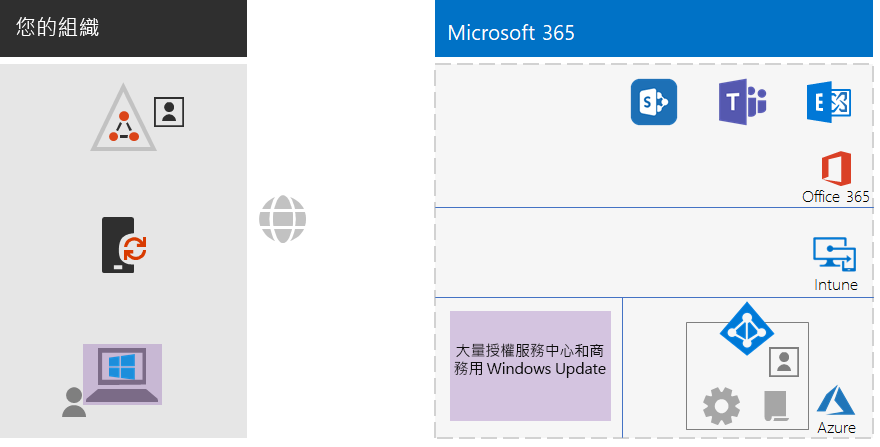
 
全新和醒目提示的 Windows 10 企業版元素包括：The new and highlighted Windows 10 Enterprise elements include:

|||
|:------:|:-----|
|  | Windows 10 企業版安裝在 Windows 裝置上，以內部部署膝上型電腦為例。Windows 10 Enterprise installed on Windows devices, with an on-premises laptop as an example. |
| 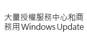 | 大量授權服務中心 (提供 Windows 10 企業版新安裝的映像)，以及商務用 Windows Update 服務 (提供最新的更新)。The Volume Licensing Service Center, which provides images for new installations of Windows 10 Enterprise, and the Windows Update for Business service, which provides the latest updates. |
|||

## 階段 4：Microsoft 365 Apps 企業版Phase 4: Microsoft 365 Apps for enterprise

Microsoft 365 企業版包括 Microsoft Office 的訂閱版本 Microsoft 365 Apps 企業版。Microsoft 365 for enterprise includes Microsoft 365 Apps for enterprise, the subscription version of Microsoft Office. Microsoft 365 Apps 企業版與 Office 2016 或 Office 2019 一樣，直接安裝在用戶端裝置上。Like Office 2016 or Office 2019, Microsoft 365 Apps for enterprise is installed directly on your client devices. 不過，Microsoft 365 Apps 企業版可定期獲得包含新功能的更新。However, Microsoft 365 Apps for enterprise receives updates that include new features on a regular basis. 如需詳細資訊，請參閱[關於 Microsoft 365 應用程式企業版](https://docs.microsoft.com/deployoffice/about-microsoft-365-apps)。See [About Microsoft 365 Apps for enterprise](https://docs.microsoft.com/deployoffice/about-microsoft-365-apps) for more information.

如果是非企業組織，請在裝置 (可以是 Windows、iOS 或 Android 裝置) 上手動安裝 Microsoft 365 Apps 企業版。For your non-enterprise organization, you manually install Microsoft 365 Apps for enterprise on devices, which can include Windows, iOS, and Android devices. 此動作可以在準備要使用的新裝置時完成，或者由使用者在上線程序時完成。This can be done as part of preparing a new device for use, or by the user as part of their onboarding process.

無論是哪一種情況，系統管理員或使用者都要在 https://portal.office.com 登入 Office 365 入口網站。In either case, the administrator or the user signs in to the Office 365 portal at https://portal.office.com. 在 [Microsoft Office 首頁]\*\*\*\* 索引標籤上，按一下 [安裝 Office]\*\*\*\*，然後逐步完成安裝程序。On the **Microsoft Office Home** tab, click **Install Office** and step through the installation process.

安裝 Microsoft 365 Apps 企業版的每部電腦，每個月都會下載功能更新。Feature updates to Microsoft 365 Apps for enterprise are downloaded monthly by each computer on which it is installed. 在非企業組織中通常不需要設定基礎結構，就能散發 Microsoft 365 Apps 企業版更新。There is typically no need in a non-enterprise organization to set up an infrastructure to distribute Microsoft 365 Apps for enterprise updates. 

### 您目前的設定Your configuration so far

以下是 Microsoft 365 Apps 企業版階段的視覺摘要 (將新項目醒目提示)。Here is a visual summary of the Microsoft 365 Apps for enterprise phase with the new elements highlighted.

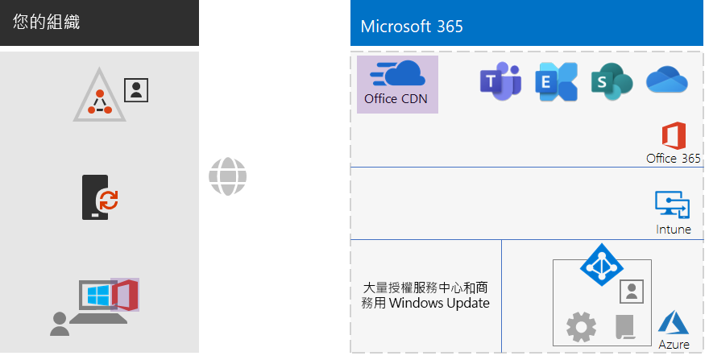
 
全新和醒目提示的 Microsoft 365 Apps 企業版元素包括：The new and highlighted Microsoft 365 Apps for enterprise elements include:
 
|||
|:------:|:-----|
|  | Microsoft 365 Apps 企業版安裝在 Windows 裝置上，以內部部署膝上型電腦為例。Microsoft 365 Apps for enterprise installed on devices, with an on-premises laptop as an example. |
|  | Microsoft 365 Apps 企業版適用的 Office 內容傳遞網路 (CDN)，可讓裝置存取 Microsoft 365 Apps 企業版更新。The Office Content Delivery Network (CDN) for Microsoft 365 Apps for enterprise, which devices access for Microsoft 365 Apps for enterprise updates. |
|||

## 階段 5：行動裝置管理Phase 5: Mobile device management

Microsoft 365 企業版包括 Microsoft Intune 用於行動裝置管理。Microsoft 365 for enterprise includes Microsoft Intune for mobile device management. 您可以使用 Intune 來管理 Windows、iOS、Android 和 macOS 裝置，以保護對組織資源的存取，包括資料。With Intune, you can manage Windows, iOS, Android, and macOS devices to protect access to your organization's resources, including your data. Intune 使用 Azure AD 的使用者、群組和電腦帳戶。Intune uses the user, group, and computer accounts of Azure AD.

Intune 提供兩種類型的行動裝置管理：Intune provides two types of mobile device management:

- 行動裝置管理 (MDM) - 如果裝置已在 Intune 中註冊。Mobile device management (MDM) is when devices get enrolled in Intune. 註冊之後，這些裝置就是受管理的裝置，可以接收組織所使用的原則、規則和設定。Once enrolled, they are managed devices and can receive the policies, rules, and settings used by your organization. 這類裝置通常是您的組織所擁有，然後分發給您的員工。These types of devices are typically owned by your organization and issued to your employees.

- 擁有自己個人裝置的使用者可能不希望註冊裝置，或以您的原則和設定由 Intune 管理。Users with their own personal devices may not want to enroll their devices or be managed by Intune with your policies and settings. 不過，您仍然必須保護組織的資源和資料。However, you still need to protect your organization's resources and data. 針對此案例，您可以使用行動應用程式管理 (MAM) 來保護應用程式。For this scenario, you can protect your apps with mobile application management (MAM).  

Intune 原則可以強制執行裝置合規性和應用程式保護。Intune policies can enforce device compliance and app protection. 以下是要建立的 Intune 原則清單。Here is the list of Intune policies to create.

| Intune 原則Intune policies | 要套用的群組Groups to which it applies |
|:------|:-----|
| Windows 的裝置合規性原則Device compliance policy for Windows | BASELINE、SENSITIVE、HIGHLY-REGULATEDBASELINE, SENSITIVE, HIGHLY-REGULATED |
| iOS 的裝置合規性原則Device compliance policy for iOS | SENSITIVE、HIGHLY-REGULATEDSENSITIVE, HIGHLY-REGULATED |
| macOS 的裝置合規性Device compliance for macOS | SENSITIVE、HIGHLY-REGULATEDSENSITIVE, HIGHLY-REGULATED |
| Android 和 Android Enterprise 的裝置合規性原則Device compliance policy for Android and Android Enterprise | SENSITIVE、HIGHLY-REGULATEDSENSITIVE, HIGHLY-REGULATED |
| iOS 的應用程式保護原則App protection policy for iOS | BASELINE、SENSITIVE、HIGHLY-REGULATEDBASELINE, SENSITIVE, HIGHLY-REGULATED |
| macOS 的應用程式保護原則App protection policy for macOS | BASELINE、SENSITIVE、HIGHLY-REGULATEDBASELINE, SENSITIVE, HIGHLY-REGULATED |
| Android 和 Android Enterprise 的應用程式保護原則App protection policy for Android and Android Enterprise | BASELINE、SENSITIVE、HIGHLY-REGULATEDBASELINE, SENSITIVE, HIGHLY-REGULATED |
|||
    
如需指示，請參閱[一般身分識別與裝置存取原則](identity-access-policies.md)。See [Common identity and device access policies](identity-access-policies.md) for the instructions.

### 您目前的設定Your configuration so far

以下是行動裝置管理階段的視覺摘要 (將新項目醒目提示)。Here is a visual summary of the Mobile Device Management phase with the new elements highlighted.

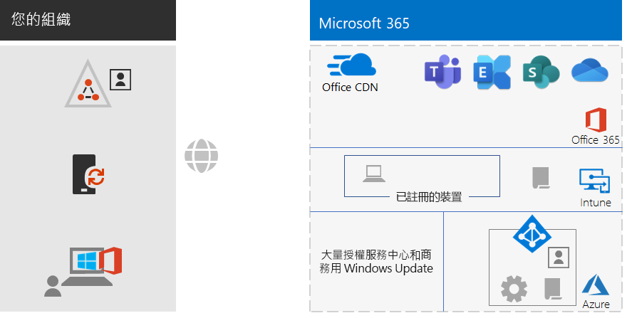
 
全新和醒目提示的行動裝置管理元素包括：The new and highlighted mobile device management elements include:

|||
|:------:|:-----|
|  | 裝置已在 Intune 中註冊，顯示執行 Windows 10 企業版的內部部署膝上型電腦為例。Devices that are enrolled in Intune, showing an on-premises laptop running Windows 10 Enterprise as an example. |
|  | 用於裝置合規性和應用程式保護的 Intune 原則。Intune policies for device compliance and app protection. |
|||

## 階段 6：資訊保護Phase 6: Information protection

Microsoft 365 企業版有許多資訊保護功能，可讓您套用不同的控管、安全性和保護層級，以不同的方式處理資料的分類。Microsoft 365 for enterprise has a host of information protection features that allow you to treat classifications of data differently by applying different levels of governance, security, and protection. 

例如，大多數員工之間的一般通信與他們處理的文件需要某種基準層級的保護。For example, normal correspondence between most employees and the documents on which they work need a certain baseline level of protection. 財務記錄、客戶資料和智慧財產則需要較高層級的保護。Financial records, customer data, and your intellectual property need a higher level of protection.

資訊保護策略的第一步是判斷保護的層級。The first step to an information protection strategy is to determine the levels of protection. 許多組織會使用條件式存取原則已經在使用的這些層級：Many organizations use these levels, which are already being used for Conditional Access policies:

- 基準Baseline

  範例包括一般業務通訊 (電子郵件)，以及管理、銷售和客戶服務員工的檔案。Examples include normal business communications (email) and files for administrative, sales, and support workers.

- 敏感性Sensitive

  範例包括財務和法務資訊，以及新產品或新服務的研發資料。Examples include financial and legal information and research and development data for new products or services.

- 高管制Highly regulated

  範例包括客戶和合作夥伴的個人識別資訊，以及組織的策略方案或智慧財產。Examples include customer and partner personally identifiable information and your organization's strategic plans or intellectual property.

根據這些資料安全性層級，下一步就要找出並實作：Based on these levels of data security, the next step is to identify and implement:

- 自訂敏感性資訊類型Custom sensitive information types

  Microsoft 365 提供各式各樣的敏感性資訊類型，例如健康情況服務與信用卡號碼。Microsoft 365 supplies a wide selection of sensitive information types, such as health service and credit card numbers. 如果您在提供的清單中找不到需要的類型，可以自行建立。If you do not find one that you need in the supplied list, you can create your own.

- 保留標籤Retention labels

  為了符合組織的原則和地區的法規，您可能必須指定應該將特定類型的文件或具有特定內容的文件保留多久。To comply with organization policies and regional regulations, you might have to specify how long specific types of documents or documents with specific contents should be retained. 您可以使用保留標籤，針對電子郵件和文件實作這個設定。You can implement this for email and documents using retention labels. 保留標籤也可搭配資料外洩防護 (DLP) 原則使用，此原則可限制在組織外部共用檔案或電子郵件。Retention labels can also be used in conjunction with Data Loss Prevention (DLP) policies that can restrict the sharing of files or email outside your organization.

- 敏感度標籤Sensitivity labels

  您可以使用命名的敏感度標籤來標示電子郵件或文件，以便套用其他安全性層級。You can label email or documents with a named sensitivity label so that additional levels of security can be applied. 範例包括浮水印、加密和權限，指定誰可以存取電子郵件或文件，以及這些人可以執行的動作。Examples are watermarks, encryption, and permissions, which specify who is allowed to access the email or document and what they are allowed to do.

如需詳細資訊，請參閱 [Microsoft 365 分類類型](infoprotect-configure-classification.md#microsoft-365-classification-types)。See [Microsoft 365 classification types](infoprotect-configure-classification.md#microsoft-365-classification-types) for more information.

如果您使用權限的敏感度標籤，可能需要建立額外的安全性群組來定義誰可以對套用敏感度標籤的電子郵件和文件執行什麼動作。If you use sensitivity labels with permissions, you might have to create additional security groups to define who is allowed to do what with email and documents that have the sensitivity label applied. 

例如，您需要建立 RESEARCH 敏感度標籤來保護研究團隊的電子郵件和文件。For example, you need to create a RESEARCH sensitivity label to protect the email and documents of your research team. 您可以決定：You determine that:

- 研究人員必須能夠變更使用 RESEARCH 敏感度標籤標示的文件。Researchers must have the ability to change documents marked with the RESEARCH sensitivity label.
- 非研究員工只需要能夠檢視使用 RESEARCH 敏感度標籤標示的文件。Non-research employees only need to have the ability to view documents marked with the RESEARCH sensitivity label. 

這表示您必須建立和管理兩個額外的 Microsoft 365 群組：This means you need to create and manage two additional Microsoft 365 groups:

- RESEARCH-ALLRESEARCH-ALL
- RESEARCH-VIEWRESEARCH-VIEW

這些群組和權限會變成 RESEARCH 敏感度標籤設定的一部分。These groups and their permissions become part of the RESEARCH sensitivity label's configuration.

對於以群組型權限設定的敏感度標籤，您必須管理這些群組的成員資格。For sensitivity labels configured with group-based permissions, you must manage the membership of these groups.

### 您目前的設定Your configuration so far

以下是資訊保護階段的視覺摘要 (將新項目醒目提示)。Here is a visual summary of the Information Protection phase with the new elements highlighted.

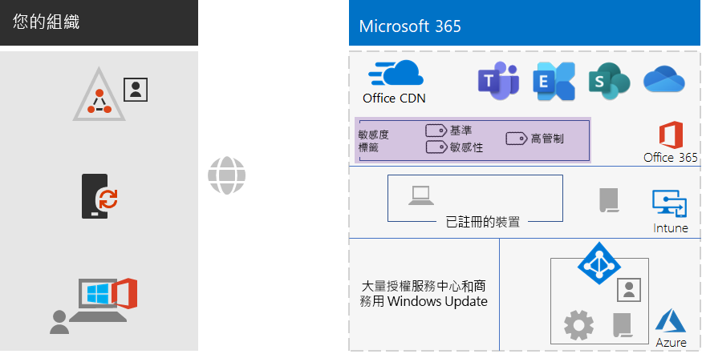
 
新的和醒目提示的資訊保護項目包括：The new and highlighted information protection elements include:
 
|||
|:------:|:-----|
|  | 使用者可以套用至文件和電子郵件的三個安全性層級的敏感度標籤。Sensitivity labels for the three levels of security that users can apply to documents and email. |
|||

不會顯示自訂資訊類型和保留標籤。Custom information types and retention labels are not shown.

## 上線Onboarding

利用您的既有 Microsoft 365 企業版基礎結構，您可以輕鬆地讓您的員工上線。With your Microsoft 365 for enterprise infrastructure in place, you can easily onboard your employees.

### 新的 Windows 10 企業版裝置A new Windows 10 Enterprise device

提供員工新的 Windows 10 企業版裝置之前：Before giving an employee a new Windows 10 Enterprise device:

- 對於混合式身分識別For hybrid identity

  將裝置加入您的 AD DS 網域、將裝置加入您的 Azure AD 租用戶，然後在 Intune 中註冊裝置。Join the device to your AD DS domain, join the device to your Azure AD tenant, and then enroll the device in Intune.

- 對於僅雲端身分識別For cloud-only identity

  將裝置加入您的 Azure AD 租用戶。Join the device to your Azure AD tenant.

### 具有 AD DS 使用者帳戶的現有員工Existing employee with an AD DS user account

如果使用混合式身分識別，首次登入組織時，請將 AD DS 使用者帳戶新增至這些 Azure AD 群組：As part of the initial onboarding for your organization when using hybrid identity, add the AD DS user account to these Azure AD groups:

- LICENSEDLICENSED
- 屬於 BASELINE、SENSITIVE 和 HIGHLY-REGULATED Azure AD 群組之成員的適當 AD DS 或 Azure AD 安全性群組The appropriate AD DS or Azure AD security groups that are members of the BASELINE, SENSITIVE, and HIGHLY-REGULATED Azure AD groups
- 敏感度標籤群組 (如有需要)Sensitivity label groups (as needed)

應該已將現有員工新增至適當的工作群組、部門及地區 AD DS 群組。The existing employee should already be added to the appropriate workgroup, departmental, and regional AD DS groups.

您可以將使用者帳戶新增到 Microsoft 365 系統管理中心的多個 Azure AD 群組。You can add a user account to multiple Azure AD groups in the Microsoft 365 admin center. 從使用者帳戶的內容，按一下 [管理群組] > [新增成員資格]\*\*\*\*。From the properties of the user account, click **Manage groups > Add memberships**.

如果您想要使用 PowerShell，請查看這個[可下載的 Excel 活頁簿](https://github.com/MicrosoftDocs/microsoft-365-docs/raw/public/microsoft-365/media/deploy-foundation-infrastructure-non-enterprises/Group-License-Mgmt-PowerShell.xlsx)，它會根據指定的使用者帳戶和選取的群組名稱產生 PowerShell 命令。If you want to use PowerShell, see this [downloadable Excel workbook](https://github.com/MicrosoftDocs/microsoft-365-docs/raw/public/microsoft-365/media/deploy-foundation-infrastructure-non-enterprises/Group-License-Mgmt-PowerShell.xlsx), which generates the PowerShell commands based on a specified user account and selected group names.

### 有僅雲端使用者帳戶的新進員工New employee with a cloud-only user account

如果使用僅雲端身分識別，首次登入組織時，請將新的使用者帳戶新增至這些群組：As part of the initial onboarding for your organization when using cloud-only identity, add the new user account to these groups:

- LICENSEDLICENSED
- 屬於 BASELINE、SENSITIVE 和 HIGHLY-REGULATED Azure AD 群組之成員的適當 Azure AD 安全性群組The appropriate Azure AD security groups that are members of the BASELINE, SENSITIVE, and HIGHLY-REGULATED Azure AD groups
- 工作群組、部門和地區群組Workgroup, departmental, and regional groups
- 敏感度標籤群組 (如有需要)Sensitivity label groups (as needed)

### 首次登入 Microsoft 365Initial sign-in to Microsoft 365

如果是第一次登入 Microsoft 365 的員工，請告知他們：For the first time employees sign in to Microsoft 365, instruct them to:

1. 使用他們的使用者帳戶認證登入裝置。Sign into their devices with their user account credentials.
2. 使用瀏覽器，登入 Office 365 入口網站 https://portal.office.com。Using a browser, sign in to the Office 365 portal at https://portal.office.com.
3. 從 [Office 365 首頁]\*\*\*\* 索引標籤，按一下 [安裝 Office]\*\*\*\*，在裝置上安裝 Microsoft 365 Apps 企業版。From the **Office 365 Home** tab, click **Install Office** to install Microsoft 365 Apps for enterprise on their device.

## 最終結果End results

以下是為您的非企業組織設定 Microsoft 365 企業版底層基礎結構的結果。Here are the results of configuring the Microsoft 365 for enterprise foundation infrastructure for your non-enterprise organization.

### 基礎結構結果Infrastructure results

組建和設定 Microsoft 365 企業版基礎結構之後，您應該會有：After the build-out and configuration of your Microsoft 365 for enterprise infrastructure, you should have:

- 每間辦公室都有當地的網際網路連線，並且由使用當地 DNS 伺服器的 ISP 提供足夠的頻寬。A local Internet connection for each of your offices with sufficient bandwidth supplied by an ISP that uses a regionally local DNS server.
- 對於混合式身分識別，在伺服器上執行的 Azure AD Connect 會與您的 Azure AD 租用戶同步處理您的內部部署 AD DS 網域。For hybrid identity, Azure AD Connect running on a server that synchronizes your on-premises AD DS domain with your Azure AD tenant.
- 下列群組：These groups:
  - LICENSEDLICENSED
  - COND-ACCESS-EXCLUDECOND-ACCESS-EXCLUDE
  - 也同樣屬於 BASELINE、SENSITIVE 和 HIGHLY-REGULATED Azure AD 群組之成員的適當 AD DS 或 Azure AD 安全性群組The appropriate AD DS or Azure AD security groups that are also members of the BASELINE, SENSITIVE, and HIGHLY-REGULATED Azure AD groups 
  - 工作群組、部門和地區群組Workgroup, departmental, and regional groups
  - 敏感度標籤 Microsoft 365 群組 (如有需要)Sensitivity label Microsoft 365 groups (as needed)
- 使用 BASELINE、SENSITIVE、HIGHLY-REGULATED 和 COND-ACCESS-EXCLUDE Azure AD 群組的 Azure AD 登入條件式存取原則。Azure AD sign-in Conditional Access policies that use the BASELINE, SENSITIVE, and HIGHLY-REGULATED, and COND-ACCESS-EXCLUDE Azure AD groups.
- Intune 應用程式和裝置合規性原則。Intune application and device compliance policies.
- 自訂敏感性資訊類型 (如有需要)。Custom sensitive information types (as needed).
- 保留標籤 (如有需要)。Retention labels (as needed).
- 敏感度標籤 (如有需要)。Sensitivity labels (as needed).

以下是組織使用混合式身分識別時的基礎結構視覺摘要，其中包含您的 AD DS 網域、Azure AD Connect 伺服器，以及已同步處理的 AD DS 使用者和群組。Here is a visual summary of the infrastructure if your organization uses hybrid identity, which includes your AD DS domain, an Azure AD Connect server, and synchronized AD DS users and groups.

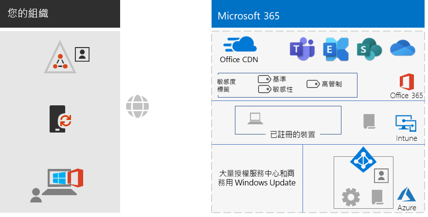
 
以下是組織使用僅雲端身分識別時的基礎結構視覺摘要。Here is a visual summary of the infrastructure if your organization uses cloud-only identity.
 
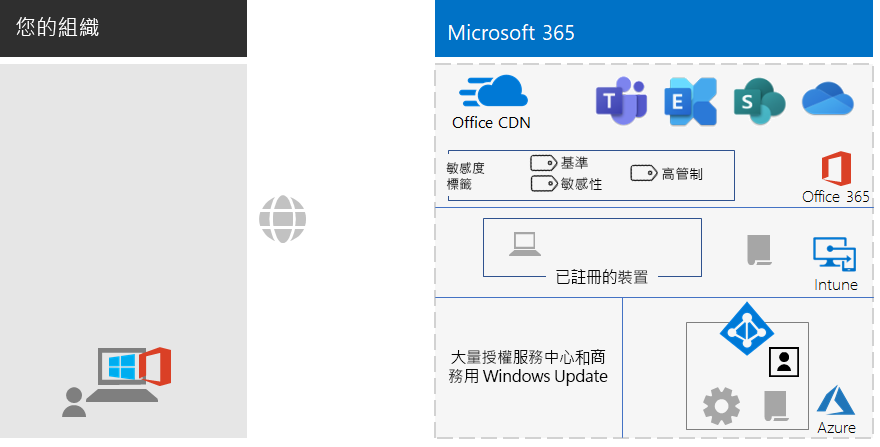

### 員工結果Employee results

每位員工登入之後應該會有：After their onboarding, each employee should have:

- 從員工裝置到所在地區的 Microsoft 365 雲端服務，具有效能良好的內部部署網路路徑。A performant, on-premises network path from their device to the Microsoft 365 cloud services in their region.
- 具有下列群組成員資格的使用帳戶：A user account with these group memberships:
   - LICENSEDLICENSED
   - 適當的 AD DS 或 Azure AD 安全性群組，也同樣屬於條件式存取原則的 BASELINE、SENSITIVE 和 HIGHLY-REGULATED Azure AD 群組的成員The appropriate AD DS or Azure AD security groups, which are also members of the BASELINE, SENSITIVE, and HIGHLY-REGULATED Azure AD groups for Conditional Access policies 
   - 適當的工作群組、部門和地區群組The appropriate workgroup, departmental, and regional groups
   - 敏感度標籤 Microsoft 365 群組 (如有需要)Sensitivity label Microsoft 365 groups (as needed)
- 具備下列條件的 Windows 10 企業版裝置：A Windows 10 Enterprise device that:
   - 已加入 Azure AD 租用戶 (僅雲端) 或同時加入 Azure AD 租用戶與 AD DS 網域 (混合式)。Is joined to the Azure AD tenant (cloud-only) or to both the Azure AD tenant and your AD DS domain (hybrid).
   - 使用最新的 Windows 10 企業版產品改良功能和安全性增強功能自動更新本身。Automatically updates itself with the latest Windows 10 Enterprise product improvements and security enhancements.
   - 已安裝 Microsoft 365 Apps 企業版，它會使用最新的 Office 產品改良功能和安全性增強功能自動更新本身。Has Microsoft 365 Apps for enterprise installed, which automatically updates itself with the latest Office product improvements and security enhancements.
   - 已在 Intune 中註冊，而且遵守 Intune 裝置合規性原則和應用程式保護原則。Is enrolled in Intune and subject to Intune device compliance policies and app protection policies.

## 下一步Next step

部署您的[工作負載和案例](deploy-workloads.md)，善加利用 Microsoft 365 企業版底層基礎結構的功能與設定。Deploy your [workloads and scenarios](deploy-workloads.md) to take advantage of the features and configuration of your Microsoft 365 for enterprise foundation infrastructure.
