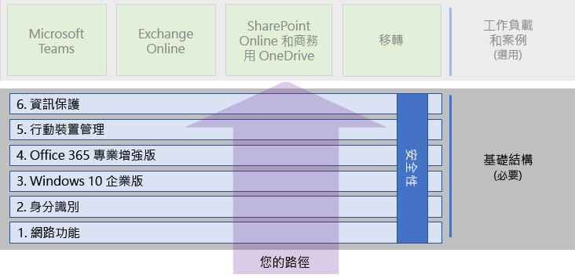

# Microsoft 365 企業版底層基礎結構Microsoft 365 Enterprise foundation infrastructure

如果您要自行進行 Microsoft 365 企業版的端對端部署，請先建置穩固的基礎，以便應用程式與服務能夠在安全的環境中發揮創意和實現團隊合作能力。If you're doing the end-to-end deployment of Microsoft 365 Enterprise yourself, you should first build a firm foundation upon which applications and services can unlock creativity and teamwork in a secure environment. 此基礎有時也稱為*核心部署*。This foundation is sometimes referred to as the core deployment.

如需明確的端對端部署路徑，您可以使用下列階段來規劃和部署 Microsoft 365 企業版的底層基礎結構：For a defined end-to-end path for deployment, you can use these phases to plan for and deploy the foundation infrastructure of Microsoft 365 Enterprise:

| | 階段Phase | 結果Results |
|:-------|:-----|:-----|
||[階段 1：網路Phase 1: Networking](networking-infrastructure.md)| 網路會針對 Microsoft 365 雲端式服務的存取進行最佳化。Your network is optimized for access to Microsoft 365's cloud-based services. |
||[階段 2：身分識別Phase 2: Identity](identity-infrastructure.md)| 系統管理員帳戶會受到保護、使用者和群組會進行同步處理，並提供增強式的使用者驗證機制。Your admin accounts are protected, your users and groups are synchronized, and your user authentication is strong. |
||[階段 3：Windows 10 企業版Phase 3: Windows 10 Enterprise](windows10-infrastructure.md)| 現有的 Windows 架構電腦可升級為 Windows 10 企業版，且新裝置會使用 Windows 10 企業版來進行安裝。Your existing Windows-based computers can upgrade to Windows 10 Enterprise and new devices are installed with Windows 10 Enterprise. |
||[階段 4：Office 365 專業增強版Phase 4: Office 365 ProPlus](office365proplus-infrastructure.md)| 現有的 Microsoft Office 使用者可升級為 Office 365 專業增強版。Your existing users of Microsoft Office can upgrade to Office 365 ProPlus. |
||[階段 5：行動裝置管理Phase 5: Mobile device management](mobility-infrastructure.md)| 裝置可以進行註冊並受到管理。Your devices can be enrolled and managed. |
||[階段 6：資訊保護Phase 6: Information protection](infoprotect-infrastructure.md)| 已啟用 Office 365 安全功能，您的標籤和原則已就緒，可保護文件和電子郵件。Office 365 security features are enabled and your sensitivity or Azure Information Protection labels are ready to protect documents. |

這些階段會從最基本的項目 (網路和身分識別) 開始，然後會建立基礎結構的各個設定和群組層級，以便：The phases start with the most foundational (networking and identity), and then create layers of infrastructure settings and groups to:

- 在裝置上安裝最新且最安全的 Windows 版本。Install the most current and secure version of Windows on your devices.
- 在裝置上安裝最新的 Microsoft Office 版本，並讓它保持最新。Install the most current version of Microsoft Office on your devices and keep it current.
- 管理您組織的裝置和其對應用程式的存取。Manage your organization's devices and their access to apps.
- 保護這些裝置上和雲端中的資訊。Protect the information on those devices and in the cloud.

不過，您可以彈性地設定和推出這些階段或階段內的步驟，以符合 IT 資源和企業的需求。However, you have the flexibility of configuring and rolling out the phases or steps within phases to fit your IT resources and business needs.

- **如果您是規模較小或創立不久的組織**，請視需要地遵循這些階段以便有系統地建置基礎結構。**If you are a smaller or newer organization**, follow the phases as needed to methodically build out your infrastructure. 若為非企業的簡化部署，請按一下[這裡](deploy-foundation-infrastructure-non-enterprises.md)。For a simplified deployment for non-enterprises, click [here](deploy-foundation-infrastructure-non-enterprises.md).

-  **如果您是企業組織**，請將這些階段視為 IT 基礎結構層級而非明確的路徑，並判斷最終要如何做才能符合組織內每一層級的需求。**If you are an enterprise organization**, view the phases as layers of IT infrastructure, rather than a defined path, and determine how to best work toward eventual adherence to the requirements for each layer across your organization.

在每個階段的結尾，您都應該檢查其允出準則\*\* (內含必須符合的必要條件以及要考慮的選擇性條件)。At the end of each phase, you should examine its exit criteria, which include required conditions that you must meet and optional conditions to consider. 每個階段的允出準則可確保您的內部部署和雲端基礎結構與產生的端對端設定符合 Microsoft 365 企業版部署需求。Exit criteria for each phase ensures that your on-premises and cloud infrastructure and resulting end-to-end configuration meet the requirements for a Microsoft 365 Enterprise deployment.

若要了解內容的建構方式，請觀看這段短片。To see how the content is structured, watch this short video.

> [!VIDEO https://www.microsoft.com/videoplayer/embed/RE23VRG]

以下是整個 Microsoft 365 企業版部署指南中的底層基礎結構：Here's the foundation infrastructure in the overall Microsoft 365 Enterprise deployment guide:

## 概覽At-a-glance

[Microsoft 365 企業版底層基礎結構海報](media/deploy-foundation-infrastructure/Microsoft365EnterpriseFoundInfra.pdf)是可讓您檢視每個階段的中心位置：The [Microsoft 365 Enterprise foundation infrastructure poster](media/deploy-foundation-infrastructure/Microsoft365EnterpriseFoundInfra.pdf) is a central location for you to view, for each phase:

- 系統管理員和使用者的階段整體目標The overall goals of the phase for administrators and users
- 服務、功能及工具The services, features, and tools
- 規劃的重要決策The key design decisions for planning
- 組態結果The configuration results
- 新使用者的上線程序The process for onboarding a new user
- 如何監控及更新How to monitor and update

若要下載此海報的副本，請按一下[這裡](https://github.com/MicrosoftDocs/microsoft-365-docs/raw/public/microsoft-365/enterprise/media/deploy-foundation-infrastructure/Microsoft365EnterpriseFoundInfra.pdf)。To download a copy of the poster, click [here](https://github.com/MicrosoftDocs/microsoft-365-docs/raw/public/microsoft-365/enterprise/media/deploy-foundation-infrastructure/Microsoft365EnterpriseFoundInfra.pdf).

## 基礎結構設定與使用者推出Infrastructure configuration vs. user rollout

底層基礎結構是一組設定好的軟體和服務，結合在一起時可讓使用者利用 Microsoft 365 企業版所提供的完整功能和保護機制。The foundation infrastructure is a set of configured software and services that, when combined together for a user, allow them to take advantage of the entire spectrum of capabilities and protections that Microsoft 365 Enterprise offers. 端對端部署旅程的終點是要讓這個基礎結構套用至所有使用者和其持有的 Windows 架構裝置。The ultimate destination of your end-to-end deployment journey is to have this infrastructure apply to all of your users and their Windows-based devices. 

不過請務必注意，對使用者推出軟體與服務的行為與 Microsoft 365 企業版底層基礎結構無關。However, it is important to note that the Microsoft 365 Enterprise foundation infrastructure is independent of the rollout of software and services to your users. ***您可以設定底層基礎結構的層級，而不需要對所有使用者推出這些層級。******You can configure the layers of the foundation infrastructure without having to roll out those layers to all of your users.***

您可以事先設定、測試和試驗底層基礎結構的元素，然後再對辦公室、地區或組織部門內的眾多使用者推出這些元素。Therefore, it is possible to configure, test, and pilot elements of the foundation infrastructure well ahead of the rollout of those elements to the multitude of your users in the offices, regions, or divisions of your organization.

例如，您可以針對下列項目建立設定：For example, you create the settings for:

| 階段Phase | 結果Results |
|:-------|:-----|
| 身分識別Identity | 帳戶同步處理和身分識別型條件式存取原則的群組。Account synchronization and groups for identity-based conditional access policies. |
| Windows 10 企業版Windows 10 Enterprise | 可自動將執行 Windows 7 或 Windows 8.1 的電腦就地升級為 Windows 10 企業版的群組。Groups to automatically upgrade computers running Windows 7 or Windows 8.1 to Windows 10 Enterprise in place. |
| Office 365 專業增強版Office 365 ProPlus | 可自動為使用 Office 2010、Office 2013 或 Office 2016 的使用者部署 Office 365 專業增強版的群組。Groups to automatically deploy Office 365 ProPlus for users with Office 2010, Office 2013, or Office 2016. |
| 行動裝置管理Mobile device management | 用於裝置註冊和裝置型條件式存取原則的群組。Groups for device enrollment and device-based conditional access policies. |
| 資訊保護Information protection | Office 365 敏感度標籤的群組。Groups for Office 365 sensitivity labels. |

當您準備好對使用者推出這個基礎結構的元素時：When you are ready to rollout elements of this infrastructure to users, you:

| 階段Phase | 推出動作Rollout action |
|:-------|:-----|
| 身分識別Identity | 將使用者帳戶新增至身分識別型條件式存取原則的群組。Add user accounts to the groups for identity-based conditional access policies. |
| Windows 10 企業版Windows 10 Enterprise | 將帳戶新增至可自動為使用 Windows 7 或 Windows 8.1 的使用者就地部署 Windows 10 企業版的群組。Add accounts to the groups to automatically deploy Windows 10 Enterprise in place for users with Windows 7 or Windows 8.1. |
| Office 365 專業增強版Office 365 ProPlus | 將使用者帳戶新增至可自動為使用 Office 2010、Office 2013 或 Office 2016 的使用者部署 Office 365 專業增強版的群組。Add user accounts to the groups to automatically deploy Office 365 ProPlus for users with Office 2010, Office 2013, or Office 2016. |
| 行動裝置管理Mobile device management | 將帳戶新增至用於裝置註冊和裝置型條件式存取原則的群組。Add accounts to the groups for device enrollment and device-based conditional access policies. |
| 資訊保護Information protection | 將使用者帳戶新增至敏感度標籤群組。Add user accounts to the groups for Information Protection labels. |

在底層基礎結構的階段或元素完成、經過測試及試驗後，您便可以對使用者以最符合業務目標和 IT 資源的方式推出已安裝好的軟體 (例如，Windows 10 企業版和 Office 365 專業增強版) 以及雲端式服務和保護 (例如，裝置註冊和條件式存取原則)。Once the foundation infrastructure is completed, tested, and piloted, you can roll out installed software, such as Windows 10 Enterprise and Office 365 ProPlus, and cloud-based services and protections, such as device enrollment and conditional access policies, to your users in the manner that best fits your business goals and IT resources.

## 部署和專案管理策略Deployment and project management strategies

若要了解如何讓試驗使用者和組織內的其他人知道如何對底層基礎結構的不同階段進行專案管理，請參閱[部署策略](deployment-strategies-microsoft-365-enterprise.md)。To give you some ideas on how to approach the project management of the different phases of the foundation infrastructure for pilot users and the rest of your organization, see [deployment strategies](deployment-strategies-microsoft-365-enterprise.md).

## 非企業部署Deployment for non-enterprises

如果您是小型組織，而 Microsoft 365 商務版不適合您，請參閱[非企業部署](deploy-foundation-infrastructure-non-enterprises.md)，以了解簡化的部署方式。If your organization is smaller and Microsoft 365 Business is not suitable for you, see [deployment for non-enterprises](deploy-foundation-infrastructure-non-enterprises.md) for a simplified deployment method.

## 下一步Next step

| 我的所在位置Where I am | 我要前往何處Where I need to go |
|:-------|:-----|
| 我有現有的 Office 365、Enterprise Mobility + Security (EMS) 或 Windows 10 企業版基礎結構I have existing infrastructure for Office 365, Enterprise Mobility + Security (EMS), or Windows 10 Enterprise: | 從[使用現有基礎結構部署](deploy-with-existing-infrastructure.md)開始，這將逐步引導您進行每個階段的允出準則。Start with [Deploy with existing infrastructure](deploy-with-existing-infrastructure.md), which steps you through the exit criteria for each phase. |
| 我是從頭開始的企業I'm starting from scratch as an enterprise | 使用[階段 1：網路](networking-infrastructure.md)開始端對端部署旅程。Begin your end-to-end deployment journey with [Phase 1: Networking](networking-infrastructure.md). |
| 我從頭開始，但不是企業I'm starting from scratch as a non-enterprise | 使用[非企業部署](deploy-foundation-infrastructure-non-enterprises.md)開始端對端部署旅程。Begin your end-to-end deployment journey with [Deployment for non-enterprises](deploy-foundation-infrastructure-non-enterprises.md). |
