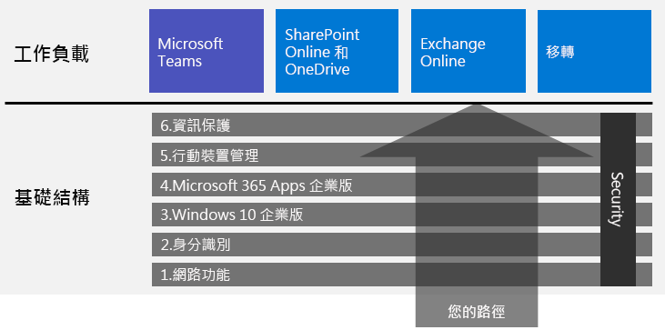

# 部署 Microsoft 365 企業版

Microsoft 365 企業版是本機與雲端生產力應用程式和服務的組合，其中的 Windows 10 企業版：  

- 提供智慧安全性。
- 已整合，讓您容易使用。
- 盡情發揮創意。
- 為團隊合作而建置。

您可以以包含最新技術的安全性服務與功能的整合方式來部署基礎結構和生產力工作負載，以實現這些權益。

部署 Microsoft 365 企業版的主要方法有三種：

- 使用[適用於 Microsoft 365 的 FastTrack](#fasttrack-for-microsoft-365) 與 Microsoft 工程師合作。
- 透過 Microsoft 諮詢服務或 [Microsoft 合作夥伴](https://partner.microsoft.com/)的協助。
- 參考 [Microsoft 365 企業版部署指南](#microsoft-365-for-enterprise-deployment-guide)自行完成。

## 適用於 Microsoft 365 的 FastTrack

由 Microsoft 工程師提供的 FastTrack 是*包含在訂閱之內的免費服務*，是一項持續提供且可重複利用的權益，可協助您以自己的步調移轉到雲端。 FastTrack 也可讓您存取合格合作夥伴的其他服務。 至今隨著超過 40000 位啟用此服務的客戶，FastTrack 可協助最大化 ROI、加速部署，以及提高整個組織中的採用率。 請參閱[適用於 Microsoft 365 的 FastTrack](https://fasttrack.microsoft.com/microsoft365)。

如果您想要利用 FastTrack 來部署 Microsoft 365 企業版，您可以使用 FastTrack [Microsoft 365 部署建議程式](https://aka.ms/microsoft365setupguide)，以了解有關部署及設定基礎結構的指導方針。 您必須以 Office 365 或 Microsoft 365 租用戶中全域系統管理員的身分登入，才能存取此頁面。

[從此處](https://fasttrack.microsoft.com/microsoft365)開始 FastTrack 的端對端部署旅程。

## Microsoft 365 企業版部署指南

Microsoft 365 企業版部署指南會逐步引導您完成 Microsoft 365 企業版產品和功能的正確及必要設定。

若要自行部署 Microsoft 365 企業版，您可以：

- 為內建安全性與整合部署[基礎結構](deploy-foundation-infrastructure.md)來簡化管理，此可讓您更輕鬆確保用戶端軟體已更新，具備最新的生產力和安全性增強功能。 
 
  基礎結構會組織為一系列有編號的階段，並且以彼此為基礎來進行建置，而目標就是建立能支援 Microsoft 365 企業版工作負載和案例的環境。 

  **如果您是規模較小或創立不久的組織**，請遵循這些階段以便有系統地建置基礎結構。

  不過，您可以根據所需順序來部署階段或階段的各部分，像是[一個接著一個或同時部署](deployment-strategies-microsoft-365-enterprise.md)，藉此來與您目前的基礎結構整合、搭配您的 IT 計劃和資源，以及符合您的商務需求。 若為非企業的簡化部署，請按一下[這裡](deploy-foundation-infrastructure-non-enterprises.md)。

  **如果您是企業組織**，請將這些階段視為 IT 基礎結構層級而非明確的路徑，並判斷最終要如何做才能符合組織內每一層級的需求。

- 在基礎結構頂端部署關鍵產能的[工作負載和案例](deploy-workloads.md)。 這些都需要在您組織中發揮創意和團隊合作。

以下是基礎結構和工作負載及案例之間的關聯。

工作負載和案例會在基礎結構的頂端運作。 不過，您不一定要建置所有基礎結構階段才能開始進行生力及共同作業的工作負載。

[從此處](deploy-foundation-infrastructure.md)開始您自己的端對端部署旅程。

## 採用測試磁碟機

「對於那些必須學會才能做到的事，我們靠的是邊做邊學。」** - 亞里斯多德

如果您不熟悉 Microsoft 365 企業版或特定產品或功能，了解這些項目的最佳方式就是親自建置及觀看其運作方式。

而測試實驗室指南 (TLG) 可讓此操作更容易，此服務會使用試用版或付費版訂用帳戶，在簡化但具代表性的測試環境中逐步引導您完成基礎結構或功能的設定。

使用 TLG，您可以自學、示範、自訂或建立複雜組態、工作負載或端對端案例的概念證明 (PoC)。

如需詳細資訊，請參閱 [Microsoft 365 企業版測試實驗室指南](m365-enterprise-test-lab-guides.md)。

## 轉換整個組織

若要更全面地掌握如何將整個組織移至 Microsoft 365 企業版中的產品和服務，請參閱[將您的組織轉換至 Microsoft 365](../media/deploy-microsoft-365-enterprise/transition-org-to-m365.pdf) 海報。

這份雙頁海報可讓您快速清查您現有的基礎結構，並取得移至 Microsoft 365 企業版中對應產品或服務的指導方針。 包含 Windows 和 Office 產品和其他基礎結構與安全性元素，例如裝置管理、身分識別以及資訊和威脅防護。

您也可以[下載此轉換海報](https://github.com/MicrosoftDocs/microsoft-365-docs/raw/public/microsoft-365/media/deploy-microsoft-365-enterprise/transition-org-to-m365.pdf)，並以 Letter、Legal 或 Tabloid (11 x 17) 格式列印此海報。

## 其他人怎麼執行此操作？

若要了解其他人如何部署及使用 Microsoft 365 企業版，可使用這些資源。

### 客戶如何使用 Microsoft 365 企業版

若要查看 Microsoft 客戶如何使用 Microsoft 365 企業版，請使用客戶案例網站。

1. 移至[ https://customers.microsoft.com/ ](https://customers.microsoft.com/)並按一下**搜尋**。
2. 在左窗格**語言**中，選取您的語言。
3. 在**產業**中，選取您組織的產業。
4. 在**產品**中，選取**Microsoft 365**。
5. 按一下客戶案例研究的卡。

### Microsoft 如何使用 Microsoft 365 企業版

定義數位文化是每個努力促進現代工作場所領導者的首要任務。 Microsoft 365 旨在支持這種文化轉變，幫助領導者賦予其公司每位員工釋放創造力和共同作業的能力。 建立 Microsoft 的基礎架構時，便精準地引發了此類型數位文化的轉型。 實作 Microsoft 365 企業版使我們能夠部署如 Microsoft Teams 和 Exchange Online 這類的共同作業技術，並在安全的 SharePoint 內部網站線上分享敏感性資料。

同時，智慧安全性功能和產品整合有助於簡化管理需求，並將整個 IT 生命週期的總擁有成本降到最低。 

了解 Core Services Engineering and Operations (以前稱為 Microsoft IT) 如何[使用 Microsoft 365 建置了現代化工作場所](https://www.microsoft.com/zh-TW/itshowcase/microsoft-365)。

> [!Note]
> 此網頁只提供英文版。

### Contoso Corporation 如何部署 Microsoft 365 企業版

Contoso Corporation 是虛構但具代表性的全球製造業集團，其總部位於法國巴黎。 請參閱 [Contoso 如何部署 Microsoft 365 企業版](contoso-case-study.md)，並且針對網路、身分識別、Windows 10 企業版、Microsoft 365 Apps 企業版、行動裝置管理、資訊保護和安全性，訂定主要設計決策和實作詳細資料。 

## 隨時了解部署內容

如需內容中的最新變更，請參閱 [本文章](microsoft-365-deploment-guide-changes.md)。

## 下一步

若需要 Microsoft 的直接協助以進行部署，請使用 [FastTrack](https://fasttrack.microsoft.com/microsoft365)。

若要透過顧問進行，請連絡 Microsoft 諮詢服務或 [Microsoft 合作夥伴](https://partner.microsoft.com/)。

若要自行開始部署，請參閱[基礎結構](deploy-foundation-infrastructure.md)。
