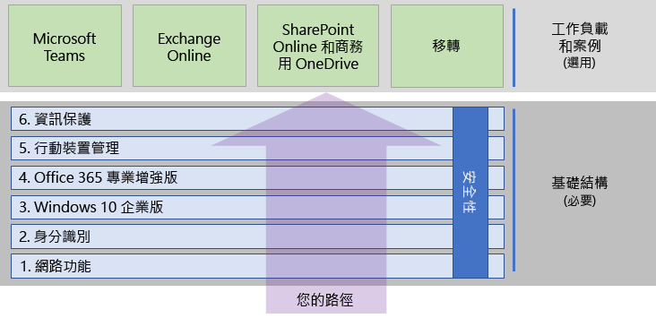

# 部署 Microsoft 365 企業版Deploy Microsoft 365 Enterprise

Microsoft 365 企業版是本機與雲端生產力應用程式和服務的組合，具有的 Windows 10 企業版：Microsoft 365 Enterprise is a combination of local and cloud-based productivity apps and services with Windows 10 Enterprise that:  

- 提供智慧安全性。Has intelligent security.
- 已整合，讓您容易使用。Is integrated for simplicity.
- 盡情發揮創意。Unlocks creativity.
- 為團隊合作而建置。Is built for teamwork.

您可以以包含最新技術的安全性服務與功能的整合方式來部署基礎結構和生產力工作負載，以實現這些權益。You can realize these benefits by deploying the infrastructure and productivity workloads in an integrated way that includes state-of-the-art security services and features.

部署 Microsoft 365 企業版的主要方法有三種：There are three main ways to deploy Microsoft 365 Enterprise:

- 使用[適用於 Microsoft 365 的 FastTrack](#fasttrack-for-microsoft-365) 與 Microsoft 工程師合作。Do it with Microsoft engineers using [FastTrack for Microsoft 365](#fasttrack-for-microsoft-365).
- 透過 Microsoft 諮詢服務或 [Microsoft 合作夥伴](https://partner.microsoft.com/)的協助。Do it with help from Microsoft Consulting Services or a [Microsoft partner](https://partner.microsoft.com/).
- 參考 [Microsoft 365 企業版的部署指南](#microsoft-365-enterprise-deployment-guide)自行完成。Do it yourself with the [Microsoft 365 Enterprise deployment guide](#microsoft-365-enterprise-deployment-guide).

## 適用於 Microsoft 365 的 FastTrackFastTrack for Microsoft 365

由 Microsoft 工程師提供的 FastTrack 是*包含在訂閱之內的免費服務*，是一項持續提供且可重複利用的權益，可協助您以自己的步調移轉到雲端。FastTrack is an ongoing and repeatable benefit—*available for free as part of your subscription*—that is delivered by Microsoft engineers to help you move to the cloud at your own pace. FastTrack 也可讓您存取合格合作夥伴的其他服務。FastTrack also gives you access to qualified partners for additional services. 至今隨著超過 40000 位啟用此服務的客戶，FastTrack 可協助最大化 ROI、加速部署，以及提高整個組織中的採用率。With over 40,000 customers enabled to date, FastTrack helps maximize ROI, accelerate deployment, and increase adoption across your organization. 請參閱[適用於 Microsoft 365 的 FastTrack](https://fasttrack.microsoft.com/microsoft365)。See [FastTrack for Microsoft 365](https://fasttrack.microsoft.com/microsoft365).

如果您想要利用 FastTrack 來部署 Microsoft 365 企業版，您可以使用 FastTrack [Microsoft 365 部署建議程式](https://aka.ms/microsoft365setupguide)，以了解有關部署及設定基礎結構的指導方針。If you want to take advantage of FastTrack to deploy Microsoft 365 Enterprise, you can use the FastTrack [Microsoft 365 deployment advisor](https://aka.ms/microsoft365setupguide) for guidance on how to deploy and set up your foundation infrastructure. 您必須以 Office 365 或 Microsoft 365 租用戶中全域系統管理員的身分登入，才能存取此頁面。You must be signed in as a global administrator in an Office 365 or Microsoft 365 tenant to access this page.

[從此處](https://fasttrack.microsoft.com/microsoft365)開始 FastTrack 的端對端部署旅程。Get started on your end-to-end deployment journey with FastTrack [here](https://fasttrack.microsoft.com/microsoft365).

## Microsoft 365 企業版的部署指南。Microsoft 365 Enterprise deployment guide

Microsoft 365 企業版部署指南會逐步引導您完成 Microsoft 365 企業版產品和功能的正確及必要設定。The Microsoft 365 Enterprise deployment guide steps you through the correct and required configuration of Microsoft 365 Enterprise products and features.

若要自行部署 Microsoft 365 企業版，您可以：To deploy Microsoft 365 Enterprise yourself, you can:

- 為內建安全性與整合部署[基礎結構](deploy-foundation-infrastructure.md)來簡化管理，此可讓您更輕鬆確保用戶端軟體已更新，具備最新的生產力和安全性增強功能。Deploy the [foundation infrastructure](deploy-foundation-infrastructure.md) for built-in security and integration for simplified management, which makes it easier to ensure your client software is updated with the latest productivity and security enhancements. 
 
  基礎結構會組織為一系列有編號的階段，並且以彼此為基礎來進行建置，而目標就是建立能支援 Microsoft 365 企業版工作負載和案例的環境。The foundation infrastructure is organized as a series of numbered phases that build upon each other and towards an environment that supports Microsoft 365 Enterprise workloads and scenarios. 

  **如果您是規模較小或創立不久的組織**，請遵循這些階段以便有系統地建置基礎結構。**If you are a smaller or newer organization**, follow the phases in order to methodically build out your infrastructure.

  不過，您可以根據所需順序來部署階段或階段的各部分，像是[一個接著一個或同時部署](deployment-strategies-microsoft-365-enterprise.md)，藉此來與您目前的基礎結構整合、搭配您的 IT 計劃和資源，以及符合您的商務需求。However, you can deploy phases or the portions of phases of this infrastructure in any order as needed, [one after the other or in parallel](deployment-strategies-microsoft-365-enterprise.md), to integrate with your current infrastructure, fit your IT plans and resources, and meet your business needs. 若為非企業的簡化部署，請按一下[這裡](deploy-foundation-infrastructure-non-enterprises.md)。For a simplified deployment for non-enterprises, click [here](deploy-foundation-infrastructure-non-enterprises.md).

  **如果您是企業組織**，請將這些階段視為 IT 基礎結構層級而非明確的路徑，並判斷最終要如何做才能符合組織內每一層級的需求。**If you are an enterprise organization**, view the phases as layers of IT infrastructure, rather than a defined path, and determine how to best work toward eventual adherence to the requirements of each layer across your organization.

- 在基礎結構頂端部署關鍵產能的[工作負載和案例](deploy-workloads.md)。Deploy key productivity [workloads and scenarios](deploy-workloads.md) on top of your infrastructure. 這些都需要在您組織中發揮創意和團隊合作。These unlock creativity and teamwork in your organization.

以下是基礎結構和工作負載及案例之間的關聯。Here's the relationship between the foundation infrastructure and the workloads and scenarios.

工作負載和案例會在基礎結構的頂端運作。Workloads and scenarios operate over the top of the foundation infrastructure. 不過，您不一定要建置所有基礎結構階段才能開始進行生力及共同作業的工作負載。However, you do not have to have all of the foundation infrastructure phases built out to begin using workloads for productivity and collaboration.

[從此處](deploy-foundation-infrastructure.md)開始您自己的端對端部署旅程。Get self-started on your end-to-end deployment journey [here](deploy-foundation-infrastructure.md).

## 採用測試磁碟機Take a test drive

「對於那些必須學會才能做到的事，我們靠的是邊做邊學。」\*\*“*For the things we have to learn before we can do them, we learn by doing them.*” - 亞里斯多德- Aristotle

如果您不熟悉 Microsoft 365 企業版或特定產品或功能，了解這些項目的最佳方式就是親自建置及觀看其運作方式。If you're new to Microsoft 365 Enterprise or to a specific product or feature, one of the best ways to gain understanding is to build it out yourself and see it working.

而測試實驗室指南 (TLG) 可讓此操作更容易，此服務會使用試用版或付費版訂用帳戶，在簡化但具代表性的測試環境中逐步引導您完成基礎結構或功能的設定。We've made this easier with Test Lab Guides (TLGs), which step you through the configuration of infrastructure or a feature in a simplified but representative test environment using trial or paid subscriptions.

使用 TLG，您可以自學、示範、自訂或建立複雜組態、工作負載或端對端案例的概念證明 (PoC)。With TLGs, you can self-learn, demonstrate, customize, or build a proof of concept (PoC) of a complex configuration, workload, or end-to-end scenario.

如需詳細資訊，請參閱 [Microsoft 365 企業版測試實驗室指南](m365-enterprise-test-lab-guides.md)。For more information, see [Microsoft 365 Enterprise Test Lab Guides](m365-enterprise-test-lab-guides.md).

## 轉換整個組織Transition your entire organization

若要更全面地掌握如何將整個組織移至 Microsoft 365 企業版中的產品和服務，請參閱[將您的組織轉換至 Microsoft 365](media/deploy-microsoft-365-enterprise/transition-org-to-m365.pdf)海報。To get a better picture of how to move your entire organization to the products and services in Microsoft 365 Enterprise, see the [Transition Your Organization to Microsoft 365](media/deploy-microsoft-365-enterprise/transition-org-to-m365.pdf) poster.

這份雙頁海報可讓您快速清查您現有的基礎結構，並取得移至 Microsoft 365 企業版中對應產品或服務的指導方針。This two-page poster is a quick way to inventory your existing infrastructure and get to the guidance for moving to the corresponding product or service in Microsoft 365 Enterprise. 包含 Windows 和 Office 產品和其他基礎結構與安全性元素，例如裝置管理、身分識別以及資訊和威脅防護。It includes Windows and Office products and other infrastructure and security elements such as device management, identity, and information and threat protection.

您也可以[下載此轉換海報](https://github.com/MicrosoftDocs/microsoft-365-docs/raw/public/microsoft-365/enterprise/media/deploy-microsoft-365-enterprise/transition-org-to-m365.pdf)，並以 Letter、Legal 或 Tabloid (11 x 17) 格式列印此海報。You can also [download the transition poster](https://github.com/MicrosoftDocs/microsoft-365-docs/raw/public/microsoft-365/enterprise/media/deploy-microsoft-365-enterprise/transition-org-to-m365.pdf) and print it in letter, legal, or tabloid (11 x 17) formats.

## 其他人怎麼執行此操作？How did others do it?

若要了解其他人如何部署及使用 Microsoft 365 企業版，可使用這些資源。Use these resources to understand how others have deployed and are using Microsoft 365 Enterprise.

### 客戶如何使用 Microsoft 365 企業版How customers use Microsoft 365 Enterprise

若要查看 Microsoft 客戶如何使用 Microsoft 365 企業版，請使用客戶案例的網站。Use the Customer Stories site to see how Microsoft customers are using Microsoft 365 Enterprise.

1. 移至[ https://customers.microsoft.com/ ](https://customers.microsoft.com/)並按一下**搜尋**。Go to [https://customers.microsoft.com/](https://customers.microsoft.com/) and click **Search**.
2. 在左窗格**語言**中，選取您的語言。In the left pane, select your language in **Language**.
3. 在**產業**中，選取您組織的產業。Select your organization's industry in **Industry**.
4. 在**產品**中，選取**Microsoft 365**。Select **Microsoft 365** in **Product**.
5. 按一下客戶案例研究的卡。Click on a card for the customer's case study.

### Microsoft 如何使用 Microsoft 365 企業版How Microsoft uses Microsoft 365 Enterprise

定義數位文化是每個努力促進現代工作場所領導者的首要任務。Defining a digital culture is a major priority for every leader who strives to foster a modern workplace. Microsoft 365 旨在支持這種文化轉變，幫助領導者賦予其公司每位員工釋放創造力和共同作業的能力。Microsoft 365 was designed to support this kind of cultural shift helping leaders empower everyone at their companies to unleash creativity and collaboration. 建立 Microsoft 的基礎架構時，便精準地引發了此類型數位文化的轉型。Establishing Microsoft's foundational infrastructure has sparked precisely this kind of digital culture shift. 實作 Microsoft 365 企業版使我們能夠部署如 Microsoft Teams 和 Exchange Online 這類的共同作業技術，並在安全的 SharePoint 內部網站線上分享敏感性資料。Implementing Microsoft 365 Enterprise has allowed us to deploy collaboration technology, like Microsoft Teams and Exchange Online, and to share sensitive data online across secure SharePoint intranet sites.

同時，智慧安全性功能和產品整合有助於簡化管理需求，並將整個 IT 生命週期的總擁有成本降到最低。At the same time, intelligent security features and product integration helps streamline management needs and minimize the total cost of ownership across the IT lifecycle. 

了解核心服務工程和運作 (以前稱為 Microsoft IT) [如何計劃和部署基礎](https://www.microsoft.com/itshowcase/deploying-and-managing-microsoft-365)，以支援在安全環境中釋放創造力和促進團隊合作的應用程式和服務。Learn how Core Services Engineering and Operations (formerly Microsoft IT) [planned and deployed a foundation](https://www.microsoft.com/itshowcase/deploying-and-managing-microsoft-365) to support the applications and services that unlock creativity and foster teamwork in a secure environment.

> [!Note]
> 此網頁只提供英文版。This web page is only available in English.

### Contoso Corporation 如何部署 Microsoft 365 企業版How the Contoso Corporation deployed Microsoft 365 Enterprise

Contoso Corporation 是虛構但具代表性的全球製造業集團，其總部位於法國巴黎。The Contoso Corporation is a fictional but representative global manufacturing conglomerate with its headquarters in Paris, France. 請參閱 [Contoso 部署的 Microsoft 365 企業版](contoso-case-study.md)，並且針對網路、身分識別、Windows 10 企業版、Office 365 專業增強版、行動裝置管理、資訊保護和安全性，訂定主要設計決策和實作詳細資料。See how [Contoso deployed Microsoft 365 Enterprise](contoso-case-study.md) and addressed major design decisions and implementation details for networking, identity, Windows 10 Enterprise, Office 365 ProPlus, mobile device management, information protection, and security. 

## 隨時了解部署內容Stay current with deployment content

如需內容中的最新變更，請參閱 [本文章](microsoft-365-deploment-guide-changes.md)。For the latest changes in content, see [this article](microsoft-365-deploment-guide-changes.md).

## 下一步Next step

若需要 Microsoft 的直接協助以進行部署，請使用 [FastTrack](https://fasttrack.microsoft.com/microsoft365)。To do it with direct Microsoft assistance, use [FastTrack](https://fasttrack.microsoft.com/microsoft365).

若要透過顧問進行，請連絡 Microsoft 諮詢服務或 [Microsoft 合作夥伴](https://partner.microsoft.com/)。To do it with a consultant, contact Microsoft Consulting Services or a [Microsoft partner](https://partner.microsoft.com/).

若要自行開始部署，請參閱[基礎結構](deploy-foundation-infrastructure.md)。To get started doing it yourself, see the [foundation infrastructure](deploy-foundation-infrastructure.md).
