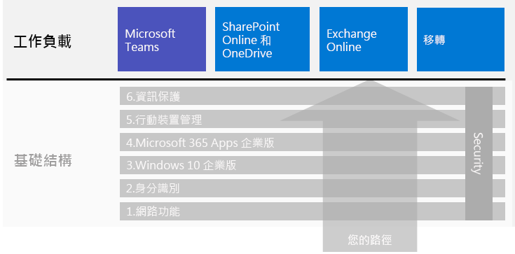

# 企業用 Microsoft 365 工作負載和案例Microsoft 365 for enterprise workloads and scenarios

若要獲得企業用 Microsoft 365 的創意暨團隊合作優點，請將這些工作負載部署到底層基礎結構上：To get the creativity and teamwork benefits of Microsoft 365 for enterprise, deploy these workloads over your foundation infrastructure:

- [Microsoft TeamsMicrosoft Teams](teams-workload.md)
- [Exchange OnlineExchange Online](exchangeonline-workload.md)
- [SharePoint 和 OneDriveSharePoint and OneDrive](sharepoint-online-onedrive-workload.md)

請參閱[移轉](migration-microsoft-365-enterprise-workload.md)文章，以了解用來將整個組織移轉到企業用 Microsoft 365 的一般藍圖，其內含 Microsoft Office 用戶端產品、內部部署 Office Server 產品和 Microsoft Windows 架構裝置。See the [migration](migration-microsoft-365-enterprise-workload.md) article for a general roadmap to migrate your entire organization to Microsoft 365 for enterprise, which includes Microsoft Office client products, on-premises Office Server products, and Microsoft Windows-based devices.

這些案例會以整合方式使用來自企業用 Microsoft 365 的功能和服務，以因應商務需求。Scenarios use features and services from across Microsoft 365 for enterprise in an integrated way to address a business need. 

其中一個需求是，確保您的員工在不直接連線到內部網路時可以有效率且安全地工作。One such need is to ensure that your employees can work productively and securely when they're not directly connected to your intranet. 請參閱[強化遠端工作人員](empower-people-to-work-remotely.md)案例，以取得部署基礎結構元素和推動遠端使用者採用關鍵工作負載的藍圖，例如 Teams 和 Exchange Online。See the [Empower remote workers](empower-people-to-work-remotely.md) scenario for a roadmap to deploy the infrastructure elements and drive remote user adoption for key workloads, such as Teams and Exchange Online.

另一個這類需求是保護 Microsoft 365 中所儲存的高管制資料。Another such need is to protect highly regulated data stored in Microsoft 365. 高管制資料包含下列數位資產：Highly regulated data includes digital assets that are:

- 受限於區域法規。Subject to regional regulations.
- 貴組織最有價值的資料，例如營業秘密、財務或人力資源資訊，以及組織策略。The most valuable data for your organization, such as trade secrets, financial or human resources information, and organization strategy.

若要保護此資料免於內部與外部威脅，請參閱：To protect this data from internal and external threats, see:

- [適用於高度管制資料的 Microsoft TeamsTeams for highly regulated data](secure-teams-highly-regulated-data-scenario.md)
- [適用於高度管制資料的 SharePoint 網站](teams-sharepoint-online-sites-highly-regulated-data.md)。[SharePoint sites for highly regulated data](teams-sharepoint-online-sites-highly-regulated-data.md). 

這些案例會逐步引導您完成 Microsoft Teams 小組或 SharePoint 網站的設定，以便安全地儲存您最有價值的資料。These scenarios step you through configuring a Microsoft Teams team or SharePoint site to securely store your most valuable data.

以下是整體企業用 Microsoft 365 部署指南中的工作負載和案例：Here are the workloads and scenarios in the overall Microsoft 365 for enterprise deployment guide:

如需其他案例，請參閱 [Microsoft 365 生產力資源庫](https://aka.ms/productivitylibrary)https://aka.ms/productivitylibrary)。See the [Microsoft 365 Productivity Library](https://aka.ms/productivitylibrary) (https://aka.ms/productivitylibrary) for additional scenarios. 

## 底層基礎結構先決條件Foundation infrastructure prerequisites

理論上\*\*，您應該在設定好[底層基礎結構](deploy-foundation-infrastructure.md)的所有階段後部署工作負載和案例。*Ideally*, you should deploy workloads and scenarios after you have configured all of the phases of the [foundation infrastructure](deploy-foundation-infrastructure.md). 這可確保所有基礎層級都已就緒，而可為使用者及其裝置提供整合、安全性及最佳體驗。This ensures that all of the underlying foundation layers are in place to provide integration, security, and the best experience for your users and their devices.

| 階段Phase | 結果Result |
|:-------|:-----|
| 網路Network | 網路會進行更新，以獲得最佳的 Microsoft 365 雲端服務效能。Your network is updated for optimum performance to Microsoft 365 cloud services. |
| 身分識別Identity | 身分識別會進行同步處理，並讓使用者帳戶使用增強式驗證以及讓系統管理員帳戶使用保護機制來確保身分識別的安全。Identity is synchronized and secured with strong authentication for user accounts and protection for admin accounts. |
| Windows 10 企業版Windows 10 Enterprise | 執行 Windows 7 或 Windows 8.1 的電腦可升級為 Windows 10 企業版，且新裝置會使用 Windows 10 企業版來進行安裝。Your computers running Windows 7 or Windows 8.1 can upgrade to Windows 10 Enterprise and new devices are installed with Windows 10 Enterprise. |
| Office 365 專業增強版Office 365 ProPlus | 現有的 Microsoft Office 使用者可升級為 Office 365 專業增強版。Your existing users of Microsoft Office can upgrade to Office 365 ProPlus. |
| 行動裝置管理Mobile device management | 裝置可以進行註冊並受到管理。Your devices can be enrolled and managed. |
| 資訊保護Information protection | 會啟用 Microsoft 365 資訊保護功能，且敏感度標籤或 Azure 資訊保護標籤已準備好而可保護文件和電子郵件。Microsoft 365 information protection features are configured and your sensitivity or Azure Information Protection labels are ready to protect documents and email. |

請記住，這是理想狀況，您可能需要花點時間來規劃、設定、測試和試驗，尤其是有既存基礎結構和多個位置的大型組織更是如此。Remember that this is ideal and can take some time to plan for, configure, test, and pilot, especially in large organizations with existing infrastructure and multiple locations. 您不一定要為了更快速地從企業用 Microsoft 365 獲得商業價值，而在所有位置完成所有階段。Completing all of these phases in all locations is not necessary for you to more quickly get business value from Microsoft 365 for enterprise. 

以下是一些要立即部署的常見工作負載：Here are some common workloads to deploy right away: 

- 在對使用者推出底層基礎結構的**身分識別**階段後，許多組織會部署：After the **Identity** phase of the foundation infrastructure is rolled out to users, many organizations deploy:
  - [Office 365 專業增強版](office365proplus-infrastructure.md)加上 [OneDrive](https://docs.microsoft.com/onedrive/plan-onedrive-enterprise)。[Office 365 ProPlus](office365proplus-infrastructure.md) combined with [OneDrive](https://docs.microsoft.com/onedrive/plan-onedrive-enterprise). Office 365 專業增強版可提供新式驗證的安全性和最新 Microsoft Office 用戶端的使用者體驗。Office 365 ProPlus provides the security of modern authentication and the user experience of the latest Microsoft Office client. 將使用者的個人檔案移轉到 OneDrive 會減少基礎結構和對於主資料夾及主目錄磁碟的支援需求。The migration of user's personal files to OneDrive reduces infrastructure and the need to support home folders and drives.
  - [Exchange Online](exchangeonline-workload.md)，讓使用者可以開始使用雲端式電子郵件。[Exchange Online](exchangeonline-workload.md) so that users can begin using cloud-based email.
- 如果您並非立即需要在雲端中儲存高度管制的數位資產，請先為使用者部署 [Microsoft Teams](teams-workload.md) 和 [SharePoint](sharepoint-online-onedrive-workload.md)，再部署**資訊保護**階段。If you don't have an immediate need for storing highly regulated digital assets in the cloud, deploy [Microsoft Teams](teams-workload.md) and [SharePoint](sharepoint-online-onedrive-workload.md) for your users prior to the **Information protection** phase.

您必須決定要如何針對底層基礎結構的先決條件階段，做出最佳的設定順序並進行部署，才能符合您的業務需求。You must decide on how to best order and deploy the configuration of prerequisite phases of foundation infrastructure to meet your business needs.

### 最佳作法Best practice

強烈建議您先部署和推出底層基礎結構的**身分識別**階段，再讓使用者快速上手工作負載或案例。We highly recommend that you deploy and roll out the **Identity** phase of the foundation infrastructure prior to onboarding your users to any workloads or scenarios.

**身分識別**階段可確保雲端式身分識別 (無論是只有雲端，還是會與內部部署 Active Directory Domain Services (AD DS) 同步處理) 會包含可用來管理驗證及存取的使用者和電腦帳戶與群組。The **Identity** phase ensures that your cloud-based identity, whether cloud-only or synchronized with your on-premises Active Directory Domain Services (AD DS), contains the user and computer accounts and groups to manage authentication and access. 所有使用者都必須使用增強式驗證且系統管理員帳戶必須使用增強式保護，才能將組織的數位資產放入 Microsoft 365 雲端。Strong authentication for all your users along with strong protection of admin accounts is required before placing your organization's digital assets in the Microsoft 365 cloud.

雖然整體效能是基本且非常重要的要求，然而在將使用者導入工作負載的同時，**網路**階段的部署可能仍在進行中，因為您知道 Microsoft 365 工作負載和服務係能會隨著時間的而改善。Although foundational and very important to overall performance, the rollout of the **Networking** phase can be in progress while onboarding your users to workloads, with the understanding that Microsoft 365 workload and service performance will improve over time. 對於有多個位置並混合使用邊緣裝置與網際網路連線的企業組織來說，更是如此。This is especially true for enterprise organizations with multiple locations and a mixture of edge devices and Internet connections.
