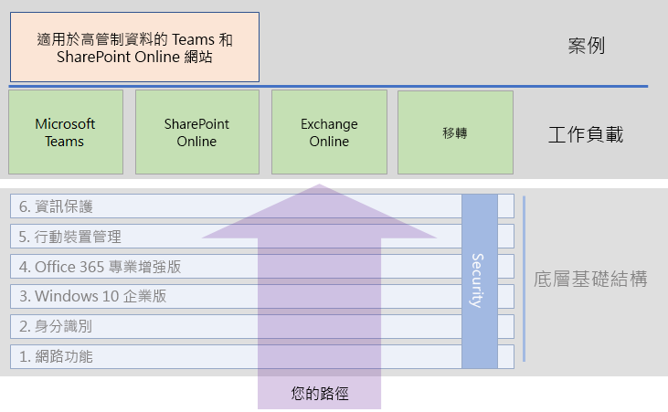

# Microsoft 365 企業版工作負載和案例

若要了解 Microsoft 365 企業版的創意暨團隊合作優點，請將這些工作負載和案例部署為在基礎結構上操作：

- [Microsoft Teams](teams-workload.md)
- [Exchange Online](exchangeonline-workload.md)
- [SharePoint Online](sharepoint-online-onedrive-workload.md)
- [移轉至 Microsoft 365 企業版](migration-microsoft-365-enterprise-workload.md)
- [適用於高管制資料的 Microsoft Teams 和 SharePoint Online 網站](teams-sharepoint-online-sites-highly-regulated-data.md)

下圖顯示整體 Microsoft 365 企業版部署內容中的工作負載。

您已經完成[基礎結構](deploy-foundation-infrastructure.md)的階段後，您應該部署工作負載。
