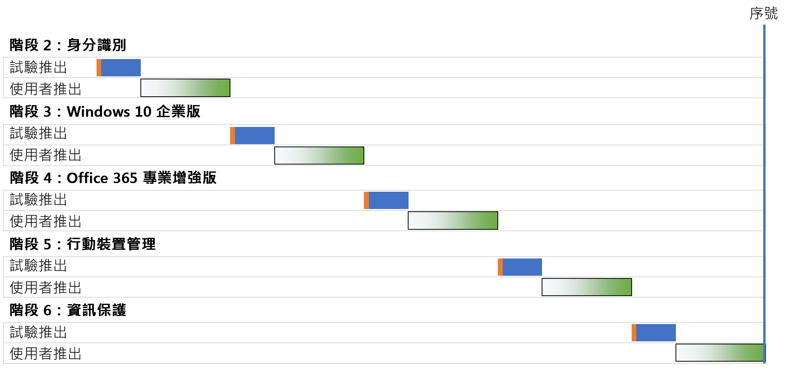
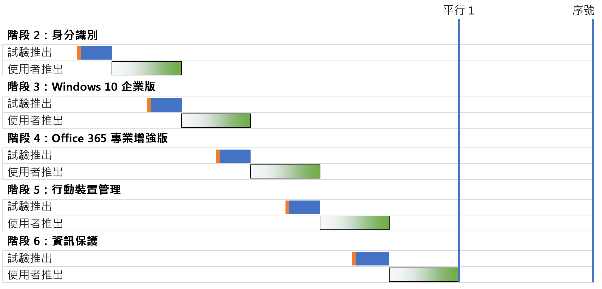
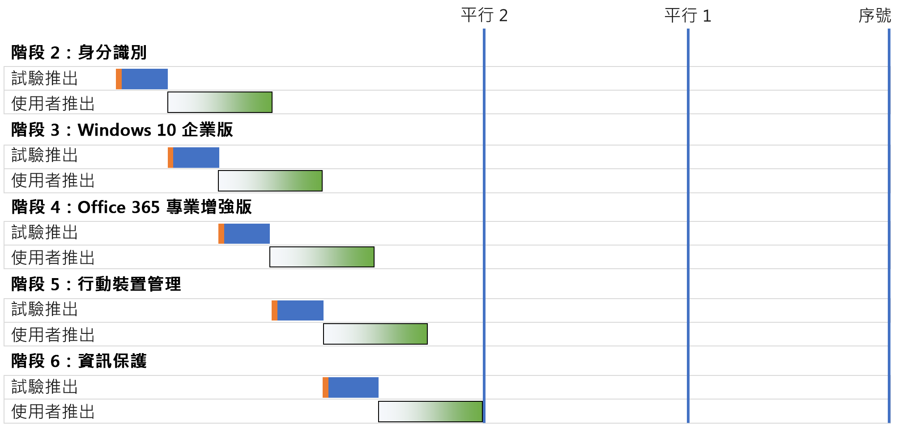
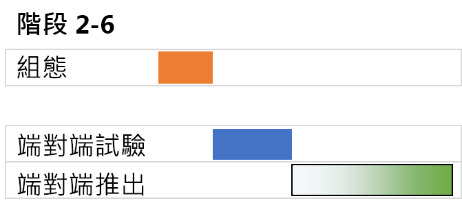

# Microsoft 365 企業版底層基礎結構部署策略

您可以使用多種方法部署 Microsoft 365 企業版[底層基礎結構](deploy-foundation-infrastructure.md)的各個階段，並向使用者推廣其功能、軟體和服務。若要開始對這項工作進行專案管理 (可能龐大且複雜，取決於組織規模及現有基礎結構)，請考慮以下部署策略：

- 序列部署
- 具有非重疊使用者推出的平行部署
- 具有重疊使用者推出的平行部署
- 初期基礎結構和端對端設定的推出

使用這些策略了解如何管理整個專案，並更快速地實現 Microsoft 365 企業版的商業優勢。

>[!Note]
>本文包含用於描述部署策略之一致方法的假設和簡化。這些部署策略是通用的，不限於任何特定的時間範圍，也不一定適用於所有組織和情況。
>

## 典型企業組織的 IT 專案管理元素

IT 基礎結構包含後端服務和向終端使用者推出的新增或改進的功能，或已安裝的軟體。IT 部門通常會以有條理的方式部署 IT 基礎結構的元素。成功部署 IT 基礎結構元素的方法包括：

- 試驗推出 

  其中包含初始基礎結構設定，並推出給一組試驗使用者、進行測試，以及對基礎結構設定做後續修改。

- 使用者推出

  其中包含根據區域、部門、群組推出給貴組織的其他成員，或其他類型之設定或軟體的系統傳播。

試驗推出的那一組使用者與使用者推出的使用者不同。

本文使用以下圖形來描述這些定義： 

 

使用者推出的圖形陰影表示，透過使用結構化或有條理的方法 (例如群組、部門或區域)，在貴組織中從 0% 到 100% 的百分比。

## 部署策略

請考慮下列的部署策略：

- 序列部署
- 具有非重疊使用者推出的平行部署
- 具有重疊使用者推出的平行部署
- 初期基礎結構和端對端設定的推出

### 序列部署

透過序列部署，您可以完整推行一個階段，讓該階段在進入下一個階段之前，能夠百分之百部署到所有使用者。以下是可能以這種方式部署的一些原因：

- 風險降低
- 資源限制
- IT 部門資金週期
- IT 技術相依性
- 業務變更管理和使用者阻力

此甘特圖顯示了 Microsoft 365 企業版底層基礎結構階段 2-6 的簡化序列部署。

 
 
為了簡化討論和範例，請假設每個階段中的每個階段和部署區段都需要相同的時間。

>[!Note]
>階段 1：Microsoft 365 企業版底層基礎結構的網路為僅限 IT 部門使用的階段。使用者可從與 Microsoft 雲端資源之間最佳化連線中獲益，但不會因此而強加給他們。
>

以下是簡化的試驗使用者體驗，可做為範例：

- 我需要於 12 月使用智慧型手機啟用 MFA。(身分識別)
- 我於 3 月在 Windows 8.1 電腦上安裝了 Windows 10 企業版。(Windows 10 企業版)
- 我於 6 月安裝了 Office 365 專業增強版，取代原本的 Office 2013。(Office 365 專業增強版)
- 我於 9 月註冊裝置並套用了 App 和裝置原則。(行動裝置管理)
- 我於 12 月安裝了 Azure 資訊保護用戶端，並接受有關如何將標籤套用至文件的訓練。(資訊保護)

結果是 90 天的連續試驗推出頻率。

以下是簡化的使用者體驗，可做為範例：

- 我需要於 1 月使用智慧型手機啟用 MFA。(身分識別)
- 我於 4 月在 Windows 8.1 電腦上安裝了 Windows 10 企業版。(Windows 10 企業版)
- 我於 7 月安裝了 Office 365 專業增強版，取代原本的 Office 2013。(Office 365 專業增強版)
- 我於 10 月註冊裝置並套用了 App 和裝置原則。(行動裝置管理)
- 我於隔年 1 月安裝了 Azure 資訊保護用戶端，並接受有關如何將標籤套用至文件的訓練。(資訊保護)

結果是 90 天的連續使用者推出頻率。

此部署策略的缺點是，完整部署 Microsoft 365 企業版底層基礎結構可能需要很長時間。

### 具有非重疊使用者推出的平行部署 (平行 1)

對於此部署策略，您可在目前階段之使用者推出的最後一部分啟動下一階段的試驗推出。以下是前一階段的使用者推出結束時，出現試驗推出的階段 2-6 部署。

 
 
最終的結果是，在下一個階段開始之前，目前階段的使用者推出會在貴組織內完成。非試驗推出的使用者不會同時處理多個階段的推出，但試驗推出會與使用者推同時進行。

以下是簡化的試驗使用者體驗，可做為範例：

- 我需要於 12 月使用智慧型手機啟用 MFA。(身分識別)
- 我於 2 月在 Windows 8.1 電腦上安裝了 Windows 10 企業版。(Windows 10 企業版)
- 我於 4 月安裝了 Office 365 專業增強版，取代原本的 Office 2013。(Office 365 專業增強版)
- 我於 6 月註冊裝置並套用了 App 和裝置原則。 (行動裝置管理)
- 我於 8 月安裝了 Azure 資訊保護用戶端，並接受有關如何將標籤套用至文件的訓練。(資訊保護)

結果是 60 天的連續試驗推出頻率。

以下是簡化的使用者體驗，可做為範例：

- 我需要於 1 月使用智慧型手機啟用 MFA。(身分識別)
- 我於 3 月在 Windows 8.1 電腦上安裝了 Windows 10 企業版。(Windows 10 企業版)
- 我於 5 月安裝了 Office 365 專業增強版，取代原本的 Office 2013。(Office 365 專業增強版)
- 我於 7 月註冊裝置並套用了 App 和裝置原則。 (行動裝置管理)
- 我於 9 月安裝了 Azure 資訊保護用戶端，並接受有關如何將標籤套用至文件的訓練。(資訊保護)

結果是 60 天的連續使用者推出頻率。

此部署策略的優點是，可能會縮短完整部署 Microsoft 365 企業版底層基礎結構的時間，而無需讓 IT 部門和使用者同時處理多個推出。

### 具有重疊使用者推出的平行部署 (平行 2)

使用此部署策略，您將會：

- 在目前階段之使用者推出的最後一部分啟動下一階段的試驗推出。
- 使用者以沒有任何使用者正在同時處理多個階段推出的這類方式，在目前階段的使用者推出期間推出下一個階段。 這會假設您會以使用地區、部門或其他群組的相同方式推出基礎結構的各個階段。

以下是不同部署策略之間的簡化比較。

 

最後的結果是：

- 試驗推出從一個階段到下一階段，不必暫停。
- 完成前一階段的使用者推出之前，就能開始下一階段的使用者推出，但沒有個別使用者一次推出多個階段。

以下是簡化的試驗使用者體驗，可做為範例：

- 我需要於 12 月使用智慧型手機啟用 MFA。(身分識別)
- 我於 1 月在 Windows 8.1 電腦上安裝了 Windows 10 企業版。(Windows 10 企業版)
- 我於 2 月安裝了 Office 365 專業增強版，取代原本的 Office 2013。(Office 365 專業增強版)
- 我於 5 月註冊裝置並套用了 App 和裝置原則。 (行動裝置管理)
- 我於 4 月安裝了 Azure 資訊保護用戶端，並接受有關如何將標籤套用至文件的訓練。(資訊保護)

結果是 30 天的連續試驗推出頻率。

以下是簡化的使用者體驗，可做為範例：

- 我需要於 1 月使用智慧型手機啟用 MFA。(身分識別)
- 我於 2 月在 Windows 8.1 電腦上安裝了 Windows 10 企業版。(Windows 10 企業版)
- 我於 3 月安裝了 Office 365 專業增強版，取代原本的 Office 2013。(Office 365 專業增強版)
- 我於 4 月註冊裝置並套用了 App 和裝置原則。 (行動裝置管理)
- 我於 5 月安裝了 Azure 資訊保護用戶端，並接受有關如何將標籤套用至文件的訓練。(資訊保護)

結果是 30 天的連續使用者推出頻率。

此部署策略的優點是，它甚至可縮短完整部署 Microsoft 365 企業版底層基礎結構的時間，而不需使用者同時處理多個推出。 但是，使用者無法在連續階段之間休息。

### 初期基礎結構和端對端設定的推出

對於能夠將階段 2-6 壓縮為單一部署區段的小型組織，部署結果如下所示：
 
 

IT 部門為階段 2-6 設定基礎結構，然後推出給試驗使用者，以檢查端對端的功能。例如，試驗使用者同時獲得下列功能：

- MFA 和其他身分識別功能 (身分識別)
- Windows 裝置上的 Windows 10 企業版 (Windows 10 企業版)
- Office 365 專業增強版的 Office 套件 (Office 365 專業增強版)
- App 和裝置原則 (行動裝置管理)
- 安裝 Azure 資訊保護用戶端，並對如何將標籤套用至文件進行訓練 (資訊保護)

試驗推出結束後，使用者推出將會開始，每個使用者在該推出中同時獲取所有功能。

## 下一步

使用[底層基礎結構](deploy-foundation-infrastructure.md)部署 Microsoft 365 企業版。
