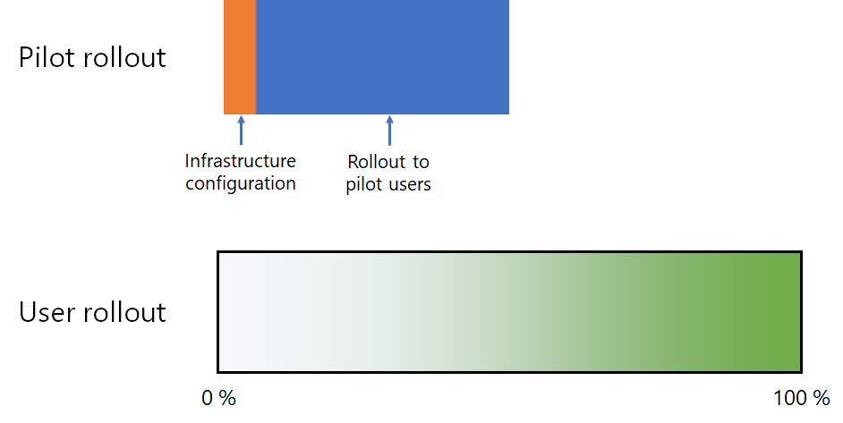
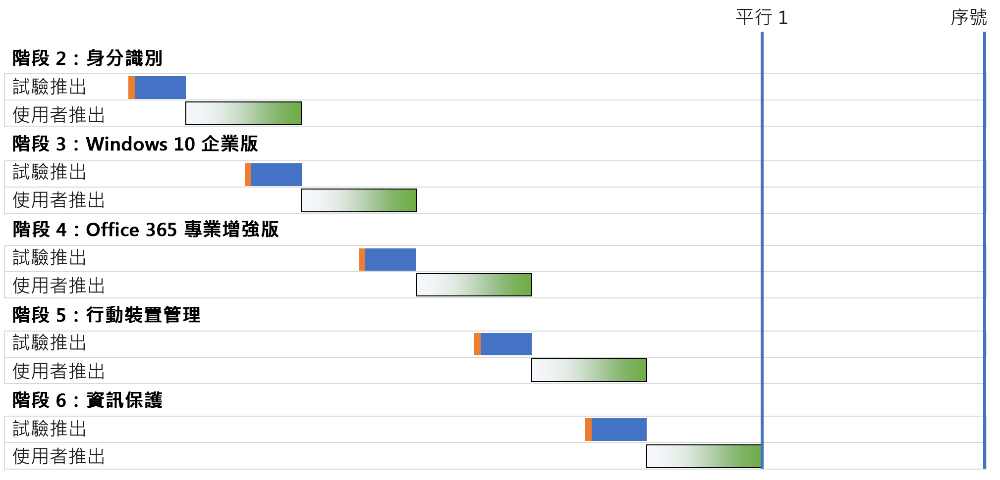
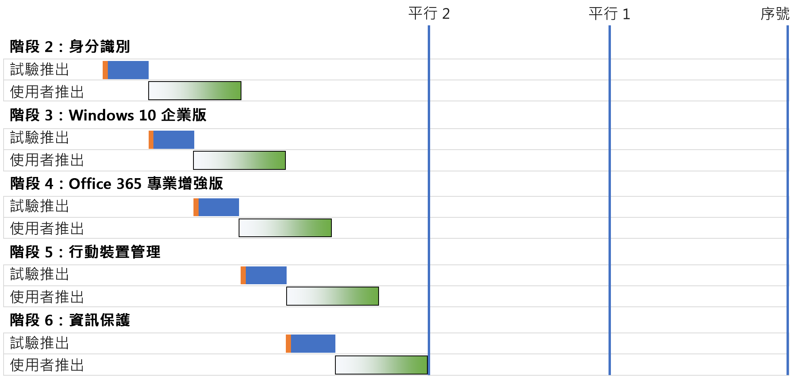
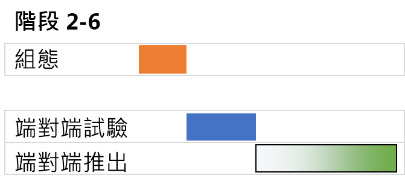

# Microsoft 365 企業版底層基礎結構部署策略Microsoft 365 for enterprise foundation infrastructure deployment strategies

您可以使用多種方法部署 Microsoft 365 企業版[底層基礎結構](deploy-foundation-infrastructure.md)的各個階段，並向使用者推廣其功能、軟體和服務。若要開始對這項工作進行專案管理 (可能龐大且複雜，取決於組織規模及現有基礎結構)，請考慮以下部署策略：There are many ways you can deploy the phases of the [foundation infrastructure](deploy-foundation-infrastructure.md) of Microsoft 365 for enterprise and roll out its capabilities, software, and services to your users. To get you started on the project management of this undertaking, which can be large and complex depending on the size of your organization and its existing infrastructure, consider the following deployment strategies:

- 序列部署Serial deployment
- 具有非重疊使用者推出的平行部署Parallel deployment with non-overlapping user rollout
- 具有重疊使用者推出的平行部署Parallel deployment with overlapping user rollout
- 初期基礎結構和端對端設定的推出Up-front infrastructure and rollout of the end-to-end configuration

使用這些策略了解如何管理整個專案，並更快速地實現 Microsoft 365 企業版的商業優勢。Use these strategies for ideas on how to manage the overall project and more quickly realize the business benefits of Microsoft 365 for enterprise.

>[!Note]
>本文包含用於描述部署策略之一致方法的假設和簡化。這些部署策略是通用的，不限於任何特定的時間範圍，也不一定適用於所有組織和情況。This article contains assumptions and simplifications for a consistent way to describe the deployment strategies. These deployment strategies are generalized and are not meant to imply any specific timeframes, nor are they meant to apply to all organizations and situations.
>

## 典型企業組織的 IT 專案管理元素Elements of IT project management for typical enterprise organizations

IT 基礎結構包含後端服務和向終端使用者推出的新增或改進的功能，或已安裝的軟體。IT 部門通常會以有條理的方式部署 IT 基礎結構的元素。成功部署 IT 基礎結構元素的方法包括：IT infrastructure includes both backend services and the rollout of new or improved capabilities or installed software to end users. IT departments typically deploy elements of an IT infrastructure in a methodical way. One approach to the successful deployment of an element of IT infrastructure consists of:

- 試驗推出A pilot rollout 

  其中包含初始基礎結構設定，並推出給一組試驗使用者、進行測試，以及對基礎結構設定做後續修改。This includes initial infrastructure configuration and rollout to a pilot set of users, testing, and subsequent modifications to the infrastructure configuration.

- 使用者推出A user rollout

  其中包含根據區域、部門、群組推出給貴組織的其他成員，或其他類型之設定或軟體的系統傳播。This includes the rollout to the rest of your organization based on regions, departments, groups, or other types of systematic propagation of configuration or software.

試驗推出的那一組使用者與使用者推出的使用者不同。The set of users in the pilot rollout are not the same as those in the user rollout.

本文使用以下圖形來描述這些定義：This article uses the following graphics to depict these definitions: 

 

使用者推出的圖形陰影表示，透過使用結構化或有條理的方法 (例如群組、部門或區域)，在貴組織中從 0% 到 100% 的百分比。The shading for the user rollout graphic indicates the percentage across your organization from 0% to 100% using a structured or methodical approach such as groups, departments, or regions.

## 部署策略Deployment strategies

請考慮下列的部署策略：Consider the following deployment strategies:

- 序列部署Serial deployment
- 具有非重疊使用者推出的平行部署Parallel deployment with non-overlapping user rollout
- 具有重疊使用者推出的平行部署Parallel deployment with overlapping user rollout
- 初期基礎結構和端對端設定的推出Up-front infrastructure and rollout of the end-to-end configuration

### 序列部署Serial deployment

透過序列部署，您可以完整推行一個階段，讓該階段在進入下一個階段之前，能夠百分之百部署到所有使用者。以下是可能以這種方式部署的一些原因：With a serial deployment, you completely roll out a phase, allowing the phase to reach 100% completion of deployment to all of your users, before moving on to the next one. Here are some of the reasons why you might deploy this way:

- 風險降低Risk mitigation
- 資源限制Resourcing constraints
- IT 部門資金週期IT department funding cycles
- IT 技術相依性IT technology dependencies
- 業務變更管理和使用者阻力Business change management and end-user resistance

此甘特圖顯示了 Microsoft 365 企業版底層基礎結構階段 2-6 的簡化序列部署。This Gantt chart shows a simplified serial deployment of phases 2-6 of the foundation infrastructure for Microsoft 365 for enterprise.

 
 
為了簡化討論和範例，請假設每個階段中的每個階段和部署區段都需要相同的時間。To simplify the discussion and example, each phase and deployment segment within each phase are assumed to take the same amount of time.

>[!Note]
>階段 1：Microsoft 365 企業版底層基礎結構的網路為僅限 IT 部門使用的階段。使用者可從與 Microsoft 雲端資源之間最佳化連線中獲益，但不會因此而強加給他們。Phase 1: Networking of the Microsoft 365 for enterprise Foundation Infrastructure is an IT department-only phase. Users reap the benefits of optimized connectivity to Microsoft’s cloud resources but are not imposed upon to achieve it.
>

以下是簡化的試驗使用者體驗，可做為範例：Here’s a simplified pilot user experience as an example:

- 我需要於 12 月使用智慧型手機啟用 MFA。(身分識別)In December, I need to use my smart phone for MFA. (Identity)
- 我於 3 月在 Windows 8.1 電腦上安裝了 Windows 10 企業版。(Windows 10 企業版)In March, I get Windows 10 Enterprise installed on my Windows 8.1 desktop. (Windows 10 Enterprise)
- 我於 6 月安裝了 Office 365 專業增強版，取代原本的 Office 2013。(Office 365 專業增強版)In June, I get Office 365 ProPlus installed, replacing Office 2013. (Office 365 ProPlus)
- 我於 9 月註冊裝置並套用了 App 和裝置原則。In September, I get device enrollment and app and device policies applied. (行動裝置管理)(Mobile device management)
- 我於 12 月安裝了 Azure 資訊保護用戶端，並接受有關如何將標籤套用至文件的訓練。(資訊保護)In December, I get the Azure Information Protection client installed and get trained on how to apply labels to documents. (Information protection)

結果是 90 天的連續試驗推出頻率。The result is a 90-day cadence between successive pilot rollouts.

以下是簡化的使用者體驗，可做為範例：Here’s a simplified end-user experience as an example:

- 我需要於 1 月使用智慧型手機啟用 MFA。(身分識別)In January, I need to use my smart phone for MFA. (Identity)
- 我於 4 月在 Windows 8.1 電腦上安裝了 Windows 10 企業版。(Windows 10 企業版)In April, I get Windows 10 Enterprise installed on my Windows 8.1 desktop. (Windows 10 Enterprise)
- 我於 7 月安裝了 Office 365 專業增強版，取代原本的 Office 2013。(Office 365 專業增強版)In July, I get Office 365 ProPlus installed, replacing Office 2013. (Office 365 ProPlus)
- 我於 10 月註冊裝置並套用了 App 和裝置原則。In October, I get device enrollment and app and device policies applied. (行動裝置管理)(Mobile device management)
- 我於隔年 1 月安裝了 Azure 資訊保護用戶端，並接受有關如何將標籤套用至文件的訓練。(資訊保護)In January of the following year, I get the Azure Information Protection client installed and get trained on how to apply labels to documents. (Information protection)

結果是 90 天的連續使用者推出頻率。The result is a 90-day cadence between successive user rollouts.

此部署策略的缺點是，完整部署 Microsoft 365 企業版底層基礎結構可能需要很長時間。The disadvantage to this deployment strategy is that it can take a long time to fully deploy the Microsoft 365 for enterprise foundation infrastructure.

### 具有非重疊使用者推出的平行部署 (平行 1)Parallel deployment with non-overlapping user rollout (Parallel 1)

對於此部署策略，您可在目前階段之使用者推出的最後一部分啟動下一階段的試驗推出。以下是前一階段的使用者推出結束時，出現試驗推出的階段 2-6 部署。For this deployment strategy, you start the pilot rollout of the next phase during the last part of the user rollout of the current phase. Here is the deployment of phases 2-6 when the pilot rollout occurs as the user rollout of the previous phase is wrapping up.

 
 
最終的結果是，在下一個階段開始之前，目前階段的使用者推出會在貴組織內完成。非試驗推出的使用者不會同時處理多個階段的推出，但試驗推出會與使用者推同時進行。The end result is that user rollout for the current phase completes across your organization before the next one starts. Users that are not in pilot rollouts are not dealing with the rollouts of multiple phases at the same time, but pilot rollouts are done in parallel with user rollouts.

以下是簡化的試驗使用者體驗，可做為範例：Here’s a simplified pilot user experience as an example:

- 我需要於 12 月使用智慧型手機啟用 MFA。(身分識別)In December, I need to use my smart phone for MFA. (Identity)
- 我於 2 月在 Windows 8.1 電腦上安裝了 Windows 10 企業版。(Windows 10 企業版)In February, I get Windows 10 Enterprise installed on my Windows 8.1 desktop. (Windows 10 Enterprise)
- 我於 4 月安裝了 Office 365 專業增強版，取代原本的 Office 2013。(Office 365 專業增強版)In April, I get Office 365 ProPlus installed, replacing Office 2013. (Office 365 ProPlus)
- 我於 6 月註冊裝置並套用了 App 和裝置原則。In June, I get device enrollment and app and device policies applied. (行動裝置管理)(Mobile device management)
- 我於 8 月安裝了 Azure 資訊保護用戶端，並接受有關如何將標籤套用至文件的訓練。(資訊保護)In August, I get the Azure Information Protection client installed and get trained on how to apply labels to documents. (Information protection)

結果是 60 天的連續試驗推出頻率。The result is a 60-day cadence between successive pilot rollouts.

以下是簡化的使用者體驗，可做為範例：Here’s a simplified end-user experience as an example:

- 我需要於 1 月使用智慧型手機啟用 MFA。(身分識別)In January, I need to use my smart phone for MFA. (Identity)
- 我於 3 月在 Windows 8.1 電腦上安裝了 Windows 10 企業版。(Windows 10 企業版)In March, I get Windows 10 Enterprise installed on my Windows 8.1 desktop. (Windows 10 Enterprise)
- 我於 5 月安裝了 Office 365 專業增強版，取代原本的 Office 2013。(Office 365 專業增強版)In May, I get Office 365 ProPlus installed, replacing Office 2013. (Office 365 ProPlus)
- 我於 7 月註冊裝置並套用了 App 和裝置原則。In July, I get device enrollment and app and device policies applied. (行動裝置管理)(Mobile device management)
- 我於 9 月安裝了 Azure 資訊保護用戶端，並接受有關如何將標籤套用至文件的訓練。(資訊保護)In September, I get the Azure Information Protection client installed and get trained on how to apply labels to documents. (Information protection)

結果是 60 天的連續使用者推出頻率。The result is a 60-day cadence between successive user rollouts.

此部署策略的優點是，可能會縮短完整部署 Microsoft 365 企業版底層基礎結構的時間，而無需讓 IT 部門和使用者同時處理多個推出。The advantage to this deployment strategy is that it can take less time to fully deploy the Microsoft 365 for enterprise foundation infrastructure, without having your IT department and users deal with multiple rollouts the same time.

### 具有重疊使用者推出的平行部署 (平行 2)Parallel deployment with overlapping user rollout (Parallel 2)

使用此部署策略，您將會：For this deployment strategy, you start the:

- 在目前階段之使用者推出的最後一部分啟動下一階段的試驗推出。Pilot rollout of the next phase during the last part of the user rollout of the current phase.
- 使用者以沒有任何使用者正在同時處理多個階段推出的這類方式，在目前階段的使用者推出期間推出下一個階段。User rollout of the next phase during the user rollout of the current phase in such a way that no user is dealing with the rollouts of multiple phases at the same time. 這會假設您會以使用地區、部門或其他群組的相同方式推出基礎結構的各個階段。This assumes that you are rolling out each phase of the foundation infrastructure in the same way, using regions, departments, or other groupings.

以下是不同部署策略之間的簡化比較。Here is a simplified comparison between the different deployment strategies.

 

最後的結果是：The end result is that:

- 試驗推出從一個階段到下一階段，不必暫停。Pilot rollouts go from one phase to the next without a pause.
- 完成前一階段的使用者推出之前，就能開始下一階段的使用者推出，但沒有個別使用者一次推出多個階段。The user rollout for a phase begins before the completion of the user rollout of the previous phase, but no individual user is rolling out more than one phase at a time.

以下是簡化的試驗使用者體驗，可做為範例：Here’s a simplified pilot user experience as an example:

- 我需要於 12 月使用智慧型手機啟用 MFA。(身分識別)In December, I need to use my smart phone for MFA. (Identity)
- 我於 1 月在 Windows 8.1 電腦上安裝了 Windows 10 企業版。(Windows 10 企業版)In January, I get Windows 10 Enterprise installed on my Windows 8.1 desktop. (Windows 10 Enterprise)
- 我於 2 月安裝了 Office 365 專業增強版，取代原本的 Office 2013。(Office 365 專業增強版)In February, I get Office 365 ProPlus installed, replacing Office 2013. (Office 365 ProPlus)
- 我於 5 月註冊裝置並套用了 App 和裝置原則。In March, I get device enrollment and app and device policies applied. (行動裝置管理)(Mobile device management)
- 我於 4 月安裝了 Azure 資訊保護用戶端，並接受有關如何將標籤套用至文件的訓練。(資訊保護)In April, I get the Azure Information Protection client installed and get trained on how to apply labels to documents. (Information protection)

結果是 30 天的連續試驗推出頻率。The result is a 30-day cadence between successive pilot rollouts.

以下是簡化的使用者體驗，可做為範例：Here’s a simplified end-user experience as an example:

- 我需要於 1 月使用智慧型手機啟用 MFA。(身分識別)In January, I need to use my smart phone for MFA. (Identity)
- 我於 2 月在 Windows 8.1 電腦上安裝了 Windows 10 企業版。(Windows 10 企業版)In February, I get Windows 10 Enterprise installed on my Windows 8.1 desktop. (Windows 10 Enterprise)
- 我於 3 月安裝了 Office 365 專業增強版，取代原本的 Office 2013。(Office 365 專業增強版)In March, I get Office 365 ProPlus installed, replacing Office 2013. (Office 365 ProPlus)
- 我於 4 月註冊裝置並套用了 App 和裝置原則。In April, I get device enrollment and app and device policies applied. (行動裝置管理)(Mobile device management)
- 我於 5 月安裝了 Azure 資訊保護用戶端，並接受有關如何將標籤套用至文件的訓練。(資訊保護)In May, I get the Azure Information Protection client installed and get trained on how to apply labels to documents. (Information protection)

結果是 30 天的連續使用者推出頻率。The result is a 30-day cadence between successive user rollouts.

此部署策略的優點是，它甚至可縮短完整部署 Microsoft 365 企業版底層基礎結構的時間，而不需使用者同時處理多個推出。The advantage to this deployment strategy is that it can take even less time to fully deploy the Microsoft 365 for enterprise foundation infrastructure, still without having end-users deal with multiple rollouts the same time. 但是，使用者無法在連續階段之間休息。However, users don’t get a break between successive phases.

### 初期基礎結構和端對端設定的推出Up-front infrastructure and rollout of the end-to-end configuration

對於能夠將階段 2-6 壓縮為單一部署區段的小型組織，部署結果如下所示：For smaller organizations with the ability to compress phases 2-6 into a single deployment segment, the resulting deployment looks like this:
 
 

IT 部門為階段 2-6 設定基礎結構，然後推出給試驗使用者，以檢查端對端的功能。例如，試驗使用者同時獲得下列功能：The IT department configures the infrastructure for phases 2-6, then rolls out to the pilot users to check for the end-to-end functionality. For example, pilot users get all of this functionality at the same time:

- MFA 和其他身分識別功能 (身分識別)MFA and other identity features (Identity)
- Windows 裝置上的 Windows 10 企業版 (Windows 10 企業版)Windows 10 Enterprise on Windows devices (Windows 10 Enterprise)
- Office 365 專業增強版的 Office 套件 (Office 365 專業增強版)Office 365 ProPlus for the Office suite (Office 365 ProPlus)
- App 和裝置原則 (行動裝置管理)App and device policies (Mobile device management)
- 安裝 Azure 資訊保護用戶端，並對如何將標籤套用至文件進行訓練 (資訊保護)Azure Information Protection client installed and training on how to apply labels to documents (Information protection)

試驗推出結束後，使用者推出將會開始，每個使用者在該推出中同時獲取所有功能。Once the pilot rollout is concluded, the user rollout begins in which each user gets all the functionality the same time.

## 下一步Next step

使用[底層基礎結構](deploy-foundation-infrastructure.md)開始部署 Microsoft 365 企業版。Start your deployment of Microsoft 365 for enterprise with the [foundation infrastructure](deploy-foundation-infrastructure.md).
