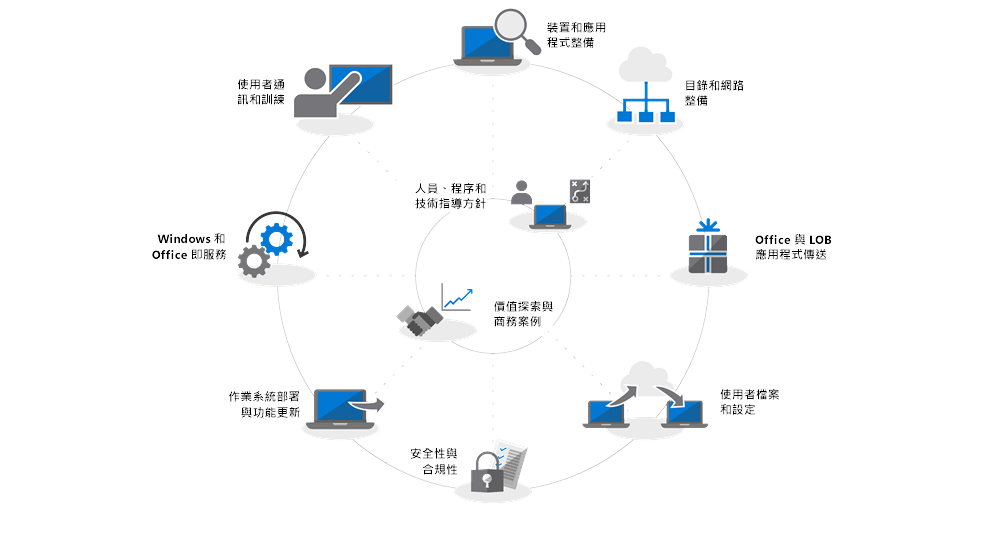

# 現代化電腦的部署中心Modern Desktop Deployment Center

請遵循以下的步驟，規劃及執行您的 Windows 10 和 Office 365 專業增強版大型部署。以下每個步驟都是整體規劃和部署程序的一部分，在階段部署中，步驟通常都是彼此平行執行。請下載[新式桌面部署及管理實驗室套件](https://aka.ms/howtoshiftlabs)，使用部署程序中反白顯示的工具進行實際操作訓練。Follow the steps below to plan and carry out your large-scale deployment of Windows 10 and Office 365 ProPlus. Each step below is part of the overall planning and deployment process with steps typically running in parallel to each other in a phased deployment. Download the free [Modern Desktop Deployment and Management Lab Kit](https://aka.ms/howtoshiftlabs) for hands-on training with the tools highlighted in the deployment process.

 

<table>
<tr class="even">
<td></td>
<td>
<strong><a href="https://aka.ms/mdd0">快速入門：人員、流程及技術指導方針</a></strong> (英文)<strong><a href="https://aka.ms/mdd0">Getting Started: People, Process and Technology Guidance</a></strong>

探索現代化電腦的優點，重大變更、考量與先前的部署以及最佳做法，以確保順利轉移到 Windows 10 和 Office 365 專業增強版。Discover the benefits of a modern desktop, major changes and considerations versus previous deployments and best practices to ensure a smooth transition to Windows 10 and Office 365 ProPlus.
</td>
<td></td>
</tr>
<tbody>
<tr class="odd">
<td></td>
<td>
<strong><a href="https://aka.ms/mdd1">步驟 1：裝置和應用程式整備</a></strong> (英文)<strong><a href="https://aka.ms/mdd1">Step 1: Device and App Readiness</a></strong>

從清查您的裝置和應用程式開始您的桌面部署專案，設定前進的優先順序，測試優先的應用程式和裝置，然後針對需要進行修復以準備部署。Begin your desktop deployment project with an inventory of your devices and apps, prioritize what you to move forward, test prioritized apps and devices, then remediate what’s needed to get ready for deployment.
</td>
<td></td>
</tr>
<tr class="even">
<td></td>
<td>
<strong><a href="https://aka.ms/mdd2">步驟 2：目錄和網路整備</a></strong> (英文)<strong><a href="https://aka.ms/mdd2">Step 2: Directory and Network Readiness</a></strong>

在 Office 365 專業增強版中的雲端連線服務及新的部署選項 (例如 Windows Autopilot) 需要 Azure Active Directory。將 Windows 映像、應用程式、驅動程式和相關檔案移到電腦時，您的網路和連線能力也是需規劃的重要區域。了解新的工具和部署選項如何減少並簡化網路流量。Cloud connected services in Office 365 ProPlus and new deployment options like Windows Autopilot require Azure Active Directory. Your network and connectivity are also important areas to plan when moving Windows images, apps, drivers and related files to your PCs. Learn how new tools and deployment options reduce and streamline network traffic.
</td>
<td></td>
</tr>
<tr class="odd">
<td></td>
<td>
<strong><a href="https://aka.ms/mdd3">步驟 3：Office 和 LOB 應用程式傳遞</a></strong> (英文)<strong><a href="https://aka.ms/mdd3">Step 3: Office and LOB App Delivery</a></strong>

請確定您的應用程式已封裝並且準備好進行自動化安裝。了解隨選即用封裝與 Office 365 專業增強版如何給予您設定、傳遞及將 Office 應用程式保持在最新狀態的新選項。Ensure your apps are packaged and ready for automated installation. Learn how Click-to-Run packaging with Office 365 ProPlus gives you new options to configure, deliver and keep your Office apps up-to-date.
</td>
<td></td>
</tr>
<tr class="even">
<td></td>
<td>
<strong><a href="https://aka.ms/mdd4">步驟 4：使用者檔案和設定</a></strong> (英文)<strong><a href="https://aka.ms/mdd4">Step 4: User Files and Settings</a></strong>

重新整理或取代電腦時，將使用者狀態備份與還原自動化以節省時間。雲端檔案同步的新選項可讓您強制執行，將每個使用者的桌面、文件和圖片資料夾同步處理至 OneDrive，以從新的 Windows 安裝順利存取檔案。When refreshing or replacing PCs, save time by automating user state backup and restore. New options for cloud file sync allow you to enforce per user sync of Desktop, Documents and Pictures folders to OneDrive for seamless file access from new Windows installs.
</td>
<td></td>
</tr>
<tr class="odd">
<td></td>
<td>
<strong><a href="https://aka.ms/mdd5">步驟 5：安全性與相容性考量事項</a></strong> (英文)<strong><a href="https://aka.ms/mdd5">Step 5: Security and Compliance Considerations</a></strong>

Windows 10 和 Office 365 專業增強版提供全新的方式來保護您的資料、裝置和使用者，並快速偵測及回應威脅。此外，了解如何在轉移到 Windows 10 時處理與磁碟加密、反惡意程式碼應用程式和原則相關的常見問題。Windows 10 and Office 365 ProPlus provide new ways to protect your data, devices and users and quickly detect and respond to threats. Also, learn how to deal with common problems associated with disk encryption, anti-malware apps and policies when moving to Windows 10.
</td>
<td></td>
</tr>
<tr class="even">
<td></td>
<td>
<strong><a href="https://aka.ms/mdd6">步驟 6：作業系統部署與功能更新</a></strong> (英文)<strong><a href="https://aka.ms/mdd6">Step 6: OS Deployment and Feature Updates</a></strong>

工作序列型部署是用於自動化大型、階段部署，以進行裸機安裝、電腦重新整理和電腦取代。升級工作序列也會協助您保持在最新的主要半年更新。Windows Autopilot 是最近的新增功能，讓新電腦收購程序現代化。Task sequence-based deployment is used to automate large scale, phased deployment for bare metal installs, PC refresh and PC replacement. Upgrade task sequences will also help you stay current with major semi-annual updates. And Windows Autopilot is a recent addition that modernizes the new PC acquisition process.
</td>
<td></td>
</tr>
<tr class="odd">
<td></td>
<td>
<strong><a href="https://aka.ms/mdd7">步驟 7：準備 Windows 和 Office 即服務</a></strong> (英文)<strong><a href="https://aka.ms/mdd7">Step 7: Preparing for Windows and Office as a Service</a></strong>

Windows 10 和 Office 365 專業增強版都會持續新增功能，以最新的發明帶領使用者體驗和安全性前進。深入了解如何保持在最新的半年和每月更新、新服務模型如何運作，以及您所擁有的工具和選項。Both Windows 10 and Office 365 ProPlus continually add new capabilities to keep bringing user experiences and security forward with the latest innovations. Learn how to stay current with semi-annual and monthly updates, how the new servicing model works and the tools and options you have.
</td>
<td></td>
</tr>
<tr class="even">
<td></td>
<td>
<strong><a href="https://aka.ms/mdd8">步驟 8：使用者的通訊和訓練</a></strong> (英文)<strong><a href="https://aka.ms/mdd8">Step 8: User Communication and Training</a></strong>

將電腦移至 Windows 10 和 Office 365 專業增強版時，請確認使用者了解新版體驗與新的工作方式。了解如何利用 Microsoft FastTrack 的使用者採用協助、訓練教材和通訊範本，以及全新的方式來監控使用者接受及其使用方式。Make sure your users are informed about new experiences and new ways of working as you shift your PCs to Windows 10 and Office 365 ProPlus. Learn how to take advantage of user adoption assistance with Microsoft FastTrack, training materials and communication templates, as well as new ways to monitor user acceptance and usage.
</td>
<td></td>
</tr>
<tr class="odd">
<td></td>
<td>
<strong><a href="https://transform.microsoft.com" target="_blank">獲得領導力：探索價值和商務案例</a></strong> (英文)<strong><a href="https://transform.microsoft.com" target="_blank">Get your Leadership on Board: Value Discovery and Business Case</a></strong>

如果您已完成部署研究、評估應用程式和裝置整備、建置部署計劃及開始試驗您的部署，但是沒有來自管理小組的必要支援或資源，以符合部署時間表，Microsoft 的 Business Value Programs 能夠提供協助。深入了解如何針對新式桌面建置商務案例，並且協助每個人利用。If you’ve done your deployment research, assessed app and device readiness, built your deployment plan and started piloting your deployment, but don’t have the support or resources needed from your management team to meet your deployment timelines, the Business Value Programs at Microsoft can help. Learn how to build a business case for a modern desktop and help get everyone on board.
</td>
<td></td>
</tr>
</tbody>
</table>
