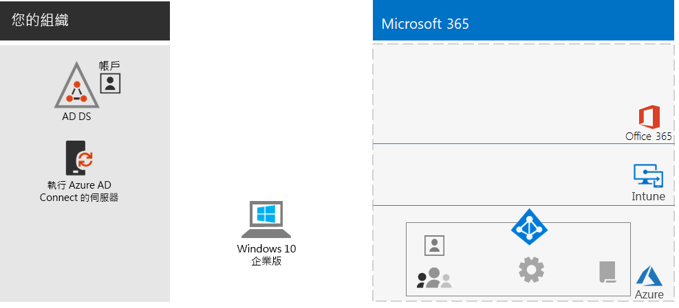
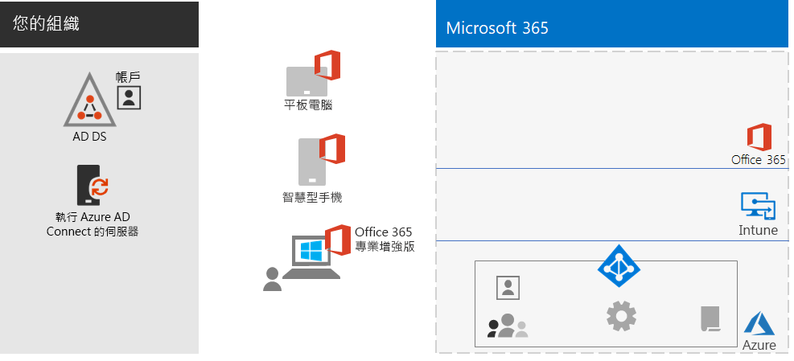
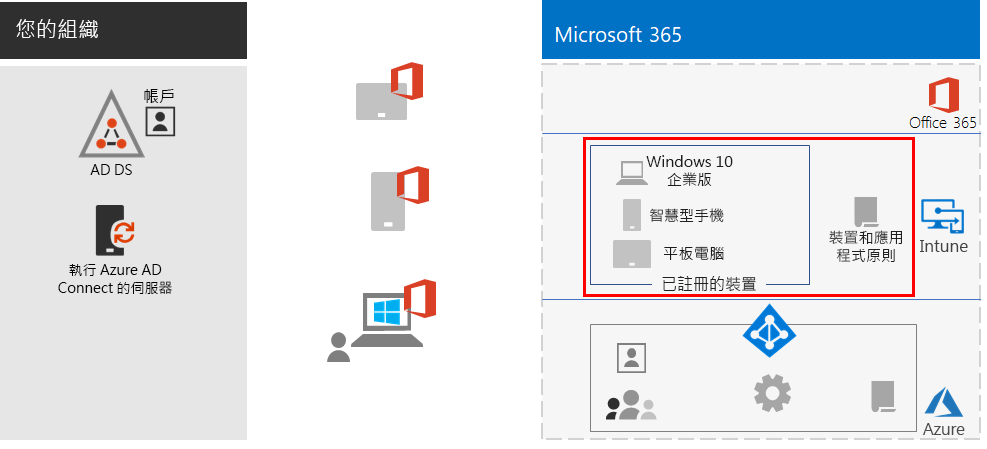
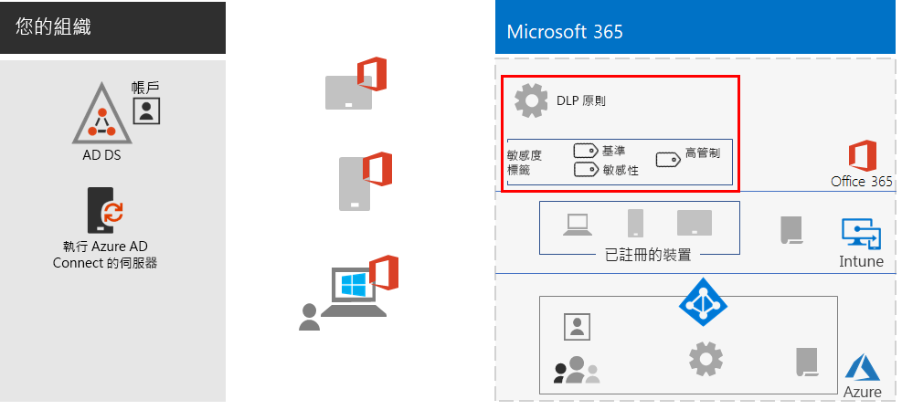
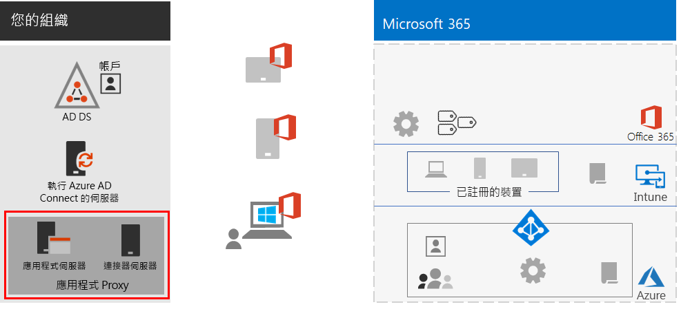
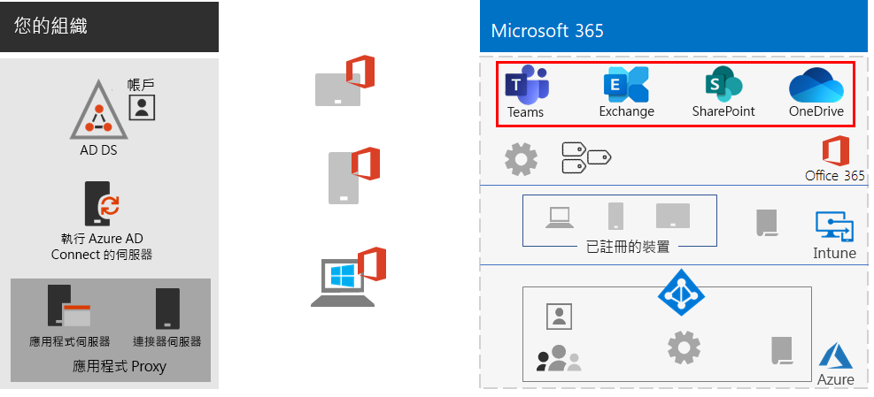
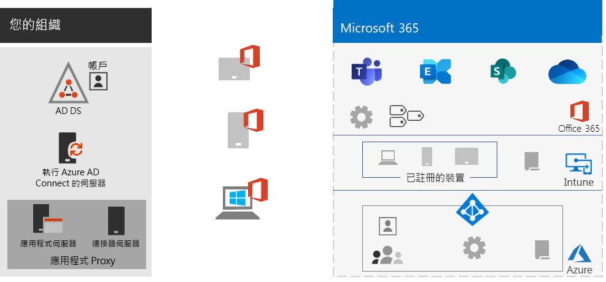
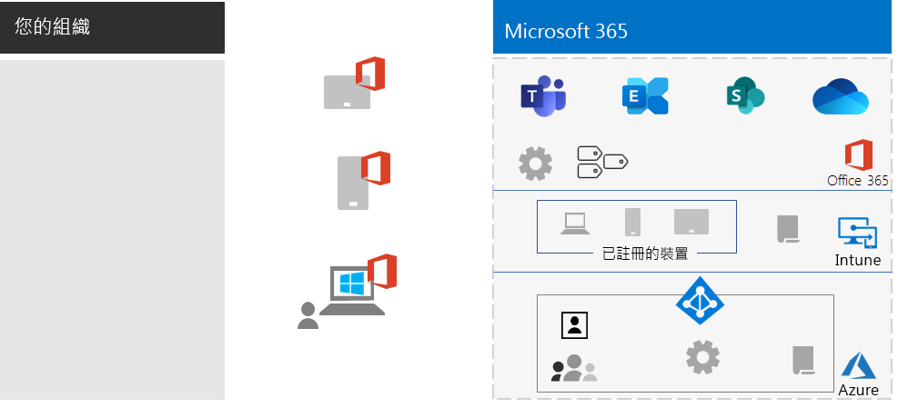

# 強化遠端工作人員

*此案例同時適用於 Microsoft 365 企業版 E3 和 E5 版本*

讓員工順利安全地在辦公室之外工作，對於多組織很重要，可以節省辦公室空間、雇用並留住不願意搬家的員工，以及降低員工的通勤時間，讓員工擁有更多時間來提高生產力和從事工作之外的減輕壓力的活動。

遠端工作 (又稱為遠距工作) 可以涵蓋以下範圍：

- 偶爾會離開辦公室去參加會議或客戶會議的員工。
- 遠端全職工作的部分員工。
- 沒有辦公室且所有員工皆為遠端的完全遠端組織。

為了支援遠端工作人員，Microsoft 365 企業版的功能組合能以高度共同作業的方式來啟用您的遠端工作人員，例如：

- 線上會議和聊天工作階段。
- 使用全域協助工具和即時共同作業的雲端式檔案儲存空間以共用工作區。
- 共用工作和工作流程來劃分並完成工作。

為了加強安全性，Microsoft 365 企業版包括：

- 強制執行驗證需求、偵測及回應高風險的登入，並封鎖選取的應用程式和不相容的裝置。
- 加密連線與雲端中的數位資產。
- 用權限來定義使用者能夠如何使用檔案。
- 資料外洩防護 (DLP) 用來防止高管制資料外洩。

遠端工作人員若要符合這些條件，請使用下列 Microsoft 365 企業版功能：

- 使用者身分識別與登入安全性
  - Azure Active Directory (Azure AD) 使用多重要素驗證 (MFA) 的使用者帳戶
  - 設定條件式存取原則，要求對有風險的登入進行 MFA
- 共同作業平台
  - 遠端工作人員可以使用 Microsoft Teams、SharePoint 和 OneDrive 來排程和參加線上視訊會議，並同時處理相同的文件
- 安全的資源存取
  - 使用 Teams、SharePoint 網站和 OneDrive 的群組和權限，以便只有經過驗證且被允許的使用者才能存取
- 外洩檔案的保護
  - Office 365 DLP 原則
  - 跟隨檔案的敏感度標籤，用於加密和權限
- Microsoft Intune 的裝置管理和安全性
  - 註冊受管理裝置
  - 個人裝置的應用程式設定
  - 裝置和應用程式原則
- 裝置的生產力應用程式
  - Office 365 專業增強版應用程式搭配 Teams、SharePoint 和 OneDrive 進行共同作業的體驗 
- Windows 10 企業版
  - 全面的安全性功能，可防範網路攻擊並防止資料外洩
- 存取內部部署應用程式
  - 具有混合式身分識別的組織可以使用 Azure AD 應用程式 Proxy，而不是使用虛擬私人網路 (VPN) 連線

下列階段逐步引導您部署適用于遠端存取的 Microsoft 365 企業版功能，並推動採用遠端工作人員。 如果您已經部署這些階段的元素，請先確認它們符合所述的需求，再移至下一個元素。

 如需此案例的 1 頁式摘要，請參閱[強化遠端工作人員海報](../media/empower-people-to-work-remotely/empower-remote-workers-scenario.pdf)。

您也可以用 [PDF](https://github.com/MicrosoftDocs/microsoft-365-docs/raw/public/microsoft-365/media/empower-people-to-work-remotely/empower-remote-workers-scenario.pdf) 或 [PowerPoint](https://github.com/MicrosoftDocs/microsoft-365-docs/raw/public/microsoft-365/media/empower-people-to-work-remotely/Empower-Remote-Workers-Poster.pptx) 格式下載此海報，以及用 Letter、Legal 或 Tabloid (11 x 17) 大小的紙張列印此海報。

## 階段1：部署適用于遠端工作人員的 Microsoft 365 功能

由於此案例需要使用廣泛且大量的功能，我們將逐步引導您瞭解 [Microsoft 365 企業版部署指南](deploy-microsoft-365-enterprise.md)的底層基礎結構和工作量區段所需的元素。

### 步驟1：遠端工作人員的底層基礎結構需求

在此步驟中，我們將造訪[底層基礎結構](deploy-foundation-infrastructure.md)，並列出啟用遠端工作人員所需的元素。

[階段 2：身分識別](identity-infrastructure.md)針對使用者身分識別和登入安全性部署下列項目：

- 針對混合式身分識別，由內部部署 Active Directory 網域服務 (AD DS) 同步處理使用者帳戶和群組。
- 針對指派權限，同步處理或使用 Azure AD 群組處理適當的成員。
- 驗證設定，例如要求 MFA。
- 設定條件式存取原則，要求對有風險的登入進行 MFA，並封鎖不支援新式驗證的用戶端。

以下是所產生的組態，強調身分識別元素。

 
針對[階段 3：Windows 10 企業版](windows10-infrastructure.md)：

- 部署基礎結構以使用 Windows 10 企業版部署新裝置，以及將您的 Windows 7 或 Windows 8.1 裝置升級到 Windows 10 企業版
- 為身分識別、威脅和資訊保護啟用全面的安全性功能

以下是使用 Windows 10 企業版裝置所產生的組態。

 
[階段 4：Office 365 專業增強版](office365proplus-infrastructure.md)，部署基礎結構以安裝 Office 365 專業增強版或在組織的裝置上將目前安裝的 Office 套件 (例如 Office 2010 或 Office 2013) 升級至 Office 365 專業增強版。 這會為您的使用者提供最佳的安全性和共同作業體驗。

以下是安裝 Office 365 專業增強版的裝置所產生的組態。

 
[階段 5：行動裝置管理](mobility-infrastructure.md)部署 Intune 裝置和應用程式管理：

- 註冊您的 Windows 10 企業版、iOS、macOS、Android 和 Android 企業版裝置，以便收到貴組織定義的功能和安全性設定。
- 適用于額外安全性的應用程式設定，以及允許或封鎖應用程式 (即使是在員工擁有的個人裝置)。
- 具備條件式存取的合規性原則，以防止不符合規範的裝置連線。

以下是所產生的組態，強調 Intune 註冊裝置和原則。

 
[階段 6：資訊保護](infoprotect-infrastructure.md)是為您的數位資產設計和設定保護：

- Office 365 DLP 原則。
- 跟隨檔案的 Office 365 敏感度標籤，用於加密和權限。

以下是所產生的組態，強調 [DLP 原則] 和 [敏感度標籤]。

 
若要存取內部部署的應用程式，您可以使用 [Azure AD 應用程式 Proxy](https://docs.microsoft.com/azure/active-directory/manage-apps/application-proxy)，這需要混合式身分識別環境。

以下是所產生的組態，強調 [應用程式 Proxy] 元件。

 
### 步驟2：適用于遠端工作人員的工作負載

若是 [Exchange Online](exchangeonline-workload.md)，部署 Exchange Online 信箱至每個使用者。

若是 [Teams](teams-workload.md)，部署 Teams 到您的使用者和群組。

若是 [SharePoint 和 OneDrive](sharepoint-online-onedrive-workload.md)，部署 SharePoint 小組或通訊網站和 OneDrive 資料夾。

以下是所產生的組態，強調工作負載。

 
### 部署結果

部署底層基礎結構和工作負載並推出 Windows 10 企業版和 Office 365 專業增強版之後，遠端工作人員：

- 受制于增強式驗證和身分識別保護。
- 在其 Windows 裝置上使用最新且最安全的 Windows 版本。
- 在其裝置上使用最新且最有生產力的 Office 套件版本。
- 受制于應用程式管理和裝置合規性原則。
- 受制于 DLP 原則和限制。
- 可以指派跟隨檔案和電子郵件的敏感度標籤，用於加密和權限。
- 可以存取內部部署應用程式，且不需要 VPN 連線。
- 可以自行工作，並使用 Teams、SharePoint 和 OneDrive 中的聊天、會議和檔案，參與跟同事的即時共同作業。

離線時 (未連線至網際網路) ，您的遠端工作人員可以變更檔案的本機複本。 當他們重新連線到網際網路時，OneDrive 就會同步處理本機複本至儲存在 Microsoft 365 訂閱中的檔案。 

如果您使用混合式身分識別，以下是貴組織的遠端工作人員所產生的組態。

 
 
以下是您組織的遠端工作人員 (如果您使用的是雲端身分識別) 所產生的組態。

## 階段2：推動使用者採用遠端工作人員

現在底層基礎結構和工作負載都已就緒，是時候推動您的遠端工作人員持續使用這些功能，讓他們能隨時隨地保持生產力。

### 步驟 1：訓練您的使用者

訓練您的遠端工作人員：

- 正確的登入程序，包括 MFA 註冊以及如何在偵測到風險時挑戰登入。
- 使用裝置，以及如何使用原則封鎖不合規裝置的存取。
- 使用允許的應用程式，以及如何使用 Intune 應用程式原則封鎖應用程式。
- Windows 10 企業版安全性功能。
- 如何使用 Outlook 的電子郵件和行事曆。
- 如何使用 [Teams](https://docs.microsoft.com/microsoftteams/training-microsoft-teams-landing-page) 來聊天、視訊會議、共用文件和往來交談。
- 如何使用 SharePoint 小組或通訊網站和 OneDrive 資料夾來瀏覽使用者文件庫中的檔案，以及那些屬於群組的檔案。
- 在本機和線上版本的檔案中，如何針對內含敏感性或高管制資料的檔案使用及套用敏感度標籤。

此訓練應該包含實際操作練習，讓您的學生可以體驗這些功能及其結果。

### 步驟2：舉辦定期的使用狀況檢閱和處理工作者意見反應

在訓練後的幾周內：

- 快速處理遠端工作者的意見反應，並微調原則和設定。
- 分析 Teams、SharePoint 網站和 OneDrive 資料夾的使用狀況，並比較其使用預期。
- 確認敏感性或高管制的檔案已正確地標示適當的敏感度標籤。

視需要重新訓練您的使用者。

### 使用者採用結果

您的遠端工作人員可以使用其 Windows 10 企業版或其他裝置與 Office 365 專業增強版，在安全的環境中存取和使用共用的 Microsoft 365 企業版雲端服務和資源，並即時開會、建立和共同作業。

## 支援遠端工作人員的其他 Microsoft 功能

您可以使用 [Azure 點對站 VPN 連線](https://docs.microsoft.com/azure/vpn-gateway/point-to-site-about)，將遠端工作人員連線至在 Azure 虛擬網路中執行的伺服器。

您可以將 [Windows 虛擬桌面](https://docs.microsoft.com/azure/virtual-desktop/overview)用於 Azure 託管的桌面和應用程式虛擬化。

## 請參閱

[工作負載和案例](deploy-workloads.md)

[Microsoft 365 生產力資源庫](https://aka.ms/productivitylibrary)https://aka.ms/productivitylibrary)

[部署指南](deploy-microsoft-365-enterprise.md)
