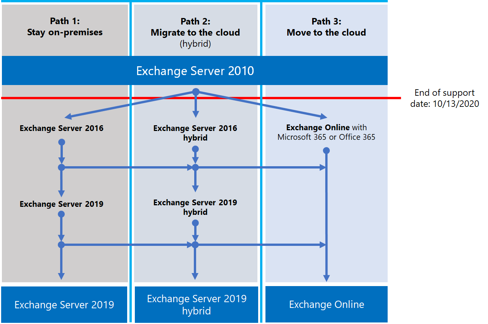

# Exchange 2010 終止支援藍圖

*本文適用於 Microsoft 365 企業版和 Office 365 企業版。*

Exchange Server 2010 在 **10 月13日，2020** 已到達其支援的結束。 如果您尚未開始從 Exchange 2010 遷移至 Microsoft 365、Office 365 或 Exchange 2016，現在是開始規劃的時間。

## *支援終止的* 意義為何？

大部分的 Microsoft 產品都有支援週期，讓他們取得新功能、錯誤修正、安全性修正等等。 此生命週期一般會從產品的初始發行版本持續10年。 此週期的結尾稱為產品的支援終止。 因為 Exchange 2010 在2020年10月13日到達其支援的結束時間，所以 Microsoft 不再提供：

- 可能發生問題的技術支援。
- 針對可能會影響伺服器穩定性和可用性問題的錯誤修正。
- 安全性修正程式可能會導致伺服器遭受安全性破壞的漏洞。
- 時區更新。

在此日期之後，您所安裝的 Exchange 2010 仍可繼續執行。 但由於上述的變更，強烈建議您儘快從 Exchange 2010 遷移。

如需接近支援終止的詳細資訊，請參閱可 [協助您從 Office 2010 伺服器和用戶端升級的資源](upgrade-from-office-2010-servers-and-products.md)。

## 我有哪些選擇？

最好是探索您的選項，並準備好遷移計畫。 您可以：

- 完整遷移至 Microsoft 365。 使用轉換、最基本的混合式或完全混合式遷移來遷移信箱。 然後移除內部部署 Exchange 伺服器和 Active Directory。
- 將 Exchange 2010 伺服器移轉到內部部署伺服器上的 Exchange 2016。

> [!IMPORTANT]
> 如果您的組織選擇將信箱遷移至 Microsoft 365，但計畫保留 DirSync 或 Azure AD Connect，以繼續從內部部署 Active Directory 管理使用者帳戶，您必須至少保留一部 Microsoft Exchange server 內部部署。 如果您移除所有 Exchange 伺服器，您將無法變更 Exchange Online 中的 Exchange 收件者，因為授權來源仍保留在您的內部部署 Active Directory 中。 需要進行變更。 在這個案例中，您有下列選項：
>
>- *建議：* 如果您已將信箱遷移至 Microsoft 365，並在10月 13 2020 日補救伺服器，請使用 Exchange 2010 連線至 Microsoft 365 和遷移信箱。 接下來，將 Exchange 2010 遷移至 Exchange 2016，並解除委任任何其餘的 Exchange 2010 伺服器。
>- 如果您未在10月13日（2020）完成信箱遷移和內部部署伺服器升級，請先將您的內部部署 Exchange 2010 伺服器升級至 Exchange 2016。 然後，使用 Exchange 2016 連接至 Microsoft 365 並遷移信箱。

> [!NOTE]
> 這有點複雜，但您也可以將您的內部部署 Exchange 2010 伺服器遷移至 Exchange 2016，將信箱遷移至 Microsoft 365。

以下是您可以採取的三個方法，以避免對 Exchange Server 2010 的支援終止。

下列各節將詳細探討每個選項。

## 移轉至 Microsoft 365

將您的電子郵件遷移至 Microsoft 365 是協助您淘汰 Exchange 2010 部署的最佳和最簡單的選項。 透過遷移至 Microsoft 365，您可以從舊技術向目前的功能進行單一躍點，包括：

- 合規性功能，例如保留原則、In-Place 和訴訟暫止、就地 eDiscovery 等等。
- Microsoft Teams。
- Power BI。
- 焦點收件匣。
- MyAnalytics。

Microsoft 365 也會先取得新功能並體驗，讓您的組織立即開始使用這些功能。 此外，您不需要擔心下列事項：

- 購買及維護硬體。
- 支付熱量和冷卻您的伺服器。
- 保持最新的安全性、產品和時區修正。
- 維護儲存和軟體以支援規範的需求。
- 升級至新版本的 Exchange。 您永遠會在 Microsoft 365 的最新版本的 Exchange。

### 我應該如何遷移至 Microsoft 365？

視您的組織而定，您可以使用一些選項來取得 Microsoft 365。 首先，您需要考慮一些事項，例如：
- 您需要移動的席位或信箱數目。
- 您想要將遷移持續多久。
- 在遷移期間，您是否需要在內部部署安裝與 Microsoft 365 之間進行無縫整合。
 
下表顯示決定使用哪一種方法的遷移選項及最重要的因素。

|移轉選項|組織規模|持續時間|
|---|---|---|
|完全移轉|少於 150 個基座|一週或更短|
|基本混合式移轉|少於 150 個基座|幾周或更短|
|完整混合式移轉|超過 150 個基座|幾周或更長|

下列各節提供這些方法的概觀。 如需詳細資訊，請參閱 [決定遷移路徑](https://support.office.com/article/Decide-on-a-migration-path-0d4f2396-9cef-43b8-9bd6-306d01df1e27)。

### 完全移轉

在完全遷移中，您可以將所有信箱、通訊群組、連絡人等，遷移至 Office 365 （在設定的日期和時間）。 完成後，請關閉您的內部部署 Exchange 伺服器，並以獨佔方式開始使用 Microsoft 365。

對於沒有許多信箱的小型組織而言，切換遷移非常棒，想要快速進入 Microsoft 365，而且不想要處理其他方法的複雜性。 不過應該在一周或更少的時間完成。 而且需要使用者重新設定其 Outlook 設定檔。 轉換遷移最多可遷移至2000個信箱，但我們建議您最多使用150。 如果您嘗試遷移其他的信箱，您可能會在您的最後期限之前，用完轉移所有信箱的時間，而且 IT 支援人員可能會因要求而淹沒，以協助使用者重新設定 Outlook。

以下是有關轉換遷移的考慮事項：

- Microsoft 365 將需要透過 TCP 埠443使用 Outlook 無所不在連線至 Exchange 2010 伺服器。
- 所有內部部署信箱會移至 Microsoft 365。
- 您需要具有使用者信箱讀取權的內部部署系統管理員帳戶。
- 您想要在 Microsoft 365 中使用的 Exchange 2010 公認的網域，必須新增為服務中已驗證的網域。
- 當您開始遷移時，以及當您開始完成階段時，Microsoft 365 會定期同步處理 Microsoft 365 和內部部署信箱。 這可讓您完成遷移，而不必擔心您的內部部署信箱中留下的電子郵件。
- 使用者將會收到其 Microsoft 365 帳戶的新臨時密碼。 他們會在第一次登入信箱時，變更他們。
- 您將需要 Microsoft 365 許可證，其中包含您要遷移的每個使用者信箱的 Exchange Online。
- 使用者必須在他們的每個裝置上設定新 Outlook 設定檔，然後再次下載電子郵件。 Outlook 將下載的電子郵件數量可能有所差異。 如需詳細資訊，請參閱 [在 Outlook 中離線工作](https://support.microsoft.com/office/f3a1251c-6dd5-4208-aef9-7c8c9522d633)。

若要深入瞭解遷移的詳細資訊，請參閱：

- [轉換電子郵件遷移所需注意的事項](/Exchange/mailbox-migration/what-to-know-about-a-cutover-migration)
- [執行電子郵件的完全遷移至 Office 365](/Exchange/mailbox-migration/cutover-migration-to-office-365)

### 基本混合式移轉

在最小的混合式或快速式遷移中，您可以在數周內將數百個信箱移至 Microsoft 365。 此方法不支援像共用空閒/忙碌行事曆資訊等高級混合式遷移功能。

最小的混合式遷移非常適合需要花更多時間將其信箱遷移至 Microsoft 365 的組織，但仍然計畫在數周內完成遷移。 您可獲得更高級 *混合式遷移* 的一些優點，而不需要許多複雜性。 您可以控制在指定時間要遷移的信箱數目和信箱數目。 將使用內部部署帳戶的使用者名稱和密碼來建立 Microsoft 365 信箱。 而且，與轉換遷移不同的是，您的使用者不需要重新建立其 Outlook 設定檔。

以下是有關最基本的混合式遷移的考慮事項：

- 您必須在內部部署 Active Directory 伺服器與 Microsoft 365 之間進行一次性目錄同步處理。
- 使用者將能夠使用與其信箱之前相同的使用者名稱和密碼登入其 Microsoft 365 信箱。
- 您將需要 Microsoft 365 許可證，其中包含您要遷移之每個使用者信箱的 Exchange Online。
- 使用者不需要在大部分的裝置上設定新的 Outlook 設定檔，不過某些老式的 Android 手機可能需要新的設定檔。 使用者不需要 redownload 他們的電子郵件。

如需詳細資訊，請參閱 [使用最小混合式以快速將 Exchange 信箱遷移至 Office 365](/Exchange/mailbox-migration/use-minimal-hybrid-to-quickly-migrate)。

### 完整混合式

在完整的混合式遷移中，您有許多成百上千的信箱，您可以將部分或全部移至 Microsoft 365。 因為這些移轉通常是較為長期的作業，混合式移轉能夠：

- 向內部部署使用者顯示 Microsoft 365 中使用者的空閒/忙碌行事曆資訊，反之亦然。
- 請參閱包含內部部署和 Microsoft 365 中的收件者的統一全域通訊清單。
- 不論是內部部署或 Microsoft 365，請查看所有使用者的完整 Outlook 收件者屬性。
- 使用 TLS 和憑證來保護內部部署 Exchange 伺服器與 Office 365 之間的電子郵件通訊。
- 將內部部署 Exchange 伺服器與 Microsoft 365 之間傳送的郵件視為內部部署，讓他們能夠：
  - 由傳輸和規範代理程式正確評估並處理，並以內部郵件為目標。
  - 略過反垃圾郵件篩選。

完整混合式移轉最適合欲持續處於混合式組態數個月或更久的組織。 您可以取得本節先前所列的功能，也就是目錄同步處理、整合的相容性功能，以及使用線上信箱移動將信箱移至及移除 Microsoft 365 的功能。 Microsoft 365 變成內部部署組織的分機號碼。

有關完整混合式遷移的考慮事項：

- 它們不適合所有的組織。 由於完整混合式遷移的複雜度，低於100個信箱的組織，通常不會看到調整工作量與成本的好處。 在這種情況下，建議您改為考慮轉換或最少的混合式遷移。
- 您必須在您的內部部署 Active Directory 伺服器與 Microsoft 365 之間，使用 Azure Active Directory (Azure AD) Connect，設定目錄同步處理。
- 使用者可以使用使用者登入本機網路時所使用的相同使用者名稱和密碼登入他們的 Microsoft 365 信箱。  (此功能需要使用密碼同步處理和/或 Active Directory Federation Services) 進行 Azure AD 連接。
- 您需要一個 Microsoft 365 許可證，其中包含您要遷移之每個使用者信箱的 Exchange Online。
- 使用者不需要在大部分的裝置上設定新的 Outlook 設定檔，不過某些老式的 Android 手機可能需要新的設定檔。 使用者不需要 redownload 他們的電子郵件。

> [!IMPORTANT]
> 如果您的組織選擇將信箱遷移至 Microsoft 365，但計畫保留 DirSync 或 Azure AD Connect，以繼續從內部部署 Active Directory 管理使用者帳戶，您必須在內部部署中至少保留一部 Exchange server。 若所有 Exchange 伺服器都已移除，您將無法變更 Exchange Online 中的 Exchange 收件者。 這是因為授權單位來源會保留在您內部部署的 Active Directory 中，因此必須在那裡進行變更。

如果完整的混合式遷移是正確的，請參閱下列有用資源：

- [Exchange 部署助理](/exchange/exchange-deployment-assistant)
- [Exchange Server 混合式部署](/exchange/exchange-hybrid)
- [混合組態精靈](/exchange/hybrid-configuration-wizard)
- [混合組態精靈常見問題集](/exchange/hybrid-configuration-wizard-faqs)
- [混合式部署必要條件](/exchange/hybrid-deployment-prerequisites)

## 升級至較新版本的 Exchange Server 內部部署

我們強烈相信您可以完全遷移至 Microsoft 365，以取得最佳的價值和使用者經驗。 不過，我們知道某些組織必須保留某些 Exchange 伺服器內部部署。 這可能是由於法規需求而定，為了保證資料不會儲存在外部資料中心，因為您有無法在雲端中滿足的獨特設定或需求，或是因為您仍然使用 Active Directory 內部部署，所以您需要 Exchange 來管理雲端信箱。 在任何情況下，如果您保留 Exchange 內部部署，您應該確定 Exchange 2010 環境已升級至至少 Exchange 2013 或 Exchange 2016。

為了獲得最佳的體驗，我們建議您將剩餘的內部部署環境升級為 Exchange 2016。 如果您想要直接從 Exchange Server 2010 移至 Exchange Server 2016，您不需要安裝 Exchange Server 2013。

Exchange 2016 包含舊版 Exchange 的所有功能。 雖然有些功能只能在 Microsoft 365 中使用，但它會與 Microsoft 365 的體驗非常接近。 請查看您遺漏的一些事項：

|Exchange 版本|功能|
|---|---|
|**Exchange 2013**|簡化的架構可將伺服器角色的數目降至三個 (信箱、用戶端存取、Edge Transport) |
||可協助保護機密資訊防止外洩的資料外洩防護原則 (DLP)|
||改進的 Outlook Web App 體驗|
|**Exchange 2016**|*來自 Exchange 2013 和 ... 的功能*|
||更進一步簡化的伺服器角色，只有信箱和邊際傳輸|
||與 SharePoint 整合一併改善的 DLP|
||改善的資料庫恢復|
||線上文件共同作業|

|考量事項|其他資訊|
|---|---|
|終止支援日期|就像 Exchange 2010，每個 Exchange 版本都有自己的支援終止日期：  Exchange 2013 - 2023 年 4 月 Exchange 2016 - 2025 年 10 月  更早的支援終止日期，您將需要執行另一個遷移。 2023 年 4 月其實不如想像中的遙遠！|
|移轉到 Exchange 2013 或 Exchange 2016 的方法|無論您選擇的是 Exchange 2013 或 Exchange 2016，從 Exchange 2010 移轉到更新版本的方法都是相同的：  將 Exchange 2013 或2016安裝到現有的 Exchange 2010 組織。 將服務和其他基礎結構移至 Exchange 2013 或2016。 將信箱和公用資料夾移至 Exchange 2013 或2016解除委任保留 Exchange 2010 伺服器。|
|版本共存|當移轉至 Exchange 2013 或 Exchange 2016 時，您可以將任一版本安裝到現有的 Exchange 2010 組織中。 這可讓您安裝一或多部 Exchange 2013 或 Exchange 2016 伺服器，並進行遷移。|
|伺服器硬體|自 Exchange 2010 起，伺服器硬體需求已變更。 請確認您的硬體是否相容。 若要瞭解更多關於每個版本的硬體需求，請參閱：  [Exchange 2016 系統需求](/Exchange/plan-and-deploy/system-requirements?view=exchserver-2016) [Exchange 2013 系統需求](/Exchange/exchange-2013-system-requirements-exchange-2013-help)  隨著 Exchange 效能的大幅改善，以及較新伺服器中的計算能力和儲存容量增加，您可能需要較少的伺服器來支援相同數量的信箱。|
|作業系統版本|每個版本的最低支援作業系統版本為：  Exchange 2016-Windows Server 2012 Exchange 2013-Windows Server 2008 R2 SP1  如需作業系統支援的相關詳細資訊，請參閱 [Exchange Server 支援性總表](/exchange/plan-and-deploy/supportability-matrix)。|
|Active Directory 樹系功能等級|每個版本的最低支援 Active Directory 樹系功能等級為：  Exchange 2016-Windows Server 2008 R2 SP1 Exchange 2013-Windows Server 2003  如需樹系功能等級支援的相關詳細資訊，請參閱 [Exchange Server 支援性總表](/exchange/plan-and-deploy/supportability-matrix)。|
|Office 用戶端版本|每個版本的最低支援 Office 用戶端版本為：  Exchange 2016-Office 2010 (包含最新的更新)  Exchange 2013-Office 2007 SP3  若要瞭解更多有關 Office 用戶端支援的資訊，請參閱 [Exchange 支援清單](/exchange/plan-and-deploy/supportability-matrix)。||| 

請使用下列資源協助您進行遷移：

- [Exchange 部署助理](/exchange/exchange-deployment-assistant)
- 適用於 Exchange [2016](/exchange/plan-and-deploy/active-directory/ad-schema-changes?view=exchserver-2016)、[2013](/Exchange/exchange-2013-active-directory-schema-changes-exchange-2013-help) 的 Active Directory 結構描述變更
- 適用於 Exchange [2016](/exchange/plan-and-deploy/system-requirements?view=exchserver-2016)、[2013](/Exchange/exchange-2013-system-requirements-exchange-2013-help) 的系統需求
- 適用於 Exchange [2016](/exchange/plan-and-deploy/prerequisites?view=exchserver-2016)、[2013](/Exchange/exchange-2013-prerequisites-exchange-2013-help) 的先決條件

## 適用於 Office 2010 用戶端與伺服器和 Windows 7 的選項摘要

如需適用於 Office 2010 用戶端與伺服器和 Windows 7 的升級、移轉和移至雲端選項的視覺摘要，請參閱[終止支援海報](../downloads/Office2010Windows7EndOfSupport.pdf)。

這份單頁海報說明您可以採取的各種途徑，以回應 Office 2010 用戶端和伺服器產品及 Windows 7 對支援的支援，並會反白顯示 Microsoft 365 企業版中的慣用路徑和選項支援。

您也可以 [下載](https://github.com/MicrosoftDocs/microsoft-365-docs/raw/public/microsoft-365/downloads/Office2010Windows7EndOfSupport.pdf) 此標牌，並以 letter、法律或卡片 (11 x 17) 格式來列印。

## 如果我需要協助，該怎麼辦？

如果您要遷移至 Microsoft 365，您可能有資格使用 Microsoft FastTrack 服務。 FastTrack 提供最佳作法、工具及資源，可讓您以盡可能順利的方式遷移至 Microsoft 365。 尤其可貴的是，您可以讓技術支援工程師逐步引導您進行規劃及設計，以遷移您的最後一個信箱。 如需 FastTrack 的詳細資訊，請參閱 [Microsoft FastTrack](https://fasttrack.microsoft.com/)。

如果您在遷移至 Microsoft 365 時發生問題，而您沒有使用 FastTrack，或是您要遷移至較新版本的 Exchange 伺服器，則可以使用下列資源：

- [技術社群](https://social.technet.microsoft.com/Forums/office/home?category=exchangeserver)
- [客戶支援](https://support.microsoft.com/gp/support-options-for-business)

## 相關文章

[可幫助您從 Office 2010 伺服器和用戶端升級的資源](upgrade-from-office-2010-servers-and-products.md)