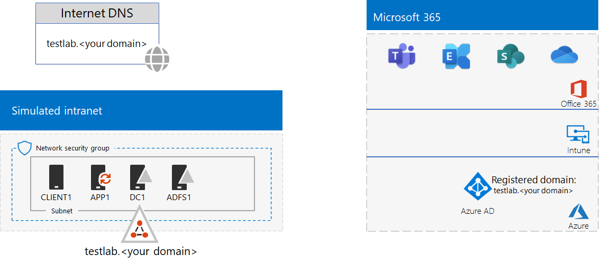

# <a name="federated-identity-for-your-microsoft-365-test-environment"></a>Microsoft 365 測試環境的同盟身分識別

*此測試實驗室指南可用於 enterprise 和 Office 365 企業測試環境的 Microsoft 365。*

Microsoft 365 支援同盟身分識別。這表示 Microsoft 365 的連線使用者指的是 Microsoft 365 信任的同盟驗證伺服器，而不是執行認證本身的驗證。如果使用者的認證正確，同盟驗證伺服器會發出安全性權杖，用戶端再傳送到 Microsoft 365 做為驗證證明。同盟身分識別可進行 Microsoft 365 訂閱驗證的卸載與擴展，以及進階驗證及安全性案例。
  
本文說明如何設定您的 Microsoft 365 測試環境的同盟驗證，如下所示：


  
此組態包含：
  
- Microsoft 365 E5 試用版或實際執行訂閱。
    
- 簡化的組織內部網路連接至網際網路，由 Azure 虛擬網路之子網上的五台虛擬機器所組成 (DC1、APP1、CLIENT1、ADFS1 和 PROXY1) 。 Azure AD Connect 會在 APP1 上執行，將 Active Directory 網域服務網域中的帳戶清單同步處理至 Microsoft 365。 PROXY1 會接收傳入的驗證要求。 ADFS1 會使用 DC1 驗證憑證，併發出安全性權杖。
    
設定此測試環境包含五個階段：
- [階段 1：設定適用於 Microsoft 365 測試環境的密碼雜湊同步處理](#phase-1-configure-password-hash-synchronization-for-your-microsoft-365-test-environment)
- [階段 2：建立 AD FS 伺服器](#phase-2-create-the-ad-fs-server)
- [階段 3：建立 Web Proxy 伺服器](#phase-3-create-the-web-proxy-server)
- [階段 4：建立自我簽署的憑證並設定 ADFS1 及 PROXY1](#phase-4-create-a-self-signed-certificate-and-configure-adfs1-and-proxy1)
- [階段5：設定 Microsoft 365 的同盟身分識別](#phase-5-configure-microsoft-365-for-federated-identity)
    
> [!NOTE]
> 您無法使用 Azure 試用訂閱來設定此測試環境。
  
## <a name="phase-1-configure-password-hash-synchronization-for-your-microsoft-365-test-environment"></a>階段 1：設定適用於 Microsoft 365 測試環境的密碼雜湊同步處理

依照 [Microsoft 365 的密碼雜湊同步](password-hash-sync-m365-ent-test-environment.md)處理中的指示進行。 您產生的設定如下所示：
  

  
此組態包含：
  
- Microsoft 365 E5 試用版或付費訂閱。
- 簡化的組織內部網路連接至網際網路，由 Azure 虛擬網路子網上的 DC1、APP1 和 CLIENT1 虛擬機器所組成。 Azure AD Connect 會在 APP1 執行，以便定期將 TESTLAB Active Directory 網域服務 (AD DS) 網域同步處理至您的 Microsoft 365 訂閱的 Azure AD 租使用者。

## <a name="phase-2-create-the-ad-fs-server"></a>階段 2：建立 AD FS 伺服器

AD FS 伺服器在 Microsoft 365 和 DC1 上裝載 corp.contoso.com 網域中的帳戶之間提供同盟驗證。
  
若要為 ADFS1 建立 Azure 虛擬機器，請為基本設定填入訂閱和資源群組的名稱和 Azure 位置，然後在本機電腦上的 Azure PowerShell 命令提示字元執行這些命令。
  
```powershell
$subscrName="<your Azure subscription name>"
$rgName="<the resource group name of your Base Configuration>"
$vnetName="TlgBaseConfig-01-VNET"
# NOTE: If you built your simulated intranet with Azure PowerShell, comment the previous line with a "#" and remove the "#" from the next line.
#$vnetName="TestLab"
Connect-AzAccount
Select-AzSubscription -SubscriptionName $subscrName
$staticIP="10.0.0.100"
$locName=(Get-AzResourceGroup -Name $rgName).Location
$vnet=Get-AzVirtualNetwork -Name $vnetName -ResourceGroupName $rgName
$pip = New-AzPublicIpAddress -Name ADFS1-PIP -ResourceGroupName $rgName -Location $locName -AllocationMethod Dynamic
$nic = New-AzNetworkInterface -Name ADFS1-NIC -ResourceGroupName $rgName -Location $locName -SubnetId $vnet.Subnets[0].Id -PublicIpAddressId $pip.Id -PrivateIpAddress $staticIP
$vm=New-AzVMConfig -VMName ADFS1 -VMSize Standard_D2_v2
$cred=Get-Credential -Message "Type the name and password of the local administrator account for ADFS1."
$vm=Set-AzVMOperatingSystem -VM $vm -Windows -ComputerName ADFS1 -Credential $cred -ProvisionVMAgent -EnableAutoUpdate
$vm=Set-AzVMSourceImage -VM $vm -PublisherName MicrosoftWindowsServer -Offer WindowsServer -Skus 2016-Datacenter -Version "latest"
$vm=Add-AzVMNetworkInterface -VM $vm -Id $nic.Id
$vm=Set-AzVMOSDisk -VM $vm -Name "ADFS-OS" -DiskSizeInGB 128 -CreateOption FromImage -StorageAccountType "Standard_LRS"
New-AzVM -ResourceGroupName $rgName -Location $locName -VM $vm
```

接下來，使用 ADFS1 本機系統管理員帳戶名稱和密碼，以使用 [Azure 入口網站](https://portal.azure.com)連線到 ADFS1 虛擬機器，然後開啟 Windows PowerShell 命令提示字元。
  
若要檢查 ADFS1 和 DC1 之間的名稱解析和網路通訊，請執行 **ping dc1.corp.contoso.com** 命令，並檢查有四個回覆。
  
接下來在 ADFS1 上的 Windows PowerShell 命令提示字元使用以下命令將 ADFS1 虛擬機器加入 CORP 網域。
  
```powershell
$cred=Get-Credential -UserName "CORP\User1" -Message "Type the User1 account password."
Add-Computer -DomainName corp.contoso.com -Credential $cred
Restart-Computer
```

您產生的設定如下所示：
  

  
## <a name="phase-3-create-the-web-proxy-server"></a>階段 3：建立 Web Proxy 伺服器

PROXY1 提供嘗試驗證 ADFS1 的使用者之間驗證訊息的 Proxy。
  
若要為 PROXY1 建立 Azure 虛擬機器，請填入資源群組的名稱和 Azure 位置，然後在本機電腦上的 Azure PowerShell 命令提示字元執行這些命令。
  
```powershell
$rgName="<the resource group name of your Base Configuration>"
$vnetName="TlgBaseConfig-01-VNET"
# NOTE: If you built your simulated intranet with Azure PowerShell, comment the previous line with a "#" and remove the "#" from the next line.
#$vnetName="TestLab"
$staticIP="10.0.0.101"
$locName=(Get-AzResourceGroup -Name $rgName).Location
$vnet=Get-AzVirtualNetwork -Name $vnetName -ResourceGroupName $rgName
$pip = New-AzPublicIpAddress -Name PROXY1-PIP -ResourceGroupName $rgName -Location $locName -AllocationMethod Static
$nic = New-AzNetworkInterface -Name PROXY1-NIC -ResourceGroupName $rgName -Location $locName -SubnetId $vnet.Subnets[0].Id -PublicIpAddressId $pip.Id -PrivateIpAddress $staticIP
$vm=New-AzVMConfig -VMName PROXY1 -VMSize Standard_D2_v2
$cred=Get-Credential -Message "Type the name and password of the local administrator account for PROXY1."
$vm=Set-AzVMOperatingSystem -VM $vm -Windows -ComputerName PROXY1 -Credential $cred -ProvisionVMAgent -EnableAutoUpdate
$vm=Set-AzVMSourceImage -VM $vm -PublisherName MicrosoftWindowsServer -Offer WindowsServer -Skus 2016-Datacenter -Version "latest"
$vm=Add-AzVMNetworkInterface -VM $vm -Id $nic.Id
$vm=Set-AzVMOSDisk -VM $vm -Name "PROXY1-OS" -DiskSizeInGB 128 -CreateOption FromImage -StorageAccountType "Standard_LRS"
New-AzVM -ResourceGroupName $rgName -Location $locName -VM $vm
```

> [!NOTE]
> PROXY1 指派了靜態公用 IP 位址，因為您將建立指向它的公開 DNS 記錄，且當您重新啟動 PROXY1 虛擬機器時它不得變更。
  
接下來，新增規則至網路安全性群組的 CorpNet 子網，以允許來自網際網路的未經許可輸入流量，以 PROXY1's 私人 IP 位址和 TCP 埠443。 在本機電腦的 Azure PowerShell 命令提示字元中執行這些命令。
  
```powershell
$rgName="<the resource group name of your Base Configuration>"
Get-AzNetworkSecurityGroup -Name CorpNet -ResourceGroupName $rgName | Add-AzNetworkSecurityRuleConfig -Name "HTTPS-to-PROXY1" -Description "Allow TCP 443 to PROXY1" -Access "Allow" -Protocol "Tcp" -Direction "Inbound" -Priority 101 -SourceAddressPrefix "Internet" -SourcePortRange "*" -DestinationAddressPrefix "10.0.0.101" -DestinationPortRange "443" | Set-AzNetworkSecurityGroup
```

接下來，使用 PROXY1 本機系統管理員帳戶名稱和密碼，以使用 [Azure 入口網站](https://portal.azure.com)連線到 PROXY1 虛擬機器，然後在 PROXY1 上開啟 Windows PowerShell 命令提示字元。
  
若要檢查 PROXY1 和 DC1 之間的名稱解析和網路通訊，請執行 **ping dc1.corp.contoso.com** 命令，並檢查有四個回覆。
  
接下來在 PROXY1 上的 Windows PowerShell 命令提示字元使用以下命令將 PROXY1 虛擬機器加入 CORP 網域。
  
```powershell
$cred=Get-Credential -UserName "CORP\User1" -Message "Type the User1 account password."
Add-Computer -DomainName corp.contoso.com -Credential $cred
Restart-Computer
```

使用本機電腦上的下列 Azure PowerShell 命令，顯示 PROXY1 的公用 IP 位址。
  
```powershell
Write-Host (Get-AzPublicIpaddress -Name "PROXY1-PIP" -ResourceGroup $rgName).IPAddress
```

接下來，與公用 DNS 提供者合作，建立 **fs.testlab.**\<*your DNS domain name*> 的新公用 DNS A 記錄，其會解析到 **Write-Host** 命令所顯示的 IP 位址。**fs.testlab.**\<*your DNS domain name*> 也稱為*同盟服務 FQDN*。
  
接下來，使用 CORP\\User1 認證，以使用 [Azure 入口網站](https://portal.azure.com)連線到 DC1 虛擬機器，然後在系統管理員層級 Windows PowerShell 命令提示字元執行下列命令：
  
```powershell
Add-DnsServerPrimaryZone -Name corp.contoso.com -ZoneFile corp.contoso.com.dns
Add-DnsServerResourceRecordA -Name "fs" -ZoneName corp.contoso.com -AllowUpdateAny -IPv4Address "10.0.0.100" -TimeToLive 01:00:00
```
這些命令會建立內部 DNS A 記錄，讓 Azure 虛擬網路上的虛擬機器能夠解析內部同盟服務 FQDN，以 ADFS1's 私人 IP 位址。
  
您產生的設定如下所示：
  

  
## <a name="phase-4-create-a-self-signed-certificate-and-configure-adfs1-and-proxy1"></a>階段 4：建立自我簽署的憑證並設定 ADFS1 及 PROXY1

在這個階段，您可以為同盟服務 FQDN 建立自我簽署的數位憑證，並將 ADFS1 和 PROXY1 設定為 AD FS 伺服器陣列。
  
首先，使用 CORP\\User1 認證，以使用 [Azure 入口網站](https://portal.azure.com)連線到 DC1 虛擬機器，然後開啟系統管理員層級 Windows PowerShell 命令提示字元。
  
接下來，在 DC1 上的 Windows PowerShell 命令提示字元處，使用此命令建立 AD FS 服務帳戶：
  
```powershell
New-ADUser -SamAccountName ADFS-Service -AccountPassword (read-host "Set user password" -assecurestring) -name "ADFS-Service" -enabled $true -PasswordNeverExpires $true -ChangePasswordAtLogon $false
```
請注意，此命令會提示您提供帳戶密碼。 選擇強式密碼，並將其記錄在安全的位置。 您將需要此階段和階段5。
  
使用 CORP\\User1 認證以使用 [Azure 入口網站](https://portal.azure.com)連線到 ADFS1 虛擬機器。開啟 ADFS1 上的系統管理員層級 Windows PowerShell 命令提示字元，填入您的同盟服務 FQDN，然後執行這些命令以建立自我簽署的憑證：
  
```powershell
$fedServiceFQDN="<federation service FQDN>"
New-SelfSignedCertificate -DnsName $fedServiceFQDN -CertStoreLocation "cert:\LocalMachine\My"
New-Item -path c:\Certs -type directory
New-SmbShare -name Certs -path c:\Certs -changeaccess CORP\User1
```

接下來，使用這些步驟，將新的自我簽署憑證儲存為檔案。
  
1. 選取 [ **開始**]，輸入 **mmc.exe**，然後按 **enter**。
    
2. 選取 **[** 檔案] [  >  **新增/移除嵌入式管理單元**]。
    
3. 在 [ **新增或移除嵌入式管理單元**] 中，按兩下可用之嵌入式管理單元清單中的 [ **證書** ]，選取 [ **電腦帳戶**]，然後選取 **[下一步]**。
    
4. 在 [ **選取電腦**] 中，選取 **[完成]**，然後選取 **[確定]**。
    
5. 在樹狀窗格中，開啟 **[憑證 (本機電腦)] > [個人] > [憑證]**。
    
6. 選取並按住 (或以滑鼠右鍵按一下您的同盟服務 FQDN) 憑證，選取 [ **所有**工作]，然後選取 [ **匯出**]。
    
7. 在 [ **歡迎** ] 頁面上，選取 **[下一步]**。
    
8. 在 [ **匯出私密金鑰** ] 頁面上，選取 **[是]**，然後選取 **[下一步]**。
    
9. 在 [ **匯出檔案格式** ] 頁面上，選取 [ **匯出所有擴充屬性**]，然後選取 **[下一步]**。
    
10. 在 [**安全性**] 頁面上，選取 [**密碼**]，然後在 [**密碼**] 和 [**確認密碼**] 中輸入密碼。
    
11. 在 [ **要匯出的** 檔案] 頁面上，選取 **[流覽]**。
    
12. 流覽至 [ **C： \\ 證書**] 資料夾，在 [**檔案名**] 中輸入**SSL** ，然後選取 [**儲存]。**
    
13. 在 [ **要匯出的** 檔案] 頁面上，選取 **[下一步]**。
    
14. 在 [ **完成憑證匯出] 嚮導** 頁面上，選取 **[完成]**。 出現提示時，請選取 **[確定]**。
    
接下來，在 ADFS1 上的 Windows PowerShell 命令提示字元中使用此命令安裝 AD FS 服務：
  
```powershell
Install-WindowsFeature ADFS-Federation -IncludeManagementTools
```

等待安裝完成。
  
接下來，使用下列步驟設定 AD FS 服務：
  
1. 選取 [ **開始**]，然後選取 [ **伺服器管理員** ] 圖示。
    
2. 在 [伺服器管理員] 的樹狀窗格中，選取 [ **AD FS**]。
    
3. 在頂端的工具列中，選取橙色的警告符號，然後選取 [在 **此伺服器上設定同盟服務**]。
    
4. 在 [Active Directory Federation Services 設定向導] 的 [ **歡迎** ] 頁面上，選取 **[下一步]**。
    
5. 在 [連線 **到 AD DS]** 頁面上，選取 **[下一步]**。
    
6. 在 [指定服務內容]**** 頁面上：
    
  - 在 [ **SSL 憑證**] 中，選取向下箭號，然後選取具有同盟服務 FQDN 名稱的憑證。
    
  - 在 [ **同盟服務顯示名稱**] 中，輸入您虛擬組織的名稱。
    
  - 選取 [下一步]****。
    
7. 在 [**指定服務帳戶**] 頁面上，選取 [**選取****帳戶名稱**]。
    
8. 在 [ **選取使用者或服務帳戶**] 中，輸入 **ADFS-服務**]，選取 [ **檢查名稱**]，然後選取 **[確定]**。
    
9. 在 [ **帳戶密碼**] 中輸入 ADFS-Service 帳戶的密碼，然後選取 **[下一步]**。
    
10. 在 [ **指定設定資料庫** ] 頁面上，選取 **[下一步]**。
    
11. 在 [ **複查選項** ] 頁面上，選取 **[下一步]**。
    
12. 在 [ **先決條件檢查** ] 頁面上，選取 [ **設定**]。

13. 在 [ **結果** ] 頁面上，選取 [ **關閉**]。
    
14. 選取 [ **開始**]，選取 power 圖示，選取 [ **重新開機**]，然後選取 [ **繼續**]。
    
使用 CORP\\User1 帳戶認證，從 [Azure 入口網站](https://portal.azure.com)連線到 PROXY1。
  
接下來，使用這些步驟在 **PROXY1 和 APP1** 上安裝自我簽署的憑證。
  
1. 選取 [ **開始**]，輸入 **mmc.exe**，然後按 **enter**。
    
2. 選取 [檔案] **> [新增/移除嵌入式管理單元**]。
    
3. 在 [ **新增或移除嵌入式管理單元**] 中，按兩下可用之嵌入式管理單元清單中的 [ **證書** ]，選取 [ **電腦帳戶**]，然後選取 **[下一步]**。
    
4. 在 [ **選取電腦**] 中，選取 **[完成]**，然後選取 **[確定]**。
    
5. 在樹狀窗格中，) 個人憑證中，開啟** (本機電腦的憑證**  >  **Personal**  >  ** **。
    
6. 選取並按住 (，或以滑鼠右鍵按一下 [) **個人**]，選取 [ **所有**工作]，然後選取 [匯 **入**]。
    
7. 在 [ **歡迎** ] 頁面上，選取 **[下一步]**。
    
8. 在 [**要匯入**的檔案] 頁面上，輸入** \\ \\ adfs1 \\ 證書的 \\ ssl .pfx**]，然後選取 **[下一步]**。
    
9. 在 [ **私密金鑰保護** ] 頁面上，于 [ **密碼**] 中輸入憑證密碼，然後選取 **[下一步]。**
    
10. 在 [ **憑證存放區** ] 頁面上，選取 **[下一步]。**
    
11. 在 [ **完成** ] 頁面上，選取 **[完成]**。
    
12. 在 [ **憑證存放區** ] 頁面上，選取 **[下一步]**。
    
13. 出現提示時，請選取 **[確定]**。
    
14. 在樹狀窗格中，選取 [ **憑證**]。
    
15. 選取並按住 (，或以滑鼠右鍵按一下憑證) ，然後選取 [ **複製**]。
    
16. 在樹狀窗格中，開啟 [**信任的憑證授權單位**單位]  >  **憑證**。
    
17. 將滑鼠指標移至已安裝憑證的清單下，選取並按住 (或以滑鼠右鍵按一下 [) ]，然後選取 [ **貼**上]。
    
開啟系統管理員層級 PowerShell 命令提示字元，執行下列命令：
  
```powershell
Install-WindowsFeature Web-Application-Proxy -IncludeManagementTools
```

等待安裝完成。
  
使用下列步驟設定 Web 應用程式 Proxy 服務以使用 ADFS1 作為其同盟伺服器：
  
1. 選取 [ **開始**]，然後選取 [ **伺服器管理員**]。
    
2. 在樹狀窗格中，選取 [ **遠端存取**]。
    
3. 在頂端的工具列中，選取橙色的警告符號，然後選取 [ **開啟 Web 應用程式 Proxy]**。
    
4. 在 [Web 應用程式 Proxy 設定向導] 的 [ **歡迎** ] 頁面上，選取 **[下一步]**。
    
5. 在 [同盟伺服器]**** 頁面上：
    
  - 在 [ **同盟服務名稱** ] 方塊中，輸入您的同盟服務 FQDN。
    
  - 在 [ **使用者名稱** ] 方塊中，輸入 **CORP \\ User1**。
    
  - 在 [ **密碼** ] 方塊中，輸入 User1 帳戶的密碼。
    
  - 選取 [下一步]****。
    
6. 在 [ **AD FS Proxy 憑證** ] 頁面上，選取向下箭號，選取具有您同盟服務 FQDN 的憑證，然後選取 **[下一步]**。
    
7. 在 [ **確認** ] 頁面上，選取 [ **設定**]。
    
8. 在 [ **結果** ] 頁面上，選取 [ **關閉**]。
    
## <a name="phase-5-configure-microsoft-365-for-federated-identity"></a>階段5：設定 Microsoft 365 的同盟身分識別

以 CORP\\User1 帳戶認證使用 [Azure 入口網站](https://portal.azure.com)連線到 APP1 虛擬機器。
  
使用下列步驟為同盟驗證設定 Azure AD Connect 與 Microsoft 365 訂閱：
  
1. 從桌面，按兩下 [Azure AD Connect]****。
    
2. 在 [ **歡迎使用 AZURE AD Connect]** 頁面上，選取 [ **設定**]。
    
3. 在 [ **其他** 工作] 頁面上，選取 [ **變更使用者登入**]，然後選取 **[下一步]**。
    
4. 在 [連線 **到 AZURE AD]** 頁面上，輸入您的全域系統管理員帳戶名稱和密碼，然後選取 **[下一步]**。
    
5. 在 [ **使用者登入** ] 頁面上，選取 [ **同盟與 AD FS**]，然後選取 **[下一步]**。
    
6. 在 [ **AD fs 伺服器**陣列] 頁面上，選取 [**使用現有的 AD FS 伺服器陣列**]，在 [**伺服器名稱**] 方塊中輸入**ADFS1** ，然後選取 **[下一步]**。
    
7. 當系統提示您輸入伺服器認證時，請輸入 CORP \\ User1 帳戶的認證，然後選取 **[確定]**。
    
8. 在 [**網域管理員**認證] 頁面上，于 [使用者**名稱**] 方塊中輸入**CORP \\ User1** ，然後在 [**密碼**] 方塊中輸入帳戶密碼，然後選取 **[下一步]**。
    
9. 在 [ **AD FS 服務帳戶**] 頁面上，于 [**網域使用者名稱**] 方塊中輸入**CORP \\ ADFS 服務**，在 [**網域使用者密碼**] 方塊中輸入帳戶密碼，然後選取 **[下一步]**。
    
10. 在 [ **AZURE AD 網域** ] 頁面的 [ **網域**] 中，選取您先前在階段1中建立並新增至您訂閱的功能變數名稱，然後選取 **[下一步]**。
    
11. 在 [ **準備設定** ] 頁面上，選取 [ **設定**]。
    
12. 在 [ **安裝完成** ] 頁面上，選取 [ **驗證**]。
    
    您應該會看到訊息，指出內部網路和網際網路設定皆已驗證。
    
13. 在 [ **安裝完成** ] 頁面上 **，選取 [** 結束]。
    
若要證明同盟驗證為正常運作：
  
1. 在本機電腦上開啟瀏覽器的新私人執行個體，然後移至 [https://admin.microsoft.com](https://admin.microsoft.com)。
    
2. 若為登入認證，請輸入**user1@** \<*the domain created in Phase 1*> 。
    
    例如，如果您的測試網域是 **testlab.contoso.com**，您可以輸入 "user1@testlab.contoso.com"。 按 **tab** 鍵或允許 Microsoft 365 自動重新導向您。
    
    您現在應該會看到 [連線 **不是私人** ] 頁面。 因為您已在桌上型電腦無法驗證的 ADFS1 上安裝自我簽署憑證，所以您會看到這種情況。 在同盟驗證的實際執行部署中，您可以使用受信任的憑證授權單位單位的憑證，而您的使用者將不會看到此頁面。
    
3. 在 [**您的連線不是私人**] 頁面上，選取 [**高級**]，然後** \<*your federation service FQDN*> **選取 [繼續]。 
    
4. 在具有虛構組織名稱的頁面上，以下列動作登入：
    
  - 名稱的 **CORP\\User1**
    
  - User1 帳戶的密碼
    
    您應該會看到 [Microsoft Office 首頁]**** 頁面。
    
此程序會示範試用訂閱與 DC1 上裝載的 AD DS corp.contoso.com 網域的同盟。以下是驗證程序的基本概念：
  
1. 當您使用登入帳戶名稱內在階段 1 建立的同盟網域時，Microsoft 365 會將您的瀏覽器重新導向至同盟服務 FQDN 和 PROXY1。
    
2. PROXY1 會向您的本機電腦傳送虛構公司登入頁面。
    
3. 當您將 CORP\\User1 和密碼傳送給 PROXY1，PROXY1 會轉寄給 ADFS1。
    
4. ADFS1 會使用 DC1 驗證 CORP\\User1 和密碼，並向您的本機電腦傳送安全性權杖。
    
5. 本機電腦會將安全性權杖傳送到 Microsoft 365。
    
6. Microsoft 365 會驗證安全性權杖是由 ADFS1 所建立，並允許存取。
    
您的試用訂閱現在設定使用同盟驗證。您可以將此開發/測試環境用於進階驗證案例。
  
## <a name="next-step"></a>下一步

當您準備好在 Azure 中部署 Microsoft 365 的實際執行、高可用性同盟驗證時，請參閱在 [azure 中部署 microsoft 365 的高可用性同盟驗證](deploy-high-availability-federated-authentication-for-microsoft-365-in-azure.md)。
  
