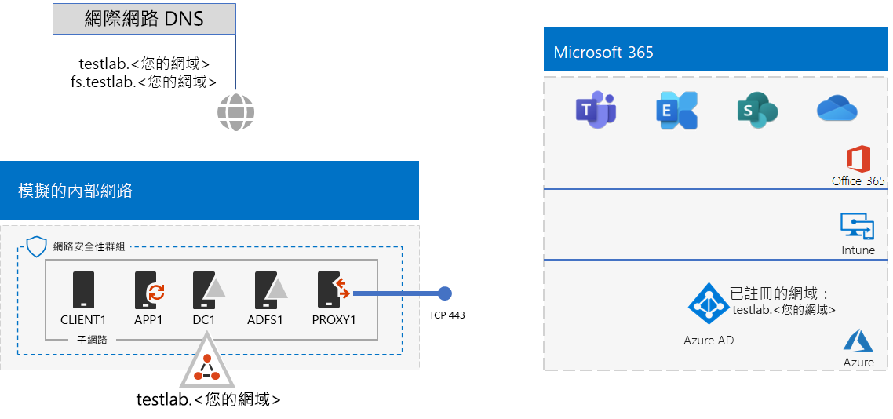
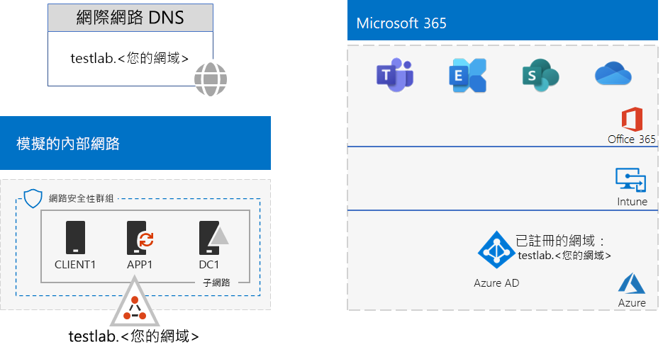
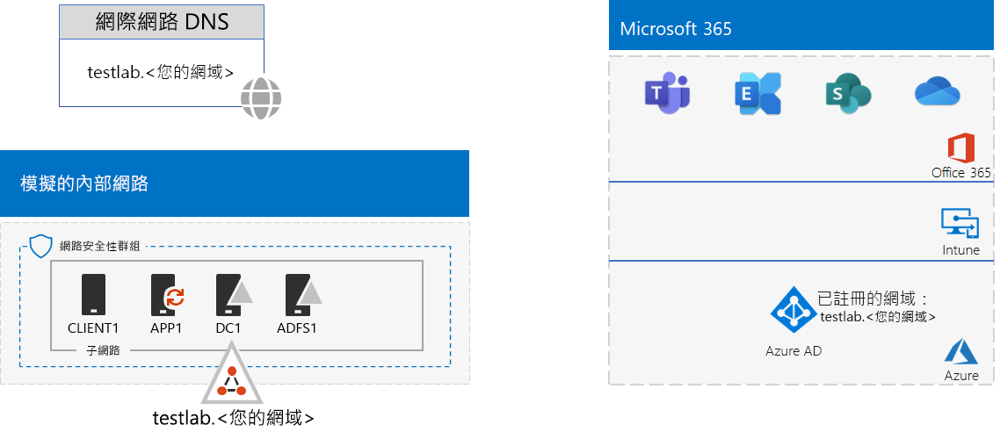

# <a name="federated-identity-for-your-microsoft-365-test-environment"></a><span data-ttu-id="3c66d-103">Microsoft 365 測試環境的同盟身分識別</span><span class="sxs-lookup"><span data-stu-id="3c66d-103">Federated identity for your Microsoft 365 test environment</span></span>

<span data-ttu-id="3c66d-104">*這個測試實驗室指南可用於 Microsoft 365 企業版和 Office 365 企業版兩種測試環境。*</span><span class="sxs-lookup"><span data-stu-id="3c66d-104">*This Test Lab Guide can be used for both Microsoft 365 Enterprise and Office 365 Enterprise test environments.*</span></span>

<span data-ttu-id="3c66d-p101">Office 365 支援同盟身分識別。這表示 Office 365 的連線使用者指的是 Office 365 信任的同盟驗證伺服器，而不是執行認證本身的驗證。如果使用者的認證正確，同盟驗證伺服器會發出安全性權杖，用戶端再傳送到 Office 365 做為驗證證明。同盟身分識別可進行 Office 365 訂閱驗證的卸載與擴展，以及進階驗證及安全性案例。</span><span class="sxs-lookup"><span data-stu-id="3c66d-p101">Office 365 supports federated identity. This means that instead of performing the validation of credentials itself, Office 365 refers the connecting user to a federated authentication server that Office 365 trusts. If the user's credentials are correct, the federated authentication server issues a security token that the client then sends to Office 365 as proof of authentication. Federated identity allows for the offloading and scaling up of authentication for an Office 365 subscription and advanced authentication and security scenarios.</span></span>
  
<span data-ttu-id="3c66d-109">本文說明如何設定 Microsoft 365 或 Office 365 測試環境中的同盟驗證，如下：</span><span class="sxs-lookup"><span data-stu-id="3c66d-109">This article describes how you can configure federated authentication for your Microsoft 365 or Office 365 test environment, resulting in the following:</span></span>


  
<span data-ttu-id="3c66d-111">此組態包含：</span><span class="sxs-lookup"><span data-stu-id="3c66d-111">This configuration consists of:</span></span> 
  
- <span data-ttu-id="3c66d-112">Microsoft 365 E5 或 Office 365 E5 試用版或正式版本訂閱。</span><span class="sxs-lookup"><span data-stu-id="3c66d-112">A Microsoft 365 E5 or Office 365 E5 trial or production subscription.</span></span>
    
- <span data-ttu-id="3c66d-p102">簡化的組織內部網路連線到網際網路，包含 Azure 虛擬網路子網路上的五部虛擬機器 (DC1、APP1、CLIENT1、ADFS1 和 PROXY1)。Azure AD Connect 在 APP1 上執行，將 Active Directory Domain Services 網域中的帳戶清單同步處理到 Office 365。PROXY1 接收輸入的驗證要求。ADFS1 使用 DC1 驗證認證和發行安全性權杖。</span><span class="sxs-lookup"><span data-stu-id="3c66d-p102">A simplified organization intranet connected to the Internet, consisting of five virtual machines on a subnet of an Azure virtual network (DC1, APP1, CLIENT1, ADFS1, and PROXY1). Azure AD Connect runs on APP1 to synchronize the list of accounts in the Active Directory Domain Services domain to Office 365. PROXY1 receives the incoming authentication requests. ADFS1 validates credentials with DC1 and issues security tokens.</span></span>
    
<span data-ttu-id="3c66d-117">設定此開發/測試環境有五個階段︰</span><span class="sxs-lookup"><span data-stu-id="3c66d-117">There are five phases to setting up this dev/test environment:</span></span>
  
1. <span data-ttu-id="3c66d-118">使用密碼雜湊同步處理建立模擬企業測試環境。</span><span class="sxs-lookup"><span data-stu-id="3c66d-118">Create the simulated enterprise test environment with password hash synchronization.</span></span>
    
2. <span data-ttu-id="3c66d-119">建立 AD FS 伺服器 (ADFS1)。</span><span class="sxs-lookup"><span data-stu-id="3c66d-119">Create the AD FS server (ADFS1).</span></span>
    
3. <span data-ttu-id="3c66d-120">建立 Web Proxy 伺服器 (PROXY1)。</span><span class="sxs-lookup"><span data-stu-id="3c66d-120">Create the web proxy server (PROXY1).</span></span>
    
4. <span data-ttu-id="3c66d-121">建立自我簽署的憑證並設定 ADFS1 及 PROXY1。</span><span class="sxs-lookup"><span data-stu-id="3c66d-121">Create a self-signed certificate and configure ADFS1 and PROXY1.</span></span>
    
5. <span data-ttu-id="3c66d-122">設定 Office 365 的同盟身分識別。</span><span class="sxs-lookup"><span data-stu-id="3c66d-122">Configure Office 365 for federated identity.</span></span>
    
> [!NOTE]
> <span data-ttu-id="3c66d-123">您無法使用 Azure 試用訂閱設定此測試環境。</span><span class="sxs-lookup"><span data-stu-id="3c66d-123">You cannot configure this test environment with an Azure Trial subscription.</span></span> 
  
## <a name="phase-1-configure-password-hash-synchronization-for-your-microsoft-365-test-environment"></a><span data-ttu-id="3c66d-124">階段 1：設定適用於 Microsoft 365 測試環境的密碼雜湊同步處理</span><span class="sxs-lookup"><span data-stu-id="3c66d-124">Phase 1: Configure password hash synchronization for your Microsoft 365 test environment</span></span>

<span data-ttu-id="3c66d-p103">請遵循[適用於 Microsoft 365 的密碼雜湊同步處理](password-hash-sync-m365-ent-test-environment.md)中的指示。以下是您產生的組態。</span><span class="sxs-lookup"><span data-stu-id="3c66d-p103">Follow the instructions in [password hash synchronization for Microsoft 365](password-hash-sync-m365-ent-test-environment.md). Here is your resulting configuration.</span></span>
  

  
<span data-ttu-id="3c66d-128">此組態包含：</span><span class="sxs-lookup"><span data-stu-id="3c66d-128">This configuration consists of:</span></span> 
  
- <span data-ttu-id="3c66d-129">Microsoft 365 E5 或 Office 365 E5 試用版或付費訂閱。</span><span class="sxs-lookup"><span data-stu-id="3c66d-129">A Microsoft 365 E5 or Office 365 E5 trial or paid subscriptions.</span></span>
- <span data-ttu-id="3c66d-130">簡化的組織內部網域與網際網路的連線，由 Azure 虛擬網路的子網路上的 DC1、APP1 及 CLIENT1 虛擬機器組成</span><span class="sxs-lookup"><span data-stu-id="3c66d-130">A simplified organization intranet connected to the Internet, consisting of the DC1, APP1, and CLIENT1 virtual machines on a subnet of an Azure virtual network.</span></span> <span data-ttu-id="3c66d-131">Azure AD Connect 在 APP1 上執行，以定期將 TESTLAB AD DS 網域同步至 Microsoft 365 或 Office 365 訂閱的 Azure AD 租用戶。</span><span class="sxs-lookup"><span data-stu-id="3c66d-131">Azure AD Connect runs on APP1 to synchronize the TESTLAB AD DS domain to the Azure AD tenant of your Microsoft 365 or Office 365 subscriptions periodically.</span></span>

## <a name="phase-2-create-the-ad-fs-server"></a><span data-ttu-id="3c66d-132">階段 2：建立 AD FS 伺服器</span><span class="sxs-lookup"><span data-stu-id="3c66d-132">Phase 2: Create the AD FS server</span></span>

<span data-ttu-id="3c66d-133">AD FS 伺服器提供 Office 365 和 DC1 上裝載 corp.contoso.com 網域中的帳戶之間的同盟驗證。</span><span class="sxs-lookup"><span data-stu-id="3c66d-133">An AD FS server provides federated authentication between Office 365 and the accounts in the corp.contoso.com domain hosted on DC1.</span></span>
  
<span data-ttu-id="3c66d-134">若要為 ADFS1 建立 Azure 虛擬機器，請為基本設定填入訂閱和資源群組的名稱和 Azure 位置，然後在本機電腦上的 Azure PowerShell 命令提示字元執行這些命令。</span><span class="sxs-lookup"><span data-stu-id="3c66d-134">To create an Azure virtual machine for ADFS1, fill in the name of your subscription and the resource group and Azure location for your Base Configuration, and then run these commands at the Azure PowerShell command prompt on your local computer.</span></span>
  
```powershell
$subscrName="<your Azure subscription name>"
$rgName="<the resource group name of your Base Configuration>"
$vnetName="TlgBaseConfig-01-VNET"
# NOTE: If you built your simulated intranet with Azure PowerShell, comment the previous line with a "#" and remove the "#" from the next line.
#$vnetName="TestLab"
Connect-AzAccount
Select-AzSubscription -SubscriptionName $subscrName
$staticIP="10.0.0.100"
$locName=(Get-AzResourceGroup -Name $rgName).Location
$vnet=Get-AzVirtualNetwork -Name $vnetName -ResourceGroupName $rgName
$pip = New-AzPublicIpAddress -Name ADFS1-PIP -ResourceGroupName $rgName -Location $locName -AllocationMethod Dynamic
$nic = New-AzNetworkInterface -Name ADFS1-NIC -ResourceGroupName $rgName -Location $locName -SubnetId $vnet.Subnets[0].Id -PublicIpAddressId $pip.Id -PrivateIpAddress $staticIP
$vm=New-AzVMConfig -VMName ADFS1 -VMSize Standard_D2_v2
$cred=Get-Credential -Message "Type the name and password of the local administrator account for ADFS1."
$vm=Set-AzVMOperatingSystem -VM $vm -Windows -ComputerName ADFS1 -Credential $cred -ProvisionVMAgent -EnableAutoUpdate
$vm=Set-AzVMSourceImage -VM $vm -PublisherName MicrosoftWindowsServer -Offer WindowsServer -Skus 2016-Datacenter -Version "latest"
$vm=Add-AzVMNetworkInterface -VM $vm -Id $nic.Id
$vm=Set-AzVMOSDisk -VM $vm -Name "ADFS-OS" -DiskSizeInGB 128 -CreateOption FromImage -StorageAccountType "Standard_LRS"
New-AzVM -ResourceGroupName $rgName -Location $locName -VM $vm
```

<span data-ttu-id="3c66d-135">接下來，使用 ADFS1 本機系統管理員帳戶名稱和密碼，以使用 [Azure 入口網站](https://portal.azure.com)連線到 ADFS1 虛擬機器，然後開啟 Windows PowerShell 命令提示字元。</span><span class="sxs-lookup"><span data-stu-id="3c66d-135">Next, use the [Azure portal](https://portal.azure.com) to connect to the ADFS1 virtual machine using the ADFS1 local administrator account name and password, and then open a Windows PowerShell command prompt.</span></span>
  
<span data-ttu-id="3c66d-136">若要檢查 ADFS1 和 DC1 之間的名稱解析和網路通訊，請執行 **ping dc1.corp.contoso.com** 命令，並檢查有四個回覆。</span><span class="sxs-lookup"><span data-stu-id="3c66d-136">To check name resolution and network communication between ADFS1 and DC1, run the **ping dc1.corp.contoso.com** command and check that there are four replies.</span></span>
  
<span data-ttu-id="3c66d-137">接下來在 ADFS1 上的 Windows PowerShell 命令提示字元使用以下命令將 ADFS1 虛擬機器加入 CORP 網域。</span><span class="sxs-lookup"><span data-stu-id="3c66d-137">Next, join the ADFS1 virtual machine to the CORP domain with these commands at the Windows PowerShell prompt on ADFS1.</span></span>
  
```powershell
$cred=Get-Credential -UserName "CORP\User1" -Message "Type the User1 account password."
Add-Computer -DomainName corp.contoso.com -Credential $cred
Restart-Computer
```

<span data-ttu-id="3c66d-138">以下是產生的組態。</span><span class="sxs-lookup"><span data-stu-id="3c66d-138">Here is your resulting configuration.</span></span>
  

  
## <a name="phase-3-create-the-web-proxy-server"></a><span data-ttu-id="3c66d-140">階段 3：建立 Web Proxy 伺服器</span><span class="sxs-lookup"><span data-stu-id="3c66d-140">Phase 3: Create the web proxy server</span></span>

<span data-ttu-id="3c66d-141">PROXY1 提供嘗試驗證 ADFS1 的使用者之間驗證訊息的 Proxy。</span><span class="sxs-lookup"><span data-stu-id="3c66d-141">PROXY1 provides proxying of authentication messages between users trying to authenticate and ADFS1.</span></span>
  
<span data-ttu-id="3c66d-142">若要為 PROXY1 建立 Azure 虛擬機器，請填入資源群組的名稱和 Azure 位置，然後在本機電腦上的 Azure PowerShell 命令提示字元執行這些命令。</span><span class="sxs-lookup"><span data-stu-id="3c66d-142">To create an Azure virtual machine for PROXY1, fill in the name of your resource group and Azure location, and then run these commands at the Azure PowerShell command prompt on your local computer.</span></span>
  
```powershell
$rgName="<the resource group name of your Base Configuration>"
$vnetName="TlgBaseConfig-01-VNET"
# NOTE: If you built your simulated intranet with Azure PowerShell, comment the previous line with a "#" and remove the "#" from the next line.
#$vnetName="TestLab"
$staticIP="10.0.0.101"
$locName=(Get-AzResourceGroup -Name $rgName).Location
$vnet=Get-AzVirtualNetwork -Name $vnetName -ResourceGroupName $rgName
$pip = New-AzPublicIpAddress -Name PROXY1-PIP -ResourceGroupName $rgName -Location $locName -AllocationMethod Static
$nic = New-AzNetworkInterface -Name PROXY1-NIC -ResourceGroupName $rgName -Location $locName -SubnetId $vnet.Subnets[0].Id -PublicIpAddressId $pip.Id -PrivateIpAddress $staticIP
$vm=New-AzVMConfig -VMName PROXY1 -VMSize Standard_D2_v2
$cred=Get-Credential -Message "Type the name and password of the local administrator account for PROXY1."
$vm=Set-AzVMOperatingSystem -VM $vm -Windows -ComputerName PROXY1 -Credential $cred -ProvisionVMAgent -EnableAutoUpdate
$vm=Set-AzVMSourceImage -VM $vm -PublisherName MicrosoftWindowsServer -Offer WindowsServer -Skus 2016-Datacenter -Version "latest"
$vm=Add-AzVMNetworkInterface -VM $vm -Id $nic.Id
$vm=Set-AzVMOSDisk -VM $vm -Name "PROXY1-OS" -DiskSizeInGB 128 -CreateOption FromImage -StorageAccountType "Standard_LRS"
New-AzVM -ResourceGroupName $rgName -Location $locName -VM $vm
```

> [!NOTE]
> <span data-ttu-id="3c66d-143">PROXY1 指派了靜態公用 IP 位址，因為您將建立指向它的公開 DNS 記錄，且當您重新啟動 PROXY1 虛擬機器時它不得變更。</span><span class="sxs-lookup"><span data-stu-id="3c66d-143">PROXY1 is assigned a static public IP address because you will create a public DNS record that points to it and it must not change when you restart the PROXY1 virtual machine.</span></span> 
  
<span data-ttu-id="3c66d-p105">接著，針對 CorpNet 子網路將規則新增到網路安全性群組，以允許從網際網路到 PROXY1 私人 IP 位址和 TCP 連接埠 443 之未經要求的輸入流量。在本機電腦上的 Azure PowerShell 命令提示字元執行這些命令。</span><span class="sxs-lookup"><span data-stu-id="3c66d-p105">Next, add a rule to the network security group for the CorpNet subnet to allow unsolicited inbound traffic from the Internet to PROXY1's private IP address and TCP port 443. Run these commands at the Azure PowerShell command prompt on your local computer.</span></span>
  
```powershell
$rgName="<the resource group name of your Base Configuration>"
Get-AzNetworkSecurityGroup -Name CorpNet -ResourceGroupName $rgName | Add-AzNetworkSecurityRuleConfig -Name "HTTPS-to-PROXY1" -Description "Allow TCP 443 to PROXY1" -Access "Allow" -Protocol "Tcp" -Direction "Inbound" -Priority 101 -SourceAddressPrefix "Internet" -SourcePortRange "*" -DestinationAddressPrefix "10.0.0.101" -DestinationPortRange "443" | Set-AzNetworkSecurityGroup
```

<span data-ttu-id="3c66d-146">接下來，使用 PROXY1 本機系統管理員帳戶名稱和密碼，以使用 [Azure 入口網站](https://portal.azure.com)連線到 PROXY1 虛擬機器，然後在 PROXY1 上開啟 Windows PowerShell 命令提示字元。</span><span class="sxs-lookup"><span data-stu-id="3c66d-146">Next, use the [Azure portal](https://portal.azure.com) to connect to the PROXY1 virtual machine using the PROXY1 local administrator account name and password, and then open a Windows PowerShell command prompt on PROXY1.</span></span>
  
<span data-ttu-id="3c66d-147">若要檢查 PROXY1 和 DC1 之間的名稱解析和網路通訊，請執行 **ping dc1.corp.contoso.com** 命令，並檢查有四個回覆。</span><span class="sxs-lookup"><span data-stu-id="3c66d-147">To check name resolution and network communication between PROXY1 and DC1, run the **ping dc1.corp.contoso.com** command and check that there are four replies.</span></span>
  
<span data-ttu-id="3c66d-148">接下來在 PROXY1 上的 Windows PowerShell 命令提示字元使用以下命令將 PROXY1 虛擬機器加入 CORP 網域。</span><span class="sxs-lookup"><span data-stu-id="3c66d-148">Next, join the PROXY1 virtual machine to the CORP domain with these commands at the Windows PowerShell prompt on PROXY1.</span></span>
  
```powershell
$cred=Get-Credential -UserName "CORP\User1" -Message "Type the User1 account password."
Add-Computer -DomainName corp.contoso.com -Credential $cred
Restart-Computer
```

<span data-ttu-id="3c66d-149">使用這些 Azure PowerShell 命令在本機電腦上顯示 PROXY1 的公用 IP 位址：</span><span class="sxs-lookup"><span data-stu-id="3c66d-149">Display the public IP address of PROXY1 with these Azure PowerShell commands on your local computer:</span></span>
  
```powershell
Write-Host (Get-AzPublicIpaddress -Name "PROXY1-PIP" -ResourceGroup $rgName).IPAddress
```

<span data-ttu-id="3c66d-p106">接下來，與公用 DNS 提供者合作，建立 **fs.testlab.**\<您的 DNS 網域名稱> 的新公用 DNS A 記錄，其會解析到**寫入主機**命令所顯示之 IP 位址。**fs.testlab.**\<您的 DNS 網域名稱> 以下稱為*同盟服務 FQDN*。</span><span class="sxs-lookup"><span data-stu-id="3c66d-p106">Next, work with your public DNS provider and create a new public DNS A record for **fs.testlab.**\<your DNS domain name> that resolves to the IP address displayed by the **Write-Host** command. The **fs.testlab.**\<your DNS domain name> is hereafter referred to as the  *federation service FQDN*.</span></span>
  
<span data-ttu-id="3c66d-152">接下來，使用 CORP\\User1 認證，以使用 [Azure 入口網站](https://portal.azure.com)連線到 DC1 虛擬機器，然後在系統管理員層級 Windows PowerShell 命令提示字元執行下列命令：</span><span class="sxs-lookup"><span data-stu-id="3c66d-152">Next, use the [Azure portal](https://portal.azure.com) to connect to the DC1 virtual machine using the CORP\\User1 credentials, and then run the following commands at an administrator-level Windows PowerShell command prompt:</span></span>
  
```powershell
Add-DnsServerPrimaryZone -Name corp.contoso.com -ZoneFile corp.contoso.com.dns
Add-DnsServerResourceRecordA -Name "fs" -ZoneName corp.contoso.com -AllowUpdateAny -IPv4Address "10.0.0.100" -TimeToLive 01:00:00
```
<span data-ttu-id="3c66d-153">這些命令會建立內部 DNS A 記錄，使得 Azure 虛擬網路上的虛擬機器可將內部同盟 FQDN 解析為 ADFS1 的私人 IP 位址。</span><span class="sxs-lookup"><span data-stu-id="3c66d-153">These commands create an internal DNS A record so that virtual machines on the Azure virtual network can resolve the internal federation FQDN to ADFS1's private IP address.</span></span>
  
<span data-ttu-id="3c66d-154">以下是產生的組態。</span><span class="sxs-lookup"><span data-stu-id="3c66d-154">Here is your resulting configuration.</span></span>
  

  
## <a name="phase-4-create-a-self-signed-certificate-and-configure-adfs1-and-proxy1"></a><span data-ttu-id="3c66d-156">階段 4：建立自我簽署的憑證並設定 ADFS1 及 PROXY1</span><span class="sxs-lookup"><span data-stu-id="3c66d-156">Phase 4: Create a self-signed certificate and configure ADFS1 and PROXY1</span></span>

<span data-ttu-id="3c66d-157">在這個階段，您可以為同盟服務 FQDN 建立自我簽署的數位憑證，並將 ADFS1 和 PROXY1 設定為 AD FS 伺服器陣列。</span><span class="sxs-lookup"><span data-stu-id="3c66d-157">In this phase, you create a self-signed digital certificate for your federation service FQDN and configure ADFS1 and PROXY1 as an AD FS farm.</span></span>
  
<span data-ttu-id="3c66d-158">首先，使用 CORP\\User1 認證，以使用 [Azure 入口網站](https://portal.azure.com)連線到 DC1 虛擬機器，然後開啟系統管理員層級 Windows PowerShell 命令提示字元。</span><span class="sxs-lookup"><span data-stu-id="3c66d-158">First, use the [Azure portal](https://portal.azure.com) to connect to the DC1 virtual machine using the CORP\\User1 credentials, and then open an administrator-level Windows PowerShell command prompt.</span></span>
  
<span data-ttu-id="3c66d-159">接下來，在 DC1 上的 Windows PowerShell 命令提示字元中使用此命令建立 AD FS 服務帳戶：</span><span class="sxs-lookup"><span data-stu-id="3c66d-159">Next, create AD FS service account with this command at the Windows PowerShell command prompt on DC1:</span></span>
  
```powershell
New-ADUser -SamAccountName ADFS-Service -AccountPassword (read-host "Set user password" -assecurestring) -name "ADFS-Service" -enabled $true -PasswordNeverExpires $true -ChangePasswordAtLogon $false
```
<span data-ttu-id="3c66d-p107">請注意，此命令會提示您提供帳戶密碼。請選擇強式密碼，並將其記錄在安全的位置。您在此階段和階段 5 會需要該密碼。</span><span class="sxs-lookup"><span data-stu-id="3c66d-p107">Note that this command prompts you to supply the account password. Choose a strong password and record it in a secured location. You will need it for this phase and Phase 5.</span></span>
  
<span data-ttu-id="3c66d-p108">使用 CORP\\User1 認證以使用 [Azure 入口網站](https://portal.azure.com)連線到 ADFS1 虛擬機器。開啟 ADFS1 上的系統管理員層級 Windows PowerShell 命令提示字元，填入您的同盟服務 FQDN，然後執行這些命令以建立自我簽署的憑證：</span><span class="sxs-lookup"><span data-stu-id="3c66d-p108">Use the [Azure portal](https://portal.azure.com) to connect to the ADFS1 virtual machine using the CORP\\User1 credentials. Open an administrator-level Windows PowerShell command prompt on ADFS1, fill in your federation service FQDN, and then run these commands to create a self-signed certificate:</span></span>
  
```powershell
$fedServiceFQDN="<federation service FQDN>"
New-SelfSignedCertificate -DnsName $fedServiceFQDN -CertStoreLocation "cert:\LocalMachine\My"
New-Item -path c:\Certs -type directory
New-SmbShare -name Certs -path c:\Certs -changeaccess CORP\User1
```

<span data-ttu-id="3c66d-165">接下來，使用這些步驟，將新的自我簽署憑證儲存為檔案。</span><span class="sxs-lookup"><span data-stu-id="3c66d-165">Next, use these steps to save the new self-signed certificate as a file.</span></span>
  
1. <span data-ttu-id="3c66d-166">按一下 [開始]\*\*\*\*，輸入 **mmc.exe**，然後按 **Enter**。</span><span class="sxs-lookup"><span data-stu-id="3c66d-166">Click **Start**, type **mmc.exe**, and then press **Enter**.</span></span>
    
2. <span data-ttu-id="3c66d-167">按一下 **[檔案] > [新增/移除嵌入式管理單元]**。</span><span class="sxs-lookup"><span data-stu-id="3c66d-167">Click **File > Add/Remove Snap-in**.</span></span>
    
3. <span data-ttu-id="3c66d-168">在 [新增或移除嵌入式管理單元]\*\*\*\* 中可用的嵌入式管理單元清單中按兩下 [憑證]\*\*\*\*，按一下 [電腦帳戶]\*\*\*\*，然後按一下 [下一步]\*\*\*\*。</span><span class="sxs-lookup"><span data-stu-id="3c66d-168">In **Add or Remove Snap-ins**, double-click **Certificates** in the list of available snap-ins, click **Computer account**, and then click **Next**.</span></span>
    
4. <span data-ttu-id="3c66d-169">在 [選取電腦]\*\*\*\* 中，按一下 [完成]\*\*\*\*，然後按一下 [確定]\*\*\*\*。</span><span class="sxs-lookup"><span data-stu-id="3c66d-169">In **Select Computer**, click **Finish**, and then click **OK**.</span></span>
    
5. <span data-ttu-id="3c66d-170">在樹狀窗格中，開啟 **[憑證 (本機電腦)] > [個人] > [憑證]**。</span><span class="sxs-lookup"><span data-stu-id="3c66d-170">In the tree pane, open **Certificates (Local Computer) > Personal > Certificates**.</span></span>
    
6. <span data-ttu-id="3c66d-171">以滑鼠右鍵按一下具同盟服務 FQDN 的憑證，按一下 [所有工作]\*\*\*\*，然後按一下 [匯出]\*\*\*\*。</span><span class="sxs-lookup"><span data-stu-id="3c66d-171">Right-click the certificate with your federation service FQDN, click **All tasks**, and then click **Export**.</span></span>
    
7. <span data-ttu-id="3c66d-172">在 [歡迎]\*\*\*\* 頁面上，按 [下一步]\*\*\*\*。</span><span class="sxs-lookup"><span data-stu-id="3c66d-172">On the **Welcome** page, click **Next**.</span></span>
    
8. <span data-ttu-id="3c66d-173">在 [匯出私密金鑰]\*\*\*\* 頁面上，按一下 [是]\*\*\*\*，然後按 [下一步]\*\*\*\*。</span><span class="sxs-lookup"><span data-stu-id="3c66d-173">On the **Export Private Key** page, click **Yes**, and then click **Next**.</span></span>
    
9. <span data-ttu-id="3c66d-174">在 [匯出檔案格式]\*\*\*\* 頁面上，按一下 [匯出所有延伸內容]\*\*\*\*，然後按 [下一步]\*\*\*\*。</span><span class="sxs-lookup"><span data-stu-id="3c66d-174">On the **Export File Format** page, click **Export all extended properties**, and then click **Next**.</span></span>
    
10. <span data-ttu-id="3c66d-175">在 [安全性]\*\*\*\* 頁面上，按一下 [密碼]\*\*\*\*，然後在 [密碼]\*\*\*\* 和 [確認密碼]\*\*\*\* 中輸入密碼。</span><span class="sxs-lookup"><span data-stu-id="3c66d-175">On the **Security** page, click **Password** and type a password in **Password** and **Confirm password.**</span></span>
    
11. <span data-ttu-id="3c66d-176">在 [要匯出的檔案]\*\*\*\* 頁面上，按一下 [瀏覽]\*\*\*\*。</span><span class="sxs-lookup"><span data-stu-id="3c66d-176">On the **File to Export** page, click **Browse**.</span></span>
    
12. <span data-ttu-id="3c66d-177">瀏覽至 [C:\\Certs]\*\*\*\* 資料夾中，在 [檔案名稱]\*\*\*\* 中輸入 **SSL**，然後按一下 [儲存]\*\*\*\*。</span><span class="sxs-lookup"><span data-stu-id="3c66d-177">Browse to the **C:\\Certs** folder, type **SSL** in **File name**, and then click **Save.**</span></span>
    
13. <span data-ttu-id="3c66d-178">在 [要匯出的檔案]\*\*\*\* 頁面上，按一下 [下一步]\*\*\*\*。</span><span class="sxs-lookup"><span data-stu-id="3c66d-178">On the **File to Export** page, click **Next**.</span></span>
    
14. <span data-ttu-id="3c66d-p109">在 [完成憑證匯出精靈]\*\*\*\* 頁面上，按一下 [完成]\*\*\*\*。出現提示時，按一下 [確定]\*\*\*\*。</span><span class="sxs-lookup"><span data-stu-id="3c66d-p109">On the **Completing the Certificate Export Wizard** page, click **Finish**. When prompted, click **OK**.</span></span>
    
<span data-ttu-id="3c66d-181">接下來，在 ADFS1 上的 Windows PowerShell 命令提示字元中使用此命令安裝 AD FS 服務：</span><span class="sxs-lookup"><span data-stu-id="3c66d-181">Next, install the AD FS service with this command at the Windows PowerShell command prompt on ADFS1:</span></span>
  
```powershell
Install-WindowsFeature ADFS-Federation -IncludeManagementTools
```

<span data-ttu-id="3c66d-182">等待安裝完成。</span><span class="sxs-lookup"><span data-stu-id="3c66d-182">Wait for the installation to complete.</span></span>
  
<span data-ttu-id="3c66d-183">接下來，使用下列步驟設定 AD FS 服務：</span><span class="sxs-lookup"><span data-stu-id="3c66d-183">Next, configure the AD FS service with these steps:</span></span>
  
1. <span data-ttu-id="3c66d-184">按一下 [開始]\*\*\*\*，然後按一下 [伺服器管理員]\*\*\*\* 圖示。</span><span class="sxs-lookup"><span data-stu-id="3c66d-184">Click **Start**, and then click the **Server Manager** icon.</span></span>
    
2. <span data-ttu-id="3c66d-185">在 [伺服器管理員] 的樹狀窗格中，按一下 [AD FS]\*\*\*\*。</span><span class="sxs-lookup"><span data-stu-id="3c66d-185">In the tree pane of Server Manager, click **AD FS**.</span></span>
    
3. <span data-ttu-id="3c66d-186">在頂端的工具列，按一下橘色警告符號，然後按一下 [在此伺服器上設定同盟服務]\*\*\*\*。</span><span class="sxs-lookup"><span data-stu-id="3c66d-186">In the tool bar at the top, click the orange caution symbol, and then click **Configure the federation service on this server**.</span></span>
    
4. <span data-ttu-id="3c66d-187">在 Active Directory 同盟服務設定精靈的 [歡迎]\*\*\*\* 頁面上，按一下 [下一步]\*\*\*\*。</span><span class="sxs-lookup"><span data-stu-id="3c66d-187">On the **Welcome** page of the Active Directory Federation Services Configuration Wizard, click **Next**.</span></span>
    
5. <span data-ttu-id="3c66d-188">在 [連線到 AD DS]\*\*\*\* 頁面上，按一下 [下一步]\*\*\*\*。</span><span class="sxs-lookup"><span data-stu-id="3c66d-188">On the **Connect to AD DS** page, click **Next**.</span></span>
    
6. <span data-ttu-id="3c66d-189">在 [指定服務內容]\*\*\*\* 頁面上：</span><span class="sxs-lookup"><span data-stu-id="3c66d-189">On the **Specify Service Properties** page:</span></span>
    
  - <span data-ttu-id="3c66d-190">針對 **SSL 憑證**，按一下向下箭號，然後按一下具有同盟服務 FQDN 名稱的憑證。</span><span class="sxs-lookup"><span data-stu-id="3c66d-190">For **SSL Certificate**, click the down arrow, and then click the certificate with the name of your federation service FQDN.</span></span>
    
  - <span data-ttu-id="3c66d-191">在 [同盟服務顯示名稱]\*\*\*\* 中，輸入您虛構組織的名稱。</span><span class="sxs-lookup"><span data-stu-id="3c66d-191">In **Federation Service Display Name**, type the name of your fictional organization.</span></span>
    
  - <span data-ttu-id="3c66d-192">按 [下一步]\*\*\*\*。</span><span class="sxs-lookup"><span data-stu-id="3c66d-192">Click **Next**.</span></span>
    
7. <span data-ttu-id="3c66d-193">在 [指定服務帳戶]\*\*\*\* 頁面上，為**帳戶名稱**按一下 [選取]\*\*\*\*。</span><span class="sxs-lookup"><span data-stu-id="3c66d-193">On the **Specify Service Account** page, click **Select** for **Account name**.</span></span>
    
8. <span data-ttu-id="3c66d-194">在 [選取使用者或服務帳戶]\*\*\*\* 中，輸入 **ADFS 服務**，按一下 [檢查名稱]\*\*\*\*，然後按一下 [確定]\*\*\*\*。</span><span class="sxs-lookup"><span data-stu-id="3c66d-194">In **Select User or Service Account**, type **ADFS-Service**, click **Check Names**, and then click **OK**.</span></span>
    
9. <span data-ttu-id="3c66d-195">在 [帳戶密碼]\*\*\*\* 中輸入 ADFS 服務帳戶的密碼，然後按一下 [下一步]\*\*\*\*。</span><span class="sxs-lookup"><span data-stu-id="3c66d-195">In **Account Password**, type the password for the ADFS-Service account, and then click **Next**.</span></span>
    
10. <span data-ttu-id="3c66d-196">在 [指定設定資料庫]\*\*\*\* 頁面上，按一下 [下一步]\*\*\*\*。</span><span class="sxs-lookup"><span data-stu-id="3c66d-196">On the **Specify Configuration Database** page, click **Next**.</span></span>
    
11. <span data-ttu-id="3c66d-197">在 [校閱選項]\*\*\*\* 頁面上，按一下 [下一步]\*\*\*\*。</span><span class="sxs-lookup"><span data-stu-id="3c66d-197">On the **Review Options** page, click **Next**.</span></span>
    
12. <span data-ttu-id="3c66d-198">在 [必要條件檢查]\*\*\*\* 頁面上，按一下 [設定]\*\*\*\*。</span><span class="sxs-lookup"><span data-stu-id="3c66d-198">On the **Pre-requisite Checks** page, click **Configure**.</span></span>
    
13. <span data-ttu-id="3c66d-199">在 [結果]\*\*\*\* 頁面上，按一下 [關閉]\*\*\*\*。</span><span class="sxs-lookup"><span data-stu-id="3c66d-199">On the **Results** page, click **Close**.</span></span>
    
14. <span data-ttu-id="3c66d-200">依序按一下 [開始]\*\*\*\*、電源圖示、[重新啟動]\*\*\*\* 和 [繼續]\*\*\*\*。</span><span class="sxs-lookup"><span data-stu-id="3c66d-200">Click **Start**, click the power icon, click **Restart**, and then click **Continue**.</span></span>
    
<span data-ttu-id="3c66d-201">使用 CORP\\User1 帳戶認證，從 [Azure 入口網站](https://portal.azure.com)連線到 PROXY1。</span><span class="sxs-lookup"><span data-stu-id="3c66d-201">From the [Azure portal](https://portal.azure.com), connect to PROXY1 with the CORP\\User1 account credentials.</span></span>
  
<span data-ttu-id="3c66d-202">接下來，使用這些步驟安裝自我簽署的憑證及設定 PROXY1。</span><span class="sxs-lookup"><span data-stu-id="3c66d-202">Next, use these steps to install the self-signed certificate and configure PROXY1.</span></span>
  
1. <span data-ttu-id="3c66d-203">按一下 [開始]\*\*\*\*，輸入 **mmc.exe**，然後按 **Enter**。</span><span class="sxs-lookup"><span data-stu-id="3c66d-203">Click **Start**, type **mmc.exe**, and then press **Enter**.</span></span>
    
2. <span data-ttu-id="3c66d-204">按一下 **[檔案] > [新增/移除嵌入式管理單元]**。</span><span class="sxs-lookup"><span data-stu-id="3c66d-204">Click **File > Add/Remove Snap-in**.</span></span>
    
3. <span data-ttu-id="3c66d-205">在 [新增或移除嵌入式管理單元]\*\*\*\* 中可用的嵌入式管理單元清單中按兩下 [憑證]\*\*\*\*，按一下 [電腦帳戶]\*\*\*\*，然後按一下 [下一步]\*\*\*\*。</span><span class="sxs-lookup"><span data-stu-id="3c66d-205">In **Add or Remove Snap-ins**, double-click **Certificates** in the list of available snap-ins, click **Computer account**, and then click **Next**.</span></span>
    
4. <span data-ttu-id="3c66d-206">在 [選取電腦]\*\*\*\* 中，按一下 [完成]\*\*\*\*，然後按一下 [確定]\*\*\*\*。</span><span class="sxs-lookup"><span data-stu-id="3c66d-206">In **Select Computer**, click **Finish**, and then click **OK**.</span></span>
    
5. <span data-ttu-id="3c66d-207">在樹狀窗格中，開啟 **[憑證 (本機電腦)] > [個人] > [憑證]**。</span><span class="sxs-lookup"><span data-stu-id="3c66d-207">In the tree pane, open **Certificates (Local Computer) > Personal > Certificates**.</span></span>
    
6. <span data-ttu-id="3c66d-208">在 [個人]\*\*\*\* 上按一下滑鼠右鍵，按一下 [所有工作]\*\*\*\* 然後按一下 [匯入]\*\*\*\*。</span><span class="sxs-lookup"><span data-stu-id="3c66d-208">Right-click **Personal**, click **All tasks**, and then click **Import**.</span></span>
    
7. <span data-ttu-id="3c66d-209">在 [歡迎]\*\*\*\* 頁面上，按 [下一步]\*\*\*\*。</span><span class="sxs-lookup"><span data-stu-id="3c66d-209">On the **Welcome** page, click **Next**.</span></span>
    
8. <span data-ttu-id="3c66d-210">在 [要匯入的檔案]\*\*\*\* 頁面上，輸入 **\\\\adfs1\\certs\\ssl.pfx**，然後按一下 [下一步]\*\*\*\*。</span><span class="sxs-lookup"><span data-stu-id="3c66d-210">On the **File to Import** page, type **\\\\adfs1\\certs\\ssl.pfx**, and then click **Next**.</span></span>
    
9. <span data-ttu-id="3c66d-211">在 [私密金鑰保護]\*\*\*\* 頁面上，在 [密碼]\*\*\*\* 中輸入憑證密碼，然後按一下 [下一步]\*\*\*\*。</span><span class="sxs-lookup"><span data-stu-id="3c66d-211">On the **Private key protection** page, type the certificate password in **Password**, and then click **Next.**</span></span>
    
10. <span data-ttu-id="3c66d-212">在 [憑證存放區]\*\*\*\* 頁面上，按 [下一步]\*\*\*\*。</span><span class="sxs-lookup"><span data-stu-id="3c66d-212">On the **Certificate store** page, click **Next.**</span></span>
    
11. <span data-ttu-id="3c66d-213">在 [完成]\*\*\*\* 頁面上，按一下 [完成]\*\*\*\*。</span><span class="sxs-lookup"><span data-stu-id="3c66d-213">On the **Completing** page, click **Finish**.</span></span>
    
12. <span data-ttu-id="3c66d-214">在 [憑證存放區]\*\*\*\* 頁面上，按 [下一步]\*\*\*\*。</span><span class="sxs-lookup"><span data-stu-id="3c66d-214">On the **Certificate Store** page, click **Next**.</span></span>
    
13. <span data-ttu-id="3c66d-215">出現提示時，按一下 [確定]\*\*\*\*。</span><span class="sxs-lookup"><span data-stu-id="3c66d-215">When prompted, click **OK**.</span></span>
    
14. <span data-ttu-id="3c66d-216">在樹狀窗格中按一下 [憑證]\*\*\*\*。</span><span class="sxs-lookup"><span data-stu-id="3c66d-216">Click **Certificates** in the tree pane.</span></span>
    
15. <span data-ttu-id="3c66d-217">以滑鼠右鍵按一下憑證，然後按一下 [複製]\*\*\*\*。</span><span class="sxs-lookup"><span data-stu-id="3c66d-217">Right-click the certificate, and then click **Copy**.</span></span>
    
16. <span data-ttu-id="3c66d-218">在樹狀窗格中，開啟 **[信任的根憑證授權] > [憑證]**。</span><span class="sxs-lookup"><span data-stu-id="3c66d-218">In the tree pane, open **Trusted Root Certification Authorities > Certificates**.</span></span>
    
17. <span data-ttu-id="3c66d-219">將滑鼠指標移動到已安裝的憑證清單下方，以滑鼠右鍵按一下，然後按一下 [貼上]\*\*\*\*。</span><span class="sxs-lookup"><span data-stu-id="3c66d-219">Move your mouse pointer below the list of installed certificates, right-click, and then click **Paste**.</span></span>
    
<span data-ttu-id="3c66d-220">開啟系統管理員層級 PowerShell 命令提示字元，執行下列命令：</span><span class="sxs-lookup"><span data-stu-id="3c66d-220">Open an administrator-level PowerShell command prompt and run the following command:</span></span>
  
```powershell
Install-WindowsFeature Web-Application-Proxy -IncludeManagementTools
```

<span data-ttu-id="3c66d-221">等待安裝完成。</span><span class="sxs-lookup"><span data-stu-id="3c66d-221">Wait for the installation to complete.</span></span>
  
<span data-ttu-id="3c66d-222">使用下列步驟設定 Web 應用程式 Proxy 服務以使用 ADFS1 作為其同盟伺服器：</span><span class="sxs-lookup"><span data-stu-id="3c66d-222">Use these steps to configure the web application proxy service to use ADFS1 as its federation server:</span></span>
  
1. <span data-ttu-id="3c66d-223">按一下 [開始]\*\*\*\*，然後按一下 [伺服器管理員]\*\*\*\*。</span><span class="sxs-lookup"><span data-stu-id="3c66d-223">Click **Start**, and then click **Server Manager**.</span></span>
    
2. <span data-ttu-id="3c66d-224">在樹狀窗格中，按一下 [遠端存取]\*\*\*\*。</span><span class="sxs-lookup"><span data-stu-id="3c66d-224">In the tree pane, click **Remote Access**.</span></span>
    
3. <span data-ttu-id="3c66d-225">在頂端的工具列中，按一下橘色警告符號，然後按一下 [開啟 Web 應用程式 Proxy 精靈]\*\*\*\*。</span><span class="sxs-lookup"><span data-stu-id="3c66d-225">In the tool bar at the top, click the orange caution symbol, and then click **Open the Web Application Proxy Wizard**.</span></span>
    
4. <span data-ttu-id="3c66d-226">在 Web 應用程式 Proxy 設定精靈的 [歡迎]\*\*\*\* 頁面上，按一下 [下一步]\*\*\*\*。</span><span class="sxs-lookup"><span data-stu-id="3c66d-226">On the **Welcome** page of the Web Application Proxy Configuration Wizard, click **Next**.</span></span>
    
5. <span data-ttu-id="3c66d-227">在 [同盟伺服器]\*\*\*\* 頁面上：</span><span class="sxs-lookup"><span data-stu-id="3c66d-227">On the **Federation Server** page:</span></span>
    
  - <span data-ttu-id="3c66d-228">在**同盟服務名稱**中輸入您的同盟服務 FQDN。</span><span class="sxs-lookup"><span data-stu-id="3c66d-228">Type your federation service FQDN in **Federation service name**.</span></span>
    
  - <span data-ttu-id="3c66d-229">在**使用者名稱**中輸入 **CORP\\User1**。</span><span class="sxs-lookup"><span data-stu-id="3c66d-229">Type **CORP\\User1** in **User name**.</span></span>
    
  - <span data-ttu-id="3c66d-230">在 [密碼]\*\*\*\* 中，輸入 User1 帳戶的密碼。</span><span class="sxs-lookup"><span data-stu-id="3c66d-230">Type the password for the User1 account in **Password**.</span></span>
    
  - <span data-ttu-id="3c66d-231">按 [下一步]\*\*\*\*。</span><span class="sxs-lookup"><span data-stu-id="3c66d-231">Click **Next**.</span></span>
    
6. <span data-ttu-id="3c66d-232">在 [AD FS Proxy 憑證]\*\*\*\* 頁面上，按一下向下箭號，按一下具有同盟服務 FQDN 的憑證，然後按一下 [下一步]\*\*\*\*。</span><span class="sxs-lookup"><span data-stu-id="3c66d-232">On the **AD FS Proxy Certificate** page, click the down arrow, click the certificate with your federation service FQDN, and then click **Next**.</span></span>
    
7. <span data-ttu-id="3c66d-233">在 [確認]\*\*\*\* 頁面上，按 [設定]\*\*\*\*。</span><span class="sxs-lookup"><span data-stu-id="3c66d-233">On the **Confirmation** page, click **Configure**.</span></span>
    
8. <span data-ttu-id="3c66d-234">在 [結果]\*\*\*\* 頁面上，按一下 [關閉]\*\*\*\*。</span><span class="sxs-lookup"><span data-stu-id="3c66d-234">On the **Results** page, click **Close**.</span></span>

    
## <a name="phase-5-configure-office-365-for-federated-identity"></a><span data-ttu-id="3c66d-235">階段 5：設定 Office 365 的同盟身分識別</span><span class="sxs-lookup"><span data-stu-id="3c66d-235">Phase 5: Configure Office 365 for federated identity</span></span>

<span data-ttu-id="3c66d-236">以 CORP\\User1 帳戶認證使用 [Azure 入口網站](https://portal.azure.com)連線到 APP1 虛擬機器。</span><span class="sxs-lookup"><span data-stu-id="3c66d-236">Use the [Azure portal](https://portal.azure.com) to connect to the APP1 virtual machine with the CORP\\User1 account credentials.</span></span>
  
<span data-ttu-id="3c66d-237">使用下列步驟為同盟驗證設定 Azure AD Connect 與 Office 365 訂閱：</span><span class="sxs-lookup"><span data-stu-id="3c66d-237">Use these steps to configure Azure AD Connect and your Office 365 subscription for federated authentication:</span></span>
  
1. <span data-ttu-id="3c66d-238">從桌面，按兩下 [Azure AD Connect]\*\*\*\*。</span><span class="sxs-lookup"><span data-stu-id="3c66d-238">From the desktop, double-click **Azure AD Connect**.</span></span>
    
2. <span data-ttu-id="3c66d-239">在 [歡迎使用 Azure AD Connect]\*\*\*\* 頁面上，按一下 [設定]\*\*\*\*。</span><span class="sxs-lookup"><span data-stu-id="3c66d-239">On the **Welcome to Azure AD Connect** page, click **Configure**.</span></span>
    
3. <span data-ttu-id="3c66d-240">在 [其他工作]\*\*\*\* 頁面上，按一下 [變更使用者登入]\*\*\*\*，然後按一下 [下一步]\*\*\*\*。</span><span class="sxs-lookup"><span data-stu-id="3c66d-240">On the **Additional tasks** page, click **Change user sign-in**, and then click **Next**.</span></span>
    
4. <span data-ttu-id="3c66d-241">在 [連線到 Azure AD]\*\*\*\* 頁面上，輸入您的 Office 365 全域系統管理員帳戶名稱和密碼，然後按 [下一步]\*\*\*\*。</span><span class="sxs-lookup"><span data-stu-id="3c66d-241">On the **Connect to Azure AD** page, type your Office 365 global administrator account name and password, and then click **Next**.</span></span>
    
5. <span data-ttu-id="3c66d-242">在 [使用者登入]\*\*\*\* 頁面上，按一下 [和 AD FS 的同盟]\*\*\*\*，然後按 [下一步]\*\*\*\*。</span><span class="sxs-lookup"><span data-stu-id="3c66d-242">On the **User sign-in** page, click **Federation with AD FS**, and then click **Next**.</span></span>
    
6. <span data-ttu-id="3c66d-243">在 [AD FS 伺服器陣列]\*\*\*\* 頁面上，按一下 [使用現有的 AD FS 伺服器陣列]\*\*\*\*，在 [伺服器名稱]\*\*\*\* 中輸入 **ADFS1**，然後按一下 [下一步]\*\*\*\*。</span><span class="sxs-lookup"><span data-stu-id="3c66d-243">On the **AD FS farm** page, click **Use an existing AD FS farm**, type **ADFS1** in **Server Name**, and then click **Next**.</span></span>
    
7. <span data-ttu-id="3c66d-244">出現伺服器認證提示時，輸入 CORP\\User1 帳戶認證，然後按一下 [確定]\*\*\*\*。</span><span class="sxs-lookup"><span data-stu-id="3c66d-244">When prompted for server credentials, enter the credentials of the CORP\\User1 account, and then click **OK**.</span></span>
    
8. <span data-ttu-id="3c66d-245">在 [網域系統管理員]\*\*\*\* 認證頁面中，在 [使用者名稱]\*\*\*\* 中輸入 **CORP\\User1**，並在 [密碼]\*\*\*\* 中輸入帳戶密碼，然後按一下 [下一步]\*\*\*\*。</span><span class="sxs-lookup"><span data-stu-id="3c66d-245">On the **Domain Administrator** credentials page, type **CORP\\User1** in **Username** and the account password in **Password**, and then click **Next**.</span></span>
    
9. <span data-ttu-id="3c66d-246">在 [AD FS 服務帳戶]\*\*\*\* 頁面上，在 [網域使用者名稱]\*\*\*\* 中輸入 **CORP\\ADFS 服務**，並在 [網域使用者密碼]\*\*\*\* 中輸入帳戶密碼，然後按一下 [下一步]\*\*\*\*。</span><span class="sxs-lookup"><span data-stu-id="3c66d-246">On the **AD FS service account** page, type **CORP\\ADFS-Service** in **Domain Username** and the account password in **Domain User Password**, and then click **Next**.</span></span>
    
10. <span data-ttu-id="3c66d-247">在 [Azure AD 網域]\*\*\*\* 頁面上，於 [網域]\*\*\*\* 中選取您先前在階段 1 建立並新增至 Office 365 訂閱的網域名稱，然後按一下 [下一步]\*\*\*\*。</span><span class="sxs-lookup"><span data-stu-id="3c66d-247">On the **Azure AD Domain** page, in **Domain**, select the name of the domain you previously created and added to your Office 365 subscription in Phase 1, and then click **Next**.</span></span>
    
11. <span data-ttu-id="3c66d-248">在 [準備設定]\*\*\*\* 頁面上，按一下 [設定]\*\*\*\*。</span><span class="sxs-lookup"><span data-stu-id="3c66d-248">On the **Ready to configure** page, click **Configure**.</span></span>
    
12. <span data-ttu-id="3c66d-249">在 [安裝完成]\*\*\*\* 頁面上，按一下 [驗證]\*\*\*\*。</span><span class="sxs-lookup"><span data-stu-id="3c66d-249">On the **Installation complete** page, click **Verify**.</span></span>
    
    <span data-ttu-id="3c66d-250">您應該會看到訊息，表示內部網路和網際網路設定皆已驗證。</span><span class="sxs-lookup"><span data-stu-id="3c66d-250">You should see messages indicating that both the intranet and Internet configuration was verified.</span></span>
    
13. <span data-ttu-id="3c66d-251">在 [安裝完成]\*\*\*\* 頁面上，按一下 [結束]\*\*\*\*。</span><span class="sxs-lookup"><span data-stu-id="3c66d-251">On the **Installation complete** page, click **Exit**.</span></span>
    
<span data-ttu-id="3c66d-252">若要證明同盟驗證為正常運作：</span><span class="sxs-lookup"><span data-stu-id="3c66d-252">To demonstrate that federated authentication is working:</span></span>
  
1. <span data-ttu-id="3c66d-253">在本機電腦上開啟瀏覽器的新私人執行個體，然後移至 [https://admin.microsoft.com](https://admin.microsoft.com)。</span><span class="sxs-lookup"><span data-stu-id="3c66d-253">Open a new private instance of your browser on your local computer and go to [https://admin.microsoft.com](https://admin.microsoft.com).</span></span>
    
2. <span data-ttu-id="3c66d-254">在登入認證中輸入 **user1@**\< (在階段 1> 建立的網域)。</span><span class="sxs-lookup"><span data-stu-id="3c66d-254">For the sign-in credentials, type **user1@**\<the domain created in Phase 1>.</span></span> 
    
    <span data-ttu-id="3c66d-p110">比方說，如果您的測試網域是 **testlab.contoso.com**，則輸入 "user1@testlab.contoso.com"。按 TAB 鍵或讓 Office 365 為您自動重新導向。</span><span class="sxs-lookup"><span data-stu-id="3c66d-p110">For example, if your test domain is **testlab.contoso.com**, you would type "user1@testlab.contoso.com". Press TAB or allow Office 365 to automatically redirect you.</span></span>
    
    <span data-ttu-id="3c66d-p111">您現在應該會看到**您的連線非私人連線**頁面。因為您在 ADFS1 上安裝了自我簽署的憑證，您的桌上型電腦無法加以驗證，才會出現此頁面。在同盟驗證的生產部署中，您可以使用來自受信任憑證授權單位的憑證，使用者即不會看到此頁面。</span><span class="sxs-lookup"><span data-stu-id="3c66d-p111">You should now see a **Your connection is not private** page. You are seeing this because you installed a self-signed certificate on ADFS1 that your desktop computer cannot validate. In a production deployment of federated authentication, you would use a certificate from a trusted certification authority and your users would not see this page.</span></span>
    
3. <span data-ttu-id="3c66d-260">在**您的連線非私人連線**頁面上，按一下 [進階]\*\*\*\*，然後按一下 [繼續前往\<同盟服務 FQDN>]\*\*\*\*。</span><span class="sxs-lookup"><span data-stu-id="3c66d-260">On the **Your connection is not private** page, click **Advanced**, and then click **Proceed to \<your federation service FQDN>**.</span></span> 
    
4. <span data-ttu-id="3c66d-261">在具有虛構組織名稱的頁面上，以下列動作登入：</span><span class="sxs-lookup"><span data-stu-id="3c66d-261">On the page with the name of your fictional organization, sign in with the following:</span></span>
    
  - <span data-ttu-id="3c66d-262">名稱的 **CORP\\User1**</span><span class="sxs-lookup"><span data-stu-id="3c66d-262">**CORP\\User1** for the name</span></span>
    
  - <span data-ttu-id="3c66d-263">User1 帳戶的密碼</span><span class="sxs-lookup"><span data-stu-id="3c66d-263">The password for the User1 account</span></span>
    
    <span data-ttu-id="3c66d-264">您應該會看到 **Microsoft Office 首頁**頁面。</span><span class="sxs-lookup"><span data-stu-id="3c66d-264">You should see the **Microsoft Office Home** page.</span></span>
    
<span data-ttu-id="3c66d-p112">此程序會示範 Office 365 試用訂閱與 DC1 上裝載的 AD DS corp.contoso.com 網域的同盟。以下是驗證程序的基本概念：</span><span class="sxs-lookup"><span data-stu-id="3c66d-p112">This procedure demonstrates that your Office 365 trial subscription is federated with the AD DS corp.contoso.com domain hosted on DC1. Here are the basics of the authentication process:</span></span>
  
1. <span data-ttu-id="3c66d-267">當您使用登入帳戶名稱內在階段 1 建立的同盟網域時，Office 365 會將您的瀏覽器重新導向至同盟服務 FQDN 和 PROXY1。</span><span class="sxs-lookup"><span data-stu-id="3c66d-267">When you use the federated domain that you created in Phase 1 within the sign-in account name, Office 365 redirects your browser to your federation service FQDN and PROXY1.</span></span>
    
2. <span data-ttu-id="3c66d-268">PROXY1 會向您的本機電腦傳送虛構公司登入頁面。</span><span class="sxs-lookup"><span data-stu-id="3c66d-268">PROXY1 sends your local computer the fictional company sign-in page.</span></span>
    
3. <span data-ttu-id="3c66d-269">當您將 CORP\\User1 和密碼傳送給 PROXY1，PROXY1 會轉寄給 ADFS1。</span><span class="sxs-lookup"><span data-stu-id="3c66d-269">When you send CORP\\User1 and the password to PROXY1, it forwards them to ADFS1.</span></span>
    
4. <span data-ttu-id="3c66d-270">ADFS1 會使用 DC1 驗證 CORP\\User1 和密碼，並向您的本機電腦傳送安全性權杖。</span><span class="sxs-lookup"><span data-stu-id="3c66d-270">ADFS1 validates CORP\\User1 and the password with DC1 and sends your local computer a security token.</span></span>
    
5. <span data-ttu-id="3c66d-271">本機電腦會將安全性權杖傳送到 Office 365。</span><span class="sxs-lookup"><span data-stu-id="3c66d-271">Your local computer sends the security token to Office 365.</span></span>
    
6. <span data-ttu-id="3c66d-272">Office 365 會驗證安全性權杖是由 ADFS1 所建立，並允許存取。</span><span class="sxs-lookup"><span data-stu-id="3c66d-272">Office 365 validates that the security token was created by ADFS1 and allows access.</span></span>
    
<span data-ttu-id="3c66d-p113">您的 Office 365 試用訂閱現在設定使用同盟驗證。您可以將此開發/測試環境用於進階驗證案例。</span><span class="sxs-lookup"><span data-stu-id="3c66d-p113">Your Office 365 trial subscription is now configured with federated authentication. You can use this dev/test environment for advanced authentication scenarios.</span></span>
  
## <a name="next-step"></a><span data-ttu-id="3c66d-275">下一步</span><span class="sxs-lookup"><span data-stu-id="3c66d-275">Next step</span></span>

<span data-ttu-id="3c66d-276">當您準備好在 Azure 中部署 Office 365 的生產就緒、高可用性同盟驗證，請參閱＜[在 Azure 中部署 Microsoft 365 或 Office 365 的高可用性同盟驗證](https://docs.microsoft.com/office365/enterprise/deploy-high-availability-federated-authentication-for-office-365-in-azure)＞。</span><span class="sxs-lookup"><span data-stu-id="3c66d-276">When you are ready to deploy production-ready, high availability federated authentication for Microsoft 365 or Office 365 in Azure, see [Deploy high availability federated authentication for Office 365 in Azure](https://docs.microsoft.com/office365/enterprise/deploy-high-availability-federated-authentication-for-office-365-in-azure).</span></span>
  
