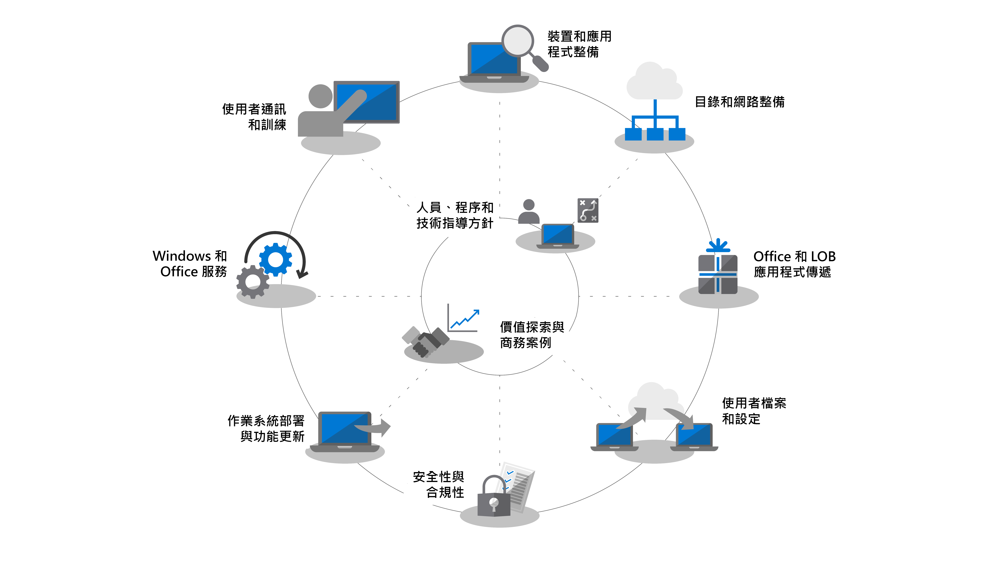
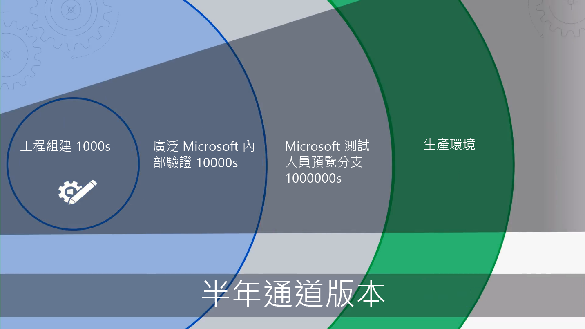

# 快速入門 - 桌面部署

<table>
<thead>
<td></td>
<td>
<strong>快速入門：人員、流程及技術指導方針</strong>

探索 Windows 10 和 Microsoft 365 Apps 企業版的優點、與先前部署比較後的重大變更與考量及最佳做法，以確保順利轉移到 Windows 10 和 Microsoft 365 Apps 企業版。
</td>
<td></td>
</thead>
</table>

>[!NOTE]
>在本系列中，我們會說明使用現有工具的最佳方法，為您介紹新技術、服務和雲端啟用的方法。  若要查看完整的桌面部署程序，請瀏覽[桌面部署中心](https://aka.ms/HowToShift)。
>

歡迎使用桌面部署中心，這是我們了解如何協助您規劃及轉變為 Windows 10 和 Microsoft 365 Apps 企業版的中心位置。 這可讓您利用具備最新生產力、團隊合作和共同作業體驗的安全工作區。

如果您有一段時間未部署新的桌面環境，好消息是太多的部署程序已有所改善。 過去的挑戰 (例如應用程式相容性) 在現在已不是問題。 新的工具和雲端提供的深入見解，可讓您比以往更具信心、更快且更有效率地往前邁進。

在本文中，我們將概述已變更的內容，然後瀏覽電腦部署轉輪。這會引導您完成您轉變至 Windows 10 以及 Microsoft 365 Apps 企業版的建議步驟，詳細說明如何運用現有的工具和程序，同時採用現代化管理技術和方法。

## 為什麼要升級？

將 Windows 10 和 Microsoft 智慧雲端合併可增強您的能力，為您的使用者提供最有能力且安全的工作區，並可以讓您簡化支援基礎結構。

現代化管理實務的主要租用戶之一，就是必須永遠保持最新版的裝置。 透過本系列，您將了解所提供的新功能可協助您移至 Windows 10 與 Microsoft 365 Apps 企業版，同時還能持續取得上述兩項的最新半年度發行版本。

[適用於 IT 專業人員的 Windows 10](https://www.microsoft.com/itpro/windows-10) (英文)

[關於 Microsoft 365 應用程式企業版](https://docs.microsoft.com/deployoffice/about-microsoft-365-apps)

## 有什麼變更

讓我們先了解上一個桌面部署開始已變更及改善之處。如果您還沒有轉變您的電腦環境，您可能還在使用 Windows 7 和 Office 2010 或 Office 2013。如果您是如此，就會發現自您上次重大升級開始有幾件事有所進化。以下是一些核心變更：

**身分識別與存取：** 能與雲端產能、安全性和管理服務連結的 Windows 10 與 Microsoft 365 Apps 企業版，在其核心上擁有身分識別與存取管理服務：Azure Active Directory (Azure AD)。 這可允許在您的雲端服務之間進行單一登入和安全連線，這表示您需要具備 Azure AD，才能充分利用 Microsoft 365 服務，例如 Office 365、Intune 或 Windows Autopilot。

[Microsoft 365](https://www.microsoft.com/microsoft-365/default.aspx)

**保護開機前環境安全：** 64 位元 UEFI 韌體會取代 BIOS。 這不僅可加快啟動時間，也是在 Windows 10 中啟動許多現代化安全性功能時的必要項目。 雖然 Windows 10 會在 BIOS 上執行，但強烈建議使用 UEFI。 如果您尚未從 BIOS 切換為 UEFI 並使用 64 位元，現在正是時候。 有一些工具可協助您在 Windows 10 升級期間或之後進行此切換。

**雲端裝置管理：** Microsoft Intune 等服務可讓您像其他行動裝置一樣，在同一個地方管理您的 Windows 10 裝置。 Microsoft Intune 的特點是能夠使用 Microsoft Endpoint Configuration Manager 共同管理 Windows 10 裝置。 您可以使用 Configuration Manager 來協助您轉換為 Windows 10，然後新增 Microsoft Intune。 搭配使用 Microsoft Endpoint Configuration Manager 後，其會變成貴組織內的智慧優勢，可連線至 Microsoft 智慧型雲端。 無論使用者裝置位於何處，是否在貴組織連線或在公用雲端連線，這都能讓您管理使用者的裝置。

[Windows 10 裝置的共同管理](https://docs.microsoft.com/mem/configmgr/core/clients/manage/co-management-overview) (英文)

**雲端部署服務：** 當您取得新電腦時，我們已引進新的雲端服務，可協助您部署稱為 Windows Autopilot 部署服務的 Microsoft 365 裝置。 Autopilot 會整合您的硬體提供者，且新電腦會在 Autopilot 中自動註冊，讓新電腦可直接出貨給終端使用者。 當電腦第一次啟動時，會快速設定為貴組織所需的設定，並針對使用者的特定需求進行自訂。

[Windows Autopilot](https://www.microsoft.com/windowsforbusiness/windows-autopilot) (英文)

**隨選即用部署：** 佈建 Office 傳統型應用程式時，Microsoft 365 Apps 企業版是慣用的選項。 這可讓您存取 Office 中正在開發的最新創新功能，如此您就不需要等待幾年的時間即可使用新功能。 您也可以使用稱為「隨選即用」的新安裝。

「隨選即用」與過去的 MSI 套件截然不同。 「隨選即用」更快也更輕便，並且支援在背景中進行更新，讓使用者保持啟動且可繼續執行的狀態。 但這仍然是 Office 的本機複本，您可以繼續使用現有的部署工具 (例如 Microsoft Endpoint Configuration Manager) 來佈建及設定應用程式。

[Microsoft 365 應用程式部署指南](https://docs.microsoft.com/DeployOffice/deployment-guide-microsoft-365-apps)

**半年更新：** 一旦移至 Windows 10 和 Microsoft 365 Apps 企業版後，每半年會提供更新和新功能。 但因為 Microsoft 能夠從雲端提供深入見解來協助您，您可以快速且充滿自信地將這些更新推廣至數百或數千個裝置。 如同就地升級，功能更新會保留先前版本的應用程式、資料和設定。

## 部署程序轉輪

在開始之前，您可能需要建立高階計劃，並找好贊助者。 我們的部署程序轉輪會概述重要的步驟，以協助您找出要在下列部署區域中管理的核心小組成員和資源。

**[步驟 1：裝置和應用程式整備](https://aka.ms/mdd1)** 為了成功部署，您必須先知道您所擁有的項目。 這表示要取得您裝置和應用程式的詳細目錄，並驗證相容性。 若要協助進行這項工作，您可以在雲端服務「電腦分析」中找到可用工具。 「電腦分析」可讓您深入發掘收集自數億部電腦的相容性情報與診斷資料，以評估裝置上執行的應用程式和驅動程式，讓您可建立電腦空間的完備性。 您甚至可以從「電腦分析」匯出一份「準備好進行部署的電腦」清單至 Configuration Manager (如果您使用此功能)，讓您在準備好時建立資料導向的目標電腦集合。

[開始使用升級整備](https://docs.microsoft.com/windows/deployment/upgrade/upgrade-readiness-get-started) (英文)

**[步驟 2：目錄和網路整備](https://aka.ms/mdd2)** 如果您尚未進行，接下來可以實作 Azure Active Directory 以進行身分識別與存取管理。 您也需要準備網路，以在其中移動系統映像、應用程式套件、使用者檔案及更新。 這表示會有大量的其他資料；您的網路必須有能力處理這項額外負荷，而不會影響貴組織的日常工作。 我們提供多種網路最佳化，從頻寬節流和對等選項到動態頻寬清除及差異化更新。

[BranchCache 與對等快取](https://blogs.technet.microsoft.com/swisspfe/2018/01/25/branch-cache-vs-peer-cache/) (英文)

**[步驟 3：Office 和企業營運應用程式傳遞](https://aka.ms/mdd3)** 在 Windows 繼續支援 MSI 型安裝之際，現在也支援較新的安裝機制，適合用於自動化部署和持續更新。 Microsoft 365 Apps 企業版和 Office 2019 用戶端使用「隨選即用」安裝技術。 您可能需要讓一些 UWP 應用程式可供使用，而且您可能會逐漸發現，所部署的第三方應用程式及內部開發企業營運應用程式是使用新的 MSIX 封裝應用程式。 這個步驟可確保您的應用程式準備好可自動化部署，且您已為成功做好準備，無論您的應用程式是否使用「隨選即用」、MSIX、傳統 MSI 部署，或是 UWP 應用程式 (部署在您所設業務的 Microsoft Store 中)。

[MSIX 簡介](https://blogs.msdn.microsoft.com/sgern/2018/06/15/msix-intro/) (英文)

**[步驟 4：使用者檔案和設定移轉](https://aka.ms/mdd4)** 這在任何電腦取代或重新整理循環中都是重要的步驟：您必須確保使用者的檔案、資料和設定移動成功，且在移轉過程中會加以保留。 此步驟涵蓋手動或自動移轉的可用選項，包含已知和新的選項。

如同先前的更新，使用者狀態移轉工具會繼續成為自動化此程序時很有價值的工具，且會保持為使用 Microsoft Endpoint Configuration Manager 或 Microsoft Deployment Toolkit 協調移轉時不可或缺的一部分。 但是在移轉過程中，移動這些資料可能是電腦取代項目的時間瓶頸，因為傳送期間有時候每部電腦會涉及兩次數百 GB 的物理情況 – 先從現有的電腦，然後再返回新的電腦。 OneDrive 所啟用的新選項是「已知資料夾移動」，會在部署之前在雲端大量同步處理使用者文件、圖片及桌面檔案。

[將 Windows 已知資料夾重新導向並移動至 OneDrive](https://docs.microsoft.com/onedrive/redirect-known-folders) (英文)

**[步驟 5：安全性與合規性](https://aka.ms/mdd5)** 安全性與合規性是移至 Windows 10 和 Microsoft 365 Apps 企業版時具有許多優點的區域。請務必熟悉新的內建功能，並與既有的功能比較。例如，Windows 10 中使用虛擬化安全性的新功能可防止認證竊盜、防止瀏覽器的漏洞和惡意程式碼執行，方法是隔離作業系統的核心程序及秘密。此外，「進階威脅防護」等雲端服務可提供整合的平台，以強化安全性、外洩後偵測、調查及回應。進階的威脅防護也可以保護您免於受到惡意電子郵件附件、不安全的超連結等攻擊。

[Microsoft Security](https://www.microsoft.com/security/default.aspx) (英文)

**[步驟 6：作業系統部署與功能更新](https://aka.ms/mdd6)** (英文) 在一切就緒後，下一步就是部署作業系統映像。進行大量的重擔可以使用 System Center Configuration Manage 順序和基礎結構來完成。建議的方法是以階段部署，首先設定目標，並使用一組代表硬體和應用程式部署至貴組織中的「早期採納者群組」。然後，您可以使用這些裝置和使用者的資料逐漸將目標設定為更多部電腦。

[在 Configuration Manager 中部署作業系統的簡介](https://docs.microsoft.com/mem/configmgr/osd/understand/introduction-to-operating-system-deployment) (部分機器翻譯)

**[步驟 7：Windows 和 Office 即服務](https://aka.ms/mdd7)** 這代表您維護使用者桌面大小方式的主要轉變。 您可以利用 Windows 10 及 Microsoft 365 Apps 企業版的這項移動，將管理 Windows 和 Office 改變為一項服務。 取代每隔幾年的大型技術轉變，您會持續將全新的功能、體驗和保護帶給您的使用者。 半年度功能更新或在每年秋季及春季提供全新的功能，而每月累積的品質更新將會包含安全性、可靠性和錯誤 (bug) 修正。 雖然您可以選擇部署 Office 2019 用戶端，但強烈建議您移至 Microsoft 365 Apps 企業版。 這會遵循 Windows 的類似服務方案，也可讓使用者定期獲得 Office 應用程式的更新。

[Windows 即服務概觀](https://docs.microsoft.com/windows/deployment/update/waas-overview)
[Office 即服務概觀](https://docs.microsoft.com/DeployOffice/overview-update-channels)

**[步驟 8：使用者的通訊和訓練](https://aka.ms/mdd8)** 最後這個步驟對於推動使用新功能以提升團隊合作、通訊、安全性等至關重要。 在廣泛部署目標為早期採納者週期外的使用者之前，建議您推行使用者通訊和訓練。 這將有助於推動在 Office、Windows 或其他企業營運應用程式和服務中的新功能使用方式所需變更。 如需協助，我們透過 Microsoft FastTrack 提供免費線上訓練。 此外，我們已發佈免費的範例通訊計劃和時間表，搭配電子郵件和社交及內部網路範本來協助您推出 Windows 10。 身為 Microsoft 365 組織，貴組織可能也符合資格且可直接支援。

## 下一步

現在您已了解 Windows 10 及 Microsoft 365 Apps 企業版的新功能和差異，我們已概要說明建議的部署程序轉輪。 透過這個可供您轉變為 Windows 10 及 Microsoft 365 Apps 企業版的端對端指導方針和工具體驗，我們開始吧。

## [步驟 1：裝置和應用程式整備](https://aka.ms/mdd1)

