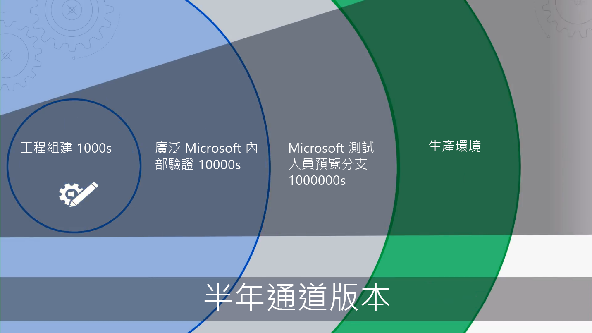

# 快速入門 - 桌面部署Getting Started - Desktop Deployment

<table>
<thead>
<td></td>
<td>
<strong>快速入門：人員、流程及技術指導方針</strong><strong>Getting Started: People, Process and Technology Guidance</strong>

探索 Windows 10 和 Office 365 專業增強版的優點、與先前部署比較後的重大變更與考量及最佳做法，以確保順利轉移到 Windows 10 和 Office 365 專業增強版。Discover the benefits of Windows 10 and Office 365 ProPlus, major changes and considerations versus previous deployments, and best practices to ensure a smooth transition to Windows 10 and Office 365 ProPlus.
</td>
<td></td>
</thead>
</table>

>[!NOTE]
>在本系列中，我們會說明使用現有工具的最佳方法，為您介紹新技術、服務和雲端啟用的方法。In this series we will explain the best ways to use existing tools and introduce you to new technologies, services, and methods enabled by the Cloud.  若要查看完整的桌面部署程序，請瀏覽[桌面部署中心](https://aka.ms/HowToShift)。To see the full desktop deployment process, visit the [Desktop Deployment Center](https://aka.ms/HowToShift).
>

歡迎使用桌面部署中心，這是我們了解如何協助您規劃及轉變為 Windows 10 和 Office 365 專業增強版的中心位置。Welcome to the Desktop Deployment Center, our central place to learn how to help you plan and make the shift to Windows 10 and Office 365 ProPlus. 這可讓您利用具備最新生產力、團隊合作和共同作業體驗的安全工作區。This will allow you take advantage of a secure workspace, powered by the latest productivity, teamwork, and collaboration experiences.

如果您有一段時間未部署新的桌面環境，好消息是太多的部署程序已有所改善。If you haven’t deployed a new desktop environment for a while, the good news is much about the deployment process has improved. 過去的挑戰 (例如應用程式相容性) 在現在已不是問題。Challenges of the past, such as application compatibility, are much less of an issue today. 新的工具和雲端提供的深入見解，可讓您比以往更具信心、更快且更有效率地往前邁進。New tools, as well as insight delivered from the Cloud, enable you to move forward with confidence faster and more efficiently than ever before.

在本文中，我們將概述已變更的內容，然後瀏覽電腦部署轉輪。這會引導您完成您轉變至 Windows 10 以及 Office 365 專業增強版的建議步驟，詳細說明如何運用現有的工具和程序，同時採用現代化管理技術和方法。In this introduction we’ll outline what has changed and go on a tour of the Desktop Deployment Wheel. This will guide you through the recommended steps for your shift to Windows 10 and Office 365 ProPlus, detailing how to leverage your existing tools and processes while adopting modern management technology and approaches along the way.

## 為什麼要升級？Why upgrade?

將 Windows 10 和 Microsoft 智慧雲端合併可增強您的能力，為您的使用者提供最有能力且安全的工作區，並可以讓您簡化支援基礎結構。In combination, Windows 10 and the Microsoft Intelligence Cloud enhance your ability to deliver the most empowering and secure workspace for your users while allowing you to simplify your supporting infrastructure.

現代化管理實務的主要租用戶之一，就是必須永遠保持最新版的裝置。One of the key tenants of modern management practices is devices that are always up-to-date. 透過本系列，您將了解所提供的新功能可協助您移至 Windows 10 與 Office 365 專業增強版，同時還能持續取得上述兩項的最新半年度發行版本。Through this series you will read about new capabilities that are being delivered to help you move to Windows 10 and Office 365 ProPlus while staying current with the semi-annual releases of both.

[適用於 IT 專業人員的 Windows 10](https://www.microsoft.com/itpro/windows-10) (英文)[Windows 10 for the IT Pro](https://www.microsoft.com/itpro/windows-10)

[關於企業中的 Office 365 專業增強版](https://docs.microsoft.com/deployoffice/about-office-365-proplus-in-the-enterprise) (英文)[About Office 365 ProPlus in the enterprise](https://docs.microsoft.com/deployoffice/about-office-365-proplus-in-the-enterprise)

## 有什麼變更What has Changed

讓我們先了解上一個桌面部署開始已變更及改善之處。如果您還沒有轉變您的電腦環境，您可能還在使用 Windows 7 和 Office 2010 或 Office 2013。如果您是如此，就會發現自您上次重大升級開始有幾件事有所進化。以下是一些核心變更：Let’s start by taking a look at what has changed and improved since your last desktop deployment. If you haven’t shifted your desktop environment in a while you’re likely using Windows 7 and Office 2010 or Office 2013. If you are, you'll notice a few things have evolved since your last major upgrade. Here are some of the core changes:

**身分識別與存取：** 能與雲端產能、安全性和管理服務連結的 Windows 10 與 Office 365 專業增強版，在其核心上擁有身分識別與存取管理服務：Azure Active Directory (Azure AD)。**Identity and Access:** Windows 10 and Office 365 ProPlus, with its connectivity to cloud productivity, security, and management services, has a new Identity and Access Management service at its core: Azure Active Directory (Azure AD). 這可允許在您的雲端服務之間進行單一登入和安全連線，這表示您需要具備 Azure AD，才能充分利用 Microsoft 365 服務，例如 Office 365、Intune 或 Windows Autopilot。This enables single sign-on and secure connectivity across your cloud services, meaning that you are going to need Azure AD in place to take advantage of Microsoft 365 services such as Office 365, Intune, or Windows Autopilot.

[Microsoft 365Microsoft 365](https://www.microsoft.com/microsoft-365/default.aspx)

**保護開機前環境安全：** 64 位元 UEFI 韌體會取代 BIOS。**Secure Pre-Boot Environment:** 64-bit UEFI firmware replaces BIOS. 這不僅可加快啟動時間，也是在 Windows 10 中啟動許多現代化安全性功能時的必要項目。This not only speeds up boot times, it is required to enable many of the modern security capabilities in Windows 10. 雖然 Windows 10 會在 BIOS 上執行，但強烈建議使用 UEFI。While Windows 10 will run on BIOS, UEFI is strongly recommended. 如果您尚未從 BIOS 切換為 UEFI 並使用 64 位元，現在正是時候。If you have not switched from BIOS to UEFI and leveraging 64-bit, now is the time. 有一些工具可協助您在 Windows 10 升級期間或之後進行此切換。There are tools to help you make this switch either during a Windows 10 upgrade, or after it.

**雲端裝置管理：** Microsoft Intune 等服務可讓您像其他行動裝置一樣，在同一個地方管理您的 Windows 10 裝置。**Cloud-based device Management:** Services like Microsoft Intune help you manage your Windows 10 devices as you do other mobile devices, all from one place. Microsoft Intune 的特點是使用 System Center Configuration Manager 共同管理 Windows 10 裝置。What makes Microsoft Intune unique is the ability to co-manage your Windows 10 devices with System Center Configuration Manager. 您可以使用 System Center Configuration Manager 來協助您轉換為 Windows 10，然後新增 Microsoft Intune。You can use System Center Configuration Manager to help you in your shift to Windows 10, and then add Microsoft Intune. 搭配使用 System Center Configuration Manager 後，其會變成貴組織內的智慧邊緣，可連線至 Microsoft 智慧型雲端。Working together, System Center Configuration Manager becomes the intelligent edge within your organization, connected to the Microsoft intelligent cloud. 無論使用者裝置位於何處，是否在貴組織連線或在公用雲端連線，這都能讓您管理使用者的裝置。This allows you to manage your users’ devices securely wherever they are, whether connected on your organization’s infrastructure or in the public cloud.

[Windows 10 裝置的共同管理](https://docs.microsoft.com/sccm/core/clients/manage/co-management-overview) (英文)[Co-management for Windows 10 devices](https://docs.microsoft.com/sccm/core/clients/manage/co-management-overview)

**雲端部署服務：** 當您取得新電腦時，我們已引進新的雲端服務，可協助您部署稱為 Windows Autopilot 部署服務的 Microsoft 365 裝置。**Cloud-based Deployment Service:** As you acquire new PCs we’ve introduced a new cloud service to help you deploy Microsoft 365 devices called the Windows Autopilot deployment service. Autopilot 會整合您的硬體提供者，且新電腦會在 Autopilot 中自動註冊，讓新電腦可直接出貨給終端使用者。Autopilot is integrated with your hardware providers and new PCs are automatically registered in Autopilot enabling the new PC to be shipped directly to the end-user. 當電腦第一次啟動時，會快速設定為貴組織所需的設定，並針對使用者的特定需求進行自訂。When the PC is powered on the first time it is quickly configured to your organizations desired configuration and customized for the specific needs of the user.

[Windows Autopilot](https://www.microsoft.com/windowsforbusiness/windows-autopilot) (英文)[Windows Autopilot](https://www.microsoft.com/windowsforbusiness/windows-autopilot)

**隨選即用部署：** 佈建 Office 傳統型應用程式時，Office 365 專業增強版是慣用的選項。**Click-to-Run Deployments:** When provisioning Office desktop apps, Office 365 ProPlus is the preferred option. 這可讓您存取 Office 中正在開發的最新創新功能，如此您就不需要等待幾年的時間即可使用新功能。This gives you access to the newest innovations in Office as they are developed, so you won’t need to wait years before getting new capabilities. 您也可以使用稱為「隨選即用」的新安裝。You’ll also use a new installation called Click-to-Run.

「隨選即用」與過去的 MSI 套件截然不同。Click-to-Run is quite different from the MSI-based packages of the past. 「隨選即用」更快也更輕便，並且支援在背景中進行更新，讓使用者保持啟動且可繼續執行的狀態。Click-to-Run is faster, lighter, and supports updates in the background to keep your users to be up and running. 但這仍然是 Office 的本機複本，您可以繼續使用現有的部署工具 (例如 System Center Configuration Manager) 來佈建及設定應用程式。It is still a local copy of Office and you can continue to use your existing deployment tools, like System Center Configuration Manager, to provision and configure the apps.

[Office 365 專業增強版部署指南Deployment guide for Office 365 ProPlus](https://docs.microsoft.com/DeployOffice/deployment-guide-for-office-365-proplus)

**半年更新：** 一旦移至 Windows 10 和 Office 365 專業增強版後，每半年會提供更新和新功能。**Semi-Annual Updates:** Once you have moved to Windows 10 and Office 365 ProPlus, updates are delivered semi-annually with new features. 但因為 Microsoft 能夠從雲端提供深入見解來協助您，您可以快速且充滿自信地將這些更新推廣至數百或數千個裝置。But with Microsoft able to deliver insights from the cloud to help, you can quickly and confidently roll out these updates to hundreds or thousands of devices. 如同就地升級，功能更新會保留先前版本的應用程式、資料和設定。Like an in-place upgrade, the Feature Update preserves apps, data, and configurations from the previous release.

## 部署程序轉輪The Deployment Process Wheel

在開始之前，您可能需要建立高階計劃，並找好贊助者。Before you get started, you’ll want to create a high-level plan and get the necessary sponsors on board. 我們的部署程序轉輪會概述重要的步驟，以協助您找出要在下列部署區域中管理的核心小組成員和資源。Our deployment process wheel outlines critical steps to help you to identify core team members and resources to manage in the following deployment areas.

**[步驟 1：裝置和應用程式整備](https://aka.ms/mdd1)** 為了成功部署，您必須先知道您所擁有的項目。**[Step 1: Device and App readiness](https://aka.ms/mdd1)** For a successful deployment you must first know what you have. 這表示要取得您裝置和應用程式的詳細目錄，並驗證相容性。That means taking an inventory of your devices and apps and verifying compatibility. 若要協助進行這項工作，您可以在雲端服務「電腦分析」中找到可用工具。To help with this you can leverage the tools available in our cloud-based service, Desktop Analytics. 「電腦分析」可讓您深入發掘收集自數億部電腦的相容性情報與診斷資料，以評估裝置上執行的應用程式和驅動程式，讓您可建立電腦空間的完備性。Desktop Analytics allows you tap into compatibility intelligence and diagnostic data gathered from hundreds of millions of PCs, to assess the apps and drivers running on your device so you can establish the readiness of your desktop estate. 您甚至可以從「電腦分析」匯出一份「準備好進行部署的電腦」清單至 System Center Configuration Manager (如果您使用此功能)，讓您在準備好時建立資料導向的目標電腦集合。You can even export a list of “PCs ready for deployment” from Desktop Analytics to System Center Configuration Manager if you use it, allowing you to build data-driven collections of targeted PCs as they become ready.

[開始使用升級整備](https://docs.microsoft.com/windows/deployment/upgrade/upgrade-readiness-get-started) (英文)[Get started with Upgrade Readiness](https://docs.microsoft.com/windows/deployment/upgrade/upgrade-readiness-get-started)

**[步驟 2：目錄和網路整備](https://aka.ms/mdd2)** 如果您尚未進行，接下來可以實作 Azure Active Directory 以進行身分識別與存取管理。**[Step 2: Directory and Network Readiness](https://aka.ms/mdd2)** If you haven’t already, you’ll want to implement Azure Active Directory for identity and access management next. 您也需要準備網路，以在其中移動系統映像、應用程式套件、使用者檔案及更新。You will also want to prepare your network for the movement of system images, application packages, user files, and updates across it. 這表示會有大量的其他資料；您的網路必須有能力處理這項額外負荷，而不會影響貴組織的日常工作。That means a large amount of additional data; your network must have the capacity to handle this extra load without impact to the day-to-day work of your organization. 我們提供多種網路最佳化，從頻寬節流和對等選項到動態頻寬清除及差異化更新。We have a range of networking optimizations available from bandwidth throttling and peer-to-peer options to dynamic bandwidth scavenging and differential updating.

[BranchCache 與對等快取](https://blogs.technet.microsoft.com/swisspfe/2018/01/25/branch-cache-vs-peer-cache/) (英文)[BranchCache vs. Peer Cache](https://blogs.technet.microsoft.com/swisspfe/2018/01/25/branch-cache-vs-peer-cache/)

**[步驟 3：Office 和企業營運應用程式傳遞](https://aka.ms/mdd3)** 在 Windows 繼續支援 MSI 型安裝之際，現在也支援較新的安裝機制，適合用於自動化部署和持續更新。**[Step 3: Office and Line of Business App Delivery](https://aka.ms/mdd3)** While Windows continues to support MSI-based installations it also now supports newer installations mechanisms, optimized for automated deployment and continuous updates. Office 365 專業增強版和 Windows 2019 用戶端使用「隨選即用」安裝技術。Office 365 ProPlus and Office 2019 clients use Click-to-Run installation technology. 您可能需要讓一些 UWP 應用程式可供使用，而且您可能會逐漸發現，所部署的第三方應用程式及內部開發企業營運應用程式是使用新的 MSIX 封裝應用程式。You may want to make a range of UWP apps available, and you may increasingly find yourself deploying third-party apps and in-house developed Line of Business Apps that use the new MSIX-based packaging apps. 這個步驟可確保您的應用程式準備好可自動化部署，且您已為成功做好準備，無論您的應用程式是否使用「隨選即用」、MSIX、傳統 MSI 部署，或是 UWP 應用程式 (部署在您所設業務的 Microsoft Store 中)。This step ensures your apps are ready for automated deployments, and that you are set up for success whether your apps deploy using Click-to-Run, MSIX, conventional MSI-based, or are UWP apps deployed from a Microsoft Store from Business you set up.

[MSIX 簡介](https://blogs.msdn.microsoft.com/sgern/2018/06/15/msix-intro/) (英文)[MSIX Intro](https://blogs.msdn.microsoft.com/sgern/2018/06/15/msix-intro/)

**[步驟 4：使用者檔案和設定移轉](https://aka.ms/mdd4)** 這在任何電腦取代或重新整理循環中都是重要的步驟：您必須確保使用者的檔案、資料和設定移動成功，且在移轉過程中會加以保留。**[Step 4: User Files and Settings Migration](https://aka.ms/mdd4)** This is a critical step in any PC replacement or refresh cycle: you have to ensure users’ files, data, and settings move successfully and are preserved over the migration. 此步驟涵蓋手動或自動移轉的可用選項，包含已知和新的選項。This step covers the options available for manual or automated migrations, including well-known and new options.

如同先前的更新，使用者狀態移轉工具會繼續成為自動化此程序時很有價值的工具，且會保持為使用 System Center Configuration Manager 或 Microsoft Deployment Toolkit 協調移轉時不可或缺的一部分。As in previous upgrades, the User State Migration Tool continues to be a valuable tool to automate this process and it remains an integral part of migrations orchestrated using System Center Configuration Manager or the Microsoft Deployment Toolkit. 但是在移轉過程中，移動這些資料可能是電腦取代項目的時間瓶頸，因為傳送期間有時候每部電腦會涉及兩次數百 GB 的物理情況 – 先從現有的電腦，然後再返回新的電腦。But moving all this data at migration can be a timing bottleneck for PC replacement due to the physics involved in transferring sometimes hundreds of gigabytes per PC twice – first from the existing desktop, then back down to the new desktop. OneDrive 所啟用的新選項是「已知資料夾移動」，會在部署之前在雲端大量同步處理使用者文件、圖片及桌面檔案。A new option enabled by OneDrive is Known Folder Move used to sync user documents, pictures, and desktop files at scale, in the cloud, and ahead of deployment.

[將 Windows 已知資料夾重新導向並移動至 OneDrive](https://docs.microsoft.com/onedrive/redirect-known-folders) (英文)[Redirect and move Windows known folders to OneDrive](https://docs.microsoft.com/onedrive/redirect-known-folders)

**[步驟 5：安全性與合規性](https://aka.ms/mdd5)** 安全性與合規性是移至 Windows 10 和 Office 365 專業增強版時具有許多優點的區域。請務必熟悉新的內建功能，並與既有的功能比較。例如，Windows 10 中使用虛擬化安全性的新功能可防止認證竊盜、防止瀏覽器的漏洞和惡意程式碼執行，方法是隔離作業系統的核心程序及秘密。此外，「進階威脅防護」等雲端服務可提供整合的平台，以強化安全性、外洩後偵測、調查及回應。進階的威脅防護也可以保護您免於受到惡意電子郵件附件、不安全的超連結等攻擊。**[Step 5: Security and Compliance](https://aka.ms/mdd5)** Security and Compliance is an area with a lot upside when moving to Windows 10 and Office 365 ProPlus. It is important you familiarize yourself with the new built-in capabilities and compare that with what you already have. For example, new capabilities in Windows 10 using virtualization-based security can prevent credential theft, protect against browser-based exploits and malicious code execution by isolating core processes and secrets from the operating system. In addition, cloud services like Advanced Threat Protection give you a unified platform for security hardening, post-breach detection, investigation, and response. Advanced Threat Protection can also safeguard you against malicious email attachments, unsafe hyperlinks and more.

[Microsoft Security](https://www.microsoft.com/security/default.aspx) (英文)[Microsoft Security](https://www.microsoft.com/security/default.aspx)

**[步驟 6：作業系統部署與功能更新](https://aka.ms/mdd6)** (英文) 在一切就緒後，下一步就是部署作業系統映像。進行大量的重擔可以使用 System Center Configuration Manage 順序和基礎結構來完成。建議的方法是以階段部署，首先設定目標，並使用一組代表硬體和應用程式部署至貴組織中的「早期採納者群組」。然後，您可以使用這些裝置和使用者的資料逐漸將目標設定為更多部電腦。**[Step 6: OS Deployment and Feature Updates](https://aka.ms/mdd6)** With everything prepared, the next step is to deploy the OS images. A lot of the heavy lifting for can be done using System Center Configuration Manage task sequences and infrastructure. The recommended approach is to deploy in phases, first targeting and deploying to an “early adopter group” in your organization using a representative set of hardware and apps. You can then use the data from those devices and users to gradually target more and more PCs.

[在 System Center Configuration Manager 中部署作業系統的簡介](https://docs.microsoft.com/sccm/osd/understand/introduction-to-operating-system-deployment) (英文)[Introduction to operating system deployment in System Center Configuration Manager](https://docs.microsoft.com/sccm/osd/understand/introduction-to-operating-system-deployment)

**[步驟 7：Windows 和 Office 即服務](https://aka.ms/mdd7)** 這代表您維護使用者桌面大小方式的主要轉變。**[Step 7: Windows and Office as a Service](https://aka.ms/mdd7)** This represents a major shift in the way you maintain users’ desktop real-estate. 您可以利用 Windows 10 及 Office 365 專業增強版的這項移動，將管理 Windows 和 Office 改變為一項服務。With this move to Windows 10 and Office 365 ProPlus you can move to managing Windows and Office as a service. 取代每隔幾年的大型技術轉變，您會持續將全新的功能、體驗和保護帶給您的使用者。In place of a massive shift in technology every few years, you will continually be bringing new capabilities, experiences, and protections to your user. 半年度功能更新或在每年秋季及春季提供全新的功能，而每月累積的品質更新將會包含安全性、可靠性和錯誤 (bug) 修正。Semi-annual feature updates deliver new capabilities in the Fall and Spring of each year, while monthly cumulative Quality Updates will contain security, reliability, and bug fixes. 雖然您可以選擇部署 Office 2019 用戶端，但強烈建議您移至 Office 365 專業增強版。While you can opt to deploy the Office 2019 client, we strongly recommend you to move to Office 365 ProPlus. 這會遵循 Windows 的類似服務方案，也可讓使用者定期獲得 Office 應用程式的更新。This follows a similar service plan to Windows so your users get updates to the Office apps on a regular basis too.

[Windows 即服務概觀](https://docs.microsoft.com/windows/deployment/update/waas-overview)
[Office 即服務概觀](https://docs.microsoft.com/DeployOffice/overview-of-update-channels-for-office-365-proplus)[Overview of Windows as a service](https://docs.microsoft.com/windows/deployment/update/waas-overview)
[Overview of Office as a service](https://docs.microsoft.com/DeployOffice/overview-of-update-channels-for-office-365-proplus)

**[步驟 8：使用者的通訊和訓練](https://aka.ms/mdd8)** 最後這個步驟對於推動使用新功能以提升團隊合作、通訊、安全性等至關重要。**[Step 8: User Communications and Training](https://aka.ms/mdd8)** This last step is critical to driving usage of new capabilities for enhancing teamwork, communications, security, and more. 在廣泛部署目標為早期採納者週期外的使用者之前，建議您推行使用者通訊和訓練。Before broad deployment is targeted to users outside early adopter rings, we recommend you roll out user communication and training. 這將有助於推動在 Office、Windows 或其他企業營運應用程式和服務中的新功能使用方式所需變更。This will help drive desired changes in how people use new capabilities in Office, Windows, or other line of business apps and services. 如需協助，我們透過 Microsoft FastTrack 提供免費線上訓練。To assist, we provide free online training via Microsoft FastTrack. 此外，我們已發佈免費的範例通訊計劃和時間表，搭配電子郵件和社交及內部網路範本來協助您推出 Windows 10。Plus, we’ve published free sample communication plans and timelines together with email, social, and intranet templates to help with your rollout of Windows 10. 身為 Microsoft 365 或 Office 365 的組織，貴組織可能也符合資格且直接支援。As a Microsoft 365 or Office 365 organization, your organization may also be eligible for and direct support.

## 下一步Next Step

現在您已了解 Windows 10 及 Office 365 專業增強版的新功能和差異，我們已概要說明建議的部署程序轉輪。Now you know what’s new and different in Windows 10 and Office 365 ProPlus, and we have walked through our recommended deployment process wheel. 透過這個可供您轉變為 Windows 10 及 Office 365 專業增強版的端對端指導方針和工具體驗，我們開始吧。With this taste for the end-to-end guidance and tools available for you to make the shift to Windows 10 and Office 365 ProPlus, let’s get started.

## [步驟 1：裝置和應用程式整備Step 1: Device and App Readiness](https://aka.ms/mdd1)

