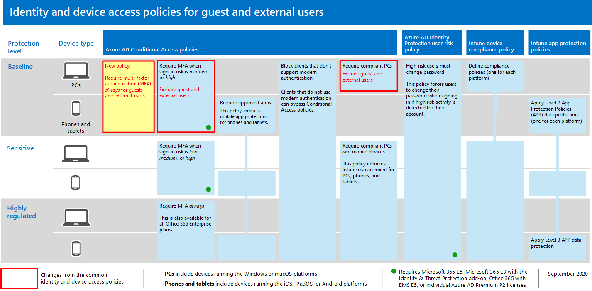

# 允許來賓和外部 B2B 存取的原則Policies for allowing guest and external B2B access

本文說明如何調整建議的常見身分識別和裝置存取原則，以允許商務對企業 (B2B) 帳戶存取 (來賓和外部使用者) 。This article describes how to adjust the recommended common identity and device access policies to allow Business-to-Business (B2B) account access (guest and external users). 本指南是以 [通用身分識別和裝置存取原則](identity-access-policies.md)為基礎。This guidance builds on the [common identity and device access policies](identity-access-policies.md).

這些建議適用于保護的 **基準** 層。These recommendations are designed to apply to the **baseline** tier of protection. 不過，您也可以依據 **敏感** 和 **高管制** 保護的需求細微性來調整建議。However, you can also adjust the recommendations based on the granularity of your needs for **sensitive** and **highly regulated** protection. 

提供路徑供 B2B 使用者向您的 Azure Active Directory (Azure AD) 承租人進行驗證時，不會讓這些使用者存取您的整個環境。Providing a path for B2B users to authenticate with your Azure Active Directory (Azure AD) tenant doesn't give these users access to your entire environment. B2B 使用者只能存取與其共用的資源 (例如，在條件式存取原則中授與服務內) 的檔案。B2B users only have access to resources that are shared with them (such as files) within the services granted in the Conditional Access policies.

## 更新共同原則以允許及保護來賓和外部存取Updating the common policies to allow and protect guest and external access 

為了保護來賓和外部存取，下列圖表說明要從通用身分識別和裝置存取原則中新增或更新的原則。To protect guest and external access, the following diagram illustrates which policies to add or update from the the common identity and device access policies . 

[查看較大版本的此影像See a larger version of this image](https://github.com/MicrosoftDocs/microsoft-365-docs/raw/public/microsoft-365/media/microsoft-365-policies-configurations/identity-access-ruleset-guest.png)

下表列出您必須更新或建立的原則。The following table lists the policies you either need to update or create new. 通用身分 [識別與裝置存取原則](identity-access-policies.md) 文章中相關之設定指示的常見原則連結。The common policies link to the associated configuration instructions in the [Common identity and device access policies](identity-access-policies.md) article.

|保護層級Protection level|原則Policies|詳細資訊More information|
|:---------------|:-------|:----------------|
|**Baseline****Baseline**|[需要對來賓和外部使用者永遠進行 MFARequire MFA always for guest and external users](identity-access-policies.md#require-mfa-based-on-sign-in-risk)|建立此新原則，並將其套用至來賓和外部使用者。Create this new policy and apply it only to guests and external users. 在 [登 **入風險**] 下，將所有選項保留未勾選狀態，以永遠強制執行多重要素驗證 (MFA) 。Under **Sign-in risk**, leave all options unchecked to always enforce multi-factor authentication (MFA).|
|        |[當登入風險為*中*或*高*時，需要 MFARequire MFA when sign-in risk is *medium* or *high*](identity-access-policies.md#require-mfa-based-on-sign-in-risk)|修改此原則，以排除來賓和外部使用者。Modify this policy to exclude guest and external users.|
|        |[需要相容的電腦Require compliant PCs](identity-access-policies.md#require-compliant-pcs-but-not-compliant-phones-and-tablets)|修改此原則，以排除來賓和外部使用者。Modify this policy to exclude guest and external users.|

若要在條件式存取原則中包含或排除來賓和外部使用者，請按一下 [ **包含** 或 **排除** ] 索引標籤，並檢查 **所有來賓和外部使用者**。To include or exclude guests and external users in Conditional Access policies, click the **Include** or **Exclude** tab and check **All guests and external users**.

## 詳細資訊More information

### 來賓與外部使用者Guests vs. external users
在 Azure AD 中，來賓和外部使用者皆相同。In Azure AD, guest and external users are the same. 這兩種皆為來賓的使用者類型。The user type for both of these is Guest. 來賓使用者 B2B 使用者。Guest users are B2B users.

Microsoft 小組區分來賓使用者和應用程式內的外部使用者。Microsoft Teams differentiates between guest users and external users within the app. 來賓使用者已有 Azure AD B2B 帳戶，而且可以新增至小組。Guest users have Azure AD B2B accounts and can be added to teams. 外部使用者只能參與通話、聊天和會議。External users can only participate in calls, chats, and meetings. 如需詳細資訊，請參閱 [這兩種來賓和外部使用者對團隊的比較](https://docs.microsoft.com/microsoftteams/communicate-with-users-from-other-organizations#compare-external-and-guest-access)。For more information, see [this comparison between guest and external users for teams](https://docs.microsoft.com/microsoftteams/communicate-with-users-from-other-organizations#compare-external-and-guest-access).

請參閱 [保護小組聊天、群組和檔案的原則建議](teams-access-policies.md) ，以取得安全身分識別與裝置存取的相關資訊。See [Policy recommendations for securing Teams chats, groups, and files](teams-access-policies.md) for more information about securing identity and device access for Teams

### 需要對來賓和外部使用者永遠進行 MFARequire MFA always for guest and external users
此原則會提示客人在您的租使用者中註冊 MFA，不論他們是否已在其主承租人中為 MFA 註冊。This policy prompts guests to register for MFA in your tenant, regardless of whether they're registered for MFA in their home tenant. 當存取您租使用者中的資源時，來賓和外部使用者必須針對每個要求使用 MFA。When accessing resources in your tenant, guests and external users are required to use MFA for every request. 

### 從風險型 MFA 排除來賓和外部使用者Excluding guest and external users from risk-based MFA
雖然組織可以對使用 Azure AD 身分識別保護的 B2B 使用者強制執行風險原則原則，但由於其內部目錄中的現有身分識別，對資原始目錄中 B2B 共同作業使用者執行 Azure AD 身分識別保護有一些限制。While organizations can enforce risk-based policies for B2B users using Azure AD Identity Protection, there are limitations in the implementation of Azure AD Identity Protection for B2B collaboration users in a resource directory due to their identity existing in their home directory. 由於這些限制，Microsoft 建議您從以風險為基礎的 MFA 原則中排除來賓使用者，並要求這些使用者永遠使用 MFA。Due to these limitations, Microsoft recommends you exclude guest users from risk-based MFA policies and require these users to always use MFA. 

如需詳細資訊，請參閱 [B2B 協同作業使用者的身分識別保護限制](https://docs.microsoft.com/azure/active-directory/identity-protection/concept-identity-protection-b2b#limitations-of-identity-protection-for-b2b-collaboration-users)。For more information, see [Limitations of Identity Protection for B2B collaboration users](https://docs.microsoft.com/azure/active-directory/identity-protection/concept-identity-protection-b2b#limitations-of-identity-protection-for-b2b-collaboration-users). 

### 從裝置管理排除來賓和外部使用者Excluding guest and external users from device management 
只有一個組織可以管理裝置。Only one organization can manage a device. 如果您未從需要裝置規範的原則中排除來賓和外部使用者，這些原則將會封鎖這些使用者。If you don't exclude guest and external users from policies that require device compliance, these policies will block these users. 

## 後續步驟Next step

為下列專案設定條件式存取原則：Configure Conditional Access policies for:

- [Microsoft TeamsMicrosoft Teams](teams-access-policies.md)
- [Exchange OnlineExchange Online](secure-email-recommended-policies.md)
- [SharePointSharePoint](secure-email-recommended-policies.md)

