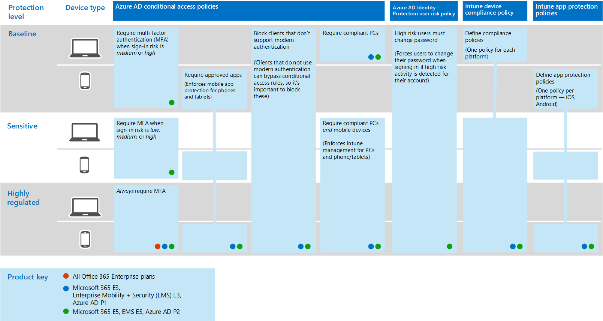

# 一般身分識別與裝置存取原則
本文說明的一般建議的原則保護存取雲端服務，包括內部部署應用程式與 Azure AD 應用程式 Proxy 一起發佈。 

本指南將討論如何部署新佈建的環境中建議的原則。 設定個別的實驗室環境中的這些原則可讓您了解和臨時推行至前期製作和生產環境之前進行評估建議的原則。 您新佈建的環境可能僅限雲端或混合式。  

## 原則設定 

下圖說明這組建議的原則。 它會顯示哪些層保護於一身的每個原則套用至，以及是否原則套用至電腦或手機和平板電腦裝置這兩個類別。 它也會指出已這些原則。

本文的其餘部分說明如何設定這些原則。 

建議使用多重要素驗證之前到 Intune 註冊裝置的裝置是在所預期的使用者所持有的保證。 您也必須到 Intune 註冊裝置，先強制執行裝置合規性原則。

若要授與您有時間來完成這些工作，我們建議此表格中的比較基準原則實作的順序列出。 但是，保護機密和高管制的 MFA 原則可實作任何時候。

|保護層級|原則|詳細資訊|
|:---------------|:-------|:----------------|
|**Baseline**|[登入風險*中*] 或 [*高*時需要 MFA](#require-mfa-based-on-sign-in-risk)| |
|        |[封鎖用戶端不支援新式驗證](#block-clients-that-dont-support-modern-authentication)|請勿使用新式驗證的用戶端可以略過條件式存取規則，因此請務必封鎖這些|
|        |[高風險使用者必須變更密碼](#high-risk-users-must-change-password)|強制使用者變更其密碼，當偵測到高風險的活動時為其帳戶登入|
|        |[定義應用程式保護原則](#define-app-protection-policies)|每個平台 (iOS、 Android、 Windows) 的一項原則。|
|        |[需要核准的應用程式](#require-approved-apps)|強制執行手機和平板電腦行動應用程式的保護|
|        |[定義裝置合規性原則](#define-device-compliance-policies)|每個平台的一個原則|
|        |[需要相容的電腦](#require-compliant-pcs-but-not-compliant-phones-and-tablets)|強制執行 Intune 管理的電腦|
|**敏感性**|[*低*、*中*或*高*登入風險時，需要 MFA](#require-mfa-based-on-sign-in-risk)| |
|         |[需要相容電腦*和*行動裝置](#require-compliant-pcs-and-mobile-devices)|強制執行 Intune 管理的電腦和手機/平板電腦|
|**高管制**|[*永遠*需要 MFA](#require-mfa-based-on-sign-in-risk)|
| | |

## 將原則指派給使用者
設定原則之前, 找出您所使用的每一層的保護 Azure AD 群組。 一般而言，基準保護套用至組織中每個人。 包含的比較基準，並且機密保護的使用者必須套用的所有比較基準原則加上的敏感的原則。 防護是累計及強制使用最嚴格的原則。 

建議的作法是建立 Azure AD 群組的條件式存取排除項目。 將此群組新增至您的所有條件式存取規則下 」 排除 」。 這可以讓您存取提供給使用者，而您疑難排解存取問題的方法。 這被建議作為暫時解決方案。 監視此群組的變更，並確定只有如預期般正在使用排除群組。 

下圖提供使用者工作分派以及排除項目範例。

在圖例中 「 上方秘密專案 X 小組 」 會指派 MFA*一律*需要條件式存取原則。 當套用至使用者的高層級的保護，則會明智。 此專案小組成員都必須提供兩種形式的驗證，每次登入時，即使他們沒有檢視高管制的內容。  

建立這些建議的一部分的所有 Azure AD 群組必須為 Office 365 群組建立。 在 SharePoint Online 中保護文件時，這對於部署 Azure 資訊保護 (AIP) 特別重要。

## 需要根據登入風險的 MFA
之前需要 MFA，第一次使用 Identity Protection MFA 註冊原則來註冊使用者的 mfa 功能。 登錄使用者之後，您可以強制 MFA 登入。 [必要工作](identity-access-prerequisites.md)包括將所有使用者都註冊使用 MFA。

若要建立新的條件式存取原則： 

1. 前往[ Azure 入口網站](https://portal.azure.com)，並使用您的認證登入。 您已成功登入之後，您會看到 Azure 儀表板。

2. 從左功能表選擇 [Azure Active Directory]。

3. 在 [安全性] 區段下，選擇 [條件式存取]。

4. 選擇 [新增原則]。

 下表描述要針對這個原則實作的條件式存取原則設定。

**指派**

|類型|屬性|值|附註|
|:---|:---------|:-----|:----|
|使用者和群組|Include|選取使用者和群組 - 選取包含目標使用者的特定安全性群組|從包含試驗使用者的安全性群組開始|
||排除|例外狀況安全性群組；服務帳戶 (應用程式身分識別)|根據視需要暫時修改成員資格|
|雲端應用程式|Include|選取您想要此規則套用至應用的程式。 例如，選取 [Office 365 Exchange Online||
|條件|已設定|是|進行您環境和需求的特定設定|
|登入風險|風險層級||請參閱下表中的指引|

**登入風險**

適用於根據您的目標的保護層級的設定。

|屬性	|保護層級|值|附註|
|:---|:---------|:-----|:----|
|風險層級|基準|高、中|檢查兩者|
| |敏感性|高、 中、 低|三個全選|
| |高管制| |保留所有選項已取消核取一律強制執行 MFA|

**存取控制**

|類型|屬性|值|附註|
|:---|:---------|:-----|:----|
|授與|授予存取|True|已選取|
||需要 MFA|True|Check|
||需要裝置標記為相容|False||
||需要混合式 Azure AD 加入的裝置|False||
||需要核准的用戶端應用程式|False||
||需要所有選取的控制項|True|已選取|

> [!NOTE]
> 請務必啟用此原則中，選擇 [**上**。 也請考慮使用[怎麼](https://docs.microsoft.com/azure/active-directory/active-directory-conditional-access-whatif)工具來測試原則。

## 封鎖用戶端不支援新式驗證
1. 前往[ Azure 入口網站](https://portal.azure.com)，並使用您的認證登入。 您已成功登入之後，您會看到 Azure 儀表板。

2. 從左功能表選擇 [Azure Active Directory]。

3. 在 [安全性] 區段下，選擇 [條件式存取]。

4. 選擇 [新增原則]。

下表描述要針對這個原則實作的條件式存取原則設定。

**指派**

|類型|屬性|值|附註|
|:---|:---------|:-----|:----|
|使用者和群組|Include|選取使用者和群組 - 選取包含目標使用者的特定安全性群組|從包含試驗使用者的安全性群組開始|
||排除|例外狀況安全性群組；服務帳戶 (應用程式身分識別)|視需要暫時修改成員資格|
|雲端應用程式|Include|選取您想要此規則套用至應用的程式。 例如，選取 [Office 365 Exchange Online||
|條件|已設定|是|設定用戶端應用程式|
|用戶端應用程式|已設定|是|桌面用戶端，（選取兩者） 其他用戶端和行動應用程式|

**存取控制**

|類型|屬性|值|附註|
|:---|:---------|:-----|:----|
|授與|封鎖存取|True|已選取|
||需要 MFA|False||
||需要裝置標記為相容|False||
||需要混合式 Azure AD 加入的裝置|False||
||需要核准的用戶端應用程式|False||
||需要所有選取的控制項|True|已選取|

> [!NOTE]
> 請務必啟用此原則中，選擇 [**上**。 也請考慮使用[怎麼](https://docs.microsoft.com/azure/active-directory/active-directory-conditional-access-whatif)工具來測試原則。

## 高風險使用者必須變更密碼
若要確保所有高風險使用者遭入侵的帳戶強制執行密碼變更登入時，您必須套用下列原則。

Log in to the [Microsoft Azure portal (http://portal.azure.com)](http://portal.azure.com/) with your administrator credentials, and then navigate to **Azure AD Identity Protection > User Risk Policy**.

**指派**

|類型|屬性|值|附註|
|:---|:---------|:-----|:----|
|使用者|Include|所有使用者|已選取|
||排除|無||
|條件|使用者風險|高|已選取|

**控制項**

| 類型 | 屬性 | 值                  | 附註 |
|:-----|:-----------|:------------------------|:------|
|      | Access     | 允許存取            | True  |
|      | Access     | 需要密碼變更 | True  |

**檢閱：** 不適用

> [!NOTE]
> 請務必啟用此原則中，選擇 [**上**。 也請考慮使用 「[如果](https://docs.microsoft.com/azure/active-directory/active-directory-conditional-access-whatif)」 工具來測試原則

## 定義應用程式保護原則
應用程式保護原則定義允許哪些應用程式和與貴組織的資料可採取的動作。 建立 Intune 應用程式保護原則從 Azure 入口網站。 

建立每個平台的原則：
- iOS
- Android
- Windows 10

若要建立新的應用程式保護原則，請登入與您的系統管理員認證，在 Microsoft Azure 入口網站，然後瀏覽至 [**行動裝置 app > 應用程式保護原則**。 選擇 [**新增原則**]。

iOS 與 Android 的應用程式防護原則選項有些許差異。 下列原則專用於 Android。 使用此做為指南的其他原則。

建議的應用程式清單包含下列特性：
- PowerPoint
- Excel
- Word
- Microsoft Teams
- Microsoft SharePoint
- Microsoft Visio Viewer
- OneDrive
- OneNote
- Outlook

下表說明建議的設定：

|類型|屬性|值|附註|
|:---|:---------|:-----|:----|
|資料重新配置|禁止 Android 備份|是|在 iOS 上，這會特別呼叫 iTunes 和 iCloud|
||允許應用程式將資料傳送到其他應用程式|受原則管理的應用程式||
||[允許應用程式接收其他應用程式的資料]|受原則管理的應用程式||
||禁止執行 [另存新檔]|是||
||選取可儲存公司資料的儲存體服務|OneDrive for Business，SharePoint||
||限制利用其他應用程式剪下、複製及貼上|使用貼上的受原則管理應用程式||
||限制 Web 內容以顯示於受管理的瀏覽器中|否||
||加密應用程式資料|是|在 iOS 上，選取選項：當裝置鎖定時|
||停用應用程式加密，當已啟用裝置|是|停用此設定，以避免雙加密|
||停用聯絡人同步|否||
||停用列印|否||
|存取|需要 PIN 碼才可存取|是||
||選取類型|數值||
||允許簡單的 PIN|否||
||PIN 長度|6||
||允許指紋而非 PIN|是||
||管理裝置的 pin 碼時，停用應用程式的 pin 碼|是||
||需要公司認證才能存取|否||
||重新檢查存取需求前等候時間 (分鐘)|30||
||封鎖螢幕擷取及 Android 助手|否|在 iOS 上，這不是可用的選項|
|登入安全性需求|最大 PIN 嘗試次數|5|重設 pin 碼|
||離線寬限期|720|封鎖存取|
||離線間隔幾天後抹除 App 資料|90|清除資料|
||已進行 Jb/root 破解的裝置| |清除資料|

完成後，請記住，選取 「 建立 」。 重複上述步驟，並將選取的平台 (下拉式清單) 取代為 iOS。 這會建立兩個應用程式原則，因此在您建立原則之後，請將群組指派給原則，並進行部署。

若要編輯原則，並將這些原則指派給使用者，請參閱 <<c0>如何建立及指派應用程式保護原則。 

## 需要核准的應用程式
若要需要核准的應用程式：

1. 前往[ Azure 入口網站](https://portal.azure.com)，並使用您的認證登入。 您已成功登入之後，您會看到 Azure 儀表板。

2. 從左功能表選擇 [Azure Active Directory]。

3. 在 [安全性] 區段下，選擇 [條件式存取]。

4. 選擇 [新增原則]。

5. 輸入原則名稱，然後選擇您想要套用原則的**使用者與群組**。

6. 選擇 [雲端應用程式]。

7. 選擇 [**選取應用程式**，從**雲端應用程式**清單中選取所需的應用程式。 例如，選取 [Office 365 Exchange Online]。 選擇 [**選取**和**完成**]。

8. 選擇 [存取控制] 區段中的 [授與]。

9. 選擇 [**授與存取權**，請選取 [**需要核准用戶端應用程式**。 對於多個控制項，請選取 [**需要選取的控制項**，然後選擇 [**選取**。 

10. 	選擇 **[建立]**。

## 定義裝置合規性原則

裝置合規性原則定義的裝置必須遵守才能標記為相容的需求。 建立 Intune 裝置合規性原則從 Azure 入口網站。 

建立每個平台的原則：
- Android
- Android 的企業
- iOS
- macOS
- 此設定適用於下列類型的裝置：
- Windows 8.1 和更新版本
- Windows 10 和更新版本

若要建立裝置合規性原則，登入與您的系統管理員認證，在 Microsoft Azure 入口網站，然後瀏覽至 [ **Intune > 裝置相容性**。 選取 [**建立原則**。

適用於 Windows 10 建議使用下列設定值。

**裝置健全狀況： Windows 健全狀況證明服務評估規則**

|屬性|值|附註|
|:---------|:-----|:----|
|需要 BitLocker|需要||
|需要安全開機，以在裝置上啟用|需要||
|需要的程式碼完整性|需要||

**裝置內容**

|類型|屬性|值|附註|
|:---|:---------|:-----|:----|
|作業系統版本|全部|尚未設定||

針對所有要視為已部署的上述原則，必須將它們的目標設為使用者群組。 您可以藉由建立原則 （儲存） 或更新版本所選取 （相同層級新增） 上的 [**原則**] 區段中的 [**管理部署**。

**系統安全性**

|類型|屬性|值|附註|
|:---|:---------|:-----|:----|
|密碼|需要密碼才可解除鎖定行動裝置|需要||
||簡單密碼|封鎖||
||密碼類型|裝置預設值||
||密碼最小長度|6||
||最大之前都需要 password 的閒置分鐘|15 |此設定為支援版 Android 4.0 及上方或 KNOX 4.0 及更新版本。 適用於 iOS 裝置，它是適用於 iOS 8.0 及支援上方|
||密碼到期 （天數）|41||
||若要防止重複使用舊密碼數目|5||
||需要密碼，當裝置會傳回從閒置狀態 （行動電話和 Holographic）|需要|適用於 Windows 10 和更新版本|
|加密|在裝置上的資料存放區的加密|需要||
|裝置安全性|防火牆|需要||
||防毒|需要||
||反間諜軟體|需要|此設定需要註冊 Windows 資訊安全中心反間諜軟體解決方案|
|Defender|Windows Defender 反惡意程式碼|需要||
||Windows Defender 反惡意程式碼最小版本||只有支援 Windows 10 桌面。 Microsoft 建議的版本不超過五背後從最新版本|
||最新的 Windows Defender 反惡意程式碼簽章|需要||
||即時防護|需要|僅有 Windows 10 桌面版支援|

**Windows Defender ATP**

|類型|屬性|值|附註|
|:---|:---------|:-----|:----|
|Windows Defender 進階威脅防護規則|需要為或機器風險分數下裝置|中||

## 需要相容的電腦 （但不是相容的手機和平板電腦）
之前新增一項原則需要相容的電腦，請確定已註冊到 Intune 管理裝置。 建議使用多重要素驗證之前到 Intune 註冊裝置的裝置是在所預期的使用者所持有的保證。 

需要相容的電腦：

1. 前往[ Azure 入口網站](https://portal.azure.com)，並使用您的認證登入。 您已成功登入之後，您會看到 Azure 儀表板。

2. 從左功能表選擇 [Azure Active Directory]。

3. 在 [安全性] 區段下，選擇 [條件式存取]。

4. 選擇 [新增原則]。

5. 輸入原則名稱，然後選擇您想要套用原則的**使用者與群組**。

6. 選擇 [雲端應用程式]。

7. 選擇 [**選取應用程式**，從**雲端應用程式**清單中選取所需的應用程式。 例如，選取 [Office 365 Exchange Online]。 選擇 [**選取**和**完成**]。

8. 若需要相容的電腦，但不是相容的手機和平板電腦，請選擇 [**條件**和**裝置平台**]。 選擇 [**選取裝置平台**]，然後選取 [ **Windows**和**macOS**。

9. 選擇 [存取控制] 區段中的 [授與]。

10. 選擇 [**授與存取權**，請選取 [**需要裝置標記為相容**。 對於多個控制項，請選取 [**需要所有選取的控制項**，然後選擇 [**選取**。 

11. 	選擇 **[建立]**。

如果您的目標是要需要相容電腦*和*行動裝置，請勿選取 [平台。 這會強制執行所有裝置合規性。 

## 需要相容電腦*和*行動裝置

需要所有裝置合規性：

1. 前往[ Azure 入口網站](https://portal.azure.com)，並使用您的認證登入。 您已成功登入之後，您會看到 Azure 儀表板。

2. 從左功能表選擇 [Azure Active Directory]。

3. 在 [安全性] 區段下，選擇 [條件式存取]。

4. 選擇 [新增原則]。

5. 輸入原則名稱，然後選擇您想要套用原則的**使用者與群組**。

6. 選擇 [雲端應用程式]。

7. 選擇 [**選取應用程式**，從**雲端應用程式**清單中選取所需的應用程式。 例如，選取 [Office 365 Exchange Online]。 選擇 [**選取**和**完成**]。

8. 選擇 [存取控制] 區段中的 [授與]。

9. 選擇 [**授與存取權**，請選取 [**需要裝置標記為相容**。 對於多個控制項，請選取 [**需要所有選取的控制項**，然後選擇 [**選取**。 

10. 	選擇 **[建立]**。

建立此原則時，請勿選取 [平台。 這會強制執行相容的裝置。

## 後續步驟

[了解保護電子郵件的原則建議](secure-email-recommended-policies.md)
