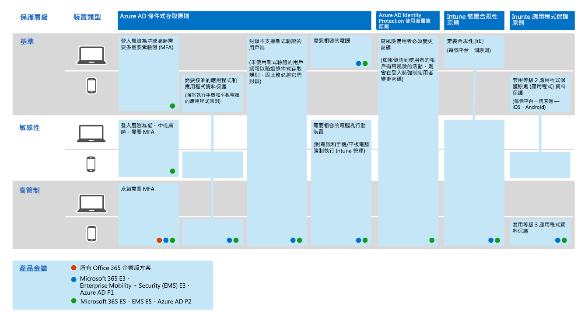

# 一般身分識別與裝置存取原則
本文說明保護雲端服務存取權的常見建議原則，包括使用 Azure AD 應用程式 Proxy 發佈的內部部署應用程式。 

本指南討論如何在新布建的環境中部署建議的原則。 在不同的實驗室環境中設定這些原則，可讓您瞭解並評估建議的原則，再將首輾轉移至您的預製和實際執行環境。 您的新布建環境可能是僅限雲端或混合式的。  

## 原則集 

下圖說明建議的原則組。 它會顯示每個原則套用至哪個層級的保護，以及這些原則套用至電腦或電話和平板電腦，或是這兩種裝置的類別。 它也會指出設定這些原則的位置。

本文的其餘部分將說明如何設定這些原則。 

建議您先使用多重要素驗證，再將裝置登記到 Intune 中，以確保裝置已擁有預定的使用者。 您也必須在強制裝置符合性原則之前，在 Intune 中註冊裝置。

為了讓您有時間完成這些工作，建議您依照此表中所列的順序實施基準原則。 不過，您可以隨時實施機密和高管制保護的 MFA 原則。

|保護層級|原則|詳細資訊|
|:---------------|:-------|:----------------|
|**Baseline**|[當登入風險為*中*或*高*時，需要 MFA](#require-mfa-based-on-sign-in-risk)| |
|        |[封鎖不支援新式驗證的用戶端](#block-clients-that-dont-support-modern-authentication)|未使用新式驗證的用戶端可以略過條件式存取規則，因此請務必封鎖這些|
|        |[高風險使用者必須變更密碼](#high-risk-users-must-change-password)|當偵測到其帳戶的高風險活動時，強制使用者在登入時變更其密碼。|
|        |[定義應用程式保護原則](#define-app-protection-policies)|每個平臺的一個原則（iOS、Android、Windows）。|
|        |[需要支援 Intune 應用程式保護原則的應用程式](#require-apps-that-support-intune-app-protection-policies)|強制執行手機和平板電腦的行動裝置應用程式保護|
|        |[定義裝置合規性原則](#define-device-compliance-policies)|每個平臺一個原則|
|        |[需要相容的電腦](#require-compliant-pcs-but-not-compliant-phones-and-tablets)|強制執行電腦的 Intune 管理|
|**敏感性**|[當登入風險為*低*、*中*或*高*時，需要 MFA](#require-mfa-based-on-sign-in-risk)| |
|         |[需要相容*的電腦和*行動裝置](#require-compliant-pcs-and-mobile-devices)|強制進行電腦和電話/平板電腦的 Intune 管理|
|**高管制**|[*永遠*需要 MFA](#require-mfa-based-on-sign-in-risk)|
| | |

## 指派原則給使用者
設定原則之前，請先識別您針對每個保護層所使用的 Azure AD 群組。 一般會將基準保護套用至組織中的每個人。 包含在基線及敏感保護中的使用者，將會套用所有的基準原則，加上機密原則。 保護是累積的，且強制執行限制性最強的原則。 

建議的做法是建立 Azure AD 群組，以進行條件式存取排除。 將此群組新增至 [Exclude] 底下的所有條件式存取規則。 這可讓您在疑難排解存取問題時，提供使用者存取的方法。 這只是建議的臨時解決方案。 監視此群組中的變更，並確定排除群組的使用只是預定的。 

下圖提供使用者指派及排除的範例。

在插圖中，「主要機密專案 X 小組」已被指派一個條件式存取原則，需要*一定*要進行 MFA。 對使用者套用較高級別的保護時請務必合理。 在每次登入時，此專案小組的成員必須提供兩種形式的驗證，即使他們不會查看高管制內容也是一樣。  

在這些建議中建立的所有 Azure AD 群組都必須建立為 Office 365 群組。 在 SharePoint Online 中保護文件時，這對於部署 Azure 資訊保護 (AIP) 特別重要。

## 需要根據登入風險進行 MFA
在要求 MFA 之前，請先使用 Identity Protection MFA 註冊原則，為 MFA 註冊使用者。 使用者註冊後，您可以強制進行 MFA 以進行登入。 必要條件[工作](identity-access-prerequisites.md)包含向 MFA 註冊所有使用者。

若要建立新的條件式存取原則： 

1. 前往[ Azure 入口網站](https://portal.azure.com)，並使用您的認證登入。 成功登入後，您會看到 [Azure 儀表板]。

2. 從左功能表選擇 [Azure Active Directory]。

3. 在 [安全性] 區段下，選擇 [條件式存取]。

4. 選擇 [新增原則]。

 下表說明要為此原則執行的條件式存取原則設定。

**指派**

|類型|屬性|值|附註|
|:---|:---------|:-----|:----|
|使用者和群組|Include|選取使用者和群組 - 選取包含目標使用者的特定安全性群組|從包含試驗使用者的安全性群組開始|
||排除|例外狀況安全性群組；服務帳戶 (應用程式身分識別)|在需要的暫存基礎上修改成員資格|
|雲端應用程式|Include|選取您要套用此規則的應用程式。 例如，選取 Office 365 Exchange Online||
|條件|已設定|是|進行您環境和需求的特定設定|
|登入風險|風險層級||請參閱下表中的指南。|

**登入風險**

根據目標的保護層級套用設定。

|屬性	|保護層級|值|附註|
|:---|:---------|:-----|:----|
|風險層級|基準|高、中|檢查兩者|
| |敏感性|高、中、低|三個全選|
| |高管制| |保留所有選項的選取狀態，永遠強制執行 MFA|

**存取控制**

|類型|屬性|值|附註|
|:---|:---------|:-----|:----|
|授與|授予存取|True|已選取|
||需要 MFA|True|Check|
||要求裝置標示為相容|False||
||需要混合 Azure 已加入 Azure 裝置|False||
||需要核准的用戶端應用程式|False||
||需要所有選取的控制項|True|已選取|

> [!NOTE]
> 請**選擇 [** 啟用]，以確定啟用此原則。 此外，請考慮使用[if](https://docs.microsoft.com/azure/active-directory/active-directory-conditional-access-whatif)工具來測試原則。

## 封鎖不支援新式驗證的用戶端
1. 前往[ Azure 入口網站](https://portal.azure.com)，並使用您的認證登入。 成功登入後，您會看到 [Azure 儀表板]。

2. 從左功能表選擇 [Azure Active Directory]。

3. 在 [安全性] 區段下，選擇 [條件式存取]。

4. 選擇 [新增原則]。

下表說明要為此原則執行的條件式存取原則設定。

**指派**

|類型|屬性|值|附註|
|:---|:---------|:-----|:----|
|使用者和群組|Include|選取使用者和群組 - 選取包含目標使用者的特定安全性群組|從包含試驗使用者的安全性群組開始|
||排除|例外狀況安全性群組；服務帳戶 (應用程式身分識別)|視需要暫時修改成員資格|
|雲端應用程式|Include|選取您要套用此規則的應用程式。 例如，選取 Office 365 Exchange Online||
|條件|已設定|是|設定用戶端應用程式|
|用戶端應用程式|已設定|是|行動裝置應用程式和桌面用戶端，其他用戶端（同時選取兩者）|

**存取控制**

|類型|屬性|值|附註|
|:---|:---------|:-----|:----|
|授與|封鎖存取|True|已選取|
||需要 MFA|False||
||要求裝置標示為相容|False||
||需要混合 Azure 已加入 Azure 裝置|False||
||需要核准的用戶端應用程式|False||
||需要所有選取的控制項|True|已選取|

> [!NOTE]
> 請**選擇 [** 啟用]，以確定啟用此原則。 此外，請考慮使用[if](https://docs.microsoft.com/azure/active-directory/active-directory-conditional-access-whatif)工具來測試原則。

## 高風險使用者必須變更密碼
若要確定登入時，強制所有高風險使用者的受損帳戶執行密碼變更，您必須套用下列原則。

Log in to the [Microsoft Azure portal (https://portal.azure.com)](https://portal.azure.com/) with your administrator credentials, and then navigate to **Azure AD Identity Protection > User Risk Policy**.

**指派**

|類型|屬性|值|附註|
|:---|:---------|:-----|:----|
|使用者|Include|所有使用者|已選取|
||排除|無||
|條件|使用者風險|高|已選取|

**控制項**

| 類型 | 屬性 | 值                  | 附註 |
|:-----|:-----------|:------------------------|:------|
|      | Access     | 允許存取            | True  |
|      | 存取     | 需要密碼變更 | True  |

**複查：** 不適用

> [!NOTE]
> 請**選擇 [** 啟用]，以確定啟用此原則。 此外，請考慮使用[if](https://docs.microsoft.com/azure/active-directory/active-directory-conditional-access-whatif)工具來測試原則

## 定義應用程式保護原則
應用程式保護原則（應用程式）定義允許哪些應用程式，以及可對組織的資料採取的動作。 應用程式中的可用選項可讓組織針對其特定需求量身定制防護。 在某些情況下，可能不會很顯然，執行完整案例需要哪些原則設定。 為了協助組織優先考慮行動用戶端端點強化，Microsoft 已引進其應用程式資料保護架構的分類，以供 iOS 和 Android 行動應用程式管理。 

應用程式資料保護架構分為三個不同的設定層級，每個層級都是以舊版為基礎： 

- 企業基本資料保護可確保使用 PIN 碼保護應用程式，並執行選擇性的清除作業。 針對 Android 裝置，此層級會驗證 Android 裝置認證。 這是一種入門級的設定，可在 Exchange Online 信箱原則中提供類似的資料保護控制，並將其和使用者對應用程式的人口介紹。 
- 企業增強型資料保護引進應用程式資料洩漏防護機制和最低作業系統需求。 這是適用于大多數行動使用者存取工作或學校資料的設定。 
- 企業高資料保護引進了高級資料保護機制、增強型 PIN 設定，以及應用程式行動威脅防禦。 這種設定對存取高風險資料的使用者而言是必要的。 

若要查看每個設定層級的特定建議，以及必須保護的最小應用程式，請[使用 app protection 原則，查看資料保護框架](https://docs.microsoft.com/mem/intune/apps/app-protection-framework)。 

使用身分[識別與裝置存取](microsoft-365-policies-configurations.md)設定中所述的原則，比較基準和機密保護階層與第2級企業增強型資料保護設定緊密對應。 高度管制防護階層密切對應于第3級企業高資料保護設定。

|保護層級 |應用程式保護原則  |詳細資訊  |
|---------|---------|---------|
|基準     | [第2級增強型資料保護](https://docs.microsoft.com/mem/intune/apps/app-protection-framework#level-2-enterprise-enhanced-data-protection)        | 在層級2中強制執行的原則設定包括對層級1建議的所有原則設定，而且只會新增或更新下列原則設定，以執行更多控制項，以及比第1級更複雜的設定。         |
|敏感性     | [第2級增強型資料保護](https://docs.microsoft.com/mem/intune/apps/app-protection-framework#level-2-enterprise-enhanced-data-protection)        | 在層級2中強制執行的原則設定包括對層級1建議的所有原則設定，而且只會新增或更新下列原則設定，以執行更多控制項，以及比第1級更複雜的設定。        |
|高度管制     | [第3級企業高資料保護](https://docs.microsoft.com/mem/intune/apps/app-protection-framework#level-3-enterprise-high-data-protection)        | 在層級3中強制執行的原則設定包括對層級1和2建議的所有原則設定，而且只會新增或更新下列原則設定，以執行更多控制措施，以及比第2級更為複雜的設定。        |

若要使用 data protection framework 設定，為 Microsoft 端點管理員中的每個平臺（iOS 和 Android）建立新的應用程式保護原則，管理員可以：
1. 遵循[如何使用 Microsoft Intune 建立及部署應用程式保護原則](https://docs.microsoft.com/mem/intune/apps/app-protection-policies)的步驟，手動建立原則。
2. 使用[intune 的 PowerShell 腳本](https://github.com/microsoftgraph/powershell-intune-samples)，匯入範例[Intune App Protection POLICY Configuration Framework JSON 範本](https://github.com/microsoft/Intune-Config-Frameworks/tree/master/AppProtectionPolicies)。

## 需要支援 Intune 應用程式保護原則的應用程式
使用條件式存取，組織可以限制存取已核准（支援新式驗證）的 iOS 和 Android 用戶端應用程式（適用于已套用的 Intune 應用程式保護原則）。 需要多個條件式存取原則，每個原則都針對所有潛在的使用者。 [如需使用條件式存取來存取 cloud app](https://docs.microsoft.com/azure/active-directory/conditional-access/app-protection-based-conditional-access)，請參閱建立這些原則的詳細資料。

1. 請遵循「步驟1：設定 Office 365 的 Azure AD 條件式存取原則」（[案例1： office 365 應用程式需要已核准的應用程式，其應用程式保護原則](https://docs.microsoft.com/azure/active-directory/conditional-access/app-protection-based-conditional-access#scenario-1-office-365-apps-require-approved-apps-with-app-protection-policies)可允許 Outlook IOS 和 Android，但封鎖 OAuth 功能的 Exchange ActiveSync 用戶端無法連線至 Exchange Online）。

   > [!NOTE]
   > 這種原則可確保行動使用者可以使用適用的應用程式來存取所有 Office 端點。

2. 若啟用對 Exchange Online 的行動存取，請執行[封鎖 ActiveSync 用戶端](secure-email-recommended-policies.md#block-activesync-clients)，以防止 Exchange ActiveSync 用戶端利用基本驗證連線至 Exchange Online。

   上述原則利用授與控制措施[需要核准的用戶端應用程式](https://docs.microsoft.com/azure/active-directory/conditional-access/concept-conditional-access-grant#require-approved-client-app)，並[要求應用程式保護原則](https://docs.microsoft.com/azure/active-directory/conditional-access/concept-conditional-access-grant#require-app-protection-policy)。

3. 停用 iOS 和 Android 裝置上之其他用戶端應用程式的舊版驗證。 如需詳細資訊，請參閱[封鎖不支援新式驗證的用戶端](#block-clients-that-dont-support-modern-authentication)。

## 定義裝置合規性原則

裝置合規性原則定義裝置必須遵循的需求，才能標示為相容。 從 Azure 入口網站中建立 Intune 裝置相容性原則。 

建立每個平臺的原則：
- Android
- Android 企業版
- iOS
- macOS
- 此設定適用於下列類型的裝置：
- Windows 8.1 和更新版本
- Windows 10 和更新版本

若要建立裝置相容性原則，請使用您的管理認證登入 Microsoft Azure 入口網站，然後流覽至**Intune > 裝置相容性**。 選取 [建立原則]****。

Windows 10 建議使用下列設定。

**裝置健康情況： Windows 健康認證服務評估規則**

|屬性|值|附註|
|:---------|:-----|:----|
|需要 BitLocker|需要||
|需要在裝置上啟用安全啟動|需要||
|需要程式碼完整性|需要||

**裝置內容**

|類型|屬性|值|附註|
|:---|:---------|:-----|:----|
|作業系統版本|全部|尚未設定||

針對所有要視為已部署的上述原則，必須將它們的目標設為使用者群組。 若要執行此動作，請在 [**原則**] 區段中，選取 [**管理部署**] （與 [新增] 的等級相同），以建立原則（儲存時）或更新版本。

**系統安全性**

|類型|屬性|值|附註|
|:---|:---------|:-----|:----|
|密碼|需要密碼以解除鎖定行動裝置|需要||
||簡單密碼|封鎖||
||密碼類型|裝置預設值||
||密碼最小長度|6 ||
||需要密碼的最長空閒分鐘數|15 |此設定支援 Android 版本4.0 和更新版本，或在 KNOX 4.0 及以上版本。 IOS 裝置的支援 iOS 8.0 和更新版本|
||密碼到期（天數）|41||
||可避免重複使用的先前密碼數目|5 ||
||當裝置從空閒狀態傳回時需要密碼（行動裝置和全息版）|需要|適用于 Windows 10 和更新版本|
|加密|裝置上的資料儲存區加密|需要||
|裝置安全性|防火牆|需要||
||防毒|需要||
||間諜|需要|此設定需要使用 Windows Security Center 註冊的反間諜軟體方案|
|後衛|Windows Defender 反惡意程式碼|需要||
||Windows Defender 反惡意軟體最低版本||僅支援 Windows 10 desktop。 Microsoft 建議的版本不會超過最新版本五個以上的版本|
||最新的 Windows Defender 反惡意軟體簽名|需要||
||即時保護|需要|僅支援 Windows 10 desktop|

**Microsoft Defender ATP**

|類型|屬性|值|附註|
|:---|:---------|:-----|:----|
|Microsoft Defender 高級威脅防護規則|需要裝置位於或低於機器風險分數|中||

## 需要相容的電腦（但不符合相容的電話和平板電腦）
在新增要要求相容的電腦的原則之前，請務必在 Intune 中註冊要管理的裝置。 建議您先使用多重要素驗證，再將裝置登記到 Intune 中，以確保裝置已擁有預定的使用者。 

若要要求相容的電腦：

1. 前往[ Azure 入口網站](https://portal.azure.com)，並使用您的認證登入。 成功登入後，您會看到 [Azure 儀表板]。

2. 從左功能表選擇 [Azure Active Directory]。

3. 在 [安全性] 區段下，選擇 [條件式存取]。

4. 選擇 [新增原則]。

5. 輸入原則名稱，然後選擇您想要套用原則的**使用者與群組**。

6. 選擇 [雲端應用程式]。

7. 選擇 [**選取應用程式**]，從 [**雲端應用程式**] 清單中選取所需的應用程式。 例如，選取 [Office 365 Exchange Online]。 選擇 [**選取**並**完成**]。

8. 若要要求相容的電腦，但不相容的電話和平板電腦，請選擇 [**條件**] 和 [**裝置平臺**]。 選擇 [**選取裝置平臺**]，然後選取 [ **Windows**和**macOS**]。

9. 選擇 [存取控制] 區段中的 [授與]。

10. 選擇 **[授與存取**]，選取 [**要求裝置標示為相容**]。 如果是多個控制項，請選取 **[要求所有選取的控制項**]，然後選擇 [**選取**]。 

11. 	選擇 **[建立]**。

如果您的目標是需要相容的電腦*和*行動裝置，請勿選取 [平臺]。 這會強制執行所有裝置的相容性。 

## 需要相容*的電腦和*行動裝置

若要要求所有裝置的相容性：

1. 前往[ Azure 入口網站](https://portal.azure.com)，並使用您的認證登入。 成功登入後，您會看到 [Azure 儀表板]。

2. 從左功能表選擇 [Azure Active Directory]。

3. 在 [安全性] 區段下，選擇 [條件式存取]。

4. 選擇 [新增原則]。

5. 輸入原則名稱，然後選擇您想要套用原則的**使用者與群組**。

6. 選擇 [雲端應用程式]。

7. 選擇 [**選取應用程式**]，從 [**雲端應用程式**] 清單中選取所需的應用程式。 例如，選取 [Office 365 Exchange Online]。 選擇 [**選取**並**完成**]。

8. 選擇 [存取控制] 區段中的 [授與]。

9. 選擇 **[授與存取**]，選取 [**要求裝置標示為相容**]。 如果是多個控制項，請選取 **[要求所有選取的控制項**]，然後選擇 [**選取**]。 

10. 	選擇 **[建立]**。

建立此原則時，請勿選取 [平臺]。 這會強制執行相容性裝置。

## 後續步驟

[了解保護電子郵件的原則建議](secure-email-recommended-policies.md)
