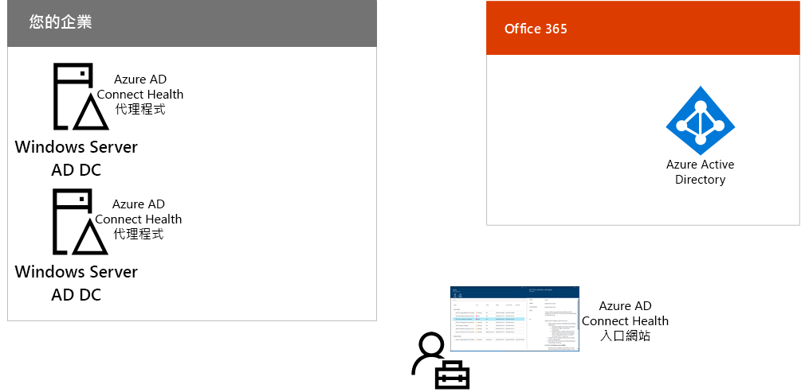

# 步驟 3：設定混合式身分識別

## 同步處理身分識別

此為混合式環境的必要步驟，且同時適用於 Microsoft 365 企業版 E3 和 E5 版本**

在這一節當中，您會將內部部署 Active Directory Domain Services (AD DS) 與 Azure Active Directory (Azure AD) 租用戶同步處理 (後者由您的 Office 365 與企業行動力 + 安全性 (EMS) 訂用帳戶使用)。

Azure AD Connect 是支援的 Microsoft 工具，可逐步引導您將單一或多個樹系 AD DS 環境之中您真正需要的身分識別，同步處理至 Azure AD 租用戶。 下圖顯示 Azure AD Connect 同步處理的基本程序。

1. 在伺服器上執行的 Azure AD Connect 會輪詢 AD DS 以了解帳戶、群組和連絡人是否有變更。
2. Azure AD Connect 會將這些變更傳送至 Microsoft 365 月租方案的 Azure AD 租用戶。

混合式身分識別解決方案中的第一個決策是驗證需求。選項如下：

- 使用**受控驗證**，Azure AD 會處理使用者登入的驗證程序。受控驗證有兩種方法： 
    - **密碼雜湊同步處理 (PHS)** [某些進階功能的建議和必要方法]。 這是最簡單的方法，可為 Azure AD 中的內部部署目錄物件啟用驗證功能。 Azure AD Connect 會從 AD DS 擷取雜湊的密碼、對密碼進行額外的安全性處理，並將其儲存在 Azure AD 中。 如需詳細資訊，請參閱[使用 Azure AD Connect 同步實作密碼雜湊同步處理](https://docs.microsoft.com/azure/active-directory/connect/active-directory-aadconnectsync-implement-password-synchronization)。
    - **傳遞驗證 (PTA)**，會針對以 Azure AD 為基礎的服務提供簡單的密碼驗證解決方案。 PTA 會使用在一或多個內部部署伺服器上執行的代理程式來直接向內部部署 AD DS 驗證使用者驗證。 如需詳細資訊，請參閱[使用 Azure Active Directory 傳遞驗證的使用者登入](https://docs.microsoft.com/azure/active-directory/connect/active-directory-aadconnect-pass-through-authentication)。
- 使用**同盟驗證**，在使用者登入時，會透過身分識別同盟伺服器 (例如 Active Directory 同盟服務 (AD FS))，將驗證程序重新導向到另一個身分識別提供者。身分識別提供者可以提供額外的驗證方法，例如智慧卡驗證。如需詳細資訊，請參閱[針對 Azure Active Directory 混合式身分識別解決方案選擇正確的驗證方法](https://docs.microsoft.com/azure/security/azure-ad-choose-authn)。

在您決定混合式身分識別解決方案之後，請下載並執行 [IdFix 目錄同步處理錯誤修復工具](https://www.microsoft.com/download/details.aspx?id=36832)來分析 AD DS 的問題。

解決由 IdFix 工具找出的所有問題之後，請參閱[使用 Azure AD Connect 同步來實作密碼雜湊同步處理](https://docs.microsoft.com/azure/active-directory/connect/active-directory-aadconnectsync-implement-password-hash-synchronization)，了解如何安裝 Azure AD Connect 工具、設定內部部署 AD DS 和 Office 365 與 EMS 訂用帳戶的 Azure AD 租用戶之間的目錄同步處理。 開始同步處理之後，您要使用內部部署身分識別提供者 (例如 AD DS) 維護使用者帳戶和群組。

Microsoft 會針對[身分識別與裝置存取](microsoft-365-policies-configurations.md)提供一組建議，以確保安全且具有生產力的員工。 

- 如需混合式環境的建議需求，請參閱[必要條件](identity-access-prerequisites.md#prerequisites)中的 [Active Directory 與密碼雜湊同步處理]**** 資料行。 

- 如需僅雲端環境的建議需求，請參閱[必要條件](identity-access-prerequisites.md#prerequisites)中的 [僅雲端]**** 資料行。

內部部署使用者和群組出現在 Azure AD 後，您就可以開始指派授權及使用 Exchange Online。 若要向使用者推行 Exchange Online，並遷移內部部署信箱，請參閱[針對 Microsoft 365 企業版部署 Exchange Online](exchangeonline-workload.md)。

|||
|:-------|:-----|
|| [測試實驗室指南：密碼雜湊同步處理](password-hash-sync-m365-ent-test-environment.md)  [測試實驗室指南：傳遞驗證](pass-through-auth-m365-ent-test-environment.md) |
|||

作為過渡期的檢查點，您可以看到對應至這一節的[允出準則](identity-exit-criteria.md#crit-identity-sync)。

## 監控同步處理健康情況

此為選用步驟，且同時適用於 Microsoft 365 企業版 E3 和 E5 版本**

在這一節中，您會在每個內部部署身分識別伺服器上安裝 Azure AD Connect Health 代理程式，以監控您的身分識別基礎結構，以及由 Azure AD Connect 提供的同步處理服務。 監控資訊會在 Azure AD Connect Health 入口網站提供，您可以在其中檢視警訊、效能監控、使用量分析及其他資訊。

如何使用 Azure AD Connect Health 的關鍵設計決策取決於您如何使用 Azure AD Connect：

- 如果您使用的是**受管理的驗證**選項，請先從[使用 Azure AD Connect Health 搭配同步處理](https://docs.microsoft.com/azure/active-directory/connect-health/active-directory-aadconnect-health-sync)開始，以了解並設定 Azure AD Connect Health。
- 如果您使用**同盟驗證**搭配 Active Directory 同盟服務 (AD FS) 來同步處理帳戶及群組名稱，請先從[使用 Azure AD Connect Health 搭配 AD FS](https://docs.microsoft.com/azure/active-directory/connect-health/active-directory-aadconnect-health-adfs) 開始，以了解並設定 Azure AD Connect Health。

完成這一節後的結果：

- 已在內部部署身分識別提供者伺服器上安裝 Azure AD Connect Health 代理程式。
- Azure AD Connect Health 入口網站會顯示您內部部署基礎結構和同步處理活動的目前狀態以及 Office 365 和 EMS 訂閱的 Azure AD 租用戶。

作為過渡期的檢查點，您可以看到這一節的[允出準則](identity-exit-criteria.md#crit-identity-sync-health)。

## 下一步

|||
|:-------|:-----|
| [設定安全的使用者驗證](identity-multi-factor-authentication.md)
