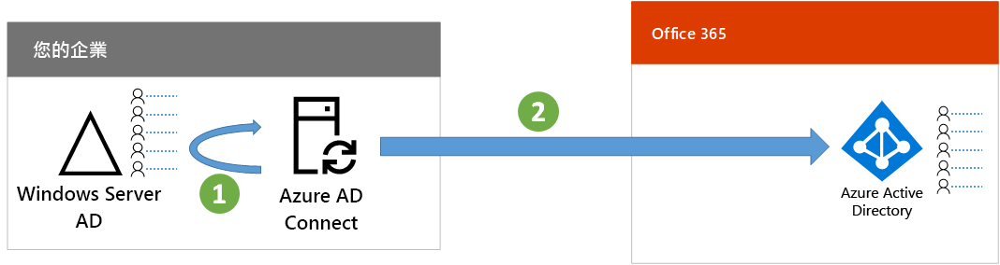

# 步驟 7：同步處理身分識別

*此為混合式環境的必要步驟，且同時適用於 Microsoft 365 企業版 E3 和 E5 版本*

在此步驟中，您會將內部部署 Windows Server Active Directory (AD) 與 Azure Active Directory (AD) 租用戶同步處理 (後者由您的 Office 365 與企業行動力 + 安全性 (EMS) 訂用帳戶使用)。

Azure AD Connect 是支援的 Microsoft 工具，可逐步引導您將單一或多個樹系 Windows Server AD 環境之中您真正需要的身分識別，同步處理至 Azure AD 租用戶。

*Azure AD Connect 如何同步處理內部部署目錄與 Azure AD*

混合式身分識別解決方案中的第一個決策是驗證需求。選項如下：

- 使用**受控驗證**，Azure AD 會處理使用者登入的驗證程序。受控驗證有兩種方法： 
    - **密碼雜湊同步處理 (PHS)** [建議使用，對某些進階功能來說是必要的]。這是為 Azure AD 中內部部署目錄物件啟用驗證最簡單的方法。Azure AD Connect 會從 Windows Server AD 擷取雜湊的密碼、對密碼進行額外的安全處理，然後將其儲存在 Azure AD 中。如需詳細資訊，請參閱[使用 Azure AD Connect 同步來實作密碼雜湊同步處理](https://docs.microsoft.com/azure/active-directory/connect/active-directory-aadconnectsync-implement-password-synchronization)。
    - **通過驗證 (PTA)** 為 Azure AD 的服務提供簡單的密碼驗證解決方案。PTA 會使用在一或多個內部部署伺服器上執行的代理程式，直接向內部部署 Windows Server AD 驗證使用者。如需詳細資訊，請參閱[以 Azure Active Directory 通過驗證進行使用者登入](https://docs.microsoft.com/azure/active-directory/connect/active-directory-aadconnect-pass-through-authentication)。
- 使用**同盟驗證**，在使用者登入時，會透過身分識別同盟伺服器 (例如 Active Directory 同盟服務 (AD FS))，將驗證程序重新導向到另一個身分識別提供者。身分識別提供者可以提供額外的驗證方法，例如智慧卡驗證。如需詳細資訊，請參閱[針對 Azure Active Directory 混合式身分識別解決方案選擇正確的驗證方法](https://docs.microsoft.com/azure/security/azure-ad-choose-authn)。

在您決定混合式身分識別解決方案之後，請下載並執行 [IdFix 目錄同步處理錯誤修復工具](https://www.microsoft.com/download/details.aspx?id=36832)來分析 Windows Server AD 的問題。

解決由 IdFix 工具找出的所有問題之後，請參閱[使用 Azure AD Connect 同步來實作密碼雜湊同步處理](https://docs.microsoft.com/azure/active-directory/connect/active-directory-aadconnectsync-implement-password-hash-synchronization)，了解如何安裝 Azure AD Connect 工具、設定內部部署 Windows Server AD 和 Office 365 與 EMS 訂用帳戶的 Azure AD 租用戶之間的目錄同步處理。開始同步處理之後，您要使用內部部署身分識別提供者 (例如 Windows Server AD) 維護使用者帳戶和群組。

Microsoft 會針對[身分識別與裝置存取](microsoft-365-policies-configurations.md)提供一組建議，以確保安全且具有生產力的員工。 
- 如需混合式環境的建議需求，請參閱[必要條件](identity-access-prerequisites.md#prerequisites)中的 [Active Directory 與密碼雜湊同步處理]**** 資料行。 

- 如需僅雲端環境的建議需求，請參閱[必要條件](identity-access-prerequisites.md#prerequisites)中的 [僅雲端]**** 資料行。

|||
|:-------|:-----|
|| [測試實驗室指南：密碼雜湊同步處理](password-hash-sync-m365-ent-test-environment.md)  [測試實驗室指南：傳遞驗證](pass-through-auth-m365-ent-test-environment.md) |
|||

作為過渡期的檢查點，您可以看到此步驟的[允出準則](identity-exit-criteria.md#crit-identity-sync)。

## 下一步

|||
|:-------|:-----|
|| [監控同步處理健康情況](identity-azure-ad-connect-health.md) |

